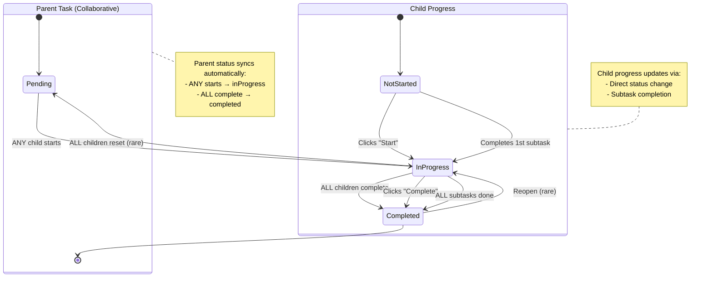

# Collaborative Task Status Sync — Complete Guide

**Module:** task.module + taskProgress.module  
**Version:** 3.0 — Enhanced Auto-Sync  
**Last Updated:** 27-03-26  
**Figma Reference:** `figma-asset/app-user/group-children-user/home-flow.png`, `task-monitoring-flow-01.png`

---

## 📋 Overview

This document explains the **enhanced collaborative task status synchronization** system that automatically updates the parent task status based on children's progress.

### **Key Features:**
1. ✅ **ANY child starts** → Parent task becomes "inProgress"
2. ✅ **ALL children complete** → Parent task becomes "completed"
3. ✅ **ALL subtasks completed** → Child's taskProgress auto-completes
4. ✅ **Real-time updates** → Parent dashboard syncs instantly via Socket.io

---

## 🎯 Complete Status Sync Logic

### **Parent Task Status Determination**

```typescript
if (ALL children completed) {
  parentTask.status = "completed"
  parentTask.completedAt = new Date()
} 
else if (ANY child started) {  // NOT_STARTED count < total
  parentTask.status = "inProgress"
  parentTask.startTime = startTime || new Date()
}
else {
  // All children still notStarted
  parentTask.status = "pending"
}
```

### **State Transition Table**

| Scenario | Child 1 | Child 2 | Child 3 | Parent Task Status |
|----------|---------|---------|---------|-------------------|
| Initial  | ⏳ notStarted | ⏳ notStarted | ⏳ notStarted | ⏳ **pending** |
| Child 1 starts | 🔄 inProgress | ⏳ notStarted | ⏳ notStarted | 🔄 **inProgress** ✅ |
| Child 2 starts | 🔄 inProgress | 🔄 inProgress | ⏳ notStarted | 🔄 **inProgress** (stays) |
| Child 1 completes | ✅ completed | 🔄 inProgress | ⏳ notStarted | 🔄 **inProgress** (stays) |
| Child 3 starts | ✅ completed | 🔄 inProgress | 🔄 inProgress | 🔄 **inProgress** (stays) |
| Child 2 completes | ✅ completed | ✅ completed | 🔄 inProgress | 🔄 **inProgress** (stays) |
| **Child 3 completes** | ✅ completed | ✅ completed | ✅ completed | ✅ **completed** ✅ |

---

## 🏗️ Architecture

### **Complete Flow Diagram**

```
┌──────────────┐     ┌──────────────┐     ┌──────────────┐
│   Child 1    │     │   Child 2    │     │   Child 3    │
└──────┬───────┘     └──────┬───────┘     └──────┬───────┘
       │                    │                    │
       │ PUT /task-progress/:taskId/status       │
       └────────────────────┼────────────────────┘
                            │
                            ▼
                 ┌──────────────────────────┐
                 │   TaskProgress Service   │
                 │                          │
                 │ 1. Update child progress │
                 │ 2. Count by status       │
                 │ 3. Sync parent task      │
                 └──────────┬───────────────┘
                            │
              ┌─────────────┴─────────────┐
              │                           │
              ▼                           ▼
    ┌──────────────────┐        ┌──────────────────┐
    │ TaskProgress     │        │ Parent Task      │
    │ (per child)      │        │ (auto-synced)    │
    │ { status:        │        │ { status:        │
    │   "completed" }  │        │   "inProgress"   │
    │   or "inProgress"│        │   or "completed" }
    └──────────────────┘        └──────────────────┘
                                         │
                                         ▼
                                  ┌──────────────────┐
                                  │ Socket.io Event  │
                                  │ task:status-synced│
                                  └────────┬─────────┘
                                           │
                                           ▼
                                  ┌──────────────────┐
                                  │ Parent Dashboard │
                                  │ Real-time Update │
                                  └──────────────────┘
```

---

## 🔌 API Endpoints

### **1. Update Task Progress (Collaborative Tasks)**

```typescript
PUT /task-progress/:taskId/status

// Request Body
{
  "status": "inProgress"  // "notStarted" | "inProgress" | "completed"
}

// Response
{
  "success": true,
  "message": "Progress updated successfully",
  "data": {
    "_id": "progressId123",
    "taskId": "taskId123",
    "userId": "childUserId",
    "status": "inProgress",
    "startedAt": "2026-03-27T10:30:00.000Z",
    "progressPercentage": 0
  },
  "meta": {
    "parentTaskSynced": true,
    "parentTaskStatus": "inProgress"
  }
}

// ⚡ REAL-TIME EVENT Emitted (via Socket.io)
// Room: task:taskId123
// Event: task:status-synced
{
  "taskId": "taskId123",
  "status": "inProgress",
  "completedCount": 0,
  "totalAssignedUsers": 3,
  "syncedAt": "2026-03-27T10:30:00.000Z",
  "syncedBy": "system",
  "reason": "children_progress_updated"
}
```

---

### **2. Complete Subtask (Auto-completes Task if All Done)**

```typescript
PUT /task-progress/:taskId/subtasks/:subtaskIndex/complete

// Request Body: None (subtask index in URL)

// Response
{
  "success": true,
  "message": "Subtask completed successfully",
  "data": {
    "_id": "progressId123",
    "taskId": "taskId123",
    "userId": "childUserId",
    "status": "completed",  // ✅ Auto-completed!
    "completedAt": "2026-03-27T10:35:00.000Z",
    "progressPercentage": 100,
    "completedSubtaskIndexes": [0, 1, 2, 3, 4]
  },
  "meta": {
    "allSubtasksCompleted": true,
    "taskAutoCompleted": true,
    "parentTaskSynced": true,
    "parentTaskStatus": "completed"
  }
}
```

---

## 🆕 New Implementation Details

### **Method: `syncParentTaskStatusWithChildrenProgress(taskId)`**

**Location:** `src/modules/taskProgress.module/taskProgress.service.ts` (lines 244-337)

**What It Does:**
1. Verifies task is collaborative
2. Gets all assigned user IDs
3. Queries all TaskProgress records
4. Counts by status: `notStarted`, `completed`
5. Determines parent status:
   - ALL completed → `completed`
   - ANY started → `inProgress`
   - ALL notStarted → `pending`
6. Updates parent task if status changed
7. Emits real-time Socket.io event
8. Invalidates Redis cache

**Code Snippet:**
```typescript
private async syncParentTaskStatusWithChildrenProgress(taskId: string): Promise<void> {
  // 1. Verify collaborative task
  const task = await Task.findById(taskId).lean();
  if (!task || task.taskType !== TaskType.COLLABORATIVE) {
    return;
  }

  // 2. Get all assigned users
  const assignedUserIds = task.assignedUserIds || [];
  
  // 3. Get all progress records
  const allProgress = await this.model.find({
    taskId: new Types.ObjectId(taskId),
    userId: { $in: assignedUserIds.map(id => new Types.ObjectId(id)) },
    isDeleted: false,
  }).lean();

  // 4. Count by status
  const notStartedCount = allProgress.filter(
    p => p.status === TaskProgressStatus.NOT_STARTED
  ).length;
  
  const completedCount = allProgress.filter(
    p => p.status === TaskProgressStatus.COMPLETED
  ).length;

  const totalAssignedUsers = assignedUserIds.length;

  // 5. Determine parent status
  let newParentStatus: TaskStatus | null = null;

  if (completedCount === totalAssignedUsers) {
    newParentStatus = TaskStatus.COMPLETED;
  } else if (notStartedCount < totalAssignedUsers) {
    newParentStatus = TaskStatus.IN_PROGRESS;
  }

  // 6. Update parent task if needed
  if (newParentStatus && task.status !== newParentStatus) {
    await Task.findByIdAndUpdate(
      new Types.ObjectId(taskId),
      {
        status: newParentStatus,
        ...(newParentStatus === TaskStatus.COMPLETED && {
          completedAt: new Date(),
        }),
        ...(newParentStatus === TaskStatus.IN_PROGRESS && {
          startTime: task.startTime || new Date(),
        }),
      },
      { new: true },
    );

    // Emit real-time event
    socketService.emitToRoom(`task:${taskId}`, 'task:status-synced', {
      taskId,
      status: newParentStatus,
      completedCount,
      totalAssignedUsers,
      syncedAt: new Date(),
      syncedBy: 'system',
      reason: 'children_progress_updated',
    });
  }
}
```

---

### **Method: `completeSubtask()` — Enhanced**

**Location:** `src/modules/taskProgress.module/taskProgress.service.ts` (lines 361-441)

**New Features:**
1. ✅ Tracks completed subtask indexes
2. ✅ Calculates progress percentage
3. ✅ **Auto-completes task** when ALL subtasks done
4. ✅ Syncs parent task status

**Auto-Complete Logic:**
```typescript
// Check if ALL subtasks completed
const totalSubtasks = task.subtasks?.length || 0;
const completedSubtasks = progress.completedSubtaskIndexes.length;

if (completedSubtasks === totalSubtasks && totalSubtasks > 0) {
  // All subtasks completed → mark task as completed
  progress.status = TaskProgressStatus.COMPLETED;
  progress.completedAt = new Date();
  progress.progressPercentage = 100;
}
```

---

## 📊 Complete State Machine



---

## 🔄 Trigger Points

### **When Does Parent Task Status Sync?**

| Action | Trigger Method | Parent Sync? |
|--------|---------------|--------------|
| Child clicks "Start" | `updateProgressStatus("inProgress")` | ✅ Yes |
| Child clicks "Complete" | `updateProgressStatus("completed")` | ✅ Yes |
| Child completes subtask | `completeSubtask(index)` | ✅ Yes |
| Child completes ALL subtasks | `completeSubtask(lastIndex)` | ✅ Yes (auto-complete task + sync) |
| Child resets to "notStarted" | `updateProgressStatus("notStarted")` | ✅ Yes (if last child, parent → pending) |

---

## 🎨 UI State Changes

### **Scenario: Child 1 Starts Working**

**Before:**
```
┌─────────────────────────────────────┐
│  Task: Group Science Project        │
│  Type: Collaborative                │
│  Status: ⏳ Pending                 │
│                                     │
│  👤 Child 1: ⏳ Not Started         │
│  👤 Child 2: ⏳ Not Started         │
│  👤 Child 3: ⏳ Not Started         │
└─────────────────────────────────────┘
```

**After Child 1 Clicks "Start":**
```
┌─────────────────────────────────────┐
│  Task: Group Science Project        │
│  Type: Collaborative                │
│  Status: 🔄 In Progress  ✅ SYNCED  │
│                                     │
│  👤 Child 1: 🔄 In Progress         │
│  👤 Child 2: ⏳ Not Started         │
│  👤 Child 3: ⏳ Not Started         │
│                                     │
│  Started: Jan 5, 10:30 AM           │
└─────────────────────────────────────┘
```

### **Scenario: Child Completes All Subtasks**

**Before (Last Subtask):**
```
┌─────────────────────────────────────┐
│  Task: Group Science Project        │
│  Subtasks: 4/5 completed (80%)      │
│                                     │
│  ☐ Call with design team     ✅     │
│  ☐ Client meeting 10 min     ✅     │
│  ☐ Project planning 30 min   ✅     │
│  ☐ Code review 45 min        ✅     │
│  ☐ Team discuss 20 min       ⏳     │
│                                     │
│  [Complete] ← Button                │
└─────────────────────────────────────┘
```

**After Child Clicks Last Subtask:**
```
┌─────────────────────────────────────┐
│  Task: Group Science Project        │
│  Subtasks: 5/5 completed (100%)     │
│  Status: ✅ Completed  🎉           │
│                                     │
│  ☑ Call with design team     ✅     │
│  ☑ Client meeting 10 min     ✅     │
│  ☑ Project planning 30 min   ✅     │
│  ☑ Code review 45 min        ✅     │
│  ☑ Team discuss 20 min       ✅     │
│                                     │
│  🎉 All subtasks completed!         │
│  Completed: Jan 5, 10:35 AM         │
└─────────────────────────────────────┘
```

---

## 🔐 Permissions & Access Control

| Action | Who Can Do | Endpoint |
|--------|------------|----------|
| **Update own progress** | Assigned child only | `PUT /task-progress/:taskId/status` |
| **Complete subtask** | Assigned child only | `PUT /task-progress/:taskId/subtasks/:index/complete` |
| **View all children progress** | Parent/Teacher | `GET /task-progress/:taskId/children` |
| **Manually override parent status** | Task creator/owner | `PUT /tasks/:id/status` (not recommended for collaborative) |

---

## 🚀 Performance Considerations

### **Caching Strategy**

**Cache Keys:**
```
taskProgress:task:{taskId}:user:{userId}  → Individual progress (5 min TTL)
taskProgress:task:{taskId}:children       → All children progress (3 min TTL)
task:detail:{taskId}                      → Parent task (5 min TTL)
```

**Invalidation:**
- ✅ On every progress update → Invalidate individual + parent cache
- ✅ On subtask completion → Invalidate individual + parent cache
- ✅ On parent status sync → Invalidate parent cache

### **Database Indexes**

```javascript
// TaskProgress collection
db.taskProgress.createIndex({ taskId: 1, userId: 1, isDeleted: 1 });
db.taskProgress.createIndex({ taskId: 1, status: 1, isDeleted: 1 });

// Task collection
db.tasks.createIndex({ taskType: 1, status: 1, isDeleted: 1 });
db.tasks.createIndex({ assignedUserIds: 1 });
```

### **Query Optimization**

- ✅ `.lean()` for all read queries (2-3x memory reduction)
- ✅ Single query to check all children (using `$in`)
- ✅ Early return if not collaborative
- ✅ Non-blocking (errors don't break main flow)

---

## 🧪 Testing Scenarios

### **Test Case 1: First Child Starts**

```
GIVEN: Collaborative task with 3 children assigned
GIVEN: All children status = "notStarted"
GIVEN: Parent task status = "pending"
WHEN: Child 1 clicks "Start"
THEN:
  ✅ Child 1 progress → "inProgress"
  ✅ Parent task status → "inProgress" (auto-synced)
  ✅ Parent task.startTime → set
  ✅ Real-time event emitted
  ✅ Parent dashboard shows "In Progress"
```

### **Test Case 2: Child Completes All Subtasks**

```
GIVEN: Collaborative task with 5 subtasks
GIVEN: Child completed 4/5 subtasks
GIVEN: Child progress = "inProgress"
WHEN: Child completes 5th subtask
THEN:
  ✅ Child progress.completedSubtaskIndexes → [0,1,2,3,4]
  ✅ Child progress.progressPercentage → 100
  ✅ Child progress.status → "completed" (auto)
  ✅ Child progress.completedAt → set
  ✅ Parent task status → check if ALL completed → sync
```

### **Test Case 3: Last Child Completes**

```
GIVEN: Collaborative task with 3 children assigned
GIVEN: Child 1 & 2 already completed
GIVEN: Child 3 status = "inProgress"
GIVEN: Parent task status = "inProgress"
WHEN: Child 3 clicks "Complete"
THEN:
  ✅ Child 3 progress → "completed"
  ✅ Parent task status → "completed" (auto-synced)
  ✅ Parent task.completedAt → set
  ✅ Real-time event: task:status-synced
  ✅ Parent dashboard shows "Completed" 🎉
```

### **Test Case 4: All Subtasks → Auto-Complete**

```
GIVEN: Personal task with 3 subtasks
WHEN: Child completes all 3 subtasks
THEN:
  ✅ Child progress.status → "completed" (auto)
  ✅ Child progress.completedAt → set
  ✅ Notification sent to parent
```

---

## 🔍 Observability

### **Logging**

```typescript
// Success
logger.info(
  `[TaskProgress] Synced parent task ${taskId} status to ${newParentStatus} - ` +
  `Completed: ${completedCount}/${totalAssignedUsers}, ` +
  `NotStarted: ${notStartedCount}/${totalAssignedUsers}`
);

// Auto-complete via subtasks
logger.info(
  `[TaskProgress] Auto-completed child task ${taskId} - ` +
  `All ${completedSubtasks} subtasks completed`
);

// Error (non-blocking)
errorLogger.error(
  '[TaskProgress] Error in syncParentTaskStatusWithChildrenProgress:',
  error
);
```

### **Metrics to Monitor**

- Parent task sync events per day
- Average time from first child start to parent "inProgress"
- Average time from last child complete to parent "completed"
- Subtask auto-complete success rate
- Socket event delivery success rate
- Cache hit rate for progress queries

---

## 📱 Flutter Integration

### **Listen for Status Sync Events**

```dart
// In your task detail screen
void initState() {
  super.initState();
  
  // Listen for parent task status sync
  socket.on('task:status-synced', (data) {
    if (data.taskId == widget.taskId) {
      setState(() {
        task.status = data.status;
        task.completedCount = data.completedCount;
        task.totalAssignedUsers = data.totalAssignedUsers;
      });
      
      showSnackBar(
        'Task status updated: ${data.status}',
      );
    }
  });
  
  // Listen for auto-complete
  socket.on('task:auto-completed', (data) {
    if (data.taskId == widget.taskId) {
      setState(() {
        task.status = 'completed';
        task.completedAt = data.completedAt;
      });
      
      showCelebrationAnimation();
    }
  });
}
```

### **Update Progress**

```dart
// Child clicks "Start"
Future<void> startTask(String taskId) async {
  final response = await http.put(
    Uri.parse('$baseUrl/task-progress/$taskId/status'),
    headers: {'Authorization': 'Bearer $token'},
    body: jsonEncode({'status': 'inProgress'}),
  );
  
  final data = jsonDecode(response.body);
  if (data.meta?.parentTaskSynced == true) {
    print('Parent task synced to: ${data.meta.parentTaskStatus}');
  }
}

// Child completes subtask
Future<void> completeSubtask(String taskId, int index) async {
  final response = await http.put(
    Uri.parse('$baseUrl/task-progress/$taskId/subtasks/$index/complete'),
    headers: {'Authorization': 'Bearer $token'},
  );
  
  final data = jsonDecode(response.body);
  if (data.meta?.taskAutoCompleted == true) {
    // Show celebration!
    showCelebrationAnimation();
  }
}
```

---

## 📝 Summary

| Feature | Implementation |
|---------|---------------|
| **ANY child starts** | ✅ Parent → "inProgress" |
| **ALL children complete** | ✅ Parent → "completed" |
| **ALL subtasks completed** | ✅ Child progress → "completed" |
| **Real-time sync** | ✅ Socket.io events |
| **Cache invalidation** | ✅ On every update |
| **Non-blocking** | ✅ Errors logged, don't break flow |
| **Observability** | ✅ Logging + metrics |

---

## 🔗 Related Documentation

- `TASK_STATUS_UPDATE_FLOW-27-03-26.md` - Original status update flow
- `TASK_STATUS_VISUAL_SUMMARY-27-03-26.md` - Visual reference
- `taskProgress-module-sequence.mermaid` - Sequence diagram
- `taskProgress-module-state-machine.mermaid` - State machine

---

**Created:** 27-03-26  
**Version:** 3.0 — Enhanced Auto-Sync Edition

---
-27-03-26
