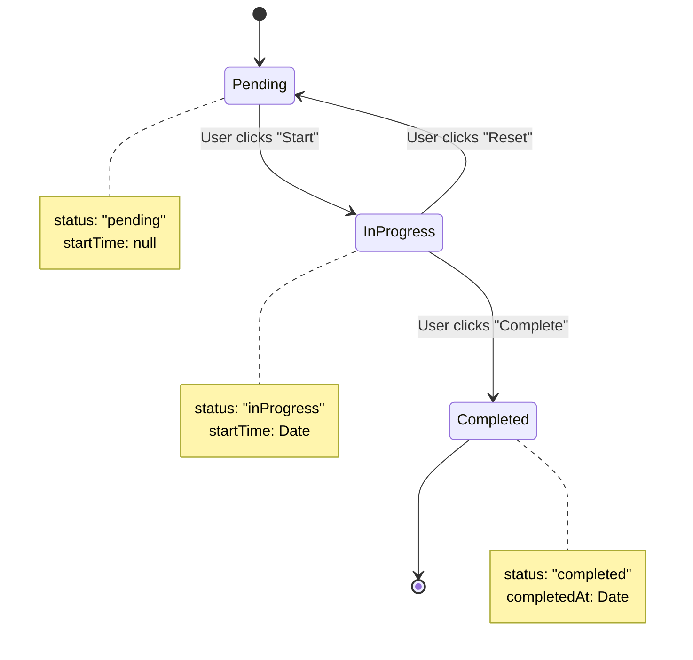
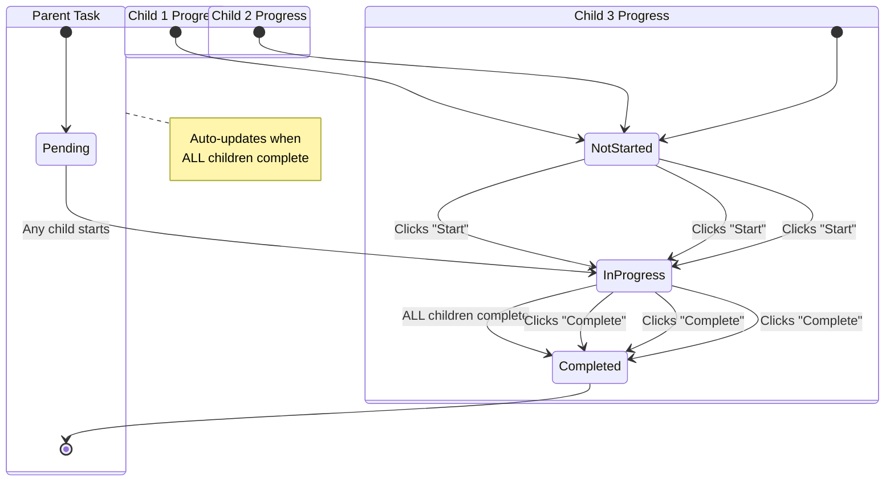

# Task Status Update Flow — Complete Guide

**Module:** task.module + taskProgress.module  
**Version:** 2.0  
**Last Updated:** 27-03-26  
**Figma Reference:** `figma-asset/app-user/group-children-user/home-flow.png`

---

## 📋 Overview

This document explains **how task status updates work** for different task types in the Task Management system. The implementation differs based on whether the task is **personal**, **singleAssignment**, or **collaborative**.

---

## 🎯 Task Types & Status Update Strategy

| Task Type | Who Updates? | Endpoint | Parent Task Auto-Update |
|-----------|--------------|----------|------------------------|
| **Personal** | Task creator/owner only | `PUT /tasks/:id/status` | ✅ Direct update |
| **Single Assignment** | Assigned user | `PUT /tasks/:id/status` | ✅ Direct update |
| **Collaborative** | Each assigned child individually | `PUT /task-progress/:taskId/status` | ✅ Auto-complete when ALL children complete |

---

## 🏗️ Architecture

### **Personal & Single Assignment Tasks**

```
┌──────────────┐
│   Child App  │
└─────────────┘
       │ PUT /tasks/:id/status
       ▼
┌──────────────────────────────┐
│   Task Controller            │
│   - verifyTaskAccess         │
│   - verifyTaskOwnership      │
│   - validateStatusTransition │
└──────┬───────────────────────┘
       │
       ▼
┌──────────────────────────────┐
│   Task Service               │
│   - Update task.status       │
│   - Set completedAt          │
│   - Invalidate cache         │
└──────┬───────────────────────┘
       │
       ▼
┌──────────────────────────────┐
│   MongoDB                    │
│   tasks collection           │
│   { status: "completed" }    │
└──────────────────────────────┘
```

### **Collaborative Tasks**

```
┌──────────────┐     ┌──────────────┐     ┌──────────────┐
│   Child 1    │     │   Child 2    │     │   Child 3    │
└──────┬───────┘     └──────┬───────┘     └──────┬───────┘
       │                    │                    │
       │ PUT /task-progress/:taskId/status       │
       └────────────────────┼────────────────────┘
                            │
                            ▼
                 ┌──────────────────────────┐
                 │   TaskProgress Service   │
                 │   - Update child progress│
                 │   - Check if ALL done    │
                 │   - Auto-complete parent │◄── NEW!
                 └──────────┬───────────────┘
                            │
              ┌─────────────┴─────────────┐
              │                           │
              ▼                           ▼
    ┌──────────────────┐        ┌──────────────────┐
    │ TaskProgress     │        │ Parent Task      │
    │ (per child)      │        │ (auto-updated)   │
    │ { status:        │        │ { status:        │
    │   "completed" }  │        │   "completed" }  │
    └──────────────────┘        └──────────────────┘
```

---

## 🔌 API Endpoints

### **1. Personal / Single Assignment Tasks**

```typescript
PUT /tasks/:id/status

// Request Body
{
  "status": "completed"  // "pending" | "inProgress" | "completed"
}

// Response
{
  "success": true,
  "message": "Task status updated successfully",
  "data": {
    "_id": "taskId123",
    "status": "completed",
    "completedAt": "2026-03-27T10:30:00.000Z",
    "taskType": "personal"
  }
}
```

**Route Location:** `src/modules/task.module/task/task.route.ts` (line ~224)

**Middleware Chain:**
1. `auth(TRole.commonUser)` - Authenticate user
2. `verifyTaskAccess` - Verify user has access to task
3. `verifyTaskOwnership` - Verify user can update this task
4. `validateRequest` - Validate status value
5. `validateStatusTransition` - Ensure valid status change (pending → inProgress → completed)

---

### **2. Collaborative Tasks**

```typescript
PUT /task-progress/:taskId/status

// Request Body
{
  "status": "completed"  // "notStarted" | "inProgress" | "completed"
}

// Response (Individual Child Progress)
{
  "success": true,
  "message": "Progress updated successfully",
  "data": {
    "_id": "progressId123",
    "taskId": "taskId123",
    "userId": "childUserId",
    "status": "completed",
    "completedAt": "2026-03-27T10:30:00.000Z",
    "progressPercentage": 100
  }
}

// ⚡ REAL-TIME EVENT Emitted (via Socket.io)
// Room: task:taskId123
// Event: task:auto-completed
{
  "taskId": "taskId123",
  "completedAt": "2026-03-27T10:30:00.000Z",
  "completedBy": "system",
  "reason": "all_children_completed"
}
```

**Route Location:** `src/modules/taskProgress.module/taskProgress.route.ts` (line ~58)

**Middleware Chain:**
1. `auth(TRole.commonUser)` - Authenticate user
2. `updateProgressLimiter` - Rate limit (30 req/min)
3. `validateRequest` - Validate status value

---

##  NEW: Auto-Complete Logic for Collaborative Tasks

### **How It Works**

When a child marks a collaborative task as completed:

1. **Update Child's Progress**
   - Find or create `TaskProgress` record for this child
   - Set `status = "completed"`
   - Set `completedAt` timestamp
   - Save to database

2. **Check All Children Status** 🆕
   - Query all `TaskProgress` records for this task
   - Get all assigned user IDs from parent task
   - Count how many children have `status = "completed"`
   - Compare with total assigned children

3. **Auto-Complete Parent Task** (if all completed) 🆕
   - Update parent task: `status = "completed"`
   - Set parent task: `completedAt = new Date()`
   - Invalidate Redis cache for task
   - Emit real-time event via Socket.io
   - Log for observability

### **Code Implementation**

**File:** `src/modules/taskProgress.module/taskProgress.service.ts`

```typescript
/**
 * Check if all children completed a collaborative task
 * If yes, auto-complete the parent task
 */
private async checkAndAutoCompleteParentTask(taskId: string): Promise<void> {
  // 1. Verify task is collaborative
  const task = await Task.findById(taskId).lean();
  if (!task || task.taskType !== TaskType.COLLABORATIVE) {
    return; // Only for collaborative tasks
  }

  // 2. Get all assigned users
  const assignedUserIds = task.assignedUserIds || [];
  if (assignedUserIds.length === 0) {
    return;
  }

  // 3. Get all progress records
  const allProgress = await this.model
    .find({
      taskId: new Types.ObjectId(taskId),
      userId: { $in: assignedUserIds.map(id => new Types.ObjectId(id)) },
      isDeleted: false,
    })
    .lean();

  // 4. Count completed children
  const completedCount = allProgress.filter(
    p => p.status === TaskProgressStatus.COMPLETED
  ).length;

  const totalAssignedUsers = assignedUserIds.length;

  // 5. Auto-complete if ALL completed
  if (completedCount === totalAssignedUsers) {
    await Task.findByIdAndUpdate(
      new Types.ObjectId(taskId),
      {
        status: TaskStatus.COMPLETED,
        completedAt: new Date(),
      },
      { new: true },
    );

    // Log for observability
    logger.info(
      `[TaskProgress] Auto-completed parent task ${taskId} - All ${completedCount} children completed`
    );

    // Invalidate cache
    await this.invalidateParentTaskCache(taskId);

    // Emit real-time event
    socketService.emitToRoom(`task:${taskId}`, 'task:auto-completed', {
      taskId,
      completedAt: new Date(),
      completedBy: 'system',
      reason: 'all_children_completed',
    });
  }
}
```

---

## 📊 State Machine Diagrams

### **Personal / Single Assignment Task**



### **Collaborative Task (Parent + Child Progress)**



---

## 🔐 Permissions Matrix

| Action | Personal Task | Single Assignment | Collaborative Task |
|--------|---------------|-------------------|-------------------|
| **Update Status** | Creator/Owner | Assigned User | Each assigned child (own progress only) |
| **Endpoint** | `/tasks/:id/status` | `/tasks/:id/status` | `/task-progress/:taskId/status` |
| **Auto-Complete Parent** | ✅ Direct | ✅ Direct | ✅ When ALL complete |
| **Verify Ownership** | ✅ Yes | ✅ Yes | ✅ Only own progress |

---

## 🚀 Performance Considerations

### **Caching Strategy**

**Personal/Single Assignment:**
- Cache key: `task:detail:{taskId}`
- TTL: 5 minutes
- Invalidation: On status update

**Collaborative Tasks:**
- Cache keys:
  - `taskProgress:task:{taskId}:user:{userId}` - Individual progress (5 min TTL)
  - `taskProgress:task:{taskId}:children` - All children progress (3 min TTL)
  - `task:detail:{taskId}` - Parent task (5 min TTL)
- Invalidation: On any child's progress update

### **Database Indexes**

```javascript
// TaskProgress collection
db.taskProgress.createIndex({ taskId: 1, userId: 1, isDeleted: 1 });
db.taskProgress.createIndex({ taskId: 1, status: 1, isDeleted: 1 });

// Task collection
db.tasks.createIndex({ taskType: 1, status: 1, isDeleted: 1 });
db.tasks.createIndex({ assignedUserIds: 1 });
```

### **Query Optimization**

- Use `.lean()` for read-only queries (2-3x memory reduction)
- Use projection to fetch only needed fields
- All auto-complete checks use aggregation with `$in` operator
- Background job for heavy operations (>500ms → BullMQ)

---

## 📱 Frontend Integration Guide

### **Flutter App Flow**

**For Personal/Single Assignment Tasks:**

```dart
// When child clicks "Complete" button
await updateTaskStatus(taskId, 'completed');
// Endpoint: PUT /tasks/:id/status
```

**For Collaborative Tasks:**

```dart
// When child clicks "Complete" button
await updateTaskProgress(taskId, 'completed');
// Endpoint: PUT /task-progress/:taskId/status

// Listen for auto-complete event
socket.on('task:auto-completed', (data) {
  if (data.taskId == taskId) {
    // Refresh task list - parent task now completed
    refreshTaskList();
  }
});
```

---

## 🧪 Testing Scenarios

### **Test Case 1: Personal Task Completion**

```
GIVEN: User has a personal task "Complete Math Homework"
WHEN: User clicks "Complete"
THEN:
  ✅ Task status → "completed"
  ✅ Task.completedAt → current timestamp
  ✅ Cache invalidated
  ✅ Dashboard shows task as completed
```

### **Test Case 2: Collaborative Task - Partial Completion**

```
GIVEN: 3 children assigned to collaborative task
WHEN: Child 1 marks as completed
THEN:
  ✅ Child 1 progress → "completed"
  ✅ Parent task status → remains "inProgress"
  ✅ Parent dashboard shows: "1/3 children completed"
```

### **Test Case 3: Collaborative Task - All Completed**

```
GIVEN: 3 children assigned to collaborative task
GIVEN: Child 1 and Child 2 already completed
WHEN: Child 3 marks as completed
THEN:
  ✅ Child 3 progress → "completed"
  ✅ Parent task status → "completed" (auto)
  ✅ Parent task.completedAt → current timestamp
  ✅ Real-time event emitted to all viewers
  ✅ Cache invalidated for task
  ✅ Parent dashboard shows: "Task completed by all"
```

---

## 🔍 Observability

### **Logging**

```typescript
// Auto-complete event
logger.info(
  `[TaskProgress] Auto-completed parent task ${taskId} - All ${completedCount} children completed`
);

// Error handling
errorLogger.error(
  '[TaskProgress] Error in checkAndAutoCompleteParentTask:',
  error
);
```

### **Metrics to Track**

- Count of auto-complete events per day
- Time between last child completion and parent auto-complete
- Cache hit rate for task progress queries
- Socket.io event delivery success rate

---

## 📝 Summary

| Feature | Implementation |
|---------|---------------|
| **Personal Tasks** | Direct status update via `/tasks/:id/status` |
| **Single Assignment** | Direct status update via `/tasks/:id/status` |
| **Collaborative Tasks** | Individual progress via `/task-progress/:taskId/status` |
| **Auto-Complete Parent** | ✅ When ALL children complete |
| **Real-Time Updates** | ✅ Socket.io events |
| **Cache Invalidation** | ✅ On every update |
| **Observability** | ✅ Logging + metrics |

---

**Related Documentation:**
- `task.module/doc/API_DOCUMENTATION.md`
- `taskProgress.module/doc/API_DOCUMENTATION.md`
- `taskProgress.module/doc/taskProgress-module-sequence.mermaid`
- `taskProgress.module/doc/taskProgress-module-state-machine.mermaid`

---
-27-03-26
