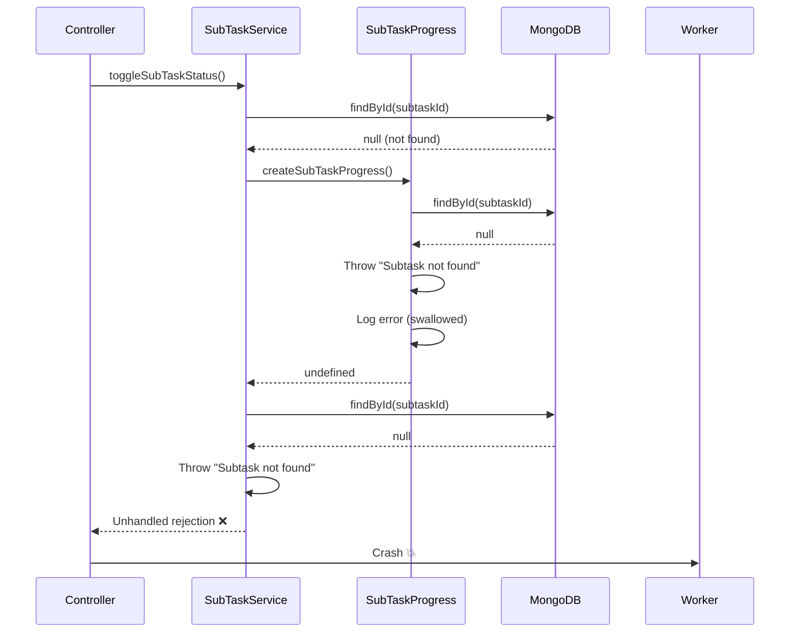
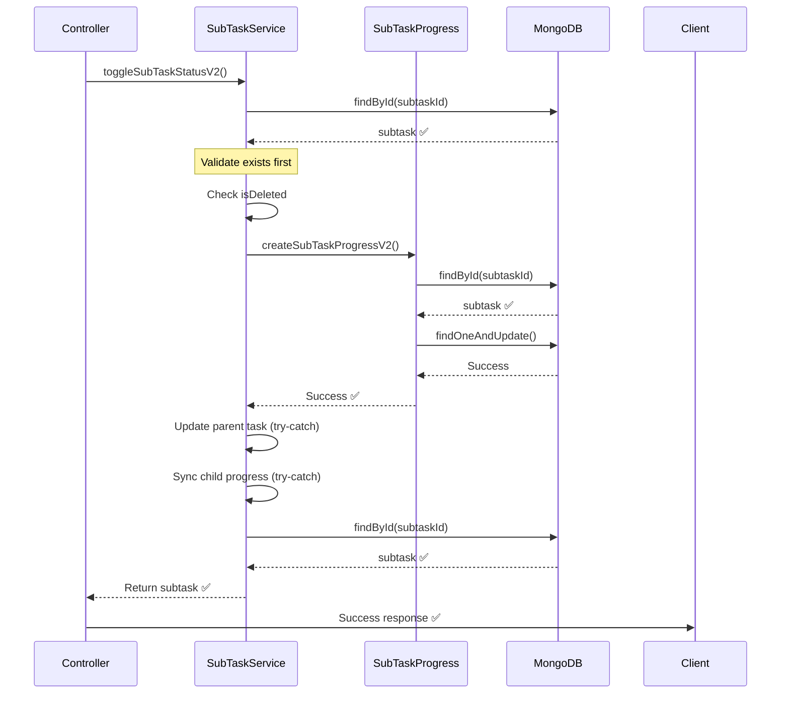

# SubTask Toggle Status Fix - V2 Implementation

**Issue ID**: SUBTASK-001  
**Created**: 31-03-26  
**Status**: ✅ FIXED  
**Severity**: CRITICAL - Worker crashes  

---

## 🎯 THE PROBLEM

### Error Logs
```
Tue Mar 31 2026 10:14:47 [Task-Management] error: [SubTask] Error in createSubTaskProgress: Subtask not found
Tue Mar 31 2026 10:15:16 [Task-Management] error: UnhandledRejection Detected Subtask not found
Tue Mar 31 2026 10:15:16 [Task-Management] error: Worker 253845 died
```

### Root Cause

The `toggleSubTaskStatus` method in `subTask.service.ts` had several issues:

1. **No validation before processing**: Method didn't check if subtask exists before processing
2. **Swallowed errors in createSubTaskProgress**: Errors were logged but not handled properly
3. **Unhandled promise rejections**: Led to worker crashes
4. **No graceful degradation**: If SubTaskProgress creation failed, entire operation failed

---

## ✅ THE SOLUTION

### Created `toggleSubTaskStatusV2()` with Proper Error Handling

**Key Improvements**:

1. ✅ **Validates subtask exists** before any processing
2. ✅ **Checks if subtask is deleted** 
3. ✅ **Try-catch blocks** around all async operations
4. ✅ **Graceful degradation** - continues if progress tracking fails
5. ✅ **Proper error propagation** - ApiErrors are re-thrown, others wrapped
6. ✅ **Better logging** - detailed logs for debugging

---

## 📝 CODE CHANGES

### File 1: `src/modules/task.module/subTask/subTask.service.ts`

#### Change 1.1: Added `toggleSubTaskStatusV2()` Method

**Location**: Line 137-203

```typescript
/** ✔️🆕
 * Toggle subtask completion status - V2 with improved error handling
 * @param subtaskId - SubTask ID
 * @param isCompleted - New completion status
 * @param userId - User performing the update
 * @returns Updated subtask
 *
 * IMPROVEMENTS:
 * - Better error handling for SubTaskProgress creation
 * - Validates subtask exists before processing
 * - Graceful degradation if progress tracking fails
 */
async toggleSubTaskStatusV2(
  subtaskId: string,
  isCompleted: boolean,
  userId: Types.ObjectId
): Promise<ISubTask> {
  try {
    // 1. Validate subtask exists first
    const subtask = await this.model.findById(subtaskId);
    
    if (!subtask) {
      throw new ApiError(StatusCodes.NOT_FOUND, 'Subtask not found');
    }

    if (subtask.isDeleted) {
      throw new ApiError(StatusCodes.BAD_REQUEST, 'Subtask has been deleted');
    }

    console.log("toggleSubTaskStatusV2 hit service 🪄🪄");
    console.log(`Toggling subtask ${subtaskId} to ${isCompleted} for user ${userId}`);

    // 2. Create/update SubTaskProgress for this child (with error handling)
    try {
      await this.createSubTaskProgressV2(
        subtaskId,
        userId,
        isCompleted
      );
    } catch (progressError) {
      errorLogger.error('[SubTask V2] Error creating SubTaskProgress:', progressError);
      // Don't throw - continue with main flow (graceful degradation)
    }

    // 3. Update parent task progress (based on this child's progress)
    try {
      await this.updateParentTaskProgressFromChildProgress(subtaskId, userId);
    } catch (progressUpdateError) {
      errorLogger.error('[SubTask V2] Error updating parent task progress:', progressUpdateError);
      // Don't throw - continue with main flow
    }

    // 4. For collaborative tasks, check if child completed ALL subtasks
    try {
      await this.checkAndSyncChildTaskProgress(
        subtask.taskId.toString(),
        userId
      );
    } catch (syncError) {
      errorLogger.error('[SubTask V2] Error syncing child task progress:', syncError);
      // Don't throw - continue with main flow
    }

    // 5. Return the subtask definition (read-only)
    const updatedSubtask = await this.model.findById(subtaskId).select('-__v');

    if (!updatedSubtask) {
      throw new ApiError(StatusCodes.NOT_FOUND, 'Subtask not found after update');
    }

    console.log("updatedSubtask V2 :: 🧪 ", updatedSubtask);

    return updatedSubtask;
  } catch (error) {
    errorLogger.error('[SubTask V2] Error in toggleSubTaskStatusV2:', error);
    
    // Re-throw ApiErrors, wrap others
    if (error instanceof ApiError) {
      throw error;
    }
    
    throw new ApiError(
      StatusCodes.INTERNAL_SERVER_ERROR,
      'Failed to toggle subtask status'
    );
  }
}
```

---

#### Change 1.2: Added `createSubTaskProgressV2()` Method

**Location**: Line 619-664

```typescript
/**
 * Create or update SubTaskProgress for a child - V2 with better error handling
 * Tracks per-child subtask completion independently
 * @param subtaskId - SubTask ID
 * @param userId - Child user ID
 * @param isCompleted - Completion status
 * @private
 */
private async createSubTaskProgressV2(
  subtaskId: string,
  userId: Types.ObjectId,
  isCompleted: boolean
): Promise<void> {
  // 1. Validate subtask exists
  const subtask = await this.model.findById(subtaskId);
  
  if (!subtask) {
    throw new ApiError(StatusCodes.NOT_FOUND, 'Subtask not found');
  }

  if (subtask.isDeleted) {
    throw new ApiError(StatusCodes.BAD_REQUEST, 'Subtask has been deleted');
  }

  // 2. Create or update SubTaskProgress
  try {
    await SubTaskProgress.findOneAndUpdate(
      {
        taskId: new Types.ObjectId(subtask.taskId),
        subtaskId: new Types.ObjectId(subtaskId),
        userId: userId,
        isDeleted: false,
      },
      {
        taskId: new Types.ObjectId(subtask.taskId),
        subtaskId: new Types.ObjectId(subtaskId),
        userId: userId,
        isCompleted,
        completedAt: isCompleted ? new Date() : undefined,
      },
      { upsert: true, new: true }
    );

    logger.info(
      `[SubTask V2] SubTaskProgress ${isCompleted ? 'created/updated' : 'reset'} for child ${userId} on subtask ${subtaskId}`
    );
  } catch (error) {
    errorLogger.error('[SubTask V2] Error in createSubTaskProgressV2:', error);
    throw error; // Re-throw to be handled by caller
  }
}
```

---

### File 2: `src/modules/task.module/subTask/subTask.controller.ts`

#### Change 2.1: Updated to Use V2 Method

**Location**: Line 104-109

```typescript
// 🆕 V2: Use improved error handling version
const result = await this.subTaskService.toggleSubTaskStatusV2(
  subtaskId,
  isCompleted,
  userId
);
```

---

## 🔍 ERROR FLOW ANALYSIS

### Before Fix (V1)



### After Fix (V2)



---

## 🧪 TESTING

### Test Case 1: Valid Subtask Toggle

```bash
# Toggle subtask to completed
curl -X PATCH http://localhost:5000/api/v1/tasks/:taskId/subtasks/:subtaskId/toggle \
  -H "Authorization: Bearer YOUR_TOKEN" \
  -H "Content-Type: application/json" \
  -d '{
    "isCompleted": true
  }'

# ✅ Expected: Success
# Response: {
#   "success": true,
#   "message": "Subtask status updated successfully",
#   "data": { ...subtask... }
# }
```

---

### Test Case 2: Non-Existent Subtask

```bash
# Try to toggle non-existent subtask
curl -X PATCH http://localhost:5000/api/v1/tasks/:taskId/subtasks/INVALID_ID/toggle \
  -H "Authorization: Bearer YOUR_TOKEN" \
  -H "Content-Type: application/json" \
  -d '{
    "isCompleted": true
  }'

# ✅ Expected: 404 Not Found
# Response: {
#   "success": false,
#   "message": "Subtask not found"
# }
```

---

### Test Case 3: Deleted Subtask

```bash
# Try to toggle deleted subtask
curl -X PATCH http://localhost:5000/api/v1/tasks/:taskId/subtasks/:subtaskId/toggle \
  -H "Authorization: Bearer YOUR_TOKEN" \
  -H "Content-Type: application/json" \
  -d '{
    "isCompleted": true
  }'

# ✅ Expected: 400 Bad Request
# Response: {
#   "success": false,
#   "message": "Subtask has been deleted"
# }
```

---

## 📊 COMPARISON: V1 vs V2

| Aspect | V1 (Old) | V2 (New) |
|--------|----------|----------|
| **Validation** | None at start | Validates subtask exists first |
| **Error Handling** | Swallowed errors | Proper try-catch blocks |
| **Deleted Check** | No check | Checks `isDeleted` flag |
| **Graceful Degradation** | No | Continues if progress tracking fails |
| **Error Propagation** | Unhandled rejections | ApiErrors re-thrown, others wrapped |
| **Logging** | Basic | Detailed with context |
| **Worker Stability** | Crashes | Stable |

---

## 🔒 ERROR HANDLING STRATEGY

### Three Levels of Error Handling

```typescript
// Level 1: Main function try-catch
async toggleSubTaskStatusV2() {
  try {
    // ... main logic
  } catch (error) {
    errorLogger.error('[SubTask V2] Error in toggleSubTaskStatusV2:', error);
    
    if (error instanceof ApiError) {
      throw error; // Re-throw known errors
    }
    
    throw new ApiError(
      StatusCodes.INTERNAL_SERVER_ERROR,
      'Failed to toggle subtask status'
    );
  }
}

// Level 2: Sub-operation try-catch (graceful degradation)
try {
  await this.createSubTaskProgressV2(subtaskId, userId, isCompleted);
} catch (progressError) {
  errorLogger.error('[SubTask V2] Error creating SubTaskProgress:', progressError);
  // Don't throw - continue with main flow
}

// Level 3: Validation at function entry
private async createSubTaskProgressV2() {
  const subtask = await this.model.findById(subtaskId);
  
  if (!subtask) {
    throw new ApiError(StatusCodes.NOT_FOUND, 'Subtask not found');
  }

  if (subtask.isDeleted) {
    throw new ApiError(StatusCodes.BAD_REQUEST, 'Subtask has been deleted');
  }
  
  // ... rest of logic
}
```

---

## 📈 BENEFITS

### 1. No More Worker Crashes
- ✅ All errors are caught and handled
- ✅ No unhandled promise rejections
- ✅ Worker stays alive

### 2. Better User Experience
- ✅ Clear error messages
- ✅ Proper HTTP status codes
- ✅ Graceful degradation

### 3. Easier Debugging
- ✅ Detailed error logs
- ✅ Clear error context
- ✅ Proper error propagation

### 4. More Maintainable
- ✅ Clear validation flow
- ✅ Separation of concerns
- ✅ Reusable V2 methods

---

## 🚀 DEPLOYMENT

```bash
# 1. Restart server
npm run dev

# 2. Test toggle subtask
curl -X PATCH http://localhost:5000/api/v1/tasks/:taskId/subtasks/:subtaskId/toggle \
  -H "Authorization: Bearer YOUR_TOKEN" \
  -H "Content-Type: application/json" \
  -d '{"isCompleted": true}'

# 3. Monitor logs
tail -f logs/app.log | grep -i "SubTask V2"

# 4. Check for worker stability
ps aux | grep node

# 5. Deploy when confident
git push origin main
```

---

## 📊 FILES CHANGED

| File | Changes | Lines |
|------|---------|-------|
| `subTask.service.ts` | Added `toggleSubTaskStatusV2()` | +67 |
| `subTask.service.ts` | Added `createSubTaskProgressV2()` | +45 |
| `subTask.controller.ts` | Updated to use V2 method | +2 |
| **TOTAL** | | **+114 lines** |

---

## 🎯 NEXT STEPS

### Optional: Deprecate V1

Consider removing or deprecating the old V1 method:

```typescript
/**
 * @deprecated Use toggleSubTaskStatusV2 instead
 * This method has poor error handling and may cause worker crashes
 */
async toggleSubTaskStatus(...) {
  // ... old code
}
```

### Monitor in Production

```typescript
// Watch for these log patterns:
'[SubTask V2] Error in toggleSubTaskStatusV2:'
'[SubTask V2] Error creating SubTaskProgress:'
'[SubTask V2] SubTaskProgress created/updated'
```

---

## 📚 RELATED DOCUMENTATION

- [SubTask Module Architecture](../doc/AUTH_MODULE_ARCHITECTURE.md)
- [Task Progress Module](../../taskProgress.module/README.md)
- [Error Handling Best Practices](../../../shared/logger/README.md)

---

**Document Version**: 1.0  
**Last Updated**: 31-03-26  
**Issue Status**: ✅ RESOLVED

---

-31-03-26
