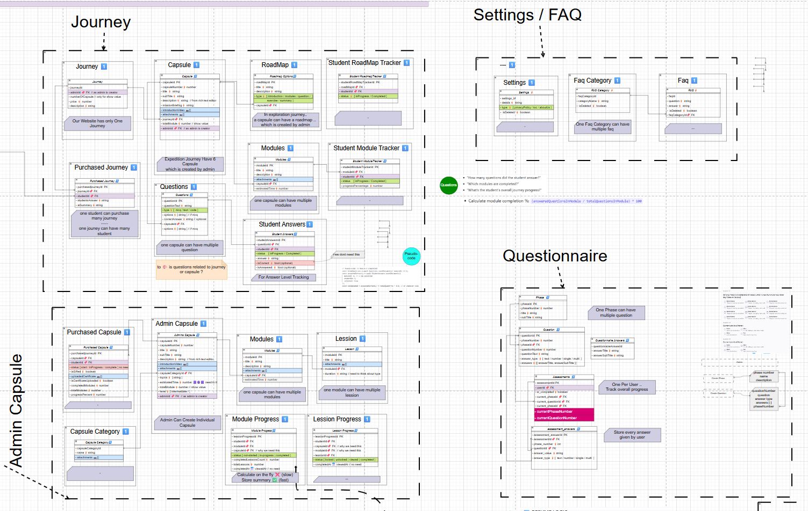
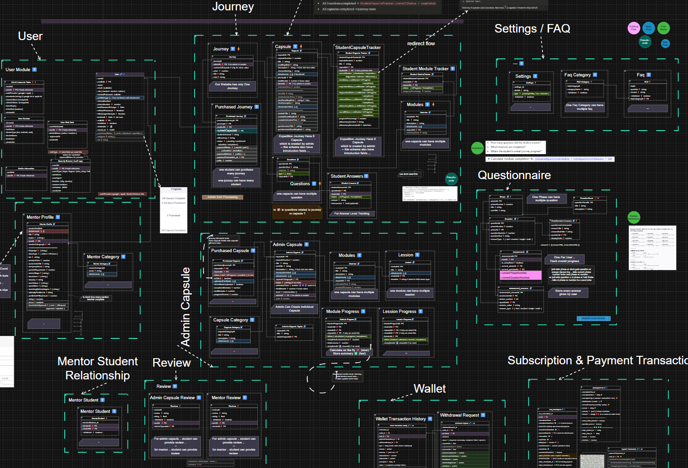

# Task Management Express Backend

A robust backend application built with **Node.js**, **Express**, **TypeScript**, and **Mongoose** designed specifically for a Task Management and Collaboration platform. It includes advanced features like parent-child account relationships, task progress tracking, real-time notifications, and subscription management.

## Key Features

- **Authentication & Authorization**: Secure JWT-based authentication, role-based access control, password hashing with Bcrypt, and invitation flows for child accounts.
- **Task Management Engine**: Create and manage tasks, subtasks, and track per-user task progress seamlessly.
- **Hierarchical Users**: Support for business users who can manage children accounts, facilitating parent-child or teacher-student collaborative environments.
- **Real-time Notifications & Reminders**: Keep users updated with activity notifications and task reminders using **Socket.io** and background cron jobs.
- **Subscription & Payment Integrations**: Robust subscription handling using **Stripe** and **RevenueCat** for both business and individual plans.
- **Analytics Dashboard**: Endpoints for gathering and tracking task completion rates, user activity, and platform usage.
- **File Attachments**: Handle document and image uploads securely using **AWS S3** and **Multer**.
- **Background Jobs & Queues**: Leverage **BullMQ** and **Redis** for efficient background processing.
- **Security & Validation**: Data validation via **Zod**, input sanitization, rate limiting, and security headers with **Helmet**.

## Tech Stack

- **Framework**: Node.js, Express, TypeScript
- **Database**: MongoDB (Mongoose)
- **Caching & Queues**: Redis, BullMQ
- **Authentication**: JWT, Bcrypt
- **Payments**: Stripe, RevenueCat
- **File Storage**: AWS S3 (via `@aws-sdk/client-s3`)
- **Real-time**: Socket.io
- **Emails**: NodeMailer, Mailchimp
- **Logging**: Winston
- **Validation**: Zod

## Getting Started

### Prerequisites

Ensure you have the following installed:
- **Node.js** (v18+ recommended)
- **pnpm** (Package manager)
- **MongoDB**
- **Redis**

### Installation

1. **Clone the repository & navigate to the project directory**

2. **Install dependencies:**

   ```bash
   pnpm install
   ```

3. **Environment Setup:**

   Create a `.env` file in the root directory based on `.env.example` and configure the following core variables:

   ```env
   NODE_ENV=development
   PORT=6731
   MONGODB_URL=your_mongodb_connection_string
   JWT_ACCESS_SECRET=your_jwt_secret
   # Redis, Stripe, AWS, SMTP configurations...
   ```

4. **Run the development server:**

   ```bash
   pnpm run dev
   ```

### Running Tests

The project uses **Vitest** for unit and integration testing.

```bash
# Run all tests
pnpm test

# Run tests with coverage
pnpm run test:coverage

# Run specific integration tests
pnpm run test:integration
```

## Architecture Highlights
- **Generic Controllers & Services**: Reduces boilerplate by utilizing generic classes for standard CRUD operations.
- **Modular Structure**: Organized by feature (e.g., `task.module`, `user.module`, `subscription.module`) for better maintainability.
