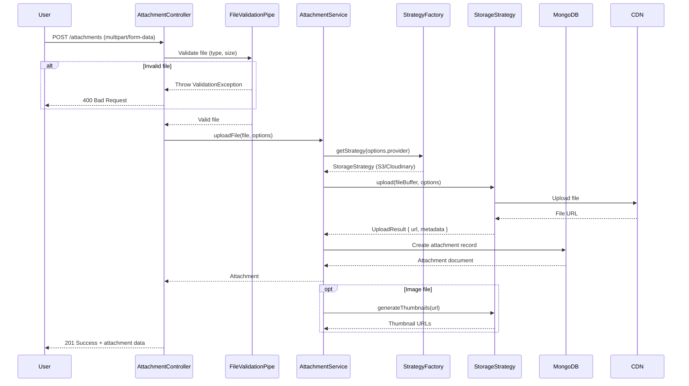

# 🏗️ ATTACHMENT MODULE - COMPREHENSIVE ARCHITECTURE GUIDE

**Version**: 1.0.0 (NestJS)  
**Last Updated**: 26-03-29  
**Level**: Senior/Mastery  
**Estimated Study Time**: 1.5 hours

---

## 📋 **TABLE OF CONTENTS**

1. [Module Overview](#1-module-overview)
2. [Storage Strategy Pattern](#2-storage-strategy-pattern)
3. [Module Structure](#3-module-structure)
4. [Database Schema](#4-database-schema)
5. [File Upload Flow](#5-file-upload-flow)
6. [API Endpoints](#6-api-endpoints)
7. [Storage Strategies](#7-storage-strategies)
8. [File Processing Pipeline](#8-file-processing-pipeline)
9. [Image Transformation](#9-image-transformation)
10. [Security Considerations](#10-security-considerations)
11. [Caching & CDN](#11-caching--cdn)
12. [Error Handling](#12-error-handling)
13. [Performance Optimization](#13-performance-optimization)
14. [Testing Strategy](#14-testing-strategy)
15. [Integration Points](#15-integration-points)

---

## 1. **MODULE OVERVIEW**

### **1.1 Purpose & Scope**

The Attachment module provides **flexible file upload and storage** capabilities:
- **Multi-strategy storage** (S3, Cloudinary, local)
- **File type validation** (images, documents, videos)
- **Size limits** per file type
- **Image transformations** (resize, crop, compress)
- **Secure access** (signed URLs, access control)
- **Metadata extraction** (dimensions, file type, size)

### **1.2 Key Design Principles**

1. **Strategy Pattern**: Pluggable storage providers
2. **Factory Pattern**: Dynamic strategy selection
3. **Pipeline Pattern**: Sequential file processing
4. **Security First**: Validation, sanitization, access control
5. **Performance**: Streaming, CDN integration, caching

### **1.3 Module Statistics**

| Metric | Value |
|--------|-------|
| **Total Files** | 12 files |
| **Lines of Code** | ~1,400 lines |
| **API Endpoints** | 8 endpoints |
| **Storage Strategies** | 3 (S3, Cloudinary, Local) |
| **Max File Size** | 10MB (configurable) |
| **Supported Formats** | 20+ image/document types |

---

## 2. **STORAGE STRATEGY PATTERN**

### **2.1 Strategy Interface**

```typescript
/**
 * Storage Strategy Interface
 * Defines contract for all storage providers
 */
export interface IStorageStrategy {
  /**
   * Upload file to storage
   * @param file - File buffer and metadata
   * @param options - Upload options
   * @returns Upload result with URL
   */
  upload(
    file: FileUpload,
    options: UploadOptions,
  ): Promise<UploadResult>;

  /**
   * Delete file from storage
   * @param url - File URL or ID
   */
  delete(url: string): Promise<void>;

  /**
   * Get signed URL for private files
   * @param url - File URL
   * @param expiresIn - URL expiration time
   */
  getSignedUrl(url: string, expiresIn: number): Promise<string>;

  /**
   * Transform image (resize, crop, etc.)
   * @param url - Original image URL
   * @param transformations - Transformation options
   */
  transform(
    url: string,
    transformations: ImageTransformation,
  ): Promise<string>;
}
```

### **2.2 Why Strategy Pattern?**

1. **Flexibility**: Switch storage providers without code changes
2. **Testability**: Mock storage for testing
3. **Extensibility**: Add new providers easily
4. **Separation**: Storage logic isolated from business logic

---

## 3. **MODULE STRUCTURE**

### **3.1 Complete File Structure**

```
src/modules/attachment.module/
├── attachment.module.ts                      # Module definition
├── attachment.controller.ts                  # File upload endpoints (8)
├── attachment.service.ts                     # Upload business logic
├── attachment.schema.ts                      # Attachment schema
├── attachment.constants.ts                   # File limits, MIME types
├── strategies/
│   ├── file-upload.strategy.interface.ts     # Strategy interface
│   ├── file-upload.strategy.factory.ts       # Factory for strategy selection
│   ├── s3.strategy.ts                        # AWS S3 implementation
│   ├── cloudinary.strategy.ts                # Cloudinary implementation
│   └── local.strategy.ts                     # Local filesystem (dev only)
├── dto/
│   ├── upload-file.dto.ts                    # Upload request DTO
│   └── attachment.dto.ts                     # Attachment response DTO
├── pipes/
│   ├── file-validation.pipe.ts               # Validate file type/size
│   └── file-size-validation.pipe.ts          # Validate file size
├── interceptors/
│   └── file-upload-processing.interceptor.ts # Process uploaded files
└── doc/
    ├── README.md                             # Module documentation
    └── dia/
        └── upload-flow.mermaid               # Upload flow diagram
```

### **3.2 File Responsibilities**

| File | Responsibility | Lines |
|------|----------------|-------|
| `attachment.module.ts` | Module configuration, providers | 100 |
| `attachment.controller.ts` | Upload/download endpoints | 200 |
| `attachment.service.ts` | Upload logic, strategy selection | 250 |
| `attachment.schema.ts` | Mongoose schema | 150 |
| `strategies/*.ts` | Storage implementations | 400 |
| `dto/*.ts` | Request/response validation | 150 |
| `pipes/*.ts` | File validation | 100 |
| `interceptors/*.ts` | File processing | 150 |

---

## 4. **DATABASE SCHEMA**

### **4.1 Attachment Schema**

```typescript
@Schema({ timestamps: true, toJSON: { virtuals: true } })
export class Attachment {
  /**
   * Reference to uploader
   */
  @Prop({
    type: Schema.Types.ObjectId,
    ref: 'User',
    required: [true, 'Uploader is required'],
    index: true,
  })
  uploadedById: Types.ObjectId;

  /**
   * Original file name
   */
  @Prop({
    type: String,
    required: [true, 'Filename is required'],
    trim: true,
  })
  filename: string;

  /**
   * Stored file name (sanitized, unique)
   */
  @Prop({
    type: String,
    required: [true, 'Stored filename is required'],
  })
  storedFilename: string;

  /**
   * File URL (public or signed)
   */
  @Prop({
    type: String,
    required: [true, 'URL is required'],
  })
  url: string;

  /**
   * MIME type
   */
  @Prop({
    type: String,
    required: [true, 'MIME type is required'],
    index: true,
  })
  mimeType: string;

  /**
   * File size in bytes
   */
  @Prop({
    type: Number,
    required: [true, 'File size is required'],
  })
  size: number;

  /**
   * File type category
   */
  @Prop({
    type: String,
    enum: ['image', 'document', 'video', 'audio', 'other'],
    required: [true, 'File type is required'],
    index: true,
  })
  fileType: FileType;

  /**
   * Storage provider
   */
  @Prop({
    type: String,
    enum: ['s3', 'cloudinary', 'local'],
    required: [true, 'Storage provider is required'],
  })
  storageProvider: string;

  /**
   * Image metadata (if applicable)
   */
  @Prop({
    type: {
      width: Number,
      height: Number,
      aspectRatio: Number,
    },
  })
  imageMetadata?: {
    width: number;
    height: number;
    aspectRatio: number;
  };

  /**
   * Related entity (optional)
   */
  @Prop({
    type: Schema.Types.ObjectId,
    refPath: 'entityType',
  })
  entityId?: Types.ObjectId;

  /**
   * Entity type (e.g., 'task', 'message', 'user')
   */
  @Prop({
    type: String,
  })
  entityType?: string;

  /**
   * Is this a public file?
   */
  @Prop({
    type: Boolean,
    default: false,
  })
  isPublic: boolean;

  /**
   * Soft delete flag
   */
  @Prop({ default: false })
  isDeleted: boolean;

  /**
   * Creation timestamp (auto-managed by Mongoose)
   */
  createdAt?: Date;

  /**
   * Last update timestamp (auto-managed by Mongoose)
   */
  updatedAt?: Date;
}

// Indexes for efficient queries
AttachmentSchema.index({ uploadedById: 1, isDeleted: 1 });
AttachmentSchema.index({ entityType: 1, entityId: 1, isDeleted: 1 });
AttachmentSchema.index({ fileType: 1, isDeleted: 1 });
AttachmentSchema.index({ storedFilename: 1 }, { unique: true });

// Virtual populate for uploader
AttachmentSchema.virtual('uploadedBy', {
  ref: 'User',
  localField: 'uploadedById',
  foreignField: '_id',
  justOne: true,
});

// Pre-save hook: Generate unique stored filename
AttachmentSchema.pre('save', function(next) {
  if (this.isNew || this.isModified('filename')) {
    const ext = path.extname(this.filename);
    const uniqueId = new Types.ObjectId().toString();
    this.storedFilename = `attachment_${uniqueId}${ext}`;
  }
  next();
});

// toJSON transformation
AttachmentSchema.set('toJSON', {
  transform: function(doc, ret, options) {
    ret.attachmentId = ret._id;
    delete ret._id;
    delete ret.__v;
    delete ret.isDeleted;
    delete ret.storedFilename; // Don't expose internal filename
    return ret;
  },
});
```

### **4.2 File Type Constants**

```typescript
export enum FileType {
  IMAGE = 'image',
  DOCUMENT = 'document',
  VIDEO = 'video',
  AUDIO = 'audio',
  OTHER = 'other',
}

export const MIME_TYPE_MAP: Record<string, FileType> = {
  // Images
  'image/jpeg': FileType.IMAGE,
  'image/png': FileType.IMAGE,
  'image/gif': FileType.IMAGE,
  'image/webp': FileType.IMAGE,
  'image/svg+xml': FileType.IMAGE,
  
  // Documents
  'application/pdf': FileType.DOCUMENT,
  'application/msword': FileType.DOCUMENT,
  'application/vnd.openxmlformats-officedocument.wordprocessingml.document': FileType.DOCUMENT,
  'application/vnd.ms-excel': FileType.DOCUMENT,
  'application/vnd.openxmlformats-officedocument.spreadsheetml.sheet': FileType.DOCUMENT,
  'text/plain': FileType.DOCUMENT,
  
  // Videos
  'video/mp4': FileType.VIDEO,
  'video/quicktime': FileType.VIDEO,
  'video/x-msvideo': FileType.VIDEO,
  
  // Audio
  'audio/mpeg': FileType.AUDIO,
  'audio/wav': FileType.AUDIO,
  'audio/ogg': FileType.AUDIO,
};

export const ALLOWED_MIME_TYPES = Object.keys(MIME_TYPE_MAP);
```

### **4.3 File Size Limits**

```typescript
export const FILE_SIZE_LIMITS = {
  // Per file type (in bytes)
  IMAGE: 5 * 1024 * 1024,      // 5MB
  DOCUMENT: 10 * 1024 * 1024,  // 10MB
  VIDEO: 50 * 1024 * 1024,     // 50MB
  AUDIO: 20 * 1024 * 1024,     // 20MB
  OTHER: 10 * 1024 * 1024,     // 10MB
  
  // Global maximum
  MAX: 50 * 1024 * 1024,       // 50MB absolute max
};

export const UPLOAD_LIMITS = {
  MAX_FILES_PER_REQUEST: 10,
  MAX_FILES_PER_USER_PER_DAY: 100,
  MAX_STORAGE_PER_USER: 500 * 1024 * 1024, // 500MB per user
};
```

---

## 5. **FILE UPLOAD FLOW**

### **5.1 Complete Upload Flow**



### **5.2 Multer Configuration**

```typescript
// file-upload-processing.interceptor.ts
@Injectable()
export class FileUploadProcessingInterceptor implements NestInterceptor {
  intercept(context: ExecutionContext, next: CallHandler): Observable<any> {
    const request = context.switchToHttp().getRequest();
    const response = context.switchToHttp().getResponse();

    // Configure multer
    const upload = multer({
      storage: multer.memoryStorage(), // Store in memory for processing
      limits: {
        fileSize: FILE_SIZE_LIMITS.MAX,
        files: UPLOAD_LIMITS.MAX_FILES_PER_REQUEST,
      },
      fileFilter: (req, file, callback) => {
        // Validate MIME type
        if (ALLOWED_MIME_TYPES.includes(file.mimetype)) {
          callback(null, true);
        } else {
          callback(new BadRequestException('Invalid file type'), false);
        }
      },
    });

    // Process upload
    upload.array('files')(request, response, (error: any) => {
      if (error) {
        throw new BadRequestException(`Upload failed: ${error.message}`);
      }
      return next.handle();
    });
  }
}
```

---

## 6. **API ENDPOINTS**

### **6.1 Complete Reference**

| Method | Endpoint | Auth | Description |
|--------|----------|------|-------------|
| `POST` | `/attachments` | ✅ | Upload single file |
| `POST` | `/attachments/batch` | ✅ | Upload multiple files |
| `POST` | `/attachments/image` | ✅ | Upload image with transformation |
| `GET` | `/attachments/:id` | ✅ | Get attachment by ID |
| `GET` | `/attachments/:id/download` | ✅ | Download attachment |
| `GET` | `/attachments/:id/url` | ✅ | Get signed URL |
| `DELETE` | `/attachments/:id` | ✅ | Delete attachment |
| `GET` | `/attachments/entity/:type/:id` | ✅ | Get attachments for entity |

### **6.2 Request/Response Examples**

**Upload Single File**
```http
POST /attachments
Authorization: Bearer <token>
Content-Type: multipart/form-data

files: [binary data]

Response 201:
{
  "success": true,
  "data": {
    "attachmentId": "507f1f77bcf86cd799439011",
    "filename": "profile-photo.jpg",
    "url": "https://cdn.example.com/attachments/507f1f77bcf86cd799439011.jpg",
    "mimeType": "image/jpeg",
    "size": 245678,
    "fileType": "image",
    "imageMetadata": {
      "width": 1920,
      "height": 1080,
      "aspectRatio": 1.78
    },
    "thumbnails": {
      "small": "https://cdn.example.com/.../thumb_small.jpg",
      "medium": "https://cdn.example.com/.../thumb_medium.jpg",
      "large": "https://cdn.example.com/.../thumb_large.jpg"
    },
    "createdAt": "2024-03-29T10:00:00Z"
  }
}
```

**Upload with Transformation**
```http
POST /attachments/image
Authorization: Bearer <token>
Content-Type: multipart/form-data

files: [binary data]
transformations: {
  "resize": {
    "width": 800,
    "height": 600,
    "fit": "cover"
  },
  "quality": 80
}

Response 201:
{
  "success": true,
  "data": {
    "attachmentId": "507f1f77bcf86cd799439011",
    "url": "https://cdn.example.com/.../transformed.jpg",
    "originalSize": 245678,
    "transformedSize": 89012,
    "transformations": {
      "resized": true,
      "compressed": true
    }
  }
}
```

---

## 7. **STORAGE STRATEGIES**

### **7.1 S3 Strategy**

```typescript
@Injectable()
export class S3Strategy implements IStorageStrategy {
  private readonly s3: S3Client;
  private readonly bucket: string;

  constructor(private configService: ConfigService) {
    this.s3 = new S3Client({
      region: configService.get('AWS_REGION'),
      credentials: {
        accessKeyId: configService.get('AWS_ACCESS_KEY_ID'),
        secretAccessKey: configService.get('AWS_SECRET_ACCESS_KEY'),
      },
    });
    this.bucket = configService.get('AWS_S3_BUCKET');
  }

  async upload(file: FileUpload, options: UploadOptions): Promise<UploadResult> {
    const key = `${options.folder || 'attachments'}/${file.storedFilename}`;

    const command = new PutObjectCommand({
      Bucket: this.bucket,
      Key: key,
      Body: file.buffer,
      ContentType: file.mimeType,
      ACL: options.isPublic ? 'public-read' : 'private',
      Metadata: {
        originalFilename: file.filename,
        uploadedBy: file.uploadedById,
      },
    });

    await this.s3.send(command);

    const url = options.isPublic
      ? `https://${this.bucket}.s3.amazonaws.com/${key}`
      : await this.getSignedUrl(key, 3600);

    return {
      url,
      key,
      provider: 's3',
      isPublic: options.isPublic,
    };
  }

  async delete(url: string): Promise<void> {
    const key = this.extractKeyFromUrl(url);
    
    const command = new DeleteObjectCommand({
      Bucket: this.bucket,
      Key: key,
    });

    await this.s3.send(command);
  }

  async getSignedUrl(url: string, expiresIn: number): Promise<string> {
    const key = this.extractKeyFromUrl(url);

    const command = new GetObjectCommand({
      Bucket: this.bucket,
      Key: key,
    });

    return getSignedUrl(this.s3, command, { expiresIn });
  }

  async transform(
    url: string,
    transformations: ImageTransformation,
  ): Promise<string> {
    // For S3, use CloudFront or Lambda@Edge for transformations
    // Or integrate with Cloudinary for transformations
    throw new Error('S3 transformations require CloudFront or external service');
  }
}
```

### **7.2 Cloudinary Strategy**

```typescript
@Injectable()
export class CloudinaryStrategy implements IStorageStrategy {
  private readonly cloudinary: typeof cloudinary;

  constructor(private configService: ConfigService) {
    cloudinary.config({
      cloud_name: configService.get('CLOUDINARY_CLOUD_NAME'),
      api_key: configService.get('CLOUDINARY_API_KEY'),
      api_secret: configService.get('CLOUDINARY_API_SECRET'),
    });
    this.cloudinary = cloudinary;
  }

  async upload(file: FileUpload, options: UploadOptions): Promise<UploadResult> {
    return new Promise((resolve, reject) => {
      const uploadOptions: any = {
        folder: options.folder || 'attachments',
        public_id: file.storedFilename,
        resource_type: this.getResourceType(file.mimeType),
      };

      if (file.fileType === 'image') {
        uploadOptions.transformation = [
          { quality: 'auto' },
          { fetch_format: 'auto' },
        ];
      }

      this.cloudinary.uploader.upload_stream(
        uploadOptions,
        (error, result) => {
          if (error) {
            reject(error);
          } else {
            resolve({
              url: result.secure_url,
              key: result.public_id,
              provider: 'cloudinary',
              isPublic: true,
              metadata: {
                width: result.width,
                height: result.height,
                format: result.format,
              },
            });
          }
        },
      ).end(file.buffer);
    });
  }

  async delete(url: string): Promise<void> {
    const publicId = this.extractPublicId(url);
    await this.cloudinary.uploader.destroy(publicId);
  }

  async getSignedUrl(url: string, expiresIn: number): Promise<string> {
    // Cloudinary URLs are public by default
    // For private resources, use cloudinary_private_download_url
    return this.cloudinary.cloudinary_private_download_url(url, {
      expires_at: Math.floor(Date.now() / 1000) + expiresIn,
    });
  }

  async transform(
    url: string,
    transformations: ImageTransformation,
  ): Promise<string> {
    const publicId = this.extractPublicId(url);
    
    const transformOptions: any = [];
    
    if (transformations.resize) {
      transformOptions.push({
        width: transformations.resize.width,
        height: transformations.resize.height,
        crop: transformations.resize.fit || 'fill',
      });
    }
    
    if (transformations.quality) {
      transformOptions.push({ quality: transformations.quality });
    }

    return this.cloudinary.url(publicId, {
      transformation: transformOptions,
    });
  }

  private getResourceType(mimeType: string): string {
    if (mimeType.startsWith('image/')) return 'image';
    if (mimeType.startsWith('video/')) return 'video';
    if (mimeType === 'application/pdf') return 'image'; // Cloudinary supports PDF
    return 'raw';
  }
}
```

### **7.3 Strategy Factory**

```typescript
@Injectable()
export class FileUploadStrategyFactory {
  constructor(
    private s3Strategy: S3Strategy,
    private cloudinaryStrategy: CloudinaryStrategy,
    private localStrategy: LocalStrategy,
    private configService: ConfigService,
  ) {}

  getStrategy(provider?: string): IStorageStrategy {
    const selectedProvider = provider || this.configService.get('FILE_UPLOAD_PROVIDER', 'cloudinary');

    switch (selectedProvider) {
      case 's3':
        return this.s3Strategy;
      case 'cloudinary':
        return this.cloudinaryStrategy;
      case 'local':
        return this.localStrategy;
      default:
        throw new BadRequestException(`Unknown storage provider: ${selectedProvider}`);
    }
  }
}
```

---

## 8. **FILE PROCESSING PIPELINE**

### **8.1 Pipeline Stages**

```typescript
@Injectable()
export class FileProcessingPipeline {
  constructor(
    private imageService: ImageProcessingService,
    private virusService: VirusScanService,
    private metadataService: MetadataExtractionService,
  ) {}

  async process(file: FileUpload, options: UploadOptions): Promise<ProcessedFile> {
    let processedFile: ProcessedFile = {
      ...file,
      transformations: [],
      thumbnails: [],
    };

    // Stage 1: Virus scan (optional, for security)
    if (options.scanForViruses) {
      const isClean = await this.virusService.scan(file.buffer);
      if (!isClean) {
        throw new ForbiddenException('File failed virus scan');
      }
    }

    // Stage 2: Extract metadata
    const metadata = await this.metadataService.extract(file);
    processedFile.metadata = metadata;

    // Stage 3: Image transformations
    if (file.fileType === 'image' && options.transformations) {
      processedFile = await this.imageService.applyTransformations(
        processedFile,
        options.transformations,
      );
    }

    // Stage 4: Generate thumbnails (for images)
    if (file.fileType === 'image' && options.generateThumbnails) {
      processedFile.thumbnails = await this.imageService.generateThumbnails(
        processedFile,
        options.thumbnailSizes,
      );
    }

    return processedFile;
  }
}
```

---

## 9. **IMAGE TRANSFORMATION**

### **9.1 Transformation Options**

```typescript
export interface ImageTransformation {
  resize?: {
    width?: number;
    height?: number;
    fit?: 'cover' | 'contain' | 'fill' | 'inside' | 'outside';
  };
  crop?: {
    width: number;
    height: number;
    gravity?: 'center' | 'north' | 'south' | 'east' | 'west';
  };
  rotate?: number;
  quality?: number; // 1-100
  format?: 'jpeg' | 'png' | 'webp' | 'auto';
  compress?: boolean;
  watermark?: {
    text: string;
    position: 'top-left' | 'top-right' | 'bottom-left' | 'bottom-right';
    opacity?: number;
  };
}
```

### **9.2 Transformation Service**

```typescript
@Injectable()
export class ImageProcessingService {
  async applyTransformations(
    file: ProcessedFile,
    transformations: ImageTransformation,
  ): Promise<ProcessedFile> {
    // For Cloudinary, transformations are applied via URL
    if (file.storageProvider === 'cloudinary') {
      const transformedUrl = await this.cloudinaryStrategy.transform(
        file.url,
        transformations,
      );
      
      return {
        ...file,
        url: transformedUrl,
        transformations: [...file.transformations, 'transformed'],
      };
    }

    // For S3, use Sharp for server-side processing
    if (file.storageProvider === 's3') {
      const transformedBuffer = await this.applySharpTransformations(
        file.buffer,
        transformations,
      );

      // Re-upload transformed image
      const uploadResult = await this.s3Strategy.upload(
        { ...file, buffer: transformedBuffer },
        { folder: 'transformed' },
      );

      return {
        ...file,
        url: uploadResult.url,
        size: transformedBuffer.length,
        transformations: [...file.transformations, 'transformed'],
      };
    }

    return file;
  }

  async generateThumbnails(
    file: ProcessedFile,
    sizes: ThumbnailSize[] = ['small', 'medium', 'large'],
  ): Promise<Record<string, string>> {
    const thumbnails: Record<string, string> = {};

    const sizeMap = {
      small: { width: 150, height: 150 },
      medium: { width: 400, height: 400 },
      large: { width: 800, height: 800 },
    };

    for (const size of sizes) {
      const dimensions = sizeMap[size];
      
      // Generate thumbnail URL (Cloudinary) or create thumbnail (S3)
      if (file.storageProvider === 'cloudinary') {
        thumbnails[size] = await this.cloudinaryStrategy.transform(file.url, {
          resize: dimensions,
        });
      } else {
        // Create and upload thumbnail
        const thumbnailBuffer = await this.createThumbnail(file.buffer, dimensions);
        const uploadResult = await this.s3Strategy.upload(
          { ...file, buffer: thumbnailBuffer },
          { folder: 'thumbnails' },
        );
        thumbnails[size] = uploadResult.url;
      }
    }

    return thumbnails;
  }
}
```

---

## 10. **SECURITY CONSIDERATIONS**

### **10.1 File Validation**

```typescript
@Injectable()
export class FileValidationPipe implements PipeTransform {
  async transform(value: any, metadata: ArgumentMetadata) {
    if (!value) {
      throw new BadRequestException('No file provided');
    }

    const file = value as Express.Multer.File;

    // Validate MIME type
    if (!ALLOWED_MIME_TYPES.includes(file.mimetype)) {
      throw new BadRequestException(
        `File type ${file.mimetype} is not allowed`,
      );
    }

    // Validate file size
    if (file.size > FILE_SIZE_LIMITS.MAX) {
      throw new BadRequestException(
        `File size exceeds maximum of ${FILE_SIZE_LIMITS.MAX / 1024 / 1024}MB`,
      );
    }

    // Validate file name (prevent directory traversal)
    const sanitizedFilename = this.sanitizeFilename(file.originalname);
    if (!sanitizedFilename) {
      throw new BadRequestException('Invalid filename');
    }

    return { ...file, filename: sanitizedFilename };
  }

  private sanitizeFilename(filename: string): string {
    // Remove path separators and special characters
    const sanitized = path.basename(filename).replace(/[^a-zA-Z0-9._-]/g, '_');
    
    // Ensure filename is not empty
    if (!sanitized || sanitized === '.') {
      return null;
    }

    return sanitized;
  }
}
```

### **10.2 Access Control**

```typescript
@Injectable()
export class AttachmentOwnerGuard implements CanActivate {
  constructor(
    @InjectModel(Attachment.name)
    private attachmentModel: Model<AttachmentDocument>,
  ) {}

  async canActivate(context: ExecutionContext): Promise<boolean> {
    const request = context.switchToHttp().getRequest();
    const user = request.user;
    const attachmentId = request.params.id;

    if (!attachmentId) {
      return true;
    }

    const attachment = await this.attachmentModel.findById(attachmentId);
    
    if (!attachment) {
      return false;
    }

    // Admin can access all
    if (user.role === 'admin') {
      return true;
    }

    // Owner can access
    if (attachment.uploadedById.toString() === user.userId) {
      return true;
    }

    // Check if file is public
    if (attachment.isPublic) {
      return true;
    }

    return false;
  }
}
```

### **10.3 Virus Scanning (Optional)**

```typescript
@Injectable()
export class VirusScanService {
  private readonly scanner: any;

  constructor(private configService: ConfigService) {
    // Integrate with ClamAV or similar
    this.scanner = new NodeClam().init({
      scanRecursion: false,
      clamscan: {
        path: configService.get('CLAMSCAN_PATH', '/usr/bin/clamscan'),
        scanArchives: true,
      },
    });
  }

  async scan(buffer: Buffer): Promise<boolean> {
    try {
      const { isInfected } = await this.scanner.scanStream(buffer);
      return !isInfected;
    } catch (error) {
      // If scanner fails, assume file is safe (or configure to fail closed)
      console.error('Virus scan error:', error);
      return true;
    }
  }
}
```

---

## 11. **CACHING & CDN**

### **11.1 CDN Integration**

```typescript
// CloudFront distribution in front of S3
const CDN_CONFIG = {
  S3: {
    domain: 'https://cdn.example.com',
    signedCookieTTL: 3600, // 1 hour
  },
  CLOUDINARY: {
    domain: 'https://res.cloudinary.com',
    // Cloudinary has built-in CDN
  },
};

// Generate CDN URL
function getCdnUrl(originalUrl: string, provider: string): string {
  if (provider === 's3') {
    const key = extractKeyFromS3Url(originalUrl);
    return `${CDN_CONFIG.S3.domain}/${key}`;
  }
  
  return originalUrl; // Cloudinary already uses CDN
}
```

### **11.2 Cache Headers**

```typescript
// Set appropriate cache headers based on file type
const CACHE_CONFIG = {
  IMAGE: {
    maxAge: 30 * 24 * 60 * 60, // 30 days
    immutable: true,
  },
  DOCUMENT: {
    maxAge: 7 * 24 * 60 * 60, // 7 days
    immutable: false,
  },
  PRIVATE: {
    maxAge: 0,
    private: true,
  },
};

// In download endpoint
@Get(':id/download')
async download(@Param('id') id: string, @Res() res: Response) {
  const attachment = await this.attachmentService.findById(id);
  
  // Set cache headers
  const cacheConfig = attachment.isPublic
    ? CACHE_CONFIG.IMAGE
    : CACHE_CONFIG.PRIVATE;

  res.set({
    'Cache-Control': `max-age=${cacheConfig.maxAge}, ${cacheConfig.immutable ? 'immutable' : 'must-revalidate'}`,
    'Content-Type': attachment.mimeType,
    'Content-Disposition': `attachment; filename="${attachment.filename}"`,
  });

  // Stream file
  const fileStream = await this.storageStrategy.getStream(attachment.url);
  fileStream.pipe(res);
}
```

---

## 12. **ERROR HANDLING**

### **12.1 Custom Exceptions**

```typescript
export class FileUploadException extends BadRequestException {
  constructor(message: string) {
    super({
      success: false,
      message,
    });
  }
}

export class FileSizeExceededException extends FileUploadException {
  constructor(size: number, limit: number) {
    super(`File size ${size} bytes exceeds limit of ${limit} bytes`);
  }
}

export class FileTypeNotAllowedException extends FileUploadException {
  constructor(mimeType: string) {
    super(`File type ${mimeType} is not allowed`);
  }
}

export class StorageProviderException extends InternalServerErrorException {
  constructor(provider: string, message: string) {
    super({
      success: false,
      message: `Storage provider ${provider} error: ${message}`,
    });
  }
}
```

---

## 13. **PERFORMANCE OPTIMIZATION**

### **13.1 Streaming Uploads**

```typescript
// Stream file directly to S3 (don't buffer in memory)
async uploadStream(
  stream: Readable,
  filename: string,
  mimeType: string,
): Promise<string> {
  const upload = new Upload({
    client: this.s3,
    params: {
      Bucket: this.bucket,
      Key: filename,
      ContentType: mimeType,
      Body: stream,
    },
  });

  upload.on('httpUploadProgress', (progress) => {
    console.log(`Upload progress: ${progress.loaded}/${progress.total}`);
  });

  const result = await upload.done();
  return result.Location;
}
```

### **13.2 Batch Upload Optimization**

```typescript
// Upload multiple files in parallel with concurrency limit
async uploadBatch(
  files: FileUpload[],
  options: UploadOptions,
  concurrency: number = 5,
): Promise<UploadResult[]> {
  const results: UploadResult[] = [];
  const queue = [...files];
  const inProgress = new Set();

  return new Promise((resolve, reject) => {
    const processNext = async () => {
      if (queue.length === 0 && inProgress.size === 0) {
        resolve(results);
        return;
      }

      while (inProgress.size < concurrency && queue.length > 0) {
        const file = queue.shift();
        inProgress.add(file);

        this.strategy.upload(file, options)
          .then(result => {
            results.push(result);
            inProgress.delete(file);
            processNext();
          })
          .catch(reject);
      }
    };

    processNext();
  });
}
```

---

## 14. **TESTING STRATEGY**

### **14.1 Unit Tests**

```typescript
describe('AttachmentService', () => {
  let service: AttachmentService;
  let strategyFactory: FileUploadStrategyFactory;

  beforeEach(async () => {
    const module: TestingModule = await Test.createTestingModule({
      providers: [
        AttachmentService,
        {
          provide: FileUploadStrategyFactory,
          useValue: {
            getStrategy: jest.fn(),
          },
        },
      ],
    }).compile();

    service = module.get<AttachmentService>(AttachmentService);
    strategyFactory = module.get<FileUploadStrategyFactory>(FileUploadStrategyFactory);
  });

  it('should upload file successfully', async () => {
    const mockFile: FileUpload = {
      buffer: Buffer.from('test'),
      filename: 'test.jpg',
      mimeType: 'image/jpeg',
      size: 1024,
    };

    const mockStrategy = {
      upload: jest.fn().mockResolvedValue({
        url: 'https://example.com/test.jpg',
        provider: 'cloudinary',
      }),
    };

    jest.spyOn(strategyFactory, 'getStrategy').mockReturnValue(mockStrategy);

    const result = await service.uploadFile(mockFile, {});

    expect(result.url).toBeDefined();
    expect(mockStrategy.upload).toHaveBeenCalled();
  });
});
```

---

## 15. **INTEGRATION POINTS**

### **15.1 With Chatting Module**

```typescript
// Send message with attachment
async sendMessageWithAttachment(
  conversationId: string,
  senderId: string,
  content: string,
  files: FileUpload[],
): Promise<MessageDocument> {
  // Upload attachments
  const attachments = await Promise.all(
    files.map(file => this.attachmentService.uploadFile(file, {
      folder: 'chat',
      isPublic: false,
    })),
  );

  // Create message with attachments
  return this.messageModel.create({
    conversationId,
    senderId,
    content,
    attachments: attachments.map(a => ({
      url: a.url,
      filename: a.filename,
      mimeType: a.mimeType,
      size: a.size,
    })),
  });
}
```

### **15.2 With Task Module**

```typescript
// Attach files to task
async createTaskWithAttachments(
  taskDto: CreateTaskDto,
  files: FileUpload[],
): Promise<TaskDocument> {
  const task = await this.taskModel.create(taskDto);

  if (files && files.length > 0) {
    const attachments = await Promise.all(
      files.map(file => this.attachmentService.uploadFile(file, {
        folder: 'tasks',
        entityId: task._id,
        entityType: 'task',
      })),
    );

    task.attachments = attachments.map(a => a._id);
    await task.save();
  }

  return task;
}
```

---

## 📚 **KEY TAKEAWAYS**

1. **Strategy Pattern** - Pluggable storage providers (S3, Cloudinary)
2. **Factory Pattern** - Dynamic strategy selection
3. **Pipeline Pattern** - Sequential file processing
4. **Security** - Validation, sanitization, access control
5. **Performance** - Streaming, CDN, caching
6. **Transformations** - Image resizing, thumbnails
7. **Flexibility** - Easy to add new storage providers

---

**Next Module**: ChildrenBusinessUser Module (family relationship management)

---
-26-03-29
