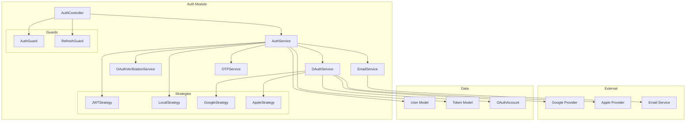
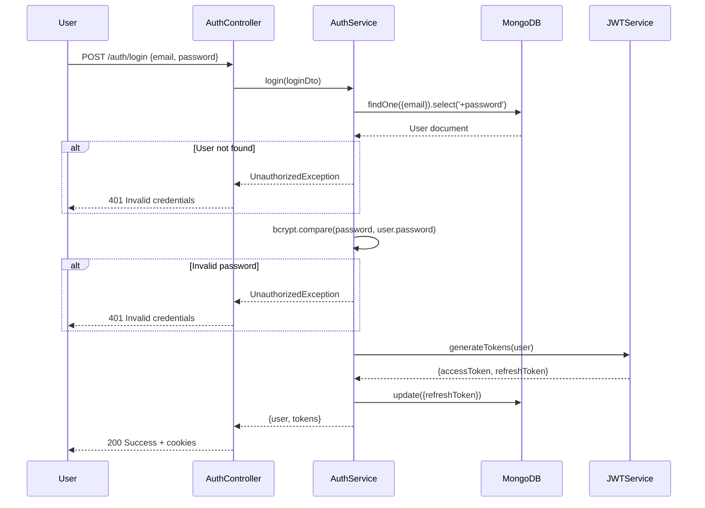

# 🏗️ AUTH MODULE - COMPLETE ARCHITECTURE GUIDE

**Version**: 1.0.0 (NestJS)  
**Last Updated**: 26-03-29  
**Level**: Senior/Mastery

---

## 📋 **TABLE OF CONTENTS**

1. [Module Overview](#module-overview)
2. [Architecture Diagram](#architecture-diagram)
3. [Module Structure](#module-structure)
4. [NestJS Patterns Used](#nestjs-patterns-used)
5. [Dependency Injection Graph](#dependency-injection-graph)
6. [Data Flow](#data-flow)
7. [API Endpoints](#api-endpoints)
8. [Database Schema](#database-schema)
9. [Guards & Strategies](#guards--strategies)
10. [DTOs & Validation](#dtos--validation)
11. [Error Handling](#error-handling)
12. [Caching Strategy](#caching-strategy)
13. [Security](#security)
14. [Testing Strategy](#testing-strategy)
15. [Integration Points](#integration-points)

---

## 🎯 **MODULE OVERVIEW**

### **Purpose**
The Auth module handles all authentication and authorization concerns including:
- Local authentication (email/password)
- OAuth 2.0 (Google, Apple)
- JWT token management (access + refresh)
- OTP verification
- Password reset
- Email verification

### **Responsibilities**
- ✅ User registration and login
- ✅ Token generation and validation
- ✅ OAuth provider integration
- ✅ Password recovery flow
- ✅ Email verification
- ✅ Account lockout protection

### **Non-Responsibilities**
- ❌ User profile management (User module)
- ❌ User roles/permissions (handled by RolesGuard)
- ❌ Session management (stateless JWT)

---

## 🏛️ **ARCHITECTURE DIAGRAM**



---

## 📁 **MODULE STRUCTURE**

```
src/modules/auth.module/
├── auth.module.ts                      # Module definition
├── auth/
│   ├── auth.controller.ts              # HTTP request handlers (8 endpoints)
│   ├── auth.service.ts                 # Business logic
│   ├── auth.constants.ts               # Token TTL, bcrypt rounds
│   └── dto/
│       ├── login.dto.ts                # Login validation
│       ├── register.dto.ts             # Registration validation
│       ├── refresh-token.dto.ts        # Refresh token validation
│       └── forgot-password.dto.ts      # Password reset validation
├── otp/
│   ├── otp.service.ts                  # OTP generation/verification
│   └── dto/
│       └── create-otp.dto.ts           # OTP request validation
├── oauth/
│   ├── oauth-verification.service.ts   # OAuth token verification
│   └── dto/
│       └── oauth-login.dto.ts          # OAuth login validation
├── email/
│   └── email.service.ts                # Email sending
└── strategies/
    ├── jwt.strategy.ts                 # JWT authentication strategy
    ├── local.strategy.ts               # Local (email/pass) strategy
    ├── google.strategy.ts              # Google OAuth strategy
    └── apple.strategy.ts               # Apple Sign-In strategy
```

---

## 🎓 **NESTJS PATTERNS USED**

### **1. Strategy Pattern (Passport)**
```typescript
// strategies/jwt.strategy.ts
@Injectable()
export class JwtStrategy extends PassportStrategy(Strategy, 'jwt') {
  constructor(
    private configService: ConfigService,
  ) {
    super({
      jwtFromRequest: ExtractJwt.fromAuthHeaderAsBearerToken(),
      ignoreExpiration: false,
      secretOrKey: configService.get('JWT_ACCESS_SECRET'),
    });
  }

  async validate(payload: JwtPayload) {
    return {
      userId: payload.sub,
      email: payload.email,
      role: payload.role,
    };
  }
}
```

**Why**: Decouples authentication logic, reusable across modules

---

### **2. Guard Pattern**
```typescript
// guards/auth.guard.ts
@Injectable()
export class AuthGuard implements CanActivate {
  constructor(private jwtService: JwtService) {}

  async canActivate(context: ExecutionContext): Promise<boolean> {
    const request = context.switchToHttp().getRequest();
    const token = this.extractTokenFromHeader(request);

    if (!token) {
      throw new UnauthorizedException('Token not found');
    }

    try {
      const payload = await this.jwtService.verifyAsync(token);
      request['user'] = payload;
    } catch {
      throw new UnauthorizedException('Invalid token');
    }

    return true;
  }
}
```

**Why**: Centralized auth logic, composable, testable

---

### **3. DTO Validation Pattern**
```typescript
// dto/login.dto.ts
export class LoginDto {
  @ApiProperty({ example: 'user@example.com' })
  @IsEmail({}, { message: 'Invalid email format' })
  @IsNotEmpty({ message: 'Email is required' })
  email: string;

  @ApiProperty({ example: 'Password123!' })
  @IsString()
  @MinLength(8, { message: 'Password must be at least 8 characters' })
  @IsNotEmpty({ message: 'Password is required' })
  password: string;
}
```

**Why**: Type-safe, validated at boundary, clear error messages

---

### **4. Service Layer Pattern**
```typescript
@Injectable()
export class AuthService {
  constructor(
    @InjectModel(User.name)
    private userModel: Model<UserDocument>,
    
    private jwtService: JwtService,
    private bcryptService: BcryptService,
    private otpService: OTPService,
  ) {}

  async login(loginDto: LoginDto) {
    const user = await this.userModel.findOne({ email: loginDto.email })
      .select('+password')
      .exec();

    if (!user) {
      throw new UnauthorizedException('Invalid credentials');
    }

    const isValid = await this.bcryptService.compare(
      loginDto.password,
      user.password,
    );

    if (!isValid) {
      throw new UnauthorizedException('Invalid credentials');
    }

    const tokens = await this.jwtService.generateTokens(user);
    return { user, ...tokens };
  }
}
```

**Why**: Business logic isolation, testable, reusable

---

## 🔗 **DEPENDENCY INJECTION GRAPH**

```
AuthModule
├── AuthService
│   ├── @InjectModel(User.name) → UserModel
│   ├── JwtService → @nestjs/jwt
│   ├── BcryptService → custom provider
│   └── OTPService → internal
├── OAuthService
│   ├── @InjectModel(OAuthAccount.name) → OAuthAccountModel
│   ├── GoogleAuthLibrary → external
│   └── AppleSignInAuth → external
├── EmailService
│   └── MailService → nodemailer
├── JWTStrategy
│   └── JwtService → @nestjs/jwt
└── LocalStrategy
    └── AuthService → internal
```

**Key Insight**: All dependencies are injected, never instantiated manually. This enables:
- Easy testing with mocks
- Loose coupling
- Clear dependency graph

---

## 🔄 **DATA FLOW**

### **Login Flow**


---

## 📡 **API ENDPOINTS**

### **Public Endpoints** (No auth required)

| Method | Endpoint | Description | Rate Limit |
|--------|----------|-------------|------------|
| `POST` | `/auth/register` | Register new user | 5/min |
| `POST` | `/auth/login` | Login with email/password | 5/15min |
| `POST` | `/auth/refresh` | Refresh access token | 10/min |
| `POST` | `/auth/forgot-password` | Request password reset | 3/hour |
| `POST` | `/auth/reset-password` | Reset password with token | 5/hour |
| `POST` | `/auth/verify-email` | Verify email with OTP | 10/min |
| `POST` | `/auth/resend-otp` | Resend verification OTP | 3/hour |
| `POST` | `/auth/oauth` | OAuth login (Google/Apple) | 10/min |

---

## 🗄️ **DATABASE SCHEMA**

### **User Schema**
```typescript
@Schema({ timestamps: true })
export class User {
  @Prop({ required: true })
  name: string;

  @Prop({ required: true, unique: true, lowercase: true })
  email: string;

  @Prop({ required: true, select: false })
  password: string;

  @Prop({ enum: ['user', 'admin', 'subAdmin'], default: 'user' })
  role: string;

  @Prop({ default: false })
  isEmailVerified: boolean;

  @Prop()
  refreshToken?: string;

  @Prop({ default: 0 })
  failedLoginAttempts: number;

  @Prop()
  lockUntil?: Date;

  @Prop({ default: false })
  isDeleted: boolean;
}

// Indexes
UserSchema.index({ email: 1, isDeleted: 1 });
UserSchema.index({ role: 1, isDeleted: 1 });
```

### **Token Schema** (for refresh tokens)
```typescript
@Schema({ timestamps: true })
export class Token {
  @Prop({ type: Schema.Types.ObjectId, ref: 'User', required: true })
  userId: Types.ObjectId;

  @Prop({ required: true })
  refreshToken: string;

  @Prop({ required: true })
  expiresAt: Date;

  @Prop({ default: false })
  isRevoked: boolean;
}

// Indexes
TokenSchema.index({ userId: 1, isRevoked: 1 });
TokenSchema.index({ expiresAt: 1 }, { expireAfterSeconds: 0 });
```

---

## 🛡️ **GUARDS & STRATEGIES**

### **AuthGuard**
```typescript
// Uses JWT strategy
@UseGuards(AuthGuard('jwt'))
@Get('profile')
async getProfile(@User() user: any) {
  return this.authService.getProfile(user.userId);
}
```

### **LocalStrategy**
```typescript
// For email/password login
@Injectable()
export class LocalStrategy extends PassportStrategy(Strategy, 'local') {
  constructor(private authService: AuthService) {
    super({
      usernameField: 'email',
      passwordField: 'password',
    });
  }

  async validate(email: string, password: string) {
    return this.authService.validateUser(email, password);
  }
}
```

### **JWTStrategy**
```typescript
// Validates JWT tokens
@Injectable()
export class JwtStrategy extends PassportStrategy(Strategy, 'jwt') {
  async validate(payload: JwtPayload) {
    return {
      userId: payload.sub,
      email: payload.email,
      role: payload.role,
    };
  }
}
```

---

## 📝 **DTOS & VALIDATION**

### **LoginDto**
```typescript
export class LoginDto {
  @IsEmail()
  @IsNotEmpty()
  email: string;

  @IsString()
  @MinLength(8)
  @IsNotEmpty()
  password: string;
}
```

### **RegisterDto**
```typescript
export class RegisterDto {
  @IsString()
  @MinLength(2)
  @MaxLength(50)
  name: string;

  @IsEmail()
  @IsNotEmpty()
  email: string;

  @IsString()
  @MinLength(8)
  @Matches(/^(?=.*[a-z])(?=.*[A-Z])(?=.*\d)/, {
    message: 'Password must contain uppercase, lowercase, and number'
  })
  password: string;
}
```

### **Validation Pipe Configuration**
```typescript
// main.ts
app.useGlobalPipes(
  new ValidationPipe({
    whitelist: true,      // Strip non-whitelisted properties
    forbidNonWhitelisted: true, // Throw error for unknown properties
    transform: true,      // Transform payloads to DTO instances
    transformOptions: {
      enableImplicitConversion: true,
    },
  }),
);
```

---

## ⚠️ **ERROR HANDLING**

### **Exception Filters**
```typescript
// http-exception.filter.ts
@Catch()
export class HttpExceptionFilter implements ExceptionFilter {
  catch(exception: unknown, host: ArgumentsHost) {
    const ctx = host.switchToHttp();
    const response = ctx.getResponse<Response>();
    const status = exception instanceof HttpException
      ? exception.getStatus()
      : HttpStatus.INTERNAL_SERVER_ERROR;

    response.status(status).json({
      success: false,
      statusCode: status,
      message: exception instanceof HttpException
        ? exception.message
        : 'Internal server error',
      timestamp: new Date().toISOString(),
    });
  }
}
```

### **Custom Exceptions**
```typescript
// auth.exceptions.ts
export class InvalidCredentialsException extends UnauthorizedException {
  constructor() {
    super({
      success: false,
      message: 'Invalid email or password',
    });
  }
}

export class AccountLockedException extends BadRequestException {
  constructor(lockUntil: Date) {
    super({
      success: false,
      message: `Account locked until ${lockUntil.toISOString()}`,
    });
  }
}
```

---

## 🚀 **CACHING STRATEGY**

### **Cache Keys**
```typescript
const cacheKeys = {
  user: (userId: string) => `auth:user:${userId}`,
  otp: (email: string) => `auth:otp:${email}`,
  failedAttempts: (email: string) => `auth:failed:${email}`,
};
```

### **Cache TTLs**
```typescript
const cacheTTL = {
  user: 300,        // 5 minutes
  otp: 600,         // 10 minutes
  failedAttempts: 900, // 15 minutes
};
```

### **Cache Invalidation**
```typescript
// Invalidate on password change
async changePassword(userId: string, newPassword: string) {
  await this.userModel.findByIdAndUpdate(userId, {
    password: await this.bcrypt.hash(newPassword),
  });
  
  // Invalidate cache
  await this.cacheManager.del(`auth:user:${userId}`);
}
```

---

## 🔐 **SECURITY**

### **Password Hashing**
```typescript
const saltRounds = 12; // bcrypt rounds
const hash = await bcrypt.hash(password, saltRounds);
```

### **Account Lockout**
```typescript
async handleFailedLogin(email: string) {
  const key = `auth:failed:${email}`;
  const attempts = await this.cacheManager.get(key) || 0;
  
  if (attempts >= 5) {
    const lockUntil = new Date(Date.now() + 15 * 60 * 1000); // 15 min
    await this.userModel.updateOne(
      { email },
      { lockUntil, failedLoginAttempts: attempts + 1 },
    );
    throw new AccountLockedException(lockUntil);
  }
  
  await this.cacheManager.set(key, attempts + 1, 900);
}
```

### **JWT Token Security**
```typescript
const jwtConfig = {
  accessSecret: config.jwt.accessSecret,
  refreshSecret: config.jwt.refreshSecret,
  accessExpiration: '15m',    // Short-lived
  refreshExpiration: '7d',    // Long-lived
};
```

---

## 🧪 **TESTING STRATEGY**

### **Unit Tests**
```typescript
describe('AuthService', () => {
  let service: AuthService;
  let userModel: Model<UserDocument>;
  let jwtService: JwtService;

  beforeEach(async () => {
    const module: TestingModule = await Test.createTestingModule({
      providers: [
        AuthService,
        {
          provide: getModelToken('User'),
          useValue: {
            findOne: jest.fn(),
            create: jest.fn(),
          },
        },
        {
          provide: JwtService,
          useValue: {
            signAsync: jest.fn(),
            verifyAsync: jest.fn(),
          },
        },
      ],
    }).compile();

    service = module.get<AuthService>(AuthService);
    userModel = module.get<Model<UserDocument>>(getModelToken('User'));
  });

  it('should validate user credentials', async () => {
    // Test implementation
  });
});
```

### **E2E Tests**
```typescript
describe('Auth (e2e)', () => {
  let app: INestApplication;

  beforeAll(async () => {
    const moduleFixture = await Test.createTestingModule({
      imports: [AuthModule, ConfigModule],
    }).compile();

    app = moduleFixture.createNestApplication();
    await app.init();
  });

  it('/auth/login (POST)', () => {
    return request(app.getHttpServer())
      .post('/auth/login')
      .send({ email: 'test@example.com', password: 'password123' })
      .expect(200)
      .expect((res) => {
        expect(res.body.success).toBe(true);
        expect(res.body.data).toHaveProperty('accessToken');
      });
  });
});
```

---

## 🔗 **INTEGRATION POINTS**

### **With User Module**
```typescript
// Auth creates user, User manages profile
async register(registerDto: RegisterDto) {
  const user = await this.userModel.create({
    ...registerDto,
    role: 'user',
  });
  
  // User module handles profile creation via event
  this.eventEmitter.emit('user.created', { userId: user._id });
}
```

### **With Notification Module**
```typescript
// Send welcome email after registration
async register(registerDto: RegisterDto) {
  const user = await this.userModel.create(registerDto);
  
  await this.notificationService.sendEmail({
    to: user.email,
    subject: 'Welcome!',
    template: 'welcome',
  });
}
```

---

## 📚 **KEY TAKEAWAYS**

1. **Strategy Pattern** - Passport strategies for auth
2. **Guard Pattern** - Reusable auth guards
3. **DTO Validation** - Type-safe input validation
4. **Service Layer** - Business logic isolation
5. **DI** - All dependencies injected
6. **Caching** - Redis for failed attempts, OTP
7. **Security** - bcrypt, JWT, account lockout
8. **Testing** - Unit + E2E tests

---

**Next Steps**: Study this module, then move to User module which builds on these patterns.

---
-26-03-29
