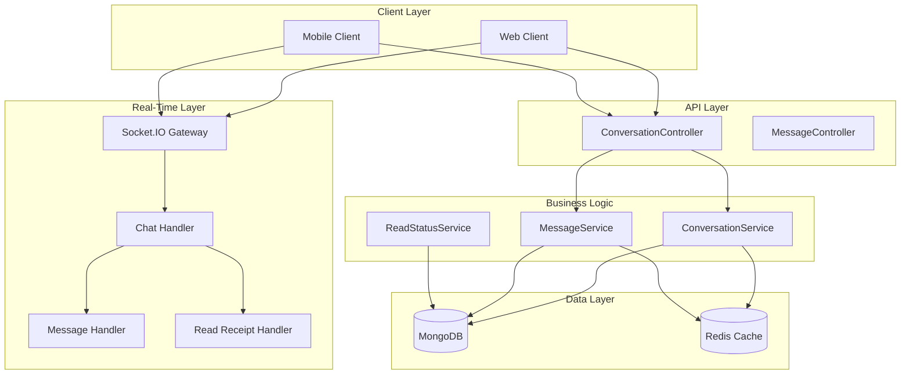
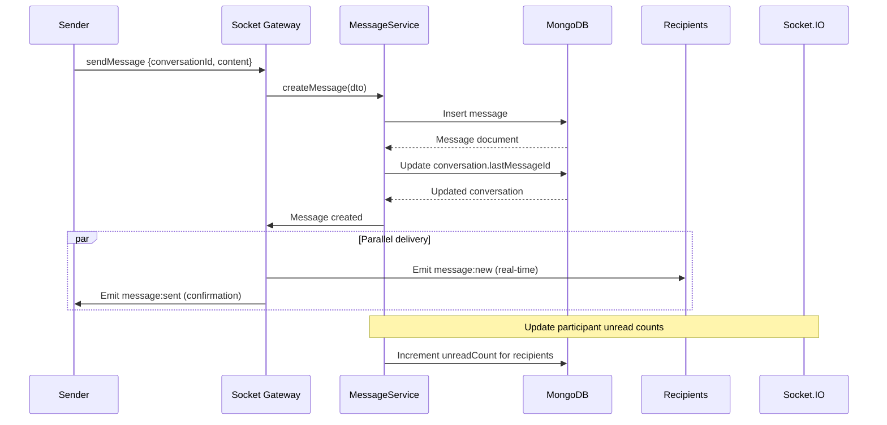
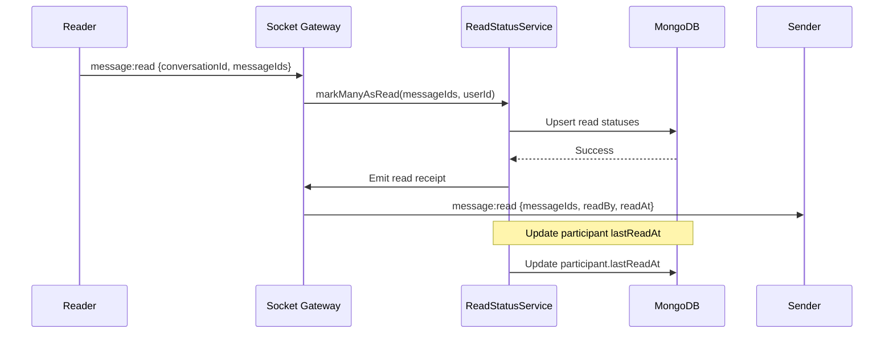
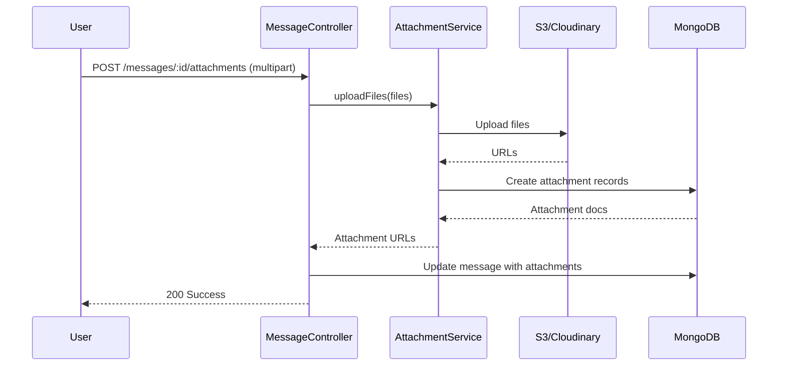

# 🏗️ CHATTING MODULE - COMPREHENSIVE ARCHITECTURE GUIDE

**Version**: 1.0.0 (NestJS)  
**Last Updated**: 26-03-29  
**Level**: Senior/Mastery  
**Estimated Study Time**: 2-3 hours

---

## 📋 **TABLE OF CONTENTS**

1. [Module Overview](#1-module-overview)
2. [Business Requirements](#2-business-requirements)
3. [System Architecture](#3-system-architecture)
4. [Module Structure](#4-module-structure)
5. [Database Schema Design](#5-database-schema-design)
6. [Conversation Lifecycle](#6-conversation-lifecycle)
7. [Message Flow Architecture](#7-message-flow-architecture)
8. [API Endpoints Complete Reference](#8-api-endpoints-complete-reference)
9. [Socket.IO Real-Time Messaging](#9-socketio-real-time-messaging)
10. [Message Read Status Tracking](#10-message-read-status-tracking)
11. [Last Message Update Pattern](#11-last-message-update-pattern)
12. [Caching Strategy](#12-caching-strategy)
13. [File Attachments](#13-file-attachments)
14. [Error Handling](#14-error-handling)
15. [Security & Permissions](#15-security--permissions)
16. [Performance Optimization](#16-performance-optimization)
17. [Testing Strategy](#17-testing-strategy)
18. [Integration Points](#18-integration-points)

---

## 1. **MODULE OVERVIEW**

### **1.1 Purpose & Scope**

The Chatting module provides **real-time messaging capabilities** for the task management platform:
- **One-on-one conversations** between users
- **Group conversations** for task collaborators
- **Real-time message delivery** via Socket.IO
- **Message status tracking** (sent, delivered, read)
- **File attachments** in messages
- **Last message preview** in conversation lists
- **Typing indicators** (future enhancement)

### **1.2 Key Design Principles**

1. **Real-Time First**: All messages delivered instantly via Socket.IO
2. **Eventual Consistency**: Message read status updated asynchronously
3. **Scalable**: Horizontal scaling via Redis adapter for Socket.IO
4. **Reliable**: Message persistence, delivery confirmation
5. **Efficient**: Pagination, caching, optimized queries

### **1.3 What This Module Does NOT Do**

- ❌ **Video/Audio Calls**: WebRTC functionality (separate module)
- ❌ **End-to-End Encryption**: Messages stored in plaintext (can be added)
- ❌ **Message Reactions**: Emoji reactions (future enhancement)
- ❌ **Message Editing**: Edit sent messages (future enhancement)

### **1.4 Module Statistics**

| Metric | Value |
|--------|-------|
| **Total Files** | 18 files |
| **Lines of Code** | ~2,200 lines |
| **API Endpoints** | 12 endpoints |
| **Socket Events** | 8 event types |
| **Database Collections** | 4 (Conversation, Participant, Message, ReadStatus) |
| **Cache Keys** | 6 patterns |

---

## 2. **BUSINESS REQUIREMENTS**

### **2.1 Functional Requirements**

| ID | Requirement | Priority |
|----|-------------|----------|
| FR-1 | Create one-on-one conversation | P0 |
| FR-2 | Create group conversation for task collaborators | P1 |
| FR-3 | Send text messages | P0 |
| FR-4 | Send file attachments (images, documents) | P1 |
| FR-5 | Real-time message delivery | P0 |
| FR-6 | Message read status tracking | P1 |
| FR-7 | Conversation list with last message preview | P0 |
| FR-8 | Unread message count | P0 |
| FR-9 | Search conversations by participant | P2 |
| FR-10 | Mark all messages as read | P1 |

### **2.2 Non-Functional Requirements**

| ID | Requirement | Target |
|----|-------------|--------|
| NFR-1 | Message delivery latency (real-time) | < 200ms |
| NFR-2 | Message persistence latency | < 100ms |
| NFR-3 | Conversation list load time | < 500ms |
| NFR-4 | System availability | 99.9% |
| NFR-5 | Message throughput | 1000 messages/minute |
| NFR-6 | Cache hit rate | > 80% |

### **2.3 User Stories**

**Story 1: Task Collaboration Chat**
```
As a child working on a collaborative task
When I have questions about the task
I want to chat with other assigned children
So that we can coordinate our work
```

**Story 2: Parent Monitoring**
```
As a parent
When my children are collaborating on a task
I want to view their conversation
So that I can ensure appropriate communication
```

**Story 3: Unread Messages**
```
As a user
When I receive messages while offline
I want to see unread count and messages when I return
So that I don't miss important information
```

---

## 3. **SYSTEM ARCHITECTURE**

### **3.1 High-Level Architecture**

```
┌─────────────────────────────────────────────────────────────┐
│                     Client Applications                      │
│  ┌──────────┐  ┌──────────┐  ┌──────────┐                  │
│  │   Web    │  │   iOS    │  │ Android  │                  │
│  └────┬─────┘  └────┬─────┘  └────┬─────┘                  │
└───────┼─────────────┼─────────────┼─────────────────────────┘
        │             │             │
        │ WebSocket   │ WebSocket   │ WebSocket
        │             │             │
┌───────▼─────────────▼─────────────▼─────────────────────────┐
│                  Socket.IO Gateway                           │
│  ┌──────────────────────────────────────────────────────┐   │
│  │              Chatting Gateway                        │   │
│  │  ┌─────────────┐  ┌─────────────┐  ┌─────────────┐   │   │
│  │  │   Message   │  │  Typing     │  │   Read      │   │   │
│  │  │   Handler   │  │  Indicator  │  │  Receipt    │   │   │
│  │  └─────────────┘  └─────────────┘  └─────────────┘   │   │
│  └──────────────────────────────────────────────────────┘   │
└─────────────────────────────────────────────────────────────┘
        │
        │ HTTP (REST)
        │
┌───────▼─────────────┐
│  Chatting Module    │
│  ┌───────────────┐  │
│  │  Conversation │  │
│  │  Controller   │  │
│  └───────┬───────┘  │
│          │          │
│  ┌───────▼───────┐  │
│  │   Service     │  │
│  └───────┬───────┘  │
│          │          │
│  ┌───────▼───────┐  │
│  │   Processor   │  │
│  │  (BullMQ)     │  │
│  └───────────────┘  │
└───────┬─────────────┘
        │
┌───────▼─────────────┐  ┌────────────────┐
│   MongoDB           │  │   Redis        │
│  ┌───────────────┐  │  │  ┌──────────┐  │
│  │ Conversations │  │  │  │  Cache   │  │
│  │ Messages      │  │  │  │  Socket  │  │
│  │ Participants  │  │  │  │  Adapter │  │
│  │ ReadStatus    │  │  │  └──────────┘  │
│  └───────────────┘  │  └────────────────┘
└─────────────────────┘
```

### **3.2 Component Interaction Flow**



---

## 4. **MODULE STRUCTURE**

### **4.1 Complete File Structure**

```
src/modules/chatting.module/
├── chatting.module.ts                      # Parent module definition
├── conversation/
│   ├── conversation.controller.ts          # Conversation endpoints (6)
│   ├── conversation.service.ts             # Conversation business logic
│   ├── conversation.schema.ts              # Conversation schema
│   ├── conversation.constants.ts           # Conversation types, limits
│   └── dto/
│       ├── create-conversation.dto.ts      # Create conversation DTO
│       └── update-conversation.dto.ts      # Update conversation DTO
├── conversationParticipents/
│   ├── conversationParticipents.schema.ts  # Participant schema
│   └── conversationParticipents.service.ts # Participant management
├── message/
│   ├── message.controller.ts               # Message endpoints (6)
│   ├── message.service.ts                  # Message business logic
│   ├── message.schema.ts                   # Message schema
│   ├── message.constants.ts                # Message types, limits
│   └── dto/
│       ├── create-message.dto.ts           # Create message DTO
│       └── message.dto.ts                  # Message query DTO
├── messageReadStatus/
│   ├── messageReadStatus.schema.ts         # Read status schema
│   └── messageReadStatus.service.ts        # Read status tracking
├── processors/
│   └── conversation-last-message.processor.ts  # BullMQ processor
├── doc/
│   ├── README.md                           # Module documentation
│   ├── dia/
│   │   ├── conversation-schema.mermaid
│   │   ├── message-schema.mermaid
│   │   └── chatting-flow.mermaid
│   └── perf/
│       └── chatting-performance.md
└── socket.gateway/
    └── chat.socket.gateway.ts              # Socket.IO chat gateway
```

### **4.2 File Responsibilities**

| File | Responsibility | Lines |
|------|----------------|-------|
| `chatting.module.ts` | Module configuration, imports | 80 |
| `conversation/*.ts` | Conversation management | 400 |
| `conversationParticipents/*.ts` | Participant tracking | 150 |
| `message/*.ts` | Message CRUD operations | 500 |
| `messageReadStatus/*.ts` | Read status tracking | 200 |
| `processors/*.ts` | BullMQ last message updates | 150 |
| `socket.gateway/*.ts` | Real-time message delivery | 300 |
| `dto/*.ts` | Request validation | 200 |

---

## 5. **DATABASE SCHEMA DESIGN**

### **5.1 Conversation Schema**

```typescript
@Schema({ timestamps: true, toJSON: { virtuals: true } })
export class Conversation {
  /**
   * Conversation type
   */
  @Prop({
    type: String,
    enum: ['direct', 'group', 'task'],
    required: [true, 'Conversation type is required'],
    index: true,
  })
  type: ConversationType;

  /**
   * Conversation name (for group conversations)
   */
  @Prop({
    type: String,
    trim: true,
    maxlength: [100, 'Name cannot exceed 100 characters'],
  })
  name?: string;

  /**
   * Creator of the conversation
   */
  @Prop({
    type: Schema.Types.ObjectId,
    ref: 'User',
    required: [true, 'Creator is required'],
  })
  createdById: Types.ObjectId;

  /**
   * Related task (for task-based conversations)
   */
  @Prop({
    type: Schema.Types.ObjectId,
    ref: 'Task',
  })
  taskId?: Types.ObjectId;

  /**
   * ID of the last message sent
   * Updated via BullMQ for performance
   */
  @Prop({
    type: Schema.Types.ObjectId,
    ref: 'Message',
  })
  lastMessageId?: Types.ObjectId;

  /**
   * Preview of the last message
   * Denormalized for efficient conversation list queries
   */
  @Prop({
    type: String,
    maxlength: [200, 'Preview cannot exceed 200 characters'],
  })
  lastMessagePreview?: string;

  /**
   * When the last message was sent
   */
  @Prop()
  lastMessageAt?: Date;

  /**
   * Total message count
   */
  @Prop({ default: 0 })
  messageCount: number;

  /**
   * Active participant count
   */
  @Prop({ default: 0 })
  participantCount: number;

  /**
   * Soft delete flag
   */
  @Prop({ default: false })
  isDeleted: boolean;

  /**
   * Creation timestamp (auto-managed by Mongoose)
   */
  createdAt?: Date;

  /**
   * Last update timestamp (auto-managed by Mongoose)
   */
  updatedAt?: Date;
}

// Indexes for efficient queries
ConversationSchema.index({ createdById: 1, isDeleted: 1 });
ConversationSchema.index({ taskId: 1, isDeleted: 1 });
ConversationSchema.index({ lastMessageAt: -1, isDeleted: 1 });

// Virtual populate for participants
ConversationSchema.virtual('participants', {
  ref: 'ConversationParticipant',
  localField: '_id',
  foreignField: 'conversationId',
  match: { isDeleted: false },
});

// Virtual populate for last message
ConversationSchema.virtual('lastMessage', {
  ref: 'Message',
  localField: 'lastMessageId',
  foreignField: '_id',
  justOne: true,
});

// Static method: Find or create direct conversation
ConversationSchema.statics.findOrCreateDirect = async function(
  userId1: Types.ObjectId,
  userId2: Types.ObjectId,
): Promise<ConversationDocument> {
  // Try to find existing conversation
  const existing = await this.findOne({
    type: 'direct',
    isDeleted: false,
  }).where('participants').elemMatch({
    userId: { $in: [userId1, userId2] },
  });

  if (existing) {
    return existing;
  }

  // Create new conversation
  return this.create({
    type: 'direct',
    createdById: userId1,
    participantCount: 2,
  });
};

// toJSON transformation
ConversationSchema.set('toJSON', {
  transform: function(doc, ret, options) {
    ret.conversationId = ret._id;
    delete ret._id;
    delete ret.__v;
    delete ret.isDeleted;
    return ret;
  },
});
```

### **5.2 ConversationParticipant Schema**

```typescript
@Schema({ timestamps: true })
export class ConversationParticipant {
  /**
   * Reference to conversation
   */
  @Prop({
    type: Schema.Types.ObjectId,
    ref: 'Conversation',
    required: [true, 'Conversation is required'],
    index: true,
  })
  conversationId: Types.ObjectId;

  /**
   * Reference to user
   */
  @Prop({
    type: Schema.Types.ObjectId,
    ref: 'User',
    required: [true, 'User is required'],
    index: true,
  })
  userId: Types.ObjectId;

  /**
   * When user joined the conversation
   */
  @Prop({ default: Date.now })
  joinedAt: Date;

  /**
   * When user last read messages
   */
  @Prop()
  lastReadAt?: Date;

  /**
   * Unread message count (denormalized for performance)
   */
  @Prop({ default: 0 })
  unreadCount: number;

  /**
   * Whether participant has left the conversation
   */
  @Prop({ default: false })
  hasLeft: boolean;

  /**
   * When participant left
   */
  @Prop()
  leftAt?: Date;

  /**
   * Soft delete flag
   */
  @Prop({ default: false })
  isDeleted: boolean;

  createdAt?: Date;
  updatedAt?: Date;
}

// Indexes
ConversationParticipantSchema.index({ conversationId: 1, userId: 1, isDeleted: 1 });
ConversationParticipantSchema.index({ userId: 1, hasLeft: 1, isDeleted: 1 });

// Unique constraint: One entry per user per conversation
ConversationParticipantSchema.index(
  { conversationId: 1, userId: 1 },
  { unique: true, partialFilterExpression: { isDeleted: false } }
);
```

### **5.3 Message Schema**

```typescript
@Schema({ timestamps: true, toJSON: { virtuals: true } })
export class Message {
  /**
   * Reference to conversation
   */
  @Prop({
    type: Schema.Types.ObjectId,
    ref: 'Conversation',
    required: [true, 'Conversation is required'],
    index: true,
  })
  conversationId: Types.ObjectId;

  /**
   * Reference to sender
   */
  @Prop({
    type: Schema.Types.ObjectId,
    ref: 'User',
    required: [true, 'Sender is required'],
    index: true,
  })
  senderId: Types.ObjectId;

  /**
   * Message content (text)
   */
  @Prop({
    type: String,
    trim: true,
    maxlength: [5000, 'Message cannot exceed 5000 characters'],
  })
  content?: string;

  /**
   * Message type
   */
  @Prop({
    type: String,
    enum: ['text', 'image', 'file', 'system'],
    default: 'text',
    index: true,
  })
  type: MessageType;

  /**
   * File attachments (for image/file messages)
   */
  @Prop({
    type: [{
      url: String,
      filename: String,
      mimeType: String,
      size: Number,
    }],
  })
  attachments?: Array<{
    url: string;
    filename: string;
    mimeType: string;
    size: number;
  }>;

  /**
   * Parent message ID (for replies)
   */
  @Prop({
    type: Schema.Types.ObjectId,
    ref: 'Message',
  })
  replyTo?: Types.ObjectId;

  /**
   * Message is edited
   */
  @Prop({ default: false })
  isEdited: boolean;

  /**
   * When message was edited
   */
  @Prop()
  editedAt?: Date;

  /**
   * Soft delete flag (message deletion)
   */
  @Prop({ default: false })
  isDeleted: boolean;

  /**
   * Creation timestamp (auto-managed by Mongoose)
   */
  createdAt?: Date;

  /**
   * Last update timestamp (auto-managed by Mongoose)
   */
  updatedAt?: Date;
}

// Indexes for efficient queries
MessageSchema.index({ conversationId: 1, createdAt: -1, isDeleted: 1 });
MessageSchema.index({ senderId: 1, isDeleted: 1 });
MessageSchema.index({ type: 1, isDeleted: 1 });

// TTL index for auto-deleting old messages (optional, e.g., after 1 year)
// MessageSchema.index({ createdAt: 1 }, { expireAfterSeconds: 31536000 });

// Virtual populate for sender
MessageSchema.virtual('sender', {
  ref: 'User',
  localField: 'senderId',
  foreignField: '_id',
  justOne: true,
});

// Virtual populate for replies
MessageSchema.virtual('replies', {
  ref: 'Message',
  localField: '_id',
  foreignField: 'replyTo',
  match: { isDeleted: false },
});

// Static method: Get messages with pagination
MessageSchema.statics.getConversationMessages = async function(
  conversationId: Types.ObjectId,
  options: { page?: number; limit?: number; before?: Date } = {},
) {
  const { page = 1, limit = 50, before } = options;
  
  const query: any = {
    conversationId,
    isDeleted: false,
  };

  if (before) {
    query.createdAt = { $lt: before };
  }

  return this.find(query)
    .sort({ createdAt: -1 })
    .skip((page - 1) * limit)
    .limit(limit)
    .populate('sender', 'name email profileImage')
    .populate('replyTo', 'content senderId')
    .lean();
};

// toJSON transformation
MessageSchema.set('toJSON', {
  transform: function(doc, ret, options) {
    ret.messageId = ret._id;
    delete ret._id;
    delete ret.__v;
    delete ret.isDeleted;
    return ret;
  },
});
```

### **5.4 MessageReadStatus Schema**

```typescript
@Schema({ timestamps: true })
export class MessageReadStatus {
  /**
   * Reference to message
   */
  @Prop({
    type: Schema.Types.ObjectId,
    ref: 'Message',
    required: [true, 'Message is required'],
    index: true,
  })
  messageId: Types.ObjectId;

  /**
   * Reference to user who read the message
   */
  @Prop({
    type: Schema.Types.ObjectId,
    ref: 'User',
    required: [true, 'User is required'],
    index: true,
  })
  userId: Types.ObjectId;

  /**
   * When the message was read
   */
  @Prop({ required: true })
  readAt: Date;

  /**
   * Soft delete flag
   */
  @Prop({ default: false })
  isDeleted: boolean;

  createdAt?: Date;
  updatedAt?: Date;
}

// Indexes
MessageReadStatusSchema.index({ messageId: 1, userId: 1, isDeleted: 1 }, { unique: true });
MessageReadStatusSchema.index({ userId: 1, readAt: -1, isDeleted: 1 });

// Static method: Mark message as read
MessageReadStatusSchema.statics.markAsRead = async function(
  messageId: Types.ObjectId,
  userId: Types.ObjectId,
): Promise<MessageReadStatusDocument> {
  return this.findOneAndUpdate(
    { messageId, userId },
    {
      messageId,
      userId,
      readAt: new Date(),
      isDeleted: false,
    },
    { upsert: true, new: true },
  );
};

// Static method: Get unread count for user in conversation
MessageReadStatusSchema.statics.getUnreadCount = async function(
  conversationId: Types.ObjectId,
  userId: Types.ObjectId,
): Promise<number> {
  const pipeline = [
    {
      $match: {
        conversationId,
        senderId: { $ne: userId },
        isDeleted: false,
      },
    },
    {
      $lookup: {
        from: 'messagereadstatuses',
        let: { messageId: '$_id' },
        pipeline: [
          {
            $match: {
              $expr: {
                $and: [
                  { $eq: ['$messageId', '$$messageId'] },
                  { $eq: ['$userId', userId] },
                ],
              },
            },
          },
        ],
        as: 'readStatus',
      },
    },
    {
      $match: {
        readStatus: { $size: 0 },
      },
    },
    {
      $count: 'total',
    },
  ];

  const result = await this.model('Message').aggregate(pipeline);
  return result[0]?.total || 0;
};
```

---

## 6. **CONVERSATION LIFECYCLE**

### **6.1 Conversation Types**

| Type | Description | Participants | Use Case |
|------|-------------|--------------|----------|
| **Direct** | One-on-one conversation | 2 users | Private chat between users |
| **Group** | Multi-user conversation | 3+ users | General group discussion |
| **Task** | Task-based conversation | Task assignees | Collaboration on specific task |

### **6.2 Conversation Creation Flow**

```mermaid
sequenceDiagram
    participant U as User
    participant C as ConversationController
    participant CS as ConversationService
    participant DB as MongoDB
    participant CPS as ConversationParticipantService
    participant Socket as Socket.IO

    U->>C: POST /conversations {type, participantIds, taskId}
    C->>CS: createConversation(dto)
    
    alt Direct conversation
        CS->>DB: Find existing direct conversation
        DB-->>CS: Existing or null
        
        if Existing found
            CS-->>C: Existing conversation
            C-->>U: 200 Success (existing)
        end
    end
    
    CS->>DB: Create conversation
    DB-->>CS: Conversation document
    
    CS->>CPS: Add participants (bulk)
    CPS->>DB: Insert participants
    DB-->>CPS: Success
    
    CS->>Socket: Emit conversation:created
    Socket-->>Participants: Real-time notification
    
    CS-->>C: Created conversation
    C-->>U: 201 Success
```

### **6.3 Conversation State Transitions**

```
[Created] --> [Active] --> [Left] --> [Archived]
     |            |
     |            └───> [Deleted]
     |
     └───> [Deleted]
```

---

## 7. **MESSAGE FLOW ARCHITECTURE**

### **7.1 Send Message Flow (Real-Time)**



### **7.2 Message Delivery States**

```typescript
enum MessageDeliveryStatus {
  SENT = 'sent',      // Message saved to database
  DELIVERED = 'delivered', // Message delivered to recipient's device
  READ = 'read',      // Recipient has read the message
}
```

---

## 8. **API ENDPOINTS COMPLETE REFERENCE**

### **8.1 Conversation Endpoints**

| Method | Endpoint | Auth | Description |
|--------|----------|------|-------------|
| `GET` | `/conversations` | ✅ | Get my conversations (paginated) |
| `GET` | `/conversations/:id` | ✅ | Get conversation details |
| `POST` | `/conversations` | ✅ | Create conversation |
| `POST` | `/conversations/direct/:userId` | ✅ | Get/create direct conversation |
| `PUT` | `/conversations/:id/leave` | ✅ | Leave conversation |
| `DELETE` | `/conversations/:id` | ✅ | Delete conversation (owner only) |

### **8.2 Message Endpoints**

| Method | Endpoint | Auth | Description |
|--------|----------|------|-------------|
| `GET` | `/conversations/:id/messages` | ✅ | Get messages (paginated) |
| `POST` | `/conversations/:id/messages` | ✅ | Send message |
| `GET` | `/messages/:id` | ✅ | Get message by ID |
| `PUT` | `/messages/:id` | ✅ | Update message (edit) |
| `DELETE` | `/messages/:id` | ✅ | Delete message |
| `POST` | `/messages/:id/reply` | ✅ | Reply to message |

---

## 9. **SOCKET.IO REAL-TIME MESSAGING**

### **9.1 Socket Gateway Implementation**

```typescript
@WebSocketGateway({
  cors: {
    origin: process.env.CLIENT_URL,
    credentials: true,
  },
  namespace: 'chat',
})
export class ChatSocketGateway implements OnModuleInit {
  private readonly logger = new Logger(ChatSocketGateway.name);

  async onModuleInit() {
    this.logger.log('✅ Chat Socket Gateway initialized');
  }

  /**
   * Handle client connection
   */
  @SubscribeMessage('connect')
  async handleConnect(
    @ConnectedSocket() client: Socket,
    @MessageBody() data: { userId: string },
  ) {
    this.logger.log(`Client connected: ${client.id} (user: ${data.userId})`);
    
    // Join user's personal room
    client.join(`user:${data.userId}`);
    client.data.userId = data.userId;
  }

  /**
   * Join conversation room
   */
  @SubscribeMessage('join:conversation')
  handleJoinConversation(
    @ConnectedSocket() client: Socket,
    @MessageBody() data: { conversationId: string },
  ) {
    client.join(`conversation:${data.conversationId}`);
    this.logger.debug(`User ${client.data.userId} joined conversation ${data.conversationId}`);
  }

  /**
   * Send message (real-time)
   */
  @SubscribeMessage('message:send')
  async handleMessageSend(
    @ConnectedSocket() client: Socket,
    @MessageBody() data: { conversationId: string; content: string; type?: string },
  ) {
    const senderId = client.data.userId;
    
    // Create message via service
    const message = await this.messageService.create({
      conversationId: data.conversationId,
      senderId,
      content: data.content,
      type: data.type || 'text',
    });

    // Emit to conversation room
    client.to(`conversation:${data.conversationId}`).emit('message:new', {
      messageId: message._id,
      conversationId: data.conversationId,
      senderId,
      content: message.content,
      type: message.type,
      createdAt: message.createdAt,
    });

    // Confirm to sender
    client.emit('message:sent', {
      messageId: message._id,
      status: 'sent',
    });
  }

  /**
   * Mark messages as read
   */
  @SubscribeMessage('message:read')
  async handleMessageRead(
    @ConnectedSocket() client: Socket,
    @MessageBody() data: { conversationId: string; messageIds: string[] },
  ) {
    const userId = client.data.userId;

    // Mark as read in database
    await this.readStatusService.markManyAsRead(data.messageIds, userId);

    // Emit read receipt to conversation
    client.to(`conversation:${data.conversationId}`).emit('message:read', {
      conversationId: data.conversationId,
      messageIds: data.messageIds,
      readBy: userId,
      readAt: new Date(),
    });
  }

  /**
   * Typing indicator
   */
  @SubscribeMessage('typing:start')
  handleTypingStart(
    @ConnectedSocket() client: Socket,
    @MessageBody() data: { conversationId: string },
  ) {
    client.to(`conversation:${data.conversationId}`).emit('typing:indicator', {
      conversationId: data.conversationId,
      userId: client.data.userId,
      isTyping: true,
    });
  }

  @SubscribeMessage('typing:stop')
  handleTypingStop(
    @ConnectedSocket() client: Socket,
    @MessageBody() data: { conversationId: string },
  ) {
    client.to(`conversation:${data.conversationId}`).emit('typing:indicator', {
      conversationId: data.conversationId,
      userId: client.data.userId,
      isTyping: false,
    });
  }
}
```

### **9.2 Socket Event Types**

| Event | Direction | Payload | Description |
|-------|-----------|---------|-------------|
| `connect` | Client → Server | `{ userId }` | Client connects |
| `join:conversation` | Client → Server | `{ conversationId }` | Join conversation room |
| `message:send` | Client → Server | `{ conversationId, content, type }` | Send message |
| `message:new` | Server → Client | `{ messageId, conversationId, senderId, content }` | New message received |
| `message:sent` | Server → Client | `{ messageId, status }` | Message sent confirmation |
| `message:read` | Client → Server / Server → Client | `{ conversationId, messageIds, readBy }` | Read receipt |
| `typing:start` | Client → Server | `{ conversationId }` | Started typing |
| `typing:stop` | Client → Server | `{ conversationId }` | Stopped typing |
| `typing:indicator` | Server → Client | `{ conversationId, userId, isTyping }` | Typing indicator |

---

## 10. **MESSAGE READ STATUS TRACKING**

### **10.1 Read Status Flow**



### **10.2 Read Status Aggregation**

```typescript
// Get read status for a message
async getMessageReadStatus(messageId: string): Promise<{
  readBy: Array<{ userId: string; readAt: Date }>;
  unreadCount: number;
}> {
  const readBy = await this.readStatusModel.find({ messageId }).lean();
  
  const conversation = await this.conversationModel.findById(messageId.conversationId);
  const unreadCount = conversation.participantCount - readBy.length;

  return {
    readBy: readBy.map(r => ({ userId: r.userId.toString(), readAt: r.readAt })),
    unreadCount,
  };
}
```

---

## 11. **LAST MESSAGE UPDATE PATTERN**

### **11.1 BullMQ Processor**

```typescript
@Processor(QUEUE_NAMES.CONVERSATION_LAST_MESSAGE)
export class ConversationLastMessageProcessor {
  constructor(
    private conversationService: ConversationService,
  ) {}

  @Process('updateLastMessage')
  async handleUpdateLastMessage(job: Job<LastMessageData>) {
    const { conversationId, messageId, preview, timestamp } = job.data;

    try {
      await this.conversationService.updateLastMessage(
        conversationId,
        messageId,
        preview,
        timestamp,
      );
    } catch (error) {
      console.error(`Failed to update last message: ${error.message}`);
      throw error;
    }
  }
}
```

### **11.2 Why Async Update?**

- ✅ **Performance**: Don't block message send on conversation update
- ✅ **Scalability**: Queue can handle bursts
- ✅ **Reliability**: Retry on failure
- ✅ **Consistency**: Single source of truth for last message

---

## 12. **CACHING STRATEGY**

### **12.1 Cache Keys**

```typescript
const CACHE_KEYS = {
  conversation: (conversationId: string) => `chat:conversation:${conversationId}`,
  conversationList: (userId: string, page: number) => `chat:user:${userId}:conversations:page:${page}`,
  messages: (conversationId: string, page: number) => `chat:conversation:${conversationId}:messages:page:${page}`,
  unreadCount: (userId: string) => `chat:user:${userId}:unread`,
  participant: (conversationId: string, userId: string) => `chat:participant:${conversationId}:${userId}`,
  lastMessage: (conversationId: string) => `chat:conversation:${conversationId}:lastMessage`,
};
```

### **12.2 Cache TTLs**

```typescript
const CACHE_TTL = {
  conversation: 300,        // 5 minutes
  conversationList: 180,    // 3 minutes
  messages: 120,            // 2 minutes
  unreadCount: 300,         // 5 minutes
  participant: 600,         // 10 minutes
  lastMessage: 60,          // 1 minute (updated frequently)
};
```

---

## 13. **FILE ATTACHMENTS**

### **13.1 Attachment Upload Flow**



### **13.2 Attachment Schema**

```typescript
@Schema()
export class Attachment {
  @Prop({ required: true })
  url: string;

  @Prop({ required: true })
  filename: string;

  @Prop({ required: true })
  mimeType: string;

  @Prop({ required: true })
  size: number;

  @Prop()
  width?: number; // For images

  @Prop()
  height?: number; // For images
}
```

---

## 14. **ERROR HANDLING**

### **14.1 Common Errors**

```typescript
export class ConversationNotFoundException extends NotFoundException {
  constructor(conversationId: string) {
    super({
      success: false,
      message: `Conversation not found: ${conversationId}`,
    });
  }
}

export class NotParticipantException extends ForbiddenException {
  constructor(userId: string, conversationId: string) {
    super({
      success: false,
      message: `User ${userId} is not a participant of conversation ${conversationId}`,
    });
  }
}

export class MessageNotFoundException extends NotFoundException {
  constructor(messageId: string) {
    super({
      success: false,
      message: `Message not found: ${messageId}`,
    });
  }
}
```

---

## 15. **SECURITY & PERMISSIONS**

### **15.1 Authorization Guards**

```typescript
@Injectable()
export class ConversationParticipantGuard implements CanActivate {
  constructor(
    @InjectModel(ConversationParticipant.name)
    private participantModel: Model<ConversationParticipantDocument>,
  ) {}

  async canActivate(context: ExecutionContext): Promise<boolean> {
    const request = context.switchToHttp().getRequest();
    const user = request.user;
    const conversationId = request.params.id || request.body.conversationId;

    if (!conversationId) {
      return true;
    }

    const participant = await this.participantModel.findOne({
      conversationId: new Types.ObjectId(conversationId),
      userId: new Types.ObjectId(user.userId),
      isDeleted: false,
    });

    return participant !== null;
  }
}
```

### **15.2 Message Permissions Matrix**

| Action | Sender | Participant | Non-Participant |
|--------|--------|-------------|-----------------|
| View messages | ✅ | ✅ | ❌ |
| Send messages | ✅ | ✅ | ❌ |
| Edit own message | ✅ | ❌ | ❌ |
| Delete own message | ✅ | ❌ | ❌ |
| Delete any message | ❌ | ❌ | ❌ |
| View read status | ✅ | ✅ | ❌ |

---

## 16. **PERFORMANCE OPTIMIZATION**

### **16.1 Pagination Strategy**

```typescript
// Cursor-based pagination for messages (better than offset)
async getMessages(
  conversationId: string,
  options: { limit?: number; before?: Date },
): Promise<MessageDocument[]> {
  const { limit = 50, before } = options;

  const query: any = {
    conversationId: new Types.ObjectId(conversationId),
    isDeleted: false,
  };

  if (before) {
    query.createdAt = { $lt: before };
  }

  return this.messageModel.find(query)
    .sort({ createdAt: -1 })
    .limit(limit + 1) // Fetch one extra to check if more exist
    .populate('sender', 'name profileImage')
    .lean();
}
```

### **16.2 Indexes for Performance**

```typescript
// Critical indexes
MessageSchema.index({ conversationId: 1, createdAt: -1 }); // Conversation messages
MessageSchema.index({ senderId: 1, createdAt: -1 }); // User's messages
ConversationParticipantSchema.index({ userId: 1, hasLeft: 0 }); // User's conversations
MessageReadStatusSchema.index({ messageId: 1, userId: 1 }); // Read status lookup
```

---

## 17. **TESTING STRATEGY**

### **17.1 Unit Tests**

```typescript
describe('MessageService', () => {
  let service: MessageService;
  let messageModel: Model<MessageDocument>;

  beforeEach(async () => {
    const module: TestingModule = await Test.createTestingModule({
      providers: [
        MessageService,
        {
          provide: getModelToken('Message'),
          useValue: {
            create: jest.fn(),
            find: jest.fn(),
            findById: jest.fn(),
          },
        },
      ],
    }).compile();

    service = module.get<MessageService>(MessageService);
  });

  it('should create message successfully', async () => {
    const dto: CreateMessageDto = {
      conversationId: '507f1f77bcf86cd799439011',
      content: 'Hello',
      type: 'text',
    };

    jest.spyOn(messageModel, 'create').mockResolvedValue({
      _id: new Types.ObjectId(),
      ...dto,
    } as any);

    const result = await service.createMessage(dto, 'senderId');

    expect(result).toBeDefined();
    expect(result.content).toBe('Hello');
  });
});
```

### **17.2 Socket.IO Tests**

```typescript
describe('ChatSocketGateway (e2e)', () => {
  let app: INestApplication;
  let socket: SocketIOClient.Socket;

  beforeAll(async () => {
    const moduleFixture = await Test.createTestingModule({
      imports: [ChattingModule],
    }).compile();

    app = moduleFixture.createNestApplication();
    await app.listen(3001);
  });

  beforeEach((done) => {
    socket = io('http://localhost:3001/chat', {
      auth: { token: authToken },
    });

    socket.on('connect', () => {
      done();
    });
  });

  it('should receive message in real-time', (done) => {
    socket.emit('message:send', {
      conversationId: '507f1f77bcf86cd799439011',
      content: 'Test message',
    });

    socket.on('message:new', (data) => {
      expect(data.content).toBe('Test message');
      done();
    });
  });
});
```

---

## 18. **INTEGRATION POINTS**

### **18.1 With Task Module**

```typescript
// Create task-based conversation automatically
async createTask(taskDto: CreateTaskDto): Promise<TaskDocument> {
  const task = await this.taskModel.create(taskDto);

  // Create conversation for task collaborators
  if (task.taskType === 'collaborative') {
    await this.conversationService.createTaskConversation(task);
  }

  return task;
}
```

### **18.2 With Notification Module**

```typescript
// Send push notification for new message
async sendMessage(dto: CreateMessageDto): Promise<MessageDocument> {
  const message = await this.messageModel.create(dto);

  // Send notification to recipients
  await this.notificationService.sendPush({
    userIds: recipientIds,
    title: 'New Message',
    body: message.content,
    data: {
      type: 'message',
      conversationId: message.conversationId.toString(),
    },
  });

  return message;
}
```

---

## 📚 **KEY TAKEAWAYS**

1. **Real-Time First** - Socket.IO for instant message delivery
2. **Eventual Consistency** - Last message, read status updated async
3. **Scalable** - Redis adapter for Socket.IO horizontal scaling
4. **Efficient** - Cursor pagination, caching, optimized indexes
5. **Reliable** - Message persistence, delivery confirmation
6. **Secure** - Participant-based authorization
7. **Extensible** - Easy to add reactions, editing, etc.

---

**Next Module**: Socket.Gateway Module (centralized Socket.IO architecture)

---
-26-03-29
