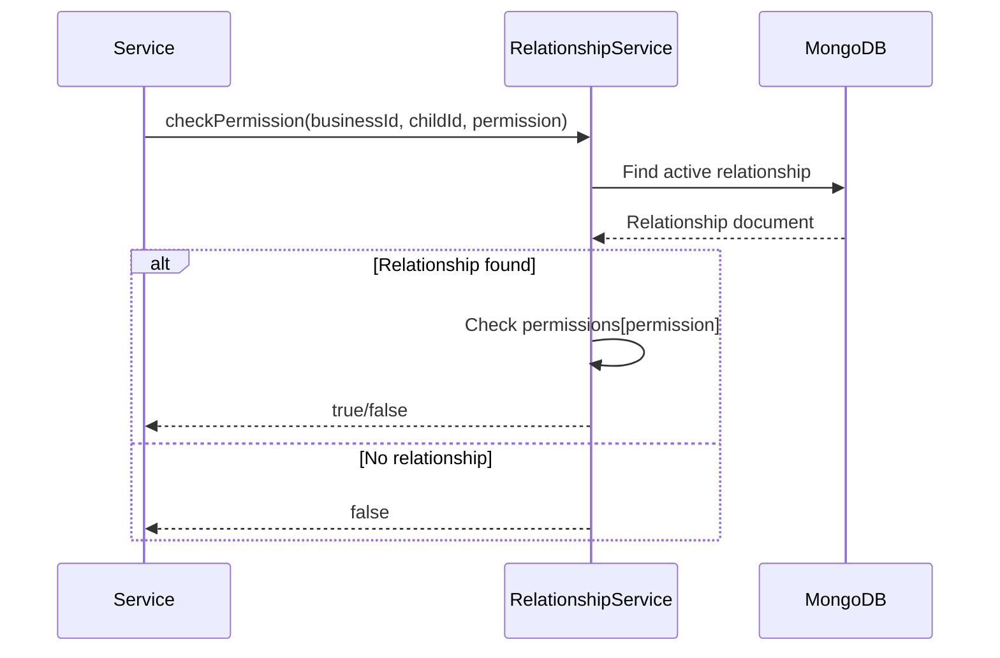

# 🏗️ CHILDRENBUSINESSUSER MODULE - COMPREHENSIVE ARCHITECTURE GUIDE

**Version**: 1.0.0 (NestJS)  
**Last Updated**: 26-03-29  
**Level**: Senior/Mastery  
**Estimated Study Time**: 1 hour

---

## 📋 **TABLE OF CONTENTS**

1. [Module Overview](#1-module-overview)
2. [Family Relationship Model](#2-family-relationship-model)
3. [Module Structure](#3-module-structure)
4. [Database Schema](#4-database-schema)
5. [Relationship Types](#5-relationship-types)
6. [API Endpoints](#6-api-endpoints)
7. [Business Logic](#7-business-logic)
8. [Permission Inheritance](#8-permission-inheritance)
9. [Family Activity Feed](#9-family-activity-feed)
10. [Caching Strategy](#10-caching-strategy)
11. [Validation Rules](#11-validation-rules)
12. [Error Handling](#12-error-handling)
13. [Security Considerations](#13-security-considerations)
14. [Integration Points](#14-integration-points)

---

## 1. **MODULE OVERVIEW**

### **1.1 Purpose & Scope**

The ChildrenBusinessUser module manages **family relationships** in the task management platform:
- **Parent-Child relationships**: Link children to business/parent accounts
- **Multiple families**: Support for blended families, guardians
- **Relationship metadata**: Custody arrangements, permissions
- **Family activity feed**: Aggregated view of family activities
- **Permission inheritance**: Children inherit family permissions

### **1.2 Key Design Principles**

1. **Explicit Relationships**: All relationships are explicit and auditable
2. **Multiple Guardians**: Support for multiple parents/guardians per child
3. **Flexible Structure**: Support for various family structures
4. **Privacy**: Relationship data is sensitive and protected
5. **Audit Trail**: All relationship changes are logged

### **1.3 Module Statistics**

| Metric | Value |
|--------|-------|
| **Total Files** | 8 files |
| **Lines of Code** | ~800 lines |
| **API Endpoints** | 6 endpoints |
| **Relationship Types** | 4 types |
| **Cache Keys** | 4 patterns |

---

## 2. **FAMILY RELATIONSHIP MODEL**

### **2.1 Entity Relationship Diagram**

```
┌─────────────┐       ┌──────────────────────────┐       ┌─────────────┐
│    User     │       │  ChildrenBusinessUser    │       │    User     │
│  (Parent)   │◄──────┤                          ├──────►│   (Child)   │
│             │       │  - relationshipType      │       │             │
│  - role:    │       │  - permissions           │       │  - role:    │
│  'business' │       │  - isActive              │       │  'child'    │
└─────────────┘       │  - establishedDate       │       └─────────────┘
                      │  - establishedBy         │
                      └──────────────────────────┘
```

### **2.2 Relationship Types**

| Type | Description | Use Case |
|------|-------------|----------|
| **Parent-Child** | Biological/adoptive parent | Standard family |
| **Guardian-Ward** | Legal guardian | Foster care, guardianship |
| **Teacher-Student** | Educational relationship | School context |
| **Mentor-Mentee** | Guidance relationship | Coaching, mentoring |

---

## 3. **MODULE STRUCTURE**

### **3.1 Complete File Structure**

```
src/modules/childrenBusinessUser.module/
├── childrenBusinessUser.module.ts          # Module definition
├── childrenBusinessUser.controller.ts      # CRUD endpoints (6)
├── childrenBusinessUser.service.ts         # Relationship business logic
├── childrenBusinessUser.schema.ts          # Relationship schema
├── childrenBusinessUser.constants.ts       # Relationship types, permissions
├── dto/
│   ├── create-relationship.dto.ts          # Create relationship DTO
│   └── update-relationship.dto.ts          # Update relationship DTO
└── doc/
    ├── README.md                           # Module documentation
    └── dia/
        └── family-relationship-flow.mermaid
```

### **3.2 File Responsibilities**

| File | Responsibility | Lines |
|------|----------------|-------|
| `childrenBusinessUser.module.ts` | Module configuration | 80 |
| `childrenBusinessUser.controller.ts` | HTTP endpoints | 150 |
| `childrenBusinessUser.service.ts` | Business logic | 250 |
| `childrenBusinessUser.schema.ts` | Mongoose schema | 150 |
| `childrenBusinessUser.constants.ts` | Constants, enums | 100 |
| `dto/*.ts` | Request validation | 120 |

---

## 4. **DATABASE SCHEMA**

### **4.1 ChildrenBusinessUser Schema**

```typescript
@Schema({ timestamps: true, toJSON: { virtuals: true } })
export class ChildrenBusinessUser {
  /**
   * Reference to business user (parent/guardian)
   */
  @Prop({
    type: Schema.Types.ObjectId,
    ref: 'User',
    required: [true, 'Business user is required'],
    index: true,
  })
  businessUserId: Types.ObjectId;

  /**
   * Reference to child user
   */
  @Prop({
    type: Schema.Types.ObjectId,
    ref: 'User',
    required: [true, 'Child user is required'],
    index: true,
  })
  childUserId: Types.ObjectId;

  /**
   * Relationship type
   */
  @Prop({
    type: String,
    enum: Object.values(RelationshipType),
    required: [true, 'Relationship type is required'],
  })
  relationshipType: RelationshipType;

  /**
   * Custom relationship name (optional)
   */
  @Prop({
    type: String,
    trim: true,
    maxlength: [50, 'Name cannot exceed 50 characters'],
  })
  relationshipName?: string;

  /**
   * Permissions granted to business user
   */
  @Prop({
    type: {
      canViewTasks: { type: Boolean, default: true },
      canCreateTasks: { type: Boolean, default: true },
      canEditTasks: { type: Boolean, default: true },
      canDeleteTasks: { type: Boolean, default: false },
      canViewMessages: { type: Boolean, default: false },
      canManagePermissions: { type: Boolean, default: false },
    },
    default: () => ({
      canViewTasks: true,
      canCreateTasks: true,
      canEditTasks: true,
      canDeleteTasks: false,
      canViewMessages: false,
      canManagePermissions: false,
    }),
  })
  permissions: {
    canViewTasks: boolean;
    canCreateTasks: boolean;
    canEditTasks: boolean;
    canDeleteTasks: boolean;
    canViewMessages: boolean;
    canManagePermissions: boolean;
  };

  /**
   * Is this relationship active?
   */
  @Prop({
    type: Boolean,
    default: true,
    index: true,
  })
  isActive: boolean;

  /**
   * When relationship was established
   */
  @Prop({
    type: Date,
    default: Date.now,
  })
  establishedDate: Date;

  /**
   * Who established this relationship
   */
  @Prop({
    type: Schema.Types.ObjectId,
    ref: 'User',
  })
  establishedBy: Types.ObjectId;

  /**
   * When relationship was terminated (if applicable)
   */
  @Prop()
  terminatedDate?: Date;

  /**
   * Who terminated the relationship
   */
  @Prop({
    type: Schema.Types.ObjectId,
    ref: 'User',
  })
  terminatedBy?: Types.ObjectId;

  /**
   * Reason for termination
   */
  @Prop({
    type: String,
    enum: ['mutual', 'by_business', 'by_child', 'system'],
  })
  terminationReason?: string;

  /**
   * Soft delete flag
   */
  @Prop({ default: false })
  isDeleted: boolean;

  /**
   * Creation timestamp (auto-managed by Mongoose)
   */
  createdAt?: Date;

  /**
   * Last update timestamp (auto-managed by Mongoose)
   */
  updatedAt?: Date;
}

// Indexes for efficient queries
ChildrenBusinessUserSchema.index(
  { businessUserId: 1, childUserId: 1 },
  { unique: true, partialFilterExpression: { isDeleted: false } }
);
ChildrenBusinessUserSchema.index({ businessUserId: 1, isActive: 1, isDeleted: 1 });
ChildrenBusinessUserSchema.index({ childUserId: 1, isActive: 1, isDeleted: 1 });
ChildrenBusinessUserSchema.index({ relationshipType: 1, isActive: 1, isDeleted: 1 });

// Virtual populate for business user
ChildrenBusinessUserSchema.virtual('businessUser', {
  ref: 'User',
  localField: 'businessUserId',
  foreignField: '_id',
  justOne: true,
});

// Virtual populate for child user
ChildrenBusinessUserSchema.virtual('childUser', {
  ref: 'User',
  localField: 'childUserId',
  foreignField: '_id',
  justOne: true,
});

// Virtual populate for established by
ChildrenBusinessUserSchema.virtual('establishedByUser', {
  ref: 'User',
  localField: 'establishedBy',
  foreignField: '_id',
  justOne: true,
});

// Static method: Find all children for a business user
ChildrenBusinessUserSchema.statics.findChildrenForBusiness = async function(
  businessUserId: Types.ObjectId,
  options: { includeInactive?: boolean } = {},
): Promise<ChildrenBusinessUserDocument[]> {
  const query: any = {
    businessUserId,
    isDeleted: false,
  };

  if (!options.includeInactive) {
    query.isActive = true;
  }

  return this.find(query).populate('childUser', 'name email profileImage role');
};

// Static method: Find all parents for a child
ChildrenBusinessUserSchema.statics.findParentsForChild = async function(
  childUserId: Types.ObjectId,
  options: { includeInactive?: boolean } = {},
): Promise<ChildrenBusinessUserDocument[]> {
  const query: any = {
    childUserId,
    isDeleted: false,
  };

  if (!options.includeInactive) {
    query.isActive = true;
  }

  return this.find(query).populate('businessUser', 'name email profileImage role');
};

// Static method: Check if relationship exists
ChildrenBusinessUserSchema.statics.relationshipExists = async function(
  businessUserId: Types.ObjectId,
  childUserId: Types.ObjectId,
): Promise<boolean> {
  const count = await this.countDocuments({
    businessUserId,
    childUserId,
    isActive: true,
    isDeleted: false,
  });

  return count > 0;
};

// toJSON transformation
ChildrenBusinessUserSchema.set('toJSON', {
  transform: function(doc, ret, options) {
    ret.relationshipId = ret._id;
    delete ret._id;
    delete ret.__v;
    delete ret.isDeleted;
    return ret;
  },
});
```

### **4.2 Relationship Type Constants**

```typescript
export enum RelationshipType {
  /** Biological or adoptive parent */
  PARENT_CHILD = 'parent_child',

  /** Legal guardian */
  GUARDIAN_WARD = 'guardian_ward',

  /** Teacher-student relationship */
  TEACHER_STUDENT = 'teacher_student',

  /** Mentor-mentee relationship */
  MENTOR_MENTEE = 'mentor_mentee',
}

export enum RelationshipPermission {
  /** View child's tasks */
  CAN_VIEW_TASKS = 'can_view_tasks',

  /** Create tasks for child */
  CAN_CREATE_TASKS = 'can_create_tasks',

  /** Edit child's tasks */
  CAN_EDIT_TASKS = 'can_edit_tasks',

  /** Delete child's tasks */
  CAN_DELETE_TASKS = 'can_delete_tasks',

  /** View child's messages */
  CAN_VIEW_MESSAGES = 'can_view_messages',

  /** Manage permissions for other adults */
  CAN_MANAGE_PERMISSIONS = 'can_manage_permissions',
}

export const DEFAULT_PERMISSIONS: Record<RelationshipType, any> = {
  [RelationshipType.PARENT_CHILD]: {
    canViewTasks: true,
    canCreateTasks: true,
    canEditTasks: true,
    canDeleteTasks: false,
    canViewMessages: false,
    canManagePermissions: false,
  },
  [RelationshipType.GUARDIAN_WARD]: {
    canViewTasks: true,
    canCreateTasks: true,
    canEditTasks: true,
    canDeleteTasks: false,
    canViewMessages: false,
    canManagePermissions: false,
  },
  [RelationshipType.TEACHER_STUDENT]: {
    canViewTasks: true,
    canCreateTasks: true,
    canEditTasks: true,
    canDeleteTasks: false,
    canViewMessages: false,
    canManagePermissions: false,
  },
  [RelationshipType.MENTOR_MENTEE]: {
    canViewTasks: true,
    canCreateTasks: true,
    canEditTasks: false,
    canDeleteTasks: false,
    canViewMessages: false,
    canManagePermissions: false,
  },
};
```

---

## 5. **RELATIONSHIP TYPES**

### **5.1 Parent-Child Relationship**

```typescript
// Most common relationship type
// Business user (parent) can manage child's tasks
async createParentChildRelationship(
  businessUserId: string,
  childUserId: string,
  establishedBy: string,
): Promise<ChildrenBusinessUserDocument> {
  // Check if relationship already exists
  const exists = await this.relationshipModel.relationshipExists(
    new Types.ObjectId(businessUserId),
    new Types.ObjectId(childUserId),
  );

  if (exists) {
    throw new ConflictException('Relationship already exists');
  }

  // Create relationship with default parent permissions
  return this.relationshipModel.create({
    businessUserId,
    childUserId,
    relationshipType: RelationshipType.PARENT_CHILD,
    permissions: DEFAULT_PERMISSIONS[RelationshipType.PARENT_CHILD],
    establishedBy,
    isActive: true,
  });
}
```

### **5.2 Guardian-Ward Relationship**

```typescript
// Legal guardian relationship
// Similar to parent but may have different legal implications
async createGuardianWardRelationship(
  guardianUserId: string,
  wardUserId: string,
  establishedBy: string,
  legalDocumentUrl?: string,
): Promise<ChildrenBusinessUserDocument> {
  const relationship = await this.relationshipModel.create({
    businessUserId: guardianUserId,
    childUserId: wardUserId,
    relationshipType: RelationshipType.GUARDIAN_WARD,
    relationshipName: 'Legal Guardian',
    permissions: DEFAULT_PERMISSIONS[RelationshipType.GUARDIAN_WARD],
    establishedBy,
    isActive: true,
    metadata: {
      legalDocumentUrl, // Optional: link to legal documentation
    },
  });

  return relationship;
}
```

### **5.3 Teacher-Student Relationship**

```typescript
// Educational context
// Teacher can create and manage student's tasks
async createTeacherStudentRelationship(
  teacherUserId: string,
  studentUserId: string,
  establishedBy: string,
  schoolName?: string,
): Promise<ChildrenBusinessUserDocument> {
  return this.relationshipModel.create({
    businessUserId: teacherUserId,
    childUserId: studentUserId,
    relationshipType: RelationshipType.TEACHER_STUDENT,
    relationshipName: schoolName ? `Teacher at ${schoolName}` : undefined,
    permissions: DEFAULT_PERMISSIONS[RelationshipType.TEACHER_STUDENT],
    establishedBy,
    isActive: true,
  });
}
```

### **5.4 Mentor-Mentee Relationship**

```typescript
// Guidance relationship
// More limited permissions than parent/teacher
async createMentorMenteeRelationship(
  mentorUserId: string,
  menteeUserId: string,
  establishedBy: string,
): Promise<ChildrenBusinessUserDocument> {
  return this.relationshipModel.create({
    businessUserId: mentorUserId,
    childUserId: menteeUserId,
    relationshipType: RelationshipType.MENTOR_MENTEE,
    permissions: DEFAULT_PERMISSIONS[RelationshipType.MENTOR_MENTEE],
    establishedBy,
    isActive: true,
  });
}
```

---

## 6. **API ENDPOINTS**

### **6.1 Complete Reference**

| Method | Endpoint | Auth | Role | Description |
|--------|----------|------|------|-------------|
| `POST` | `/children-business-users` | ✅ | Admin/Business | Create relationship |
| `GET` | `/children-business-users/business/:id` | ✅ | Admin/Business | Get business user's children |
| `GET` | `/children-business-users/child/:id` | ✅ | Admin/Child | Get child's parents/guardians |
| `GET` | `/children-business-users/:id` | ✅ | Admin | Get relationship details |
| `PUT` | `/children-business-users/:id/permissions` | ✅ | Admin | Update permissions |
| `DELETE` | `/children-business-users/:id` | ✅ | Admin | Terminate relationship |

### **6.2 Request/Response Examples**

**Create Relationship**
```http
POST /children-business-users
Authorization: Bearer <token>
Content-Type: application/json

{
  "businessUserId": "507f1f77bcf86cd799439011",
  "childUserId": "507f1f77bcf86cd799439012",
  "relationshipType": "parent_child",
  "permissions": {
    "canViewTasks": true,
    "canCreateTasks": true,
    "canEditTasks": true,
    "canDeleteTasks": false
  }
}

Response 201:
{
  "success": true,
  "data": {
    "relationshipId": "507f1f77bcf86cd799439013",
    "businessUserId": "507f1f77bcf86cd799439011",
    "childUserId": "507f1f77bcf86cd799439012",
    "relationshipType": "parent_child",
    "permissions": {
      "canViewTasks": true,
      "canCreateTasks": true,
      "canEditTasks": true,
      "canDeleteTasks": false,
      "canViewMessages": false,
      "canManagePermissions": false
    },
    "isActive": true,
    "establishedDate": "2024-03-29T10:00:00Z",
    "createdAt": "2024-03-29T10:00:00Z"
  }
}
```

**Get Business User's Children**
```http
GET /children-business-users/business/507f1f77bcf86cd799439011
Authorization: Bearer <token>

Response 200:
{
  "success": true,
  "data": [
    {
      "relationshipId": "507f1f77bcf86cd799439013",
      "childUser": {
        "_id": "507f1f77bcf86cd799439012",
        "name": "Alice Johnson",
        "email": "alice@example.com",
        "role": "child"
      },
      "relationshipType": "parent_child",
      "permissions": { ... },
      "isActive": true
    },
    {
      "relationshipId": "507f1f77bcf86cd799439014",
      "childUser": {
        "_id": "507f1f77bcf86cd799439015",
        "name": "Bob Johnson",
        "email": "bob@example.com",
        "role": "child"
      },
      "relationshipType": "parent_child",
      "permissions": { ... },
      "isActive": true
    }
  ]
}
```

---

## 7. **BUSINESS LOGIC**

### **7.1 Service Implementation**

```typescript
@Injectable()
export class ChildrenBusinessUserService {
  private readonly logger = new Logger(ChildrenBusinessUserService.name);

  constructor(
    @InjectModel(ChildrenBusinessUser.name)
    private relationshipModel: Model<ChildrenBusinessUserDocument>,
  ) {}

  /**
   * Create relationship
   */
  async createRelationship(
    createDto: CreateRelationshipDto,
  ): Promise<ChildrenBusinessUserDocument> {
    const { businessUserId, childUserId, relationshipType, permissions } = createDto;

    // Validate users exist and have correct roles
    await this.validateUsers(businessUserId, childUserId);

    // Check for existing relationship
    const exists = await this.relationshipModel.relationshipExists(
      new Types.ObjectId(businessUserId),
      new Types.ObjectId(childUserId),
    );

    if (exists) {
      throw new ConflictException('Relationship already exists');
    }

    // Create relationship
    const relationship = await this.relationshipModel.create({
      businessUserId: new Types.ObjectId(businessUserId),
      childUserId: new Types.ObjectId(childUserId),
      relationshipType,
      permissions: permissions || DEFAULT_PERMISSIONS[relationshipType],
      establishedBy: new Types.ObjectId(businessUserId),
      isActive: true,
    });

    this.logger.log(`Created ${relationshipType} relationship between ${businessUserId} and ${childUserId}`);

    return relationship;
  }

  /**
   * Update permissions
   */
  async updatePermissions(
    relationshipId: string,
    permissions: Partial<any>,
  ): Promise<ChildrenBusinessUserDocument> {
    const relationship = await this.relationshipModel.findById(relationshipId);

    if (!relationship) {
      throw new NotFoundException('Relationship not found');
    }

    if (!relationship.isActive) {
      throw new BadRequestException('Cannot update permissions for inactive relationship');
    }

    // Update permissions
    relationship.permissions = {
      ...relationship.permissions,
      ...permissions,
    };

    await relationship.save();

    this.logger.log(`Updated permissions for relationship ${relationshipId}`);

    return relationship;
  }

  /**
   * Terminate relationship
   */
  async terminateRelationship(
    relationshipId: string,
    terminatedBy: string,
    reason: string,
  ): Promise<ChildrenBusinessUserDocument> {
    const relationship = await this.relationshipModel.findById(relationshipId);

    if (!relationship) {
      throw new NotFoundException('Relationship not found');
    }

    relationship.isActive = false;
    relationship.terminatedDate = new Date();
    relationship.terminatedBy = new Types.ObjectId(terminatedBy);
    relationship.terminationReason = reason;

    await relationship.save();

    this.logger.log(`Terminated relationship ${relationshipId} by ${terminatedBy}`);

    return relationship;
  }

  /**
   * Get all children for a business user
   */
  async getChildrenForBusiness(
    businessUserId: string,
    options: { includeInactive?: boolean } = {},
  ): Promise<ChildrenBusinessUserDocument[]> {
    return this.relationshipModel.findChildrenForBusiness(
      new Types.ObjectId(businessUserId),
      options,
    );
  }

  /**
   * Get all parents/guardians for a child
   */
  async getParentsForChild(
    childUserId: string,
    options: { includeInactive?: boolean } = {},
  ): Promise<ChildrenBusinessUserDocument[]> {
    return this.relationshipModel.findParentsForChild(
      new Types.ObjectId(childUserId),
      options,
    );
  }

  /**
   * Check if user has permission
   */
  async checkPermission(
    businessUserId: string,
    childUserId: string,
    permission: keyof typeof DEFAULT_PERMISSIONS[RelationshipType],
  ): Promise<boolean> {
    const relationship = await this.relationshipModel.findOne({
      businessUserId: new Types.ObjectId(businessUserId),
      childUserId: new Types.ObjectId(childUserId),
      isActive: true,
      isDeleted: false,
    });

    if (!relationship) {
      return false;
    }

    return relationship.permissions[permission] || false;
  }

  /**
   * Validate users
   */
  private async validateUsers(
    businessUserId: string,
    childUserId: string,
  ): Promise<void> {
    const [businessUser, childUser] = await Promise.all([
      this.userModel.findById(businessUserId),
      this.userModel.findById(childUserId),
    ]);

    if (!businessUser) {
      throw new NotFoundException('Business user not found');
    }

    if (!childUser) {
      throw new NotFoundException('Child user not found');
    }

    // Validate roles
    if (!['business', 'admin'].includes(businessUser.role)) {
      throw new BadRequestException('User must have business or admin role');
    }

    if (!['child', 'user'].includes(childUser.role)) {
      throw new BadRequestException('Child user must have child or user role');
    }

    // Cannot create relationship with self
    if (businessUserId === childUserId) {
      throw new BadRequestException('Cannot create relationship with self');
    }
  }
}
```

---

## 8. **PERMISSION INHERITANCE**

### **8.1 Permission Check Flow**



### **8.2 Permission Usage Example**

```typescript
// In TaskService
async createTaskForChild(
  taskDto: CreateTaskDto,
  childUserId: string,
  businessUserId: string,
): Promise<TaskDocument> {
  // Check if business user has permission to create tasks for this child
  const hasPermission = await this.childrenBusinessUserService.checkPermission(
    businessUserId,
    childUserId,
    'canCreateTasks',
  );

  if (!hasPermission) {
    throw new ForbiddenException(
      'You do not have permission to create tasks for this child',
    );
  }

  // Create task
  return this.taskModel.create({
    ...taskDto,
    ownerUserId: childUserId,
    createdById: businessUserId,
  });
}
```

---

## 9. **FAMILY ACTIVITY FEED**

### **9.1 Activity Aggregation**

```typescript
// Aggregate family activities for dashboard
async getFamilyActivityFeed(
  businessUserId: string,
  options: { limit?: number; since?: Date } = {},
): Promise<FamilyActivity[]> {
  const { limit = 50, since } = options;

  // Get all children for this business user
  const relationships = await this.relationshipModel.findChildrenForBusiness(
    new Types.ObjectId(businessUserId),
  );

  const childUserIds = relationships.map(r => r.childUserId);

  // Aggregate activities from multiple sources
  const [taskActivities, messageActivities, progressActivities] = await Promise.all([
    this.getTaskActivities(childUserIds, since, limit),
    this.getMessageActivities(childUserIds, since, limit),
    this.getProgressActivities(childUserIds, since, limit),
  ]);

  // Combine and sort by timestamp
  const allActivities = [
    ...taskActivities,
    ...messageActivities,
    ...progressActivities,
  ].sort((a, b) => b.timestamp.getTime() - a.timestamp.getTime());

  return allActivities.slice(0, limit);
}
```

### **9.2 Activity Types**

```typescript
export enum ActivityType {
  TASK_CREATED = 'task_created',
  TASK_COMPLETED = 'task_completed',
  TASK_UPDATED = 'task_updated',
  SUBTASK_COMPLETED = 'subtask_completed',
  MESSAGE_SENT = 'message_sent',
  PROGRESS_STARTED = 'progress_started',
  PROGRESS_COMPLETED = 'progress_completed',
}

export interface FamilyActivity {
  type: ActivityType;
  actor: {
    userId: string;
    name: string;
    profileImage?: string;
  };
  task?: {
    taskId: string;
    title: string;
  };
  message?: {
    content: string;
    conversationId: string;
  };
  timestamp: Date;
}
```

---

## 10. **CACHING STRATEGY**

### **10.1 Cache Keys**

```typescript
const CACHE_KEYS = {
  relationships: {
    forBusiness: (businessUserId: string) => 
      `relationships:business:${businessUserId}`,
    forChild: (childUserId: string) => 
      `relationships:child:${childUserId}`,
    detail: (relationshipId: string) => 
      `relationships:detail:${relationshipId}`,
  },
  permissions: {
    check: (businessUserId: string, childUserId: string, permission: string) => 
      `permissions:${businessUserId}:${childUserId}:${permission}`,
  },
  activityFeed: {
    forBusiness: (businessUserId: string) => 
      `activity:business:${businessUserId}`,
  },
};
```

### **10.2 Cache TTLs**

```typescript
const CACHE_TTL = {
  relationships: 600,      // 10 minutes
  permissions: 300,        // 5 minutes
  activityFeed: 180,       // 3 minutes
};
```

### **10.3 Cache Invalidation**

```typescript
async invalidateRelationshipCache(
  businessUserId: string,
  childUserId: string,
  relationshipId?: string,
): Promise<void> {
  const keysToDelete = [
    CACHE_KEYS.relationships.forBusiness(businessUserId),
    CACHE_KEYS.relationships.forChild(childUserId),
    CACHE_KEYS.activityFeed.forBusiness(businessUserId),
  ];

  if (relationshipId) {
    keysToDelete.push(CACHE_KEYS.relationships.detail(relationshipId));
  }

  // Invalidate permission cache for all permission types
  Object.keys(DEFAULT_PERMISSIONS[RelationshipType.PARENT_CHILD]).forEach(permission => {
    keysToDelete.push(
      CACHE_KEYS.permissions.check(businessUserId, childUserId, permission)
    );
  });

  await Promise.all(keysToDelete.map(key => this.cacheManager.del(key)));
}
```

---

## 11. **VALIDATION RULES**

### **11.1 Business Rules**

```typescript
// Validation rules for relationship management
export const RELATIONSHIP_RULES = {
  // A child can have maximum 2 parents/guardians
  MAX_PARENTS_PER_CHILD: 2,

  // A business user can have maximum 10 children
  MAX_CHILDREN_PER_BUSINESS: 10,

  // Minimum age for business user (18 years)
  MIN_BUSINESS_USER_AGE: 18,

  // Minimum age for child user (5 years)
  MIN_CHILD_USER_AGE: 5,

  // Relationship must be established by business user or admin
  VALID_ESTABLISHED_BY_ROLES: ['business', 'admin'],
};

// Validation in service
async validateRelationshipLimits(
  businessUserId: string,
  childUserId: string,
): Promise<void> {
  // Check max children for business user
  const existingChildren = await this.relationshipModel.countDocuments({
    businessUserId,
    isActive: true,
    isDeleted: false,
  });

  if (existingChildren >= RELATIONSHIP_RULES.MAX_CHILDREN_PER_BUSINESS) {
    throw new BadRequestException(
      `Maximum ${RELATIONSHIP_RULES.MAX_CHILDREN_PER_BUSINESS} children allowed per business user`,
    );
  }

  // Check max parents for child
  const existingParents = await this.relationshipModel.countDocuments({
    childUserId,
    isActive: true,
    isDeleted: false,
  });

  if (existingParents >= RELATIONSHIP_RULES.MAX_PARENTS_PER_CHILD) {
    throw new BadRequestException(
      `Maximum ${RELATIONSHIP_RULES.MAX_PARENTS_PER_CHILD} parents/guardians allowed per child`,
    );
  }
}
```

---

## 12. **ERROR HANDLING**

### **12.1 Custom Exceptions**

```typescript
export class RelationshipAlreadyExistsException extends ConflictException {
  constructor(businessUserId: string, childUserId: string) {
    super({
      success: false,
      message: `Relationship already exists between ${businessUserId} and ${childUserId}`,
    });
  }
}

export class InvalidRelationshipTypeException extends BadRequestException {
  constructor(type: string) {
    super({
      success: false,
      message: `Invalid relationship type: ${type}`,
    });
  }
}

export class PermissionDeniedException extends ForbiddenException {
  constructor(permission: string) {
    super({
      success: false,
      message: `Permission denied: ${permission}`,
    });
  }
}

export class RelationshipLimitExceededException extends BadRequestException {
  constructor(limit: number, entityType: 'business' | 'child') {
    super({
      success: false,
      message: `Maximum ${limit} relationships allowed for ${entityType}`,
    });
  }
}
```

---

## 13. **SECURITY CONSIDERATIONS**

### **13.1 Access Control**

```typescript
// Only admins and involved parties can view relationship
@Injectable()
export class RelationshipOwnerGuard implements CanActivate {
  constructor(
    @InjectModel(ChildrenBusinessUser.name)
    private relationshipModel: Model<ChildrenBusinessUserDocument>,
  ) {}

  async canActivate(context: ExecutionContext): Promise<boolean> {
    const request = context.switchToHttp().getRequest();
    const user = request.user;
    const relationshipId = request.params.id;

    if (!relationshipId) {
      return true;
    }

    // Admin can access all
    if (user.role === 'admin') {
      return true;
    }

    const relationship = await this.relationshipModel.findById(relationshipId);
    
    if (!relationship) {
      return false;
    }

    // Business user or child user can access
    if (
      relationship.businessUserId.toString() === user.userId ||
      relationship.childUserId.toString() === user.userId
    ) {
      return true;
    }

    return false;
  }
}
```

### **13.2 Audit Logging**

```typescript
// Log all relationship changes
async logRelationshipChange(
  relationshipId: string,
  action: 'create' | 'update' | 'terminate',
  userId: string,
  changes?: any,
): Promise<void> {
  await this.auditLogModel.create({
    entityType: 'ChildrenBusinessUser',
    entityId: relationshipId,
    action,
    userId,
    changes,
    timestamp: new Date(),
  });
}
```

---

## 14. **INTEGRATION POINTS**

### **14.1 With Task Module**

```typescript
// Check permission before creating task for child
async createTaskForChild(
  taskDto: CreateTaskDto,
  childUserId: string,
  businessUserId: string,
): Promise<TaskDocument> {
  const hasPermission = await this.childrenBusinessUserService.checkPermission(
    businessUserId,
    childUserId,
    'canCreateTasks',
  );

  if (!hasPermission) {
    throw new PermissionDeniedException('canCreateTasks');
  }

  return this.taskModel.create({
    ...taskDto,
    ownerUserId: childUserId,
    createdById: businessUserId,
  });
}
```

### **14.2 With Notification Module**

```typescript
// Notify when relationship is created
async createRelationship(createDto: CreateRelationshipDto): Promise<any> {
  const relationship = await this.relationshipModel.create(createDto);

  // Send notification to child
  await this.notificationService.sendNotification({
    title: 'New Family Connection',
    message: `You have been connected with ${createDto.businessUserId}`,
    receiverId: createDto.childUserId,
    senderId: createDto.businessUserId,
    type: NotificationType.FAMILY_CONNECTED,
    entityType: 'relationship',
    entityId: relationship._id,
  });

  return relationship;
}
```

---

## 📚 **KEY TAKEAWAYS**

1. **Explicit Relationships** - All relationships are explicit and auditable
2. **Multiple Types** - Parent, guardian, teacher, mentor support
3. **Permission System** - Granular permissions per relationship
4. **Family Feed** - Aggregated activity view for families
5. **Validation** - Business rules prevent invalid relationships
6. **Security** - Access control, audit logging
7. **Caching** - Relationships and permissions cached for performance

---

**Next Module**: Settings Module (static content management)

---
-26-03-29
