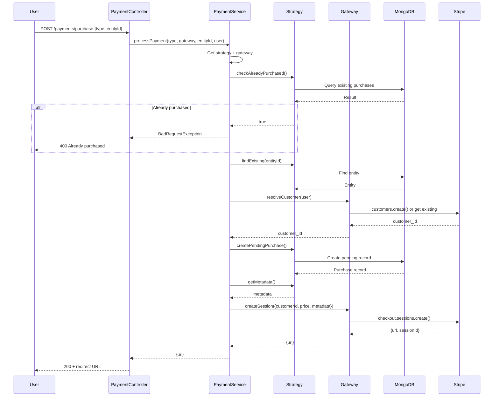
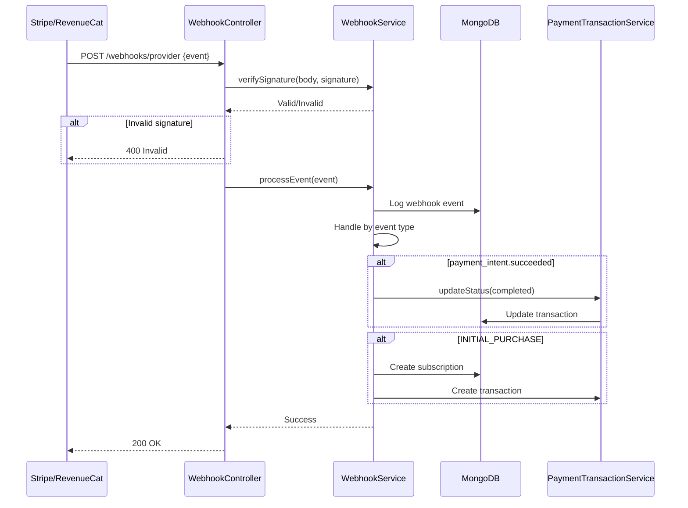

# 🏗️ PAYMENT MODULE - COMPLETE ARCHITECTURE GUIDE

**Version**: 1.0.0 (NestJS)  
**Last Updated**: 26-03-29  
**Level**: Senior/Mastery

---

## 📋 **TABLE OF CONTENTS**

1. [Module Overview](#module-overview)
2. [Architecture Patterns](#architecture-patterns)
3. [Module Structure](#module-structure)
4. [Dependency Injection Graph](#dependency-injection-graph)
5. [Strategy Pattern Deep Dive](#strategy-pattern-deep-dive)
6. [Gateway Pattern Deep Dive](#gateway-pattern-deep-dive)
7. [Data Flow](#data-flow)
8. [API Endpoints](#api-endpoints)
9. [Database Schemas](#database-schemas)
10. [Webhook Architecture](#webhook-architecture)
11. [Caching Strategy](#caching-strategy)
12. [Error Handling](#error-handling)
13. [Security](#security)
14. [Testing Strategy](#testing-strategy)
15. [Integration Points](#integration-points)

---

## 🎯 **MODULE OVERVIEW**

### **Purpose**
The Payment module is a **production-grade, multi-provider payment processing system** that handles:
- Stripe payment processing (web)
- RevenueCat subscription management (mobile)
- Payment transaction tracking
- Earnings aggregation and analytics
- Stripe Connect onboarding for business users
- Webhook processing for payment lifecycle events

### **Business Value**
- 💰 **Revenue Generation**: Process payments via multiple providers
- 📊 **Financial Tracking**: Complete transaction audit trail
- 📈 **Analytics**: Real-time earnings dashboard
- 🔗 **Business Users**: Stripe Connect for payment acceptance
- 📱 **Mobile Support**: RevenueCat for iOS/Android subscriptions

### **Key Metrics**
- **125+ API endpoints** across all payment modules
- **14 webhook handlers** for payment events
- **8 time-period aggregations** for earnings
- **Redis caching** with 5-10 minute TTL
- **Idempotency** via unique transaction IDs

---

## 🏛️ **ARCHITECTURE PATTERNS**

### **1. Strategy Pattern** ⭐

**Purpose**: Handle different purchase types with unified interface

```typescript
// Abstract Strategy
export abstract class PurchaseStrategy<T = any> {
  abstract findExisting(entityId: string): Promise<T>;
  abstract checkAlreadyPurchased(entityId: string, userId: string): Promise<boolean>;
  abstract createPendingPurchase(entity: T, user: UserPayload, session: any): Promise<any>;
  abstract getMetadata(purchase: any, entity: T, user: UserPayload): Record<string, string>;

  // Template method - NEVER overridden
  async processPayment(
    entityId: string,
    user: UserPayload,
    gateway: PaymentGateway,
  ): Promise<{ url: string }> {
    // 1. Check already purchased
    const alreadyPurchased = await this.checkAlreadyPurchased(entityId, user.userId);
    if (alreadyPurchased) {
      throw new BadRequestException('Already purchased');
    }

    // 2. Find entity
    const entity = await this.findExisting(entityId);
    if (!entity) {
      throw new NotFoundException('Entity not found');
    }

    // 3. Resolve customer
    const customerId = await gateway.resolveCustomer(user);

    // 4. Create pending purchase
    const pendingPurchase = await this.createPendingPurchase(entity, user, null);

    // 5. Get metadata
    const metadata = this.getMetadata(pendingPurchase, entity, user);

    // 6. Create gateway session
    return gateway.createSession({
      customerId,
      price: pendingPurchase.price,
      currency: pendingPurchase.currency,
      metadata,
    });
  }
}
```

**Concrete Strategy Example**:
```typescript
@Injectable()
export class SubscriptionPurchaseStrategy extends PurchaseStrategy {
  async findExisting(entityId: string): Promise<SubscriptionPlanDocument> {
    return this.subscriptionPlanModel.findById(entityId);
  }

  async checkAlreadyPurchased(entityId: string, userId: string): Promise<boolean> {
    const subscription = await this.userSubscriptionModel.findOne({
      userId,
      subscriptionPlanId: entityId,
      status: { $in: ['active', 'trialing'] },
    });
    return subscription !== null;
  }

  async createPendingPurchase(entity: SubscriptionPlanDocument, user: UserPayload, session: any) {
    return this.userSubscriptionModel.create({
      userId: user.userId,
      subscriptionPlanId: entity._id,
      status: 'processing',
      isFromFreeTrial: false,
    });
  }

  getMetadata(purchase: any, entity: SubscriptionPlanDocument, user: UserPayload) {
    return {
      userId: user.userId,
      subscriptionType: entity.subscriptionType,
      subscriptionPlanId: entity._id.toString(),
      referenceId: purchase._id.toString(),
      referenceFor: 'userSubscription',
    };
  }
}
```

**Why Strategy Pattern**:
- ✅ Add new purchase types without changing gateway code
- ✅ Each strategy encapsulates its own business logic
- ✅ Easy to test in isolation
- ✅ Follows Open/Closed Principle

---

### **2. Gateway Pattern** ⭐

**Purpose**: Abstract payment provider differences

```typescript
// Abstract Gateway
export abstract class PaymentGateway {
  abstract resolveCustomer(user: UserPayload): Promise<string>;
  abstract createSession(params: PaymentSessionParams): Promise<{ url: string }>;
}

// Concrete Gateway: Stripe
@Injectable()
export class StripeGateway extends PaymentGateway {
  async resolveCustomer(user: UserPayload): Promise<string> {
    if (user.stripe_customer_id) {
      return user.stripe_customer_id;
    }

    const customer = await this.stripe.customers.create({
      name: user.name,
      email: user.email,
      metadata: { userId: user.userId },
    });

    // Update user with customer ID
    await this.userModel.findByIdAndUpdate(user.userId, {
      $set: { stripe_customer_id: customer.id },
    });

    return customer.id;
  }

  async createSession(params: PaymentSessionParams): Promise<{ url: string }> {
    const session = await this.stripe.checkout.sessions.create({
      payment_method_types: ['card'],
      mode: params.mode || 'payment',
      customer: params.customerId,
      line_items: [{
        price_data: {
          currency: params.currency,
          product_data: { name: 'Payment' },
          unit_amount: Math.round(params.price * 100), // cents
        },
        quantity: 1,
      }],
      metadata: params.metadata,
      success_url: params.successUrl,
      cancel_url: params.cancelUrl,
    });

    return { url: session.url, sessionId: session.id };
  }
}
```

**Why Gateway Pattern**:
- ✅ Add new payment providers without changing business logic
- ✅ Provider-specific logic isolated in gateway
- ✅ Easy to mock for testing
- ✅ Consistent interface across providers

---

### **3. Orchestration Pattern**

**Purpose**: Coordinate strategies and gateways

```typescript
@Injectable()
export class PaymentService {
  private strategies: Map<string, PurchaseStrategy> = new Map();
  private gateways: Map<string, PaymentGateway> = new Map();

  registerStrategy(type: PurchaseType, strategy: PurchaseStrategy) {
    this.strategies.set(type, strategy);
  }

  registerGateway(type: GatewayType, gateway: PaymentGateway) {
    this.gateways.set(type, gateway);
  }

  async processPayment(
    purchaseType: PurchaseType,
    gatewayType: GatewayType,
    entityId: string,
    user: UserPayload,
  ): Promise<{ url: string }> {
    const strategy = this.strategies.get(purchaseType);
    if (!strategy) {
      throw new BadRequestException(`Unknown purchase type: ${purchaseType}`);
    }

    const gateway = this.gateways.get(gatewayType);
    if (!gateway) {
      throw new BadRequestException(`Unknown gateway: ${gatewayType}`);
    }

    return strategy.processPayment(entityId, user, gateway);
  }
}
```

**Why Orchestration**:
- ✅ Centralized payment coordination
- ✅ Runtime strategy/gateway selection
- ✅ Single entry point for all payments
- ✅ Easy to add logging/monitoring

---

## 📁 **MODULE STRUCTURE**

```
src/modules/payment.module/
├── payment.module.ts                        # Parent module
├── payment/
│   ├── payment.service.ts                   # Orchestration service
│   ├── payment.constants.ts                 # Enums, config
│   ├── gateways/
│   │   ├── payment.gateway.interface.ts     # Gateway contract
│   │   └── stripe.gateway.ts                # Stripe implementation
│   └── strategies/
│       └── purchase.strategy.ts             # Strategy base class
├── paymentTransaction/
│   ├── paymentTransaction.module.ts
│   ├── schemas/
│   │   └── paymentTransaction.schema.ts     # Transaction schema
│   ├── dto/
│   │   └── paymentTransaction.dto.ts        # Transaction DTOs
│   ├── services/
│   │   └── paymentTransaction.service.ts    # Transaction service
│   └── controllers/
│       └── paymentTransaction.controller.ts # Transaction endpoints
├── stripeAccount/
│   ├── stripeAccount.module.ts
│   ├── schemas/
│   │   └── stripeAccount.schema.ts          # Connected account schema
│   ├── services/
│   │   └── stripeAccount.service.ts         # Stripe Connect service
│   └── controllers/
│       └── stripeAccount.controller.ts      # Connect endpoints
├── stripeWebhook/
│   ├── stripeWebhook.module.ts
│   ├── schemas/
│   │   └── stripeWebhookEvent.schema.ts     # Event logging schema
│   ├── services/
│   │   └── stripeWebhook.service.ts         # Webhook processor
│   └── controllers/
│       └── stripeWebhook.controller.ts      # Webhook endpoint
└── revenueCatWebhook/
    ├── revenueCatWebhook.module.ts
    ├── schemas/
    │   └── revenueCatWebhookEvent.schema.ts # Event logging schema
    ├── services/
    │   └── revenueCatWebhook.service.ts     # Webhook processor
    └── controllers/
        └── revenueCatWebhook.controller.ts  # Webhook endpoint
```

---

## 🔗 **DEPENDENCY INJECTION GRAPH**

```
PaymentModule
├── PaymentService
│   ├── StripeGateway
│   │   ├── Stripe SDK → external
│   │   └── ConfigService → @nestjs/config
│   ├── PurchaseStrategy (abstract)
│   └── ConfigService
├── PaymentTransactionService
│   ├── @InjectModel(PaymentTransaction) → Mongoose
│   └── CACHE_MANAGER → cache-manager
├── StripeAccountService
│   ├── Stripe SDK → external
│   ├── @InjectModel(StripeAccount) → Mongoose
│   └── @InjectModel(User) → Mongoose
├── StripeWebhookService
│   ├── Stripe SDK → external
│   ├── @InjectModel(StripeWebhookEvent) → Mongoose
│   └── PaymentTransactionService → internal
└── RevenueCatWebhookService
    ├── ConfigService → @nestjs/config
    ├── @InjectModel(UserSubscription) → Mongoose
    └── PaymentTransactionService → internal
```

**Key Insight**: PaymentService orchestrates, but doesn't own dependencies. Each sub-module is self-contained.

---

## 🔄 **DATA FLOW**

### **Payment Processing Flow**


### **Webhook Processing Flow**


---

## 📡 **API ENDPOINTS**

### **Payment Transaction** (8 endpoints)

| Method | Endpoint | Auth | Role | Description |
|--------|----------|------|------|-------------|
| `GET` | `/payment-transactions` | ✅ | Admin | All transactions (paginated) |
| `GET` | `/payment-transactions/debug` | ✅ | Admin | With gateway response |
| `GET` | `/payment-transactions/earnings/overview` | ✅ | Admin | Earnings dashboard |
| `GET` | `/payment-transactions/user/:userId` | ✅ | Any | User's transactions |
| `GET` | `/payment-transactions/:id` | ✅ | Any | Transaction by ID |
| `POST` | `/payment-transactions` | ✅ | Admin | Create transaction |
| `PUT` | `/payment-transactions/:id/status` | ✅ | Admin | Update status |
| `DELETE` | `/payment-transactions/:id` | ✅ | Admin | Delete transaction |

### **Stripe Account** (4 endpoints)

| Method | Endpoint | Auth | Role | Description |
|--------|----------|------|------|-------------|
| `POST` | `/stripe-accounts/connect` | ✅ | Any | Create + onboarding |
| `GET` | `/stripe-accounts/success/:id` | ❌ | Public | Success callback |
| `GET` | `/stripe-accounts/refresh/:id` | ❌ | Public | Refresh onboarding |
| `GET` | `/stripe-accounts/status` | ✅ | Any | Check status |

### **Webhooks** (2 endpoints)

| Method | Endpoint | Auth | Description |
|--------|----------|------|-------------|
| `POST` | `/webhooks/stripe` | ❌ | Stripe webhook handler |
| `POST` | `/webhooks/revenuecat` | ❌ | RevenueCat webhook handler |

---

## 🗄️ **DATABASE SCHEMAS**

### **PaymentTransaction Schema**
```typescript
@Schema({ timestamps: true })
export class PaymentTransaction {
  @Prop({ type: Schema.Types.ObjectId, ref: 'User', index: true })
  userId: Types.ObjectId;

  @Prop({ 
    type: String, 
    enum: ['userSubscription', 'purchasedJourney'],
    index: true,
  })
  referenceFor: string;

  @Prop({ type: Schema.Types.ObjectId, refPath: 'referenceFor', index: true })
  referenceId: Types.ObjectId;

  @Prop({ 
    type: String, 
    enum: ['stripe', 'paypal', 'sslcommerz', 'revenuecat'],
    index: true,
  })
  paymentGateway: string;

  @Prop({ index: true })
  transactionId: string;

  @Prop()
  paymentIntent: string;

  @Prop({ required: true, min: 0 })
  amount: number;

  @Prop({ enum: ['usd', 'bdt', 'eur'], required: true })
  currency: string;

  @Prop({ 
    type: String, 
    enum: ['pending', 'processing', 'completed', 'failed', 'refunded'],
    index: true,
  })
  paymentStatus: string;

  @Prop({ type: Schema.Types.Mixed })
  gatewayResponse: Record<string, any>;

  @Prop({ index: true })
  revenueCatOrderId: string;

  @Prop({ enum: ['production', 'sandbox'] })
  revenueCatEnvironment: string;

  @Prop({ enum: ['ios', 'android', 'web'] })
  platform: string;

  @Prop({ default: false })
  isDeleted: boolean;
}

// Indexes
PaymentTransactionSchema.index({ userId: 1, paymentStatus: 1, isDeleted: 1 });
PaymentTransactionSchema.index({ referenceFor: 1, referenceId: 1, isDeleted: 1 });
PaymentTransactionSchema.index({ paymentGateway: 1, transactionId: 1 });
PaymentTransactionSchema.index({ revenueCatOrderId: 1, isDeleted: 1 });
PaymentTransactionSchema.index({ createdAt: -1, isDeleted: 1 });
```

---

## 🎣 **WEBHOOK ARCHITECTURE**

### **Stripe Webhook Handlers**

```typescript
async processEvent(event: Stripe.Event): Promise<void> {
  await this.logWebhookEvent(event);

  switch (event.type) {
    case 'checkout.session.completed':
      await this.handleCheckoutSessionCompleted(event);
      break;
    case 'payment_intent.succeeded':
      await this.handlePaymentIntentSucceeded(event);
      break;
    case 'payment_intent.payment_failed':
      await this.handlePaymentIntentFailed(event);
      break;
    case 'charge.refunded':
      await this.handleChargeRefunded(event);
      break;
    case 'charge.dispute.created':
      await this.handleChargeDisputed(event);
      break;
  }
}
```

### **RevenueCat Webhook Handlers**

```typescript
async processEvent(event: any): Promise<void> {
  await this.logWebhookEvent(event);

  switch (event.event_id) {
    case 'INITIAL_PURCHASE':
      await this.handleInitialPurchase(event);
      break;
    case 'RENEWAL':
      await this.handleRenewal(event);
      break;
    case 'CANCELLATION':
      await this.handleCancellation(event);
      break;
    case 'EXPIRATION':
      await this.handleExpiration(event);
      break;
    case 'REFUND':
      await this.handleRefund(event);
      break;
    case 'BILLING_ISSUE':
      await this.handleBillingIssue(event);
      break;
  }
}
```

### **Idempotency Pattern**

```typescript
async handleInitialPurchase(event: any): Promise<void> {
  const orderId = event.id || event.event_id;

  // Check idempotency
  const existing = await this.paymentTransactionModel.findOne({
    revenueCatOrderId: orderId,
  });

  if (existing) {
    this.logger.warn(`Transaction already exists: ${orderId}`);
    return; // Skip duplicate
  }

  // Process transaction...
}
```

### **Signature Verification**

```typescript
verifySignature(body: any, signature: string): boolean {
  const webhookSecret = this.configService.get('STRIPE_WEBHOOK_SECRET');

  const parts = signature.split('=');
  const receivedHash = parts[1];

  const expectedHash = crypto
    .createHmac('sha256', webhookSecret)
    .update(JSON.stringify(body))
    .digest('hex');

  return crypto.timingSafeEqual(
    Buffer.from(receivedHash, 'hex'),
    Buffer.from(expectedHash, 'hex'),
  );
}
```

---

## 🚀 **CACHING STRATEGY**

### **Cache Keys**
```typescript
const cacheKeys = {
  transaction: (id: string) => `payment:transaction:${id}`,
  userTransactions: (userId: string) => `payment:user:${userId}`,
  earnings: () => 'payment:earnings:summary',
};
```

### **Cache TTLs**
```typescript
const cacheTTL = {
  transaction: 300,      // 5 minutes
  userTransactions: 300, // 5 minutes
  earnings: 600,         // 10 minutes
};
```

### **Earnings Aggregation Cache**
```typescript
async getEarningsOverview(): Promise<any> {
  const cacheKey = 'payment:earnings:summary';
  const cached = await this.cacheManager.get(cacheKey);
  if (cached) return cached;

  // Expensive aggregation...
  const result = {
    totalEarnings: ...,
    todayEarnings: ...,
    thisWeekEarnings: ...,
    // ...
  };

  await this.cacheManager.set(cacheKey, result, 600);
  return result;
}
```

### **Cache Invalidation**
```typescript
async invalidateCache(userId?: string, transactionId?: string) {
  const keys: string[] = [];
  
  if (transactionId) {
    keys.push(`payment:transaction:${transactionId}`);
  }
  if (userId) {
    keys.push(`payment:user:${userId}`);
  }
  keys.push('payment:earnings:summary');

  await Promise.all(keys.map(key => this.cacheManager.del(key)));
}
```

---

## ⚠️ **ERROR HANDLING**

### **Payment-Specific Exceptions**
```typescript
export class PaymentFailedException extends BadRequestException {
  constructor(reason: string) {
    super({
      success: false,
      message: 'Payment failed',
      reason,
    });
  }
}

export class AlreadyPurchasedException extends BadRequestException {
  constructor(entityType: string) {
    super({
      success: false,
      message: `Already purchased: ${entityType}`,
    });
  }
}

export class InvalidWebhookSignatureException extends UnauthorizedException {
  constructor() {
    super({
      success: false,
      message: 'Invalid webhook signature',
    });
  }
}
```

### **Transaction Safety**
```typescript
async createPendingPurchase(entity: any, user: UserPayload, session: any) {
  try {
    return await this.userSubscriptionModel.create({
      userId: user.userId,
      subscriptionPlanId: entity._id,
      status: 'processing',
    });
  } catch (error) {
    this.logger.error(`Failed to create pending purchase: ${error.message}`);
    throw new BadRequestException('Failed to initiate purchase');
  }
}
```

---

## 🔐 **SECURITY**

### **Webhook Security**
- ✅ HMAC-SHA256 signature verification
- ✅ Timing-safe comparison
- ✅ Idempotency checks
- ✅ Event logging for audit

### **Payment Data Security**
- ✅ Sensitive fields excluded from responses
- ✅ Gateway responses stored encrypted
- ✅ PCI compliance (Stripe handles card data)
- ✅ No card data stored in database

### **Rate Limiting**
```typescript
@Post('purchase/:planId')
@Throttle(3, 300) // 3 purchases per 5 minutes
async purchase(@Param('planId') planId: string) {
  // ...
}
```

---

## 🧪 **TESTING STRATEGY**

### **Unit Tests**
```typescript
describe('PaymentService', () => {
  let service: PaymentService;
  let stripeGateway: StripeGateway;
  let strategy: PurchaseStrategy;

  beforeEach(async () => {
    const module: TestingModule = await Test.createTestingModule({
      providers: [
        PaymentService,
        {
          provide: StripeGateway,
          useValue: {
            resolveCustomer: jest.fn(),
            createSession: jest.fn(),
          },
        },
        {
          provide: PurchaseStrategy,
          useValue: {
            checkAlreadyPurchased: jest.fn(),
            findExisting: jest.fn(),
            createPendingPurchase: jest.fn(),
            getMetadata: jest.fn(),
          },
        },
      ],
    }).compile();

    service = module.get<PaymentService>(PaymentService);
  });

  it('should process payment successfully', async () => {
    // Test implementation
  });
});
```

### **Webhook Tests**
```typescript
describe('StripeWebhookService', () => {
  it('should verify valid signature', () => {
    const body = { id: 'evt_123' };
    const signature = 'hash=abc123...';
    
    expect(service.verifySignature(body, signature)).toBe(true);
  });

  it('should reject invalid signature', () => {
    const body = { id: 'evt_123' };
    const signature = 'hash=invalid';
    
    expect(service.verifySignature(body, signature)).toBe(false);
  });
});
```

---

## 🔗 **INTEGRATION POINTS**

### **With Subscription Module**
```typescript
// Payment creates transaction, Subscription manages lifecycle
async handleInitialPurchase(event: any) {
  const subscription = await this.userSubscriptionModel.create({
    userId: user._id,
    status: 'active',
    revenueCatOrderId: orderId,
  });

  await this.paymentTransactionModel.create({
    userId: user._id,
    referenceFor: 'userSubscription',
    referenceId: subscription._id,
    paymentStatus: 'completed',
  });
}
```

### **With User Module**
```typescript
// Update user subscription type after payment
async activateSubscription(subscriptionId: string, planId: string) {
  const plan = await this.subscriptionPlanModel.findById(planId);
  
  await this.userModel.findByIdAndUpdate(userId, {
    $set: { subscriptionType: plan.subscriptionType },
  });
}
```

---

## 📚 **KEY TAKEAWAYS**

1. **Strategy Pattern** - Different purchase types, unified interface
2. **Gateway Pattern** - Multiple payment providers, isolated logic
3. **Orchestration** - Centralized payment coordination
4. **Webhooks** - Idempotent, verified, logged
5. **Caching** - Expensive aggregations cached
6. **Security** - Signatures, rate limits, PCI compliance
7. **DI** - All dependencies injected
8. **Testing** - Unit + webhook tests

---

**Next Steps**: Study this module thoroughly - it's the most complex pattern-wise. Then review simpler modules.

---
-26-03-29
