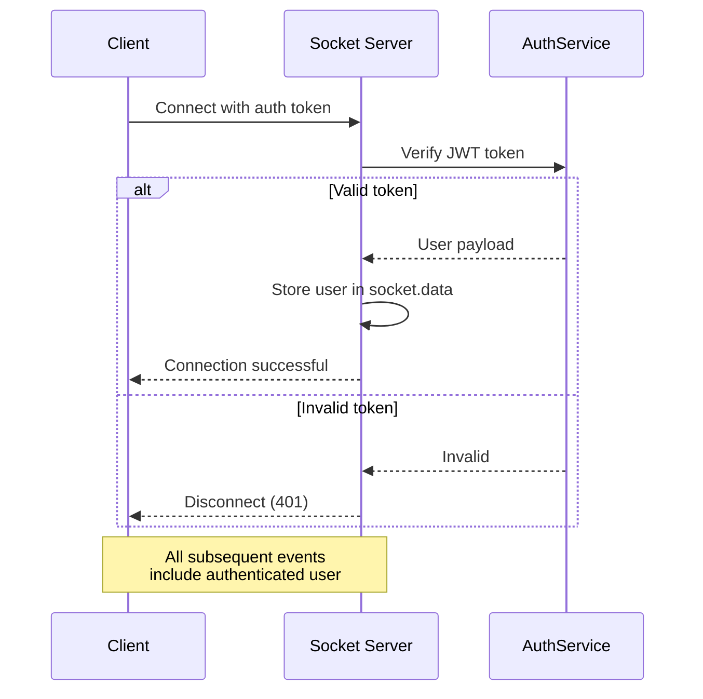
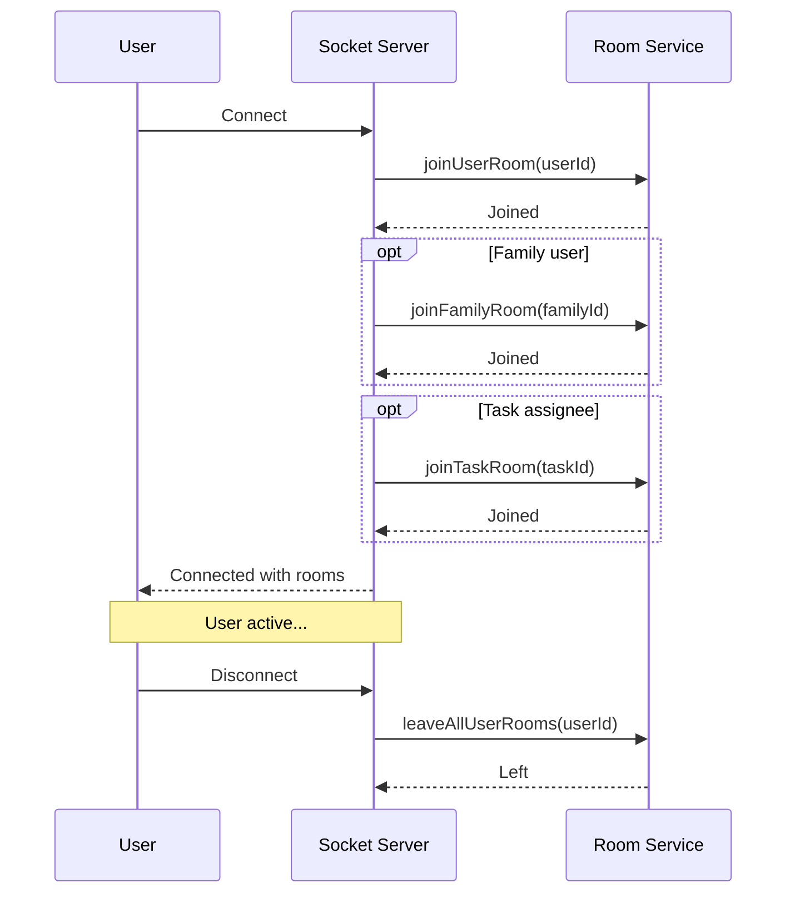

# 🏗️ SOCKET.GATEWAY MODULE - COMPREHENSIVE ARCHITECTURE GUIDE

**Version**: 1.0.0 (NestJS)  
**Last Updated**: 26-03-29  
**Level**: Senior/Mastery  
**Estimated Study Time**: 2 hours

---

## 📋 **TABLE OF CONTENTS**

1. [Module Overview](#1-module-overview)
2. [WebSocket Architecture](#2-websocket-architecture)
3. [Module Structure](#3-module-structure)
4. [Socket.IO Configuration](#4-socketio-configuration)
5. [Authentication & Authorization](#5-authentication--authorization)
6. [Room Management Strategy](#6-room-management-strategy)
7. [Event Types & Handlers](#7-event-types--handlers)
8. [Broadcasting Patterns](#8-broadcasting-patterns)
9. [Redis Adapter for Scaling](#9-redis-adapter-for-scaling)
10. [Connection Lifecycle](#10-connection-lifecycle)
11. [Error Handling](#11-error-handling)
12. [Performance Optimization](#12-performance-optimization)
13. [Security Considerations](#13-security-considerations)
14. [Monitoring & Observability](#14-monitoring--observability)
15. [Testing Strategy](#15-testing-strategy)
16. [Integration with Other Modules](#16-integration-with-other-modules)

---

## 1. **MODULE OVERVIEW**

### **1.1 Purpose & Scope**

The Socket.Gateway module provides **centralized real-time communication** for the entire platform:
- **Task updates** (created, updated, completed)
- **Notification delivery** (real-time push)
- **Chat messaging** (instant messaging)
- **Family activity feed** (live updates)
- **Progress tracking** (child progress to parent)
- **Typing indicators** (chat UX)
- **Online presence** (user status)

### **1.2 Why Separate Module?**

1. **Centralization**: Single source of truth for all Socket.IO logic
2. **Reusability**: Other modules inject SocketService instead of implementing their own
3. **Consistency**: Uniform event naming, error handling, logging
4. **Scalability**: Centralized Redis adapter configuration
5. **Maintainability**: One place to update Socket.IO version, configuration

### **1.3 Module Statistics**

| Metric | Value |
|--------|-------|
| **Total Files** | 10 files |
| **Lines of Code** | ~1,200 lines |
| **Socket Events** | 20+ event types |
| **Room Types** | 6 room patterns |
| **Guards** | 2 (JWT, Throttle) |
| **Services** | 3 (Socket, Auth, Room) |

---

## 2. **WEBSOCKET ARCHITECTURE**

### **2.1 High-Level Architecture**

```
┌─────────────────────────────────────────────────────────────┐
│                     Client Applications                      │
│  ┌──────────┐  ┌──────────┐  ┌──────────┐                  │
│  │   Web    │  │   iOS    │  │ Android  │                  │
│  └────┬─────┘  └────┬─────┘  └────┬─────┘                  │
└───────┼─────────────┼─────────────┼─────────────────────────┘
        │             │             │
        │ WebSocket   │ WebSocket   │ WebSocket
        │ (Socket.IO) │ (Socket.IO) │ (Socket.IO)
        │             │             │
┌───────▼─────────────▼─────────────▼─────────────────────────┐
│              Socket.IO Gateway (Port 6738)                   │
│  ┌──────────────────────────────────────────────────────┐   │
│  │              Socket Gateway                          │   │
│  │  ┌─────────────┐  ┌─────────────┐  ┌─────────────┐   │   │
│  │  │   Socket    │  │    Room     │  │   Event     │   │   │
│  │  │   Service   │  │   Service   │  │  Handlers   │   │   │
│  │  └─────────────┘  └─────────────┘  └─────────────┘   │   │
│  └──────────────────────────────────────────────────────┘   │
└─────────────────────────────────────────────────────────────┘
        │
        │
┌───────▼─────────────┐  ┌────────────────┐
│   Redis Adapter     │  │   Other Modules│
│  ┌───────────────┐  │  │  ┌──────────┐  │
│  │  Pub/Sub      │  │  │  │Notification│ │
│  │  Presence     │  │  │  │Chatting  │  │
│  │  Scaling      │  │  │  │Task      │  │
│  └───────────────┘  │  │  └──────────┘  │
└─────────────────────┘  └────────────────┘
```

### **2.2 Dedicated Port Strategy**

```typescript
// Socket.IO runs on dedicated port (6738)
// REST API runs on main port (3000)

// Benefits:
// 1. Separate scaling (more socket servers if needed)
// 2. Independent rate limiting
// 3. Easier monitoring and debugging
// 4. No interference with HTTP traffic
```

---

## 3. **MODULE STRUCTURE**

### **3.1 Complete File Structure**

```
src/modules/socket.gateway/
├── socket.module.ts                      # Module definition
├── socket.gateway.ts                     # Main Socket.IO gateway
├── services/
│   ├── socket.service.ts                 # Core socket operations
│   ├── socket-auth.service.ts            # JWT authentication
│   └── socket-room.service.ts            # Room management
├── guards/
│   ├── ws-jwt.guard.ts                   # WebSocket JWT guard
│   └── ws-throttle.guard.ts              # WebSocket rate limiting
├── interfaces/
│   ├── socket-event.interface.ts         # Event type definitions
│   └── socket-payload.interface.ts       # Payload interfaces
└── constants/
    └── socket-events.constants.ts        # Event name constants
```

### **3.2 File Responsibilities**

| File | Responsibility | Lines |
|------|----------------|-------|
| `socket.module.ts` | Module configuration, Redis adapter | 100 |
| `socket.gateway.ts` | Main gateway, event handlers | 300 |
| `services/socket.service.ts` | Emit, broadcast, room operations | 250 |
| `services/socket-auth.service.ts` | JWT verification, user extraction | 150 |
| `services/socket-room.service.ts` | Room creation, management | 150 |
| `guards/ws-jwt.guard.ts` | WebSocket authentication guard | 100 |
| `guards/ws-throttle.guard.ts` | Rate limiting for sockets | 80 |
| `interfaces/*.ts` | TypeScript interfaces | 120 |
| `constants/*.ts` | Event name constants | 50 |

---

## 4. **SOCKET.IO CONFIGURATION**

### **4.1 Gateway Configuration**

```typescript
@WebSocketGateway({
  // Dedicated port for Socket.IO
  port: parseInt(process.env.SOCKET_PORT || '6738'),
  
  // Path for Socket.IO connection
  path: '/socket.io',
  
  // CORS configuration
  cors: {
    origin: process.env.CLIENT_URL || 'http://localhost:3000',
    credentials: true,
    methods: ['GET', 'POST'],
  },
  
  // Transport methods
  transports: ['websocket', 'polling'],
  
  // Allow EIO (Engine.IO) upgrades
  allowEIO3: true,
  
  // Ping timeout (ms)
  pingTimeout: 60000,
  
  // Ping interval (ms)
  pingInterval: 25000,
  
  // Maximum packet size
  maxHttpBufferSize: 1e6, // 1MB
  
  // Allow request (authentication hook)
  allowRequest: (req, callback) => {
    // Verify origin, rate limiting, etc.
    const origin = req.headers.origin;
    if (origin === process.env.CLIENT_URL) {
      callback(null, true);
    } else {
      callback(new Error('Not allowed by CORS'), false);
    }
  },
})
export class SocketGateway implements OnModuleInit, OnModuleDestroy {
  // ...
}
```

### **4.2 Redis Adapter Configuration**

```typescript
async onModuleInit() {
  // Create Redis adapter for horizontal scaling
  const pubClient = createClient({
    url: process.env.REDIS_URL || 'redis://localhost:6379',
  });
  
  const subClient = pubClient.duplicate();

  await Promise.all([pubClient.connect(), subClient.connect()]);

  // Apply adapter to gateway
  this.server.adapter(new RedisAdapter(pubClient, subClient));

  this.logger.log('✅ Socket.IO Gateway initialized with Redis adapter');
  this.logger.log(`📡 Listening on port ${process.env.SOCKET_PORT || 6738}`);
}
```

### **4.3 Why Redis Adapter?**

1. **Horizontal Scaling**: Multiple Socket.IO servers can communicate
2. **Broadcasting**: Events broadcast across all servers
3. **Presence**: Track which users are on which server
4. **Reliability**: If one server fails, others continue

---

## 5. **AUTHENTICATION & AUTHORIZATION**

### **5.1 JWT Authentication Flow**



### **5.2 Socket Authentication Guard**

```typescript
@Injectable()
export class WsJwtGuard implements CanActivate {
  constructor(private authService: SocketAuthService) {}

  async canActivate(context: ExecutionContext): Promise<boolean> {
    const client = context.switchToWs().getClient<Socket>();
    const data = context.switchToWs().getData();

    // Skip auth for 'connect' event (handled separately)
    if (context.getHandler().name === 'handleConnection') {
      return true;
    }

    // Verify user is authenticated
    if (!client.data.userId) {
      client.emit('error', {
        code: 'UNAUTHORIZED',
        message: 'Authentication required',
      });
      client.disconnect();
      return false;
    }

    return true;
  }
}
```

### **5.3 Connection Authentication**

```typescript
@WebSocketGateway()
export class SocketGateway {
  async handleConnection(client: Socket, ...args: any[]) {
    try {
      // Extract token from handshake
      const token = client.handshake.auth.token || 
                    client.handshake.headers.authorization?.split(' ')[1];

      if (!token) {
        this.logger.warn(`Connection rejected: No token provided`);
        client.emit('unauthorized', { message: 'No token provided' });
        client.disconnect(true);
        return;
      }

      // Verify JWT
      const payload = await this.authService.verifyToken(token);
      
      // Store user data in socket
      client.data.userId = payload.userId;
      client.data.email = payload.email;
      client.data.role = payload.role;

      // Join user's personal room
      client.join(`user:${payload.userId}`);

      this.logger.log(`✅ User ${payload.userId} connected`);
      
      // Emit success
      client.emit('connected', {
        userId: payload.userId,
        role: payload.role,
      });
    } catch (error) {
      this.logger.error(`Connection error: ${error.message}`);
      client.emit('unauthorized', { message: 'Invalid token' });
      client.disconnect(true);
    }
  }
}
```

---

## 6. **ROOM MANAGEMENT STRATEGY**

### **6.1 Room Types**

| Room Pattern | Format | Purpose | Example |
|--------------|--------|---------|---------|
| **User Personal** | `user:{userId}` | Direct messages to user | `user:507f1f77bcf86cd799439011` |
| **Family** | `family:{familyId}` | Family activity feed | `family:507f1f77bcf86cd799439012` |
| **Task** | `task:{taskId}` | Task updates for assignees | `task:507f1f77bcf86cd799439013` |
| **Conversation** | `conversation:{convId}` | Chat messages | `conversation:507f1f77bcf86cd799439014` |
| **Role-Based** | `role:{role}` | Broadcast to role | `role:admin`, `role:child` |
| **Global** | `global` | Platform-wide announcements | `global` |

### **6.2 Room Service Implementation**

```typescript
@Injectable()
export class SocketRoomService {
  private readonly logger = new Logger(SocketRoomService.name);

  constructor(@InjectWebSocketServer() private server: Server) {}

  /**
   * Join user to personal room
   */
  async joinUserRoom(client: Socket, userId: string): Promise<void> {
    const room = `user:${userId}`;
    await client.join(room);
    this.logger.debug(`User ${userId} joined room ${room}`);
  }

  /**
   * Join user to family room
   */
  async joinFamilyRoom(client: Socket, familyId: string): Promise<void> {
    const room = `family:${familyId}`;
    await client.join(room);
    this.logger.debug(`User joined family room ${room}`);
  }

  /**
   * Join user to task room (for task assignees)
   */
  async joinTaskRoom(client: Socket, taskId: string): Promise<void> {
    const room = `task:${taskId}`;
    await client.join(room);
    this.logger.debug(`User joined task room ${room}`);
  }

  /**
   * Leave all rooms for a user (on disconnect)
   */
  async leaveAllUserRooms(userId: string): Promise<void> {
    const rooms = [
      `user:${userId}`,
      // Add other user-specific rooms
    ];

    for (const room of rooms) {
      await this.server.to(room).socketsLeave(room);
    }

    this.logger.debug(`User ${userId} left all rooms`);
  }

  /**
   * Get all sockets in a room
   */
  async getSocketsInRoom(room: string): Promise<Socket[]> {
    const roomSockets = await this.server.in(room).fetchSockets();
    return roomSockets;
  }

  /**
   * Get socket count in room
   */
  async getSocketCountInRoom(room: string): Promise<number> {
    const sockets = await this.getSocketsInRoom(room);
    return sockets.length;
  }
}
```

### **6.3 Room Lifecycle**



---

## 7. **EVENT TYPES & HANDLERS**

### **7.1 Event Categories**

```typescript
// Task Events
export const TASK_EVENTS = {
  CREATED: 'task:created',
  UPDATED: 'task:updated',
  DELETED: 'task:deleted',
  STATUS_CHANGED: 'task:status-changed',
  ASSIGNED: 'task:assigned',
  COMPLETED: 'task:completed',
};

// Notification Events
export const NOTIFICATION_EVENTS = {
  CREATED: 'notification:created',
  READ: 'notification:read',
  DELETED: 'notification:deleted',
  UNREAD_COUNT: 'notification:unread-count',
};

// Chat Events
export const CHAT_EVENTS = {
  MESSAGE_NEW: 'message:new',
  MESSAGE_SENT: 'message:sent',
  MESSAGE_READ: 'message:read',
  TYPING_START: 'typing:start',
  TYPING_STOP: 'typing:stop',
  CONVERSATION_UPDATED: 'conversation:updated',
};

// Progress Events
export const PROGRESS_EVENTS = {
  STARTED: 'task-progress:started',
  COMPLETED: 'task-progress:completed',
  SUBTASK_COMPLETED: 'task-progress:subtask-completed',
  PARENT_SYNCED: 'task:status-synced',
};

// Family Activity Events
export const FAMILY_EVENTS = {
  ACTIVITY: 'family:activity',
  MEMBER_JOINED: 'family:member-joined',
  MEMBER_LEFT: 'family:member-left',
};

// System Events
export const SYSTEM_EVENTS = {
  CONNECTED: 'connected',
  DISCONNECTED: 'disconnected',
  ERROR: 'error',
  UNAUTHORIZED: 'unauthorized',
  PING: 'ping',
  PONG: 'pong',
};
```

### **7.2 Event Handler Implementation**

```typescript
@WebSocketGateway()
export class SocketGateway {
  @SubscribeMessage('task:created')
  handleTaskCreated(@ConnectedSocket() client: Socket, @MessageBody() data: TaskCreatedPayload) {
    // Emit to task room (all assignees)
    client.to(`task:${data.taskId}`).emit('task:created', {
      taskId: data.taskId,
      taskTitle: data.taskTitle,
      assignedUserIds: data.assignedUserIds,
      createdBy: data.createdBy,
      timestamp: new Date(),
    });
  }

  @SubscribeMessage('notification:send')
  handleNotificationSend(@ConnectedSocket() client: Socket, @MessageBody() data: NotificationPayload) {
    // Emit to specific user
    client.to(`user:${data.receiverId}`).emit('notification:created', {
      notificationId: data.notificationId,
      title: data.title,
      message: data.message,
      type: data.type,
      timestamp: new Date(),
    });
  }

  @SubscribeMessage('family:activity')
  handleFamilyActivity(@ConnectedSocket() client: Socket, @MessageBody() data: FamilyActivityPayload) {
    // Broadcast to family room
    client.to(`family:${data.familyId}`).emit('family:activity', {
      type: data.type,
      actor: {
        userId: data.actor.userId,
        name: data.actor.name,
        profileImage: data.actor.profileImage,
      },
      task: data.task,
      timestamp: new Date(),
    });
  }
}
```

---

## 8. **BROADCASTING PATTERNS**

### **8.1 Broadcast Types**

```typescript
@Injectable()
export class SocketService {
  constructor(
    @InjectWebSocketServer()
    private server: Server,
  ) {}

  /**
   * Emit to specific user
   */
  async emitToUser(userId: string, event: string, data: any): Promise<void> {
    this.server.to(`user:${userId}`).emit(event, data);
  }

  /**
   * Emit to multiple users
   */
  async emitToUsers(userIds: string[], event: string, data: any): Promise<void> {
    const rooms = userIds.map(id => `user:${id}`);
    this.server.to(rooms).emit(event, data);
  }

  /**
   * Emit to task room (all assignees)
   */
  async emitToTaskUsers(taskId: string, event: string, data: any): Promise<void> {
    this.server.to(`task:${taskId}`).emit(event, data);
  }

  /**
   * Emit to family room
   */
  async emitToFamily(familyId: string, event: string, data: any): Promise<void> {
    this.server.to(`family:${familyId}`).emit(event, data);
  }

  /**
   * Broadcast to all users with specific role
   */
  async broadcastToRole(role: string, event: string, data: any): Promise<void> {
    this.server.to(`role:${role}`).emit(event, data);
  }

  /**
   * Broadcast to all connected users
   */
  async broadcastGlobal(event: string, data: any): Promise<void> {
    this.server.emit(event, data);
  }

  /**
   * Broadcast family activity (helper method)
   */
  async broadcastGroupActivity(familyId: string, activity: FamilyActivity): Promise<void> {
    this.server.to(`family:${familyId}`).emit('family:activity', {
      ...activity,
      timestamp: new Date(),
    });
  }
}
```

### **8.2 Broadcasting Flow**

```mermaid
graph TB
    S[SocketService] --> E1[emitToUser]
    S --> E2[emitToUsers]
    S --> E3[emitToTaskUsers]
    S --> E4[emitToFamily]
    S --> E5[broadcastToRole]
    S --> E6[broadcastGlobal]
    
    E1 --> R1[Room: user:{id}]
    E2 --> R2[Rooms: user:{id1}, user:{id2}, ...]
    E3 --> R3[Room: task:{id}]
    E4 --> R4[Room: family:{id}]
    E5 --> R5[Room: role:{role}]
    E6 --> R6[All connected sockets]
```

---

## 9. **REDIS ADAPTER FOR SCALING**

### **9.1 Horizontal Scaling Architecture**

```
┌─────────────────────────────────────────────────────────────┐
│                  Load Balancer (nginx)                       │
└───────┬─────────────────────┬─────────────────────┬─────────┘
        │                     │                     │
┌───────▼───────┐   ┌─────────▼───────┐   ┌────────▼───────┐
│  Socket.IO #1 │   │  Socket.IO #2   │   │  Socket.IO #3  │
│  (Port 6738)  │   │  (Port 6738)    │   │  (Port 6738)   │
└───────┬───────┘   └─────────┬───────┘   └────────┬───────┘
        │                     │                     │
        └─────────────────────┼─────────────────────┘
                              │
                    ┌─────────▼─────────┐
                    │   Redis Cluster   │
                    │  (Pub/Sub + Adapter) │
                    └───────────────────┘
```

### **9.2 Why Redis Adapter?**

1. **Cross-Server Broadcasting**: Events broadcast to all servers
2. **Shared State**: Room membership across servers
3. **Presence**: Know which users are on which server
4. **Scalability**: Add more servers as load increases

### **9.3 Adapter Configuration**

```typescript
// socket.module.ts
@Module({
  providers: [
    {
      provide: 'REDIS_PUB_CLIENT',
      useFactory: () => {
        return createClient({
          url: process.env.REDIS_URL,
        });
      },
    },
    {
      provide: 'REDIS_SUB_CLIENT',
      useFactory: (pubClient: RedisClientType) => {
        return pubClient.duplicate();
      },
      inject: ['REDIS_PUB_CLIENT'],
    },
  ],
})
export class SocketModule implements OnModuleInit {
  constructor(
    @Inject('REDIS_PUB_CLIENT')
    private pubClient: RedisClientType,
    @Inject('REDIS_SUB_CLIENT')
    private subClient: RedisClientType,
  ) {}

  async onModuleInit() {
    await Promise.all([this.pubClient.connect(), this.subClient.connect()]);
    
    // Apply to all gateways
    const adapter = new RedisAdapter(this.pubClient, this.subClient);
    
    // Configure adapter
    adapter.publishOnDisconnect = true;
    
    this.logger.log('✅ Redis adapter configured for horizontal scaling');
  }
}
```

---

## 10. **CONNECTION LIFECYCLE**

### **10.1 Connection Flow**

```typescript
@WebSocketGateway()
export class SocketGateway implements OnModuleInit, OnModuleDestroy {
  async handleConnection(client: Socket, ...args: any[]) {
    // 1. Authenticate
    const user = await this.authService.verifySocket(client);
    
    // 2. Store user data
    client.data.userId = user.userId;
    client.data.role = user.role;
    
    // 3. Join rooms
    await this.roomService.joinUserRoom(client, user.userId);
    
    // 4. Join family rooms if applicable
    if (user.familyId) {
      await this.roomService.joinFamilyRoom(client, user.familyId);
    }
    
    // 5. Join task rooms if assignee
    const tasks = await this.taskService.getUserTasks(user.userId);
    for (const task of tasks) {
      await this.roomService.joinTaskRoom(client, task._id.toString());
    }
    
    // 6. Emit success
    client.emit('connected', {
      userId: user.userId,
      rooms: client.rooms,
    });
    
    this.logger.log(`✅ User ${user.userId} connected with ${client.rooms.size} rooms`);
  }

  async handleDisconnect(client: Socket) {
    const userId = client.data.userId;
    
    if (userId) {
      this.logger.log(`❌ User ${userId} disconnected`);
      
      // Emit to family room
      client.broadcast.to(`family:${client.data.familyId}`).emit('family:member-left', {
        userId,
        timestamp: new Date(),
      });
    }
  }
}
```

### **10.2 Reconnection Handling**

```typescript
// Client-side reconnection
const socket = io(`${API_URL}/socket.io`, {
  auth: { token: authToken },
  reconnection: true,
  reconnectionAttempts: 5,
  reconnectionDelay: 1000,
  reconnectionDelayMax: 5000,
  timeout: 20000,
});

socket.on('reconnect', (attemptNumber) => {
  console.log(`Reconnected after ${attemptNumber} attempts`);
  
  // Re-join rooms if needed
  socket.emit('join:rooms', { userId: currentUserId });
});

socket.on('reconnect_error', (error) => {
  console.error('Reconnection error:', error);
});

socket.on('reconnect_failed', () => {
  console.error('Reconnection failed after maximum attempts');
});
```

---

## 11. **ERROR HANDLING**

### **11.1 Error Types**

```typescript
export enum SocketErrorCode {
  UNAUTHORIZED = 'UNAUTHORIZED',
  INVALID_PAYLOAD = 'INVALID_PAYLOAD',
  RATE_LIMIT_EXCEEDED = 'RATE_LIMIT_EXCEEDED',
  ROOM_NOT_FOUND = 'ROOM_NOT_FOUND',
  EVENT_NOT_FOUND = 'EVENT_NOT_FOUND',
  INTERNAL_ERROR = 'INTERNAL_ERROR',
}

export class SocketException extends Error {
  constructor(
    public code: SocketErrorCode,
    message: string,
    public statusCode: number = 400,
  ) {
    super(message);
    this.name = 'SocketException';
  }
}
```

### **11.2 Error Handler**

```typescript
@Catch()
export class SocketExceptionFilter implements ExceptionFilter {
  catch(exception: unknown, client: ClientProxy) {
    const error = exception instanceof SocketException
      ? exception
      : new SocketException(
          SocketErrorCode.INTERNAL_ERROR,
          'Internal server error',
          500,
        );

    client.emit('error', {
      code: error.code,
      message: error.message,
      timestamp: new Date(),
    });

    // Log error
    console.error(`Socket error: ${error.code} - ${error.message}`);
  }
}
```

---

## 12. **PERFORMANCE OPTIMIZATION**

### **12.1 Message Throttling**

```typescript
@Injectable()
export class WsThrottleGuard implements CanActivate {
  constructor(@Inject(CACHE_MANAGER) private cacheManager: Cache) {}

  async canActivate(context: ExecutionContext): Promise<boolean> {
    const client = context.switchToWs().getClient<Socket>();
    const userId = client.data.userId;

    if (!userId) {
      return true;
    }

    const key = `throttle:socket:${userId}`;
    const count = await this.cacheManager.get<number>(key) || 0;

    if (count >= 100) { // 100 messages per minute
      client.emit('error', {
        code: 'RATE_LIMIT_EXCEEDED',
        message: 'Too many messages, please slow down',
      });
      return false;
    }

    await this.cacheManager.set(key, count + 1, 60);
    return true;
  }
}
```

### **12.2 Message Batching**

```typescript
// Instead of sending multiple events
messages.forEach(message => {
  client.emit('message:new', message); // ❌ N events
});

// Batch messages
client.emit('messages:new', messages); // ✅ 1 event
```

### **12.3 Payload Optimization**

```typescript
// ❌ BAD: Sending full objects
client.emit('task:updated', {
  task: {
    _id: '...',
    title: '...',
    description: '...', // Large field
    createdBy: { _id: '...', name: '...', email: '...', ... }, // Full user object
    // ... many more fields
  },
});

// ✅ GOOD: Sending only necessary data
client.emit('task:updated', {
  taskId: '...',
  title: '...',
  status: 'completed',
  updatedBy: {
    id: '...',
    name: '...',
  },
  timestamp: new Date(),
});
```

---

## 13. **SECURITY CONSIDERATIONS**

### **13.1 Input Validation**

```typescript
@SubscribeMessage('message:send')
handleMessageSend(
  @ConnectedSocket() client: Socket,
  @MessageBody() data: any,
) {
  // Validate payload
  if (!data.conversationId || !data.content) {
    throw new SocketException(
      SocketErrorCode.INVALID_PAYLOAD,
      'Missing required fields',
    );
  }

  if (typeof data.content !== 'string' || data.content.length > 5000) {
    throw new SocketException(
      SocketErrorCode.INVALID_PAYLOAD,
      'Content must be string with max 5000 characters',
    );
  }

  // Sanitize content
  const sanitizedContent = sanitizeHtml(data.content);

  // Process message
  // ...
}
```

### **13.2 Rate Limiting**

```typescript
// Per-user rate limiting
const rateLimitConfig = {
  windowMs: 60000, // 1 minute
  max: 100, // 100 messages per minute
  message: 'Too many messages, please slow down',
};
```

### **13.3 Origin Verification**

```typescript
allowRequest: (req, callback) => {
  const origin = req.headers.origin;
  const allowedOrigins = [
    'https://app.example.com',
    'https://admin.example.com',
  ];

  if (allowedOrigins.includes(origin)) {
    callback(null, true);
  } else {
    this.logger.warn(`Rejected connection from origin: ${origin}`);
    callback(new Error('Not allowed by CORS'), false);
  }
},
```

---

## 14. **MONITORING & OBSERVABILITY**

### **14.1 Metrics to Track**

```typescript
// Connection metrics
- Total connected users
- Connections per second
- Disconnections per second
- Average connection duration

// Message metrics
- Messages sent per second
- Messages received per second
- Average message size
- Broadcast latency

// Room metrics
- Total rooms
- Average users per room
- Room joins/leaves per second

// Error metrics
- Authentication failures
- Rate limit violations
- Message validation errors
```

### **14.2 Logging**

```typescript
@WebSocketGateway()
export class SocketGateway {
  async handleConnection(client: Socket) {
    this.logger.log(
      `Connection: ${client.id} from ${client.handshake.address}`,
      {
        userId: client.data.userId,
        rooms: Array.from(client.rooms),
      },
    );
  }

  async handleDisconnect(client: Socket) {
    this.logger.log(
      `Disconnection: ${client.id}`,
      {
        userId: client.data.userId,
        connectedDuration: Date.now() - client.data.connectedAt,
      },
    );
  }
}
```

---

## 15. **TESTING STRATEGY**

### **15.1 Unit Tests**

```typescript
describe('SocketService', () => {
  let service: SocketService;
  let server: Server;

  beforeEach(async () => {
    const module: TestingModule = await Test.createTestingModule({
      providers: [
        SocketService,
        {
          provide: Server,
          useValue: {
            to: jest.fn().mockReturnThis(),
            emit: jest.fn(),
          },
        },
      ],
    }).compile();

    service = module.get<SocketService>(SocketService);
    server = module.get<Server>(Server);
  });

  it('should emit to user room', () => {
    const emitSpy = jest.spyOn(server, 'emit');

    service.emitToUser('userId123', 'notification:created', { data: 'test' });

    expect(server.to).toHaveBeenCalledWith('user:userId123');
    expect(emitSpy).toHaveBeenCalledWith('notification:created', expect.any(Object));
  });
});
```

### **15.2 E2E Tests**

```typescript
describe('Socket Gateway (e2e)', () => {
  let app: INestApplication;
  let socket: SocketIOClient.Socket;

  beforeAll(async () => {
    const moduleFixture = await Test.createTestingModule({
      imports: [SocketModule],
    }).compile();

    app = moduleFixture.createNestApplication();
    await app.listen(6738);
  });

  beforeEach((done) => {
    socket = io('http://localhost:6738', {
      auth: { token: authToken },
    });

    socket.on('connect', () => {
      done();
    });
  });

  it('should receive task created event', (done) => {
    socket.on('task:created', (data) => {
      expect(data.taskId).toBeDefined();
      expect(data.taskTitle).toBeDefined();
      done();
    });

    // Trigger task creation via REST API
    request(app.getHttpServer())
      .post('/tasks')
      .send(taskData)
      .end();
  });
});
```

---

## 16. **INTEGRATION WITH OTHER MODULES**

### **16.1 Module Injection**

```typescript
// In NotificationModule
@Module({
  imports: [SocketModule], // Import SocketModule
  providers: [NotificationService],
})
export class NotificationModule {}

// In NotificationService
@Injectable()
export class NotificationService {
  constructor(private socketService: SocketService) {} // Inject

  async sendNotification(dto: CreateNotificationDto) {
    // Create notification in DB
    const notification = await this.create(dto);

    // Emit real-time event
    this.socketService.emitToUser(dto.receiverId, 'notification:created', {
      notificationId: notification._id,
      title: notification.title,
      message: notification.message,
      type: notification.type,
    });

    return notification;
  }
}
```

### **16.2 Broadcast Group Activity**

```typescript
// In TaskProgressService
async emitProgressUpdateToParent(taskId: string, userId: string, status: string) {
  // Get task and parent info
  const task = await this.taskModel.findById(taskId);
  const parentId = task.createdById;

  // Emit via SocketService
  await this.socketService.emitToUser(parentId.toString(), 'task-progress:completed', {
    taskId,
    taskTitle: task.title,
    childId: userId,
    childName: child.name,
    status,
    timestamp: new Date(),
  });

  // Also broadcast to family room
  await this.socketService.broadcastGroupActivity(parentId.toString(), {
    type: 'task_completed',
    actor: { userId, name: child.name },
    task: { taskId, title: task.title },
    timestamp: new Date(),
  });
}
```

---

## 📚 **KEY TAKEAWAYS**

1. **Centralized** - Single module for all Socket.IO logic
2. **Scalable** - Redis adapter for horizontal scaling
3. **Secure** - JWT authentication, rate limiting, input validation
4. **Efficient** - Room-based broadcasting, payload optimization
5. **Observable** - Comprehensive logging, metrics tracking
6. **Testable** - Unit and E2E testing strategies
7. **Reusable** - SocketService injected by other modules

---

**Next Module**: Attachment Module (file upload architecture)

---
-26-03-29
