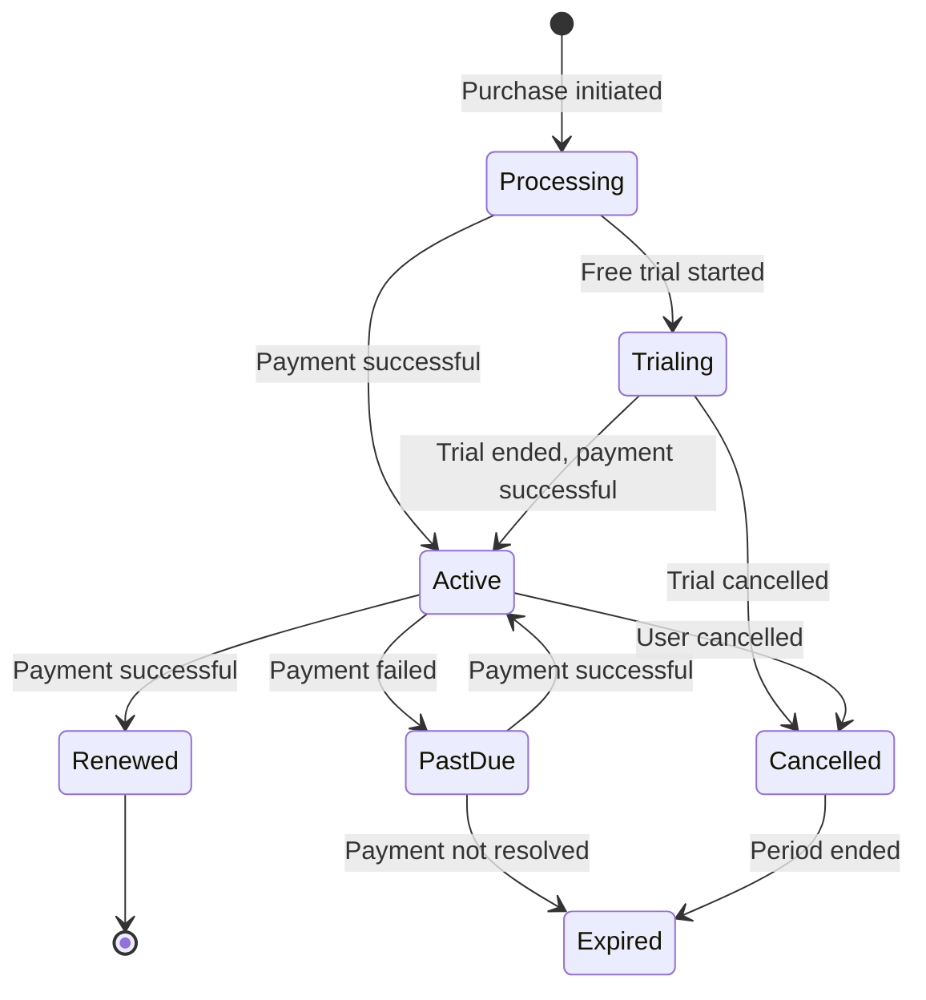

# 🏗️ SUBSCRIPTION MODULE - COMPLETE ARCHITECTURE GUIDE

**Version**: 1.0.0 (NestJS)  
**Last Updated**: 26-03-29  
**Level**: Senior/Mastery

---

## 📋 **TABLE OF CONTENTS**

1. [Module Overview](#module-overview)
2. [Hybrid Subscription Model](#hybrid-subscription-model)
3. [Module Structure](#module-structure)
4. [Subscription Lifecycle](#subscription-lifecycle)
5. [API Endpoints](#api-endpoints)
6. [Database Schemas](#database-schemas)
7. [Free Trial Flow](#free-trial-flow)
8. [RevenueCat Integration](#revenuecat-integration)
9. [Webhook Processing](#webhook-processing)
10. [Caching Strategy](#caching-strategy)

---

## 🎯 **MODULE OVERVIEW**

### **Purpose**
The Subscription module manages subscription plans and user subscriptions with a **hybrid payment model**:
- **Stripe** for web subscriptions (business plans)
- **RevenueCat** for mobile subscriptions (individual plans)
- Free trial management (7 days with card collection)
- Subscription lifecycle tracking

### **Business Model**
```
Individual Plans → RevenueCat (iOS/Android apps)
Business Plans   → Stripe (web)
```

---

## 🏛️ **HYBRID SUBSCRIPTION MODEL**

### **Why Hybrid?**
- **Mobile Users**: Prefer in-app purchases (RevenueCat handles App Store + Play Store)
- **Web Users**: Prefer credit card payments (Stripe)
- **Business Logic**: Different plans for different platforms

### **Platform Routing**
```typescript
const getPaymentGateway = (planType: string, platform: string): string => {
  if (planType === 'individual') {
    return 'revenuecat'; // Mobile apps
  }
  if (['business_starter', 'business_level1', 'business_level2'].includes(planType)) {
    return 'stripe'; // Web
  }
  return 'stripe'; // Default
};
```

---

## 📁 **MODULE STRUCTURE**

```
src/modules/subscription.module/
├── subscription.module.ts                 # Parent module
├── subscriptionPlan/
│   ├── subscriptionPlan.module.ts
│   ├── subscriptionPlan.controller.ts     # 5 endpoints (Admin)
│   ├── subscriptionPlan.service.ts        # Plan management + Stripe
│   ├── subscriptionPlan.schema.ts
│   ├── subscriptionPlan.constants.ts
│   └── dto/
│       ├── create-subscriptionPlan.dto.ts
│       └── update-subscriptionPlan.dto.ts
├── userSubscription/
│   ├── userSubscription.module.ts
│   ├── userSubscription.controller.ts     # 6 endpoints
│   ├── userSubscription.service.ts        # Free trial, purchase
│   ├── userSubscription.schema.ts
│   ├── userSubscription.constants.ts
│   └── dto/
│       └── userSubscription.dto.ts
└── revenueCat/
    ├── revenueCat.module.ts
    ├── revenueCat.controller.ts           # 3 endpoints
    ├── revenueCat.service.ts              # RevenueCat API
    └── services/
        └── revenueCatWebhook.service.ts   # 7 webhook handlers
```

---

## 🔄 **SUBSCRIPTION LIFECYCLE**



### **Status Definitions**
- **Processing**: Payment initiated, not confirmed
- **Trialing**: 7-day free trial active
- **Active**: Subscription active and usable
- **Renewed**: Subscription renewed successfully
- **PastDue**: Payment failed, grace period
- **Cancelled**: User cancelled, active until period end
- **Expired**: Subscription expired, no access

---

## 📡 **API ENDPOINTS**

### **SubscriptionPlan** (Admin only, 5 endpoints)

| Method | Endpoint | Description |
|--------|----------|-------------|
| `GET` | `/subscription-plans` | Get all active plans |
| `GET` | `/subscription-plans/type/:type` | Get plan by type |
| `POST` | `/subscription-plans` | Create plan (auto-creates Stripe product) |
| `PUT` | `/subscription-plans/:id` | Update plan |
| `DELETE` | `/subscription-plans/:id` | Delete plan |

### **UserSubscription** (6 endpoints)

| Method | Endpoint | Auth | Description |
|--------|----------|------|-------------|
| `POST` | `/subscriptions/start-free-trial` | ✅ | Start 7-day trial |
| `POST` | `/subscriptions/purchase/:planId` | ✅ | Purchase subscription |
| `GET` | `/subscriptions/active` | ✅ | Get active subscription |
| `GET` | `/subscriptions/history` | ✅ | Get subscription history |
| `PUT` | `/subscriptions/:id/cancel` | ✅ | Cancel subscription |
| `PUT` | `/subscriptions/:id/status` | ✅ | Update status (Admin) |

### **RevenueCat** (3 endpoints)

| Method | Endpoint | Description |
|--------|----------|-------------|
| `GET` | `/revenuecat/subscriptions/:userId` | Get user subscriptions |
| `POST` | `/revenuecat/validate-receipt` | Validate Apple/Google receipt |
| `POST` | `/webhooks/revenuecat-subscription` | RevenueCat webhook handler |

---

## 🗄️ **DATABASE SCHEMAS**

### **SubscriptionPlan Schema**
```typescript
@Schema({ timestamps: true })
export class SubscriptionPlan {
  @Prop({ required: true, unique: false })
  subscriptionName: string;

  @Prop({ 
    type: String, 
    enum: ['individual', 'business_starter', 'business_level1', 'business_level2'],
    index: true,
  })
  subscriptionType: string;

  @Prop({ default: true })
  freeTrialEnabled: boolean;

  @Prop({ min: 0 })
  freeTrialDurationDays?: number;

  @Prop({ enum: ['month', 'year'], default: 'month' })
  initialDuration: string;

  @Prop({ enum: ['monthly', 'yearly'], default: 'monthly' })
  renewalFrequncy: string;

  @Prop({ required: true })
  amount: string; // Stored as string for precision

  @Prop({ enum: ['usd', 'bdt', 'eur'], default: 'usd' })
  currency: string;

  @Prop({ required: true })
  maxChildrenAccount: number;

  // Stripe integration
  @Prop()
  stripe_product_id: string;

  @Prop()
  stripe_price_id: string;

  // RevenueCat integration
  @Prop({ enum: ['stripe', 'revenuecat', 'both'], default: 'stripe' })
  purchaseChannel: string;

  @Prop()
  revenueCatProductIdentifier: string;

  @Prop()
  revenueCatPackageIdentifier: string;

  @Prop({ type: [String], enum: ['ios', 'android', 'web'] })
  availablePlatforms: string[];

  @Prop({ default: true, index: true })
  isActive: boolean;

  @Prop({ default: false })
  isDeleted: boolean;
}

// Indexes
SubscriptionPlanSchema.index({ subscriptionType: 1, isActive: 1, isDeleted: 1 });
SubscriptionPlanSchema.index({ purchaseChannel: 1, isActive: 1 });
```

### **UserSubscription Schema**
```typescript
@Schema({ timestamps: true })
export class UserSubscription {
  @Prop({ type: Schema.Types.ObjectId, ref: 'User', index: true })
  userId: Types.ObjectId;

  @Prop({ type: Schema.Types.ObjectId, ref: 'SubscriptionPlan', index: true })
  subscriptionPlanId: Types.ObjectId;

  @Prop()
  subscriptionStartDate?: Date;

  @Prop()
  currentPeriodStartDate?: Date;

  @Prop()
  expirationDate?: Date;

  @Prop()
  renewalDate?: Date;

  @Prop({ default: 0 })
  billingCycle: number;

  @Prop({ default: false })
  isAutoRenewed: boolean;

  @Prop()
  cancelledAt?: Date;

  @Prop({ default: false })
  cancelledAtPeriodEnd: boolean;

  @Prop({ 
    type: String, 
    enum: ['processing', 'active', 'past_due', 'cancelled', 'unpaid', 'incomplete', 'trialing', 'payment_failed'],
    index: true,
  })
  status: string;

  @Prop({ required: true })
  isFromFreeTrial: boolean;

  // Stripe specific
  @Prop()
  stripe_subscription_id: string;

  @Prop()
  stripe_transaction_id: string;

  // RevenueCat specific
  @Prop({ enum: ['stripe', 'revenuecat'], default: 'stripe' })
  paymentGateway: string;

  @Prop()
  revenueCatUserId: string;

  @Prop()
  revenueCatOrderId: string;

  @Prop()
  revenueCatTransactionId: string;

  @Prop()
  appleReceiptData?: string;

  @Prop()
  googlePurchaseToken?: string;

  @Prop()
  originalTransactionId?: string;

  @Prop({ enum: ['production', 'sandbox'] })
  revenueCatEnvironment?: string;

  @Prop({ enum: ['ios', 'android', 'web'] })
  purchasePlatform: string;

  @Prop({ default: false })
  isDeleted: boolean;
}

// Indexes
UserSubscriptionSchema.index({ userId: 1, status: 1, isDeleted: 1 });
UserSubscriptionSchema.index({ subscriptionPlanId: 1, isDeleted: 1 });
UserSubscriptionSchema.index({ revenueCatOrderId: 1, isDeleted: 1 });
UserSubscriptionSchema.index({ stripe_subscription_id: 1, isDeleted: 1 });
```

---

## 🎁 **FREE TRIAL FLOW**

### **7-Day Trial with Card Collection**
```mermaid
sequenceDiagram
    participant U as User
    participant API as Subscription API
    participant Stripe as Stripe
    participant DB as MongoDB

    U->>API: POST /subscriptions/start-free-trial
    API->>DB: Check hasUsedFreeTrial
    DB-->>API: false (eligible)
    
    API->>DB: Get active individual plan
    DB-->>API: Plan with stripe_price_id
    
    API->>Stripe: customers.create() or get existing
    Stripe-->>API: customer_id
    
    API->>DB: Create userSubscription (trialing)
    DB-->>API: Subscription record
    
    API->>Stripe: checkout.sessions.create({
      trial_period_days: 7,
      metadata: { userId, planId, ... }
    })
    Stripe-->>API: { url }
    
    API->>DB: Set hasUsedFreeTrial = true
    API-->>U: Redirect to Stripe URL
    
    Note over U,Stripe: User enters card details<br/>Not charged yet
    
    Note over Stripe,DB: After 7 days:<br/>Stripe charges card<br/>Webhook activates subscription
```

### **Free Trial Rules**
1. ✅ One trial per user (tracked by `hasUsedFreeTrial`)
2. ✅ Card required upfront (reduces fraud, ensures conversion)
3. ✅ Auto-charge after 7 days (via Stripe webhook)
4. ✅ User can cancel anytime during trial

---

## 📱 **REVENUECAT INTEGRATION**

### **Product Mapping**
```typescript
const productMapping: Record<string, string> = {
  'individual_monthly': 'individual',
  'individual_annual': 'individual',
  'business_monthly': 'business',
  'business_annual': 'business',
};
```

### **Webhook Handlers** (7 events)
1. **INITIAL_PURCHASE** - First subscription purchase
2. **RENEWAL** - Subscription renewed
3. **CANCELLATION** - User cancelled
4. **EXPIRATION** - Subscription expired
5. **REFUND** - Refund processed
6. **BILLING_ISSUE** - Payment failed
7. **SUBSCRIPTION** - General subscription event

---

## 🎣 **WEBHOOK PROCESSING**

### **Stripe Webhook → Activate Subscription**
```typescript
async handleCheckoutSessionCompleted(event: Stripe.Event) {
  const session = event.data.object as Stripe.Checkout.Session;
  const metadata = session.metadata;

  // Find user subscription from metadata
  const subscription = await this.userSubscriptionModel.findById(
    metadata.referenceId
  );

  if (subscription && subscription.isFromFreeTrial) {
    // Free trial ended, activate subscription
    subscription.status = 'active';
    subscription.subscriptionPlanId = metadata.subscriptionPlanId;
    subscription.stripe_subscription_id = session.subscription as string;
    await subscription.save();

    // Update user subscription type
    await this.userModel.findByIdAndUpdate(metadata.userId, {
      $set: { subscriptionType: metadata.subscriptionType },
    });
  }
}
```

### **RevenueCat Webhook → Create Subscription**
```typescript
async handleInitialPurchase(event: any) {
  const { product_id, subscriber } = event;
  const revenueCatUserId = subscriber.original_app_user_id;

  // Find user by RevenueCat ID
  const user = await this.userModel.findOne({ revenueCatUserId });
  if (!user) return;

  // Check idempotency
  const existing = await this.userSubscriptionModel.findOne({
    revenueCatOrderId: event.id,
  });
  if (existing) return;

  // Map product to subscription type
  const subscriptionType = this.mapProductIdToSubscriptionType(product_id);

  // Create subscription
  await this.userSubscriptionModel.create({
    userId: user._id,
    subscriptionPlanId: null, // Mapped later
    paymentGateway: 'revenuecat',
    purchasePlatform: subscriber.original_platform,
    revenueCatUserId,
    revenueCatOrderId: event.id,
    revenueCatEnvironment: event.environment,
    status: 'active',
    isFromFreeTrial: false,
  });
}
```

---

## 🚀 **CACHING STRATEGY**

### **Cache Keys**
```typescript
const cacheKeys = {
  activePlans: () => 'subscription:plans:active',
  userSubscription: (userId: string) => `subscription:user:${userId}:active`,
  planByType: (type: string) => `subscription:plan:${type}`,
};
```

### **Cache TTLs**
```typescript
const cacheTTL = {
  activePlans: 900,         // 15 minutes
  userSubscription: 300,    // 5 minutes
  planByType: 600,          // 10 minutes
};
```

---

## 📚 **KEY TAKEAWAYS**

1. **Hybrid Model** - Stripe (web) + RevenueCat (mobile)
2. **Free Trial** - 7 days with card collection
3. **Webhooks** - Idempotent, verified, logged
4. **Lifecycle** - 8 subscription statuses
5. **Product Mapping** - RevenueCat → Internal types
6. **Caching** - Plans and user subscriptions cached

---

**Next**: Notification Module (multi-channel notifications)

---
-26-03-29
