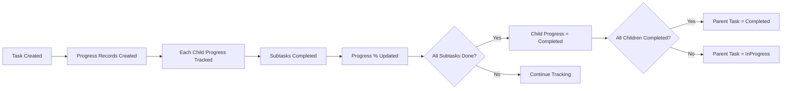
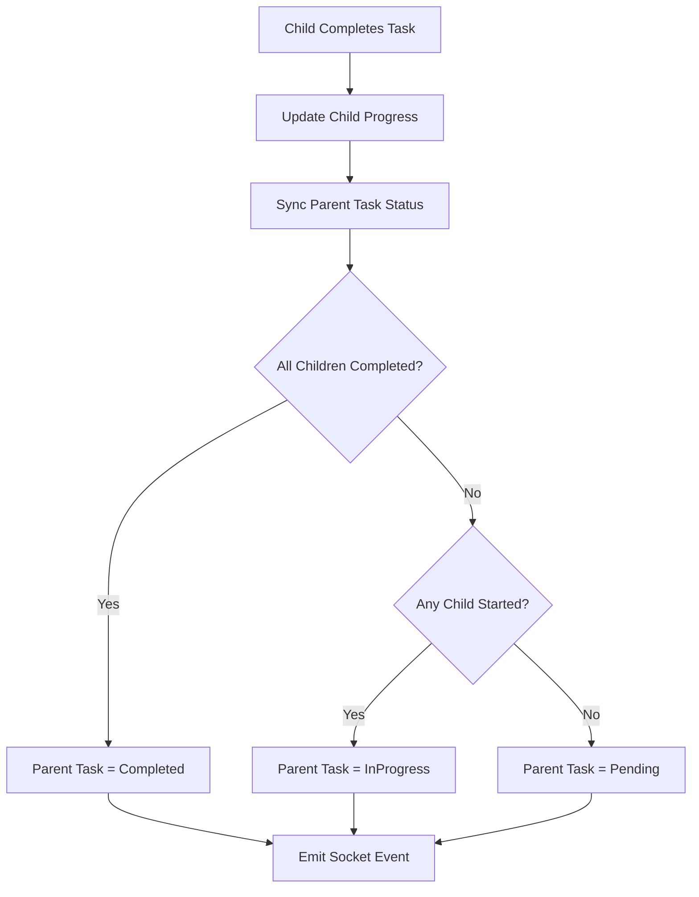

# 🏗️ TASKPROGRESS MODULE - COMPREHENSIVE ARCHITECTURE GUIDE

**Version**: 1.0.0 (NestJS)  
**Last Updated**: 26-03-29  
**Level**: Senior/Mastery  
**Estimated Study Time**: 1.5 hours

---

## 📋 **TABLE OF CONTENTS**

1. [Module Overview](#1-module-overview)
2. [Progress Tracking Model](#2-progress-tracking-model)
3. [Module Structure](#3-module-structure)
4. [Database Schema](#4-database-schema)
5. [Progress States](#5-progress-states)
6. [API Endpoints](#6-api-endpoints)
7. [Parent Task Auto-Sync](#7-parent-task-auto-sync)
8. [Real-Time Updates](#8-real-time-updates)
9. [Caching Strategy](#9-caching-strategy)
10. [Subtask Completion](#10-subtask-completion)
11. [Parent Dashboard](#11-parent-dashboard)
12. [Integration with Task Module](#12-integration-with-task-module)

---

## 1. **MODULE OVERVIEW**

### **1.1 Purpose & Scope**

The TaskProgress module tracks **each child's independent progress on collaborative tasks**:
- **Per-child progress**: Individual progress tracking for each assignee
- **Subtask completion**: Track which subtasks each child completed
- **Progress percentage**: Auto-calculated based on completed subtasks
- **Parent monitoring**: Real-time updates to parents
- **Auto-sync**: Parent task status syncs with children's progress

### **1.2 Key Design Principles**

1. **Independent Progress**: Each child has separate progress record
2. **Real-Time**: Socket.IO updates to parents
3. **Auto-Calculation**: Progress percentage calculated automatically
4. **Parent Sync**: Parent task status reflects children's progress
5. **Cached**: Progress data cached for performance

### **1.3 Module Statistics**

| Metric | Value |
|--------|-------|
| **Total Files** | 11 files |
| **Lines of Code** | ~1,400 lines |
| **API Endpoints** | 6 endpoints |
| **Cache Keys** | 4 patterns |
| **Socket Events** | 3 event types |

---

## 2. **PROGRESS TRACKING MODEL**

### **2.1 Entity Relationship**

```
┌─────────────┐       ┌──────────────────────────┐       ┌─────────────┐
│    Task     │       │   TaskProgress           │       │    User     │
│ (Collaborative)│◄────┤                          ├────►│   (Child)   │
│             │       │  - status                │       │             │
│  - taskType │       │  - progressPercentage    │       │  - role:    │
│  - assignedUserIds│  │  - completedSubtaskIndexes│      │  'child'    │
└─────────────┘       │  - startedAt             │       └─────────────┘
                      │  - completedAt           │
                      └──────────────────────────┘
```

### **2.2 Progress Flow**



---

## 3. **MODULE STRUCTURE**

```
src/modules/task.module/taskProgress/
├── taskProgress.module.ts                  # Module definition
├── taskProgress.controller.ts              # CRUD endpoints (6)
├── taskProgress.service.ts                 # Progress business logic
├── taskProgress.schema.ts                  # Progress schema
├── taskProgress.constants.ts               # Status enums, cache config
├── dto/
│   └── taskProgress.dto.ts                 # Progress DTOs
├── entities/
│   └── taskProgress.entity.ts              # TypeScript entities
└── doc/
    ├── README.md                           # Module documentation
    └── dia/
        ├── taskProgress-schema.mermaid
        └── taskProgress-flow.mermaid
```

---

## 4. **DATABASE SCHEMA**

### **4.1 TaskProgress Schema**

```typescript
@Schema({ timestamps: true, toJSON: { virtuals: true } })
export class TaskProgress {
  /**
   * Reference to the task
   */
  @Prop({
    type: Schema.Types.ObjectId,
    ref: 'Task',
    required: [true, 'Task ID is required'],
    index: true,
  })
  taskId: Types.ObjectId;

  /**
   * Reference to the child user
   */
  @Prop({
    type: Schema.Types.ObjectId,
    ref: 'User',
    required: [true, 'User ID is required'],
    index: true,
  })
  userId: Types.ObjectId;

  /**
   * Current progress status
   */
  @Prop({
    type: String,
    enum: Object.values(TaskProgressStatus),
    default: TaskProgressStatus.NOT_STARTED,
  })
  status: TaskProgressStatus;

  /**
   * When the child started working
   */
  @Prop()
  startedAt?: Date;

  /**
   * When the child completed the task
   */
  @Prop()
  completedAt?: Date;

  /**
   * Array of subtask indexes completed by this child
   */
  @Prop({
    type: [Number],
    default: [],
  })
  completedSubtaskIndexes: number[];

  /**
   * Progress percentage (0-100)
   */
  @Prop({
    type: Number,
    default: 0,
    min: [0, 'Progress cannot be negative'],
    max: [100, 'Progress cannot exceed 100'],
  })
  progressPercentage: number;

  /**
   * Optional note or comment from the child
   */
  @Prop({
    type: String,
    maxlength: [500, 'Note cannot exceed 500 characters'],
  })
  note?: string;

  /**
   * Soft delete flag
   */
  @Prop({ default: false })
  isDeleted: boolean;

  createdAt?: Date;
  updatedAt?: Date;
}

// Indexes
TaskProgressSchema.index({ taskId: 1, userId: 1 }, { unique: true, partialFilterExpression: { isDeleted: false } });
TaskProgressSchema.index({ taskId: 1, status: 1, isDeleted: 1 });
TaskProgressSchema.index({ userId: 1, status: 1, isDeleted: 1 });
TaskProgressSchema.index({ updatedAt: -1, isDeleted: 1 });

// Instance method: Update progress percentage
TaskProgressSchema.methods.updateProgressPercentage = function(totalSubtasks: number): void {
  if (totalSubtasks === 0) {
    this.progressPercentage = 0;
    return;
  }

  const completedCount = this.completedSubtaskIndexes.length;
  this.progressPercentage = Math.round((completedCount / totalSubtasks) * 100);

  // Auto-update status based on progress
  if (this.progressPercentage === 100 && totalSubtasks > 0) {
    this.status = TaskProgressStatus.COMPLETED;
    this.completedAt = new Date();
  } else if (this.progressPercentage > 0 && this.status === TaskProgressStatus.NOT_STARTED) {
    this.status = TaskProgressStatus.IN_PROGRESS;
    if (!this.startedAt) {
      this.startedAt = new Date();
    }
  }
};
```

---

## 5. **PROGRESS STATES**

### **5.1 Progress Status Enum**

```typescript
export enum TaskProgressStatus {
  /** Child hasn't started the task yet */
  NOT_STARTED = 'notStarted',

  /** Child is actively working on the task */
  IN_PROGRESS = 'inProgress',

  /** Child has completed all subtasks */
  COMPLETED = 'completed',
}
```

### **5.2 State Transitions**

```
[NOT_STARTED] --> [IN_PROGRESS] --> [COMPLETED]
      |                ↑
      └────────────────┘ (if progress reset)
```

---

## 6. **API ENDPOINTS**

### **6.1 Complete Reference**

| Method | Endpoint | Auth | Role | Description |
|--------|----------|------|------|-------------|
| `GET` | `/task-progress/:taskId/user/:userId` | ✅ | Child | Get personal progress |
| `GET` | `/task-progress/:taskId/children` | ✅ | Parent | Get all children's progress |
| `GET` | `/task-progress/child/:childId/tasks` | ✅ | Parent | Get child's all tasks |
| `PUT` | `/task-progress/:taskId/status` | ✅ | Child | Update progress status |
| `PUT` | `/task-progress/:taskId/subtasks/:index/complete` | ✅ | Child | Complete subtask |
| `DELETE` | `/task-progress/:taskId/user/:userId` | ✅ | Admin | Delete progress |

### **6.2 Request/Response Examples**

**Get Personal Progress**
```http
GET /task-progress/507f1f77bcf86cd799439011/user/507f191e810c19729de860ea
Authorization: Bearer <token>

Response 200:
{
  "success": true,
  "data": {
    "progressId": "507f1f77bcf86cd799439012",
    "taskId": "507f1f77bcf86cd799439011",
    "userId": "507f191e810c19729de860ea",
    "status": "inProgress",
    "progressPercentage": 67,
    "completedSubtaskIndexes": [0, 2],
    "startedAt": "2024-03-29T10:00:00Z",
    "note": "Working on it!"
  }
}
```

**Get All Children's Progress (Parent Dashboard)**
```http
GET /task-progress/507f1f77bcf86cd799439011/children
Authorization: Bearer <token>

Response 200:
{
  "success": true,
  "data": {
    "taskId": "507f1f77bcf86cd799439011",
    "taskTitle": "Clean the garage",
    "totalSubtasks": 5,
    "childrenProgress": [
      {
        "childId": "507f191e810c19729de860ea",
        "childName": "Alice",
        "status": "completed",
        "progressPercentage": 100,
        "completedSubtaskCount": 5
      },
      {
        "childId": "507f191e810c19729de860eb",
        "childName": "Bob",
        "status": "inProgress",
        "progressPercentage": 60,
        "completedSubtaskCount": 3
      }
    ],
    "summary": {
      "totalChildren": 2,
      "notStarted": 0,
      "inProgress": 1,
      "completed": 1,
      "completionRate": 50,
      "averageProgress": 80
    }
  }
}
```

---

## 7. **PARENT TASK AUTO-SYNC**

### **7.1 Auto-Sync Logic**

```typescript
async syncParentTaskStatusWithChildrenProgress(taskId: string): Promise<void> {
  // Get task to verify it's collaborative
  const task = await this.taskModel.findById(taskId);
  if (!task || task.taskType !== 'collaborative') {
    return; // Only for collaborative tasks
  }

  // Get all assigned users
  const assignedUserIds = task.assignedUserIds || [];
  if (assignedUserIds.length === 0) {
    return;
  }

  // Get all progress records
  const allProgress = await this.taskProgressModel.find({
    taskId: new Types.ObjectId(taskId),
    userId: { $in: assignedUserIds.map(id => new Types.ObjectId(id)) },
    isDeleted: false,
  });

  // Count by status
  const notStartedCount = allProgress.filter(
    p => p.status === TaskProgressStatus.NOT_STARTED,
  ).length;

  const completedCount = allProgress.filter(
    p => p.status === TaskProgressStatus.COMPLETED,
  ).length;

  const totalAssignedUsers = assignedUserIds.length;

  // Determine parent task status
  let newParentStatus: TaskStatus | null = null;

  if (completedCount === totalAssignedUsers) {
    // ALL completed → Parent: "completed"
    newParentStatus = TaskStatus.COMPLETED;
  } else if (notStartedCount < totalAssignedUsers) {
    // At least ONE started → Parent: "inProgress"
    newParentStatus = TaskStatus.IN_PROGRESS;
  }
  // else: All notStarted → Keep parent as "pending"

  // Update parent task if needed
  if (newParentStatus && task.status !== newParentStatus) {
    await this.taskModel.findByIdAndUpdate(
      new Types.ObjectId(taskId),
      {
        status: newParentStatus,
        ...(newParentStatus === TaskStatus.COMPLETED && {
          completedAt: new Date(),
        }),
      },
    );

    // Emit real-time update
    this.socketService.emitToRoom(`task:${taskId}`, 'task:status-synced', {
      taskId,
      status: newParentStatus,
      completedCount,
      totalAssignedUsers,
    });
  }
}
```

### **7.2 Sync Flow**



---

## 8. **REAL-TIME UPDATES**

### **8.1 Socket.IO Events**

```typescript
// Emit progress update to parent
async emitProgressUpdateToParent(
  taskId: string,
  userId: string,
  status: TaskProgressStatus,
  oldStatus: TaskProgressStatus,
): Promise<void> {
  // Get task to find parent
  const task = await this.taskModel.findById(taskId);
  const parentId = task.createdById.toString();

  // Get child name
  const child = await this.userModel.findById(userId);

  // Determine event type
  let eventType: string;
  let message: string;

  if (status === TaskProgressStatus.IN_PROGRESS && 
      oldStatus === TaskProgressStatus.NOT_STARTED) {
    eventType = 'task-progress:started';
    message = `${child.name} started working on "${task.title}"`;
  } else if (status === TaskProgressStatus.COMPLETED) {
    eventType = 'task-progress:completed';
    message = `${child.name} completed "${task.title}"`;
  } else {
    return; // Skip other status changes
  }

  // Emit to parent
  await this.socketService.emitToTaskUsers([parentId], eventType, {
    taskId,
    taskTitle: task.title,
    childId: userId,
    childName: child.name,
    status,
    oldStatus,
    timestamp: new Date(),
    message,
  });

  // Also broadcast to family room
  await this.socketService.broadcastGroupActivity(parentId, {
    type: status === TaskProgressStatus.COMPLETED 
      ? ActivityType.TASK_COMPLETED 
      : ActivityType.TASK_STARTED,
    actor: { userId, name: child.name },
    task: { taskId, title: task.title },
  });
}
```

### **8.2 Event Types**

| Event | Trigger | Recipients |
|-------|---------|------------|
| `task-progress:started` | Child starts task | Parent |
| `task-progress:completed` | Child completes task | Parent |
| `task:status-synced` | Parent task status updated | All assignees |

---

## 9. **CACHING STRATEGY**

### **9.1 Cache Keys**

```typescript
const CACHE_KEYS = {
  progress: {
    detail: (taskId: string, userId: string) => 
      `taskProgress:detail:task:${taskId}:user:${userId}`,
    children: (taskId: string) => 
      `taskProgress:children:task:${taskId}`,
    tasks: (userId: string) => 
      `taskProgress:tasks:user:${userId}`,
    summary: (taskId: string) => 
      `taskProgress:summary:task:${taskId}`,
  },
};

const CACHE_TTL = {
  PROGRESS_DETAIL: 300,      // 5 minutes
  CHILDREN_PROGRESS: 120,    // 2 minutes
  TASKS_PROGRESS: 180,       // 3 minutes
  SUMMARY: 120,              // 2 minutes
};
```

### **9.2 Cache Invalidation**

```typescript
async invalidateCache(
  taskId?: string,
  userId?: string,
): Promise<void> {
  const keysToDelete: string[] = [];

  if (taskId && userId) {
    keysToDelete.push(this.getCacheKey('detail', taskId, userId));
  }
  if (taskId) {
    keysToDelete.push(this.getCacheKey('children', taskId));
    keysToDelete.push(this.getCacheKey('summary', taskId));
  }
  if (userId) {
    keysToDelete.push(this.getCacheKey('tasks', userId));
  }

  await Promise.all(keysToDelete.map(key => this.cacheManager.del(key)));
}
```

---

## 10. **SUBTASK COMPLETION**

### **10.1 Complete Subtask Flow**

```typescript
async completeSubtask(
  taskId: string,
  subtaskIndex: number,
  userId: string,
): Promise<TaskProgressDocument> {
  // Find or create progress record
  let progress = await this.taskProgressModel.findOne({
    taskId: new Types.ObjectId(taskId),
    userId: new Types.ObjectId(userId),
    isDeleted: false,
  });

  if (!progress) {
    progress = await this.createOrUpdateProgress(
      taskId,
      userId,
      TaskProgressStatus.IN_PROGRESS,
    );
  }

  // Add subtask index to completed list
  if (!progress.completedSubtaskIndexes.includes(subtaskIndex)) {
    progress.completedSubtaskIndexes.push(subtaskIndex);
  }

  // Update progress percentage
  const subtasks = await this.subTaskModel.find({
    taskId: new Types.ObjectId(taskId),
    isDeleted: false,
  });

  progress.updateProgressPercentage(subtasks.length);

  // Check if ALL subtasks completed → auto-complete task
  if (progress.completedSubtaskIndexes.length === subtasks.length && 
      subtasks.length > 0) {
    progress.status = TaskProgressStatus.COMPLETED;
    progress.completedAt = new Date();
    progress.progressPercentage = 100;
  }

  await progress.save();

  // Sync parent task status
  await this.syncParentTaskStatusWithChildrenProgress(taskId);

  // Invalidate cache
  await this.invalidateCache(taskId, userId);

  return progress;
}
```

---

## 11. **PARENT DASHBOARD**

### **11.1 Dashboard Analytics**

```typescript
async getAllChildrenProgress(taskId: string): Promise<TaskProgressSummary> {
  // Get task details
  const task = await this.taskModel.findById(taskId);

  // Get all children's progress
  const progressRecords = await this.taskProgressModel
    .find({
      taskId: new Types.ObjectId(taskId),
      isDeleted: false,
    })
    .populate('userId', 'name email profileImage');

  // Build children progress array
  const childrenProgress = progressRecords.map(record => {
    const userDoc = record.userId as any;
    return {
      childId: record.userId,
      childName: userDoc?.name || 'Unknown',
      status: record.status,
      progressPercentage: record.progressPercentage,
      completedSubtaskCount: record.completedSubtaskIndexes.length,
      totalSubtasks: task.subtasks?.length || 0,
    };
  });

  // Calculate summary statistics
  const summary = {
    totalChildren: childrenProgress.length,
    notStarted: childrenProgress.filter(
      c => c.status === TaskProgressStatus.NOT_STARTED,
    ).length,
    inProgress: childrenProgress.filter(
      c => c.status === TaskProgressStatus.IN_PROGRESS,
    ).length,
    completed: childrenProgress.filter(
      c => c.status === TaskProgressStatus.COMPLETED,
    ).length,
    completionRate: childrenProgress.length > 0
      ? Math.round(
          (childrenProgress.filter(c => c.status === 'completed').length /
            childrenProgress.length) * 100,
        )
      : 0,
    averageProgress: childrenProgress.length > 0
      ? Math.round(
          childrenProgress.reduce((sum, c) => sum + c.progressPercentage, 0) /
            childrenProgress.length,
        )
      : 0,
  };

  return {
    taskId: task._id,
    taskTitle: task.title,
    totalSubtasks: task.subtasks?.length || 0,
    childrenProgress,
    summary,
  };
}
```

---

## 12. **INTEGRATION WITH TASK MODULE**

### **12.1 Task Creation Flow**

```typescript
// In TaskService
async createTask(taskDto: CreateTaskDto): Promise<TaskDocument> {
  const task = await this.taskModel.create(taskDto);

  // If collaborative task, create progress records for all assignees
  if (task.taskType === 'collaborative' && task.assignedUserIds?.length > 0) {
    await this.taskProgressService.bulkCreateForTask(
      task._id.toString(),
      task.assignedUserIds.map(id => id.toString()),
    );
  }

  return task;
}
```

### **12.2 Bulk Progress Creation**

```typescript
async bulkCreateForTask(
  taskId: string,
  assignedUserIds: string[],
): Promise<TaskProgressDocument[]> {
  const progressRecords = await Promise.all(
    assignedUserIds.map(async (userId) => {
      // Check if already exists
      const existing = await this.taskProgressModel.findOne({
        taskId: new Types.ObjectId(taskId),
        userId: new Types.ObjectId(userId),
        isDeleted: false,
      });

      if (existing) {
        return existing;
      }

      // Create new progress record
      return this.taskProgressModel.create({
        taskId: new Types.ObjectId(taskId),
        userId: new Types.ObjectId(userId),
        status: TaskProgressStatus.NOT_STARTED,
        completedSubtaskIndexes: [],
        progressPercentage: 0,
      });
    }),
  );

  return progressRecords;
}
```

---

## 📚 **KEY TAKEAWAYS**

1. **Per-Child Tracking** - Each child has independent progress record
2. **Auto-Sync** - Parent task status syncs with children's progress
3. **Real-Time** - Socket.IO updates to parents
4. **Progress Calculation** - Auto-calculated from completed subtasks
5. **Parent Dashboard** - Comprehensive progress summary
6. **Caching** - Redis caching for performance
7. **Subtask Integration** - Tight integration with SubTask module

---

## 🎊 **ALL MODULE GUIDES COMPLETE!**

This completes the comprehensive architecture guide for the TaskProgress module and all 13 modules of the NestJS Task Management Backend!

---
-26-03-29
