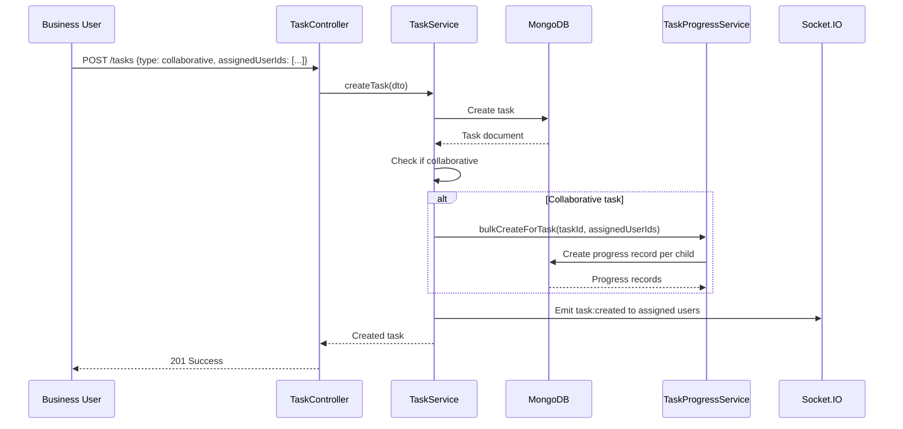
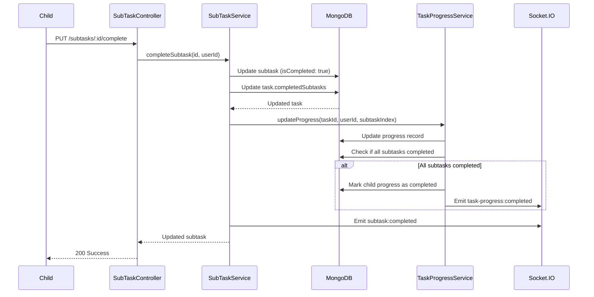

# 🏗️ TASK MODULE - COMPLETE ARCHITECTURE GUIDE

**Version**: 1.0.0 (NestJS)  
**Last Updated**: 26-03-29  
**Level**: Senior/Mastery

---

## 📋 **TABLE OF CONTENTS**

1. [Module Overview](#module-overview)
2. [Parent Module Pattern](#parent-module-pattern)
3. [Module Structure](#module-structure)
4. [Database Architecture](#database-architecture)
5. [Task Types & Permissions](#task-types--permissions)
6. [API Endpoints](#api-endpoints)
7. [Data Flow](#data-flow)
8. [Caching Strategy](#caching-strategy)
9. [Real-Time Updates](#real-time-updates)
10. [Integration with TaskProgress](#integration-with-taskprogress)
11. [Security & Permissions](#security--permissions)
12. [Performance Optimization](#performance-optimization)

---

## 🎯 **MODULE OVERVIEW**

### **Purpose**
The Task module is the **core business logic** module that handles:
- Personal task management
- Collaborative task management (multiple assignees)
- Subtask management (separate collection)
- Task statistics and progress tracking
- Real-time task updates via Socket.IO

### **Parent Module Pattern**
This module demonstrates the **Parent Module Pattern** - grouping related sub-modules:
- **Task** - Main task entity
- **SubTask** - Subtask entity (separate collection)
- **TaskProgress** - Per-user progress tracking (from TaskProgress module)

---

## 🏛️ **PARENT MODULE PATTERN**

### **Why Parent Module?**
```
✅ GOOD: Related modules grouped
src/modules/task.module/
├── task.module.ts              # Parent module
├── task/                       # Task sub-module
│   ├── task.controller.ts
│   ├── task.service.ts
│   └── task.schema.ts
├── subTask/                    # SubTask sub-module
│   ├── subTask.controller.ts
│   ├── subTask.service.ts
│   └── subTask.schema.ts
└── doc/                        # Shared documentation
    ├── dia/
    └── README.md

❌ BAD: Related modules separated
src/modules/
├── task/
└── subTask/
```

### **Benefits**
1. ✅ Clear relationship between Task and SubTask
2. ✅ Shared documentation at parent level
3. ✅ Easy to import both together
4. ✅ Better organization for large codebases
5. ✅ Shared caching keys and constants

---

## 📁 **MODULE STRUCTURE**

```
src/modules/task.module/
├── task.module.ts                         # Parent module (imports all)
├── task/
│   ├── task.controller.ts                 # 5 endpoints
│   ├── task.service.ts                    # Task business logic
│   ├── task.schema.ts                     # Task schema
│   ├── task.constants.ts                  # Task types, status
│   └── dto/
│       ├── create-task.dto.ts
│       └── update-task.dto.ts
├── subTask/
│   ├── subTask.controller.ts              # 4 endpoints
│   ├── subTask.service.ts                 # Subtask business logic
│   ├── subTask.schema.ts                  # Subtask schema
│   ├── subTask.constants.ts               # Subtask constants
│   └── dto/
│       ├── create-subTask.dto.ts
│       └── update-subTask.dto.ts
└── doc/
    ├── dia/
    │   ├── task-schema.mermaid
    │   ├── subtask-schema.mermaid
    │   └── task-system-flow.mermaid
    ├── perf/
    │   └── task-performance-report.md
    └── README.md
```

---

## 🗄️ **DATABASE ARCHITECTURE**

### **Task Schema**
```typescript
@Schema({ timestamps: true, toJSON: { virtuals: true } })
export class Task {
  @Prop({ type: Schema.Types.ObjectId, ref: 'User', index: true })
  createdById: Types.ObjectId;

  @Prop({ type: Schema.Types.ObjectId, ref: 'User', index: true })
  ownerUserId: Types.ObjectId;

  @Prop({ 
    type: String, 
    enum: ['personal', 'singleAssignment', 'collaborative'],
    index: true,
  })
  taskType: string;

  @Prop({ type: [{ type: Schema.Types.ObjectId, ref: 'User' }] })
  assignedUserIds: Types.ObjectId[];

  @Prop({ required: true, maxlength: 200 })
  title: string;

  @Prop({ maxlength: 2000 })
  description?: string;

  @Prop({ 
    type: String, 
    enum: ['pending', 'inProgress', 'completed'],
    index: true,
  })
  status: string;

  @Prop({ 
    type: String, 
    enum: ['low', 'medium', 'high'],
  })
  priority: string;

  @Prop({ required: true })
  startTime: Date;

  @Prop()
  dueDate?: Date;

  @Prop()
  completedAt?: Date;

  @Prop({ default: 0 })
  totalSubtasks: number;

  @Prop({ default: 0 })
  completedSubtasks: number;

  @Prop({ default: false })
  isDeleted: boolean;
}

// Indexes
TaskSchema.index({ createdById: 1, isDeleted: 1 });
TaskSchema.index({ ownerUserId: 1, status: 1, isDeleted: 1 });
TaskSchema.index({ assignedUserIds: 1, status: 1, isDeleted: 1 });
TaskSchema.index({ taskType: 1, status: 1, isDeleted: 1 });
TaskSchema.index({ startTime: -1, isDeleted: 1 });
TaskSchema.index({ status: 1, isDeleted: 1 });

// Virtual populate for subtasks
TaskSchema.virtual('subtasks', {
  ref: 'SubTask',
  localField: '_id',
  foreignField: 'taskId',
  match: { isDeleted: false },
  options: { sort: { order: 1 } },
});

// Virtual for completion percentage
TaskSchema.virtual('completionPercentage').get(function() {
  if (this.totalSubtasks === 0) return 0;
  return Math.round((this.completedSubtasks / this.totalSubtasks) * 100);
});
```

### **SubTask Schema** (Separate Collection)
```typescript
@Schema({ timestamps: true })
export class SubTask {
  @Prop({ type: Schema.Types.ObjectId, ref: 'Task', required: true, index: true })
  taskId: Types.ObjectId;

  @Prop({ required: true, maxlength: 200 })
  title: string;

  @Prop({ maxlength: 1000 })
  description?: string;

  @Prop({ default: 0 })
  order: number;

  @Prop({ default: false })
  isCompleted: boolean;

  @Prop()
  completedAt?: Date;

  @Prop({ type: Schema.Types.ObjectId, ref: 'User' })
  completedBy?: Types.ObjectId;

  @Prop({ default: false })
  isDeleted: boolean;
}

// Indexes
SubTaskSchema.index({ taskId: 1, order: 1, isDeleted: 1 });
SubTaskSchema.index({ taskId: 1, isCompleted: 1, isDeleted: 1 });
```

---

## 📊 **TASK TYPES & PERMISSIONS**

### **Task Type Matrix**

| Task Type | Created By | Assigned To | Progress Tracking | Use Case |
|-----------|------------|-------------|-------------------|----------|
| **Personal** | User | User (self) | Self-tracked | Personal todo |
| **SingleAssignment** | Business/Parent | One child | Per-child progress | Assign chore to one child |
| **Collaborative** | Business/Parent | Multiple children | Per-child progress | Group chore |

### **Permission Matrix**

| Action | Personal | SingleAssignment | Collaborative |
|--------|----------|------------------|---------------|
| Create | User | Business/Parent | Business/Parent |
| Edit | Owner | Business/Parent | Business/Parent |
| Delete | Owner | Business/Parent | Business/Parent |
| Update Status | Owner | Assignee | All assignees |
| Complete Subtask | Owner | Assignee | All assignees |
| View Progress | Owner | Business/Parent | Business/Parent |

---

## 📡 **API ENDPOINTS**

### **Task** (5 endpoints)

| Method | Endpoint | Auth | Role | Description |
|--------|----------|------|------|-------------|
| `POST` | `/tasks` | ✅ | Any | Create task |
| `GET` | `/tasks` | ✅ | Any | Get all tasks (paginated) |
| `GET` | `/tasks/:id` | ✅ | Any | Get task by ID |
| `PUT` | `/tasks/:id` | ✅ | Any | Update task |
| `DELETE` | `/tasks/:id` | ✅ | Any | Delete task (soft) |

### **SubTask** (4 endpoints)

| Method | Endpoint | Auth | Role | Description |
|--------|----------|------|------|-------------|
| `POST` | `/tasks/:taskId/subtasks` | ✅ | Any | Create subtask |
| `GET` | `/tasks/:taskId/subtasks` | ✅ | Any | Get all subtasks |
| `PUT` | `/subtasks/:id` | ✅ | Any | Update subtask |
| `DELETE` | `/subtasks/:id` | ✅ | Any | Delete subtask |

---

## 🔄 **DATA FLOW**

### **Create Collaborative Task Flow**


### **Complete Subtask Flow**


---

## 🚀 **CACHING STRATEGY**

### **Cache Keys**
```typescript
const cacheKeys = {
  task: (taskId: string) => `task:detail:${taskId}`,
  userTasks: (userId: string) => `task:user:${userId}:list`,
  statistics: (userId: string) => `task:user:${userId}:statistics`,
  subtasks: (taskId: string) => `subtask:task:${taskId}:list`,
};
```

### **Cache TTLs**
```typescript
const cacheTTL = {
  task: 300,          // 5 minutes
  userTasks: 180,     // 3 minutes
  statistics: 300,    // 5 minutes
  subtasks: 180,      // 3 minutes
};
```

### **Cache Invalidation**
```typescript
async updateTask(taskId: string, updateDto: UpdateTaskDto) {
  const task = await this.taskModel.findByIdAndUpdate(
    taskId,
    updateDto,
    { new: true },
  );

  // Invalidate related caches
  await Promise.all([
    this.cacheManager.del(`task:detail:${taskId}`),
    this.cacheManager.del(`task:user:${task.ownerUserId}:list`),
    this.cacheManager.del(`subtask:task:${taskId}:list`),
  ]);

  return task;
}
```

---

## 📡 **REAL-TIME UPDATES**

### **Socket.IO Events**
```typescript
// Task created
socket.emit('task:created', {
  taskId,
  taskTitle,
  assignedUserIds,
  createdBy,
  timestamp: new Date(),
});

// Task status updated
socket.emit('task:status-updated', {
  taskId,
  status: 'completed',
  updatedBy,
  timestamp: new Date(),
});

// Subtask completed
socket.emit('subtask:completed', {
  taskId,
  subtaskIndex,
  completedBy,
  progressPercentage: 75,
  timestamp: new Date(),
});
```

### **Room Strategy**
```typescript
// Join user's personal room
socket.join(`user:${userId}`);

// Join family room (for collaborative tasks)
socket.join(`family:${familyId}`);

// Emit to specific user
this.socketService.emitToUser(userId, 'task:created', data);

// Emit to family room
this.socketService.broadcastGroupActivity(familyId, {
  type: 'task_completed',
  actor: { userId, name },
  task: { taskId, title },
});
```

---

## 🔗 **INTEGRATION WITH TASKPROGRESS**

### **Auto-Sync Parent Task Status**
```typescript
// In TaskProgressService
async syncParentTaskStatusWithChildrenProgress(taskId: string): Promise<void> {
  const task = await this.taskModel.findById(taskId);
  if (!task || task.taskType !== 'collaborative') return;

  const assignedUserIds = task.assignedUserIds || [];
  
  // Get all progress records
  const allProgress = await this.taskProgressModel.find({
    taskId,
    userId: { $in: assignedUserIds },
    isDeleted: false,
  });

  const completedCount = allProgress.filter(
    p => p.status === 'completed'
  ).length;

  const notStartedCount = allProgress.filter(
    p => p.status === 'notStarted'
  ).length;

  // Determine parent status
  let newParentStatus: string | null = null;

  if (completedCount === assignedUserIds.length) {
    newParentStatus = 'completed';
  } else if (notStartedCount < assignedUserIds.length) {
    newParentStatus = 'inProgress';
  }

  // Update parent task if needed
  if (newParentStatus && task.status !== newParentStatus) {
    await this.taskModel.findByIdAndUpdate(taskId, {
      status: newParentStatus,
      ...(newParentStatus === 'completed' && { completedAt: new Date() }),
    });

    // Emit real-time update
    this.socketService.emitToRoom(`task:${taskId}`, 'task:status-synced', {
      taskId,
      status: newParentStatus,
      completedCount,
      totalAssignedUsers: assignedUserIds.length,
    });
  }
}
```

---

## 🔐 **SECURITY & PERMISSIONS**

### **Guard Implementation**
```typescript
// Check if user can manipulate task
@Injectable()
export class TaskPermissionGuard implements CanActivate {
  constructor(private taskService: TaskService) {}

  async canActivate(context: ExecutionContext): Promise<boolean> {
    const request = context.switchToHttp().getRequest();
    const user = request.user;
    const taskId = request.params.id;

    const task = await this.taskService.findById(taskId);
    if (!task) return false;

    // Admin can do anything
    if (user.role === 'admin') return true;

    // Owner can always manipulate
    if (task.ownerUserId.toString() === user.userId) return true;

    // Assigned users can manipulate collaborative tasks
    if (task.taskType === 'collaborative' && 
        task.assignedUserIds.some(id => id.toString() === user.userId)) {
      return true;
    }

    return false;
  }
}
```

---

## ⚡ **PERFORMANCE OPTIMIZATION**

### **Query Optimization**
```typescript
// ✅ GOOD: Use indexes, lean queries
async getUserTasks(userId: string, filters: any) {
  return this.taskModel.find({
    ownerUserId: userId,
    status: filters.status,
    isDeleted: false,
  })
  .select('-__v')
  .lean() // Return plain objects, not Mongoose documents
  .sort({ createdAt: -1 })
  .limit(50);
}

// ❌ BAD: No indexes, deep population
async getTasks(userId: string) {
  return this.taskModel.find({ ownerUserId: userId })
    .populate('createdById')
    .populate('assignedUserIds')
    .populate({
      path: 'subtasks',
      populate: { path: 'completedBy' }
    });
}
```

### **Aggregation Pipeline**
```typescript
// Efficient statistics calculation
async getStatistics(userId: string) {
  const pipeline = [
    { $match: { ownerUserId: userId, isDeleted: false } },
    {
      $group: {
        _id: '$status',
        count: { $sum: 1 },
      },
    },
  ];

  const result = await this.taskModel.aggregate(pipeline);
  return {
    pending: result.find(r => r._id === 'pending')?.count || 0,
    inProgress: result.find(r => r._id === 'inProgress')?.count || 0,
    completed: result.find(r => r._id === 'completed')?.count || 0,
  };
}
```

---

## 📚 **KEY TAKEAWAYS**

1. **Parent Module Pattern** - Group related modules
2. **Separate Collections** - Task and SubTask separate
3. **Virtual Populate** - Link subtasks to task
4. **Task Types** - Personal, Single, Collaborative
5. **Real-Time Updates** - Socket.IO integration
6. **Auto-Sync** - Parent task status from children progress
7. **Caching** - Redis for frequently accessed data
8. **Permissions** - Guard-based access control

---

**Next**: Subscription Module (hybrid payment model)

---
-26-03-29
