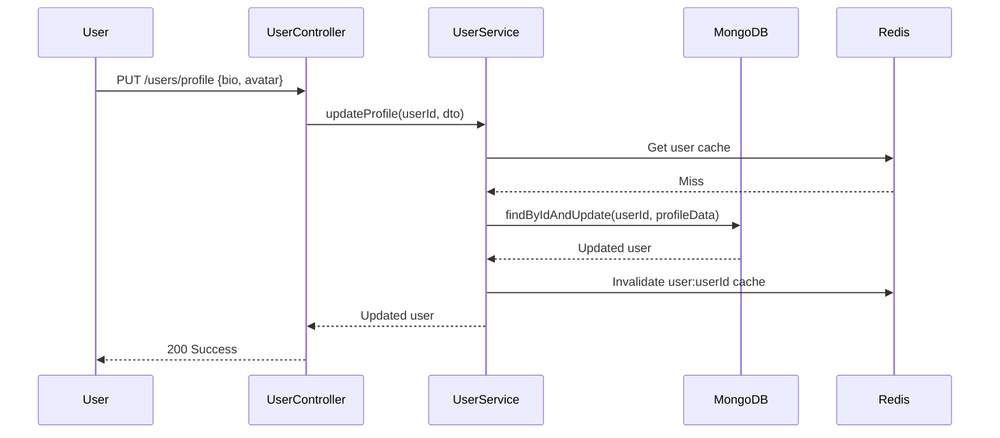

# 🏗️ USER MODULE - COMPLETE ARCHITECTURE GUIDE

**Version**: 1.0.0 (NestJS)  
**Last Updated**: 26-03-29  
**Level**: Senior/Mastery

---

## 📋 **TABLE OF CONTENTS**

1. [Module Overview](#module-overview)
2. [Module Structure](#module-structure)
3. [Architecture Patterns](#architecture-patterns)
4. [Dependency Injection Graph](#dependency-injection-graph)
5. [Data Flow](#data-flow)
6. [API Endpoints](#api-endpoints)
7. [Database Schemas](#database-schemas)
8. [DTOs & Validation](#dtos--validation)
9. [Caching Strategy](#caching-strategy)
10. [Error Handling](#error-handling)
11. [Security](#security)
12. [Integration Points](#integration-points)

---

## 🎯 **MODULE OVERVIEW**

### **Purpose**
The User module manages all user-related operations including:
- User profile management
- User profiles with extended data
- Device registration for push notifications
- OAuth account linking (Google, Apple)
- User role data management

### **Sub-Modules**
1. **User** - Core user management
2. **UserProfile** - Extended profile data
3. **UserDevices** - Push notification devices
4. **OAuthAccount** - OAuth provider accounts
5. **UserRoleData** - Role-specific data

### **Business Value**
- 👤 **User Management**: Complete CRUD operations
- 📱 **Multi-Device**: Track user devices for notifications
- 🔗 **OAuth**: Link multiple OAuth providers
- 📊 **Extended Profiles**: Separate profile data from auth

---

## 📁 **MODULE STRUCTURE**

```
src/modules/user.module/
├── user.module.ts                         # Parent module
├── user/
│   ├── user.controller.ts                 # 6 endpoints
│   ├── user.service.ts                    # User business logic
│   ├── user.schema.ts                     # User schema
│   └── dto/
│       ├── update-user.dto.ts
│       └── update-profile.dto.ts
├── userProfile/
│   ├── userProfile.controller.ts          # 4 endpoints
│   ├── userProfile.service.ts
│   ├── userProfile.schema.ts
│   └── dto/
│       └── update-userProfile.dto.ts
├── userDevices/
│   ├── userDevices.controller.ts          # 4 endpoints
│   ├── userDevices.service.ts
│   ├── userDevices.schema.ts
│   └── dto/
│       └── register-device.dto.ts
├── oauthAccount/
│   ├── oauthAccount.controller.ts         # 3 endpoints
│   ├── oauthAccount.service.ts
│   ├── oauthAccount.schema.ts
│   └── dto/
│       ├── create-oauthAccount.dto.ts
│       └── update-oauthAccount.dto.ts
└── userRoleData/
    ├── userRoleData.controller.ts         # 3 endpoints
    ├── userRoleData.service.ts
    ├── userRoleData.schema.ts
    └── dto/
        ├── create-userRoleData.dto.ts
        └── update-userRoleData.dto.ts
```

---

## 🏛️ **ARCHITECTURE PATTERNS**

### **1. Separation of Concerns**
```typescript
// User (Auth-related)
@Schema()
export class User {
  email: string;        // Auth
  password: string;     // Auth
  role: string;         // Auth
  stripe_customer_id: string; // Payment
}

// UserProfile (Profile data)
@Schema()
export class UserProfile {
  bio: string;          // Profile
  avatar: string;       // Profile
  phoneNumber: string;  // Profile
  preferences: object;  // Profile
}
```

**Why**: Separates auth data from profile data for better security and scalability

---

### **2. Virtual Populate**
```typescript
// User schema virtuals
UserSchema.virtual('profile', {
  ref: 'UserProfile',
  localField: 'profileId',
  foreignField: 'userId',
  justOne: true,
});

// Usage
const user = await UserModel.findById(id).populate('profile').exec();
console.log(user.profile.bio); // Access profile data
```

**Why**: Denormalized reads, normalized writes

---

### **3. Device Management Pattern**
```typescript
// One user, multiple devices
@Schema()
export class UserDevice {
  @Prop({ type: Schema.Types.ObjectId, ref: 'User' })
  userId: Types.ObjectId;

  @Prop({ enum: ['ios', 'android', 'web'] })
  platform: string;

  @Prop()
  fcmToken: string;

  @Prop()
  lastActiveAt: Date;
}
```

**Why**: Users can have multiple devices, each tracked separately

---

## 🔗 **DEPENDENCY INJECTION GRAPH**

```
UserModule
├── UserService
│   ├── @InjectModel(User.name) → UserModel
│   ├── CACHE_MANAGER → cache-manager
│   └── Logger → @nestjs/common
├── UserProfileService
│   ├── @InjectModel(UserProfile.name) → UserProfileModel
│   └── @InjectModel(User.name) → UserModel
├── UserDevicesService
│   ├── @InjectModel(UserDevice.name) → UserDeviceModel
│   └── @InjectModel(User.name) → UserModel
├── OAuthAccountService
│   ├── @InjectModel(OAuthAccount.name) → OAuthAccountModel
│   └── @InjectModel(User.name) → UserModel
└── UserRoleDataService
    ├── @InjectModel(UserRoleData.name) → UserRoleDataModel
    └── @InjectModel(User.name) → UserModel
```

---

## 🔄 **DATA FLOW**

### **Update User Profile Flow**


---

## 📡 **API ENDPOINTS**

### **User** (6 endpoints)

| Method | Endpoint | Auth | Role | Description |
|--------|----------|------|------|-------------|
| `GET` | `/users/me` | ✅ | Any | Get current user |
| `PUT` | `/users/me` | ✅ | Any | Update current user |
| `PUT` | `/users/me/password` | ✅ | Any | Change password |
| `DELETE` | `/users/me` | ✅ | Any | Delete account |
| `GET` | `/users/:id` | ✅ | Admin | Get user by ID |
| `PUT` | `/users/:id/role` | ✅ | Admin | Update user role |

### **UserProfile** (4 endpoints)

| Method | Endpoint | Auth | Role | Description |
|--------|----------|------|------|-------------|
| `GET` | `/users/profile/me` | ✅ | Any | Get my profile |
| `PUT` | `/users/profile/me` | ✅ | Any | Update my profile |
| `GET` | `/users/profile/:userId` | ✅ | Admin | Get user profile |
| `PUT` | `/users/profile/:userId` | ✅ | Admin | Update user profile |

### **UserDevices** (4 endpoints)

| Method | Endpoint | Auth | Role | Description |
|--------|----------|------|------|-------------|
| `POST` | `/users/devices` | ✅ | Any | Register device |
| `GET` | `/users/devices` | ✅ | Any | Get my devices |
| `DELETE` | `/users/devices/:id` | ✅ | Any | Remove device |
| `PUT` | `/users/devices/:id/active` | ✅ | Any | Update last active |

### **OAuthAccount** (3 endpoints)

| Method | Endpoint | Auth | Role | Description |
|--------|----------|------|------|-------------|
| `POST` | `/users/oauth/link` | ✅ | Any | Link OAuth account |
| `GET` | `/users/oauth/linked` | ✅ | Any | Get linked accounts |
| `DELETE` | `/users/oauth/:provider` | ✅ | Any | Unlink OAuth account |

### **UserRoleData** (3 endpoints)

| Method | Endpoint | Auth | Role | Description |
|--------|----------|------|------|-------------|
| `POST` | `/users/role-data` | ✅ | Admin | Create role data |
| `GET` | `/users/role-data/:userId` | ✅ | Admin | Get role data |
| `PUT` | `/users/role-data/:userId` | ✅ | Admin | Update role data |

---

## 🗄️ **DATABASE SCHEMAS**

### **User Schema**
```typescript
@Schema({ timestamps: true })
export class User {
  @Prop({ required: true })
  name: string;

  @Prop({ required: true, unique: true, lowercase: true })
  email: string;

  @Prop({ required: true, select: false })
  password: string;

  @Prop({ enum: ['user', 'admin', 'subAdmin', 'child', 'business'], default: 'user' })
  role: string;

  @Prop()
  profileId?: Types.ObjectId;

  @Prop({ default: false })
  isEmailVerified: boolean;

  @Prop()
  stripe_customer_id?: string;

  @Prop()
  revenueCatUserId?: string;

  @Prop({ enum: ['none', 'individual', 'business'], default: 'none' })
  subscriptionType: string;

  @Prop({ default: false })
  hasUsedFreeTrial: boolean;

  @Prop({ default: false })
  isDeleted: boolean;
}

// Indexes
UserSchema.index({ email: 1, isDeleted: 1 });
UserSchema.index({ role: 1, isDeleted: 1 });
UserSchema.index({ stripe_customer_id: 1, isDeleted: 1 });
```

### **UserProfile Schema**
```typescript
@Schema({ timestamps: true })
export class UserProfile {
  @Prop({ type: Schema.Types.ObjectId, ref: 'User', unique: true })
  userId: Types.ObjectId;

  @Prop()
  bio?: string;

  @Prop()
  avatar?: {
    publicId: string;
    imageUrl: string;
  };

  @Prop()
  phoneNumber?: string;

  @Prop()
  dateOfBirth?: Date;

  @Prop({ type: Object })
  preferences?: {
    language?: string;
    timezone?: string;
    notifications?: boolean;
  };

  @Prop({ default: false })
  isDeleted: boolean;
}

// Indexes
UserProfileSchema.index({ userId: 1, isDeleted: 1 });
```

### **UserDevice Schema**
```typescript
@Schema({ timestamps: true })
export class UserDevice {
  @Prop({ type: Schema.Types.ObjectId, ref: 'User', index: true })
  userId: Types.ObjectId;

  @Prop({ enum: ['ios', 'android', 'web'], required: true })
  platform: string;

  @Prop({ required: true })
  fcmToken: string;

  @Prop()
  lastActiveAt: Date;

  @Prop({ default: false })
  isDeleted: boolean;
}

// Indexes
UserDeviceSchema.index({ userId: 1, platform: 1, isDeleted: 1 });
UserDeviceSchema.index({ fcmToken: 1, isDeleted: 1 });
```

---

## 📝 **DTOS & VALIDATION**

### **UpdateUserDto**
```typescript
export class UpdateUserDto {
  @ApiPropertyOptional({ example: 'John Doe' })
  @IsOptional()
  @IsString()
  @MinLength(2)
  @MaxLength(50)
  name?: string;

  @ApiPropertyOptional({ example: 'user@example.com' })
  @IsOptional()
  @IsEmail()
  email?: string;

  @ApiPropertyOptional({ example: '+1234567890' })
  @IsOptional()
  @IsString()
  phoneNumber?: string;
}
```

### **RegisterDeviceDto**
```typescript
export class RegisterDeviceDto {
  @ApiProperty({ enum: ['ios', 'android', 'web'] })
  @IsNotEmpty()
  @IsEnum(['ios', 'android', 'web'])
  platform: string;

  @ApiProperty({ example: 'fcm_token_123' })
  @IsNotEmpty()
  @IsString()
  fcmToken: string;
}
```

---

## 🚀 **CACHING STRATEGY**

### **Cache Keys**
```typescript
const cacheKeys = {
  user: (userId: string) => `user:${userId}`,
  profile: (userId: string) => `user:profile:${userId}`,
  devices: (userId: string) => `user:devices:${userId}`,
};
```

### **Cache TTLs**
```typescript
const cacheTTL = {
  user: 300,        // 5 minutes
  profile: 600,     // 10 minutes
  devices: 300,     // 5 minutes
};
```

### **Cache Invalidation**
```typescript
async updateUser(userId: string, updateDto: UpdateUserDto) {
  const user = await this.userModel.findByIdAndUpdate(
    userId,
    updateDto,
    { new: true },
  );

  // Invalidate cache
  await this.cacheManager.del(`user:${userId}`);
  
  return user;
}
```

---

## ⚠️ **ERROR HANDLING**

### **User-Specific Exceptions**
```typescript
export class UserNotFoundException extends NotFoundException {
  constructor(userId: string) {
    super({
      success: false,
      message: `User not found: ${userId}`,
    });
  }
}

export class EmailAlreadyExistsException extends ConflictException {
  constructor(email: string) {
    super({
      success: false,
      message: `Email already exists: ${email}`,
    });
  }
}

export class OAuthAccountAlreadyLinkedException extends ConflictException {
  constructor(provider: string) {
    super({
      success: false,
      message: `OAuth account already linked: ${provider}`,
    });
  }
}
```

---

## 🔐 **SECURITY**

### **Password Handling**
```typescript
// Always exclude password from responses
@Prop({ select: false })
password: string;

// In service
async findById(id: string) {
  return this.userModel.findById(id).select('-password').exec();
}
```

### **Sensitive Data Exclusion**
```typescript
// In controller
@Get('me')
async getMe(@User() user: any) {
  const userData = await this.userService.findById(user.userId);
  
  // Exclude sensitive fields
  const safeData = omit(userData, ['password', 'stripe_customer_id', 'refreshToken']);
  
  return { success: true, data: safeData };
}
```

---

## 🔗 **INTEGRATION POINTS**

### **With Auth Module**
```typescript
// Auth creates user, User manages profile
async register(registerDto: RegisterDto) {
  const user = await this.userModel.create({
    email: registerDto.email,
    password: hashedPassword,
    role: 'user',
  });

  // Emit event for profile creation
  this.eventEmitter.emit('user.created', { userId: user._id });
}
```

### **With Notification Module**
```typescript
// Register device for push notifications
async registerDevice(userId: string, dto: RegisterDeviceDto) {
  await this.userDeviceModel.create({
    userId,
    platform: dto.platform,
    fcmToken: dto.fcmToken,
  });

  // Now user can receive push notifications
}
```

### **With Payment Module**
```typescript
// Update Stripe customer ID
async updateStripeCustomer(userId: string, customerId: string) {
  await this.userModel.findByIdAndUpdate(userId, {
    $set: { stripe_customer_id: customerId },
  });
}
```

---

## 📚 **KEY TAKEAWAYS**

1. **Separation of Concerns** - User vs UserProfile
2. **Virtual Populate** - Link related documents
3. **Device Management** - One user, multiple devices
4. **Caching** - User data cached for performance
5. **Security** - Passwords excluded, sensitive data protected
6. **DI** - All dependencies injected
7. **Events** - Emit events for cross-module actions

---

**Next**: Task Module (most complex data modeling)

---
-26-03-29
