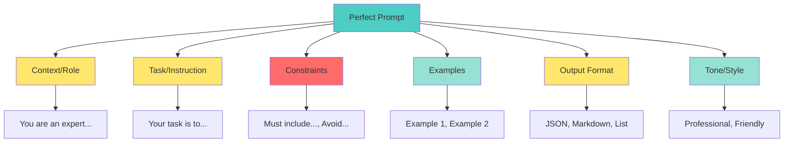
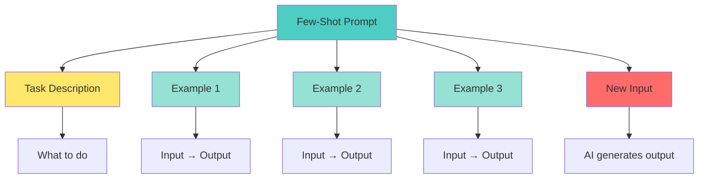

# 📘 **NODEJS AI DEVELOPER MASTERY - Lesson 2: Prompt Engineering Mastery**

**Date**: 26-03-18
**Level**: 🟢 Beginner → 🔴 Senior Engineer
**Series**: AI Developer Fundamentals
**Time**: 60 minutes
**Prerequisites**: Lesson 1 (OpenAI SDK & Foundations)

---

## 🎯 **LEARNING OBJECTIVES**

After completing this **comprehensive** lesson, you will:

1. ✅ **Master Prompt Fundamentals** - Structure, components, best practices
2. ✅ **Learn Zero-Shot Prompting** - Direct instructions without examples
3. ✅ **Master Few-Shot Prompting** - Teaching with examples
4. ✅ **Implement Chain-of-Thought** - Step-by-step reasoning
5. ✅ **Create Prompt Templates** - Reusable, parameterized prompts
6. ✅ **Advanced Patterns** - Role-playing, constraints, formatting
7. ✅ **Production Prompt Management** - Versioning, testing, optimization

---

## 📦 **PART 1: PROMPT FUNDAMENTALS**

### **Anatomy of a Perfect Prompt**



**Complete Prompt Structure**:
```typescript
const perfectPrompt = `
┌─────────────────────────────────────────────
│ CONTEXT / ROLE
├─────────────────────────────────────────────
│ You are an expert TypeScript developer
│ with 10 years of experience in NestJS and
│ Node.js backend development.
└─────────────────────────────────────────────

┌─────────────────────────────────────────────
│ TASK / INSTRUCTION
├─────────────────────────────────────────────
│ Your task is to review the following code
│ and identify potential security issues,
│ performance bottlenecks, and suggest
│ improvements.
└─────────────────────────────────────────────

┌─────────────────────────────────────────────
│ CONSTRAINTS
├─────────────────────────────────────────────
│ - Focus only on security and performance
│ - Do not comment on code style
│ - Keep suggestions actionable
│ - Maximum 5 recommendations
└─────────────────────────────────────────────

┌─────────────────────────────────────────────
│ OUTPUT FORMAT
├─────────────────────────────────────────────
│ Provide your response in the following format:
│ 1. Issue Type (Security/Performance)
│ 2. Location (File:Line)
│ 3. Problem Description
│ 4. Suggested Fix
│ 5. Priority (High/Medium/Low)
└─────────────────────────────────────────────

┌─────────────────────────────────────────────
│ TONE / STYLE
├─────────────────────────────────────────────
│ Professional, concise, and technical.
│ Assume the reader is a senior developer.
└─────────────────────────────────────────────

[CODE TO REVIEW]
${code}
`;
```

---

### **Prompt Quality Comparison**

```typescript
// ─────────────────────────────────────────────
// ❌ BAD: Vague Prompt
// ─────────────────────────────────────────────
const badPrompt = `
Write a function to sort an array.
`;

// AI Response: Generic, might not match your needs
// - What language?
// - What sorting algorithm?
// - Any performance requirements?
// - Edge cases to handle?

// ─────────────────────────────────────────────
// ✅ GOOD: Specific Prompt
// ─────────────────────────────────────────────
const goodPrompt = `
You are a senior JavaScript developer.

Task: Write a function to sort an array of numbers in ascending order.

Requirements:
- Use TypeScript
- Implement quicksort algorithm
- Handle edge cases: empty array, single element, already sorted
- Include JSDoc comments
- Add input validation (must be array of numbers)
- Time complexity: O(n log n) average case

Output Format:
1. Function implementation
2. Usage examples
3. Test cases

Constraints:
- Do not use built-in sort() method
- Must be iterative (no recursion)
- Maximum 50 lines of code
`;

// AI Response: Targeted, meets specific requirements
```

---

## 📦 **PART 2: ZERO-SHOT PROMPTING**

### **Direct Instructions (No Examples)**

```typescript
// ─────────────────────────────────────────────
// Pattern 1: Simple Task
// ─────────────────────────────────────────────
const simpleTask = `
Convert the following text to title case:

Text: "the quick brown fox jumps over the lazy dog"
`;

// ─────────────────────────────────────────────
// Pattern 2: Role Assignment
// ─────────────────────────────────────────────
const roleAssignment = `
You are a professional email copywriter with 15 years of experience.

Write a cold outreach email for a SaaS product that helps developers
automate their testing workflow.

Target audience: Senior engineering managers at tech companies.
Goal: Schedule a 15-minute demo call.
Tone: Professional but friendly, not salesy.
Length: 150-200 words.
`;

// ─────────────────────────────────────────────
// Pattern 3: Step-by-Step Instructions
// ─────────────────────────────────────────────
const stepByStep = `
Follow these steps to analyze the sentiment of the given text:

Step 1: Read the text carefully and identify emotional keywords.
Step 2: Determine if the overall tone is positive, negative, or neutral.
Step 3: Look for any sarcasm or irony that might flip the sentiment.
Step 4: Assign a sentiment score from -1 (very negative) to +1 (very positive).
Step 5: Provide a brief explanation of your reasoning.

Text: "The product works fine, I guess. Not like I had any other options."

Provide your analysis in this format:
- Emotional Keywords: [list]
- Overall Tone: [positive/negative/neutral]
- Sarcasm Detected: [yes/no]
- Sentiment Score: [number]
- Explanation: [2-3 sentences]
`;

// ─────────────────────────────────────────────
// Pattern 4: Constraint-Based
// ─────────────────────────────────────────────
const constraintBased = `
Explain quantum computing to a 10-year-old.

Constraints:
- Use simple analogies (no technical jargon)
- Maximum 100 words
- Include at least one comparison to everyday objects
- End with a thought-provoking question
- Do NOT use words: superposition, entanglement, qubit
`;

// ─────────────────────────────────────────────
// Pattern 5: Comparative Analysis
// ─────────────────────────────────────────────
const comparative = `
Compare REST and GraphQL for building a social media API.

Provide your analysis in a table with these columns:
| Aspect | REST | GraphQL | Winner |
|--------|------|---------|--------|

Aspects to compare:
1. Number of requests needed
2. Over-fetching/under-fetching
3. Caching
4. Learning curve
5. Tooling ecosystem
6. Real-time subscriptions

After the table, provide a recommendation for:
- A startup building an MVP
- An enterprise with existing REST APIs
- A real-time chat application
`;
```

---

## 📦 **PART 3: FEW-SHOT PROMPTING**

### **Teaching with Examples**



### **Few-Shot Patterns**

```typescript
// ─────────────────────────────────────────────
// Pattern 1: Classification with Examples
// ─────────────────────────────────────────────
const classificationFewShot = `
Classify the following customer messages into categories:
[Billing], [Technical Support], [Feature Request], [Complaint]

Examples:

Message: "I was charged twice for my subscription!"
Category: [Billing]

Message: "The app crashes every time I try to upload a photo."
Category: [Technical Support]

Message: "It would be great if you could add dark mode."
Category: [Feature Request]

Message: "This is the worst service I've ever experienced."
Category: [Complaint]

Now classify this message:

Message: "Your API documentation is confusing and incomplete."
Category:
`;

// ─────────────────────────────────────────────
// Pattern 2: Transformation with Examples
// ─────────────────────────────────────────────
const transformationFewShot = `
Convert natural language requests into SQL queries.

Examples:

Request: "Show me all users who signed up last month"
SQL: SELECT * FROM users WHERE created_at >= DATE_SUB(CURDATE(), INTERVAL 1 MONTH);

Request: "Find the top 5 products by revenue"
SQL: SELECT product_id, SUM(price * quantity) as revenue FROM orders GROUP BY product_id ORDER BY revenue DESC LIMIT 5;

Request: "Count how many orders each customer has placed"
SQL: SELECT customer_id, COUNT(*) as order_count FROM orders GROUP BY customer_id;

Now convert this request:

Request: "List all products that have never been ordered"
SQL:
`;

// ─────────────────────────────────────────────
// Pattern 3: Reasoning with Examples
// ─────────────────────────────────────────────
const reasoningFewShot = `
Determine if the following argument is logically valid.

Example 1:
Premise 1: All humans are mortal.
Premise 2: Socrates is a human.
Conclusion: Therefore, Socrates is mortal.
Valid: Yes
Reasoning: This is a classic syllogism. If both premises are true, the conclusion must be true.

Example 2:
Premise 1: If it rains, the ground gets wet.
Premise 2: The ground is wet.
Conclusion: Therefore, it rained.
Valid: No
Reasoning: This is the fallacy of affirming the consequent. The ground could be wet for other reasons.

Example 3:
Premise 1: All birds can fly.
Premise 2: Penguins are birds.
Conclusion: Therefore, penguins can fly.
Valid: Yes (but unsound)
Reasoning: The logic is valid (follows from premises), but Premise 1 is factually false.

Now analyze this argument:

Premise 1: All successful programmers practice daily.
Premise 2: John practices daily.
Conclusion: Therefore, John is a successful programmer.
Valid:
Reasoning:
`;

// ─────────────────────────────────────────────
// Pattern 4: Creative Writing with Examples
// ─────────────────────────────────────────────
const creativeFewShot = `
Write product taglines based on the brand voice.

Brand: Nike
Voice: Inspirational, bold, athletic
Product: Running shoes
Tagline: "Unleash Your Speed"

Brand: Apple
Voice: Minimalist, innovative, premium
Product: Wireless earbuds
Tagline: "Sound. Redefined."

Brand: Dollar Shave Club
Voice: Witty, casual, irreverent
Product: Shaving cream
Tagline: "Smooth Moves, Dumb Prices"

Now write a tagline for:

Brand: Tesla
Voice: Futuristic, sustainable, luxury
Product: Home solar battery
Tagline:
`;

// ─────────────────────────────────────────────
// Pattern 5: Code Generation with Examples
// ─────────────────────────────────────────────
const codeGenerationFewShot = `
Generate TypeScript functions based on the description.

Description: Check if a string is a palindrome
Function:
function isPalindrome(str: string): boolean {
  const cleaned = str.toLowerCase().replace(/[^a-z0-9]/g, '');
  return cleaned === cleaned.split('').reverse().join('');
}

Description: Calculate the factorial of a number
Function:
function factorial(n: number): number {
  if (n <= 1) return 1;
  return n * factorial(n - 1);
}

Description: Find the first non-repeating character in a string
Function:
`;
```

---

## 📦 **PART 4: CHAIN-OF-THOUGHT PROMPTING**

### **Step-by-Step Reasoning**

```typescript
// ─────────────────────────────────────────────
// Pattern 1: Explicit Step-by-Step
// ─────────────────────────────────────────────
const chainOfThought = `
A bat and a ball cost $1.10 in total.
The bat costs $1.00 more than the ball.
How much does the ball cost?

Let's think through this step by step:

Step 1: Define variables
- Let x = cost of the ball
- Then x + 1.00 = cost of the bat

Step 2: Set up the equation
- Ball + Bat = Total
- x + (x + 1.00) = 1.10

Step 3: Solve the equation
- 2x + 1.00 = 1.10
- 2x = 0.10
- x = 0.05

Step 4: Verify
- Ball = $0.05
- Bat = $0.05 + $1.00 = $1.05
- Total = $0.05 + $1.05 = $1.10 ✓

Answer: The ball costs $0.05.

---

Now solve this problem:

In a lake, there is a patch of lily pads.
Every day, the patch doubles in size.
If it takes 48 days for the patch to cover the entire lake,
how long would it take for the patch to cover half of the lake?

Think through this step by step:
`;

// ─────────────────────────────────────────────
// Pattern 2: Self-Correction
// ─────────────────────────────────────────────
const selfCorrection = `
You are solving a complex problem. Follow this process:

1. FIRST PASS: Provide your initial solution
2. REVIEW: Check your work for errors
3. CORRECTION: Fix any mistakes you find
4. FINAL: Present the corrected answer

Problem:
John needs to paint a room with 4 walls.
Each wall is 10 feet wide and 8 feet tall.
There are 2 windows (3ft x 4ft each) and 1 door (3ft x 7ft).
One gallon of paint covers 350 square feet.
How many gallons of paint does John need?

Solve this step by step, showing your work and checking for errors.
`;

// ─────────────────────────────────────────────
// Pattern 3: Multi-Perspective Analysis
// ─────────────────────────────────────────────
const multiPerspective = `
Analyze the decision: "Should our company adopt a 4-day work week?"

Consider each perspective:

1. EMPLOYEE PERSPECTIVE:
   - Work-life balance
   - Productivity impact
   - Stress levels

2. EMPLOYER PERSPECTIVE:
   - Operational costs
   - Customer coverage
   - Recruitment/retention

3. CUSTOMER PERSPECTIVE:
   - Service availability
   - Response times
   - Quality of service

4. BUSINESS METRICS:
   - Revenue impact
   - Productivity changes
   - Employee turnover

After analyzing all perspectives, provide a recommendation with specific implementation suggestions.
`;

// ─────────────────────────────────────────────
// Pattern 4: Decomposition
// ─────────────────────────────────────────────
const decomposition = `
Break down the following complex task into smaller, manageable steps:

Task: "Build a real-time chat application with user authentication, message encryption, and file sharing"

Decompose into:
1. High-level components (Frontend, Backend, Database, Infrastructure)
2. For each component, list sub-components
3. For each sub-component, list specific tasks
4. Identify dependencies between tasks
5. Suggest an implementation order

Format your response as a hierarchical list with clear priorities.
`;
```

---

## 📦 **PART 5: PROMPT TEMPLATES**

### **Reusable Template System**

```typescript
// ─────────────────────────────────────────────
// Template Engine Interface
// ─────────────────────────────────────────────
interface PromptTemplate {
  name: string;
  version: string;
  template: string;
  variables: string[];
  defaults?: Record<string, string>;
}

// ─────────────────────────────────────────────
// Template Registry
// ─────────────────────────────────────────────
class PromptTemplateRegistry {
  private templates: Map<string, PromptTemplate> = new Map();

  register(template: PromptTemplate): void {
    const key = `${template.name}@${template.version}`;
    this.templates.set(key, template);
  }

  get(name: string, version: string = 'latest'): PromptTemplate | undefined {
    if (version === 'latest') {
      // Find highest version
      const matching = Array.from(this.templates.keys())
        .filter(k => k.startsWith(`${name}@`))
        .sort();
      return matching.length > 0
        ? this.templates.get(matching[matching.length - 1])
        : undefined;
    }
    return this.templates.get(`${name}@${version}`);
  }

  render(name: string, variables: Record<string, string>): string {
    const template = this.get(name);
    if (!template) {
      throw new Error(`Template "${name}" not found`);
    }

    let rendered = template.template;

    // Replace variables
    for (const [key, value] of Object.entries(variables)) {
      rendered = rendered.replace(new RegExp(`\\{\\{${key}\\}\\}`, 'g'), value);
    }

    // Apply defaults for missing variables
    if (template.defaults) {
      for (const [key, value] of Object.entries(template.defaults)) {
        rendered = rendered.replace(new RegExp(`\\{\\{${key}\\}\\}`, 'g'), value);
      }
    }

    return rendered;
  }
}

// ─────────────────────────────────────────────
// Pre-built Templates
// ─────────────────────────────────────────────
const registry = new PromptTemplateRegistry();

// Template 1: Code Review
registry.register({
  name: 'code-review',
  version: '1.0.0',
  template: `
You are a senior {{language}} developer conducting a code review.

CONTEXT:
{{context}}

CODE TO REVIEW:
\`\`\`{{language}}
{{code}}
\`\`\`

REVIEW CRITERIA:
1. Security vulnerabilities
2. Performance issues
3. Code quality and maintainability
4. Best practices adherence
5. Edge case handling

CONSTRAINTS:
- Focus on {{focus_areas}}
- Do not comment on: {{ignore_areas}}
- Maximum {{max_comments}} comments
- Be constructive and specific

OUTPUT FORMAT:
For each issue found:
- **Severity**: [Critical/High/Medium/Low]
- **Location**: Line X
- **Issue**: Description
- **Suggestion**: Specific fix
- **Code Example**: (if applicable)

Start your review with a brief summary, then list issues by severity.
`,
  variables: ['language', 'context', 'code', 'focus_areas', 'ignore_areas', 'max_comments'],
  defaults: {
    language: 'TypeScript',
    focus_areas: 'security, performance, correctness',
    ignore_areas: 'style, formatting',
    max_comments: '10',
  },
});

// Template 2: Technical Explanation
registry.register({
  name: 'technical-explanation',
  version: '1.0.0',
  template: `
You are an expert teacher explaining technical concepts.

CONCEPT TO EXPLAIN: {{concept}}

TARGET AUDIENCE: {{audience}}
- Knowledge level: {{knowledge_level}}
- Background: {{background}}

EXPLANATION REQUIREMENTS:
1. Start with a high-level overview (2-3 sentences)
2. Use an analogy to make it relatable
3. Break down the concept into {{num_parts}} key parts
4. Provide a concrete example
5. Address common misconceptions

CONSTRAINTS:
- Avoid jargon where possible
- Define technical terms when first used
- Use formatting (bold, lists, code blocks) for clarity
- Keep total length under {{max_words}} words

TONE: {{tone}}

Begin your explanation now.
`,
  variables: ['concept', 'audience', 'knowledge_level', 'background', 'num_parts', 'max_words', 'tone'],
  defaults: {
    knowledge_level: 'beginner',
    num_parts: '3',
    max_words: '500',
    tone: 'friendly and encouraging',
  },
});

// Template 3: Data Extraction
registry.register({
  name: 'data-extraction',
  version: '1.0.0',
  template: `
Extract structured data from the following text.

TEXT:
{{text}}

FIELDS TO EXTRACT:
{{fields}}

OUTPUT FORMAT:
Return a valid JSON object with the extracted fields.
If a field cannot be determined, use null.

JSON Schema:
{{schema}}

CONSTRAINTS:
- Do not add fields not in the schema
- Preserve date formats as specified
- Normalize values (e.g., phone numbers, currencies)
- Handle missing information gracefully

Return ONLY the JSON object, no additional text.
`,
  variables: ['text', 'fields', 'schema'],
});

// Template 4: Bug Investigation
registry.register({
  name: 'bug-investigation',
  version: '1.0.0',
  template: `
You are a senior debugging specialist investigating a bug.

BUG REPORT:
{{bug_report}}

ERROR MESSAGE:
{{error_message}}

RELEVANT CODE:
\`\`\`{{language}}
{{code}}
\`\`\`

STACK TRACE:
{{stack_trace}}

INVESTIGATION PROCESS:
1. Analyze the error message and stack trace
2. Identify the root cause
3. List potential contributing factors
4. Suggest fixes with code examples
5. Recommend preventive measures

OUTPUT FORMAT:
- **Root Cause**: Clear explanation
- **Contributing Factors**: List
- **Fix**: Code changes needed
- **Prevention**: How to avoid similar bugs
- **Confidence Level**: High/Medium/Low

Think through this systematically.
`,
  variables: ['bug_report', 'error_message', 'code', 'stack_trace', 'language'],
  defaults: {
    language: 'JavaScript',
  },
});

// ─────────────────────────────────────────────
// Usage Examples
// ─────────────────────────────────────────────
const renderedPrompt = registry.render('code-review', {
  context: 'This is a user authentication service',
  code: `
async function login(email: string, password: string) {
  const user = await db.users.findOne({ email });
  if (user.password === password) {
    return generateToken(user);
  }
}
  `,
  focus_areas: 'security, authentication',
  ignore_areas: 'variable naming',
  max_comments: '5',
});
```

---

## 📦 **PART 6: ADVANCED PATTERNS**

### **Role-Playing & Personas**

```typescript
// ─────────────────────────────────────────────
// Pattern 1: Expert Persona
// ─────────────────────────────────────────────
const expertPersona = `
You are Dr. Sarah Chen, a renowned security researcher with:
- PhD in Cryptography from MIT
- 15 years experience in application security
- Author of "Modern Web Security"
- Speaker at Black Hat and DEF CON

Your personality:
- Meticulous and detail-oriented
- Skeptical by default
- Passionate about educating developers
- Direct but not rude

You are reviewing this authentication implementation:

[CODE HERE]

Provide your security assessment in your characteristic style.
`;

// ─────────────────────────────────────────────
// Pattern 2: Multiple Personas Discussion
// ─────────────────────────────────────────────
const multiplePersonas = `
Simulate a discussion between three experts about adopting microservices:

1. DR. JAMES WONG (Enterprise Architect)
   - 20 years experience
   - Focus: Scalability, maintainability
   - Perspective: Cautious, planning-oriented

2. MARIA GARCIA (Startup CTO)
   - Built 3 successful startups
   - Focus: Speed, agility, cost
   - Perspective: Pragmatic, results-driven

3. ALEX KUMAR (DevOps Lead)
   - Manages infrastructure for millions of users
   - Focus: Operations, monitoring, reliability
   - Perspective: Practical, tooling-focused

Topic: "Should a Series B startup (50 engineers) migrate from monolith to microservices?"

Show the discussion as a dialogue with each expert providing their perspective, asking questions, and responding to each other. End with their collective recommendation.
`;

// ─────────────────────────────────────────────
// Pattern 3: Socratic Method
// ─────────────────────────────────────────────
const socraticMethod = `
You are a Socratic teacher. Instead of providing direct answers, guide the student to discover the solution through questions.

Student's question: "Why is my async function returning undefined?"

Your approach:
1. Ask clarifying questions to understand their code
2. Guide them to identify the issue themselves
3. Use analogies to explain async concepts
4. Help them formulate the correct solution

Start by asking your first question.
`;
```

---

### **Constraint & Formatting Patterns**

```typescript
// ─────────────────────────────────────────────
// Pattern 1: Strict Output Format
// ─────────────────────────────────────────────
const strictFormat = `
Analyze the sentiment of the following text.

CONSTRAINTS:
- Output MUST be valid JSON
- Do NOT include any text outside the JSON
- Do NOT include comments in the JSON
- Use exact field names as specified

OUTPUT SCHEMA:
{
  "sentiment": "positive" | "negative" | "neutral",
  "confidence": number (0-1),
  "emotions": string[],
  "key_phrases": string[],
  "summary": string (max 50 words)
}

TEXT: "[INPUT TEXT]"

Respond with ONLY the JSON object:
`;

// ─────────────────────────────────────────────
// Pattern 2: Length Constraints
// ─────────────────────────────────────────────
const lengthConstraint = `
Summarize the article below.

CONSTRAINTS:
- Exactly 3 sentences
- Each sentence must be under 20 words
- Total word count: 40-60 words
- Include the main finding
- Mention the methodology
- State the implication

ARTICLE: [INPUT TEXT]
`;

// ─────────────────────────────────────────────
// Pattern 3: Vocabulary Constraints
// ─────────────────────────────────────────────
const vocabularyConstraint = `
Explain how blockchain works.

CONSTRAINTS:
- Use only the 1000 most common English words
- No technical jargon
- Define any complex ideas using simple analogies
- Target: 10-year-old reader

If you must use a technical term, immediately explain it in parentheses.
`;

// ─────────────────────────────────────────────
// Pattern 4: Structured Reasoning
// ─────────────────────────────────────────────
const structuredReasoning = `
Evaluate whether the company should remote-first or office-first.

STRUCTURE YOUR RESPONSE:

## Pros of Remote-First
[List 3-5 points]

## Cons of Remote-First
[List 3-5 points]

## Pros of Office-First
[List 3-5 points]

## Cons of Office-First
[List 3-5 points]

## Key Considerations
[Discuss: company culture, role types, team dynamics, costs]

## Recommendation
[Clear recommendation with 2-3 sentence justification]

## Implementation Steps
[3-5 actionable steps if following your recommendation]
`;
```

---

### **Meta-Prompting (Prompting about Prompting)**

```typescript
// ─────────────────────────────────────────────
// Pattern 1: Prompt Improvement
// ─────────────────────────────────────────────
const promptImprovement = `
I have the following prompt:

"[YOUR CURRENT PROMPT]"

Your task:
1. Identify weaknesses in this prompt
2. Suggest specific improvements
3. Rewrite the prompt incorporating improvements
4. Explain why each change was made

Focus on:
- Clarity of instructions
- Specificity of constraints
- Quality of examples (if any)
- Output format definition
- Potential ambiguities

Provide your analysis and improved version.
`;

// ─────────────────────────────────────────────
// Pattern 2: Prompt Generation
// ─────────────────────────────────────────────
const promptGeneration = `
I need to accomplish this task with an AI assistant:

GOAL: [Describe what you want to achieve]
CONTEXT: [Background information]
CONSTRAINTS: [Any limitations or requirements]

Generate an optimal prompt that will help me achieve this goal.
The prompt should include:
- Clear role/persona for the AI
- Specific task description
- Relevant context and background
- Constraints and requirements
- Desired output format
- Examples if helpful

Provide the prompt ready to copy-paste.
`;

// ─────────────────────────────────────────────
// Pattern 3: Prompt Debugging
// ─────────────────────────────────────────────
const promptDebugging = `
My prompt is not producing the expected results.

PROMPT USED:
"[YOUR PROMPT]"

EXPECTED OUTPUT:
[What you thought you'd get]

ACTUAL OUTPUT:
[What you actually got]

Analyze why the prompt failed to produce expected results.
Consider:
- Ambiguous instructions
- Missing context
- Insufficient examples
- Conflicting constraints
- Wrong tone/approach

Suggest specific fixes and provide a revised prompt.
`;
```

---

## 📦 **PART 7: PRODUCTION PROMPT MANAGEMENT**

### **Prompt Versioning System**

```typescript
// ─────────────────────────────────────────────
// Prompt Version Interface
// ─────────────────────────────────────────────
interface PromptVersion {
  id: string;
  name: string;
  version: string;
  template: string;
  variables: string[];
  metadata: {
    createdAt: Date;
    createdBy: string;
    description: string;
    tags: string[];
    performance?: {
      avgTokens: number;
      avgLatency: number;
      successRate: number;
    };
  };
}

// ─────────────────────────────────────────────
// Prompt Manager Service
// ─────────────────────────────────────────────
@Injectable()
export class PromptManagerService {
  private readonly logger = new Logger(PromptManagerService.name);
  private prompts: Map<string, PromptVersion[]> = new Map();

  // Register new prompt version
  register(prompt: PromptVersion): void {
    const key = prompt.name;
    const existing = this.prompts.get(key) || [];

    // Validate version is unique
    const exists = existing.some(p => p.version === prompt.version);
    if (exists) {
      throw new Error(
        `Prompt "${key}" version "${prompt.version}" already exists`,
      );
    }

    existing.push(prompt);
    this.prompts.set(key, existing);

    this.logger.log(
      `Registered prompt: ${key}@${prompt.version}`,
    );
  }

  // Get specific version or latest
  get(name: string, version?: string): PromptVersion | undefined {
    const versions = this.prompts.get(name);
    if (!versions) return undefined;

    if (!version) {
      // Return latest (highest version number)
      return versions.sort((a, b) =>
        b.version.localeCompare(a.version)
      )[0];
    }

    return versions.find(p => p.version === version);
  }

  // Render prompt with variables
  render(name: string, variables: Record<string, string>, version?: string): string {
    const prompt = this.get(name, version);
    if (!prompt) {
      throw new Error(`Prompt "${name}" not found`);
    }

    let rendered = prompt.template;
    for (const [key, value] of Object.entries(variables)) {
      rendered = rendered.replace(
        new RegExp(`\\{\\{${key}\\}\\}`, 'g'),
        value,
      );
    }

    return rendered;
  }

  // List all prompts
  list(): Array<{ name: string; versions: number }> {
    return Array.from(this.prompts.entries()).map(([name, versions]) => ({
      name,
      versions: versions.length,
    }));
  }

  // Get version history
  history(name: string): PromptVersion[] {
    return this.prompts.get(name)?.sort((a, b) =>
      b.version.localeCompare(a.version)
    ) || [];
  }
}
```

---

### **Prompt Testing Framework**

```typescript
// ─────────────────────────────────────────────
// Prompt Test Case
// ─────────────────────────────────────────────
interface PromptTestCase {
  name: string;
  input: Record<string, string>;
  expectedOutput?: any;
  assertions: Array<{
    type: 'contains' | 'notContains' | 'matches' | 'jsonValid' | 'length';
    value?: any;
    min?: number;
    max?: number;
  }>;
}

// ─────────────────────────────────────────────
// Prompt Test Runner
// ─────────────────────────────────────────────
@Injectable()
export class PromptTestRunner {
  constructor(
    private chatService: ChatService,
    private promptManager: PromptManagerService,
  ) {}

  async runTest(
    promptName: string,
    testCase: PromptTestCase,
    version?: string,
  ): Promise<{
    passed: boolean;
    output: string;
    results: Array<{ assertion: string; passed: boolean; reason?: string }>;
  }> {
    // Render prompt
    const rendered = this.promptManager.render(promptName, testCase.input, version);

    // Get AI response
    const output = await this.chatService.complete([
      { role: 'user', content: rendered },
    ]);

    // Run assertions
    const results = testCase.assertions.map(assertion => {
      try {
        switch (assertion.type) {
          case 'contains':
            return {
              assertion: assertion.type,
              passed: output.includes(assertion.value),
            };

          case 'notContains':
            return {
              assertion: assertion.type,
              passed: !output.includes(assertion.value),
            };

          case 'matches':
            return {
              assertion: assertion.type,
              passed: new RegExp(assertion.value).test(output),
            };

          case 'jsonValid':
            try {
              JSON.parse(output);
              return { assertion: assertion.type, passed: true };
            } catch {
              return { assertion: assertion.type, passed: false };
            }

          case 'length':
            const length = output.length;
            return {
              assertion: assertion.type,
              passed:
                (!assertion.min || length >= assertion.min) &&
                (!assertion.max || length <= assertion.max),
            };
        }
      } catch (error) {
        return {
          assertion: assertion.type,
          passed: false,
          reason: error.message,
        };
      }
    });

    const passed = results.every(r => r.passed);

    return { passed, output, results };
  }

  async runAllTests(
    promptName: string,
    testCases: PromptTestCase[],
  ): Promise<{
    total: number;
    passed: number;
    failed: number;
    results: any[];
  }> {
    const results = await Promise.all(
      testCases.map(tc => this.runTest(promptName, tc)),
    );

    return {
      total: testCases.length,
      passed: results.filter(r => r.passed).length,
      failed: results.filter(r => !r.passed).length,
      results,
    };
  }
}

// ─────────────────────────────────────────────
// Example Test Suite
// ─────────────────────────────────────────────
const testCases: PromptTestCase[] = [
  {
    name: 'Code review - security focus',
    input: {
      language: 'TypeScript',
      code: `function login(email, password) { return db.find(email); }`,
      focus_areas: 'security',
    },
    assertions: [
      { type: 'contains', value: 'security' },
      { type: 'jsonValid' },
      { type: 'length', min: 50, max: 2000 },
    ],
  },
  {
    name: 'Code review - performance focus',
    input: {
      language: 'TypeScript',
      code: `const data = items.map(i => expensiveOp(i));`,
      focus_areas: 'performance',
    },
    assertions: [
      { type: 'contains', value: 'performance' },
      { type: 'notContains', value: 'undefined' },
    ],
  },
];
```

---

## ✅ **PROMPT ENGINEERING CHECKLIST**

```
Prompt Structure
[ ] Clear role/persona defined
[ ] Specific task description
[ ] Relevant context provided
[ ] Constraints explicitly stated
[ ] Output format specified
[ ] Tone/style indicated

Zero-Shot Techniques
[ ] Direct, unambiguous instructions
[ ] Step-by-step breakdown if complex
[ ] All necessary context included
[ ] Constraints prevent unwanted outputs

Few-Shot Techniques
[ ] Examples are representative
[ ] Examples cover edge cases
[ ] Input/output format consistent
[ ] Examples demonstrate desired quality

Chain-of-Thought
[ ] Explicit reasoning steps requested
[ ] Self-correction encouraged
[ ] Multi-perspective analysis when needed
[ ] Decomposition for complex tasks

Templates
[ ] Variables clearly marked
[ ] Defaults provided for optional vars
[ ] Template tested with various inputs
[ ] Version control implemented

Advanced Patterns
[ ] Role-playing enhances output
[ ] Constraints improve focus
[ ] Formatting requirements clear
[ ] Meta-prompting used for optimization

Testing & Validation
[ ] Test cases created
[ ] Edge cases covered
[ ] Output validated programmatically
[ ] Performance metrics tracked
```

---

## 🎯 **KNOWLEDGE CHECK**

### **Question 1: When to Use Few-Shot vs Zero-Shot?**

<details>
<summary>💡 Click to reveal answer</summary>

**Use Zero-Shot When**:
- ✅ Task is simple and straightforward
- ✅ AI model is known to handle this task well
- ✅ You need quick iteration
- ✅ Format is standard (summary, translation, etc.)

**Use Few-Shot When**:
- ✅ Task has specific format requirements
- ✅ You need consistent output style
- ✅ Task is complex or unusual
- ✅ Zero-shot results are inconsistent
- ✅ You need to teach a specific pattern
</details>

---

### **Question 2: Why Chain-of-Thought Works**

<details>
<summary>💡 Click to reveal answer</summary>

**Benefits of Chain-of-Thought**:
1. ✅ **Forces systematic thinking** - AI can't jump to conclusions
2. ✅ **Makes reasoning visible** - You can see where it goes wrong
3. ✅ **Reduces errors** - Step-by-step verification
4. ✅ **Better for math/logic** - Shows work like humans do
5. ✅ **Easier to debug** - Find exact step where reasoning fails

**Research shows**: CoT can improve accuracy by 20-40% on complex reasoning tasks!
</details>

---

### **Question 3: Common Prompt Mistakes**

<details>
<summary>💡 Click to reveal answer</summary>

**Common Mistakes**:
1. ❌ **Vague instructions** - "Make it better" vs "Improve readability by..."
2. ❌ **Missing context** - Not specifying audience, purpose, constraints
3. ❌ **No examples** - When format matters, show don't just tell
4. ❌ **Conflicting constraints** - "Be detailed" + "Keep it under 50 words"
5. ❌ **Assuming knowledge** - AI doesn't know your specific context
6. ❌ **No output format** - Getting inconsistent response formats
7. ❌ **Over-constraining** - Too many rules stifle creativity
</details>

---

## 📚 **ADDITIONAL RESOURCES**

- **OpenAI Prompt Engineering Guide**: [https://platform.openai.com/docs/guides/prompt-engineering](https://platform.openai.com/docs/guides/prompt-engineering)
- **Learn Prompting**: [https://learnprompting.org](https://learnprompting.org)
- **Prompt Engineering Institute**: [https://www.promptengineering.org](https://www.promptengineering.org)
- **Awesome Prompt Engineering**: [https://github.com/promptslab/Awesome-Prompt-Engineering](https://github.com/promptslab/Awesome-Prompt-Engineering)

---

## 🎓 **HOMEWORK**

1. ✅ Create 5 zero-shot prompts for different tasks
2. ✅ Build a few-shot prompt with 3 examples for a classification task
3. ✅ Implement chain-of-thought for a math/logic problem
4. ✅ Create a prompt template system with 3 templates
5. ✅ Test prompts with different variations and compare results
6. ✅ Build a prompt versioning system
7. ✅ Write test cases for your prompts
8. ✅ Document your best-performing prompts

---

**Next Lesson**: Streaming & Token Management - Real-time AI Responses and Cost Optimization
**Date**: 26-03-18
**Status**: ✅ Complete

---
*26-03-18*
