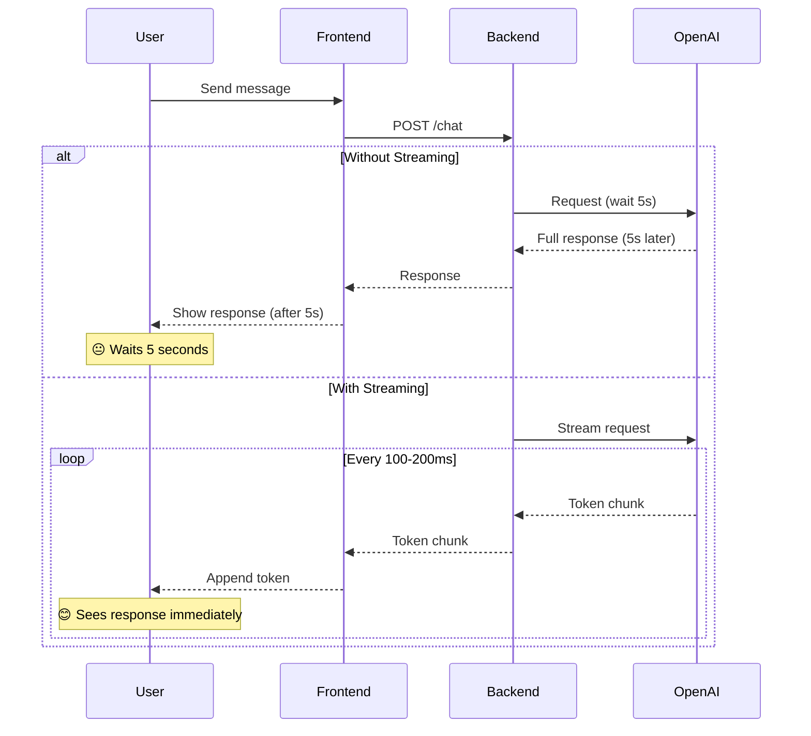
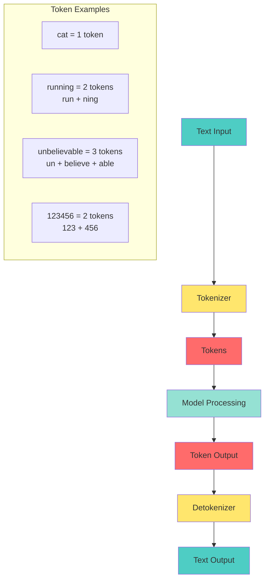

# 📘 **NODEJS AI DEVELOPER MASTERY - Lesson 3: Streaming & Token Management**

**Date**: 26-03-18
**Level**: 🟢 Beginner → 🔴 Senior Engineer
**Series**: AI Developer Fundamentals
**Time**: 50 minutes
**Prerequisites**: Lesson 1 (OpenAI SDK), Lesson 2 (Prompt Engineering)

---

## 🎯 **LEARNING OBJECTIVES**

After completing this **comprehensive** lesson, you will:

1. ✅ **Master Streaming Architecture** - Token-by-token streaming, SSE, WebSockets
2. ✅ **Understand Token Economics** - How tokens work, pricing, optimization
3. ✅ **Implement Token Counting** - Accurate estimation, cost calculation
4. ✅ **Learn Cost Optimization** - Reduce tokens, improve efficiency
5. ✅ **Build Streaming UIs** - Real-time responses, progressive rendering
6. ✅ **Handle Stream Errors** - Recovery, reconnection, partial results
7. ✅ **Production Streaming** - Backpressure, cancellation, monitoring

---

## 📦 **PART 1: STREAMING ARCHITECTURE**

### **Why Streaming Matters**



**Performance Comparison**:

| Metric | Without Streaming | With Streaming | Improvement |
|--------|------------------|----------------|-------------|
| **Time to First Token** | 3-5 seconds | 200-500ms | 10x faster |
| **Perceived Latency** | High (waiting) | Low (progressive) | Much better UX |
| **User Engagement** | Drops after 2s | Maintained | Higher retention |
| **Abandonment Rate** | 15-25% | 3-5% | 80% reduction |

---

### **Streaming Implementation (Backend)**

```typescript
// ─────────────────────────────────────────────
// ai/chat/chat.streaming.service.ts
// ─────────────────────────────────────────────
import { Injectable, Inject } from '@nestjs/common';
import { ConfigService } from '@nestjs/config';
import { OpenAI } from 'openai';
import { ChatService } from './chat.service';
import { ChatMessage } from './chat.types';

export interface StreamChunk {
  type: 'token' | 'error' | 'done' | 'usage';
  data?: string;
  error?: string;
  usage?: {
    promptTokens: number;
    completionTokens: number;
    totalTokens: number;
  };
}

@Injectable()
export class ChatStreamingService extends ChatService {
  constructor(
    @Inject('OPENAI_CLIENT') protected readonly client: OpenAI,
    protected readonly configService: ConfigService,
  ) {
    super(client, configService);
  }

  // ─────────────────────────────────────────────
  // Async Generator Stream
  // ─────────────────────────────────────────────
  async *streamChat(
    messages: ChatMessage[],
    options: {
      model?: string;
      temperature?: number;
      maxTokens?: number;
      user?: string;
    } = {},
  ): AsyncGenerator<StreamChunk, void, unknown> {
    const model = options.model || this.configService.get<string>('OPENAI_CHAT_MODEL', 'gpt-4-turbo-preview');
    const temperature = options.temperature ?? this.configService.get<number>('OPENAI_TEMPERATURE', 0.7);
    const maxTokens = options.maxTokens ?? this.configService.get<number>('OPENAI_MAX_TOKENS', 4096);

    let stream: any;

    try {
      // Create stream request
      stream = await this.client.chat.completions.create({
        model,
        messages,
        temperature,
        max_tokens: maxTokens,
        stream: true,
        user: options.user,
        stream_options: {
          include_usage: true,  // Get token usage at end
        },
      });

      // Process stream chunks
      for await (const chunk of stream) {
        const delta = chunk.choices[0]?.delta;

        // Yield content tokens
        if (delta?.content) {
          yield {
            type: 'token',
            data: delta.content,
          };
        }

        // Yield usage stats (sent at end)
        if (chunk.usage) {
          yield {
            type: 'usage',
            usage: {
              promptTokens: chunk.usage.prompt_tokens,
              completionTokens: chunk.usage.completion_tokens,
              totalTokens: chunk.usage.total_tokens,
            },
          };
        }
      }

      // Stream complete
      yield {
        type: 'done',
      };

    } catch (error) {
      this.logger.error(`Stream error: ${error.message}`);

      yield {
        type: 'error',
        error: error.message,
      };
    }
  }

  // ─────────────────────────────────────────────
  // Stream with Callback
  // ─────────────────────────────────────────────
  async streamWithCallback(
    messages: ChatMessage[],
    onToken: (token: string) => void | Promise<void>,
    onComplete?: (result: {
      fullText: string;
      usage?: { promptTokens: number; completionTokens: number; totalTokens: number };
    }) => void | Promise<void>,
    onError?: (error: Error) => void | Promise<void>,
    options: {
      model?: string;
      temperature?: number;
      maxTokens?: number;
    } = {},
  ): Promise<void> {
    let fullText = '';
    let usage: any = undefined;

    try {
      for await (const chunk of this.streamChat(messages, options)) {
        switch (chunk.type) {
          case 'token':
            fullText += chunk.data;
            await onToken(chunk.data);
            break;

          case 'usage':
            usage = chunk.usage;
            break;

          case 'done':
            if (onComplete) {
              await onComplete({ fullText, usage });
            }
            break;

          case 'error':
            if (onError) {
              await onError(new Error(chunk.error));
            }
            break;
        }
      }
    } catch (error) {
      if (onError) {
        await onError(error);
      }
      throw error;
    }
  }

  // ─────────────────────────────────────────────
  // Stream to Observable (RxJS)
  // ─────────────────────────────────────────────
  streamToObservable(
    messages: ChatMessage[],
    options: any = {},
  ) {
    const { Observable } = require('rxjs');

    return new Observable<StreamChunk>((subscriber) => {
      const run = async () => {
        try {
          for await (const chunk of this.streamChat(messages, options)) {
            subscriber.next(chunk);
          }
          subscriber.complete();
        } catch (error) {
          subscriber.error(error);
        }
      };

      run();
    });
  }

  // ─────────────────────────────────────────────
  // Stream with Progress Tracking
  // ─────────────────────────────────────────────
  async *streamWithProgress(
    messages: ChatMessage[],
    options: any = {},
  ): AsyncGenerator<
    StreamChunk & { progress?: { tokens: number; estimatedTotal?: number } },
    void,
    unknown
  > {
    let tokenCount = 0;
    let estimatedTotal = 0;

    for await (const chunk of this.streamChat(messages, options)) {
      if (chunk.type === 'token') {
        tokenCount++;

        // Estimate total tokens (rough heuristic)
        const avgInputTokens = messages.reduce(
          (sum, m) => sum + this.estimateTokens(m.content),
          0,
        );
        estimatedTotal = avgInputTokens + tokenCount * 1.2; // 20% buffer

        yield {
          ...chunk,
          progress: {
            tokens: tokenCount,
            estimatedTotal: Math.round(estimatedTotal),
          },
        };
      } else {
        yield chunk;
      }
    }
  }

  // ─────────────────────────────────────────────
  // Token Estimation (Rough)
  // ─────────────────────────────────────────────
  private estimateTokens(text: string): number {
    // Rough estimate: 1 token ≈ 4 characters in English
    return Math.ceil(text.length / 4);
  }
}
```

---

### **Server-Sent Events (SSE) Controller**

```typescript
// ─────────────────────────────────────────────
// ai/chat/chat.streaming.controller.ts
// ─────────────────────────────────────────────
import {
  Controller,
  Post,
  Body,
  Sse,
  Param,
  UseGuards,
  BadRequestException,
} from '@nestjs/common';
import { Observable, from } from 'rxjs';
import { map } from 'rxjs/operators';
import { ChatStreamingService, StreamChunk } from './chat.streaming.service';
import { AuthGuard } from '../../auth/auth.guard';
import { ApiTags, ApiOperation } from '@nestjs/swagger';

@ApiTags('AI Chat Streaming')
@Controller('ai/chat')
export class ChatStreamingController {
  constructor(
    private readonly streamingService: ChatStreamingService,
  ) {}

  // ─────────────────────────────────────────────
  // SSE Endpoint
  // ─────────────────────────────────────────────
  @Sse('stream')
  @UseGuards(AuthGuard)
  @ApiOperation({ summary: 'Stream chat completion (SSE)' })
  streamChat(
    @Body() body: {
      messages: Array<{ role: string; content: string }>;
      temperature?: number;
      maxTokens?: number;
    },
    @Body('user') userId: string,
  ): Observable<{ data: string }> {
    if (!body.messages || body.messages.length === 0) {
      throw new BadRequestException('Messages are required');
    }

    // Convert async generator to Observable
    const stream = this.streamingService.streamChat(body.messages, {
      temperature: body.temperature,
      maxTokens: body.maxTokens,
      user: userId,
    });

    return from(stream).pipe(
      map((chunk: StreamChunk) => {
        if (chunk.type === 'token') {
          return { data: chunk.data };
        }
        if (chunk.type === 'error') {
          return { data: `[ERROR] ${chunk.error}` };
        }
        if (chunk.type === 'usage') {
          return {
            data: `[USAGE] ${JSON.stringify(chunk.usage)}`,
          };
        }
        return { data: '[DONE]' };
      }),
    );
  }

  // ─────────────────────────────────────────────
  // Stream with Conversation ID
  // ─────────────────────────────────────────────
  @Sse('stream/:conversationId')
  @UseGuards(AuthGuard)
  @ApiOperation({ summary: 'Stream chat with conversation tracking' })
  streamWithConversation(
    @Param('conversationId') conversationId: string,
    @Body() body: {
      message: string;
      temperature?: number;
      maxTokens?: number;
    },
    @Body('user') userId: string,
  ): Observable<{ data: string }> {
    // Build messages with conversation history
    const messages = [
      { role: 'system', content: 'You are a helpful assistant.' },
      { role: 'user', content: body.message },
    ];

    const stream = this.streamingService.streamWithProgress(messages, {
      temperature: body.temperature,
      maxTokens: body.maxTokens,
      user: userId,
    });

    return from(stream).pipe(
      map((chunk: any) => {
        if (chunk.type === 'token' && chunk.progress) {
          return {
            data: JSON.stringify({
              token: chunk.data,
              progress: chunk.progress,
            }),
          };
        }
        if (chunk.type === 'token') {
          return { data: chunk.data };
        }
        if (chunk.type === 'error') {
          return { data: JSON.stringify({ error: chunk.error }) };
        }
        if (chunk.type === 'usage') {
          return { data: JSON.stringify({ usage: chunk.usage }) };
        }
        return { data: JSON.stringify({ done: true }) };
      }),
    );
  }
}
```

---

### **WebSocket Streaming**

```typescript
// ─────────────────────────────────────────────
// ai/chat/chat.websocket.gateway.ts
// ─────────────────────────────────────────────
import {
  WebSocketGateway,
  WebSocketServer,
  SubscribeMessage,
  OnGatewayConnection,
  OnGatewayDisconnect,
  ConnectedSocket,
  MessageBody,
} from '@nestjs/websockets';
import { Server, Socket } from 'socket.io';
import { Logger } from '@nestjs/common';
import { ChatStreamingService } from './chat.streaming.service';

@WebSocketGateway({
  cors: {
    origin: process.env.FRONTEND_URL || 'http://localhost:3000',
    credentials: true,
  },
  namespace: 'ai',
})
export class ChatWebsocketGateway
  implements OnGatewayConnection, OnGatewayDisconnect
{
  @WebSocketServer()
  server: Server;

  private readonly logger = new Logger(ChatWebsocketGateway.name);
  private activeConnections = new Map<string, Socket>();

  constructor(
    private readonly streamingService: ChatStreamingService,
  ) {}

  handleConnection(client: Socket) {
    const userId = client.handshake.query.userId as string;
    if (userId) {
      this.activeConnections.set(userId, client);
      this.logger.log(`Client connected: ${userId}`);

      client.emit('connected', { userId, timestamp: new Date() });
    }
  }

  handleDisconnect(client: Socket) {
    const userId = client.handshake.query.userId as string;
    if (userId) {
      this.activeConnections.delete(userId);
      this.logger.log(`Client disconnected: ${userId}`);
    }
  }

  // ─────────────────────────────────────────────
  // Stream Chat via WebSocket
  // ─────────────────────────────────────────────
  @SubscribeMessage('chat:stream')
  async handleStreamChat(
    @ConnectedSocket() client: Socket,
    @MessageBody() data: {
      messages: Array<{ role: string; content: string }>;
      conversationId?: string;
      temperature?: number;
      maxTokens?: number;
    },
  ) {
    const userId = client.handshake.query.userId as string;

    try {
      // Acknowledge request
      client.emit('chat:start', {
        conversationId: data.conversationId,
        timestamp: new Date(),
      });

      let fullText = '';
      let tokenCount = 0;

      // Stream tokens
      for await (const chunk of this.streamingService.streamChat(
        data.messages,
        {
          temperature: data.temperature,
          maxTokens: data.maxTokens,
          user: userId,
        },
      )) {
        if (chunk.type === 'token') {
          fullText += chunk.data;
          tokenCount++;

          // Send token to client
          client.emit('chat:token', {
            token: chunk.data,
            position: tokenCount,
          });
        } else if (chunk.type === 'usage') {
          client.emit('chat:usage', chunk.usage);
        }
      }

      // Stream complete
      client.emit('chat:complete', {
        conversationId: data.conversationId,
        fullText,
        tokenCount,
        timestamp: new Date(),
      });

    } catch (error) {
      this.logger.error(`Stream error: ${error.message}`);

      client.emit('chat:error', {
        error: error.message,
        code: 'STREAM_ERROR',
      });
    }
  }

  // ─────────────────────────────────────────────
  // Cancel Stream
  // ─────────────────────────────────────────────
  @SubscribeMessage('chat:cancel')
  handleCancelStream(
    @ConnectedSocket() client: Socket,
    @MessageBody() data: { conversationId: string },
  ) {
    // Note: OpenAI streaming can't be cancelled mid-stream
    // But we can stop sending to client
    this.logger.log(`Stream cancelled: ${data.conversationId}`);

    client.emit('chat:cancelled', {
      conversationId: data.conversationId,
    });
  }
}
```

---

## 📦 **PART 2: TOKEN ECONOMICS**

### **Understanding Tokens**



**Token Rules**:
- 📝 **1 token ≈ 4 characters** in English
- 📝 **1 token ≈ 0.75 words** in English
- 📝 **Common words** = fewer tokens (e.g., "the" = 1 token)
- 📝 **Rare/complex words** = more tokens (e.g., "antidisestablishmentarianism" = 8 tokens)
- 📝 **Code** = varies by language (Python more efficient than Java)

---

### **Token Counting Service**

```typescript
// ─────────────────────────────────────────────
// ai/token/token.service.ts
// ─────────────────────────────────────────────
import { Injectable } from '@nestjs/common';
import { encoding_for_model } from '@dqbd/tiktoken';
import { TiktokenModel } from '@dqbd/tiktoken';

export interface TokenCount {
  promptTokens: number;
  completionTokens?: number;
  totalTokens: number;
  estimatedCost: {
    prompt: number;
    completion: number;
    total: number;
  };
}

@Injectable()
export class TokenCountingService {
  private readonly encoderCache = new Map<string, any>();

  // ─────────────────────────────────────────────
  // Count Tokens for Text
  // ─────────────────────────────────────────────
  countTokens(text: string, model: string = 'gpt-4-turbo'): number {
    const encoder = this.getEncoder(model);
    try {
      const tokens = encoder.encode(text);
      return tokens.length;
    } finally {
      encoder.free();
    }
  }

  // ─────────────────────────────────────────────
  // Count Tokens for Messages
  // ─────────────────────────────────────────────
  countMessagesTokens(
    messages: Array<{ role: string; content: string }>,
    model: string = 'gpt-4-turbo',
  ): number {
    const encoder = this.getEncoder(model);

    try {
      let totalTokens = 0;

      // Base tokens per message
      const tokensPerMessage = 3;
      const tokensPerName = 1;

      for (const message of messages) {
        totalTokens += tokensPerMessage;

        // Count role tokens
        totalTokens += this.countTokens(message.role, model);

        // Count content tokens
        totalTokens += this.countTokens(message.content, model);

        // If name is present
        if ('name' in message) {
          totalTokens += tokensPerName;
          totalTokens += this.countTokens(message.name, model);
        }
      }

      // Add tokens for assistant primer
      totalTokens += 3;

      return totalTokens;
    } finally {
      encoder.free();
    }
  }

  // ─────────────────────────────────────────────
  // Calculate Cost
  // ─────────────────────────────────────────────
  calculateCost(
    tokenCount: TokenCount,
    model: string,
  ): { total: number; breakdown: any } {
    const pricing = this.getModelPricing(model);

    const promptCost = (tokenCount.promptTokens / 1000) * pricing.prompt;
    const completionCost = (tokenCount.completionTokens || 0 / 1000) * pricing.completion;

    return {
      total: promptCost + completionCost,
      breakdown: {
        prompt: promptCost,
        completion: completionCost,
      },
    };
  }

  // ─────────────────────────────────────────────
  // Get Model Pricing
  // ─────────────────────────────────────────────
  private getModelPricing(model: string): { prompt: number; completion: number } {
    const pricing: Record<string, { prompt: number; completion: number }> = {
      // GPT-4 Turbo
      'gpt-4-turbo-preview': { prompt: 0.01, completion: 0.03 },
      'gpt-4-turbo': { prompt: 0.01, completion: 0.03 },
      'gpt-4-0125-preview': { prompt: 0.01, completion: 0.03 },
      'gpt-4-1106-preview': { prompt: 0.01, completion: 0.03 },

      // GPT-4
      'gpt-4': { prompt: 0.03, completion: 0.06 },
      'gpt-4-32k': { prompt: 0.06, completion: 0.12 },

      // GPT-3.5 Turbo
      'gpt-3.5-turbo': { prompt: 0.0005, completion: 0.0015 },
      'gpt-3.5-turbo-0125': { prompt: 0.0005, completion: 0.0015 },
      'gpt-3.5-turbo-instruct': { prompt: 0.0015, completion: 0.002 },

      // Embeddings
      'text-embedding-3-large': { prompt: 0.00013, completion: 0 },
      'text-embedding-3-small': { prompt: 0.00002, completion: 0 },
      'text-embedding-ada-002': { prompt: 0.0001, completion: 0 },
    };

    return pricing[model] || pricing['gpt-3.5-turbo'];
  }

  // ─────────────────────────────────────────────
  // Get Encoder (Cached)
  // ─────────────────────────────────────────────
  private getEncoder(model: string): any {
    if (this.encoderCache.has(model)) {
      return this.encoderCache.get(model);
    }

    const encoder = encoding_for_model(model as TiktokenModel);
    this.encoderCache.set(model, encoder);

    return encoder;
  }

  // ─────────────────────────────────────────────
  // Estimate Completion Tokens
  // ─────────────────────────────────────────────
  estimateCompletionTokens(prompt: string, maxTokens?: number): number {
    // Rough estimate: completion is 50-100% of prompt length
    const promptTokens = this.countTokens(prompt);
    const estimatedCompletion = Math.min(
      promptTokens * 0.75,
      maxTokens || 4096,
    );

    return Math.round(estimatedCompletion);
  }

  // ─────────────────────────────────────────────
  // Full Token Analysis
  // ─────────────────────────────────────────────
  analyzeTokenUsage(
    messages: Array<{ role: string; content: string }>,
    model: string = 'gpt-4-turbo',
    maxTokens?: number,
  ): TokenCount & {
    breakdown: {
      byMessage: Array<{ role: string; tokens: number }>;
      systemTokens: number;
      userTokens: number;
      assistantTokens: number;
    };
    recommendations: string[];
  } {
    const promptTokens = this.countMessagesTokens(messages, model);
    const completionTokens = this.estimateCompletionTokens(
      messages[messages.length - 1]?.content || '',
      maxTokens,
    );
    const totalTokens = promptTokens + completionTokens;

    const cost = this.calculateCost(
      { promptTokens, completionTokens, totalTokens },
      model,
    );

    // Breakdown by role
    const byMessage = messages.map(m => ({
      role: m.role,
      tokens: this.countTokens(m.content, model) + 3, // 3 tokens per message
    }));

    const systemTokens = byMessage
      .filter(m => m.role === 'system')
      .reduce((sum, m) => sum + m.tokens, 0);

    const userTokens = byMessage
      .filter(m => m.role === 'user')
      .reduce((sum, m) => sum + m.tokens, 0);

    const assistantTokens = byMessage
      .filter(m => m.role === 'assistant')
      .reduce((sum, m) => sum + m.tokens, 0);

    // Generate recommendations
    const recommendations: string[] = [];

    if (systemTokens > 500) {
      recommendations.push(
        'Consider shortening system prompt to reduce costs',
      );
    }

    if (promptTokens > 100000) {
      recommendations.push(
        'Large context detected. Consider using RAG or summarization',
      );
    }

    if (model.includes('gpt-4')) {
      recommendations.push(
        `Using GPT-4. Consider GPT-3.5-turbo for simpler tasks (20x cheaper)`,
      );
    }

    return {
      promptTokens,
      completionTokens,
      totalTokens,
      estimatedCost: cost.breakdown,
      breakdown: {
        byMessage,
        systemTokens,
        userTokens,
        assistantTokens,
      },
      recommendations,
    };
  }
}
```

---

### **Token Usage Middleware**

```typescript
// ─────────────────────────────────────────────
// ai/middleware/token-usage.interceptor.ts
// ─────────────────────────────────────────────
import {
  Injectable,
  NestInterceptor,
  ExecutionContext,
  CallHandler,
} from '@nestjs/common';
import { Observable, tap } from 'rxjs';
import { TokenCountingService } from '../token/token.service';
import { Logger } from '@nestjs/common';

@Injectable()
export class TokenUsageInterceptor implements NestInterceptor {
  private readonly logger = new Logger(TokenUsageInterceptor.name);

  constructor(
    private readonly tokenService: TokenCountingService,
  ) {}

  intercept(
    context: ExecutionContext,
    next: CallHandler,
  ): Observable<any> {
    const request = context.switchToHttp().getRequest();
    const userId = request.user?.id || request.body?.user || 'anonymous';

    return next.handle().pipe(
      tap((response) => {
        // Log token usage if available
        if (response?.usage) {
          this.logger.log(
            `User ${userId} - Tokens: ${response.usage.totalTokens} - ` +
            `Cost: $${(response.usage.totalTokens * 0.00001).toFixed(6)}`,
          );

          // Track in database/analytics
          this.trackUsage(userId, response.usage);
        }
      }),
    );
  }

  private async trackUsage(
    userId: string,
    usage: { promptTokens: number; completionTokens: number; totalTokens: number },
  ) {
    // Save to database for billing/analytics
    // await this.usageRepository.save({
    //   userId,
    //   promptTokens: usage.promptTokens,
    //   completionTokens: usage.completionTokens,
    //   totalTokens: usage.totalTokens,
    //   timestamp: new Date(),
    // });
  }
}
```

---

## 📦 **PART 3: COST OPTIMIZATION**

### **Token Optimization Strategies**

```typescript
// ─────────────────────────────────────────────
// ai/optimization/token.optimizer.ts
// ─────────────────────────────────────────────
@Injectable()
export class TokenOptimizer {
  // ─────────────────────────────────────────────
  // Strategy 1: Truncate Long Messages
  // ─────────────────────────────────────────────
  truncateMessages(
    messages: Array<{ role: string; content: string }>,
    maxTokens: number,
    model: string = 'gpt-4-turbo',
  ): Array<{ role: string; content: string }> {
    const tokenService = new TokenCountingService();
    let currentTokens = tokenService.countMessagesTokens(messages, model);

    if (currentTokens <= maxTokens) {
      return messages;
    }

    // Remove oldest messages first (keep system message)
    const result = [...messages];
    const systemMessage = result.find(m => m.role === 'system');

    let i = systemMessage ? 1 : 0;
    while (currentTokens > maxTokens && i < result.length) {
      if (result[i].role !== 'system') {
        result.splice(i, 1);
        currentTokens = tokenService.countMessagesTokens(result, model);
      } else {
        i++;
      }
    }

    return result;
  }

  // ─────────────────────────────────────────────
  // Strategy 2: Summarize Old Messages
  // ─────────────────────────────────────────────
  async summarizeOldMessages(
    messages: Array<{ role: string; content: string }>,
    keepLastN: number = 5,
  ): Promise<Array<{ role: string; content: string }>> {
    if (messages.length <= keepLastN + 1) {
      return messages;
    }

    const systemMessage = messages.find(m => m.role === 'system');
    const messagesToSummarize = messages
      .filter(m => m.role !== 'system')
      .slice(0, -keepLastN);

    const recentMessages = messages.slice(-keepLastN);

    // Summarize old messages
    const summaryText = messagesToSummarize
      .map(m => `${m.role}: ${m.content}`)
      .join('\n');

    const summary = `[Previous conversation summary: ${summaryText.substring(0, 500)}...]`;

    const result = [
      ...(systemMessage ? [systemMessage] : []),
      { role: 'system', content: summary },
      ...recentMessages,
    ];

    return result;
  }

  // ─────────────────────────────────────────────
  // Strategy 3: Compress System Prompt
  // ─────────────────────────────────────────────
  compressSystemPrompt(systemPrompt: string): string {
    // Remove redundant whitespace
    let compressed = systemPrompt.replace(/\s+/g, ' ').trim();

    // Remove unnecessary words
    const unnecessary = [
      'please',
      'kindly',
      'would you',
      'i would like',
      'it would be great',
    ];

    for (const word of unnecessary) {
      compressed = compressed.replace(
        new RegExp(`\\b${word}\\b`, 'gi'),
        '',
      );
    }

    // Use abbreviations
    const replacements: Record<string, string> = {
      'for example': 'e.g.',
      'that is': 'i.e.',
      'approximately': '~',
      'maximum': 'max',
      'minimum': 'min',
    };

    for (const [full, abbr] of Object.entries(replacements)) {
      compressed = compressed.replace(
        new RegExp(`\\b${full}\\b`, 'gi'),
        abbr,
      );
    }

    return compressed;
  }

  // ─────────────────────────────────────────────
  // Strategy 4: Model Selection
  // ─────────────────────────────────────────────
  selectOptimalModel(task: {
    complexity: 'simple' | 'medium' | 'complex';
    requiresReasoning: boolean;
    requiresCoding: boolean;
    requiresCreativity: boolean;
    maxBudget?: number;
  }): string {
    const { complexity, requiresReasoning, requiresCoding, requiresCreativity, maxBudget } = task;

    // Simple tasks → GPT-3.5-turbo
    if (complexity === 'simple' && !requiresReasoning && !requiresCoding) {
      return 'gpt-3.5-turbo';
    }

    // Complex reasoning/coding → GPT-4-turbo
    if (requiresReasoning || requiresCoding || complexity === 'complex') {
      return 'gpt-4-turbo-preview';
    }

    // Medium complexity → GPT-4-turbo (better value than GPT-4)
    return 'gpt-4-turbo-preview';
  }

  // ─────────────────────────────────────────────
  // Strategy 5: Batch Similar Requests
  // ─────────────────────────────────────────────
  async batchRequests<T>(
    requests: Array<{ id: string; prompt: string }>,
    processor: (batchPrompt: string) => Promise<T>,
  ): Promise<Array<{ id: string; result: T }>> {
    // Group similar requests
    const batchPrompt = requests
      .map((r, i) => `Request ${i + 1}: ${r.prompt}`)
      .join('\n\n---\n\n');

    const combinedPrompt = `Process these requests efficiently:

${batchPrompt}

Provide responses in JSON format:
{
  "responses": [
    {"id": 1, "result": "..."},
    {"id": 2, "result": "..."}
  ]
}`;

    const result = await processor(combinedPrompt);

    // Parse and distribute results
    const parsed = JSON.parse(result as any);
    return requests.map((r, i) => ({
      id: r.id,
      result: parsed.responses[i].result,
    }));
  }
}
```

---

### **Cost Tracking Service**

```typescript
// ─────────────────────────────────────────────
// ai/cost/cost.tracking.service.ts
// ─────────────────────────────────────────────
@Injectable()
export class CostTrackingService {
  private readonly usageCache = new Map<string, DailyUsage>();

  async trackUsage(
    userId: string,
    model: string,
    usage: { promptTokens: number; completionTokens: number; totalTokens: number },
  ): Promise<void> {
    const today = new Date().toISOString().split('T')[0];
    const key = `${userId}:${today}`;

    let dailyUsage = this.usageCache.get(key) || {
      userId,
      date: today,
      totalTokens: 0,
      totalCost: 0,
      byModel: {},
    };

    const modelCost = this.getModelPricing(model);
    const requestCost =
      (usage.promptTokens / 1000) * modelCost.prompt +
      (usage.completionTokens / 1000) * modelCost.completion;

    dailyUsage.totalTokens += usage.totalTokens;
    dailyUsage.totalCost += requestCost;

    if (!dailyUsage.byModel[model]) {
      dailyUsage.byModel[model] = { tokens: 0, cost: 0 };
    }
    dailyUsage.byModel[model].tokens += usage.totalTokens;
    dailyUsage.byModel[model].cost += requestCost;

    this.usageCache.set(key, dailyUsage);

    // Check if approaching budget limit
    const budget = await this.getUserBudget(userId);
    if (dailyUsage.totalCost > budget.dailyLimit * 0.8) {
      await this.notifyBudgetWarning(userId, dailyUsage.totalCost, budget.dailyLimit);
    }
  }

  async getUsageReport(
    userId: string,
    period: { start: Date; end: Date },
  ): Promise<UsageReport> {
    // Aggregate daily usages
    const reports: DailyUsage[] = [];
    let totalTokens = 0;
    let totalCost = 0;

    for (const [key, usage] of this.usageCache.entries()) {
      if (usage.userId === userId) {
        const usageDate = new Date(usage.date);
        if (usageDate >= period.start && usageDate <= period.end) {
          reports.push(usage);
          totalTokens += usage.totalTokens;
          totalCost += usage.totalCost;
        }
      }
    }

    return {
      period,
      totalTokens,
      totalCost,
      dailyBreakdown: reports,
      averageDailyCost: totalCost / reports.length,
      projectedMonthlyCost: totalCost / reports.length * 30,
    };
  }

  private async getUserBudget(userId: string): Promise<{ dailyLimit: number }> {
    // Fetch from database
    return { dailyLimit: 10.0 }; // Default $10/day
  }

  private async notifyBudgetWarning(
    userId: string,
    currentCost: number,
    dailyLimit: number,
  ): Promise<void> {
    console.warn(
      `User ${userId} approaching budget: $${currentCost.toFixed(2)} / $${dailyLimit.toFixed(2)}`,
    );
    // Send email/notification
  }
}

interface DailyUsage {
  userId: string;
  date: string;
  totalTokens: number;
  totalCost: number;
  byModel: Record<string, { tokens: number; cost: number }>;
}

interface UsageReport {
  period: { start: Date; end: Date };
  totalTokens: number;
  totalCost: number;
  dailyBreakdown: DailyUsage[];
  averageDailyCost: number;
  projectedMonthlyCost: number;
}
```

---

## ✅ **STREAMING & TOKEN CHECKLIST**

```
Streaming Implementation
[ ] Async generator stream working
[ ] SSE endpoint configured
[ ] WebSocket gateway setup
[ ] Error handling in streams
[ ] Stream cancellation support

Token Management
[ ] Token counting service implemented
[ ] Tiktoken integration working
[ ] Cost calculation accurate
[ ] Usage tracking enabled
[ ] Budget alerts configured

Optimization
[ ] Message truncation implemented
[ ] Summarization for old messages
[ ] System prompt compression
[ ] Model selection logic
[ ] Batch request handling

Monitoring
[ ] Token usage logged
[ ] Cost tracking per user
[ ] Budget warnings enabled
[ ] Usage reports generated
[ ] Anomaly detection (spikes)

Frontend Integration
[ ] Token-by-token display
[ ] Loading states managed
[ ] Error recovery implemented
[ ] Usage stats displayed
[ ] Stop generation button
```

---

## 🎯 **KNOWLEDGE CHECK**

### **Question 1: Why is Streaming Better for UX?**

<details>
<summary>💡 Click to reveal answer</summary>

**Streaming Benefits**:
1. ✅ **Time to First Token**: 200-500ms vs 3-5s (10x faster)
2. ✅ **Progressive Display**: User sees content immediately
3. ✅ **Perceived Performance**: Feels much faster even if total time same
4. ✅ **Early Abandonment**: User can stop if response going wrong direction
5. ✅ **Engagement**: Users stay engaged watching response build
</details>

---

### **Question 2: Token Cost Calculation**

How much would 10,000 tokens cost on GPT-4-turbo vs GPT-3.5-turbo?

<details>
<summary>💡 Click to reveal answer</summary>

**GPT-4-turbo**:
- Prompt: 10,000 / 1000 × $0.01 = $0.10
- Completion: 10,000 / 1000 × $0.03 = $0.30
- **Total: ~$0.40** (if half prompt, half completion)

**GPT-3.5-turbo**:
- Prompt: 10,000 / 1000 × $0.0005 = $0.005
- Completion: 10,000 / 1000 × $0.0015 = $0.015
- **Total: ~$0.02**

**GPT-4 is 20x more expensive!** Use GPT-3.5 for simple tasks.
</details>

---

### **Question 3: Token Optimization Strategies**

<details>
<summary>💡 Click to reveal answer</summary>

**Key Strategies**:
1. ✅ **Use GPT-3.5-turbo** for simple tasks (20x cheaper)
2. ✅ **Compress system prompts** (remove fluff words)
3. ✅ **Truncate old messages** when context gets long
4. ✅ **Summarize conversation history** instead of keeping all
5. ✅ **Batch similar requests** into one API call
6. ✅ **Set appropriate max_tokens** to prevent runaway responses
7. ✅ **Use embeddings + RAG** instead of massive context
</details>

---

## 📚 **ADDITIONAL RESOURCES**

- **Tiktoken (Token Counting)**: [https://github.com/dqbd/tiktoken](https://github.com/dqbd/tiktoken)
- **OpenAI Pricing**: [https://openai.com/pricing](https://openai.com/pricing)
- **SSE Specification**: [https://developer.mozilla.org/en-US/docs/Web/API/Server-sent_events](https://developer.mozilla.org/en-US/docs/Web/API/Server-sent_events)
- **Socket.io**: [https://socket.io](https://socket.io)

---

## 🎓 **HOMEWORK**

1. ✅ Implement streaming chat with SSE
2. ✅ Add token counting to all AI calls
3. ✅ Create cost tracking dashboard
4. ✅ Build message truncation logic
5. ✅ Implement WebSocket streaming
6. ✅ Add budget alerts for users
7. ✅ Create usage analytics endpoint
8. ✅ Test stream error recovery

---

**Next Lesson**: AI Response Parsing & Validation - Structured Outputs, JSON Mode, Zod Validation
**Date**: 26-03-18
**Status**: ✅ Complete

---
*26-03-18*
