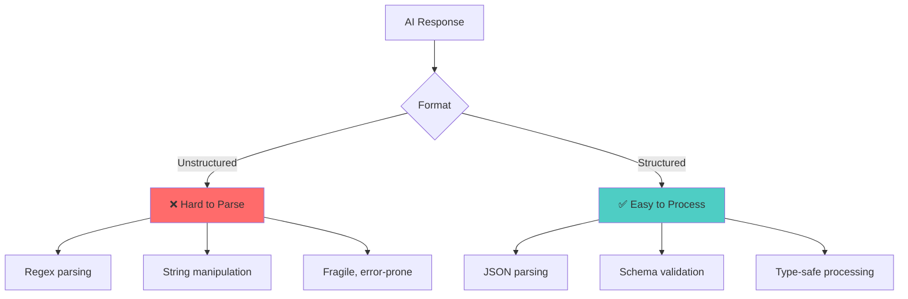

# 📘 **NODEJS AI DEVELOPER MASTERY - Lesson 4: AI Response Parsing & Validation**

**Date**: 26-03-18
**Level**: 🟢 Beginner → 🔴 Senior Engineer
**Series**: AI Developer Fundamentals
**Time**: 55 minutes
**Prerequisites**: Lesson 1 (OpenAI SDK), Lesson 2 (Prompt Engineering), Lesson 3 (Streaming & Tokens)

---

## 🎯 **LEARNING OBJECTIVES**

After completing this **comprehensive** lesson, you will:

1. ✅ **Master Structured Outputs** - JSON mode, schema enforcement
2. ✅ **Implement Zod Validation** - Type-safe response validation
3. ✅ **Handle Parsing Errors** - Recovery, retry strategies
4. ✅ **Create Response Parsers** - Custom parsers for complex formats
5. ✅ **Use Function Calling** - Structured data extraction
6. ✅ **Implement Output Guards** - Prevent malformed responses
7. ✅ **Production Patterns** - Retry loops, fallback parsing, validation pipelines

---

## 📦 **PART 1: STRUCTURED OUTPUTS**

### **Why Structured Outputs Matter**



**Comparison**:

| Approach | Reliability | Maintainability | Type Safety |
|----------|-------------|-----------------|-------------|
| **Unstructured Text** | ❌ Low (30-50%) | ❌ Hard | ❌ None |
| **JSON with Prompts** | ⚠️ Medium (70-85%) | ⚠️ Manual | ❌ Runtime |
| **JSON Mode + Schema** | ✅ High (95%+) | ✅ Easy | ✅ Full |

---

### **JSON Mode Implementation**

```typescript
// ─────────────────────────────────────────────
// ai/structured/structured-response.service.ts
// ─────────────────────────────────────────────
import { Injectable, Inject } from '@nestjs/common';
import { ConfigService } from '@nestjs/config';
import { OpenAI } from 'openai';
import { AiService } from '../ai.service';

export interface StructuredResponseOptions<T> {
  schema: T;
  prompt: string;
  model?: string;
  temperature?: number;
  maxRetries?: number;
}

@Injectable()
export class StructuredResponseService extends AiService {
  constructor(
    @Inject('OPENAI_CLIENT') protected readonly client: OpenAI,
    protected readonly configService: ConfigService,
  ) {
    super(client, configService);
  }

  // ─────────────────────────────────────────────
  // Method 1: JSON Mode (GPT-4-turbo & GPT-3.5-turbo)
  // ─────────────────────────────────────────────
  async getJsonResponse<T>(
    prompt: string,
    schema: object,
    options: {
      model?: string;
      temperature?: number;
    } = {},
  ): Promise<T> {
    const model = options.model || 'gpt-4-turbo-preview';
    const temperature = options.temperature ?? 0; // JSON mode works best with temperature 0

    return this.withRetry(
      async () => {
        const response = await this.client.chat.completions.create({
          model,
          messages: [
            {
              role: 'system',
              content: `You are a helpful assistant that responds ONLY in valid JSON format.
Your response must match this JSON schema exactly:
${JSON.stringify(schema, null, 2)}

DO NOT include any text outside the JSON object.
DO NOT include markdown code blocks.
DO NOT include explanations.
Return ONLY the raw JSON object.`,
            },
            {
              role: 'user',
              content: prompt,
            },
          ],
          temperature,
          response_format: { type: 'json_object' },  // Enable JSON mode
        });

        const content = response.choices[0]?.message?.content;

        if (!content) {
          throw new Error('Empty response from AI');
        }

        // Parse JSON
        try {
          return JSON.parse(content) as T;
        } catch (error) {
          this.logger.error(`Failed to parse JSON response: ${error.message}`);
          this.logger.debug(`Raw response: ${content}`);
          throw new Error(
            `AI returned invalid JSON: ${error.message}. Raw: ${content.substring(0, 200)}`,
          );
        }
      },
      'JsonResponse',
      options.model ? 1 : 3,  // Fewer retries for JSON mode
    );
  }

  // ─────────────────────────────────────────────
  // Method 2: JSON Schema (Newer API feature)
  // ─────────────────────────────────────────────
  async getSchemaResponse<T>(
    prompt: string,
    jsonSchema: object,
    options: {
      model?: string;
      temperature?: number;
    } = {},
  ): Promise<T> {
    const model = options.model || 'gpt-4-turbo-preview';

    return this.withRetry(
      async () => {
        const response = await this.client.chat.completions.create({
          model,
          messages: [
            {
              role: 'system',
              content: 'You are a helpful assistant that responds in valid JSON matching the provided schema.',
            },
            {
              role: 'user',
              content: prompt,
            },
          ],
          temperature: options.temperature ?? 0,
          response_format: {
            type: 'json_schema',
            json_schema: {
              name: 'response',
              strict: true,
              schema: jsonSchema,
            },
          },
        });

        const content = response.choices[0]?.message?.content;

        if (!content) {
          throw new Error('Empty response from AI');
        }

        return JSON.parse(content) as T;
      },
      'SchemaResponse',
    );
  }

  // ─────────────────────────────────────────────
  // Method 3: Function Calling (Legacy but reliable)
  // ─────────────────────────────────────────────
  async getFunctionResponse<T>(
    prompt: string,
    functionName: string,
    functionSchema: object,
    options: {
      model?: string;
      temperature?: number;
    } = {},
  ): Promise<T> {
    const model = options.model || 'gpt-4-turbo-preview';

    return this.withRetry(
      async () => {
        const response = await this.client.chat.completions.create({
          model,
          messages: [
            {
              role: 'system',
              content: `You are a helpful assistant. Call the function "${functionName}" with the appropriate arguments based on the user's request.`,
            },
            {
              role: 'user',
              content: prompt,
            },
          ],
          temperature: options.temperature ?? 0,
          tools: [
            {
              type: 'function',
              function: {
                name: functionName,
                description: `Extract structured data based on the request`,
                parameters: functionSchema,
              },
            },
          ],
          tool_choice: {
            type: 'function',
            function: { name: functionName },
          },
        });

        const toolCall = response.choices[0]?.message?.tool_calls?.[0];

        if (!toolCall || toolCall.function.name !== functionName) {
          throw new Error('AI did not call the expected function');
        }

        return JSON.parse(toolCall.function.arguments) as T;
      },
      'FunctionResponse',
    );
  }
}
```

---

## 📦 **PART 2: ZOD VALIDATION**

### **Zod Schema Integration**

```typescript
// ─────────────────────────────────────────────
// ai/validation/zod-validator.service.ts
// ─────────────────────────────────────────────
import { Injectable } from '@nestjs/common';
import { z, ZodSchema, ZodError } from 'zod';

export interface ValidationResult<T> {
  success: boolean;
  data?: T;
  errors?: Array<{
    field: string;
    message: string;
    code: string;
  }>;
}

@Injectable()
export class ZodValidatorService {
  // ─────────────────────────────────────────────
  // Validate AI Response Against Zod Schema
  // ─────────────────────────────────────────────
  validate<T>(
    schema: ZodSchema<T>,
    data: unknown,
    context: string = 'AI Response',
  ): ValidationResult<T> {
    try {
      const parsed = schema.parse(data);
      return {
        success: true,
        data: parsed,
      };
    } catch (error) {
      if (error instanceof ZodError) {
        const errors = error.errors.map(err => ({
          field: err.path.join('.'),
          message: err.message,
          code: err.code,
        }));

        this.logValidationError(context, errors);

        return {
          success: false,
          errors,
        };
      }

      return {
        success: false,
        errors: [
          {
            field: 'unknown',
            message: error.message,
            code: 'UNKNOWN_ERROR',
          },
        ],
      };
    }
  }

  // ─────────────────────────────────────────────
  // Validate with Auto-Repair
  // ─────────────────────────────────────────────
  async validateWithRepair<T>(
    schema: ZodSchema<T>,
    data: unknown,
    originalPrompt: string,
    aiService: any,
    maxRepairs: number = 2,
  ): Promise<ValidationResult<T>> {
    let currentData = data;
    let attempts = 0;

    while (attempts <= maxRepairs) {
      const result = this.validate(schema, currentData);

      if (result.success) {
        return result;
      }

      attempts++;

      if (attempts > maxRepairs) {
        return result;  // Return failed validation
      }

      // Ask AI to repair the response
      const repairPrompt = `
Your previous response had validation errors:
${JSON.stringify(result.errors, null, 2)}

Original request:
${originalPrompt}

Please provide a corrected response that fixes these errors.
Respond with ONLY valid JSON matching the expected schema.
`;

      try {
        currentData = await aiService.getJsonResponse(repairPrompt, schema);
      } catch (error) {
        return {
          success: false,
          errors: [
            {
              field: 'repair',
              message: `Failed to repair: ${error.message}`,
              code: 'REPAIR_FAILED',
            },
          ],
        };
      }
    }

    return {
      success: false,
      errors: [{ field: 'repair', message: 'Max repair attempts reached', code: 'MAX_REPAIRS' }],
    };
  }

  // ─────────────────────────────────────────────
  // Log Validation Errors
  // ─────────────────────────────────────────────
  private logValidationError(
    context: string,
    errors: Array<{ field: string; message: string; code: string }>,
  ): void {
    console.error(`[${context}] Validation Failed:`);
    errors.forEach(err => {
      console.error(`  - ${err.field}: ${err.message}`);
    });
  }
}

// ─────────────────────────────────────────────
// Common Zod Schemas for AI Responses
// ─────────────────────────────────────────────
export const AiSchemas = {
  // Classification Response
  classification: z.object({
    category: z.string(),
    confidence: z.number().min(0).max(1),
    reasoning: z.string(),
  }),

  // Sentiment Analysis
  sentiment: z.object({
    sentiment: z.enum(['positive', 'negative', 'neutral']),
    score: z.number().min(-1).max(1),
    emotions: z.array(z.string()).optional(),
    keyPhrases: z.array(z.string()).optional(),
  }),

  // Entity Extraction
  entityExtraction: z.object({
    entities: z.array(
      z.object({
        text: z.string(),
        type: z.string(),
        startOffset: z.number().optional(),
        endOffset: z.number().optional(),
        confidence: z.number().min(0).max(1).optional(),
      }),
    ),
  }),

  // Question Answer
  questionAnswer: z.object({
    answer: z.string(),
    confidence: z.number().min(0).max(1),
    sourceText: z.string().optional(),
    citations: z.array(z.string()).optional(),
  }),

  // Code Generation
  codeGeneration: z.object({
    language: z.string(),
    code: z.string(),
    explanation: z.string().optional(),
    dependencies: z.array(z.string()).optional(),
  }),

  // Data Extraction
  dataExtraction: z.record(z.unknown()),

  // Chat Response with Metadata
  chatResponse: z.object({
    content: z.string(),
    intent: z.string().optional(),
    entities: z.record(z.unknown()).optional(),
    suggestedActions: z.array(z.string()).optional(),
  }),

  // Summarization
  summary: z.object({
    summary: z.string(),
    keyPoints: z.array(z.string()),
    length: z.enum(['short', 'medium', 'long']),
  }),

  // Translation
  translation: z.object({
    translatedText: z.string(),
    sourceLanguage: z.string().optional(),
    targetLanguage: z.string(),
    confidence: z.number().min(0).max(1).optional(),
  }),
};
```

---

### **Complete Validation Pipeline**

```typescript
// ─────────────────────────────────────────────
// ai/validation/validation-pipeline.service.ts
// ─────────────────────────────────────────────
import { Injectable } from '@nestjs/common';
import { z, ZodSchema } from 'zod';
import { StructuredResponseService } from '../structured/structured-response.service';
import { ZodValidatorService, ValidationResult } from './zod-validator.service';

export interface PipelineConfig<T> {
  name: string;
  schema: ZodSchema<T>;
  prompt: string;
  maxRetries?: number;
  repairEnabled?: boolean;
  timeout?: number;
}

@Injectable()
export class ValidationPipelineService {
  constructor(
    private structuredService: StructuredResponseService,
    private validatorService: ZodValidatorService,
  ) {}

  // ─────────────────────────────────────────────
  // Execute Validation Pipeline
  // ─────────────────────────────────────────────
  async execute<T>(
    config: PipelineConfig<T>,
    variables?: Record<string, string>,
  ): Promise<ValidationResult<T>> {
    const {
      name,
      schema,
      prompt,
      maxRetries = 3,
      repairEnabled = true,
      timeout = 30000,
    } = config;

    // Apply variables to prompt
    const renderedPrompt = variables
      ? this.renderPrompt(prompt, variables)
      : prompt;

    // Timeout wrapper
    const timeoutPromise = new Promise<ValidationResult<T>>((_, reject) => {
      setTimeout(() => reject(new Error(`Pipeline "${name}" timed out after ${timeout}ms`)), timeout);
    });

    const executionPromise = this.executeWithRetries(
      schema,
      renderedPrompt,
      maxRetries,
      repairEnabled,
    );

    return Promise.race([timeoutPromise, executionPromise]);
  }

  // ─────────────────────────────────────────────
  // Execute with Retries
  // ─────────────────────────────────────────────
  private async executeWithRetries<T>(
    schema: ZodSchema<T>,
    prompt: string,
    maxRetries: number,
    repairEnabled: boolean,
  ): Promise<ValidationResult<T>> {
    let lastError: any;
    let lastResult: ValidationResult<T> | undefined;

    for (let attempt = 1; attempt <= maxRetries; attempt++) {
      try {
        // Get AI response
        const aiResponse = await this.structuredService.getJsonResponse(
          prompt,
          schema,
        );

        // Validate response
        const result = this.validatorService.validate(schema, aiResponse);

        if (result.success) {
          return result;
        }

        lastResult = result;

        // Try repair if enabled
        if (repairEnabled && attempt < maxRetries) {
          const repairResult = await this.validatorService.validateWithRepair(
            schema,
            aiResponse,
            prompt,
            this.structuredService,
          );

          if (repairResult.success) {
            return repairResult;
          }

          lastResult = repairResult;
        }

      } catch (error) {
        lastError = error;

        if (attempt === maxRetries) {
          return {
            success: false,
            errors: [
              {
                field: 'execution',
                message: `Pipeline failed after ${maxRetries} attempts: ${error.message}`,
                code: 'EXECUTION_FAILED',
              },
            ],
          };
        }

        // Exponential backoff before retry
        await new Promise(resolve =>
          setTimeout(resolve, Math.pow(2, attempt) * 1000),
        );
      }
    }

    return (
      lastResult || {
        success: false,
        errors: [
          {
            field: 'unknown',
            message: lastError?.message || 'Unknown error',
            code: 'UNKNOWN',
          },
        ],
      }
    );
  }

  // ─────────────────────────────────────────────
  // Render Prompt with Variables
  // ─────────────────────────────────────────────
  private renderPrompt(
    prompt: string,
    variables: Record<string, string>,
  ): string {
    let rendered = prompt;

    for (const [key, value] of Object.entries(variables)) {
      rendered = rendered.replace(
        new RegExp(`\\{\\{${key}\\}\\}`, 'g'),
        value,
      );
    }

    return rendered;
  }
}
```

---

## 📦 **PART 3: ERROR HANDLING & RECOVERY**

### **Parsing Error Recovery**

```typescript
// ─────────────────────────────────────────────
// ai/parsing/error-recovery.service.ts
// ─────────────────────────────────────────────
import { Injectable } from '@nestjs/common';

@Injectable()
export class ErrorRecoveryService {
  // ─────────────────────────────────────────────
  // Fix Common JSON Issues
  // ─────────────────────────────────────────────
  fixMalformedJson(input: string): string {
    let fixed = input.trim();

    // Remove markdown code blocks
    fixed = fixed.replace(/^```json\s*/i, '').replace(/```\s*$/, '');
    fixed = fixed.replace(/^```\s*/i, '').replace(/```\s*$/, '');

    // Remove leading/trailing text
    const jsonMatch = fixed.match(/\{[\s\S]*\}/);
    if (jsonMatch) {
      fixed = jsonMatch[0];
    }

    // Fix missing quotes around keys
    fixed = fixed.replace(/([{,]\s*)([a-zA-Z_][a-zA-Z0-9_]*)\s*:/g, '$1"$2":');

    // Fix single quotes to double quotes
    fixed = fixed.replace(/'/g, '"');

    // Fix trailing commas
    fixed = fixed.replace(/,(\s*[}\]])/g, '$1');

    // Fix missing commas
    fixed = fixed.replace(/"\s*"/g, '","');
    fixed = fixed.replace(/}\s*{/g, '},{');

    // Fix unquoted string values
    fixed = fixed.replace(/:\s*([a-zA-Z][a-zA-Z0-9_]*)\s*([,}\]])/g, ': "$1"$2');

    return fixed;
  }

  // ─────────────────────────────────────────────
  // Attempt Multiple Parse Strategies
  // ─────────────────────────────────────────────
  robustParse<T>(input: string): { success: boolean; data?: T; error?: string } {
    // Strategy 1: Direct parse
    try {
      return { success: true, data: JSON.parse(input) as T };
    } catch (e) {
      // Continue to next strategy
    }

    // Strategy 2: Fix and parse
    try {
      const fixed = this.fixMalformedJson(input);
      return { success: true, data: JSON.parse(fixed) as T };
    } catch (e) {
      // Continue to next strategy
    }

    // Strategy 3: Extract JSON from text
    try {
      const jsonMatch = input.match(/\{[\s\S]*\}/);
      if (jsonMatch) {
        return { success: true, data: JSON.parse(jsonMatch[0]) as T };
      }
    } catch (e) {
      // Continue to next strategy
    }

    // Strategy 4: Try to extract array
    try {
      const arrayMatch = input.match(/\[[\s\S]*\]/);
      if (arrayMatch) {
        return { success: true, data: JSON.parse(arrayMatch[0]) as T };
      }
    } catch (e) {
      // Continue to next strategy
    }

    // All strategies failed
    return {
      success: false,
      error: 'All parsing strategies failed',
    };
  }

  // ─────────────────────────────────────────────
  // Partial Parse (Extract What We Can)
  // ─────────────────────────────────────────────
  partialParse(input: string, requiredFields: string[]): Record<string, any> {
    const result: Record<string, any> = {};

    for (const field of requiredFields) {
      // Try to extract field value
      const patterns = [
        new RegExp(`"${field}"\\s*:\\s*"([^"]*)"`, 'i'),
        new RegExp(`"${field}"\\s*:\\s*([0-9.]+)`, 'i'),
        new RegExp(`"${field}"\\s*:\\s*(true|false)`, 'i'),
      ];

      for (const pattern of patterns) {
        const match = input.match(pattern);
        if (match) {
          let value = match[1];
          if (value === 'true') value = true;
          if (value === 'false') value = false;
          if (!isNaN(Number(value))) value = Number(value);

          result[field] = value;
          break;
        }
      }
    }

    return result;
  }
}
```

---

### **Retry Strategy with Fallback**

```typescript
// ─────────────────────────────────────────────
// ai/retry/retry-strategy.service.ts
// ─────────────────────────────────────────────
import { Injectable } from '@nestjs/common';

export interface RetryConfig {
  maxAttempts: number;
  baseDelay: number;
  maxDelay: number;
  fallback?: () => Promise<any>;
}

@Injectable()
export class RetryStrategyService {
  // ─────────────────────────────────────────────
  // Execute with Exponential Backoff
  // ─────────────────────────────────────────────
  async executeWithRetry<T>(
    operation: () => Promise<T>,
    config: RetryConfig,
    context: string = 'Operation',
  ): Promise<T> {
    const { maxAttempts, baseDelay, maxDelay, fallback } = config;

    let lastError: any;

    for (let attempt = 1; attempt <= maxAttempts; attempt++) {
      try {
        return await operation();
      } catch (error) {
        lastError = error;

        console.warn(
          `${context} - Attempt ${attempt}/${maxAttempts} failed: ${error.message}`,
        );

        if (attempt === maxAttempts) {
          break;
        }

        // Calculate delay with exponential backoff and jitter
        const delay = Math.min(
          baseDelay * Math.pow(2, attempt - 1) + Math.random() * 1000,
          maxDelay,
        );

        console.log(`Retrying ${context} in ${Math.round(delay)}ms...`);
        await new Promise(resolve => setTimeout(resolve, delay));
      }
    }

    // All retries failed - try fallback
    if (fallback) {
      try {
        console.log(`Using fallback for ${context}`);
        return await fallback();
      } catch (fallbackError) {
        console.error(`Fallback also failed: ${fallbackError.message}`);
      }
    }

    throw lastError;
  }

  // ─────────────────────────────────────────────
  // Circuit Breaker Pattern
  // ─────────────────────────────────────────────
  private circuitState: 'closed' | 'open' | 'half-open' = 'closed';
  private failureCount = 0;
  private readonly failureThreshold = 5;
  private readonly resetTimeout = 60000;

  async executeWithCircuitBreaker<T>(
    operation: () => Promise<T>,
  ): Promise<T> {
    if (this.circuitState === 'open') {
      throw new Error('Circuit breaker is open - service unavailable');
    }

    try {
      const result = await operation();
      this.onSuccess();
      return result;
    } catch (error) {
      this.onFailure();
      throw error;
    }
  }

  private onSuccess(): void {
    this.failureCount = 0;
    this.circuitState = 'closed';
  }

  private onFailure(): void {
    this.failureCount++;

    if (this.failureCount >= this.failureThreshold) {
      this.circuitState = 'open';
      console.warn('Circuit breaker opened due to repeated failures');

      // Reset after timeout
      setTimeout(() => {
        this.circuitState = 'half-open';
        console.log('Circuit breaker half-open - testing...');
      }, this.resetTimeout);
    }
  }
}
```

---

## 📦 **PART 4: FUNCTION CALLING PATTERNS**

### **Advanced Function Calling**

```typescript
// ─────────────────────────────────────────────
// ai/function-calling/function-calling.service.ts
// ─────────────────────────────────────────────
import { Injectable, Inject } from '@nestjs/common';
import { ConfigService } from '@nestjs/config';
import { OpenAI } from 'openai';
import { AiService } from '../ai.service';

export interface FunctionDefinition {
  name: string;
  description: string;
  parameters: object;
  handler: (args: any) => Promise<any>;
}

@Injectable()
export class FunctionCallingService extends AiService {
  constructor(
    @Inject('OPENAI_CLIENT') protected readonly client: OpenAI,
    protected readonly configService: ConfigService,
  ) {
    super(client, configService);
  }

  // ─────────────────────────────────────────────
  // Single Function Call
  // ─────────────────────────────────────────────
  async callFunction<T>(
    prompt: string,
    functionDef: FunctionDefinition,
    options: {
      model?: string;
      temperature?: number;
    } = {},
  ): Promise<T> {
    const model = options.model || 'gpt-4-turbo-preview';

    const response = await this.client.chat.completions.create({
      model,
      messages: [
        {
          role: 'system',
          content: `You are a helpful assistant. Use the available function to complete the task.`,
        },
        {
          role: 'user',
          content: prompt,
        },
      ],
      temperature: options.temperature ?? 0,
      tools: [
        {
          type: 'function',
          function: {
            name: functionDef.name,
            description: functionDef.description,
            parameters: functionDef.parameters,
          },
        },
      ],
      tool_choice: {
        type: 'function',
        function: { name: functionDef.name },
      },
    });

    const toolCall = response.choices[0]?.message?.tool_calls?.[0];

    if (!toolCall) {
      throw new Error('AI did not call the function');
    }

    const args = JSON.parse(toolCall.function.arguments);

    // Execute the handler
    return functionDef.handler(args);
  }

  // ─────────────────────────────────────────────
  // Multiple Functions (AI Chooses)
  // ─────────────────────────────────────────────
  async callMultipleFunctions(
    prompt: string,
    functions: FunctionDefinition[],
    options: {
      model?: string;
      temperature?: number;
      maxSteps?: number;
    } = {},
  ): Promise<any[]> {
    const model = options.model || 'gpt-4-turbo-preview';
    const maxSteps = options.maxSteps || 5;

    const messages: any[] = [
      {
        role: 'system',
        content: `You are a helpful assistant. Use the available functions to complete the task. You can call multiple functions in sequence.`,
      },
      {
        role: 'user',
        content: prompt,
      },
    ];

    const results: any[] = [];

    for (let step = 0; step < maxSteps; step++) {
      const response = await this.client.chat.completions.create({
        model,
        messages,
        temperature: options.temperature ?? 0,
        tools: functions.map(fn => ({
          type: 'function' as const,
          function: {
            name: fn.name,
            description: fn.description,
            parameters: fn.parameters,
          },
        })),
        tool_choice: 'auto' as const,
      });

      const message = response.choices[0]?.message;

      // If no tool calls, we're done
      if (!message?.tool_calls || message.tool_calls.length === 0) {
        break;
      }

      // Process each tool call
      for (const toolCall of message.tool_calls) {
        const fn = functions.find(f => f.name === toolCall.function.name);

        if (!fn) {
          throw new Error(`Unknown function: ${toolCall.function.name}`);
        }

        const args = JSON.parse(toolCall.function.arguments);
        const result = await fn.handler(args);
        results.push(result);

        // Add tool response to messages
        messages.push({
          role: 'tool',
          tool_call_id: toolCall.id,
          content: JSON.stringify(result),
        });
      }

      // Add assistant message
      messages.push(message);
    }

    return results;
  }

  // ─────────────────────────────────────────────
  // Parallel Function Execution
  // ─────────────────────────────────────────────
  async callFunctionsParallel(
    prompt: string,
    functions: FunctionDefinition[],
    options: {
      model?: string;
      temperature?: number;
    } = {},
  ): Promise<any[]> {
    const model = options.model || 'gpt-4-turbo-preview';

    const response = await this.client.chat.completions.create({
      model,
      messages: [
        {
          role: 'system',
          content: `You are a helpful assistant. Call all relevant functions in parallel to complete the task.`,
        },
        {
          role: 'user',
          content: prompt,
        },
      ],
      temperature: options.temperature ?? 0,
      tools: functions.map(fn => ({
        type: 'function' as const,
        function: {
          name: fn.name,
          description: fn.description,
          parameters: fn.parameters,
        },
      })),
      parallel_tool_calls: true,
    });

    const toolCalls = response.choices[0]?.message?.tool_calls || [];

    // Execute all functions in parallel
    const results = await Promise.all(
      toolCalls.map(async toolCall => {
        const fn = functions.find(f => f.name === toolCall.function.name);

        if (!fn) {
          throw new Error(`Unknown function: ${toolCall.function.name}`);
        }

        const args = JSON.parse(toolCall.function.arguments);
        return fn.handler(args);
      }),
    );

    return results;
  }
}

// ─────────────────────────────────────────────
// Example: Data Extraction Functions
// ─────────────────────────────────────────────
const extractionFunctions: FunctionDefinition[] = [
  {
    name: 'extractPerson',
    description: 'Extract person information from text',
    parameters: {
      type: 'object',
      properties: {
        name: { type: 'string', description: 'Full name' },
        age: { type: 'number', description: 'Age in years' },
        occupation: { type: 'string', description: 'Job title' },
        location: { type: 'string', description: 'City, Country' },
      },
      required: ['name'],
    },
    handler: async (args) => {
      // Save to database, validate, etc.
      return { extracted: true, data: args };
    },
  },
  {
    name: 'extractEvent',
    description: 'Extract event information from text',
    parameters: {
      type: 'object',
      properties: {
        eventName: { type: 'string' },
        date: { type: 'string' },
        location: { type: 'string' },
        participants: { type: 'array', items: { type: 'string' } },
      },
      required: ['eventName'],
    },
    handler: async (args) => {
      return { extracted: true, data: args };
    },
  },
];
```

---

## ✅ **PARSING & VALIDATION CHECKLIST**

```
Structured Outputs
[ ] JSON mode enabled for all responses
[ ] Schema defined for each response type
[ ] Function calling implemented where needed
[ ] Response format documented

Zod Validation
[ ] Schemas defined for all response types
[ ] Validation pipeline implemented
[ ] Auto-retry on validation failure
[ ] Error messages logged and tracked

Error Recovery
[ ] Malformed JSON fixing implemented
[ ] Multiple parse strategies attempted
[ ] Partial parse fallback available
[ ] Circuit breaker pattern used

Function Calling
[ ] Functions properly defined
[ ] Handlers implemented
[ ] Parallel execution supported
[ ] Multi-step conversations work

Monitoring
[ ] Validation failures tracked
[ ] Parse errors logged
[ ] Retry rates monitored
[ ] Schema violations analyzed
```

---

## 🎯 **KNOWLEDGE CHECK**

### **Question 1: JSON Mode vs Function Calling**

When should you use each?

<details>
<summary>💡 Click to reveal answer</summary>

**JSON Mode**:
- ✅ Simple structured responses
- ✅ Single object/array output
- ✅ When you need strict JSON only
- ✅ GPT-4-turbo and GPT-3.5-turbo

**Function Calling**:
- ✅ Complex multi-step operations
- ✅ When AI needs to choose between actions
- ✅ When you need to execute code based on output
- ✅ Better for conversational flows
</details>

---

### **Question 2: Validation Error Recovery**

What's the best strategy for handling validation errors?

<details>
<summary>💡 Click to reveal answer</summary>

**Recovery Strategy**:
1. ✅ **First**: Try to fix JSON programmatically (quotes, commas)
2. ✅ **Second**: Ask AI to repair with specific error messages
3. ✅ **Third**: Partial parse - extract what you can
4. ✅ **Last**: Return error with full context for debugging

**Never**: Silently ignore validation errors!
</details>

---

### **Question 3: Schema Design Best Practices**

<details>
<summary>💡 Click to reveal answer</summary>

**Best Practices**:
1. ✅ **Be specific** - Use enums, ranges, patterns
2. ✅ **Required fields** - Mark truly required fields
3. ✅ **Optional fields** - Use `.optional()` for flexibility
4. ✅ **Descriptions** - Help AI understand each field
5. ✅ **Examples** - Include in prompt when complex
6. ✅ **Keep it simple** - Don't over-engineer schemas
</details>

---

## 📚 **ADDITIONAL RESOURCES**

- **Zod Documentation**: [https://zod.dev](https://zod.dev)
- **OpenAI JSON Mode**: [https://platform.openai.com/docs/guides/text-generation/json-mode](https://platform.openai.com/docs/guides/text-generation/json-mode)
- **Function Calling**: [https://platform.openai.com/docs/guides/function-calling](https://platform.openai.com/docs/guides/function-calling)
- **Tiktoken**: [https://github.com/dqbd/tiktoken](https://github.com/dqbd/tiktoken)

---

## 🎓 **HOMEWORK**

1. ✅ Create Zod schemas for 5 common AI response types
2. ✅ Implement JSON mode with validation pipeline
3. ✅ Build error recovery service
4. ✅ Create function calling with 3+ functions
5. ✅ Implement retry with exponential backoff
6. ✅ Add circuit breaker pattern
7. ✅ Build partial parse fallback
8. ✅ Test with intentionally malformed responses

---

**Next Lesson**: Conversation & Memory Management - Chat History, Context Windows, Summarization
**Date**: 26-03-18
**Status**: ✅ Complete

---
*26-03-18*
