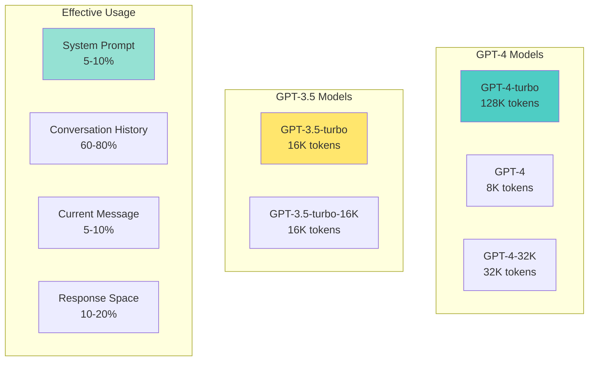

# 📘 **NODEJS AI DEVELOPER MASTERY - Lesson 5: Conversation & Memory Management**

**Date**: 26-03-18
**Level**: 🟢 Beginner → 🔴 Senior Engineer
**Series**: AI Developer Fundamentals
**Time**: 60 minutes
**Prerequisites**: Lesson 1-4 (SDK, Prompts, Streaming, Validation)

---

## 🎯 **LEARNING OBJECTIVES**

After completing this **comprehensive** lesson, you will:

1. ✅ **Understand Context Windows** - Token limits, model differences, optimization
2. ✅ **Implement Conversation Storage** - Database schemas, retrieval patterns
3. ✅ **Master Memory Patterns** - Sliding window, summarization, hybrid approaches
4. ✅ **Build Conversation Service** - CRUD operations, message management
5. ✅ **Handle Long Conversations** - Truncation, compression, selective recall
6. ✅ **Implement Search & Recall** - Semantic search within conversations
7. ✅ **Production Patterns** - Multi-session, user context, conversation analytics

---

## 📦 **PART 1: CONTEXT WINDOWS DEEP DIVE**

### **Model Context Limits**



**Context Window Comparison**:

| Model | Context Limit | Cost per 1K tokens | Best For |
|-------|--------------|-------------------|----------|
| **GPT-4-turbo** | 128,000 | $0.01 prompt | Long documents, full conversations |
| **GPT-4** | 8,192 | $0.03 prompt | Complex reasoning, short context |
| **GPT-4-32K** | 32,768 | $0.06 prompt | Medium-long context |
| **GPT-3.5-turbo** | 16,385 | $0.0005 prompt | Cost-effective, most use cases |

---

### **Context Window Management**

```typescript
// ─────────────────────────────────────────────
// ai/context/context-window.service.ts
// ─────────────────────────────────────────────
import { Injectable } from '@nestjs/common';
import { TokenCountingService } from '../token/token.service';

export interface Message {
  role: 'system' | 'user' | 'assistant';
  content: string;
  timestamp?: Date;
  metadata?: Record<string, any>;
}

export interface ContextWindowConfig {
  maxTokens: number;
  reserveForResponse: number;
  systemPromptPriority: 'keep' | 'truncate' | 'remove';
}

@Injectable()
export class ContextWindowService {
  constructor(
    private tokenService: TokenCountingService,
  ) {}

  // ─────────────────────────────────────────────
  // Calculate Available Space
  // ─────────────────────────────────────────────
  calculateAvailableSpace(
    messages: Message[],
    config: ContextWindowConfig,
  ): {
    totalTokens: number;
    usedTokens: number;
    availableTokens: number;
    isOverflow: boolean;
  } {
    const totalTokens = this.tokenService.countMessagesTokens(messages);
    const availableTokens = config.maxTokens - config.reserveForResponse;
    const isOverflow = totalTokens > availableTokens;

    return {
      totalTokens,
      usedTokens: totalTokens,
      availableTokens,
      isOverflow,
    };
  }

  // ─────────────────────────────────────────────
  // Fit Messages Within Window
  // ─────────────────────────────────────────────
  fitMessagesToWindow(
    messages: Message[],
    config: ContextWindowConfig,
  ): Message[] {
    const space = this.calculateAvailableSpace(messages, config);

    if (!space.isOverflow) {
      return messages;  // All messages fit
    }

    const result: Message[] = [];
    let currentTokens = 0;
    const maxTokens = config.maxTokens - config.reserveForResponse;

    // Always keep system message
    const systemMessage = messages.find(m => m.role === 'system');
    if (systemMessage) {
      if (config.systemPromptPriority === 'keep') {
        result.push(systemMessage);
        currentTokens += this.tokenService.countTokens(systemMessage.content);
      }
    }

    // Add messages from newest to oldest
    const nonSystemMessages = messages
      .filter(m => m.role !== 'system')
      .reverse();

    for (const message of nonSystemMessages) {
      const messageTokens = this.tokenService.countTokens(message.content) + 3; // +3 for role

      if (currentTokens + messageTokens <= maxTokens) {
        result.unshift(message);  // Add to beginning (maintain order)
        currentTokens += messageTokens;
      } else {
        break;  // No more space
      }
    }

    // Add system message back if we removed it
    if (systemMessage && config.systemPromptPriority === 'keep' && !result.find(m => m.role === 'system')) {
      result.unshift(systemMessage);
    }

    return result;
  }

  // ─────────────────────────────────────────────
  // Selective Message Removal
  // ─────────────────────────────────────────────
  selectiveRemoval(
    messages: Message[],
    targetTokens: number,
  ): Message[] {
    const result = [...messages];

    while (this.tokenService.countMessagesTokens(result) > targetTokens) {
      // Find oldest non-system, non-recent message
      const systemMessage = result.find(m => m.role === 'system');
      const recentMessages = result.slice(-4);  // Keep last 4 messages

      const removable = result.findIndex(
        m => m !== systemMessage && !recentMessages.includes(m),
      );

      if (removable === -1) {
        break;  // Nothing left to remove
      }

      result.splice(removable, 1);
    }

    return result;
  }

  // ─────────────────────────────────────────────
  // Message Compression
  // ─────────────────────────────────────────────
  compressMessage(message: Message, compressionLevel: 'light' | 'medium' | 'heavy'): string {
    let content = message.content;

    if (compressionLevel === 'light') {
      // Remove extra whitespace
      content = content.replace(/\s+/g, ' ').trim();
    }

    if (compressionLevel === 'medium') {
      // Remove whitespace and common filler words
      content = content.replace(/\s+/g, ' ').trim();
      const fillers = ['actually', 'basically', 'essentially', 'you know', 'i think', 'sort of'];
      fillers.forEach(f => {
        content = content.replace(new RegExp(`\\b${f}\\b`, 'gi'), '');
      });
    }

    if (compressionLevel === 'heavy') {
      // Aggressive compression - keep only key information
      content = content.replace(/\s+/g, ' ').trim();
      content = content.replace(/\b(a|an|the|is|are|was|were)\b/gi, '');
      content = content.substring(0, Math.max(100, content.length * 0.5));
    }

    return content;
  }
}
```

---

## 📦 **PART 2: CONVERSATION STORAGE**

### **Database Schema (Mongoose)**

```typescript
// ─────────────────────────────────────────────
// conversation/conversation.schema.ts
// ─────────────────────────────────────────────
import { Prop, Schema, SchemaFactory } from '@nestjs/mongoose';
import { Document, Types } from 'mongoose';

export enum ConversationStatus {
  ACTIVE = 'active',
  ARCHIVED = 'archived',
  DELETED = 'deleted',
}

@Schema({ timestamps: true })
export class Conversation {
  @Prop({ type: Types.ObjectId, ref: 'User', required: true, index: true })
  userId: Types.ObjectId;

  @Prop({ required: true })
  title: string;

  @Prop({
    type: String,
    enum: ConversationStatus,
    default: ConversationStatus.ACTIVE,
    index: true,
  })
  status: ConversationStatus;

  @Prop({ type: String, default: 'gpt-4-turbo-preview' })
  model: string;

  @Prop({ default: 0 })
  totalTokens: number;

  @Prop({ default: 0 })
  messageCount: number;

  @Prop({ type: Date })
  lastMessageAt: Date;

  @Prop()
  metadata?: Record<string, any>;

  @Prop({ type: [{ type: Types.ObjectId, ref: 'Message' }], default: [] })
  messages: Types.ObjectId[];
}

export const ConversationSchema = SchemaFactory.createForClass(Conversation);

// Indexes for efficient queries
ConversationSchema.index({ userId: 1, createdAt: -1 });
ConversationSchema.index({ userId: 1, status: 1, lastMessageAt: -1 });
ConversationSchema.index({ userId: 1, 'metadata.tags': 1 });

// ─────────────────────────────────────────────
// message/message.schema.ts
// ─────────────────────────────────────────────
import { Prop, Schema, SchemaFactory } from '@nestjs/mongoose';
import { Document, Types } from 'mongoose';

export enum MessageRole {
  SYSTEM = 'system',
  USER = 'user',
  ASSISTANT = 'assistant',
}

@Schema({ timestamps: true })
export class Message extends Document {
  @Prop({ type: Types.ObjectId, ref: 'Conversation', required: true, index: true })
  conversationId: Types.ObjectId;

  @Prop({
    type: String,
    enum: MessageRole,
    required: true,
    index: true,
  })
  role: MessageRole;

  @Prop({ required: true })
  content: string;

  @Prop()
  contentCompressed?: string;  // Compressed version for storage

  @Prop({ default: 0 })
  tokenCount: number;

  @Prop()
  metadata?: {
    model?: string;
    temperature?: number;
    finishReason?: string;
    functionCall?: any;
    toolCalls?: any[];
  };

  @Prop({ type: Types.ObjectId, ref: 'Message' })
  parentMessageId?: Types.ObjectId;  // For threading

  @Prop({ default: false })
  isDeleted: boolean;

  @Prop({ type: Date })
  deletedAt?: Date;
}

export const MessageSchema = SchemaFactory.createForClass(Message);

// Indexes
MessageSchema.index({ conversationId: 1, createdAt: 1 });
MessageSchema.index({ conversationId: 1, role: 1 });
MessageSchema.index({ createdAt: -1 });

// Virtual for getting full conversation thread
MessageSchema.virtual('thread', {
  ref: 'Message',
  localField: 'conversationId',
  foreignField: 'conversationId',
  options: { sort: { createdAt: 1 } },
});
```

---

### **Conversation Service**

```typescript
// ─────────────────────────────────────────────
// conversation/conversation.service.ts
// ─────────────────────────────────────────────
import { Injectable, NotFoundException, BadRequestException } from '@nestjs/common';
import { InjectModel } from '@nestjs/mongoose';
import { Model, Types } from 'mongoose';
import { Conversation, ConversationDocument, ConversationStatus } from './conversation.schema';
import { Message, MessageDocument, MessageRole } from '../message/message.schema';
import { TokenCountingService } from '../token/token.service';
import { ContextWindowService, Message } from '../context/context-window.service';

export interface CreateConversationDto {
  userId: string;
  title?: string;
  model?: string;
  systemPrompt?: string;
  metadata?: Record<string, any>;
}

export interface AddMessageDto {
  conversationId: string;
  role: MessageRole;
  content: string;
  metadata?: any;
}

@Injectable()
export class ConversationService {
  constructor(
    @InjectModel(Conversation.name) private conversationModel: Model<ConversationDocument>,
    @InjectModel(Message.name) private messageModel: Model<MessageDocument>,
    private tokenService: TokenCountingService,
    private contextService: ContextWindowService,
  ) {}

  // ─────────────────────────────────────────────
  // Create Conversation
  // ─────────────────────────────────────────────
  async create(dto: CreateConversationDto): Promise<ConversationDocument> {
    const conversation = await this.conversationModel.create({
      userId: new Types.ObjectId(dto.userId),
      title: dto.title || 'New Conversation',
      model: dto.model || 'gpt-4-turbo-preview',
      status: ConversationStatus.ACTIVE,
      metadata: dto.metadata,
      messages: [],
    });

    // Add system message if provided
    if (dto.systemPrompt) {
      await this.addMessage({
        conversationId: conversation._id.toString(),
        role: MessageRole.SYSTEM,
        content: dto.systemPrompt,
      });
    }

    return conversation;
  }

  // ─────────────────────────────────────────────
  // Get Conversation with Messages
  // ─────────────────────────────────────────────
  async findByIdWithMessages(
    conversationId: string,
    limit: number = 50,
  ): Promise<{
    conversation: ConversationDocument;
    messages: MessageDocument[];
  }> {
    const conversation = await this.conversationModel.findById(conversationId);

    if (!conversation) {
      throw new NotFoundException('Conversation not found');
    }

    const messages = await this.messageModel
      .find({ conversationId, isDeleted: false })
      .sort({ createdAt: 1 })
      .limit(limit)
      .lean();

    return { conversation, messages };
  }

  // ─────────────────────────────────────────────
  // Add Message to Conversation
  // ─────────────────────────────────────────────
  async addMessage(dto: AddMessageDto): Promise<MessageDocument> {
    const conversation = await this.conversationModel.findById(dto.conversationId);

    if (!conversation) {
      throw new NotFoundException('Conversation not found');
    }

    if (conversation.status !== ConversationStatus.ACTIVE) {
      throw new BadRequestException('Cannot add messages to archived conversation');
    }

    const tokenCount = this.tokenService.countTokens(dto.content);

    const message = await this.messageModel.create({
      conversationId: new Types.ObjectId(dto.conversationId),
      role: dto.role,
      content: dto.content,
      tokenCount,
      metadata: dto.metadata,
    });

    // Update conversation
    await this.conversationModel.findByIdAndUpdate(dto.conversationId, {
      $push: { messages: message._id },
      $inc: { messageCount: 1, totalTokens: tokenCount },
      lastMessageAt: new Date(),
    });

    return message;
  }

  // ─────────────────────────────────────────────
  // Get Messages for AI Context
  // ─────────────────────────────────────────────
  async getContextMessages(
    conversationId: string,
    maxTokens: number = 100000,
  ): Promise<Message[]> {
    const messages = await this.messageModel
      .find({ conversationId, isDeleted: false })
      .sort({ createdAt: 1 })
      .lean();

    // Convert to context format
    const contextMessages: Message[] = messages.map(m => ({
      role: m.role as any,
      content: m.content,
      timestamp: m.createdAt,
      metadata: m.metadata,
    }));

    // Fit within context window
    return this.contextService.fitMessagesToWindow(contextMessages, {
      maxTokens,
      reserveForResponse: 4096,
      systemPromptPriority: 'keep',
    });
  }

  // ─────────────────────────────────────────────
  // List User Conversations
  // ─────────────────────────────────────────────
  async listUserConversations(
    userId: string,
    options: {
      status?: ConversationStatus;
      page?: number;
      limit?: number;
      sortBy?: 'createdAt' | 'lastMessageAt';
    } = {},
  ): Promise<{
    conversations: ConversationDocument[];
    total: number;
    page: number;
    limit: number;
  }> {
    const {
      status = ConversationStatus.ACTIVE,
      page = 1,
      limit = 20,
      sortBy = 'lastMessageAt',
    } = options;

    const query = { userId, status };

    const [conversations, total] = await Promise.all([
      this.conversationModel
        .find(query)
        .sort({ [sortBy]: -1 })
        .skip((page - 1) * limit)
        .limit(limit),

      this.conversationModel.countDocuments(query),
    ]);

    return {
      conversations,
      total,
      page,
      limit,
    };
  }

  // ─────────────────────────────────────────────
  // Archive Conversation
  // ─────────────────────────────────────────────
  async archive(conversationId: string): Promise<ConversationDocument> {
    return this.conversationModel.findByIdAndUpdate(
      conversationId,
      { status: ConversationStatus.ARCHIVED },
      { new: true },
    );
  }

  // ─────────────────────────────────────────────
  // Delete Conversation
  // ─────────────────────────────────────────────
  async delete(conversationId: string): Promise<void> {
    // Soft delete messages
    await this.messageModel.updateMany(
      { conversationId },
      { isDeleted: true, deletedAt: new Date() },
    );

    // Soft delete conversation
    await this.conversationModel.findByIdAndUpdate(conversationId, {
      status: ConversationStatus.DELETED,
    });
  }

  // ─────────────────────────────────────────────
  // Search Within Conversation
  // ─────────────────────────────────────────────
  async searchMessages(
    conversationId: string,
    query: string,
    limit: number = 10,
  ): Promise<MessageDocument[]> {
    return this.messageModel.find({
      conversationId,
      isDeleted: false,
      content: { $regex: query, $options: 'i' },
    }).limit(limit);
  }

  // ─────────────────────────────────────────────
  // Get Conversation Statistics
  // ─────────────────────────────────────────────
  async getStatistics(conversationId: string): Promise<{
    messageCount: number;
    totalTokens: number;
    userMessages: number;
    assistantMessages: number;
    averageMessageLength: number;
    firstMessageAt: Date;
    lastMessageAt: Date;
  }> {
    const conversation = await this.conversationModel.findById(conversationId);

    if (!conversation) {
      throw new NotFoundException('Conversation not found');
    }

    const messageStats = await this.messageModel.aggregate([
      { $match: { conversationId: new Types.ObjectId(conversationId), isDeleted: false } },
      {
        $group: {
          _id: '$role',
          count: { $sum: 1 },
          totalTokens: { $sum: '$tokenCount' },
        },
      },
    ]);

    const userStats = messageStats.find(s => s._id === 'user') || { count: 0, totalTokens: 0 };
    const assistantStats = messageStats.find(s => s._id === 'assistant') || { count: 0, totalTokens: 0 };

    return {
      messageCount: conversation.messageCount,
      totalTokens: conversation.totalTokens,
      userMessages: userStats.count,
      assistantMessages: assistantStats.count,
      averageMessageLength: conversation.totalTokens / conversation.messageCount || 0,
      firstMessageAt: conversation.createdAt,
      lastMessageAt: conversation.lastMessageAt,
    };
  }
}
```

---

## 📦 **PART 3: MEMORY PATTERNS**

### **Sliding Window Memory**

```typescript
// ─────────────────────────────────────────────
// memory/sliding-window.memory.ts
// ─────────────────────────────────────────────
@Injectable()
export class SlidingWindowMemory {
  constructor(
    private messageModel: Model<MessageDocument>,
    private tokenService: TokenCountingService,
  ) {}

  // ─────────────────────────────────────────────
  // Get Last N Messages
  // ─────────────────────────────────────────────
  async getLastMessages(
    conversationId: string,
    count: number = 10,
    includeSystem: boolean = true,
  ): Promise<Message[]> {
    const query: any = { conversationId, isDeleted: false };

    if (!includeSystem) {
      query.role = { $ne: 'system' };
    }

    const messages = await this.messageModel
      .find(query)
      .sort({ createdAt: -1 })
      .limit(count)
      .sort({ createdAt: 1 });  // Re-sort to chronological order

    return messages.map(m => ({
      role: m.role as any,
      content: m.content,
      timestamp: m.createdAt,
    }));
  }

  // ─────────────────────────────────────────────
  // Get Messages Within Token Limit
  // ─────────────────────────────────────────────
  async getMessagesWithinTokenLimit(
    conversationId: string,
    maxTokens: number = 4000,
  ): Promise<Message[]> {
    const allMessages = await this.messageModel
      .find({ conversationId, isDeleted: false })
      .sort({ createdAt: 1 });

    const result: Message[] = [];
    let currentTokens = 0;

    // Add from newest to oldest
    for (let i = allMessages.length - 1; i >= 0; i--) {
      const message = allMessages[i];
      const messageTokens = message.tokenCount || this.tokenService.countTokens(message.content);

      if (currentTokens + messageTokens <= maxTokens) {
        result.unshift({
          role: message.role as any,
          content: message.content,
          timestamp: message.createdAt,
        });
        currentTokens += messageTokens;
      } else {
        break;
      }
    }

    return result;
  }
}
```

---

### **Summarization Memory**

```typescript
// ─────────────────────────────────────────────
// memory/summarization.memory.ts
// ─────────────────────────────────────────────
import { Injectable } from '@nestjs/common';
import { ChatService } from '../chat/chat.service';

export interface ConversationSummary {
  summary: string;
  keyPoints: string[];
  topics: string[];
  lastUpdated: Date;
  messageRange: {
    from: Date;
    to: Date;
    count: number;
  };
}

@Injectable()
export class SummarizationMemory {
  private readonly SUMMARY_PROMPT = `
Summarize the following conversation. Provide:
1. A brief summary (2-3 sentences)
2. Key points discussed (bullet points)
3. Main topics covered
4. Any decisions or action items

Conversation:
{conversation}

Respond in JSON format:
{
  "summary": "...",
  "keyPoints": ["...", "..."],
  "topics": ["...", "..."],
  "actionItems": ["...", "..."]
}
`;

  constructor(
    private chatService: ChatService,
  ) {}

  // ─────────────────────────────────────────────
  // Generate Summary
  // ─────────────────────────────────────────────
  async generateSummary(messages: Message[]): Promise<ConversationSummary> {
    const conversationText = messages
      .map(m => `${m.role}: ${m.content}`)
      .join('\n\n');

    const prompt = this.SUMMARY_PROMPT
      .replace('{conversation}', conversationText)
      .replace('{json}', '');

    const result = await this.chatService.complete([
      { role: 'system', content: 'You are a helpful assistant that summarizes conversations. Respond ONLY with valid JSON.' },
      { role: 'user', content: prompt },
    ], {
      temperature: 0.3,
      maxTokens: 1000,
    });

    const parsed = JSON.parse(result);

    return {
      summary: parsed.summary,
      keyPoints: parsed.keyPoints || [],
      topics: parsed.topics || [],
      lastUpdated: new Date(),
      messageRange: {
        from: messages[0]?.timestamp,
        to: messages[messages.length - 1]?.timestamp,
        count: messages.length,
      },
    };
  }

  // ─────────────────────────────────────────────
  // Get Summary with Recent Messages
  // ─────────────────────────────────────────────
  async getSummaryWithRecentContext(
    conversationId: string,
    summary: ConversationSummary,
    recentMessageCount: number = 5,
  ): Promise<Message[]> {
    const recentMessages = await this.getLastMessages(conversationId, recentMessageCount);

    // Create context with summary + recent messages
    const contextMessages: Message[] = [
      {
        role: 'system',
        content: `Previous conversation summary:
${summary.summary}

Key points:
${summary.keyPoints.map(p => `- ${p}`).join('\n')}

Topics: ${summary.topics.join(', ')}

Continue the conversation naturally.`,
        timestamp: summary.lastUpdated,
      },
      ...recentMessages,
    ];

    return contextMessages;
  }

  // ─────────────────────────────────────────────
  // Incremental Summary Update
  // ─────────────────────────────────────────────
  async updateSummary(
    previousSummary: ConversationSummary,
    newMessages: Message[],
  ): Promise<ConversationSummary> {
    // If few new messages, just append to existing summary
    if (newMessages.length <= 2) {
      return {
        ...previousSummary,
        lastUpdated: new Date(),
        messageRange: {
          ...previousSummary.messageRange,
          to: newMessages[newMessages.length - 1]?.timestamp,
          count: previousSummary.messageRange.count + newMessages.length,
        },
      };
    }

    // Otherwise, regenerate summary with new context
    const allMessages = await this.getMessagesInRange(
      previousSummary.messageRange.from,
      newMessages[newMessages.length - 1]?.timestamp,
    );

    return this.generateSummary(allMessages);
  }

  private async getLastMessages(conversationId: string, count: number): Promise<Message[]> {
    // Implementation similar to SlidingWindowMemory
    return [];
  }

  private async getMessagesInRange(from: Date, to: Date): Promise<Message[]> {
    // Fetch messages from database
    return [];
  }
}
```

---

### **Hybrid Memory (Sliding Window + Summarization)**

```typescript
// ─────────────────────────────────────────────
// memory/hybrid.memory.ts
// ─────────────────────────────────────────────
@Injectable()
export class HybridMemory {
  constructor(
    private slidingWindow: SlidingWindowMemory,
    private summarization: SummarizationMemory,
    private messageModel: Model<MessageDocument>,
  ) {}

  // ─────────────────────────────────────────────
  // Get Optimized Context
  // ─────────────────────────────────────────────
  async getContext(
    conversationId: string,
    maxTokens: number = 10000,
    options: {
      useSummary?: boolean;
      summaryThreshold?: number;  // Use summary when messages exceed this
      recentMessageCount?: number;
    } = {},
  ): Promise<Message[]> {
    const {
      useSummary = true,
      summaryThreshold = 50,
      recentMessageCount = 10,
    } = options;

    // Count total messages
    const totalMessages = await this.messageModel.countDocuments({
      conversationId,
      isDeleted: false,
    });

    // If few messages, use sliding window
    if (totalMessages <= summaryThreshold || !useSummary) {
      return this.slidingWindow.getMessagesWithinTokenLimit(conversationId, maxTokens);
    }

    // Get or generate summary
    const summary = await this.getOrCreateSummary(conversationId);

    // Get recent messages
    const recentMessages = await this.slidingWindow.getLastMessages(
      conversationId,
      recentMessageCount,
    );

    // Combine summary + recent messages
    return [
      {
        role: 'system',
        content: `
CONVERSATION SUMMARY:
${summary.summary}

KEY POINTS:
${summary.keyPoints.map(p => `- ${p}`).join('\n')}

TOPICS: ${summary.topics.join(', ')}

---
Continue the conversation naturally. You have been assisting this user with the above topics.
`,
        timestamp: summary.lastUpdated,
      },
      ...recentMessages,
    ];
  }

  private async getOrCreateSummary(conversationId: string): Promise<ConversationSummary> {
    // Check if summary exists in conversation metadata
    // If not, generate it
    // Return summary
    return {
      summary: 'Previous conversation',
      keyPoints: [],
      topics: [],
      lastUpdated: new Date(),
      messageRange: { from: new Date(), to: new Date(), count: 0 },
    };
  }
}
```

---

## 📦 **PART 4: SEMANTIC SEARCH & RECALL**

### **Vector Search in Conversations**

```typescript
// ─────────────────────────────────────────────
// conversation/semantic-search.service.ts
// ─────────────────────────────────────────────
import { Injectable } from '@nestjs/common';
import { EmbeddingService } from '../embedding/embedding.service';
import { MessageDocument } from '../message/message.schema';

@Injectable()
export class SemanticSearchService {
  constructor(
    private embeddingService: EmbeddingService,
  ) {}

  // ─────────────────────────────────────────────
  // Search Messages by Semantic Similarity
  // ─────────────────────────────────────────────
  async searchMessages(
    conversationId: string,
    query: string,
    limit: number = 10,
  ): Promise<Array<{ message: MessageDocument; similarity: number }>> {
    // Generate query embedding
    const queryEmbedding = await this.embeddingService.embed(query);

    // Get all messages in conversation
    const messages = await this.messageModel.find({
      conversationId,
      isDeleted: false,
    });

    // Calculate similarity for each message
    const scored = await Promise.all(
      messages.map(async message => {
        const messageEmbedding = await this.embeddingService.embed(message.content);
        const similarity = this.embeddingService.cosineSimilarity(
          queryEmbedding,
          messageEmbedding,
        );

        return {
          message,
          similarity,
        };
      }),
    );

    // Sort by similarity and return top results
    scored.sort((a, b) => b.similarity - a.similarity);

    return scored.slice(0, limit);
  }

  // ─────────────────────────────────────────────
  // Search Across All Conversations
  // ─────────────────────────────────────────────
  async searchAllConversations(
    userId: string,
    query: string,
    limit: number = 20,
  ): Promise<Array<{
    message: MessageDocument;
    conversationTitle: string;
    similarity: number;
    timestamp: Date;
  }>> {
    const queryEmbedding = await this.embeddingService.embed(query);

    // Get all messages for user
    const messages = await this.messageModel.aggregate([
      { $match: { isDeleted: false } },
      { $lookup: {
        from: 'conversations',
        localField: 'conversationId',
        foreignField: '_id',
        as: 'conversation',
      }},
      { $unwind: '$conversation' },
      { $match: { 'conversation.userId': new Types.ObjectId(userId) } },
    ]);

    // Score each message
    const scored = await Promise.all(
      messages.map(async (doc: any) => {
        const messageEmbedding = await this.embeddingService.embed(doc.content);
        const similarity = this.embeddingService.cosineSimilarity(
          queryEmbedding,
          messageEmbedding,
        );

        return {
          message: doc,
          conversationTitle: doc.conversation.title,
          similarity,
          timestamp: doc.createdAt,
        };
      }),
    );

    scored.sort((a, b) => b.similarity - a.similarity);

    return scored.slice(0, limit);
  }
}
```

---

## ✅ **MEMORY & CONVERSATION CHECKLIST**

```
Context Management
[ ] Context window limits understood
[ ] Message truncation implemented
[ ] System prompt preservation
[ ] Token counting accurate

Storage
[ ] Conversation schema designed
[ ] Message schema with metadata
[ ] Indexes for efficient queries
[ ] Soft delete implemented

Memory Patterns
[ ] Sliding window memory
[ ] Summarization memory
[ ] Hybrid approach
[ ] Summary generation working

Search & Recall
[ ] Keyword search
[ ] Semantic search
[ ] Cross-conversation search
[ ] Relevance ranking

Production Features
[ ] Conversation pagination
[ ] Archive functionality
[ ] Statistics & analytics
[ ] Rate limiting per user
```

---

## 🎯 **KNOWLEDGE CHECK**

### **Question 1: When to Use Summarization vs Sliding Window?**

<details>
<summary>💡 Click to reveal answer</summary>

**Sliding Window**:
- ✅ Short conversations (<50 messages)
- ✅ When recent context is most important
- ✅ Cost-sensitive applications
- ✅ Technical discussions needing exact details

**Summarization**:
- ✅ Long conversations (>50 messages)
- ✅ When themes/topics matter more than details
- ✅ Multi-session conversations
- ✅ When token limit is constraint

**Hybrid**: Best of both worlds for production!
</details>

---

### **Question 2: Context Window Optimization**

How do you handle a 200K token conversation with a 128K model?

<details>
<summary>💡 Click to reveal answer</summary>

**Strategies**:
1. ✅ **Summarize old messages** - Compress first 100K into 5K summary
2. ✅ **Keep recent messages** - Last 20K tokens verbatim
3. ✅ **Preserve system prompt** - Always keep instructions
4. ✅ **Selective recall** - Search for relevant old messages
5. ✅ **Multi-turn compression** - Iteratively summarize

Result: 5K summary + 5K system + 20K recent = 30K used, 98K for response!
</details>

---

## 📚 **ADDITIONAL RESOURCES**

- **OpenAI Context Window**: [https://platform.openai.com/docs/models](https://platform.openai.com/docs/models)
- **Conversation AI Patterns**: [https://platform.openai.com/docs/guides/chat](https://platform.openai.com/docs/guides/chat)
- **Vector Search**: [https://www.pinecone.io/learn/vector-similarity](https://www.pinecone.io/learn/vector-similarity)

---

## 🎓 **HOMEWORK**

1. ✅ Implement conversation CRUD service
2. ✅ Create sliding window memory
3. ✅ Build summarization service
4. ✅ Implement hybrid memory
5. ✅ Add semantic search
6. ✅ Create conversation analytics
7. ✅ Test with long conversations (100+ messages)
8. ✅ Implement conversation export

---

**Next Lesson**: AI Error Handling & Retries - Resilience Patterns for Production
**Date**: 26-03-18
**Status**: ✅ Complete

---
*26-03-18*
