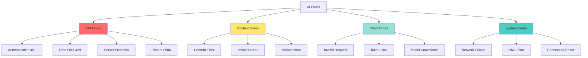

# 📘 **NODEJS AI DEVELOPER MASTERY - Lesson 6: AI Error Handling & Retries**

**Date**: 26-03-18
**Level**: 🟢 Beginner → 🔴 Senior Engineer
**Series**: AI Developer Fundamentals
**Time**: 50 minutes
**Prerequisites**: Lesson 1-5 (SDK, Prompts, Streaming, Validation, Memory)

---

## 🎯 **LEARNING OBJECTIVES**

After completing this **comprehensive** lesson, you will:

1. ✅ **Master Error Classification** - API errors, rate limits, timeouts, content errors
2. ✅ **Implement Retry Patterns** - Exponential backoff, jitter, circuit breakers
3. ✅ **Handle Rate Limiting** - 429 errors, quota management, graceful degradation
4. ✅ **Build Resilience Patterns** - Fallbacks, redundancy, health checks
5. ✅ **Create Error Recovery** - Partial results, cached responses, alternative models
6. ✅ **Implement Monitoring** - Error tracking, alerting, metrics
7. ✅ **Production Error Handling** - User-friendly messages, logging, incident response

---

## 📦 **PART 1: ERROR CLASSIFICATION**

### **OpenAI Error Types**



---

### **Error Type Definitions**

```typescript
// ─────────────────────────────────────────────
// ai/errors/ai-error.types.ts
// ─────────────────────────────────────────────
import {
  APIConnectionError,
  APIConnectionTimeoutError,
  AuthenticationError,
  BadRequestError,
  ConflictError,
  InternalServerError,
  InvalidRequestError,
  NotFoundError,
  PermissionDeniedError,
  RateLimitError,
  UnprocessableEntityError,
} from 'openai/errors';

export enum ErrorCategory {
  AUTHENTICATION = 'AUTHENTICATION',
  RATE_LIMIT = 'RATE_LIMIT',
  NETWORK = 'NETWORK',
  REQUEST = 'REQUEST',
  SERVER = 'SERVER',
  CONTENT = 'CONTENT',
  UNKNOWN = 'UNKNOWN',
}

export enum RetryStrategy {
  IMMEDIATE = 'immediate',      // Retry immediately
  BACKOFF = 'backoff',          // Exponential backoff
  DELAYED = 'delayed',          // Fixed delay
  NONE = 'none',                // Don't retry
}

export interface AiErrorDetails {
  category: ErrorCategory;
  statusCode?: number;
  code?: string;
  message: string;
  retryable: boolean;
  retryAfter?: number;  // Seconds
  suggestion?: string;
  originalError?: any;
}

// ─────────────────────────────────────────────
// Error Classification Map
// ─────────────────────────────────────────────
export const ERROR_CLASSIFICATION: Record<string, AiErrorDetails> = {
  // Authentication Errors (401)
  'invalid_api_key': {
    category: ErrorCategory.AUTHENTICATION,
    statusCode: 401,
    code: 'INVALID_API_KEY',
    message: 'Invalid API key provided',
    retryable: false,
    suggestion: 'Check your OPENAI_API_KEY environment variable',
  },
  'authentication_error': {
    category: ErrorCategory.AUTHENTICATION,
    statusCode: 401,
    code: 'AUTHENTICATION_ERROR',
    message: 'Authentication failed',
    retryable: false,
    suggestion: 'Verify API key and organization ID',
  },

  // Rate Limit Errors (429)
  'rate_limit_exceeded': {
    category: ErrorCategory.RATE_LIMIT,
    statusCode: 429,
    code: 'RATE_LIMIT_EXCEEDED',
    message: 'Rate limit exceeded',
    retryable: true,
    retryAfter: 60,
    suggestion: 'Wait before retrying or upgrade your plan',
  },
  'quota_exceeded': {
    category: ErrorCategory.RATE_LIMIT,
    statusCode: 429,
    code: 'QUOTA_EXCEEDED',
    message: 'Monthly quota exceeded',
    retryable: false,
    suggestion: 'Wait until next billing cycle or upgrade plan',
  },

  // Network Errors
  'connection_error': {
    category: ErrorCategory.NETWORK,
    code: 'CONNECTION_ERROR',
    message: 'Failed to connect to OpenAI API',
    retryable: true,
    retryAfter: 5,
    suggestion: 'Check network connectivity',
  },
  'timeout': {
    category: ErrorCategory.NETWORK,
    code: 'TIMEOUT',
    message: 'Request timed out',
    retryable: true,
    retryAfter: 10,
    suggestion: 'Try again with smaller input or higher timeout',
  },

  // Request Errors (400)
  'invalid_request_error': {
    category: ErrorCategory.REQUEST,
    statusCode: 400,
    code: 'INVALID_REQUEST',
    message: 'Invalid request parameters',
    retryable: false,
    suggestion: 'Check request parameters and format',
  },
  'context_length_exceeded': {
    category: ErrorCategory.REQUEST,
    statusCode: 400,
    code: 'CONTEXT_LENGTH_EXCEEDED',
    message: 'Input exceeds model context window',
    retryable: false,
    suggestion: 'Reduce input length or use a model with larger context',
  },

  // Server Errors (500, 503, 504)
  'api_error': {
    category: ErrorCategory.SERVER,
    statusCode: 500,
    code: 'API_ERROR',
    message: 'OpenAI API error',
    retryable: true,
    retryAfter: 30,
    suggestion: 'Retry after a short delay',
  },
  'overloaded': {
    category: ErrorCategory.SERVER,
    statusCode: 503,
    code: 'SERVICE_UNAVAILABLE',
    message: 'Service temporarily overloaded',
    retryable: true,
    retryAfter: 60,
    suggestion: 'Retry after waiting',
  },
};
```

---

### **Error Classifier Service**

```typescript
// ─────────────────────────────────────────────
// ai/errors/error-classifier.service.ts
// ─────────────────────────────────────────────
import { Injectable, Logger } from '@nestjs/common';
import {
  APIConnectionError,
  APIConnectionTimeoutError,
  AuthenticationError,
  BadRequestError,
  InternalServerError,
  RateLimitError,
} from 'openai/errors';
import {
  AiErrorDetails,
  ErrorCategory,
  RetryStrategy,
  ERROR_CLASSIFICATION,
} from './ai-error.types';

@Injectable()
export class ErrorClassifierService {
  private readonly logger = new Logger(ErrorClassifierService.name);

  // ─────────────────────────────────────────────
  // Classify Error
  // ─────────────────────────────────────────────
  classify(error: any): AiErrorDetails {
    // OpenAI API errors
    if (error instanceof RateLimitError) {
      return this.handleRateLimit(error);
    }

    if (error instanceof AuthenticationError) {
      return {
        category: ErrorCategory.AUTHENTICATION,
        statusCode: error.status,
        code: 'AUTHENTICATION_ERROR',
        message: error.message,
        retryable: false,
        suggestion: 'Verify API key and credentials',
        originalError: error,
      };
    }

    if (error instanceof APIConnectionTimeoutError) {
      return {
        category: ErrorCategory.NETWORK,
        code: 'TIMEOUT',
        message: 'Request timed out',
        retryable: true,
        retryAfter: 10,
        suggestion: 'Retry with exponential backoff',
        originalError: error,
      };
    }

    if (error instanceof APIConnectionError) {
      return {
        category: ErrorCategory.NETWORK,
        code: 'CONNECTION_ERROR',
        message: error.message || 'Connection failed',
        retryable: true,
        retryAfter: 5,
        suggestion: 'Check network and retry',
        originalError: error,
      };
    }

    if (error instanceof BadRequestError) {
      return this.handleBadRequest(error);
    }

    if (error instanceof InternalServerError) {
      return {
        category: ErrorCategory.SERVER,
        statusCode: error.status,
        code: 'SERVER_ERROR',
        message: 'OpenAI server error',
        retryable: true,
        retryAfter: 30,
        suggestion: 'Retry after waiting',
        originalError: error,
      };
    }

    // Check for known error codes
    if (error.code && ERROR_CLASSIFICATION[error.code]) {
      return {
        ...ERROR_CLASSIFICATION[error.code],
        originalError: error,
      };
    }

    // Check for status code patterns
    if (error.status) {
      const statusError = this.classifyByStatus(error.status, error.message);
      if (statusError) {
        return { ...statusError, originalError: error };
      }
    }

    // Unknown error
    return {
      category: ErrorCategory.UNKNOWN,
      code: 'UNKNOWN_ERROR',
      message: error.message || 'An unexpected error occurred',
      retryable: true,  // Default to retryable for unknown errors
      retryAfter: 10,
      suggestion: 'Retry with backoff, check logs for details',
      originalError: error,
    };
  }

  // ─────────────────────────────────────────────
  // Handle Rate Limit
  // ─────────────────────────────────────────────
  private handleRateLimit(error: RateLimitError): AiErrorDetails {
    const retryAfter = this.parseRetryAfter(error.headers);

    // Check if it's quota vs rate limit
    const isQuota = error.message?.includes('quota') ||
                   error.message?.includes('monthly');

    return {
      category: ErrorCategory.RATE_LIMIT,
      statusCode: error.status,
      code: isQuota ? 'QUOTA_EXCEEDED' : 'RATE_LIMIT_EXCEEDED',
      message: error.message,
      retryable: !isQuota,
      retryAfter: retryAfter || (isQuota ? undefined : 60),
      suggestion: isQuota
        ? 'Monthly quota exceeded. Upgrade plan or wait for reset'
        : 'Rate limit exceeded. Wait before retrying',
      originalError: error,
    };
  }

  // ─────────────────────────────────────────────
  // Handle Bad Request
  // ─────────────────────────────────────────────
  private handleBadRequest(error: BadRequestError): AiErrorDetails {
    const message = error.message || 'Invalid request';

    // Check for specific bad request types
    if (message.includes('context') || message.includes('token')) {
      return {
        category: ErrorCategory.REQUEST,
        statusCode: error.status,
        code: 'CONTEXT_LENGTH_EXCEEDED',
        message: 'Input exceeds model context window',
        retryable: false,
        suggestion: 'Reduce input length or truncate messages',
        originalError: error,
      };
    }

    if (message.includes('function') || message.includes('tool')) {
      return {
        category: ErrorCategory.REQUEST,
        statusCode: error.status,
        code: 'INVALID_FUNCTION_CALL',
        message: 'Invalid function/tool call format',
        retryable: false,
        suggestion: 'Check function definitions and parameters',
        originalError: error,
      };
    }

    return {
      category: ErrorCategory.REQUEST,
      statusCode: error.status,
      code: 'INVALID_REQUEST',
      message: message,
      retryable: false,
      suggestion: 'Review request parameters',
      originalError: error,
    };
  }

  // ─────────────────────────────────────────────
  // Classify by Status Code
  // ─────────────────────────────────────────────
  private classifyByStatus(status: number, message: string): AiErrorDetails | null {
    switch (status) {
      case 401:
        return {
          category: ErrorCategory.AUTHENTICATION,
          statusCode: 401,
          code: 'AUTHENTICATION_ERROR',
          message: message || 'Authentication failed',
          retryable: false,
        };

      case 429:
        return {
          category: ErrorCategory.RATE_LIMIT,
          statusCode: 429,
          code: 'RATE_LIMIT_EXCEEDED',
          message: message || 'Rate limit exceeded',
          retryable: true,
          retryAfter: 60,
        };

      case 500:
      case 502:
      case 503:
      case 504:
        return {
          category: ErrorCategory.SERVER,
          statusCode: status,
          code: 'SERVER_ERROR',
          message: message || 'Server error',
          retryable: true,
          retryAfter: 30,
        };

      default:
        return null;
    }
  }

  // ─────────────────────────────────────────────
  // Parse Retry-After Header
  // ─────────────────────────────────────────────
  private parseRetryAfter(headers: any): number | undefined {
    if (!headers) return undefined;

    const retryAfter = headers['retry-after'];
    if (!retryAfter) return undefined;

    // Could be seconds or HTTP date
    const seconds = parseInt(retryAfter, 10);
    if (!isNaN(seconds)) {
      return seconds;
    }

    // Try parsing as date
    const date = new Date(retryAfter);
    if (!isNaN(date.getTime())) {
      return Math.ceil((date.getTime() - Date.now()) / 1000);
    }

    return undefined;
  }

  // ─────────────────────────────────────────────
  // Get Retry Strategy
  // ─────────────────────────────────────────────
  getRetryStrategy(errorDetails: AiErrorDetails): RetryStrategy {
    if (!errorDetails.retryable) {
      return RetryStrategy.NONE;
    }

    switch (errorDetails.category) {
      case ErrorCategory.RATE_LIMIT:
        return RetryStrategy.DELAYED;

      case ErrorCategory.NETWORK:
        return RetryStrategy.BACKOFF;

      case ErrorCategory.SERVER:
        return RetryStrategy.BACKOFF;

      default:
        return RetryStrategy.BACKOFF;
    }
  }
}
```

---

## 📦 **PART 2: RETRY PATTERNS**

### **Exponential Backoff with Jitter**

```typescript
// ─────────────────────────────────────────────
// ai/retry/retry.service.ts
// ─────────────────────────────────────────────
import { Injectable, Logger } from '@nestjs/common';
import { ErrorClassifierService } from '../errors/error-classifier.service';
import { AiErrorDetails, RetryStrategy } from '../errors/ai-error.types';

export interface RetryConfig {
  maxAttempts: number;
  baseDelay: number;      // milliseconds
  maxDelay: number;       // milliseconds
  jitter: boolean;
  onRetry?: (attempt: number, error: any, delay: number) => void;
}

@Injectable()
export class RetryService {
  private readonly logger = new Logger(RetryService.name);

  constructor(
    private errorClassifier: ErrorClassifierService,
  ) {}

  // ─────────────────────────────────────────────
  // Execute with Retry
  // ─────────────────────────────────────────────
  async executeWithRetry<T>(
    operation: () => Promise<T>,
    context: string,
    config: RetryConfig = {
      maxAttempts: 3,
      baseDelay: 1000,
      maxDelay: 30000,
      jitter: true,
    },
  ): Promise<T> {
    const { maxAttempts, baseDelay, maxDelay, jitter, onRetry } = config;

    let lastError: any;
    let lastErrorDetails: AiErrorDetails | undefined;

    for (let attempt = 1; attempt <= maxAttempts; attempt++) {
      try {
        return await operation();
      } catch (error) {
        lastError = error;
        lastErrorDetails = this.errorClassifier.classify(error);

        this.logger.warn(
          `${context} - Attempt ${attempt}/${maxAttempts} failed: ` +
          `${lastErrorDetails.category} - ${lastErrorDetails.message}`,
        );

        // Don't retry non-retryable errors
        if (!lastErrorDetails.retryable) {
          this.logger.error(
            `${context} - Non-retryable error: ${lastErrorDetails.code}`,
          );
          throw error;
        }

        // Don't retry if max attempts reached
        if (attempt === maxAttempts) {
          this.logger.error(
            `${context} - Max retry attempts (${maxAttempts}) exhausted`,
          );
          break;
        }

        // Calculate delay
        const delay = this.calculateDelay(
          attempt,
          baseDelay,
          maxDelay,
          jitter,
          lastErrorDetails.retryAfter,
        );

        this.logger.log(
          `${context} - Retrying in ${Math.round(delay)}ms...`,
        );

        // Call retry callback if provided
        if (onRetry) {
          onRetry(attempt, error, delay);
        }

        await new Promise(resolve => setTimeout(resolve, delay));
      }
    }

    // All retries exhausted
    throw lastError;
  }

  // ─────────────────────────────────────────────
  // Calculate Delay with Exponential Backoff
  // ─────────────────────────────────────────────
  private calculateDelay(
    attempt: number,
    baseDelay: number,
    maxDelay: number,
    jitter: boolean,
    retryAfter?: number,
  ): number {
    // If Retry-After header provided, use it
    if (retryAfter && attempt === 1) {
      return Math.min(retryAfter * 1000, maxDelay);
    }

    // Exponential backoff: baseDelay * 2^(attempt-1)
    const exponentialDelay = baseDelay * Math.pow(2, attempt - 1);

    // Add jitter if enabled (±25% randomization)
    let delay = exponentialDelay;
    if (jitter) {
      const jitterRange = exponentialDelay * 0.25;
      delay = exponentialDelay + (Math.random() - 0.5) * 2 * jitterRange;
    }

    // Clamp to max delay
    return Math.min(Math.max(delay, 0), maxDelay);
  }

  // ─────────────────────────────────────────────
  // Execute with Circuit Breaker
  // ─────────────────────────────────────────────
  private circuitState: 'closed' | 'open' | 'half-open' = 'closed';
  private failureCount = 0;
  private readonly failureThreshold = 5;
  private readonly resetTimeout = 60000;
  private lastFailureTime?: number;

  async executeWithCircuitBreaker<T>(
    operation: () => Promise<T>,
    context: string,
  ): Promise<T> {
    // Check circuit state
    if (this.circuitState === 'open') {
      // Check if we should try half-open
      if (Date.now() - (this.lastFailureTime || 0) > this.resetTimeout) {
        this.circuitState = 'half-open';
        this.logger.log(`${context} - Circuit breaker half-open, testing...`);
      } else {
        throw new Error(
          `${context} - Circuit breaker open. Service unavailable.`,
        );
      }
    }

    try {
      const result = await operation();
      this.onSuccess();
      return result;
    } catch (error) {
      this.onFailure();
      throw error;
    }
  }

  private onSuccess(): void {
    this.failureCount = 0;
    this.circuitState = 'closed';
  }

  private onFailure(): void {
    this.failureCount++;
    this.lastFailureTime = Date.now();

    if (this.failureCount >= this.failureThreshold) {
      this.circuitState = 'open';
      this.logger.warn(
        `Circuit breaker opened after ${this.failureCount} failures`,
      );
    }
  }

  // ─────────────────────────────────────────────
  // Get Circuit State
  // ─────────────────────────────────────────────
  getCircuitState(): 'closed' | 'open' | 'half-open' {
    return this.circuitState;
  }
}
```

---

### **Retry with Fallback Strategy**

```typescript
// ─────────────────────────────────────────────
// ai/retry/fallback.strategy.ts
// ─────────────────────────────────────────────
import { Injectable } from '@nestjs/common';
import { RetryService } from './retry.service';

export interface FallbackConfig<T> {
  primary: () => Promise<T>;
  fallbacks: Array<() => Promise<T>>;
  maxRetries?: number;
  shouldFallback?: (error: any) => boolean;
}

@Injectable()
export class FallbackStrategyService {
  constructor(
    private retryService: RetryService,
  ) {}

  // ─────────────────────────────────────────────
  // Execute with Fallback Chain
  // ─────────────────────────────────────────────
  async executeWithFallback<T>(
    config: FallbackConfig<T>,
    context: string = 'Operation',
  ): Promise<T> {
    const { primary, fallbacks, maxRetries = 3, shouldFallback } = config;

    // Try primary
    try {
      return await this.retryService.executeWithRetry(
        primary,
        `${context} (Primary)`,
        { maxAttempts: maxRetries },
      );
    } catch (error) {
      // Check if we should try fallbacks
      if (shouldFallback && !shouldFallback(error)) {
        throw error;  // Don't fallback for this error
      }

      console.warn(`${context} - Primary failed, trying fallbacks...`);
    }

    // Try each fallback in order
    for (let i = 0; i < fallbacks.length; i++) {
      try {
        console.log(`${context} - Trying fallback ${i + 1}/${fallbacks.length}`);

        return await this.retryService.executeWithRetry(
          fallbacks[i],
          `${context} (Fallback ${i + 1})`,
          { maxAttempts: 2 },
        );
      } catch (error) {
        console.warn(
          `${context} - Fallback ${i + 1} failed: ${error.message}`,
        );

        // Continue to next fallback
      }
    }

    // All fallbacks exhausted
    throw new Error(
      `${context} - All primary and fallback options exhausted`,
    );
  }

  // ─────────────────────────────────────────────
  // Model Fallback (GPT-4 → GPT-3.5)
  // ─────────────────────────────────────────────
  async chatWithModelFallback(
    messages: any[],
    options: {
      primaryModel?: string;
      fallbackModels?: string[];
    } = {},
  ): Promise<string> {
    const primaryModel = options.primaryModel || 'gpt-4-turbo-preview';
    const fallbackModels = options.fallbackModels || [
      'gpt-4-turbo',
      'gpt-3.5-turbo',
    ];

    return this.executeWithFallback(
      {
        primary: async () => {
          // Primary model call
          // return chatService.complete(messages, { model: primaryModel });
          return 'Primary response';
        },
        fallbacks: fallbackModels.map(model => async () => {
          // Fallback model call
          // return chatService.complete(messages, { model });
          return `Fallback response from ${model}`;
        }),
      },
      'Chat Completion',
    );
  }

  // ─────────────────────────────────────────────
  // Provider Fallback (OpenAI → Anthropic → Local)
  // ─────────────────────────────────────────────
  async chatWithProviderFallback(
    messages: any[],
    options: {
      temperature?: number;
      maxTokens?: number;
    } = {},
  ): Promise<string> {
    return this.executeWithFallback(
      {
        primary: async () => {
          // OpenAI
          // return openAIService.chat(messages, options);
          return 'OpenAI response';
        },
        fallbacks: [
          async () => {
            // Anthropic
            // return anthropicService.chat(messages, options);
            return 'Anthropic response';
          },
          async () => {
            // Local model (Ollama)
            // return ollamaService.chat(messages, options);
            return 'Local model response';
          },
        ],
      },
      'Multi-Provider Chat',
    );
  }

  // ─────────────────────────────────────────────
  // Cache Fallback
  // ─────────────────────────────────────────────
  async getWithCacheFallback<T>(
    cacheKey: string,
    fetcher: () => Promise<T>,
    cacheService: any,
  ): Promise<T> {
    return this.executeWithFallback(
      {
        primary: async () => {
          const cached = await cacheService.get<T>(cacheKey);
          if (!cached) {
            throw new Error('Cache miss');
          }
          return cached;
        },
        fallbacks: [
          async () => {
            const fresh = await fetcher();
            // Optionally cache the result
            await cacheService.set(cacheKey, fresh);
            return fresh;
          },
        ],
        shouldFallback: (error) => error.message === 'Cache miss',
      },
      'Cache Fetch',
    );
  }
}
```

---

## 📦 **PART 3: RATE LIMITING & QUOTA MANAGEMENT**

### **Client-Side Rate Limiting**

```typescript
// ─────────────────────────────────────────────
// ai/rate-limit/client-rate-limiter.service.ts
// ─────────────────────────────────────────────
import { Injectable, Logger } from '@nestjs/common';

export interface RateLimitConfig {
  maxRequests: number;
  windowMs: number;  // Time window in milliseconds
}

@Injectable()
export class ClientRateLimiterService {
  private readonly logger = new Logger(ClientRateLimiterService.name);
  private readonly requestLog = new Map<string, number[]>();

  // ─────────────────────────────────────────────
  // Check Rate Limit
  // ─────────────────────────────────────────────
  async checkLimit(
    key: string,
    config: RateLimitConfig,
  ): Promise<{
    allowed: boolean;
    remaining: number;
    resetAt: number;
    retryAfter?: number;
  }> {
    const now = Date.now();
    const windowStart = now - config.windowMs;

    // Get existing requests
    const requests = this.requestLog.get(key) || [];

    // Remove old requests outside window
    const validRequests = requests.filter(time => time > windowStart);

    // Check if under limit
    if (validRequests.length < config.maxRequests) {
      // Add current request
      validRequests.push(now);
      this.requestLog.set(key, validRequests);

      return {
        allowed: true,
        remaining: config.maxRequests - validRequests.length,
        resetAt: now + config.windowMs,
      };
    }

    // Rate limited
    const oldestRequest = Math.min(...validRequests);
    const resetAt = oldestRequest + config.windowMs;
    const retryAfter = Math.ceil((resetAt - now) / 1000);

    return {
      allowed: false,
      remaining: 0,
      resetAt,
      retryAfter,
    };
  }

  // ─────────────────────────────────────────────
  // Wait for Rate Limit
  // ─────────────────────────────────────────────
  async waitForLimit(
    key: string,
    config: RateLimitConfig,
  ): Promise<void> {
    let attempts = 0;
    const maxAttempts = 10;

    while (attempts < maxAttempts) {
      const result = await this.checkLimit(key, config);

      if (result.allowed) {
        return;
      }

      attempts++;
      this.logger.log(
        `Rate limited. Waiting ${result.retryAfter}s... (attempt ${attempts}/${maxAttempts})`,
      );

      await new Promise(resolve =>
        setTimeout(resolve, (result.retryAfter || 1) * 1000),
      );
    }

    throw new Error(
      `Could not acquire rate limit slot after ${maxAttempts} attempts`,
    );
  }

  // ─────────────────────────────────────────────
  // Cleanup Old Entries
  // ─────────────────────────────────────────────
  cleanup(): void {
    const now = Date.now();
    const maxAge = 60000;  // 1 minute

    for (const [key, times] of this.requestLog.entries()) {
      const validTimes = times.filter(t => now - t < maxAge);
      if (validTimes.length === 0) {
        this.requestLog.delete(key);
      } else {
        this.requestLog.set(key, validTimes);
      }
    }
  }
}
```

---

### **Quota Tracking Service**

```typescript
// ─────────────────────────────────────────────
// ai/quota/quota-tracker.service.ts
// ─────────────────────────────────────────────
import { Injectable, Logger } from '@nestjs/common';

export interface QuotaConfig {
  dailyLimit: number;     // dollars
  monthlyLimit: number;   // dollars
  requestsPerMinute: number;
  requestsPerDay: number;
}

export interface UsageRecord {
  userId: string;
  date: string;  // YYYY-MM-DD
  tokens: number;
  cost: number;
  requests: number;
}

@Injectable()
export class QuotaTrackerService {
  private readonly logger = new Logger(QuotaTrackerService.name);
  private readonly usageCache = new Map<string, UsageRecord>();

  // ─────────────────────────────────────────────
  // Track Usage
  // ─────────────────────────────────────────────
  async trackUsage(
    userId: string,
    tokens: number,
    cost: number,
  ): Promise<void> {
    const today = new Date().toISOString().split('T')[0];
    const key = `${userId}:${today}`;

    let record = this.usageCache.get(key) || {
      userId,
      date: today,
      tokens: 0,
      cost: 0,
      requests: 0,
    };

    record.tokens += tokens;
    record.cost += cost;
    record.requests += 1;

    this.usageCache.set(key, record);

    // Check limits
    await this.checkLimits(userId, record);
  }

  // ─────────────────────────────────────────────
  // Check Quota Limits
  // ─────────────────────────────────────────────
  async checkLimits(
    userId: string,
    currentUsage: UsageRecord,
    config: QuotaConfig = {
      dailyLimit: 10,
      monthlyLimit: 100,
      requestsPerMinute: 60,
      requestsPerDay: 10000,
    },
  ): Promise<{
    withinLimits: boolean;
    warnings: string[];
  }> {
    const warnings: string[] = [];

    // Check daily limit
    if (currentUsage.cost > config.dailyLimit * 0.8) {
      warnings.push(
        `Approaching daily limit: $${currentUsage.cost.toFixed(2)} / $${config.dailyLimit}`,
      );
    }

    if (currentUsage.cost > config.dailyLimit) {
      this.logger.warn(
        `User ${userId} exceeded daily limit: $${currentUsage.cost.toFixed(2)}`,
      );
    }

    // Check requests per day
    if (currentUsage.requests > config.requestsPerDay * 0.8) {
      warnings.push(
        `Approaching daily request limit: ${currentUsage.requests} / ${config.requestsPerDay}`,
      );
    }

    // Check monthly limit (would need to aggregate)
    const monthlyUsage = await this.getMonthlyUsage(userId);
    if (monthlyUsage.cost > config.monthlyLimit * 0.8) {
      warnings.push(
        `Approaching monthly limit: $${monthlyUsage.cost.toFixed(2)} / $${config.monthlyLimit}`,
      );
    }

    return {
      withinLimits: currentUsage.cost <= config.dailyLimit,
      warnings,
    };
  }

  // ─────────────────────────────────────────────
  // Get Monthly Usage
  // ─────────────────────────────────────────────
  async getMonthlyUsage(userId: string): Promise<{
    tokens: number;
    cost: number;
    requests: number;
  }> {
    const today = new Date();
    const firstDayOfMonth = new Date(today.getFullYear(), today.getMonth(), 1);

    let totalTokens = 0;
    let totalCost = 0;
    let totalRequests = 0;

    for (const [key, record] of this.usageCache.entries()) {
      if (key.startsWith(`${userId}:`)) {
        const recordDate = new Date(record.date);
        if (recordDate >= firstDayOfMonth) {
          totalTokens += record.tokens;
          totalCost += record.cost;
          totalRequests += record.requests;
        }
      }
    }

    return {
      tokens: totalTokens,
      cost: totalCost,
      requests: totalRequests,
    };
  }

  // ─────────────────────────────────────────────
  // Get Usage Report
  // ─────────────────────────────────────────────
  async getUsageReport(
    userId: string,
    days: number = 30,
  ): Promise<{
    dailyUsage: UsageRecord[];
    totalTokens: number;
    totalCost: number;
    averageDailyCost: number;
    projectedMonthlyCost: number;
  }> {
    const today = new Date();
    const startDate = new Date(today);
    startDate.setDate(startDate.getDate() - days);

    const dailyUsage: UsageRecord[] = [];
    let totalTokens = 0;
    let totalCost = 0;

    for (const [key, record] of this.usageCache.entries()) {
      if (key.startsWith(`${userId}:`)) {
        const recordDate = new Date(record.date);
        if (recordDate >= startDate) {
          dailyUsage.push(record);
          totalTokens += record.tokens;
          totalCost += record.cost;
        }
      }
    }

    dailyUsage.sort((a, b) => a.date.localeCompare(b.date));

    return {
      dailyUsage,
      totalTokens,
      totalCost,
      averageDailyCost: totalCost / Math.max(dailyUsage.length, 1),
      projectedMonthlyCost: (totalCost / Math.max(dailyUsage.length, 1)) * 30,
    };
  }
}
```

---

## 📦 **PART 4: MONITORING & ALERTING**

### **Error Tracking Service**

```typescript
// ─────────────────────────────────────────────
// ai/monitoring/error-tracker.service.ts
// ─────────────────────────────────────────────
import { Injectable, Logger } from '@nestjs/common';
import { ErrorCategory, AiErrorDetails } from '../errors/ai-error.types';

export interface ErrorMetric {
  timestamp: Date;
  category: ErrorCategory;
  code: string;
  context: string;
  userId?: string;
  retryable: boolean;
  resolved: boolean;
}

@Injectable()
export class ErrorTrackerService {
  private readonly logger = new Logger(ErrorTrackerService.name);
  private readonly errorLog: ErrorMetric[] = [];
  private readonly errorCounts = new Map<string, number>();

  // ─────────────────────────────────────────────
  // Track Error
  // ─────────────────────────────────────────────
  track(
    errorDetails: AiErrorDetails,
    context: string,
    userId?: string,
  ): void {
    const metric: ErrorMetric = {
      timestamp: new Date(),
      category: errorDetails.category,
      code: errorDetails.code,
      context,
      userId,
      retryable: errorDetails.retryable,
      resolved: false,
    };

    this.errorLog.push(metric);

    // Update counts
    const key = `${errorDetails.category}:${errorDetails.code}`;
    const count = this.errorCounts.get(key) || 0;
    this.errorCounts.set(key, count + 1);

    // Log error
    this.logger.error(
      `[${errorDetails.category}] ${errorDetails.code}: ${errorDetails.message} ` +
      `(Context: ${context})`,
    );

    // Check for alert conditions
    this.checkAlerts(metric);
  }

  // ─────────────────────────────────────────────
  // Check Alert Conditions
  // ─────────────────────────────────────────────
  private checkAlerts(metric: ErrorMetric): void {
    const key = `${metric.category}:${metric.code}`;
    const count = this.errorCounts.get(key) || 0;

    // Alert on high error rate
    if (count >= 10) {
      this.logger.error(
        `🚨 ALERT: High error rate detected for ${key} (${count} errors)`,
      );
      // Send to monitoring service (Sentry, DataDog, etc.)
    }

    // Alert on authentication errors (security concern)
    if (metric.category === ErrorCategory.AUTHENTICATION) {
      this.logger.warn(
        `⚠️ SECURITY: Authentication error for user ${metric.userId || 'unknown'}`,
      );
    }

    // Alert on repeated rate limits
    if (metric.category === ErrorCategory.RATE_LIMIT && count >= 5) {
      this.logger.warn(
        `⚠️ RATE LIMIT: User ${metric.userId} hitting rate limits frequently`,
      );
    }
  }

  // ─────────────────────────────────────────────
  // Get Error Statistics
  // ─────────────────────────────────────────────
  getStatistics(hours: number = 24): {
    totalErrors: number;
    byCategory: Record<string, number>;
    byCode: Record<string, number>;
    retryableCount: number;
    resolvedCount: number;
  }> {
    const cutoff = new Date(Date.now() - hours * 60 * 60 * 1000);
    const recentErrors = this.errorLog.filter(e => e.timestamp > cutoff);

    const byCategory: Record<string, number> = {};
    const byCode: Record<string, number> = {};
    let retryableCount = 0;
    let resolvedCount = 0;

    for (const error of recentErrors) {
      byCategory[error.category] = (byCategory[error.category] || 0) + 1;
      byCode[error.code] = (byCode[error.code] || 0) + 1;

      if (error.retryable) retryableCount++;
      if (error.resolved) resolvedCount++;
    }

    return {
      totalErrors: recentErrors.length,
      byCategory,
      byCode,
      retryableCount,
      resolvedCount,
    };
  }

  // ─────────────────────────────────────────────
  // Get Error Rate
  // ─────────────────────────────────────────────
  getErrorRate(minutes: number = 5): number {
    const cutoff = new Date(Date.now() - minutes * 60 * 1000);
    const recentErrors = this.errorLog.filter(e => e.timestamp > cutoff);

    return recentErrors.length / minutes;  // Errors per minute
  }
}
```

---

## ✅ **ERROR HANDLING CHECKLIST**

```
Error Classification
[ ] All error types categorized
[ ] Retryable vs non-retryable identified
[ ] Error messages user-friendly
[ ] Suggestions provided

Retry Patterns
[ ] Exponential backoff implemented
[ ] Jitter added to prevent thundering herd
[ ] Max retries configured
[ ] Circuit breaker pattern used

Rate Limiting
[ ] Client-side rate limiting
[ ] Quota tracking per user
[ ] Graceful degradation
[ ] Usage alerts configured

Fallbacks
[ ] Model fallback (GPT-4 → GPT-3.5)
[ ] Provider fallback configured
[ ] Cache fallback implemented
[ ] Default responses for critical paths

Monitoring
[ ] Error tracking enabled
[ ] Alert thresholds defined
[ ] Error rate monitoring
[ ] Statistics dashboard
```

---

## 🎯 **KNOWLEDGE CHECK**

### **Question 1: Which Errors Should You Retry?**

<details>
<summary>💡 Click to reveal answer</summary>

**Retry These**:
- ✅ Rate limit (429) - with delay from Retry-After header
- ✅ Network timeout - with exponential backoff
- ✅ Server errors (500, 502, 503, 504) - with backoff
- ✅ Connection errors - with backoff

**Don't Retry**:
- ❌ Authentication (401) - fix the API key
- ❌ Bad request (400) - fix the request
- ❌ Quota exceeded - wait for reset or upgrade
- ❌ Content filter violations - modify input
</details>

---

### **Question 2: What's the Purpose of Jitter?**

<details>
<summary>💡 Click to reveal answer</summary>

**Jitter prevents the "thundering herd" problem**:

Without jitter, all clients retry at the same time after backoff:
- T=0: All fail
- T=1s: All retry → overload → fail
- T=2s: All retry → overload → fail

With jitter (±25% randomization):
- T=0: All fail
- T=0.8s, 1.1s, 1.3s, 0.9s: Clients retry spread out
- ✅ Server recovers

**Jitter = kindness to overloaded servers!**
</details>

---

## 📚 **ADDITIONAL RESOURCES**

- **OpenAI Error Handling**: [https://platform.openai.com/docs/guides/error-codes](https://platform.openai.com/docs/guides/error-codes)
- **Circuit Breaker Pattern**: [https://microservices.io/patterns/reliability/circuit-breaker.html](https://microservices.io/patterns/reliability/circuit-breaker.html)
- **Exponential Backoff**: [https://aws.amazon.com/blogs/architecture/exponential-backoff-and-jitter](https://aws.amazon.com/blogs/architecture/exponential-backoff-and-jitter)

---

## 🎓 **HOMEWORK**

1. ✅ Implement error classifier service
2. ✅ Build retry with exponential backoff
3. ✅ Add circuit breaker pattern
4. ✅ Create fallback chain (models, providers)
5. ✅ Implement client-side rate limiting
6. ✅ Build quota tracking system
7. ✅ Set up error monitoring
8. ✅ Configure alerts for critical errors

---

**Next Lesson**: Function Calling Fundamentals - Teaching AI to Use Your APIs
**Date**: 26-03-18
**Status**: ✅ Complete

---
*26-03-18*
