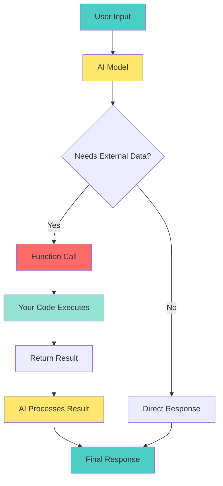
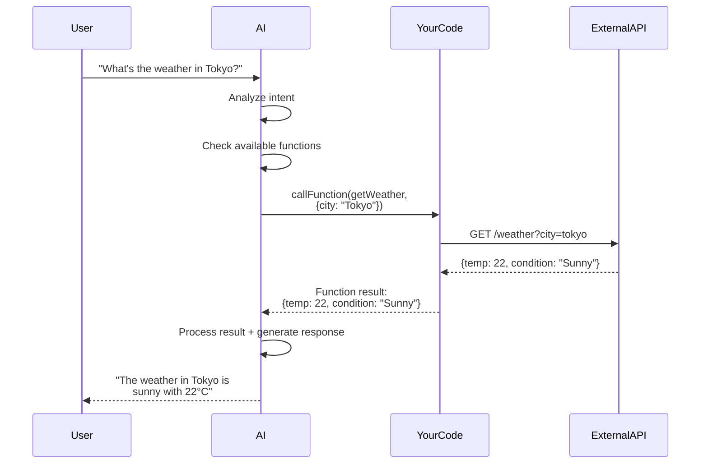

# 📘 **NODEJS AI DEVELOPER MASTERY - Lesson 7: Function Calling Fundamentals**

**Date**: 26-03-18
**Level**: 🟢 Beginner → 🔴 Senior Engineer
**Series**: AI Developer Fundamentals - Part 2
**Time**: 60 minutes
**Prerequisites**: Lesson 1-6 (AI Foundations complete)

---

## 🎯 **LEARNING OBJECTIVES**

After completing this **comprehensive** lesson, you will:

1. ✅ **Understand Function Calling** - What it is, why it matters, use cases
2. ✅ **Master Function Schema Design** - Parameters, types, descriptions
3. ✅ **Implement Single Function Calls** - Basic patterns, error handling
4. ✅ **Master Multiple Function Calls** - Parallel execution, AI selection
5. ✅ **Handle Function Results** - Response formatting, result injection
6. ✅ **Build Real-World Functions** - API calls, database queries, calculations
7. ✅ **Production Patterns** - Validation, security, monitoring

---

## 📦 **PART 1: FUNCTION CALLING CONCEPTS**

### **What is Function Calling?**



**Function Calling Enables AI To**:
- ✅ **Call your APIs** - Get real-time data
- ✅ **Query databases** - Access user data, products, orders
- ✅ **Perform calculations** - Math, conversions, analysis
- ✅ **Execute actions** - Send emails, create records, trigger workflows
- ✅ **Use external tools** - Search, maps, weather, payment

---

### **Function Calling Flow**



---

## 📦 **PART 2: FUNCTION SCHEMA DESIGN**

### **Function Definition Structure**

```typescript
// ─────────────────────────────────────────────
// Function Schema Interface
// ─────────────────────────────────────────────
interface FunctionDefinition {
  name: string;
  description: string;
  parameters: {
    type: 'object';
    properties: Record<string, ParameterDefinition>;
    required?: string[];
  };
}

interface ParameterDefinition {
  type: 'string' | 'number' | 'boolean' | 'object' | 'array';
  description: string;
  enum?: string[];
  items?: ParameterDefinition;  // For arrays
  properties?: Record<string, ParameterDefinition>;  // For objects
}

// ─────────────────────────────────────────────
// Example: Weather Function
// ─────────────────────────────────────────────
const getWeatherFunction: FunctionDefinition = {
  name: 'getWeather',
  description: 'Get current weather for a specified location',
  parameters: {
    type: 'object',
    properties: {
      city: {
        type: 'string',
        description: 'City name (e.g., "Tokyo", "New York")',
      },
      country: {
        type: 'string',
        description: 'Country code (e.g., "JP", "US")',
      },
      units: {
        type: 'string',
        description: 'Temperature units',
        enum: ['celsius', 'fahrenheit'],
      },
    },
    required: ['city'],
  },
};

// ─────────────────────────────────────────────
// Example: Database Query Function
// ─────────────────────────────────────────────
const queryUsersFunction: FunctionDefinition = {
  name: 'queryUsers',
  description: 'Search for users in the database',
  parameters: {
    type: 'object',
    properties: {
      email: {
        type: 'string',
        description: 'Filter by email address (partial match)',
      },
      status: {
        type: 'string',
        description: 'Filter by account status',
        enum: ['active', 'inactive', 'suspended', 'all'],
      },
      createdAfter: {
        type: 'string',
        description: 'Filter by creation date (ISO 8601 format)',
      },
      limit: {
        type: 'number',
        description: 'Maximum number of results to return',
      },
      offset: {
        type: 'number',
        description: 'Number of results to skip for pagination',
      },
    },
    required: [],
  },
};

// ─────────────────────────────────────────────
// Example: Complex Nested Function
// ─────────────────────────────────────────────
const createOrderFunction: FunctionDefinition = {
  name: 'createOrder',
  description: 'Create a new order with multiple items',
  parameters: {
    type: 'object',
    properties: {
      userId: {
        type: 'string',
        description: 'ID of the user placing the order',
      },
      items: {
        type: 'array',
        description: 'List of items in the order',
        items: {
          type: 'object',
          properties: {
            productId: {
              type: 'string',
              description: 'Product identifier',
            },
            quantity: {
              type: 'number',
              description: 'Quantity to order',
            },
            size: {
              type: 'string',
              description: 'Product size',
              enum: ['XS', 'S', 'M', 'L', 'XL', 'XXL'],
            },
          },
          required: ['productId', 'quantity'],
        },
      },
      shippingAddress: {
        type: 'object',
        description: 'Shipping address details',
        properties: {
          street: {
            type: 'string',
            description: 'Street address',
          },
          city: {
            type: 'string',
            description: 'City name',
          },
          postalCode: {
            type: 'string',
            description: 'Postal/ZIP code',
          },
          country: {
            type: 'string',
            description: 'Country code',
          },
        },
        required: ['street', 'city', 'postalCode', 'country'],
      },
      notes: {
        type: 'string',
        description: 'Special instructions or notes',
      },
    },
    required: ['userId', 'items', 'shippingAddress'],
  },
};
```

---

### **Schema Design Best Practices**

```typescript
// ─────────────────────────────────────────────
// Best Practices for Function Schemas
// ─────────────────────────────────────────────

// ✅ DO: Write clear, specific descriptions
const goodSchema = {
  name: 'calculateShipping',
  description: 'Calculate shipping cost based on weight, dimensions, and destination',
  parameters: {
    type: 'object',
    properties: {
      weight: {
        type: 'number',
        description: 'Package weight in kilograms',  // ✅ Clear units
      },
      destination: {
        type: 'string',
        description: 'Destination country code (ISO 3166-1 alpha-2)',  // ✅ Specific format
      },
    },
    required: ['weight', 'destination'],
  },
};

// ❌ DON'T: Vague descriptions
const badSchema = {
  name: 'calcShipping',
  description: 'Calculate shipping',  // ❌ Too vague
  parameters: {
    type: 'object',
    properties: {
      weight: {
        type: 'number',
        description: 'Weight',  // ❌ No units
      },
      dest: {
        type: 'string',
        description: 'Destination',  // ❌ No format
      },
    },
    required: ['weight', 'dest'],
  },
};

// ✅ DO: Use enums for constrained values
const statusFilter = {
  type: 'string',
  description: 'Order status to filter by',
  enum: ['pending', 'processing', 'shipped', 'delivered', 'cancelled'],
};

// ✅ DO: Provide examples in descriptions
const dateParam = {
  type: 'string',
  description: 'Start date in ISO 8601 format (e.g., "2024-01-15T10:30:00Z")',
};

// ✅ DO: Mark truly required fields
const userParams = {
  type: 'object',
  properties: {
    email: { type: 'string', description: 'User email' },
    name: { type: 'string', description: 'User name' },
  },
  required: ['email'],  // Only email is required
};
```

---

## 📦 **PART 3: SINGLE FUNCTION CALLS**

### **Basic Function Calling Service**

```typescript
// ─────────────────────────────────────────────
// ai/function-calling/function-caller.service.ts
// ─────────────────────────────────────────────
import { Injectable, Inject, Logger } from '@nestjs/common';
import { ConfigService } from '@nestjs/config';
import { OpenAI } from 'openai';
import { AiService } from '../ai.service';

export interface FunctionHandler<T = any> {
  name: string;
  description: string;
  parameters: object;
  handler: (args: T) => Promise<any>;
}

@Injectable()
export class FunctionCallerService extends AiService {
  private readonly logger = new Logger(FunctionCallerService.name);
  private readonly functions = new Map<string, FunctionHandler>();

  constructor(
    @Inject('OPENAI_CLIENT') protected readonly client: OpenAI,
    protected readonly configService: ConfigService,
  ) {
    super(client, configService);
  }

  // ─────────────────────────────────────────────
  // Register Function
  // ─────────────────────────────────────────────
  registerFunction(handler: FunctionHandler): void {
    if (this.functions.has(handler.name)) {
      this.logger.warn(`Function "${handler.name}" already registered. Overwriting.`);
    }
    this.functions.set(handler.name, handler);
    this.logger.log(`Registered function: ${handler.name}`);
  }

  // ─────────────────────────────────────────────
  // Execute Single Function Call
  // ─────────────────────────────────────────────
  async executeFunction(
    prompt: string,
    functionName: string,
    options: {
      model?: string;
      temperature?: number;
      maxTokens?: number;
    } = {},
  ): Promise<any> {
    const handler = this.functions.get(functionName);

    if (!handler) {
      throw new Error(`Function "${functionName}" not registered`);
    }

    const model = options.model || 'gpt-4-turbo-preview';

    // Step 1: Get AI to call the function
    const response = await this.client.chat.completions.create({
      model,
      messages: [
        {
          role: 'system',
          content: `You are a helpful assistant. Use the "${functionName}" function to help the user.
${handler.description}`,
        },
        {
          role: 'user',
          content: prompt,
        },
      ],
      temperature: options.temperature ?? 0,
      tools: [
        {
          type: 'function',
          function: {
            name: handler.name,
            description: handler.description,
            parameters: handler.parameters,
          },
        },
      ],
      tool_choice: {
        type: 'function',
        function: { name: functionName },
      },
    });

    const message = response.choices[0]?.message;
    const toolCall = message?.tool_calls?.[0];

    // Step 2: Validate AI called the function
    if (!toolCall) {
      throw new Error('AI did not call the specified function');
    }

    if (toolCall.function.name !== functionName) {
      throw new Error(
        `AI called wrong function: ${toolCall.function.name} (expected ${functionName})`,
      );
    }

    // Step 3: Parse arguments
    const args = JSON.parse(toolCall.function.arguments);

    this.logger.log(
      `Executing ${functionName} with args: ${JSON.stringify(args)}`,
    );

    // Step 4: Execute handler
    try {
      const result = await handler.handler(args);

      this.logger.log(
        `Function ${functionName} completed successfully`,
      );

      return result;
    } catch (error) {
      this.logger.error(
        `Function ${functionName} failed: ${error.message}`,
      );
      throw error;
    }
  }

  // ─────────────────────────────────────────────
  // Execute with Response Generation
  // ─────────────────────────────────────────────
  async executeWithResponse(
    prompt: string,
    functionName: string,
    options: {
      model?: string;
      temperature?: number;
    } = {},
  ): Promise<string> {
    const handler = this.functions.get(functionName);

    if (!handler) {
      throw new Error(`Function "${functionName}" not registered`);
    }

    const model = options.model || 'gpt-4-turbo-preview';

    // Step 1: Get function call from AI
    const response1 = await this.client.chat.completions.create({
      model,
      messages: [
        { role: 'system', content: 'You are a helpful assistant. Use available functions to help the user.' },
        { role: 'user', content: prompt },
      ],
      temperature: options.temperature ?? 0,
      tools: [
        {
          type: 'function',
          function: handler,
        },
      ],
      tool_choice: 'auto',
    });

    const message = response1.choices[0]?.message;
    const toolCall = message?.tool_calls?.[0];

    if (!toolCall) {
      // AI responded directly without function call
      return message?.content || 'No response generated';
    }

    // Step 2: Execute function
    const args = JSON.parse(toolCall.function.arguments);
    const result = await handler.handler(args);

    // Step 3: Send result back to AI for response generation
    const response2 = await this.client.chat.completions.create({
      model,
      messages: [
        { role: 'system', content: 'You are a helpful assistant.' },
        { role: 'user', content: prompt },
        {
          role: 'assistant',
          content: null,
          tool_calls: [toolCall],
        },
        {
          role: 'tool',
          tool_call_id: toolCall.id,
          content: JSON.stringify(result),
        },
      ],
      temperature: options.temperature ?? 0,
    });

    return response2.choices[0]?.message?.content || '';
  }

  // ─────────────────────────────────────────────
  // Get All Registered Functions
  // ─────────────────────────────────────────────
  getRegisteredFunctions(): FunctionHandler[] {
    return Array.from(this.functions.values());
  }

  // ─────────────────────────────────────────────
  // Get Function Tools Format for OpenAI
  // ─────────────────────────────────────────────
  getToolsFormat(): Array<{
    type: 'function';
    function: FunctionHandler;
  }> {
    return this.getRegisteredFunctions().map(fn => ({
      type: 'function' as const,
      function: fn,
    }));
  }
}
```

---

### **Real-World Function Examples**

```typescript
// ─────────────────────────────────────────────
// Example Functions Module
// ─────────────────────────────────────────────
import { Injectable } from '@nestjs/common';
import { FunctionCallerService, FunctionHandler } from './function-caller.service';

@Injectable()
export class ExampleFunctionsModule {
  constructor(
    private functionCaller: FunctionCallerService,
  ) {
    this.registerAllFunctions();
  }

  private registerAllFunctions(): void {
    // Register all functions on module init
    this.functionCaller.registerFunction(this.getWeatherHandler());
    this.functionCaller.registerFunction(this.queryDatabaseHandler());
    this.functionCaller.registerFunction(this.calculateHandler());
    this.functionCaller.registerFunction(this.sendEmailHandler());
  }

  // ─────────────────────────────────────────────
  // Weather Function
  // ─────────────────────────────────────────────
  private getWeatherHandler(): FunctionHandler<{
    city: string;
    country?: string;
    units?: 'celsius' | 'fahrenheit';
  }> {
    return {
      name: 'getWeather',
      description: 'Get current weather for a specified location',
      parameters: {
        type: 'object',
        properties: {
          city: {
            type: 'string',
            description: 'City name (e.g., "Tokyo", "New York")',
          },
          country: {
            type: 'string',
            description: 'Country code (e.g., "JP", "US")',
          },
          units: {
            type: 'string',
            description: 'Temperature units',
            enum: ['celsius', 'fahrenheit'],
          },
        },
        required: ['city'],
      },
      handler: async (args) => {
        // In production, call actual weather API
        const mockWeather = {
          tokyo: { temp: 22, condition: 'Sunny', humidity: 65 },
          'new york': { temp: 18, condition: 'Cloudy', humidity: 70 },
          london: { temp: 15, condition: 'Rainy', humidity: 80 },
        };

        const cityKey = args.city.toLowerCase();
        const weather = mockWeather[cityKey] || {
          temp: 20,
          condition: 'Unknown',
          humidity: 50,
        };

        return {
          location: args.city,
          ...weather,
          units: args.units || 'celsius',
          timestamp: new Date().toISOString(),
        };
      },
    };
  }

  // ─────────────────────────────────────────────
  // Database Query Function
  // ─────────────────────────────────────────────
  private queryDatabaseHandler(): FunctionHandler<{
    entity: string;
    filters?: Record<string, any>;
    limit?: number;
  }> {
    return {
      name: 'queryDatabase',
      description: 'Query the database for entities like users, products, or orders',
      parameters: {
        type: 'object',
        properties: {
          entity: {
            type: 'string',
            description: 'Entity type to query (users, products, orders)',
            enum: ['users', 'products', 'orders'],
          },
          filters: {
            type: 'object',
            description: 'Filter criteria',
          },
          limit: {
            type: 'number',
            description: 'Maximum results to return',
          },
        },
        required: ['entity'],
      },
      handler: async (args) => {
        // In production, query actual database
        const mockData = {
          users: [
            { id: 1, name: 'John Doe', email: 'john@example.com' },
            { id: 2, name: 'Jane Smith', email: 'jane@example.com' },
          ],
          products: [
            { id: 101, name: 'Laptop', price: 999 },
            { id: 102, name: 'Mouse', price: 29 },
          ],
          orders: [
            { id: 1001, userId: 1, total: 1028, status: 'shipped' },
            { id: 1002, userId: 2, total: 999, status: 'pending' },
          ],
        };

        const data = mockData[args.entity] || [];
        const limit = args.limit || 10;

        return {
          entity: args.entity,
          count: Math.min(data.length, limit),
          data: data.slice(0, limit),
        };
      },
    };
  }

  // ─────────────────────────────────────────────
  // Calculation Function
  // ─────────────────────────────────────────────
  private calculateHandler(): FunctionHandler<{
    operation: string;
    values: number[];
  }> {
    return {
      name: 'calculate',
      description: 'Perform mathematical calculations',
      parameters: {
        type: 'object',
        properties: {
          operation: {
            type: 'string',
            description: 'Mathematical operation',
            enum: ['sum', 'average', 'min', 'max', 'multiply'],
          },
          values: {
            type: 'array',
            description: 'Numbers to calculate',
            items: { type: 'number' },
          },
        },
        required: ['operation', 'values'],
      },
      handler: async (args) => {
        const { operation, values } = args;

        if (!values || values.length === 0) {
          throw new Error('No values provided');
        }

        let result: number;

        switch (operation) {
          case 'sum':
            result = values.reduce((a, b) => a + b, 0);
            break;
          case 'average':
            result = values.reduce((a, b) => a + b, 0) / values.length;
            break;
          case 'min':
            result = Math.min(...values);
            break;
          case 'max':
            result = Math.max(...values);
            break;
          case 'multiply':
            result = values.reduce((a, b) => a * b, 1);
            break;
          default:
            throw new Error(`Unknown operation: ${operation}`);
        }

        return {
          operation,
          values,
          result,
        };
      },
    };
  }

  // ─────────────────────────────────────────────
  // Email Function
  // ─────────────────────────────────────────────
  private sendEmailHandler(): FunctionHandler<{
    to: string;
    subject: string;
    body: string;
  }> {
    return {
      name: 'sendEmail',
      description: 'Send an email to a specified recipient',
      parameters: {
        type: 'object',
        properties: {
          to: {
            type: 'string',
            description: 'Recipient email address',
          },
          subject: {
            type: 'string',
            description: 'Email subject line',
          },
          body: {
            type: 'string',
            description: 'Email body content',
          },
        },
        required: ['to', 'subject', 'body'],
      },
      handler: async (args) => {
        // In production, use actual email service
        console.log('Sending email:', args);

        // Validate email format
        const emailRegex = /^[^\s@]+@[^\s@]+\.[^\s@]+$/;
        if (!emailRegex.test(args.to)) {
          throw new Error('Invalid email address');
        }

        return {
          success: true,
          messageId: `msg_${Date.now()}_${Math.random().toString(36).substr(2, 9)}`,
          sentAt: new Date().toISOString(),
          recipient: args.to,
          subject: args.subject,
        };
      },
    };
  }
}
```

---

## 📦 **PART 4: MULTIPLE FUNCTION CALLS**

### **AI-Selected Function Execution**

```typescript
// ─────────────────────────────────────────────
// ai/function-calling/multi-function.service.ts
// ─────────────────────────────────────────────
import { Injectable, Inject, Logger } from '@nestjs/common';
import { OpenAI } from 'openai';
import { AiService } from '../ai.service';
import { FunctionHandler } from './function-caller.service';

@Injectable()
export class MultiFunctionService extends AiService {
  private readonly logger = new Logger(MultiFunctionService.name);
  private readonly functions = new Map<string, FunctionHandler>();

  constructor(
    @Inject('OPENAI_CLIENT') protected readonly client: OpenAI,
  ) {
    super(client, null);
  }

  registerFunction(handler: FunctionHandler): void {
    this.functions.set(handler.name, handler);
  }

  // ─────────────────────────────────────────────
  // Execute with AI Function Selection
  // ─────────────────────────────────────────────
  async executeWithSelection(
    prompt: string,
    options: {
      model?: string;
      temperature?: number;
      maxSteps?: number;
    } = {},
  ): Promise<{
    response: string;
    executedFunctions: Array<{ name: string; args: any; result: any }>;
  }> {
    const model = options.model || 'gpt-4-turbo-preview';
    const maxSteps = options.maxSteps || 5;

    const messages: any[] = [
      {
        role: 'system',
        content: 'You are a helpful assistant with access to various functions. Use them when needed to help the user.',
      },
      {
        role: 'user',
        content: prompt,
      },
    ];

    const executedFunctions: Array<{ name: string; args: any; result: any }> = [];

    for (let step = 0; step < maxSteps; step++) {
      // Get AI response
      const response = await this.client.chat.completions.create({
        model,
        messages,
        temperature: options.temperature ?? 0,
        tools: Array.from(this.functions.values()).map(fn => ({
          type: 'function' as const,
          function: fn,
        })),
        tool_choice: 'auto' as const,
      });

      const message = response.choices[0]?.message;

      // If no tool calls, we're done - return AI's final response
      if (!message?.tool_calls || message.tool_calls.length === 0) {
        return {
          response: message?.content || 'No response generated',
          executedFunctions,
        };
      }

      // Process each tool call
      messages.push(message);

      for (const toolCall of message.tool_calls) {
        const handler = this.functions.get(toolCall.function.name);

        if (!handler) {
          this.logger.warn(`Unknown function: ${toolCall.function.name}`);

          messages.push({
            role: 'tool',
            tool_call_id: toolCall.id,
            content: `Error: Function "${toolCall.function.name}" not found`,
          });
          continue;
        }

        // Parse and execute
        const args = JSON.parse(toolCall.function.arguments);

        this.logger.log(
          `Executing ${toolCall.function.name} with args: ${JSON.stringify(args)}`,
        );

        try {
          const result = await handler.handler(args);

          executedFunctions.push({
            name: toolCall.function.name,
            args,
            result,
          });

          messages.push({
            role: 'tool',
            tool_call_id: toolCall.id,
            content: JSON.stringify(result),
          });
        } catch (error) {
          this.logger.error(
            `Function ${toolCall.function.name} failed: ${error.message}`,
          );

          messages.push({
            role: 'tool',
            tool_call_id: toolCall.id,
            content: JSON.stringify({
              error: error.message,
            }),
          });
        }
      }
    }

    // Max steps reached
    return {
      response: 'Maximum function call steps reached',
      executedFunctions,
    };
  }

  // ─────────────────────────────────────────────
  // Parallel Function Execution
  // ─────────────────────────────────────────────
  async executeParallel(
    prompt: string,
    options: {
      model?: string;
      temperature?: number;
    } = {},
  ): Promise<Array<{ name: string; args: any; result: any }>> {
    const model = options.model || 'gpt-4-turbo-preview';

    const response = await this.client.chat.completions.create({
      model,
      messages: [
        {
          role: 'system',
          content: 'You are a helpful assistant. Call all relevant functions in parallel to answer the user\'s request.',
        },
        {
          role: 'user',
          content: prompt,
        },
      ],
      temperature: options.temperature ?? 0,
      tools: Array.from(this.functions.values()).map(fn => ({
        type: 'function' as const,
        function: fn,
      })),
      parallel_tool_calls: true,
    });

    const toolCalls = response.choices[0]?.message?.tool_calls || [];

    // Execute all functions in parallel
    const results = await Promise.all(
      toolCalls.map(async toolCall => {
        const handler = this.functions.get(toolCall.function.name);

        if (!handler) {
          throw new Error(`Unknown function: ${toolCall.function.name}`);
        }

        const args = JSON.parse(toolCall.function.arguments);
        const result = await handler.handler(args);

        return {
          name: toolCall.function.name,
          args,
          result,
        };
      }),
    );

    return results;
  }
}
```

---

### **Multi-Function Use Case Example**

```typescript
// ─────────────────────────────────────────────
// Example: Travel Planning Assistant
// ─────────────────────────────────────────────
const travelFunctions: FunctionHandler[] = [
  {
    name: 'getFlightInfo',
    description: 'Get flight information between two cities',
    parameters: {
      type: 'object',
      properties: {
        from: { type: 'string', description: 'Departure city' },
        to: { type: 'string', description: 'Destination city' },
        date: { type: 'string', description: 'Travel date (YYYY-MM-DD)' },
      },
      required: ['from', 'to', 'date'],
    },
    handler: async (args) => {
      // Mock flight data
      return {
        flights: [
          { airline: 'AA', flight: '123', departure: '08:00', arrival: '11:00', price: 350 },
          { airline: 'UA', flight: '456', departure: '14:00', arrival: '17:00', price: 320 },
        ],
      };
    },
  },
  {
    name: 'getHotelInfo',
    description: 'Get hotel information in a city',
    parameters: {
      type: 'object',
      properties: {
        city: { type: 'string', description: 'City name' },
        checkIn: { type: 'string', description: 'Check-in date' },
        checkOut: { type: 'string', description: 'Check-out date' },
      },
      required: ['city', 'checkIn', 'checkOut'],
    },
    handler: async (args) => {
      return {
        hotels: [
          { name: 'Grand Hotel', stars: 5, price: 200, amenities: ['WiFi', 'Pool', 'Gym'] },
          { name: 'Budget Inn', stars: 3, price: 80, amenities: ['WiFi', 'Breakfast'] },
        ],
      };
    },
  },
  {
    name: 'getWeather',
    description: 'Get weather forecast for a city',
    parameters: {
      type: 'object',
      properties: {
        city: { type: 'string', description: 'City name' },
        date: { type: 'string', description: 'Date' },
      },
      required: ['city', 'date'],
    },
    handler: async (args) => {
      return {
        temperature: 22,
        condition: 'Sunny',
        high: 25,
        low: 18,
      };
    },
  },
];

// Usage: "Plan a 3-day trip from New York to Tokyo starting April 15th"
// AI will automatically call: getFlightInfo, getHotelInfo, getWeather
```

---

## ✅ **FUNCTION CALLING CHECKLIST**

```
Schema Design
[ ] Clear function names
[ ] Detailed descriptions
[ ] Parameter types defined
[ ] Required fields marked
[ ] Enums for constrained values
[ ] Examples in descriptions

Single Function
[ ] Function registered
[ ] Arguments validated
[ ] Error handling implemented
[ ] Result formatting correct

Multiple Functions
[ ] AI can select functions
[ ] Parallel execution works
[ ] Sequential chains work
[ ] Error recovery implemented

Production
[ ] Function validation
[ ] Rate limiting per function
[ ] Logging and monitoring
[ ] Security checks in place
```

---

## 🎯 **KNOWLEDGE CHECK**

### **Question 1: When to Use Function Calling?**

<details>
<summary>💡 Click to reveal answer</summary>

**Use Function Calling When**:
- ✅ AI needs real-time data (weather, stock prices)
- ✅ AI needs to query your database
- ✅ AI should trigger actions (send email, create order)
- ✅ Complex calculations needed
- ✅ Multi-step workflows

**Don't Use Function Calling When**:
- ❌ Simple Q&A (use direct completion)
- ❌ Static knowledge (use system prompt)
- ❌ Creative tasks (writing, brainstorming)
</details>

---

### **Question 2: How Does AI Know When to Call Functions?**

<details>
<summary>💡 Click to reveal answer</summary>

**AI Decides Based On**:
1. ✅ **Function descriptions** - Clear descriptions help AI understand when to use
2. ✅ **User intent** - AI analyzes what user is asking for
3. ✅ **Context** - Conversation history guides function selection
4. ✅ **tool_choice: "auto"** - Lets AI decide when to call

**Best Practice**: Write detailed, specific function descriptions!
</details>

---

## 📚 **ADDITIONAL RESOURCES**

- **OpenAI Function Calling**: [https://platform.openai.com/docs/guides/function-calling](https://platform.openai.com/docs/guides/function-calling)
- **Function Calling Examples**: [https://platform.openai.com/docs/examples/function-calling](https://platform.openai.com/docs/examples/function-calling)
- **JSON Schema Reference**: [https://json-schema.org/learn/getting-started-step-by-step](https://json-schema.org/learn/getting-started-step-by-step)

---

## 🎓 **HOMEWORK**

1. ✅ Create 5 function schemas for different use cases
2. ✅ Implement single function execution
3. ✅ Build multi-function selection
4. ✅ Add parallel function execution
5. ✅ Create real API integration function
6. ✅ Implement database query function
7. ✅ Add function validation layer
8. ✅ Test with complex multi-step prompts

---

**Next Lesson**: Tool Orchestration Patterns - Advanced Function Calling Strategies
**Date**: 26-03-18
**Status**: ✅ Complete

---
*26-03-18*
