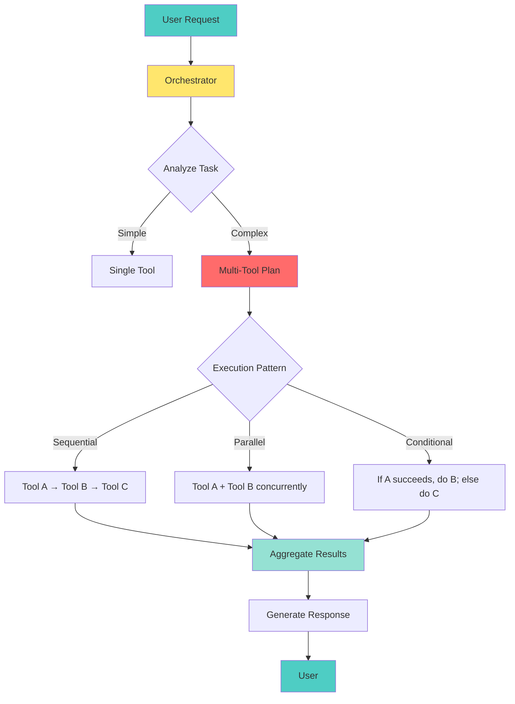
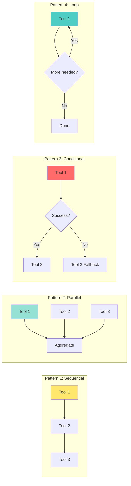

# 📘 **NODEJS AI DEVELOPER MASTERY - Lesson 8: Tool Orchestration Patterns**

**Date**: 26-03-18
**Level**: 🟢 Beginner → 🔴 Senior Engineer
**Series**: AI Developer Fundamentals - Part 2
**Time**: 65 minutes
**Prerequisites**: Lesson 7 (Function Calling Fundamentals)

---

## 🎯 **LEARNING OBJECTIVES**

After completing this **comprehensive** lesson, you will:

1. ✅ **Understand Tool Orchestration** - Coordination, sequencing, dependency management
2. ✅ **Master Sequential Chains** - Step-by-step execution with result passing
3. ✅ **Implement Parallel Execution** - Concurrent tool calls, result aggregation
4. ✅ **Build Conditional Workflows** - Dynamic tool selection based on results
5. ✅ **Create Tool Compositions** - Combining multiple tools for complex tasks
6. ✅ **Handle Errors in Orchestration** - Recovery, rollback, fallback strategies
7. ✅ **Production Patterns** - Monitoring, optimization, caching

---

## 📦 **PART 1: ORCHESTRATION CONCEPTS**

### **What is Tool Orchestration?**



**Orchestration Enables**:
- ✅ **Multi-step workflows** - Chain tools together
- ✅ **Dependency management** - Tool B uses Tool A's output
- ✅ **Error recovery** - Retry or fallback when tools fail
- ✅ **Optimization** - Parallel execution when possible
- ✅ **Complex reasoning** - Break down complex tasks

---

### **Orchestration Patterns Overview**



---

## 📦 **PART 2: SEQUENTIAL CHAINS**

### **Basic Sequential Execution**

```typescript
// ─────────────────────────────────────────────
// ai/orchestration/sequential-chain.service.ts
// ─────────────────────────────────────────────
import { Injectable, Logger } from '@nestjs/common';

export interface ChainStep {
  name: string;
  tool: string;
  argsBuilder: (previousResults: Record<string, any>) => Promise<any> | any;
  description?: string;
}

export interface ChainExecutionResult {
  success: boolean;
  results: Record<string, any>;
  error?: string;
  executedSteps: string[];
  totalDuration: number;
}

@Injectable()
export class SequentialChainService {
  private readonly logger = new Logger(SequentialChainService.name);

  constructor(
    private toolExecutor: any, // Tool execution service
  ) {}

  // ─────────────────────────────────────────────
  // Execute Sequential Chain
  // ─────────────────────────────────────────────
  async executeChain(
    steps: ChainStep[],
    initialContext?: Record<string, any>,
  ): Promise<ChainExecutionResult> {
    const startTime = Date.now();
    const results: Record<string, any> = {};
    const executedSteps: string[] = [];

    try {
      for (const step of steps) {
        this.logger.log(`Executing step: ${step.name} (${step.tool})`);

        // Build arguments using previous results
        const args = await Promise.resolve(
          step.argsBuilder(results),
        );

        // Execute tool
        const result = await this.toolExecutor.execute(step.tool, args);

        // Store result
        results[step.name] = result;
        executedSteps.push(step.name);

        this.logger.log(`Step ${step.name} completed successfully`);
      }

      return {
        success: true,
        results,
        executedSteps,
        totalDuration: Date.now() - startTime,
      };
    } catch (error) {
      this.logger.error(`Chain failed: ${error.message}`);

      return {
        success: false,
        results,
        error: error.message,
        executedSteps,
        totalDuration: Date.now() - startTime,
      };
    }
  }
}

// ─────────────────────────────────────────────
// Example: Travel Planning Chain
// ─────────────────────────────────────────────
const travelChain: ChainStep[] = [
  {
    name: 'getFlights',
    tool: 'getFlightInfo',
    description: 'Get available flights',
    argsBuilder: (results) => ({
      from: results.origin || 'New York',
      to: results.destination || 'Tokyo',
      date: results.travelDate,
    }),
  },
  {
    name: 'getHotels',
    tool: 'getHotelInfo',
    description: 'Get available hotels',
    argsBuilder: (results) => ({
      city: results.destination || 'Tokyo',
      checkIn: results.travelDate,
      checkOut: results.returnDate,
    }),
  },
  {
    name: 'getWeather',
    tool: 'getWeather',
    description: 'Get weather forecast',
    argsBuilder: (results) => ({
      city: results.destination || 'Tokyo',
      date: results.travelDate,
    }),
  },
  {
    name: 'calculateBudget',
    tool: 'calculateTravelBudget',
    description: 'Calculate total trip cost',
    argsBuilder: (results) => ({
      flights: results.getFlights?.flights?.[0],
      hotel: results.getHotels?.hotels?.[0],
      days: 5,
    }),
  },
];

// Usage:
// const result = await chainService.executeChain(travelChain, {
//   travelDate: '2024-04-15',
//   returnDate: '2024-04-20',
// });
```

---

### **Advanced Sequential Chain with Validation**

```typescript
// ─────────────────────────────────────────────
// ai/orchestration/validated-chain.service.ts
// ─────────────────────────────────────────────
import { Injectable } from '@nestjs/common';

export interface ValidationRule {
  field: string;
  validator: (value: any) => boolean;
  errorMessage: string;
}

export interface ValidatedChainStep {
  name: string;
  tool: string;
  argsBuilder: (previousResults: Record<string, any>) => any;
  validators?: ValidationRule[];
  retryCount?: number;
  timeout?: number;
}

@Injectable()
export class ValidatedChainService {
  // ─────────────────────────────────────────────
  // Execute with Validation
  // ─────────────────────────────────────────────
  async executeWithValidation(
    steps: ValidatedChainStep[],
  ): Promise<{
    success: boolean;
    results: Record<string, any>;
    validationErrors?: Array<{ step: string; errors: string[] }>;
  }> {
    const results: Record<string, any> = {};
    const validationErrors: Array<{ step: string; errors: string[] }> = [];

    for (const step of steps) {
      try {
        // Build and validate arguments
        const args = await Promise.resolve(step.argsBuilder(results));

        if (step.validators) {
          const errors = this.validateArgs(args, step.validators);
          if (errors.length > 0) {
            validationErrors.push({ step: step.name, errors });
            continue;  // Skip this step
          }
        }

        // Execute with retry
        const result = await this.executeWithRetry(
          step.tool,
          args,
          step.retryCount || 3,
          step.timeout || 30000,
        );

        results[step.name] = result;

      } catch (error) {
        validationErrors.push({
          step: step.name,
          errors: [error.message],
        });
      }
    }

    return {
      success: validationErrors.length === 0,
      results,
      validationErrors,
    };
  }

  private validateArgs(
    args: any,
    validators: ValidationRule[],
  ): string[] {
    const errors: string[] = [];

    for (const rule of validators) {
      const value = this.getFieldValue(args, rule.field);
      if (!rule.validator(value)) {
        errors.push(rule.errorMessage);
      }
    }

    return errors;
  }

  private getFieldValue(obj: any, path: string): any {
    return path.split('.').reduce((o, k) => o?.[k], obj);
  }

  private async executeWithRetry(
    tool: string,
    args: any,
    maxRetries: number,
    timeout: number,
  ): Promise<any> {
    // Implementation with retry logic
    return {};
  }
}
```

---

## 📦 **PART 3: PARALLEL EXECUTION**

### **Parallel Tool Executor**

```typescript
// ─────────────────────────────────────────────
// ai/orchestration/parallel-executor.service.ts
// ─────────────────────────────────────────────
import { Injectable, Logger } from '@nestjs/common';

export interface ParallelTask {
  name: string;
  tool: string;
  args: any;
  priority?: number;  // Lower = higher priority
  timeout?: number;
}

export interface ParallelExecutionResult {
  results: Record<string, any>;
  errors: Array<{ name: string; error: string }>;
  totalDuration: number;
  successfulCount: number;
  failedCount: number;
}

@Injectable()
export class ParallelExecutorService {
  private readonly logger = new Logger(ParallelExecutorService.name);

  constructor(
    private toolExecutor: any,
  ) {}

  // ─────────────────────────────────────────────
  // Execute Tools in Parallel
  // ─────────────────────────────────────────────
  async executeParallel(
    tasks: ParallelTask[],
    options: {
      stopOnError?: boolean;
      timeout?: number;
      maxConcurrency?: number;
    } = {},
  ): Promise<ParallelExecutionResult> {
    const startTime = Date.now();
    const results: Record<string, any> = {};
    const errors: Array<{ name: string; error: string }> = [];

    // Sort by priority
    const sortedTasks = [...tasks].sort(
      (a, b) => (a.priority || 999) - (b.priority || 999),
    );

    // Execute with concurrency limit
    const concurrency = options.maxConcurrency || sortedTasks.length;
    const batches = this.chunkArray(sortedTasks, concurrency);

    for (const batch of batches) {
      const batchResults = await Promise.allSettled(
        batch.map(task => this.executeWithTimeout(task, options.timeout)),
      );

      for (let i = 0; i < batch.length; i++) {
        const task = batch[i];
        const result = batchResults[i];

        if (result.status === 'fulfilled') {
          results[task.name] = result.value;
          this.logger.log(`Task ${task.name} completed`);
        } else {
          errors.push({
            name: task.name,
            error: result.reason?.message || 'Unknown error',
          });
          this.logger.error(`Task ${task.name} failed: ${result.reason?.message}`);

          if (options.stopOnError) {
            // Abort remaining tasks
            break;
          }
        }
      }

      if (options.stopOnError && errors.length > 0) {
        break;
      }
    }

    return {
      results,
      errors,
      totalDuration: Date.now() - startTime,
      successfulCount: Object.keys(results).length,
      failedCount: errors.length,
    };
  }

  // ─────────────────────────────────────────────
  // Execute with Timeout
  // ─────────────────────────────────────────────
  private async executeWithTimeout(
    task: ParallelTask,
    timeout?: number,
  ): Promise<any> {
    const timeoutMs = timeout || task.timeout || 30000;

    const timeoutPromise = new Promise((_, reject) => {
      setTimeout(() => reject(new Error(`Task ${task.name} timed out`)), timeoutMs);
    });

    const executionPromise = this.toolExecutor.execute(task.tool, task.args);

    return Promise.race([executionPromise, timeoutPromise]);
  }

  // ─────────────────────────────────────────────
  // Chunk Array
  // ─────────────────────────────────────────────
  private chunkArray<T>(array: T[], size: number): T[][] {
    const chunks: T[][] = [];
    for (let i = 0; i < array.length; i += size) {
      chunks.push(array.slice(i, i + size));
    }
    return chunks;
  }
}

// ─────────────────────────────────────────────
// Example: Dashboard Data Aggregation
// ─────────────────────────────────────────────
const dashboardTasks: ParallelTask[] = [
  {
    name: 'userStats',
    tool: 'getUserStatistics',
    args: { period: '30d' },
    priority: 1,
  },
  {
    name: 'revenueStats',
    tool: 'getRevenueStatistics',
    args: { period: '30d' },
    priority: 1,
  },
  {
    name: 'orderStats',
    tool: 'getOrderStatistics',
    args: { period: '30d' },
    priority: 1,
  },
  {
    name: 'topProducts',
    tool: 'getTopProducts',
    args: { limit: 10 },
    priority: 2,
  },
  {
    name: 'recentOrders',
    tool: 'getRecentOrders',
    args: { limit: 5 },
    priority: 2,
  },
];

// All 5 queries execute in parallel!
// const result = await parallelExecutor.executeParallel(dashboardTasks);
```

---

### **Parallel with Dependency Resolution**

```typescript
// ─────────────────────────────────────────────
// ai/orchestration/dependency-aware-executor.ts
// ─────────────────────────────────────────────
import { Injectable } from '@nestjs/common';

export interface TaskWithDependencies {
  name: string;
  tool: string;
  args: any | ((results: Record<string, any>) => any);
  dependsOn?: string[];  // Names of tasks this depends on
}

@Injectable()
export class DependencyAwareExecutor {
  constructor(
    private toolExecutor: any,
  ) {}

  // ─────────────────────────────────────────────
  // Execute with Dependency Resolution
  // ─────────────────────────────────────────────
  async executeWithDependencies(
    tasks: TaskWithDependencies[],
  ): Promise<Record<string, any>> {
    const results: Record<string, any> = {};
    const completed = new Set<string>();
    const pending = new Map(tasks.map(t => [t.name, t]));

    while (pending.size > 0) {
      // Find ready tasks (all dependencies met)
      const readyTasks: TaskWithDependencies[] = [];

      for (const [name, task] of pending.entries()) {
        const depsMet = !task.dependsOn ||
          task.dependsOn.every(dep => completed.has(dep));

        if (depsMet) {
          readyTasks.push(task);
        }
      }

      if (readyTasks.length === 0) {
        throw new Error('Circular dependency detected or missing tasks');
      }

      // Execute ready tasks in parallel
      const batchResults = await Promise.all(
        readyTasks.map(async task => {
          const args = typeof task.args === 'function'
            ? task.args(results)
            : task.args;

          const result = await this.toolExecutor.execute(task.tool, args);
          return { name: task.name, result };
        }),
      );

      // Update results
      for (const { name, result } of batchResults) {
        results[name] = result;
        completed.add(name);
        pending.delete(name);
      }
    }

    return results;
  }
}

// ─────────────────────────────────────────────
// Example: E-commerce Order Processing
// ─────────────────────────────────────────────
const orderTasks: TaskWithDependencies[] = [
  {
    name: 'validateOrder',
    tool: 'validateOrder',
    args: { orderId: '123' },
  },
  {
    name: 'checkInventory',
    tool: 'checkInventory',
    args: (results) => ({
      items: results.validateOrder?.items,
    }),
    dependsOn: ['validateOrder'],
  },
  {
    name: 'calculateTotal',
    tool: 'calculateOrderTotal',
    args: (results) => ({
      items: results.validateOrder?.items,
      userId: results.validateOrder?.userId,
    }),
    dependsOn: ['validateOrder'],
  },
  {
    name: 'processPayment',
    tool: 'processPayment',
    args: (results) => ({
      userId: results.validateOrder?.userId,
      amount: results.calculateTotal?.total,
    }),
    dependsOn: ['calculateTotal'],
  },
  {
    name: 'updateInventory',
    tool: 'updateInventory',
    args: (results) => ({
      items: results.checkInventory?.reservedItems,
    }),
    dependsOn: ['checkInventory', 'processPayment'],
  },
  {
    name: 'createShipment',
    tool: 'createShipment',
    args: (results) => ({
      orderId: '123',
      address: results.validateOrder?.shippingAddress,
    }),
    dependsOn: ['processPayment', 'updateInventory'],
  },
];

// Execution order:
// 1. validateOrder (no deps)
// 2. checkInventory + calculateTotal (parallel, both depend on validateOrder)
// 3. processPayment (depends on calculateTotal)
// 4. updateInventory (depends on checkInventory + processPayment)
// 5. createShipment (depends on processPayment + updateInventory)
```

---

## 📦 **PART 4: CONDITIONAL WORKFLOWS**

### **Conditional Chain Executor**

```typescript
// ─────────────────────────────────────────────
// ai/orchestration/conditional-chain.service.ts
// ─────────────────────────────────────────────
import { Injectable, Logger } from '@nestjs/common';

export interface ConditionalStep {
  name: string;
  tool: string;
  args: any | ((results: Record<string, any>) => any);
  condition?: (results: Record<string, any>) => boolean | Promise<boolean>;
  onError?: 'stop' | 'continue' | 'fallback';
  fallback?: {
    tool: string;
    args: any | ((results: Record<string, any>, error: any) => any);
  };
}

@Injectable()
export class ConditionalChainService {
  private readonly logger = new Logger(ConditionalChainService.name);

  constructor(
    private toolExecutor: any,
  ) {}

  // ─────────────────────────────────────────────
  // Execute Conditional Chain
  // ─────────────────────────────────────────────
  async executeConditional(
    steps: ConditionalStep[],
    initialContext: Record<string, any> = {},
  ): Promise<{
    success: boolean;
    results: Record<string, any>;
    skippedSteps: string[];
    fallbackUsed: string[];
  }> {
    const results: Record<string, any> = { ...initialContext };
    const skippedSteps: string[] = [];
    const fallbackUsed: string[] = [];

    for (const step of steps) {
      // Check condition
      if (step.condition) {
        const shouldExecute = await Promise.resolve(
          step.condition(results),
        );

        if (!shouldExecute) {
          this.logger.log(`Skipping ${step.name}: condition not met`);
          skippedSteps.push(step.name);
          continue;
        }
      }

      try {
        // Execute step
        const args = typeof step.args === 'function'
          ? step.args(results)
          : step.args;

        const result = await this.toolExecutor.execute(step.tool, args);
        results[step.name] = result;

        this.logger.log(`Step ${step.name} completed`);

      } catch (error) {
        this.logger.error(`Step ${step.name} failed: ${error.message}`);

        // Handle error based on strategy
        if (step.onError === 'stop') {
          return {
            success: false,
            results,
            skippedSteps,
            fallbackUsed,
          };
        }

        if (step.onError === 'fallback' && step.fallback) {
          this.logger.log(`Using fallback for ${step.name}`);

          try {
            const fallbackArgs = typeof step.fallback.args === 'function'
              ? step.fallback.args(results, error)
              : step.fallback.args;

            const fallbackResult = await this.toolExecutor.execute(
              step.fallback.tool,
              fallbackArgs,
            );

            results[step.name] = fallbackResult;
            fallbackUsed.push(step.name);
          } catch (fallbackError) {
            this.logger.error(`Fallback for ${step.name} also failed`);

            if (step.onError !== 'continue') {
              return {
                success: false,
                results,
                skippedSteps,
                fallbackUsed,
              };
            }
          }
        }

        if (step.onError === 'continue' || step.onError === 'fallback') {
          continue;
        }

        return {
          success: false,
          results,
          skippedSteps,
          fallbackUsed,
        };
      }
    }

    return {
      success: true,
      results,
      skippedSteps,
      fallbackUsed,
    };
  }
}

// ─────────────────────────────────────────────
// Example: Customer Support Workflow
// ─────────────────────────────────────────────
const supportWorkflow: ConditionalStep[] = [
  {
    name: 'authenticateUser',
    tool: 'authenticateUser',
    args: { token: '{{user_token}}' },
    onError: 'stop',  // Can't continue without auth
  },
  {
    name: 'getCustomerInfo',
    tool: 'getCustomerInfo',
    args: (results) => ({ userId: results.authenticateUser?.userId }),
    dependsOn: ['authenticateUser'],
  },
  {
    name: 'checkOrderStatus',
    tool: 'getOrderStatus',
    args: (results) => ({
      userId: results.authenticateUser?.userId,
      orderId: '{{order_id}}',
    }),
    condition: (results) => !!results.authenticateUser?.userId,
  },
  {
    name: 'processRefund',
    tool: 'processRefund',
    args: (results) => ({
      orderId: '{{order_id}}',
      amount: '{{refund_amount}}',
    }),
    condition: (results) => {
      return results.checkOrderStatus?.status === 'delivered' &&
        results.checkOrderStatus?.refundEligible;
    },
    onError: 'fallback',
    fallback: {
      tool: 'createSupportTicket',
      args: (results, error) => ({
        userId: results.authenticateUser?.userId,
        issue: 'Refund request needs manual review',
        priority: 'high',
      }),
    },
  },
  {
    name: 'sendConfirmation',
    tool: 'sendEmail',
    args: (results) => ({
      to: results.getCustomerInfo?.email,
      subject: 'Refund Processed',
      body: 'Your refund has been processed.',
    }),
    condition: (results) => !!results.processRefund?.success,
  },
];
```

---

## 📦 **PART 5: TOOL COMPOSITION PATTERNS**

### **Tool Composition Builder**

```typescript
// ─────────────────────────────────────────────
// ai/orchestration/tool-composition.builder.ts
// ─────────────────────────────────────────────
import { Injectable } from '@nestjs/common';

export interface ComposedTool {
  name: string;
  description: string;
  parameters: object;
  executor: (args: any, context: ToolContext) => Promise<any>;
}

export interface ToolContext {
  userId?: string;
  requestId: string;
  previousResults: Record<string, any>;
  metadata?: Record<string, any>;
}

@Injectable()
export class ToolCompositionBuilder {
  private readonly composedTools = new Map<string, ComposedTool>();

  // ─────────────────────────────────────────────
  // Register Composed Tool
  // ─────────────────────────────────────────────
  registerComposedTool(tool: ComposedTool): void {
    this.composedTools.set(tool.name, tool);
  }

  // ─────────────────────────────────────────────
  // Build: Search and Summarize
  // ─────────────────────────────────────────────
  buildSearchAndSummarize(): ComposedTool {
    return {
      name: 'searchAndSummarize',
      description: 'Search for information and provide a concise summary',
      parameters: {
        type: 'object',
        properties: {
          query: { type: 'string', description: 'Search query' },
          sources: {
            type: 'array',
            description: 'Sources to search',
            items: { type: 'string' },
          },
          summaryLength: {
            type: 'string',
            enum: ['short', 'medium', 'long'],
          },
        },
        required: ['query'],
      },
      executor: async (args, context) => {
        // Step 1: Search
        const searchResults = await context.executeTool('search', {
          query: args.query,
          sources: args.sources || ['web', 'docs'],
        });

        // Step 2: Summarize
        const summary = await context.executeTool('summarize', {
          text: searchResults.content,
          length: args.summaryLength || 'medium',
        });

        return {
          query: args.query,
          summary,
          sources: searchResults.sources,
          timestamp: new Date().toISOString(),
        };
      },
    };
  }

  // ─────────────────────────────────────────────
  // Build: Analyze and Recommend
  // ─────────────────────────────────────────────
  buildAnalyzeAndRecommend(): ComposedTool {
    return {
      name: 'analyzeAndRecommend',
      description: 'Analyze data and provide actionable recommendations',
      parameters: {
        type: 'object',
        properties: {
          dataType: {
            type: 'string',
            description: 'Type of data to analyze',
            enum: ['sales', 'users', 'products', 'performance'],
          },
          period: { type: 'string', description: 'Time period' },
          metrics: {
            type: 'array',
            items: { type: 'string' },
          },
        },
        required: ['dataType'],
      },
      executor: async (args, context) => {
        // Step 1: Fetch data
        const data = await context.executeTool('fetchData', {
          type: args.dataType,
          period: args.period,
          metrics: args.metrics,
        });

        // Step 2: Analyze trends
        const analysis = await context.executeTool('analyzeTrends', {
          data,
        });

        // Step 3: Generate recommendations
        const recommendations = await context.executeTool('generateRecommendations', {
          analysis,
          dataType: args.dataType,
        });

        return {
          dataType: args.dataType,
          analysis,
          recommendations,
          confidence: analysis.confidence,
        };
      },
    };
  }

  // ─────────────────────────────────────────────
  // Build: Validate and Transform
  // ─────────────────────────────────────────────
  buildValidateAndTransform(): ComposedTool {
    return {
      name: 'validateAndTransform',
      description: 'Validate input data and transform to desired format',
      parameters: {
        type: 'object',
        properties: {
          inputData: { type: 'object', description: 'Data to validate' },
          schema: { type: 'object', description: 'Validation schema' },
          outputFormat: {
            type: 'string',
            enum: ['json', 'csv', 'xml'],
          },
        },
        required: ['inputData', 'schema'],
      },
      executor: async (args, context) => {
        // Step 1: Validate
        const validation = await context.executeTool('validate', {
          data: args.inputData,
          schema: args.schema,
        });

        if (!validation.valid) {
          return {
            success: false,
            errors: validation.errors,
          };
        }

        // Step 2: Transform
        const transformed = await context.executeTool('transform', {
          data: args.inputData,
          format: args.outputFormat || 'json',
        });

        return {
          success: true,
          data: transformed,
          format: args.outputFormat || 'json',
        };
      },
    };
  }
}
```

---

## 📦 **PART 6: ERROR HANDLING IN ORCHESTRATION**

### **Orchestration Error Recovery**

```typescript
// ─────────────────────────────────────────────
// ai/orchestration/error-recovery.service.ts
// ─────────────────────────────────────────────
import { Injectable, Logger } from '@nestjs/common';

export interface RecoveryStrategy {
  type: 'retry' | 'fallback' | 'skip' | 'rollback';
  maxAttempts?: number;
  delayMs?: number;
  fallbackTool?: string;
  rollbackTools?: string[];
}

@Injectable()
export class OrchestrationErrorRecoveryService {
  private readonly logger = new Logger(OrchestrationErrorRecoveryService.name);

  // ─────────────────────────────────────────────
  // Execute with Recovery
  // ─────────────────────────────────────────────
  async executeWithRecovery(
    tool: string,
    args: any,
    strategy: RecoveryStrategy,
    executor: any,
  ): Promise<{
    success: boolean;
    result?: any;
    attempts?: number;
    error?: string;
  }> {
    let lastError: any;
    let attempts = 0;

    switch (strategy.type) {
      case 'retry':
        return this.executeWithRetry(
          tool,
          args,
          strategy.maxAttempts || 3,
          strategy.delayMs || 1000,
          executor,
        );

      case 'fallback':
        return this.executeWithFallback(
          tool,
          args,
          strategy.fallbackTool!,
          executor,
        );

      case 'rollback':
        return this.executeWithRollback(
          tool,
          args,
          strategy.rollbackTools || [],
          executor,
        );

      case 'skip':
        try {
          const result = await executor.execute(tool, args);
          return { success: true, result };
        } catch (error) {
          this.logger.warn(`Skipping failed tool: ${tool}`);
          return { success: false, error: error.message };
        }

      default:
        throw new Error(`Unknown recovery strategy: ${strategy.type}`);
    }
  }

  private async executeWithRetry(
    tool: string,
    args: any,
    maxAttempts: number,
    delayMs: number,
    executor: any,
  ): Promise<any> {
    for (let attempt = 1; attempt <= maxAttempts; attempt++) {
      try {
        const result = await executor.execute(tool, args);
        return { success: true, result, attempts: attempt };
      } catch (error) {
        lastError = error;

        if (attempt < maxAttempts) {
          this.logger.log(
            `Retry ${attempt}/${maxAttempts} for ${tool} after ${delayMs}ms`,
          );
          await new Promise(r => setTimeout(r, delayMs * attempt));
        }
      }
    }

    return {
      success: false,
      error: lastError?.message,
      attempts,
    };
  }

  private async executeWithFallback(
    primaryTool: string,
    args: any,
    fallbackTool: string,
    executor: any,
  ): Promise<any> {
    try {
      const result = await executor.execute(primaryTool, args);
      return { success: true, result, usedFallback: false };
    } catch (error) {
      this.logger.warn(
        `Primary tool ${primaryTool} failed, using fallback ${fallbackTool}`,
      );

      try {
        const result = await executor.execute(fallbackTool, args);
        return { success: true, result, usedFallback: true };
      } catch (fallbackError) {
        return {
          success: false,
          error: `Primary: ${error.message}, Fallback: ${fallbackError.message}`,
        };
      }
    }
  }

  private async executeWithRollback(
    tool: string,
    args: any,
    rollbackTools: string[],
    executor: any,
  ): Promise<any> {
    const executedTools: Array<{ tool: string; result: any }> = [];

    try {
      const result = await executor.execute(tool, args);
      executedTools.push({ tool, result });

      return { success: true, result };
    } catch (error) {
      this.logger.warn(`Executing rollback for ${rollbackTools.length} tools`);

      // Execute rollback in reverse order
      for (const rollbackTool of rollbackTools.reverse()) {
        try {
          await executor.execute(rollbackTool, { action: 'rollback' });
        } catch (rollbackError) {
          this.logger.error(
            `Rollback failed for ${rollbackTool}: ${rollbackError.message}`,
          );
        }
      }

      return {
        success: false,
        error: error.message,
        rollbackAttempted: true,
      };
    }
  }
}
```

---

## ✅ **ORCHESTRATION CHECKLIST**

```
Sequential Chains
[ ] Steps defined clearly
[ ] Args builder functions work
[ ] Result passing between steps
[ ] Error handling per step

Parallel Execution
[ ] Independent tasks identified
[ ] Concurrency limits set
[ ] Timeout handling
[ ] Result aggregation

Conditional Workflows
[ ] Conditions properly defined
[ ] Fallback tools registered
[ ] Error strategies configured
[ ] Skip logic works

Error Recovery
[ ] Retry strategies implemented
[ ] Fallback tools available
[ ] Rollback mechanisms
[ ] Error logging

Monitoring
[ ] Execution time tracked
[ ] Success/failure rates
[ ] Tool performance metrics
[ ] Dependency visualization
```

---

## 🎯 **KNOWLEDGE CHECK**

### **Question 1: When to Use Sequential vs Parallel?**

<details>
<summary>💡 Click to reveal answer</summary>

**Use Sequential When**:
- ✅ Tool B needs Tool A's output
- ✅ Steps must happen in order
- ✅ Each step validates previous

**Use Parallel When**:
- ✅ Tools are independent
- ✅ Need all results before proceeding
- ✅ Performance is critical
- ✅ No shared state between tools
</details>

---

### **Question 2: How to Handle Partial Failures?**

<details>
<summary>💡 Click to reveal answer</summary>

**Strategies**:
1. ✅ **Continue** - Skip failed, complete rest
2. ✅ **Fallback** - Use alternative tool
3. ✅ **Stop** - Abort entire chain
4. ✅ **Retry** - Try failed tool again
5. ✅ **Rollback** - Undo completed steps

**Choose based on**: Business requirements, data consistency needs
</details>

---

## 📚 **ADDITIONAL RESOURCES**

- **Workflow Patterns**: [https://www.workflowpatterns.com](https://www.workflowpatterns.com)
- **Orchestration vs Choreography**: [https://microservices.io/patterns/index.html](https://microservices.io/patterns/index.html)
- **State Machines**: [https://en.wikipedia.org/wiki/Finite-state_machine](https://en.wikipedia.org/wiki/Finite-state_machine)

---

## 🎓 **HOMEWORK**

1. ✅ Build a 5-step sequential chain
2. ✅ Implement parallel executor
3. ✅ Create conditional workflow
4. ✅ Add dependency resolution
5. ✅ Build composed tool
6. ✅ Implement retry with backoff
7. ✅ Add fallback mechanisms
8. ✅ Create rollback functionality

---

**Next Lesson**: AI API Integration (NestJS) - Building REST APIs with AI Backends
**Date**: 26-03-18
**Status**: ✅ Complete

---
*26-03-18*
