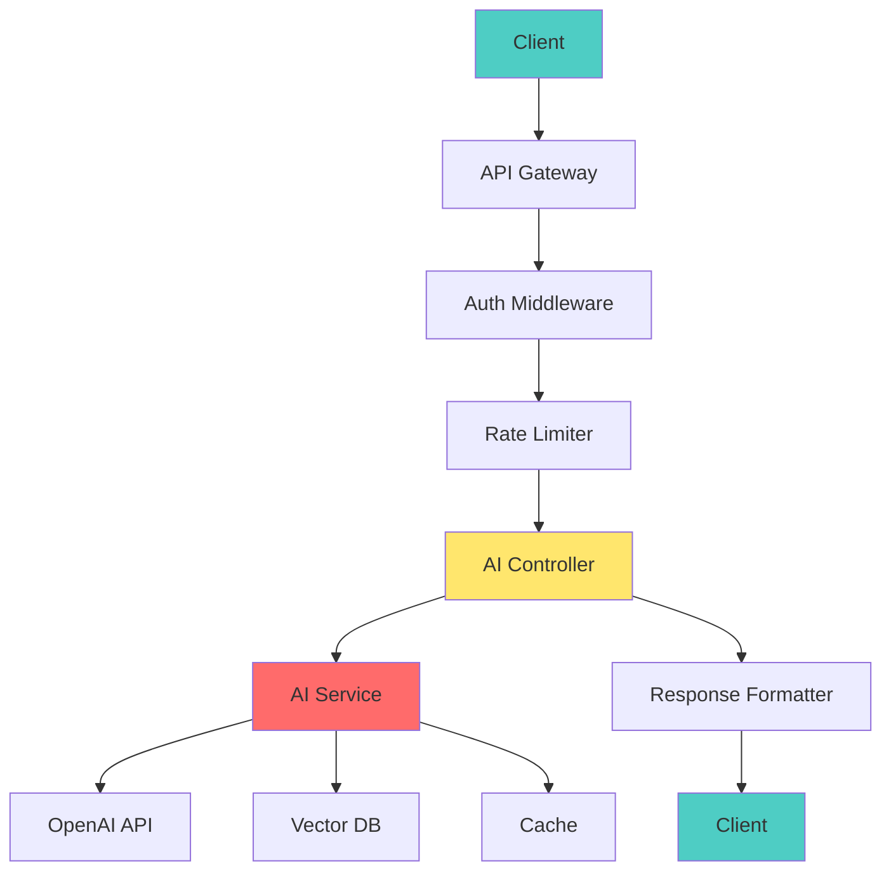

# 📘 **NODEJS AI DEVELOPER MASTERY - Lesson 9: AI API Integration (NestJS)**

**Date**: 26-03-18
**Level**: 🟢 Beginner → 🔴 Senior Engineer
**Series**: AI Developer Fundamentals - Part 2
**Time**: 60 minutes
**Prerequisites**: Lesson 7-8 (Function Calling, Tool Orchestration)

---

## 🎯 **LEARNING OBJECTIVES**

After completing this **comprehensive** lesson, you will:

1. ✅ **Design AI-Powered APIs** - REST endpoints with AI backends
2. ✅ **Implement Request/Response Patterns** - DTOs, validation, typing
3. ✅ **Handle Streaming Responses** - SSE, WebSockets for AI streams
4. ✅ **Build Conversation APIs** - Multi-turn conversation management
5. ✅ **Implement Rate Limiting** - Per-user, per-endpoint limits
6. ✅ **Add Monitoring & Logging** - Request tracking, metrics, tracing
7. ✅ **Production Patterns** - Caching, versioning, documentation

---

## 📦 **PART 1: API DESIGN FOR AI**

### **REST API Architecture for AI**



**Key Components**:
- ✅ **Controllers** - HTTP handling, request/response
- ✅ **Services** - AI logic, orchestration
- ✅ **DTOs** - Input validation, typing
- ✅ **Guards** - Authentication, authorization
- ✅ **Interceptors** - Logging, transformation, timing
- ✅ **Filters** - Error handling, formatting

---

### **API Endpoint Design**

```typescript
// ─────────────────────────────────────────────
// AI API Endpoint Structure
// ─────────────────────────────────────────────

/**
 * POST /api/v1/ai/chat
 * Request: { message, conversationId?, options? }
 * Response: { id, message, conversationId, usage, timestamp }
 */

/**
 * POST /api/v1/ai/chat/stream
 * Request: { message, conversationId?, options? }
 * Response: SSE stream of tokens
 */

/**
 * GET /api/v1/ai/conversations/:id
 * Response: { id, messages, metadata, createdAt, updatedAt }
 */

/**
 * POST /api/v1/ai/completions
 * Request: { prompt, options? }
 * Response: { completions: string[], usage }
 */

/**
 * POST /api/v1/ai/embeddings
 * Request: { text: string | string[] }
 * Response: { embeddings: number[][] }
 */

/**
 * POST /api/v1/ai/functions/execute
 * Request: { functionName, args }
 * Response: { result, executionTime }
 */
```

---

## 📦 **PART 2: DTOs & VALIDATION**

### **Chat Request/Response DTOs**

```typescript
// ─────────────────────────────────────────────
// ai/dto/chat.dto.ts
// ─────────────────────────────────────────────
import {
  IsString,
  IsOptional,
  IsObject,
  IsNumber,
  IsBoolean,
  IsArray,
  ValidateNested,
  IsEnum,
  Min,
  Max,
  MaxLength,
} from 'class-validator';
import { Type } from 'class-transformer';
import { ApiProperty, ApiPropertyOptional } from '@nestjs/swagger';

// ─────────────────────────────────────────────
// Message DTO
// ─────────────────────────────────────────────
export class MessageDto {
  @ApiProperty({
    enum: ['system', 'user', 'assistant'],
    description: 'Role of the message sender',
  })
  @IsEnum(['system', 'user', 'assistant'])
  role: 'system' | 'user' | 'assistant';

  @ApiProperty({ description: 'Message content' })
  @IsString()
  @MinLength(1, { message: 'Message content cannot be empty' })
  content: string;

  @ApiPropertyOptional({ description: 'Optional name for the sender' })
  @IsString()
  @IsOptional()
  name?: string;
}

// ─────────────────────────────────────────────
// Chat Options DTO
// ─────────────────────────────────────────────
export class ChatOptionsDto {
  @ApiPropertyOptional({
    description: 'Model to use',
    example: 'gpt-4-turbo-preview',
  })
  @IsString()
  @IsOptional()
  model?: string;

  @ApiPropertyOptional({
    description: 'Temperature (0-2)',
    example: 0.7,
    minimum: 0,
    maximum: 2,
  })
  @IsNumber()
  @Min(0)
  @Max(2)
  @IsOptional()
  temperature?: number;

  @ApiPropertyOptional({
    description: 'Maximum tokens to generate',
    example: 2048,
  })
  @IsNumber()
  @Min(1)
  @IsOptional()
  maxTokens?: number;

  @ApiPropertyOptional({
    description: 'Top P sampling (0-1)',
    example: 1,
  })
  @IsNumber()
  @Min(0)
  @Max(1)
  @IsOptional()
  topP?: number;

  @ApiPropertyOptional({
    description: 'Frequency penalty (-2 to 2)',
    example: 0,
  })
  @IsNumber()
  @Min(-2)
  @Max(2)
  @IsOptional()
  frequencyPenalty?: number;

  @ApiPropertyOptional({
    description: 'Presence penalty (-2 to 2)',
    example: 0,
  })
  @IsNumber()
  @Min(-2)
  @Max(2)
  @IsOptional()
  presencePenalty?: number;

  @ApiPropertyOptional({
    description: 'Stop sequences',
    example: ['\n', 'END'],
  })
  @IsArray()
  @IsString({ each: true })
  @IsOptional()
  stop?: string[];

  @ApiPropertyOptional({
    description: 'Enable streaming',
    example: false,
  })
  @IsBoolean()
  @IsOptional()
  stream?: boolean;
}

// ─────────────────────────────────────────────
// Chat Request DTO
// ─────────────────────────────────────────────
export class ChatRequestDto {
  @ApiProperty({
    description: 'User message or conversation messages',
    oneOf: [
      { type: 'string' },
      { type: 'array', items: { $ref: '#/components/schemas/MessageDto' } },
    ],
  })
  @IsString()
  @IsOptional()
  message?: string;

  @ApiPropertyOptional({ type: [MessageDto] })
  @IsArray()
  @ValidateNested({ each: true })
  @Type(() => MessageDto)
  messages?: MessageDto[];

  @ApiPropertyOptional({ description: 'Conversation ID for multi-turn' })
  @IsString()
  @IsOptional()
  conversationId?: string;

  @ApiPropertyOptional({ description: 'User ID for tracking' })
  @IsString()
  @IsOptional()
  userId?: string;

  @ApiPropertyOptional({ type: ChatOptionsDto })
  @IsObject()
  @ValidateNested()
  @Type(() => ChatOptionsDto)
  @IsOptional()
  options?: ChatOptionsDto;

  @ApiPropertyOptional({
    description: 'System prompt override',
  })
  @IsString()
  @IsOptional()
  systemPrompt?: string;
}

// ─────────────────────────────────────────────
// Token Usage DTO
// ─────────────────────────────────────────────
export class TokenUsageDto {
  @ApiProperty({ description: 'Prompt tokens' })
  @IsNumber()
  promptTokens: number;

  @ApiProperty({ description: 'Completion tokens' })
  @IsNumber()
  completionTokens: number;

  @ApiProperty({ description: 'Total tokens' })
  @IsNumber()
  totalTokens: number;

  @ApiPropertyOptional({ description: 'Estimated cost in USD' })
  @IsNumber()
  @IsOptional()
  estimatedCost?: number;
}

// ─────────────────────────────────────────────
// Chat Response DTO
// ─────────────────────────────────────────────
export class ChatResponseDto {
  @ApiProperty({ description: 'Response ID' })
  @IsString()
  id: string;

  @ApiProperty({ description: 'Generated message' })
  @IsString()
  message: string;

  @ApiProperty({ description: 'Conversation ID' })
  @IsString()
  conversationId: string;

  @ApiProperty({ description: 'Model used' })
  @IsString()
  model: string;

  @ApiProperty({ description: 'Token usage' })
  @Type(() => TokenUsageDto)
  usage: TokenUsageDto;

  @ApiProperty({ description: 'Response timestamp' })
  @IsString()
  timestamp: string;

  @ApiPropertyOptional({ description: 'Finish reason' })
  @IsString()
  @IsOptional()
  finishReason?: string;

  @ApiPropertyOptional({ description: 'Processing time in ms' })
  @IsNumber()
  @IsOptional()
  processingTimeMs?: number;
}

// ─────────────────────────────────────────────
// Error Response DTO
// ─────────────────────────────────────────────
export class ChatErrorResponseDto {
  @ApiProperty({ description: 'Error code' })
  @IsString()
  code: string;

  @ApiProperty({ description: 'Error message' })
  @IsString()
  message: string;

  @ApiPropertyOptional({ description: 'Detailed errors' })
  @IsObject()
  @IsOptional()
  details?: Record<string, any>;

  @ApiProperty({ description: 'Error timestamp' })
  @IsString()
  timestamp: string;

  @ApiProperty({ description: 'Request ID for tracing' })
  @IsString()
  requestId: string;
}
```

---

## 📦 **PART 3: CONTROLLER IMPLEMENTATION**

### **AI Chat Controller**

```typescript
// ─────────────────────────────────────────────
// ai/chat/chat.controller.ts
// ─────────────────────────────────────────────
import {
  Controller,
  Post,
  Get,
  Body,
  Param,
  Query,
  Sse,
  UseGuards,
  UseInterceptors,
  HttpCode,
  HttpStatus,
  Headers,
  Request,
} from '@nestjs/common';
import {
  ApiTags,
  ApiOperation,
  ApiResponse,
  ApiBearerAuth,
  ApiQuery,
} from '@nestjs/swagger';
import { Observable } from 'rxjs';
import { map } from 'rxjs/operators';
import { ChatService } from './chat.service';
import { ChatRequestDto, ChatResponseDto } from './dto/chat.dto';
import { AuthGuard } from '../../auth/auth.guard';
import { RateLimitGuard } from '../../rate-limit/rate-limit.guard';
import { LoggingInterceptor } from '../../logging/logging.interceptor';
import { TimeoutInterceptor } from '../../timeout/timeout.interceptor';

@ApiTags('AI Chat')
@ApiBearerAuth()
@UseGuards(AuthGuard, RateLimitGuard)
@UseInterceptors(LoggingInterceptor, TimeoutInterceptor)
@Controller('api/v1/ai/chat')
export class ChatController {
  constructor(
    private readonly chatService: ChatService,
  ) {}

  // ─────────────────────────────────────────────
  // POST: Send Message
  // ─────────────────────────────────────────────
  @Post()
  @HttpCode(HttpStatus.OK)
  @ApiOperation({ summary: 'Send a message and get AI response' })
  @ApiResponse({
    status: 200,
    description: 'Successful response',
    type: ChatResponseDto,
  })
  @ApiResponse({
    status: 400,
    description: 'Bad request',
  })
  @ApiResponse({
    status: 429,
    description: 'Rate limit exceeded',
  })
  async sendMessage(
    @Body() request: ChatRequestDto,
    @Request() req: any,
    @Headers('x-request-id') requestId?: string,
  ): Promise<ChatResponseDto> {
    const userId = request.userId || req.user?.id || 'anonymous';

    // Normalize request
    const messages = request.message
      ? [{ role: 'user' as const, content: request.message }]
      : request.messages || [];

    // Execute chat
    const result = await this.chatService.processChat({
      messages,
      conversationId: request.conversationId,
      userId,
      options: request.options,
      systemPrompt: request.systemPrompt,
      requestId: requestId || crypto.randomUUID(),
    });

    return result;
  }

  // ─────────────────────────────────────────────
  // POST: Stream Response (SSE)
  // ─────────────────────────────────────────────
  @Post('stream')
  @ApiOperation({ summary: 'Stream AI response (Server-Sent Events)' })
  @ApiQuery({ name: 'conversationId', required: false })
  @ApiQuery({ name: 'model', required: false })
  streamResponse(
    @Body() request: ChatRequestDto,
    @Request() req: any,
    @Headers('x-request-id') requestId?: string,
  ): Observable<{ data: string }> {
    const userId = request.userId || req.user?.id || 'anonymous';

    const messages = request.message
      ? [{ role: 'user' as const, content: request.message }]
      : request.messages || [];

    // Get stream observable
    return this.chatService.streamChat({
      messages,
      conversationId: request.conversationId,
      userId,
      options: { ...request.options, stream: true },
      requestId: requestId || crypto.randomUUID(),
    }).pipe(
      map(token => ({ data: token })),
    );
  }

  // ─────────────────────────────────────────────
  // GET: Get Conversation
  // ─────────────────────────────────────────────
  @Get('conversations/:id')
  @ApiOperation({ summary: 'Get conversation by ID' })
  @ApiResponse({ status: 200, description: 'Conversation retrieved' })
  @ApiResponse({ status: 404, description: 'Conversation not found' })
  async getConversation(
    @Param('id') conversationId: string,
    @Query('limit', parseInt) limit: number = 50,
  ) {
    return this.chatService.getConversation(conversationId, limit);
  }

  // ─────────────────────────────────────────────
  // DELETE: Delete Conversation
  // ─────────────────────────────────────────────
  @Delete('conversations/:id')
  @HttpCode(HttpStatus.NO_CONTENT)
  @ApiOperation({ summary: 'Delete a conversation' })
  async deleteConversation(
    @Param('id') conversationId: string,
  ) {
    await this.chatService.deleteConversation(conversationId);
  }

  // ─────────────────────────────────────────────
  // GET: List Conversations
  // ─────────────────────────────────────────────
  @Get('conversations')
  @ApiOperation({ summary: 'List user conversations' })
  async listConversations(
    @Request() req: any,
    @Query('page', parseInt) page: number = 1,
    @Query('limit', parseInt) limit: number = 20,
    @Query('status') status?: string,
  ) {
    const userId = req.user?.id;

    return this.chatService.listConversations({
      userId,
      page,
      limit,
      status,
    });
  }
}
```

---

### **Chat Service Implementation**

```typescript
// ─────────────────────────────────────────────
// ai/chat/chat.service.ts
// ─────────────────────────────────────────────
import { Injectable, Logger, NotFoundException } from '@nestjs/common';
import { InjectModel } from '@nestjs/mongoose';
import { Model } from 'mongoose';
import { ConfigService } from '@nestjs/config';
import { OpenAI } from 'openai';
import { ChatMessage, Conversation } from './entities';
import { TokenCountingService } from '../token/token.service';
import { ConversationService } from '../conversation/conversation.service';

export interface ChatProcessRequest {
  messages: Array<{ role: string; content: string }>;
  conversationId?: string;
  userId: string;
  options?: {
    model?: string;
    temperature?: number;
    maxTokens?: number;
    stream?: boolean;
  };
  systemPrompt?: string;
  requestId: string;
}

export interface ChatProcessResponse {
  id: string;
  message: string;
  conversationId: string;
  model: string;
  usage: {
    promptTokens: number;
    completionTokens: number;
    totalTokens: number;
    estimatedCost: number;
  };
  timestamp: string;
  finishReason?: string;
  processingTimeMs?: number;
}

@Injectable()
export class ChatService {
  private readonly logger = new Logger(ChatService.name);

  constructor(
    @InjectModel('Conversation') private conversationModel: Model<Conversation>,
    @InjectModel('Message') private messageModel: Model<ChatMessage>,
    @Inject('OPENAI_CLIENT') private client: OpenAI,
    private configService: ConfigService,
    private tokenService: TokenCountingService,
    private conversationService: ConversationService,
  ) {}

  // ─────────────────────────────────────────────
  // Process Chat Request
  // ─────────────────────────────────────────────
  async processChat(request: ChatProcessRequest): Promise<ChatProcessResponse> {
    const startTime = Date.now();

    try {
      // Build messages with system prompt
      const messages = this.buildMessages(
        request.messages,
        request.systemPrompt,
      );

      // Get or create conversation
      const conversationId = request.conversationId || await this.createConversation(request.userId);

      // Save user message
      await this.saveMessage({
        conversationId,
        role: 'user',
        content: request.messages[request.messages.length - 1].content,
        requestId: request.requestId,
      });

      // Call OpenAI
      const model = request.options?.model || this.configService.get('OPENAI_CHAT_MODEL', 'gpt-4-turbo-preview');
      const temperature = request.options?.temperature ?? 0.7;
      const maxTokens = request.options?.maxTokens ?? 4096;

      const response = await this.client.chat.completions.create({
        model,
        messages,
        temperature,
        max_tokens: maxTokens,
        user: request.userId,
      });

      const assistantMessage = response.choices[0]?.message?.content || '';

      // Save assistant response
      await this.saveMessage({
        conversationId,
        role: 'assistant',
        content: assistantMessage,
        metadata: {
          model: response.model,
          usage: response.usage,
          finishReason: response.choices[0]?.finish_reason,
        },
        requestId: request.requestId,
      });

      const processingTime = Date.now() - startTime;

      // Log usage
      this.logger.log(
        `Chat completed - Tokens: ${response.usage?.total_tokens} - ` +
        `Time: ${processingTime}ms - Request: ${request.requestId}`,
      );

      return {
        id: response.id,
        message: assistantMessage,
        conversationId,
        model: response.model,
        usage: {
          promptTokens: response.usage?.prompt_tokens || 0,
          completionTokens: response.usage?.completion_tokens || 0,
          totalTokens: response.usage?.total_tokens || 0,
          estimatedCost: this.calculateCost(response.usage, response.model),
        },
        timestamp: new Date().toISOString(),
        finishReason: response.choices[0]?.finish_reason,
        processingTimeMs: processingTime,
      };

    } catch (error) {
      this.logger.error(
        `Chat processing failed: ${error.message} - Request: ${request.requestId}`,
      );
      throw error;
    }
  }

  // ─────────────────────────────────────────────
  // Build Messages Array
  // ─────────────────────────────────────────────
  private buildMessages(
    messages: Array<{ role: string; content: string }>,
    systemPrompt?: string,
  ): Array<{ role: string; content: string }> {
    const result: Array<{ role: string; content: string }> = [];

    // Add system prompt if provided
    if (systemPrompt) {
      result.push({ role: 'system', content: systemPrompt });
    }

    // Add existing messages
    result.push(...messages);

    return result;
  }

  // ─────────────────────────────────────────────
  // Create Conversation
  // ─────────────────────────────────────────────
  private async createConversation(userId: string): Promise<string> {
    const conversation = await this.conversationModel.create({
      userId,
      title: 'New Conversation',
      status: 'active',
      messages: [],
    });

    return conversation._id.toString();
  }

  // ─────────────────────────────────────────────
  // Save Message
  // ─────────────────────────────────────────────
  private async saveMessage(data: {
    conversationId: string;
    role: string;
    content: string;
    metadata?: any;
    requestId?: string;
  }): Promise<void> {
    const tokenCount = this.tokenService.countTokens(data.content);

    const message = await this.messageModel.create({
      conversationId: data.conversationId,
      role: data.role,
      content: data.content,
      tokenCount,
      metadata: data.metadata,
      requestId: data.requestId,
    });

    // Update conversation
    await this.conversationModel.findByIdAndUpdate(data.conversationId, {
      $push: { messages: message._id },
      $inc: { messageCount: 1, totalTokens: tokenCount },
      lastMessageAt: new Date(),
    });
  }

  // ─────────────────────────────────────────────
  // Calculate Cost
  // ─────────────────────────────────────────────
  private calculateCost(
    usage: { prompt_tokens?: number; completion_tokens?: number; total_tokens?: number },
    model: string,
  ): number {
    const pricing = this.getModelPricing(model);

    const promptCost = ((usage.prompt_tokens || 0) / 1000) * pricing.prompt;
    const completionCost = ((usage.completion_tokens || 0) / 1000) * pricing.completion;

    return promptCost + completionCost;
  }

  private getModelPricing(model: string): { prompt: number; completion: number } {
    const pricing: Record<string, { prompt: number; completion: number }> = {
      'gpt-4-turbo-preview': { prompt: 0.01, completion: 0.03 },
      'gpt-4': { prompt: 0.03, completion: 0.06 },
      'gpt-3.5-turbo': { prompt: 0.0005, completion: 0.0015 },
    };

    return pricing[model] || pricing['gpt-3.5-turbo'];
  }

  // ─────────────────────────────────────────────
  // Stream Chat (SSE)
  // ─────────────────────────────────────────────
  streamChat(request: ChatProcessRequest) {
    const { Observable } = require('rxjs');
    const { AsyncIterableX } = require('ix/asynciterable');
    const { map } = require('rxjs/operators');

    return new Observable<string>((subscriber) => {
      const run = async () => {
        try {
          const messages = this.buildMessages(
            request.messages,
            request.systemPrompt,
          );

          const model = request.options?.model || 'gpt-4-turbo-preview';
          const temperature = request.options?.temperature ?? 0.7;

          const stream = await this.client.chat.completions.create({
            model,
            messages,
            temperature,
            stream: true,
            user: request.userId,
          });

          for await (const chunk of stream) {
            const content = chunk.choices[0]?.delta?.content || '';
            if (content) {
              subscriber.next(content);
            }
          }

          subscriber.complete();
        } catch (error) {
          subscriber.error(error);
        }
      };

      run();
    });
  }

  // ─────────────────────────────────────────────
  // Get Conversation
  // ─────────────────────────────────────────────
  async getConversation(conversationId: string, limit: number = 50) {
    const conversation = await this.conversationModel.findById(conversationId);

    if (!conversation) {
      throw new NotFoundException('Conversation not found');
    }

    const messages = await this.messageModel
      .find({ conversationId })
      .sort({ createdAt: 1 })
      .limit(limit);

    return {
      conversation,
      messages,
    };
  }

  // ─────────────────────────────────────────────
  // Delete Conversation
  // ─────────────────────────────────────────────
  async deleteConversation(conversationId: string): Promise<void> {
    await this.conversationModel.findByIdAndUpdate(conversationId, {
      status: 'deleted',
    });

    await this.messageModel.updateMany(
      { conversationId },
      { isDeleted: true, deletedAt: new Date() },
    );
  }

  // ─────────────────────────────────────────────
  // List Conversations
  // ─────────────────────────────────────────────
  async listConversations(options: {
    userId: string;
    page: number;
    limit: number;
    status?: string;
  }) {
    const query: any = { userId: options.userId };

    if (options.status) {
      query.status = options.status;
    }

    const [conversations, total] = await Promise.all([
      this.conversationModel
        .find(query)
        .sort({ lastMessageAt: -1 })
        .skip((options.page - 1) * options.limit)
        .limit(options.limit),

      this.conversationModel.countDocuments(query),
    ]);

    return {
      conversations,
      total,
      page: options.page,
      limit: options.limit,
      totalPages: Math.ceil(total / options.limit),
    };
  }
}
```

---

## 📦 **PART 4: RATE LIMITING**

### **Rate Limit Guard**

```typescript
// ─────────────────────────────────────────────
// rate-limit/rate-limit.guard.ts
// ─────────────────────────────────────────────
import {
  Injectable,
  CanActivate,
  ExecutionContext,
  TooManyRequestsException,
  Logger,
} from '@nestjs/common';
import { Reflector } from '@nestjs/core';
import { RateLimiterService } from './rate-limiter.service';

export const RATE_LIMIT_KEY = 'rate_limit';

export function RateLimit(limit: number, windowMs: number) {
  return SetMetadata(RATE_LIMIT_KEY, { limit, windowMs });
}

@Injectable()
export class RateLimitGuard implements CanActivate {
  private readonly logger = new Logger(RateLimitGuard.name);

  constructor(
    private reflector: Reflector,
    private rateLimiter: RateLimiterService,
  ) {}

  async canActivate(context: ExecutionContext): Promise<boolean> {
    const request = context.switchToHttp().getRequest();
    const handler = context.getHandler();

    // Get rate limit from decorator or use default
    const rateLimit = this.reflector.get<{ limit: number; windowMs: number }>(
      RATE_LIMIT_KEY,
      handler,
    ) || { limit: 100, windowMs: 60000 }; // Default: 100 req/min

    // Generate key (user ID or IP)
    const key = this.generateKey(request);

    // Check rate limit
    const result = await this.rateLimiter.checkLimit(key, rateLimit);

    if (!result.allowed) {
      this.logger.warn(
        `Rate limit exceeded for ${key}: ${result.remaining}/${rateLimit.limit}`,
      );

      throw new TooManyRequestsException({
        code: 'RATE_LIMIT_EXCEEDED',
        message: 'Too many requests. Please slow down.',
        retryAfter: result.retryAfter,
        limit: rateLimit.limit,
        remaining: result.remaining,
        resetAt: new Date(result.resetAt).toISOString(),
      });
    }

    // Set rate limit headers
    const response = context.switchToHttp().getResponse();
    response.setHeader('X-RateLimit-Limit', rateLimit.limit);
    response.setHeader('X-RateLimit-Remaining', result.remaining);
    response.setHeader('X-RateLimit-Reset', new Date(result.resetAt).toISOString());

    return true;
  }

  private generateKey(request: any): string {
    // Use user ID if authenticated
    if (request.user?.id) {
      return `user:${request.user.id}`;
    }

    // Fall back to IP
    const ip = request.ip || request.connection?.remoteAddress || 'unknown';
    return `ip:${ip}`;
  }
}

// ─────────────────────────────────────────────
// Usage in Controller
// ─────────────────────────────────────────────
@Controller('api/v1/ai/chat')
export class ChatController {
  @Post()
  @RateLimit(60, 60000)  // 60 requests per minute
  async sendMessage(@Body() request: ChatRequestDto) {
    // ...
  }

  @Post('stream')
  @RateLimit(10, 60000)  // 10 streams per minute
  streamResponse(@Body() request: ChatRequestDto) {
    // ...
  }
}
```

---

### **Rate Limiter Service (Redis-based)**

```typescript
// ─────────────────────────────────────────────
// rate-limit/rate-limiter.service.ts
// ─────────────────────────────────────────────
import { Injectable, Inject } from '@nestjs/common';
import { Cache, CACHE_MANAGER } from '@nestjs/cache-manager';

export interface RateLimitResult {
  allowed: boolean;
  remaining: number;
  resetAt: number;
  retryAfter?: number;
}

@Injectable()
export class RateLimiterService {
  constructor(
    @Inject(CACHE_MANAGER) private cacheManager: Cache,
  ) {}

  async checkLimit(
    key: string,
    config: { limit: number; windowMs: number },
  ): Promise<RateLimitResult> {
    const { limit, windowMs } = config;
    const now = Date.now();
    const windowStart = now - windowMs;

    // Get existing requests
    const cacheKey = `ratelimit:${key}`;
    const requests = await this.cacheManager.get<number[]>(cacheKey) || [];

    // Remove old requests
    const validRequests = requests.filter(time => time > windowStart);

    if (validRequests.length < limit) {
      // Add current request
      validRequests.push(now);
      await this.cacheManager.set(cacheKey, validRequests, windowMs);

      return {
        allowed: true,
        remaining: limit - validRequests.length,
        resetAt: now + windowMs,
      };
    }

    // Rate limited
    const oldestRequest = Math.min(...validRequests);
    const resetAt = oldestRequest + windowMs;
    const retryAfter = Math.ceil((resetAt - now) / 1000);

    return {
      allowed: false,
      remaining: 0,
      resetAt,
      retryAfter,
    };
  }
}
```

---

## ✅ **AI API CHECKLIST**

```
API Design
[ ] RESTful endpoints defined
[ ] Request/response DTOs created
[ ] Validation decorators added
[ ] Swagger documentation

Controller
[ ] Authentication guard
[ ] Rate limiting guard
[ ] Logging interceptor
[ ] Timeout interceptor
[ ] Error handling

Service
[ ] Business logic separated
[ ] Conversation management
[ ] Message persistence
[ ] Token tracking
[ ] Cost calculation

Production
[ ] Caching layer
[ ] Monitoring setup
[ ] Error tracking
[ ] Performance metrics
[ ] API versioning
```

---

## 🎯 **KNOWLEDGE CHECK**

### **Question 1: Why Separate Controller from Service?**

<details>
<summary>💡 Click to reveal answer</summary>

**Separation of Concerns**:
- ✅ **Controller**: HTTP handling, validation, status codes
- ✅ **Service**: Business logic, AI calls, data processing
- ✅ **Testability**: Mock services for controller tests
- ✅ **Reusability**: Services can be used by multiple controllers
- ✅ **Maintainability**: Changes isolated to appropriate layer
</details>

---

### **Question 2: Rate Limiting Strategies**

<details>
<summary>💡 Click to reveal answer</summary>

**Rate Limit by**:
- ✅ **User ID** - Fair for authenticated users
- ✅ **IP Address** - Prevents anonymous abuse
- ✅ **API Key** - Per-key limits for partners
- ✅ **Endpoint** - Different limits per endpoint
- ✅ **Combination** - User + IP for extra security

**Best Practice**: Use Redis for distributed rate limiting across instances!
</details>

---

## 📚 **ADDITIONAL RESOURCES**

- **NestJS Swagger**: [https://docs.nestjs.com/recipes/swagger](https://docs.nestjs.com/recipes/swagger)
- **Rate Limiting**: [https://docs.nestjs.com/security/rate-limiting](https://docs.nestjs.com/security/rate-limiting)
- **API Design Best Practices**: [https://restfulapi.net](https://restfulapi.net)

---

## 🎓 **HOMEWORK**

1. ✅ Create chat API with full DTOs
2. ✅ Implement rate limiting guard
3. ✅ Add SSE streaming endpoint
4. ✅ Build conversation management
5. ✅ Add request/response logging
6. ✅ Implement timeout handling
7. ✅ Create Swagger documentation
8. ✅ Add API versioning

---

**Next Lesson**: AI Database Operations - Vector Search, RAG Implementation
**Date**: 26-03-18
**Status**: ✅ Complete

---
*26-03-18*
