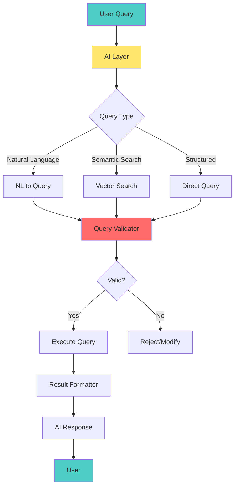

# 📘 **NODEJS AI DEVELOPER MASTERY - Lesson 10: AI Database Operations**

**Date**: 26-03-18
**Level**: 🟢 Beginner → 🔴 Senior Engineer
**Series**: AI Developer Fundamentals - Part 2
**Time**: 65 minutes
**Prerequisites**: Lesson 7-9 (Function Calling, Orchestration, API Integration)

---

## 🎯 **LEARNING OBJECTIVES**

After completing this **comprehensive** lesson, you will:

1. ✅ **Understand AI-Database Patterns** - Query generation, data retrieval, validation
2. ✅ **Implement Natural Language Queries** - Convert NL to database queries
3. ✅ **Master Vector Search** - Semantic search, similarity, embeddings
4. ✅ **Build RAG Foundation** - Retrieval Augmented Generation basics
5. ✅ **Handle Query Validation** - Security, injection prevention, limits
6. ✅ **Implement Caching** - Query result caching, invalidation
7. ✅ **Production Patterns** - Monitoring, optimization, error handling

---

## 📦 **PART 1: AI-DATABASE INTEGRATION PATTERNS**

### **Database Access Patterns for AI**



**Key Patterns**:
- ✅ **Natural Language → Query** - Convert user questions to SQL/NoSQL
- ✅ **Semantic Search** - Find similar documents using embeddings
- ✅ **Query Validation** - Prevent injection, enforce limits
- ✅ **Result Formatting** - Convert DB results to AI-friendly format
- ✅ **Response Generation** - AI explains query results

---

### **Architecture Overview**

```typescript
// ─────────────────────────────────────────────
// AI Database Layer Architecture
// ─────────────────────────────────────────────

/**
 * Components:
 * 
 * 1. Query Generator
 *    - Converts natural language to database queries
 *    - Supports SQL, MongoDB, Mongoose
 * 
 * 2. Query Validator
 *    - Validates query safety
 *    - Enforces limits and permissions
 * 
 * 3. Query Executor
 *    - Executes validated queries
 *    - Handles connections, errors
 * 
 * 4. Result Formatter
 *    - Formats results for AI consumption
 *    - Handles large result sets
 * 
 * 5. Response Generator
 *    - AI generates natural language response
 *    - Includes citations, context
 */
```

---

## 📦 **PART 2: NATURAL LANGUAGE QUERIES**

### **NL to Query Converter**

```typescript
// ─────────────────────────────────────────────
// ai/database/nl-query-generator.service.ts
// ─────────────────────────────────────────────
import { Injectable, Inject, Logger } from '@nestjs/common';
import { OpenAI } from 'openai';
import { AiService } from '../ai.service';

export interface QueryGenerationResult {
  success: boolean;
  query?: any;
  queryType?: 'mongodb' | 'sql' | 'aggregate';
  explanation?: string;
  error?: string;
}

@Injectable()
export class NLQueryGeneratorService extends AiService {
  private readonly logger = new Logger(NLQueryGeneratorService.name);

  constructor(
    @Inject('OPENAI_CLIENT') protected readonly client: OpenAI,
  ) {
    super(client, null);
  }

  // ─────────────────────────────────────────────
  // Generate MongoDB Query
  // ─────────────────────────────────────────────
  async generateMongoDBQuery(
    naturalLanguage: string,
    schema: object,
    options: {
      collection: string;
      maxResults?: number;
    },
  ): Promise<QueryGenerationResult> {
    const prompt = `
You are an expert MongoDB developer. Convert the natural language query into a MongoDB query.

Collection Schema:
${JSON.stringify(schema, null, 2)}

Collection: ${options.collection}
Max Results: ${options.maxResults || 10}

Natural Language Query: "${naturalLanguage}"

Generate a MongoDB query in JSON format.
Include:
1. The query object
2. Projection (fields to return)
3. Sort order
4. Limit

Respond ONLY with valid JSON:
{
  "query": { ... },
  "projection": { ... },
  "sort": { ... },
  "limit": number,
  "explanation": "Brief explanation of the query"
}

Rules:
- Use proper MongoDB operators ($eq, $gt, $lt, $in, $regex, etc.)
- Handle date comparisons correctly
- Use case-insensitive regex for string matches
- Never include _id in projection unless specifically requested
`;

    try {
      const response = await this.client.chat.completions.create({
        model: 'gpt-4-turbo-preview',
        messages: [
          {
            role: 'system',
            content: 'You are a MongoDB expert. Generate accurate, efficient queries. Respond ONLY with JSON.',
          },
          {
            role: 'user',
            content: prompt,
          },
        ],
        temperature: 0,
        response_format: { type: 'json_object' },
      });

      const content = response.choices[0]?.message?.content;

      if (!content) {
        return {
          success: false,
          error: 'Empty response from AI',
        };
      }

      const parsed = JSON.parse(content);

      return {
        success: true,
        query: parsed.query,
        queryType: 'mongodb',
        explanation: parsed.explanation,
      };
    } catch (error) {
      this.logger.error(`Query generation failed: ${error.message}`);
      return {
        success: false,
        error: error.message,
      };
    }
  }

  // ─────────────────────────────────────────────
  // Generate SQL Query
  // ─────────────────────────────────────────────
  async generateSQLQuery(
    naturalLanguage: string,
    schema: {
      tableName: string;
      columns: Array<{ name: string; type: string }>;
    },
    options: {
      maxResults?: number;
      readOnly?: boolean;
    } = {},
  ): Promise<QueryGenerationResult> {
    const prompt = `
You are an expert SQL developer. Convert the natural language query into a SQL SELECT query.

Table Schema:
Table: ${schema.tableName}
Columns:
${schema.columns.map(c => `- ${c.name} (${c.type})`).join('\n')}

Natural Language Query: "${naturalLanguage}"

Generate a SQL query.
Respond ONLY with valid JSON:
{
  "sql": "SELECT ...",
  "parameters": { ... },  // For parameterized queries
  "explanation": "Brief explanation"
}

Rules:
- Use parameterized queries to prevent SQL injection
- Always include LIMIT clause (default: ${options.maxResults || 10})
- Only generate SELECT queries (read-only)
- Use proper JOIN syntax if multiple tables
- Include ORDER BY when appropriate
`;

    try {
      const response = await this.client.chat.completions.create({
        model: 'gpt-4-turbo-preview',
        messages: [
          {
            role: 'system',
            content: 'You are a SQL expert. Generate safe, efficient queries. Respond ONLY with JSON.',
          },
          {
            role: 'user',
            content: prompt,
          },
        ],
        temperature: 0,
        response_format: { type: 'json_object' },
      });

      const content = response.choices[0]?.message?.content;

      if (!content) {
        return {
          success: false,
          error: 'Empty response from AI',
        };
      }

      const parsed = JSON.parse(content);

      // Validate: Only SELECT allowed
      if (options.readOnly !== false) {
        const upperSQL = parsed.sql.toUpperCase().trim();
        if (!upperSQL.startsWith('SELECT')) {
          return {
            success: false,
            error: 'Only SELECT queries are allowed',
          };
        }

        // Block dangerous operations
        const dangerous = ['DROP', 'DELETE', 'UPDATE', 'INSERT', 'TRUNCATE'];
        for (const keyword of dangerous) {
          if (upperSQL.includes(keyword)) {
            return {
              success: false,
              error: `${keyword} operations are not allowed`,
            };
          }
        }
      }

      return {
        success: true,
        query: parsed.sql,
        queryType: 'sql',
        explanation: parsed.explanation,
      };
    } catch (error) {
      this.logger.error(`SQL query generation failed: ${error.message}`);
      return {
        success: false,
        error: error.message,
      };
    }
  }

  // ─────────────────────────────────────────────
  // Generate Aggregation Pipeline
  // ─────────────────────────────────────────────
  async generateAggregationPipeline(
    naturalLanguage: string,
    schema: object,
    collection: string,
  ): Promise<QueryGenerationResult> {
    const prompt = `
You are a MongoDB aggregation expert. Create an aggregation pipeline.

Collection: ${collection}
Schema: ${JSON.stringify(schema, null, 2)}

Request: "${naturalLanguage}"

Generate a MongoDB aggregation pipeline.
Respond ONLY with valid JSON:
{
  "pipeline": [
    { "$match": { ... } },
    { "$group": { ... } },
    { "$project": { ... } }
  ],
  "explanation": "Step-by-step explanation"
}
`;

    try {
      const response = await this.client.chat.completions.create({
        model: 'gpt-4-turbo-preview',
        messages: [
          {
            role: 'system',
            content: 'MongoDB aggregation expert. Respond ONLY with JSON.',
          },
          {
            role: 'user',
            content: prompt,
          },
        ],
        temperature: 0,
        response_format: { type: 'json_object' },
      });

      const content = response.choices[0]?.message?.content;

      if (!content) {
        return { success: false, error: 'Empty response' };
      }

      const parsed = JSON.parse(content);

      return {
        success: true,
        query: parsed.pipeline,
        queryType: 'aggregate',
        explanation: parsed.explanation,
      };
    } catch (error) {
      return { success: false, error: error.message };
    }
  }
}
```

---

### **Query Validator Service**

```typescript
// ─────────────────────────────────────────────
// ai/database/query-validator.service.ts
// ─────────────────────────────────────────────
import { Injectable, Logger } from '@nestjs/common';

@Injectable()
export class QueryValidatorService {
  private readonly logger = new Logger(QueryValidatorService.name);

  // ─────────────────────────────────────────────
  // Validate MongoDB Query
  // ─────────────────────────────────────────────
  validateMongoDBQuery(query: any, options: {
    maxLimit?: number;
    allowedOperators?: string[];
    forbiddenFields?: string[];
  } = {}): {
    valid: boolean;
    errors: string[];
    warnings: string[];
  } {
    const errors: string[] = [];
    const warnings: string[] = [];

    const maxLimit = options.maxLimit || 100;
    const allowedOperators = options.allowedOperators || [
      '$eq', '$ne', '$gt', '$gte', '$lt', '$lte',
      '$in', '$nin', '$and', '$or', '$not', '$nor',
      '$exists', '$type', '$regex', '$options',
      '$text', '$search', '$language',
    ];
    const forbiddenFields = options.forbiddenFields || [
      'password', 'secret', 'token', 'apiKey',
    ];

    // Check for forbidden operators
    this.checkForbiddenOperators(query, ['$where', '$function', '$accumulator'], errors);

    // Check for forbidden fields
    this.checkForbiddenFields(query, forbiddenFields, warnings);

    // Check limit
    if (query.limit && query.limit > maxLimit) {
      errors.push(`Limit ${query.limit} exceeds maximum allowed ${maxLimit}`);
    }

    // Check for expensive operations
    if (query.$text && !query.$text.$search) {
      errors.push('Text search requires $search parameter');
    }

    return {
      valid: errors.length === 0,
      errors,
      warnings,
    };
  }

  // ─────────────────────────────────────────────
  // Validate SQL Query
  // ─────────────────────────────────────────────
  validateSQLQuery(sql: string, options: {
    readOnly?: boolean;
    maxLimit?: number;
  } = {}): {
    valid: boolean;
    errors: string[];
    warnings: string[];
  } {
    const errors: string[] = [];
    const warnings: string[] = [];

    const upperSQL = sql.toUpperCase().trim();

    // Check for dangerous operations
    if (options.readOnly !== false) {
      const dangerous = ['DROP', 'DELETE', 'UPDATE', 'INSERT', 'TRUNCATE', 'ALTER', 'CREATE'];
      for (const op of dangerous) {
        if (upperSQL.includes(op)) {
          errors.push(`${op} operations are not allowed`);
        }
      }
    }

    // Check for multiple statements
    if (sql.includes(';') && sql.split(';').filter(s => s.trim()).length > 1) {
      errors.push('Multiple statements not allowed');
    }

    // Check for system tables
    const systemTables = ['USERS', 'PG_', 'MYSQL_', 'INFORMATION_SCHEMA'];
    for (const table of systemTables) {
      if (upperSQL.includes(table)) {
        warnings.push(`Accessing system table ${table}`);
      }
    }

    // Check LIMIT
    const limitMatch = sql.match(/LIMIT\s+(\d+)/i);
    if (limitMatch) {
      const limit = parseInt(limitMatch[1], 10);
      const maxLimit = options.maxLimit || 1000;
      if (limit > maxLimit) {
        errors.push(`LIMIT ${limit} exceeds maximum ${maxLimit}`);
      }
    } else if (!sql.includes('LIMIT') && upperSQL.startsWith('SELECT')) {
      warnings.push('No LIMIT clause - consider adding one');
    }

    return {
      valid: errors.length === 0,
      errors,
      warnings,
    };
  }

  private checkForbiddenOperators(obj: any, forbidden: string[], errors: string[]): void {
    if (!obj || typeof obj !== 'object') return;

    for (const key of Object.keys(obj)) {
      if (forbidden.includes(key)) {
        errors.push(`Forbidden operator: ${key}`);
      }
      if (typeof obj[key] === 'object') {
        this.checkForbiddenOperators(obj[key], forbidden, errors);
      }
    }
  }

  private checkForbiddenFields(obj: any, forbidden: string[], warnings: string[]): void {
    if (!obj || typeof obj !== 'object') return;

    for (const key of Object.keys(obj)) {
      if (forbidden.some(f => key.toLowerCase().includes(f.toLowerCase()))) {
        warnings.push(`Potentially sensitive field: ${key}`);
      }
      if (typeof obj[key] === 'object') {
        this.checkForbiddenFields(obj[key], forbidden, warnings);
      }
    }
  }
}
```

---

## 📦 **PART 3: VECTOR SEARCH & SIMILARITY**

### **Vector Search Service**

```typescript
// ─────────────────────────────────────────────
// ai/database/vector-search.service.ts
// ─────────────────────────────────────────────
import { Injectable, Inject } from '@nestjs/common';
import { Model } from 'mongoose';
import { InjectModel } from '@nestjs/mongoose';
import { EmbeddingService } from '../embedding/embedding.service';

export interface VectorSearchResult {
  document: any;
  similarity: number;
  rank: number;
}

@Injectable()
export class VectorSearchService {
  constructor(
    @InjectModel('Document') private documentModel: Model<any>,
    private embeddingService: EmbeddingService,
  ) {}

  // ─────────────────────────────────────────────
  // Semantic Search
  // ─────────────────────────────────────────────
  async semanticSearch(
    query: string,
    options: {
      collection?: string;
      limit?: number;
      threshold?: number;
      filters?: any;
    } = {},
  ): Promise<VectorSearchResult[]> {
    const {
      limit = 10,
      threshold = 0.5,
      filters = {},
    } = options;

    // Generate query embedding
    const queryEmbedding = await this.embeddingService.embed(query);

    // Search in database
    const documents = await this.documentModel.find(filters);

    // Calculate similarity for each document
    const results: VectorSearchResult[] = [];

    for (const doc of documents) {
      if (!doc.embedding) continue;

      const similarity = this.embeddingService.cosineSimilarity(
        queryEmbedding,
        doc.embedding,
      );

      if (similarity >= threshold) {
        results.push({
          document: doc,
          similarity,
          rank: 0,  // Will be set after sorting
        });
      }
    }

    // Sort by similarity and assign ranks
    results.sort((a, b) => b.similarity - a.similarity);
    results.forEach((r, i) => r.rank = i + 1);

    return results.slice(0, limit);
  }

  // ─────────────────────────────────────────────
  // Hybrid Search (Vector + Keyword)
  // ─────────────────────────────────────────────
  async hybridSearch(
    query: string,
    options: {
      vectorWeight?: number;
      keywordWeight?: number;
      limit?: number;
    } = {},
  ): Promise<VectorSearchResult[]> {
    const {
      vectorWeight = 0.7,
      keywordWeight = 0.3,
      limit = 10,
    } = options;

    // Vector search
    const vectorResults = await this.semanticSearch(query, { limit: limit * 2 });

    // Keyword search
    const keywordResults = await this.documentModel.find({
      $text: { $search: query },
    }).limit(limit * 2);

    // Combine and rank
    const combined = new Map<string, { document: any; score: number }>();

    // Add vector results
    for (const result of vectorResults) {
      const id = result.document._id.toString();
      combined.set(id, {
        document: result.document,
        score: result.similarity * vectorWeight,
      });
    }

    // Add/merge keyword results
    for (const doc of keywordResults) {
      const id = doc._id.toString();
      const existing = combined.get(id);

      if (existing) {
        // Boost existing score
        existing.score += keywordWeight;
      } else {
        combined.set(id, {
          document: doc,
          score: keywordWeight,
        });
      }
    }

    // Convert to results and sort
    const results = Array.from(combined.values())
      .map((item, i) => ({
        document: item.document,
        similarity: item.score,
        rank: i + 1,
      }))
      .sort((a, b) => b.similarity - a.similarity);

    return results.slice(0, limit);
  }

  // ─────────────────────────────────────────────
  // Similarity Search with Metadata Filtering
  // ─────────────────────────────────────────────
  async filteredSimilaritySearch(
    query: string,
    filters: {
      field: string;
      operator: '$eq' | '$ne' | '$in' | '$gt' | '$lt';
      value: any;
    }[],
    options: {
      limit?: number;
      threshold?: number;
    } = {},
  ): Promise<VectorSearchResult[]> {
    // Build MongoDB filter
    const mongoFilter: any = {};

    for (const filter of filters) {
      mongoFilter[`metadata.${filter.field}`] = {
        [filter.operator]: filter.value,
      };
    }

    return this.semanticSearch(query, {
      ...options,
      filters: mongoFilter,
    });
  }
}
```

---

### **RAG (Retrieval Augmented Generation) Service**

```typescript
// ─────────────────────────────────────────────
// ai/database/rag.service.ts
// ─────────────────────────────────────────────
import { Injectable, Logger } from '@nestjs/common';
import { VectorSearchService, VectorSearchResult } from './vector-search.service';
import { ChatService } from '../chat/chat.service';

export interface RAGOptions {
  topK?: number;
  similarityThreshold?: number;
  includeSources?: boolean;
  systemPrompt?: string;
  maxContextLength?: number;
}

export interface RAGResponse {
  answer: string;
  sources?: Array<{
    document: any;
    similarity: number;
    excerpt?: string;
  }>;
  contextUsed: string;
  confidence?: number;
}

@Injectable()
export class RAGService {
  private readonly logger = new Logger(RAGService.name);

  constructor(
    private vectorSearch: VectorSearchService,
    private chatService: ChatService,
  ) {}

  // ─────────────────────────────────────────────
  // Query with RAG
  // ─────────────────────────────────────────────
  async query(
    question: string,
    options: RAGOptions = {},
  ): Promise<RAGResponse> {
    const {
      topK = 5,
      similarityThreshold = 0.6,
      includeSources = true,
      maxContextLength = 4000,
    } = options;

    // Step 1: Retrieve relevant documents
    const searchResults = await this.vectorSearch.semanticSearch(question, {
      limit: topK,
      threshold: similarityThreshold,
    });

    if (searchResults.length === 0) {
      return {
        answer: "I don't have enough information to answer that question based on the available documents.",
        sources: [],
        contextUsed: '',
        confidence: 0,
      };
    }

    // Step 2: Build context from retrieved documents
    const context = this.buildContext(searchResults, maxContextLength);

    // Step 3: Generate answer with AI
    const systemPrompt = options.systemPrompt || `
You are a helpful assistant that answers questions based on the provided context.
- Use ONLY the information from the context to answer
- If the context doesn't contain enough information, say so
- Cite your sources when possible
- Be concise but thorough
`;

    const userPrompt = `
Context:
${context}

Question: ${question}

Please answer the question based on the context provided above.`;

    const answer = await this.chatService.complete([
      { role: 'system', content: systemPrompt },
      { role: 'user', content: userPrompt },
    ]);

    // Step 4: Build response
    const response: RAGResponse = {
      answer,
      contextUsed: context,
      confidence: this.calculateConfidence(searchResults),
    };

    if (includeSources) {
      response.sources = searchResults.map(result => ({
        document: result.document,
        similarity: result.similarity,
        excerpt: this.extractExcerpt(result.document, question),
      }));
    }

    return response;
  }

  // ─────────────────────────────────────────────
  // Build Context from Documents
  // ─────────────────────────────────────────────
  private buildContext(
    results: VectorSearchResult[],
    maxLength: number,
  ): string {
    const chunks: string[] = [];
    let currentLength = 0;

    for (const result of results) {
      const content = result.document.content || result.document.text || '';
      const chunk = `[Source ${result.rank}, Similarity: ${result.similarity.toFixed(2)}]\n${content}`;

      if (currentLength + chunk.length > maxLength) {
        break;
      }

      chunks.push(chunk);
      currentLength += chunk.length;
    }

    return chunks.join('\n\n---\n\n');
  }

  // ─────────────────────────────────────────────
  // Calculate Confidence Score
  // ─────────────────────────────────────────────
  private calculateConfidence(results: VectorSearchResult[]): number {
    if (results.length === 0) return 0;

    // Average similarity of top results
    const avgSimilarity = results.reduce((sum, r) => sum + r.similarity, 0) / results.length;

    // Boost if multiple relevant results
    const countBoost = Math.min(results.length / 5, 1) * 0.2;

    return Math.min(avgSimilarity + countBoost, 1);
  }

  // ─────────────────────────────────────────────
  // Extract Excerpt
  // ─────────────────────────────────────────────
  private extractExcerpt(document: any, question: string): string {
    const content = document.content || document.text || '';

    // Simple excerpt: first 200 chars
    if (content.length <= 200) {
      return content;
    }

    // Try to find relevant section
    const keywords = question.toLowerCase().split(' ').filter(w => w.length > 3);

    for (const keyword of keywords) {
      const index = content.toLowerCase().indexOf(keyword);
      if (index !== -1) {
        const start = Math.max(0, index - 100);
        const end = Math.min(content.length, index + 100);
        return `...${content.substring(start, end)}...`;
      }
    }

    return content.substring(0, 200) + '...';
  }
}
```

---

## 📦 **PART 4: QUERY EXECUTION & CACHING**

### **Query Executor Service**

```typescript
// ─────────────────────────────────────────────
// ai/database/query-executor.service.ts
// ─────────────────────────────────────────────
import { Injectable, Logger } from '@nestjs/common';
import { InjectModel } from '@nestjs/mongoose';
import { Model } from 'mongoose';
import { QueryValidatorService } from './query-validator.service';
import { CacheService } from '../cache/cache.service';

@Injectable()
export class QueryExecutorService {
  private readonly logger = new Logger(QueryExecutorService.name);

  constructor(
    @InjectModel('Document') private documentModel: Model<any>,
    private validator: QueryValidatorService,
    private cache: CacheService,
  ) {}

  // ─────────────────────────────────────────────
  // Execute MongoDB Query
  // ─────────────────────────────────────────────
  async executeMongoDB(
    query: any,
    options: {
      collection?: string;
      useCache?: boolean;
      cacheTTL?: number;
    } = {},
  ): Promise<{
    data: any[];
    count: number;
    executionTime: number;
    fromCache: boolean;
  }> {
    const startTime = Date.now();
    const cacheKey = options.useCache ? this.generateCacheKey('mongodb', query) : null;

    // Check cache
    if (cacheKey) {
      const cached = await this.cache.get(cacheKey);
      if (cached) {
        return {
          data: cached.data,
          count: cached.count,
          executionTime: Date.now() - startTime,
          fromCache: true,
        };
      }
    }

    // Validate query
    const validation = this.validator.validateMongoDBQuery(query);

    if (!validation.valid) {
      throw new Error(`Invalid query: ${validation.errors.join(', ')}`);
    }

    // Log warnings
    validation.warnings.forEach(w => this.logger.warn(w));

    // Execute query
    const dbQuery = this.documentModel.find(query.query || {});

    if (query.projection) {
      dbQuery.select(query.projection);
    }

    if (query.sort) {
      dbQuery.sort(query.sort);
    }

    if (query.limit) {
      dbQuery.limit(query.limit);
    }

    const data = await dbQuery.lean();
    const count = data.length;

    // Cache result
    if (cacheKey && options.cacheTTL) {
      await this.cache.set(cacheKey, { data, count }, options.cacheTTL);
    }

    return {
      data,
      count,
      executionTime: Date.now() - startTime,
      fromCache: false,
    };
  }

  // ─────────────────────────────────────────────
  // Execute Aggregation Pipeline
  // ─────────────────────────────────────────────
  async executeAggregation(
    pipeline: any[],
    options: {
      collection?: string;
      useCache?: boolean;
      cacheTTL?: number;
    } = {},
  ): Promise<{
    data: any[];
    executionTime: number;
    fromCache: boolean;
  }> {
    const startTime = Date.now();
    const cacheKey = options.useCache ? this.generateCacheKey('aggregate', pipeline) : null;

    // Check cache
    if (cacheKey) {
      const cached = await this.cache.get(cacheKey);
      if (cached) {
        return {
          data: cached,
          executionTime: Date.now() - startTime,
          fromCache: true,
        };
      }
    }

    // Execute aggregation
    const data = await this.documentModel.aggregate(pipeline);

    // Cache result
    if (cacheKey && options.cacheTTL) {
      await this.cache.set(cacheKey, data, options.cacheTTL);
    }

    return {
      data,
      executionTime: Date.now() - startTime,
      fromCache: false,
    };
  }

  private generateCacheKey(type: string, query: any): string {
    const hash = require('crypto')
      .createHash('md5')
      .update(JSON.stringify(query))
      .digest('hex');

    return `query:${type}:${hash}`;
  }
}
```

---

## ✅ **AI DATABASE CHECKLIST**

```
Query Generation
[ ] NL to MongoDB working
[ ] NL to SQL working
[ ] Aggregation pipeline generation
[ ] Query validation implemented

Vector Search
[ ] Embeddings generated
[ ] Similarity search working
[ ] Hybrid search implemented
[ ] Metadata filtering

RAG
[ ] Document retrieval
[ ] Context building
[ ] Response generation
[ ] Source citation

Caching
[ ] Query result caching
[ ] Cache invalidation
[ ] TTL management
[ ] Cache hit tracking

Security
[ ] SQL injection prevention
[ ] Query limits enforced
[ ] Forbidden operators blocked
[ ] Sensitive fields protected
```

---

## 🎯 **KNOWLEDGE CHECK**

### **Question 1: Why Validate AI-Generated Queries?**

<details>
<summary>💡 Click to reveal answer</summary>

**Security Reasons**:
- ✅ **Prevent Injection** - AI might generate harmful queries
- ✅ **Enforce Limits** - Prevent expensive operations
- ✅ **Protect Sensitive Data** - Block access to private fields
- ✅ **Cost Control** - Limit result sizes, complexity
- ✅ **Compliance** - Meet data access regulations

**Never trust AI-generated queries without validation!**
</details>

---

### **Question 2: RAG vs Fine-tuning**

<details>
<summary>💡 Click to reveal answer</summary>

**Use RAG When**:
- ✅ Data changes frequently
- ✅ Need citations/sources
- ✅ Multiple data sources
- ✅ Cost-sensitive

**Use Fine-tuning When**:
- ✅ Static knowledge
- ✅ Specific style/tone needed
- ✅ Domain-specific behavior
- ✅ Higher accuracy needed

**Best Practice**: RAG for most enterprise use cases!
</details>

---

## 📚 **ADDITIONAL RESOURCES**

- **RAG Paper**: [https://arxiv.org/abs/2005.11401](https://arxiv.org/abs/2005.11401)
- **Vector Search**: [https://www.pinecone.io/learn/vector-similarity](https://www.pinecone.io/learn/vector-similarity)
- **MongoDB Aggregation**: [https://docs.mongodb.com/manual/aggregation](https://docs.mongodb.com/manual/aggregation)

---

## 🎓 **HOMEWORK**

1. ✅ Build NL to MongoDB converter
2. ✅ Implement query validator
3. ✅ Create vector search service
4. ✅ Build RAG pipeline
5. ✅ Add query result caching
6. ✅ Implement hybrid search
7. ✅ Create aggregation generator
8. ✅ Add execution monitoring

---

**Next Lesson**: Embeddings & Vector Search - Deep Dive into Semantic Search
**Date**: 26-03-18
**Status**: ✅ Complete

---
*26-03-18*
