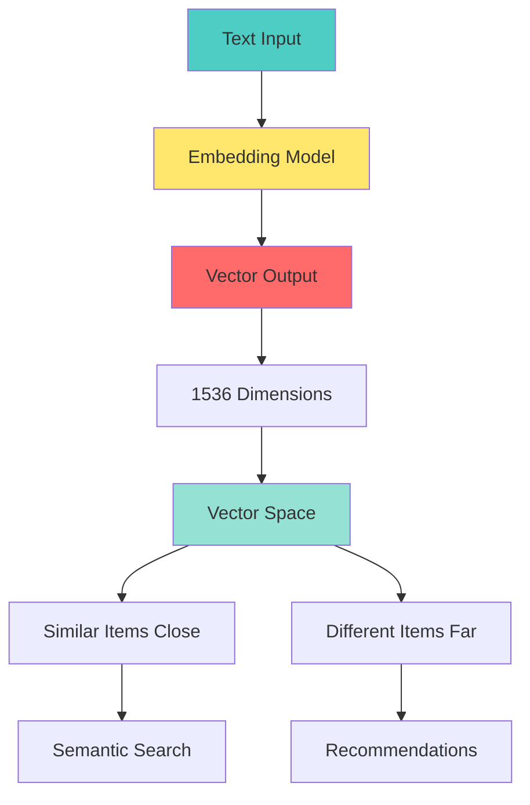

# 📘 **NODEJS AI DEVELOPER MASTERY - Lesson 11: Embeddings & Vector Search**

**Date**: 26-03-18
**Level**: 🟢 Beginner → 🔴 Senior Engineer
**Series**: AI Developer Fundamentals - Part 3
**Time**: 60 minutes
**Prerequisites**: Lesson 1-10 (AI Foundations & Function Calling complete)

---

## 🎯 **LEARNING OBJECTIVES**

After completing this **comprehensive** lesson, you will:

1. ✅ **Understand Embeddings** - What they are, how they work, use cases
2. ✅ **Master Vector Mathematics** - Cosine similarity, dot product, Euclidean distance
3. ✅ **Generate Embeddings** - OpenAI, open-source models, batch processing
4. ✅ **Implement Vector Search** - Similarity search, ranking, filtering
5. ✅ **Build Semantic Search** - Beyond keywords, meaning-based search
6. ✅ **Optimize Vector Operations** - Indexing, approximation, caching
7. ✅ **Production Patterns** - Monitoring, updates, versioning

---

## 📦 **PART 1: EMBEDDINGS FUNDAMENTALS**

### **What are Embeddings?**



**Embeddings Are**:
- ✅ **Numerical representations** of text in high-dimensional space
- ✅ **Semantic meaning** captured in vector relationships
- ✅ **Similar concepts** have similar vectors (close in space)
- ✅ **Mathematical operations** possible (similarity, clustering)

**Common Embedding Models**:

| Model | Dimensions | Max Input | Use Case |
|-------|-----------|-----------|----------|
| **text-embedding-3-small** | 1536 | 8191 tokens | General purpose, cost-effective |
| **text-embedding-3-large** | 3072 | 8191 tokens | High accuracy, complex tasks |
| **text-embedding-ada-002** | 1536 | 8191 tokens | Legacy, still widely used |
| **all-MiniLM-L6-v2** | 384 | 512 tokens | Open-source, fast |

---

### **Vector Space Visualization**

```typescript
// ─────────────────────────────────────────────
// Understanding Vector Space
// ─────────────────────────────────────────────

/**
 * In vector space:
 * - Similar meanings = Close vectors
 * - Different meanings = Distant vectors
 * - Direction matters = Semantic relationships
 * 
 * Example (simplified to 2D):
 * 
 *                    ↑
 *                    |  "happy"
 *                    |     •
 *                    |
 *         "joyful"   |        "excited"
 *             •      |           •
 *                    |
 * ───────────────────┼──────────────────→
 *                    |
 *                    |
 *             "sad"  |        "angry"
 *               •    |           •
 *                    |
 *                    |  "frustrated"
 *                    |     •
 *                    ↓
 * 
 * "happy", "joyful", "excited" cluster together
 * "sad", "angry", "frustrated" cluster together
 * Distance between clusters = semantic difference
 */
```

---

## 📦 **PART 2: VECTOR MATHEMATICS**

### **Similarity Metrics**

```typescript
// ─────────────────────────────────────────────
// ai/embeddings/vector-math.service.ts
// ─────────────────────────────────────────────
import { Injectable } from '@nestjs/common';

export type Vector = number[];

export enum SimilarityMetric {
  COSINE = 'cosine',
  DOT_PRODUCT = 'dot_product',
  EUCLIDEAN = 'euclidean',
  MANHATTAN = 'manhattan',
}

@Injectable()
export class VectorMathService {
  // ─────────────────────────────────────────────
  // Cosine Similarity (Most Common)
  // ─────────────────────────────────────────────
  cosineSimilarity(vecA: Vector, vecB: Vector): number {
    if (vecA.length !== vecB.length) {
      throw new Error('Vectors must have the same length');
    }

    if (vecA.length === 0) {
      return 0;
    }

    let dotProduct = 0;
    let magnitudeA = 0;
    let magnitudeB = 0;

    for (let i = 0; i < vecA.length; i++) {
      dotProduct += vecA[i] * vecB[i];
      magnitudeA += vecA[i] * vecA[i];
      magnitudeB += vecB[i] * vecB[i];
    }

    magnitudeA = Math.sqrt(magnitudeA);
    magnitudeB = Math.sqrt(magnitudeB);

    if (magnitudeA === 0 || magnitudeB === 0) {
      return 0;
    }

    // Cosine similarity ranges from -1 to 1
    // 1 = identical direction, 0 = orthogonal, -1 = opposite
    return dotProduct / (magnitudeA * magnitudeB);
  }

  // ─────────────────────────────────────────────
  // Dot Product (for normalized vectors)
  // ─────────────────────────────────────────────
  dotProduct(vecA: Vector, vecB: Vector): number {
    if (vecA.length !== vecB.length) {
      throw new Error('Vectors must have the same length');
    }

    let result = 0;
    for (let i = 0; i < vecA.length; i++) {
      result += vecA[i] * vecB[i];
    }

    return result;
  }

  // ─────────────────────────────────────────────
  // Euclidean Distance
  // ─────────────────────────────────────────────
  euclideanDistance(vecA: Vector, vecB: Vector): number {
    if (vecA.length !== vecB.length) {
      throw new Error('Vectors must have the same length');
    }

    let sum = 0;
    for (let i = 0; i < vecA.length; i++) {
      const diff = vecA[i] - vecB[i];
      sum += diff * diff;
    }

    return Math.sqrt(sum);
  }

  // ─────────────────────────────────────────────
  // Manhattan Distance
  // ─────────────────────────────────────────────
  manhattanDistance(vecA: Vector, vecB: Vector): number {
    if (vecA.length !== vecB.length) {
      throw new Error('Vectors must have the same length');
    }

    let sum = 0;
    for (let i = 0; i < vecA.length; i++) {
      sum += Math.abs(vecA[i] - vecB[i]);
    }

    return sum;
  }

  // ─────────────────────────────────────────────
  // Normalize Vector (unit length)
  // ─────────────────────────────────────────────
  normalize(vec: Vector): Vector {
    const magnitude = Math.sqrt(vec.reduce((sum, val) => sum + val * val, 0));

    if (magnitude === 0) {
      return vec;
    }

    return vec.map(val => val / magnitude);
  }

  // ─────────────────────────────────────────────
  // Vector Magnitude
  // ─────────────────────────────────────────────
  magnitude(vec: Vector): number {
    return Math.sqrt(vec.reduce((sum, val) => sum + val * val, 0));
  }

  // ─────────────────────────────────────────────
  // Find Nearest Neighbors
  // ─────────────────────────────────────────────
  findNearestNeighbors(
    queryVector: Vector,
    candidates: Array<{ vector: Vector; metadata?: any }>,
    options: {
      metric?: SimilarityMetric;
      topK?: number;
      threshold?: number;
    } = {},
  ): Array<{
    metadata?: any;
    similarity: number;
    rank: number;
  }> {
    const {
      metric = SimilarityMetric.COSINE,
      topK = 10,
      threshold = 0,
    } = options;

    // Calculate similarity for each candidate
    const scored = candidates.map(candidate => {
      let similarity: number;

      switch (metric) {
        case SimilarityMetric.COSINE:
          similarity = this.cosineSimilarity(queryVector, candidate.vector);
          break;
        case SimilarityMetric.DOT_PRODUCT:
          similarity = this.dotProduct(queryVector, candidate.vector);
          break;
        case SimilarityMetric.EUCLIDEAN:
          // Convert distance to similarity (inverse)
          similarity = 1 / (1 + this.euclideanDistance(queryVector, candidate.vector));
          break;
        case SimilarityMetric.MANHATTAN:
          similarity = 1 / (1 + this.manhattanDistance(queryVector, candidate.vector));
          break;
        default:
          similarity = this.cosineSimilarity(queryVector, candidate.vector);
      }

      return {
        metadata: candidate.metadata,
        similarity,
        rank: 0,
      };
    });

    // Filter by threshold
    const filtered = scored.filter(s => s.similarity >= threshold);

    // Sort by similarity (descending)
    filtered.sort((a, b) => b.similarity - a.similarity);

    // Assign ranks
    filtered.forEach((item, i) => item.rank = i + 1);

    // Return top K
    return filtered.slice(0, topK);
  }

  // ─────────────────────────────────────────────
  // Batch Similarity Matrix
  // ─────────────────────────────────────────────
  similarityMatrix(vectors: Vector[]): number[][] {
    const n = vectors.length;
    const matrix: number[][] = [];

    for (let i = 0; i < n; i++) {
      matrix[i] = [];
      for (let j = 0; j < n; j++) {
        if (i === j) {
          matrix[i][j] = 1;  // Self-similarity = 1
        } else if (j < i) {
          matrix[i][j] = matrix[j][i];  // Symmetric
        } else {
          matrix[i][j] = this.cosineSimilarity(vectors[i], vectors[j]);
        }
      }
    }

    return matrix;
  }

  // ─────────────────────────────────────────────
  // Cluster Centroid
  // ─────────────────────────────────────────────
  centroid(vectors: Vector[]): Vector {
    if (vectors.length === 0) {
      throw new Error('Cannot compute centroid of empty set');
    }

    const dimensions = vectors[0].length;
    const centroid: Vector = new Array(dimensions).fill(0);

    for (const vec of vectors) {
      for (let i = 0; i < dimensions; i++) {
        centroid[i] += vec[i];
      }
    }

    // Average
    for (let i = 0; i < dimensions; i++) {
      centroid[i] /= vectors.length;
    }

    return centroid;
  }
}
```

---

## 📦 **PART 3: GENERATING EMBEDDINGS**

### **Embedding Service (OpenAI)**

```typescript
// ─────────────────────────────────────────────
// ai/embeddings/embedding-generator.service.ts
// ─────────────────────────────────────────────
import { Injectable, Inject, Logger } from '@nestjs/common';
import { OpenAI } from 'openai';
import { ConfigService } from '@nestjs/config';

export interface EmbeddingOptions {
  model?: string;
  dimensions?: number;
  encodingFormat?: 'float' | 'base64';
  user?: string;
}

export interface EmbeddingResult {
  embedding: number[];
  model: string;
  usage: {
    promptTokens: number;
    totalTokens: number;
  };
  inputLength: number;
}

@Injectable()
export class EmbeddingGeneratorService {
  private readonly logger = new Logger(EmbeddingGeneratorService.name);

  constructor(
    @Inject('OPENAI_CLIENT') private client: OpenAI,
    private configService: ConfigService,
  ) {}

  // ─────────────────────────────────────────────
  // Generate Single Embedding
  // ─────────────────────────────────────────────
  async embed(
    text: string,
    options: EmbeddingOptions = {},
  ): Promise<EmbeddingResult> {
    const model = options.model || this.configService.get('OPENAI_EMBEDDING_MODEL', 'text-embedding-3-large');
    const dimensions = options.dimensions || (model.includes('large') ? 3072 : 1536);

    try {
      const response = await this.client.embeddings.create({
        model,
        input: text,
        dimensions,
        encoding_format: options.encodingFormat || 'float',
        user: options.user,
      });

      return {
        embedding: response.data[0].embedding,
        model: response.model,
        usage: {
          promptTokens: response.usage?.prompt_tokens || 0,
          totalTokens: response.usage?.total_tokens || 0,
        },
        inputLength: text.length,
      };
    } catch (error) {
      this.logger.error(`Embedding generation failed: ${error.message}`);
      throw error;
    }
  }

  // ─────────────────────────────────────────────
  // Generate Batch Embeddings
  // ─────────────────────────────────────────────
  async embedBatch(
    texts: string[],
    options: EmbeddingOptions = {},
  ): Promise<Array<{
    index: number;
    embedding: number[];
    inputLength: number;
  }>> {
    const model = options.model || this.configService.get('OPENAI_EMBEDDING_MODEL', 'text-embedding-3-large');
    const dimensions = options.dimensions || (model.includes('large') ? 3072 : 1536);

    // OpenAI supports batch up to 2048 texts
    const batchSize = 2048;
    const batches = Math.ceil(texts.length / batchSize);
    const allResults: Array<{ index: number; embedding: number[]; inputLength: number }> = [];

    for (let i = 0; i < batches; i++) {
      const batch = texts.slice(i * batchSize, (i + 1) * batchSize);
      const batchStartIndex = i * batchSize;

      try {
        const response = await this.client.embeddings.create({
          model,
          input: batch,
          dimensions,
          encoding_format: 'float',
        });

        // Sort by index to maintain order
        const sorted = response.data.sort((a, b) => a.index - b.index);

        for (const item of sorted) {
          allResults.push({
            index: batchStartIndex + item.index,
            embedding: item.embedding,
            inputLength: batch[item.index].length,
          });
        }

        this.logger.log(`Processed batch ${i + 1}/${batches}`);

      } catch (error) {
        this.logger.error(`Batch ${i + 1} failed: ${error.message}`);
        throw error;
      }
    }

    return allResults;
  }

  // ─────────────────────────────────────────────
  // Generate with Retry
  // ─────────────────────────────────────────────
  async embedWithRetry(
    text: string,
    options: EmbeddingOptions & { maxRetries?: number } = {},
  ): Promise<EmbeddingResult> {
    const maxRetries = options.maxRetries || 3;
    let lastError: any;

    for (let attempt = 1; attempt <= maxRetries; attempt++) {
      try {
        return await this.embed(text, options);
      } catch (error) {
        lastError = error;

        // Don't retry certain errors
        if (error.status === 400 || error.status === 401) {
          throw error;
        }

        if (attempt < maxRetries) {
          const delay = Math.pow(2, attempt) * 1000;
          this.logger.log(`Retry ${attempt}/${maxRetries} after ${delay}ms`);
          await new Promise(r => setTimeout(r, delay));
        }
      }
    }

    throw lastError;
  }

  // ─────────────────────────────────────────────
  // Estimate Tokens for Text
  // ─────────────────────────────────────────────
  estimateTokens(text: string): number {
    // Rough estimate: 1 token ≈ 4 characters for English
    return Math.ceil(text.length / 4);
  }

  // ─────────────────────────────────────────────
  // Chunk Text for Embedding
  // ─────────────────────────────────────────────
  chunkText(
    text: string,
    options: {
      maxChunkSize?: number;  // in tokens
      overlap?: number;       // overlap between chunks
    } = {},
  ): string[] {
    const {
      maxChunkSize = 512,
      overlap = 50,
    } = options;

    // Split into sentences
    const sentences = text.match(/[^.!?]+[.!?]+/g) || [text];
    const chunks: string[] = [];
    let currentChunk: string[] = [];
    let currentTokens = 0;

    for (const sentence of sentences) {
      const sentenceTokens = this.estimateTokens(sentence);

      if (currentTokens + sentenceTokens > maxChunkSize) {
        // Save current chunk
        if (currentChunk.length > 0) {
          chunks.push(currentChunk.join(' '));
        }

        // Start new chunk with overlap
        const overlapCount = Math.min(overlap, currentChunk.length);
        currentChunk = currentChunk.slice(-overlapCount);
        currentTokens = currentChunk.reduce((sum, s) => sum + this.estimateTokens(s), 0);
      }

      currentChunk.push(sentence);
      currentTokens += sentenceTokens;
    }

    // Add final chunk
    if (currentChunk.length > 0) {
      chunks.push(currentChunk.join(' '));
    }

    return chunks;
  }

  // ─────────────────────────────────────────────
  // Embed Document with Chunks
  // ─────────────────────────────────────────────
  async embedDocument(
    text: string,
    options: {
      chunkSize?: number;
      chunkOverlap?: number;
    } = {},
  ): Promise<{
    chunks: string[];
    embeddings: number[][];
    totalTokens: number;
  }> {
    const chunks = this.chunkText(text, {
      maxChunkSize: options.chunkSize || 512,
      overlap: options.chunkOverlap || 50,
    });

    const embeddings = await this.embedBatch(chunks);

    return {
      chunks,
      embeddings: embeddings.map(e => e.embedding),
      totalTokens: embeddings.reduce((sum, e) => sum + this.estimateTokens(chunks[e.index]), 0),
    };
  }
}
```

---

## 📦 **PART 4: SEMANTIC SEARCH**

### **Semantic Search Service**

```typescript
// ─────────────────────────────────────────────
// ai/embeddings/semantic-search.service.ts
// ─────────────────────────────────────────────
import { Injectable, Logger } from '@nestjs/common';
import { InjectModel } from '@nestjs/mongoose';
import { Model } from 'mongoose';
import { EmbeddingGeneratorService } from './embedding-generator.service';
import { VectorMathService, Vector } from './vector-math.service';

export interface SearchableDocument {
  _id?: any;
  content: string;
  embedding?: number[];
  metadata?: {
    title?: string;
    tags?: string[];
    category?: string;
    createdAt?: Date;
  };
}

export interface SearchResult {
  document: SearchableDocument;
  similarity: number;
  rank: number;
  excerpt?: string;
}

@Injectable()
export class SemanticSearchService {
  private readonly logger = new Logger(SemanticSearchService.name);

  constructor(
    @InjectModel('Document') private documentModel: Model<SearchableDocument>,
    private embeddingService: EmbeddingGeneratorService,
    private vectorMath: VectorMathService,
  ) {}

  // ─────────────────────────────────────────────
  // Semantic Search
  // ─────────────────────────────────────────────
  async search(
    query: string,
    options: {
      limit?: number;
      threshold?: number;
      filters?: any;
      includeExcerpt?: boolean;
    } = {},
  ): Promise<SearchResult[]> {
    const {
      limit = 10,
      threshold = 0.5,
      filters = {},
      includeExcerpt = true,
    } = options;

    // Step 1: Generate query embedding
    const queryEmbedding = await this.embeddingService.embed(query);

    // Step 2: Get candidate documents
    const candidates = await this.documentModel.find(filters).lean();

    // Step 3: Calculate similarity for each
    const results: SearchResult[] = [];

    for (const doc of candidates) {
      if (!doc.embedding) continue;

      const similarity = this.vectorMath.cosineSimilarity(
        queryEmbedding.embedding,
        doc.embedding,
      );

      if (similarity >= threshold) {
        const result: SearchResult = {
          document: doc,
          similarity,
          rank: 0,
        };

        if (includeExcerpt) {
          result.excerpt = this.extractExcerpt(doc.content, query);
        }

        results.push(result);
      }
    }

    // Step 4: Sort and rank
    results.sort((a, b) => b.similarity - a.similarity);
    results.forEach((r, i) => r.rank = i + 1);

    return results.slice(0, limit);
  }

  // ─────────────────────────────────────────────
  // Hybrid Search (Semantic + Keyword)
  // ─────────────────────────────────────────────
  async hybridSearch(
    query: string,
    options: {
      vectorWeight?: number;
      keywordWeight?: number;
      limit?: number;
    } = {},
  ): Promise<SearchResult[]> {
    const {
      vectorWeight = 0.7,
      keywordWeight = 0.3,
      limit = 10,
    } = options;

    // Semantic search
    const semanticResults = await this.search(query, { limit: limit * 2 });

    // Keyword search (MongoDB text search)
    const keywordResults = await this.documentModel.find(
      { $text: { $search: query } },
      { score: { $meta: 'textScore' } }
    )
    .sort({ score: { $meta: 'textScore' } })
    .limit(limit * 2);

    // Combine results with weighted scoring
    const combined = new Map<string, SearchResult>();

    // Add semantic results
    for (const result of semanticResults) {
      const id = result.document._id.toString();
      combined.set(id, {
        ...result,
        similarity: result.similarity * vectorWeight,
      });
    }

    // Merge keyword results
    for (const doc of keywordResults) {
      const id = doc._id.toString();
      const existing = combined.get(id);

      if (existing) {
        // Boost existing score
        existing.similarity += keywordWeight;
      } else {
        combined.set(id, {
          document: doc,
          similarity: keywordWeight,
          rank: 0,
          excerpt: this.extractExcerpt(doc.content, query),
        });
      }
    }

    // Sort and return
    const results = Array.from(combined.values())
      .sort((a, b) => b.similarity - a.similarity);

    results.forEach((r, i) => r.rank = i + 1);

    return results.slice(0, limit);
  }

  // ─────────────────────────────────────────────
  // More Like This (Find Similar Documents)
  // ─────────────────────────────────────────────
  async moreLikeThis(
    documentId: string,
    options: {
      limit?: number;
      threshold?: number;
    } = {},
  ): Promise<SearchResult[]> {
    const { limit = 5, threshold = 0.7 } = options;

    // Get source document
    const source = await this.documentModel.findById(documentId);

    if (!source || !source.embedding) {
      throw new Error('Document not found or has no embedding');
    }

    // Find similar documents
    const candidates = await this.documentModel.find({
      _id: { $ne: documentId },
      embedding: { $exists: true },
    }).lean();

    const results: SearchResult[] = [];

    for (const doc of candidates) {
      const similarity = this.vectorMath.cosineSimilarity(
        source.embedding,
        doc.embedding,
      );

      if (similarity >= threshold) {
        results.push({
          document: doc,
          similarity,
          rank: 0,
        });
      }
    }

    results.sort((a, b) => b.similarity - a.similarity);
    results.forEach((r, i) => r.rank = i + 1);

    return results.slice(0, limit);
  }

  // ─────────────────────────────────────────────
  // Extract Excerpt
  // ─────────────────────────────────────────────
  private extractExcerpt(content: string, query: string, length: number = 200): string {
    if (content.length <= length) {
      return content;
    }

    // Find query keywords in content
    const keywords = query.toLowerCase().split(/\s+/).filter(w => w.length > 3);

    for (const keyword of keywords) {
      const index = content.toLowerCase().indexOf(keyword);
      if (index !== -1) {
        const start = Math.max(0, index - Math.floor(length / 2));
        const end = Math.min(content.length, start + length);
        return `${start > 0 ? '...' : ''}${content.substring(start, end)}${end < content.length ? '...' : ''}`;
      }
    }

    // Fallback: first length characters
    return content.substring(0, length) + '...';
  }

  // ─────────────────────────────────────────────
  // Index Document (Generate & Store Embedding)
  // ─────────────────────────────────────────────
  async indexDocument(
    documentId: string,
    options: {
      regenerate?: boolean;
    } = {},
  ): Promise<void> {
    const doc = await this.documentModel.findById(documentId);

    if (!doc) {
      throw new Error('Document not found');
    }

    if (doc.embedding && !options.regenerate) {
      this.logger.log(`Document ${documentId} already indexed`);
      return;
    }

    // Generate embedding
    const result = await this.embeddingService.embed(doc.content);

    // Update document
    await this.documentModel.findByIdAndUpdate(documentId, {
      embedding: result.embedding,
      metadata: {
        ...doc.metadata,
        indexedAt: new Date(),
        embeddingModel: result.model,
      },
    });

    this.logger.log(`Indexed document ${documentId} (${result.usage.totalTokens} tokens)`);
  }

  // ─────────────────────────────────────────────
  // Bulk Index Documents
  // ─────────────────────────────────────────────
  async bulkIndex(
    filter: any = {},
    options: {
      batchSize?: number;
      regenerate?: boolean;
    } = {},
  ): Promise<{
    indexed: number;
    skipped: number;
    failed: number;
  }> {
    const { batchSize = 100, regenerate = false } = options;

    const total = await this.documentModel.countDocuments(filter);
    let indexed = 0;
    let skipped = 0;
    let failed = 0;

    for (let offset = 0; offset < total; offset += batchSize) {
      const docs = await this.documentModel.find(filter).skip(offset).limit(batchSize);

      for (const doc of docs) {
        if (doc.embedding && !regenerate) {
          skipped++;
          continue;
        }

        try {
          await this.indexDocument(doc._id.toString(), { regenerate: true });
          indexed++;
        } catch (error) {
          this.logger.error(`Failed to index ${doc._id}: ${error.message}`);
          failed++;
        }
      }

      this.logger.log(`Progress: ${offset + docs.length}/${total}`);
    }

    return { indexed, skipped, failed };
  }
}
```

---

## ✅ **EMBEDDINGS & VECTOR SEARCH CHECKLIST**

```
Embedding Generation
[ ] OpenAI integration working
[ ] Batch processing implemented
[ ] Text chunking for long documents
[ ] Error handling with retries

Vector Mathematics
[ ] Cosine similarity implemented
[ ] Multiple metrics supported
[ ] Nearest neighbor search
[ ] Centroid calculation

Semantic Search
[ ] Query embedding generation
[ ] Similarity calculation
[ ] Result ranking
[ ] Excerpt extraction

Hybrid Search
[ ] Vector + keyword combined
[ ] Weighted scoring
[ ] Text search index configured
[ ] Result merging

Production
[ ] Embeddings cached
[ ] Batch indexing working
[ ] Monitoring implemented
[ ] Cost tracking
```

---

## 🎯 **KNOWLEDGE CHECK**

### **Question 1: Why Cosine Similarity Over Euclidean Distance?**

<details>
<summary>💡 Click to reveal answer</summary>

**Cosine Similarity**:
- ✅ Measures **angle** between vectors (direction)
- ✅ Unaffected by vector magnitude (length)
- ✅ Better for **semantic meaning**
- ✅ Range: -1 to 1 (interpretable)

**Euclidean Distance**:
- ❌ Measures **absolute distance**
- ❌ Affected by vector magnitude
- ❌ Less meaningful for embeddings

**Example**: "happy" and "very happy" should be similar even if magnitudes differ!
</details>

---

### **Question 2: How to Handle Long Documents?**

<details>
<summary>💡 Click to reveal answer</summary>

**Strategy**:
1. ✅ **Chunk the document** (512-1024 tokens each)
2. ✅ **Add overlap** (50-100 tokens) for context
3. ✅ **Embed each chunk** separately
4. ✅ **Store chunk metadata** (parent doc, position)
5. ✅ **Search across chunks**, return top chunks

**Overlap is important**: Prevents losing context at chunk boundaries!
</details>

---

## 📚 **ADDITIONAL RESOURCES**

- **OpenAI Embeddings**: [https://platform.openai.com/docs/guides/embeddings](https://platform.openai.com/docs/guides/embeddings)
- **Vector Similarity**: [https://en.wikipedia.org/wiki/Cosine_similarity](https://en.wikipedia.org/wiki/Cosine_similarity)
- **Embedding Guide**: [https://www.pinecone.io/learn/embeddings](https://www.pinecone.io/learn/embeddings)

---

## 🎓 **HOMEWORK**

1. ✅ Generate embeddings for 100 documents
2. ✅ Implement cosine similarity from scratch
3. ✅ Build semantic search endpoint
4. ✅ Create hybrid search (vector + keyword)
5. ✅ Implement document chunking
6. ✅ Add batch embedding generation
7. ✅ Build "more like this" feature
8. ✅ Create embedding cache layer

---

**Next Lesson**: Pinecone Vector Database - Production Vector Search
**Date**: 26-03-18
**Status**: ✅ Complete

---
*26-03-18*
