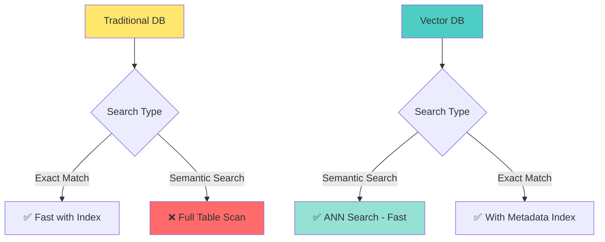

# 📘 **NODEJS AI DEVELOPER MASTERY - Lesson 12: Pinecone & MongoDB Atlas Vector Search**

**Date**: 26-03-18
**Level**: 🟢 Beginner → 🔴 Senior Engineer
**Series**: AI Developer Fundamentals - Part 3
**Time**: 70 minutes
**Prerequisites**: Lesson 11 (Embeddings & Vector Search)

---

## 🎯 **LEARNING OBJECTIVES**

After completing this **comprehensive** lesson, you will:

1. ✅ **Understand Vector Databases** - Purpose, benefits, comparison
2. ✅ **Master Pinecone** - Setup, indexing, querying, metadata filtering
3. ✅ **Master MongoDB Atlas Vector Search** - Native vector search, indexes
4. ✅ **Compare Solutions** - When to use which, trade-offs
5. ✅ **Implement Hybrid Search** - Vector + metadata + full-text
6. ✅ **Production Patterns** - Upserting, deletion, updates, monitoring
7. ✅ **Cost Optimization** - Index selection, query optimization

---

## 📦 **PART 1: VECTOR DATABASES OVERVIEW**

### **Why Vector Databases?**



**Vector Databases Provide**:
- ✅ **Approximate Nearest Neighbor (ANN)** - Fast similarity search
- ✅ **Specialized Indexes** - HNSW, IVF, tree-based indexes
- ✅ **Metadata Filtering** - Combine vector + structured queries
- ✅ **Scalability** - Handle millions/billions of vectors
- ✅ **Real-time Updates** - Add/update vectors without reindexing

---

### **Vector Database Comparison**

| Feature | Pinecone | MongoDB Atlas | Qdrant | pgvector |
|---------|----------|---------------|--------|----------|
| **Type** | Managed SaaS | Document + Vector | Self-hosted/SaaS | PostgreSQL Extension |
| **Index** | Proprietary ANN | HNSW | HNSW | IVFFlat/HNSW |
| **Max Dimensions** | 20,000 | 4,096 | 65,000 | 2,000 |
| **Scale** | Billions | Millions | Millions | Millions |
| **Latency** | <50ms | <100ms | <50ms | <100ms |
| **Pricing** | $0.00025/vector/mo | Included in Atlas | Free / Cloud | Free |
| **Best For** | Production AI | Existing MongoDB | Custom deployments | PostgreSQL apps |

---

## 📦 **PART 2: PINECONE IMPLEMENTATION**

### **Pinecone Setup & Configuration**

```typescript
// ─────────────────────────────────────────────
// ai/vector-db/pinecone.service.ts
// ─────────────────────────────────────────────
import { Injectable, Logger, OnModuleInit } from '@nestjs/common';
import { ConfigService } from '@nestjs/config';
import { Pinecone, PineconeRecord, Index } from '@pinecone-database/pinecone';
import { EmbeddingGeneratorService } from '../embeddings/embedding-generator.service';

export interface PineconeConfig {
  apiKey: string;
  environment?: string;
  indexName: string;
  namespace?: string;
}

export interface VectorDocument {
  id: string;
  values: number[];
  metadata: Record<string, any>;
}

export interface SearchOptions {
  topK?: number;
  filter?: Record<string, any>;
  namespace?: string;
  includeValues?: boolean;
  includeMetadata?: boolean;
}

export interface SearchResult {
  id: string;
  score: number;
  metadata?: Record<string, any>;
  values?: number[];
}

@Injectable()
export class PineconeService implements OnModuleInit {
  private readonly logger = new Logger(PineconeService.name);
  private pinecone: Pinecone;
  private index: Index;

  constructor(
    private configService: ConfigService,
    private embeddingService: EmbeddingGeneratorService,
  ) {}

  async onModuleInit() {
    await this.initialize();
  }

  // ─────────────────────────────────────────────
  // Initialize Pinecone Connection
  // ─────────────────────────────────────────────
  async initialize(): Promise<void> {
    const apiKey = this.configService.get<string>('PINECONE_API_KEY');
    const indexName = this.configService.get<string>('PINECONE_INDEX_NAME', 'my-index');

    if (!apiKey) {
      throw new Error('PINECONE_API_KEY is required');
    }

    this.pinecone = new Pinecone({
      apiKey,
    });

    this.index = this.pinecone.index(indexName);

    this.logger.log(`Connected to Pinecone index: ${indexName}`);
  }

  // ─────────────────────────────────────────────
  // Create Index (if not exists)
  // ─────────────────────────────────────────────
  async createIndex(options: {
    name: string;
    dimension: number;
    metric?: 'cosine' | 'euclidean' | 'dotproduct';
    podType?: string;
    pods?: number;
  }): Promise<void> {
    const {
      name,
      dimension,
      metric = 'cosine',
      podType = 'p1.x1',
      pods = 1,
    } = options;

    try {
      // Check if exists
      const indexes = await this.pinecone.listIndexes();
      const exists = indexes.indexes?.some(i => i.name === name);

      if (!exists) {
        await this.pinecone.createIndex({
          name,
          dimension,
          metric,
          spec: {
            pod: {
              pods,
              podType,
            },
          },
        });

        this.logger.log(`Created index: ${name}`);
      } else {
        this.logger.log(`Index ${name} already exists`);
      }
    } catch (error) {
      this.logger.error(`Failed to create index: ${error.message}`);
      throw error;
    }
  }

  // ─────────────────────────────────────────────
  // Upsert Single Vector
  // ─────────────────────────────────────────────
  async upsert(document: VectorDocument, namespace?: string): Promise<void> {
    try {
      const ns = namespace ? this.index.namespace(namespace) : this.index;

      await ns.upsert([
        {
          id: document.id,
          values: document.values,
          metadata: document.metadata,
        },
      ]);

      this.logger.log(`Upserted vector: ${document.id}`);
    } catch (error) {
      this.logger.error(`Failed to upsert vector: ${error.message}`);
      throw error;
    }
  }

  // ─────────────────────────────────────────────
  // Upsert Batch Vectors
  // ─────────────────────────────────────────────
  async upsertBatch(
    documents: VectorDocument[],
    options: {
      namespace?: string;
      batchSize?: number;
    } = {},
  ): Promise<void> {
    const {
      namespace,
      batchSize = 100,
    } = options;

    const ns = namespace ? this.index.namespace(namespace) : this.index;

    try {
      // Pinecone accepts up to 100 vectors per request
      const batches = Math.ceil(documents.length / batchSize);

      for (let i = 0; i < batches; i++) {
        const batch = documents.slice(i * batchSize, (i + 1) * batchSize);

        await ns.upsert(batch);

        this.logger.log(`Upserted batch ${i + 1}/${batches} (${batch.length} vectors)`);
      }

      this.logger.log(`Batch upsert complete: ${documents.length} vectors`);
    } catch (error) {
      this.logger.error(`Batch upsert failed: ${error.message}`);
      throw error;
    }
  }

  // ─────────────────────────────────────────────
  // Query by Vector
  // ─────────────────────────────────────────────
  async query(
    vector: number[],
    options: SearchOptions = {},
  ): Promise<SearchResult[]> {
    const {
      topK = 10,
      filter = {},
      namespace,
      includeValues = false,
      includeMetadata = true,
    } = options;

    try {
      const ns = namespace ? this.index.namespace(namespace) : this.index;

      const response = await ns.query({
        vector,
        topK,
        filter,
        includeValues,
        includeMetadata,
      });

      return response.matches.map(match => ({
        id: match.id,
        score: match.score,
        metadata: match.metadata as Record<string, any>,
        values: match.values,
      }));
    } catch (error) {
      this.logger.error(`Query failed: ${error.message}`);
      throw error;
    }
  }

  // ─────────────────────────────────────────────
  // Query by Text (Generate Embedding + Search)
  // ─────────────────────────────────────────────
  async queryByText(
    text: string,
    options: SearchOptions = {},
  ): Promise<SearchResult[]> {
    // Generate embedding
    const embedding = await this.embeddingService.embed(text);

    // Query Pinecone
    return this.query(embedding.embedding, options);
  }

  // ─────────────────────────────────────────────
  // Fetch Vectors by ID
  // ─────────────────────────────────────────────
  async fetch(ids: string[], namespace?: string): Promise<Record<string, VectorDocument>> {
    try {
      const ns = namespace ? this.index.namespace(namespace) : this.index;

      const response = await ns.fetch(ids);

      return response.records;
    } catch (error) {
      this.logger.error(`Fetch failed: ${error.message}`);
      throw error;
    }
  }

  // ─────────────────────────────────────────────
  // Delete Vectors
  // ─────────────────────────────────────────────
  async delete(ids: string[], namespace?: string): Promise<void>;
  async delete(filter: Record<string, any>, namespace?: string): Promise<void>;
  async delete(
    idsOrFilter: string[] | Record<string, any>,
    namespace?: string,
  ): Promise<void> {
    try {
      const ns = namespace ? this.index.namespace(namespace) : this.index;

      if (Array.isArray(idsOrFilter)) {
        await ns.deleteMany(idsOrFilter);
        this.logger.log(`Deleted ${idsOrFilter.length} vectors`);
      } else {
        await ns.deleteMany(idsOrFilter);
        this.logger.log(`Deleted vectors by filter`);
      }
    } catch (error) {
      this.logger.error(`Delete failed: ${error.message}`);
      throw error;
    }
  }

  // ─────────────────────────────────────────────
  // Delete All in Namespace
  // ─────────────────────────────────────────────
  async deleteAll(namespace?: string): Promise<void> {
    try {
      const ns = namespace ? this.index.namespace(namespace) : this.index;

      await ns.deleteAll();

      this.logger.log(`Deleted all vectors in namespace: ${namespace || 'default'}`);
    } catch (error) {
      this.logger.error(`Delete all failed: ${error.message}`);
      throw error;
    }
  }

  // ─────────────────────────────────────────────
  // Get Index Statistics
  // ─────────────────────────────────────────────
  async describeIndexStats(namespace?: string): Promise<{
    totalVectorCount: number;
    dimension: number;
    indexFullness: number;
  }> {
    try {
      const ns = namespace ? this.index.namespace(namespace) : this.index;

      const stats = await ns.describeIndexStats();

      return {
        totalVectorCount: stats.totalVectorCount || 0,
        dimension: stats.dimension || 0,
        indexFullness: stats.indexFullness || 0,
      };
    } catch (error) {
      this.logger.error(`Describe index stats failed: ${error.message}`);
      throw error;
    }
  }

  // ─────────────────────────────────────────────
  // List Namespaces
  // ─────────────────────────────────────────────
  async listNamespaces(): Promise<string[]> {
    try {
      const stats = await this.index.describeIndexStats();
      return Object.keys(stats.namespaces || {});
    } catch (error) {
      return [];
    }
  }
}
```

---

### **Pinecone Document Indexing Service**

```typescript
// ─────────────────────────────────────────────
// ai/vector-db/pinecone-indexing.service.ts
// ─────────────────────────────────────────────
import { Injectable, Logger } from '@nestjs/common';
import { PineconeService, VectorDocument } from './pinecone.service';
import { EmbeddingGeneratorService } from '../embeddings/embedding-generator.service';

export interface IndexableDocument {
  id: string;
  content: string;
  metadata: {
    title?: string;
    type?: string;
    category?: string;
    tags?: string[];
    createdAt?: Date;
    updatedAt?: Date;
    [key: string]: any;
  };
  chunkSize?: number;
  chunkOverlap?: number;
}

@Injectable()
export class PineconeIndexingService {
  private readonly logger = new Logger(PineconeIndexingService.name);

  constructor(
    private pineconeService: PineconeService,
    private embeddingService: EmbeddingGeneratorService,
  ) {}

  // ─────────────────────────────────────────────
  // Index Single Document
  // ─────────────────────────────────────────────
  async indexDocument(
    document: IndexableDocument,
    options: {
      namespace?: string;
      chunkSize?: number;
      chunkOverlap?: number;
    } = {},
  ): Promise<{
    documentId: string;
    chunksIndexed: number;
    totalTokens: number;
  }> {
    const {
      namespace,
      chunkSize = 512,
      chunkOverlap = 50,
    } = options;

    // Chunk document
    const chunks = this.embeddingService.chunkText(document.content, {
      maxChunkSize: chunkSize,
      overlap: chunkOverlap,
    });

    // Generate embeddings for all chunks
    const embeddings = await this.embeddingService.embedBatch(chunks);

    // Prepare vectors for upsert
    const vectors: VectorDocument[] = embeddings.map((emb, index) => ({
      id: `${document.id}:chunk:${index}`,
      values: emb.embedding,
      metadata: {
        ...document.metadata,
        chunkIndex: index,
        totalChunks: chunks.length,
        content: chunks[index],
        indexedAt: new Date().toISOString(),
      },
    }));

    // Upsert to Pinecone
    await this.pineconeService.upsertBatch(vectors, { namespace });

    const totalTokens = embeddings.reduce(
      (sum, e) => sum + this.embeddingService.estimateTokens(chunks[e.index]),
      0,
    );

    this.logger.log(
      `Indexed document ${document.id}: ${chunks.length} chunks, ${totalTokens} tokens`,
    );

    return {
      documentId: document.id,
      chunksIndexed: chunks.length,
      totalTokens,
    };
  }

  // ─────────────────────────────────────────────
  // Bulk Index Documents
  // ─────────────────────────────────────────────
  async bulkIndex(
    documents: IndexableDocument[],
    options: {
      namespace?: string;
      batchSize?: number;
      concurrency?: number;
    } = {},
  ): Promise<{
    totalDocuments: number;
    totalChunks: number;
    totalTokens: number;
  }> {
    const {
      namespace,
      batchSize = 10,
      concurrency = 3,
    } = options;

    let totalChunks = 0;
    let totalTokens = 0;

    // Process in batches
    const docBatches = this.chunkArray(documents, batchSize);

    for (let i = 0; i < docBatches.length; i++) {
      const batch = docBatches[i];

      this.logger.log(`Processing batch ${i + 1}/${docBatches.length}`);

      // Process batch with concurrency limit
      const results = await this.processWithConcurrency(
        batch,
        async (doc) => {
          try {
            const result = await this.indexDocument(doc, { namespace });
            return result;
          } catch (error) {
            this.logger.error(`Failed to index ${doc.id}: ${error.message}`);
            return null;
          }
        },
        concurrency,
      );

      // Aggregate results
      for (const result of results.filter(r => r !== null)) {
        totalChunks += result.chunksIndexed;
        totalTokens += result.totalTokens;
      }
    }

    return {
      totalDocuments: documents.length,
      totalChunks,
      totalTokens,
    };
  }

  // ─────────────────────────────────────────────
  // Update Document (Delete + Re-index)
  // ─────────────────────────────────────────────
  async updateDocument(
    documentId: string,
    newContent: string,
    newMetadata?: Record<string, any>,
    options: {
      namespace?: string;
    } = {},
  ): Promise<void> {
    const { namespace } = options;

    // Delete old chunks
    await this.pineconeService.delete([documentId], namespace);

    // Re-index with new content
    await this.indexDocument(
      {
        id: documentId,
        content: newContent,
        metadata: newMetadata || {},
      },
      { namespace },
    );
  }

  // ─────────────────────────────────────────────
  // Delete Document
  // ─────────────────────────────────────────────
  async deleteDocument(
    documentId: string,
    namespace?: string,
  ): Promise<void> {
    // Delete all chunks for this document
    // Note: Pinecone doesn't support prefix delete, so we need to fetch first
    const results = await this.pineconeService.queryByText('', {
      topK: 10000,
      filter: { documentId: { $eq: documentId } },
      namespace,
    });

    const chunkIds = results.map(r => r.id);

    if (chunkIds.length > 0) {
      await this.pineconeService.delete(chunkIds, namespace);
      this.logger.log(`Deleted document ${documentId} (${chunkIds.length} chunks)`);
    }
  }

  // ─────────────────────────────────────────────
  // Helper: Chunk Array
  // ─────────────────────────────────────────────
  private chunkArray<T>(array: T[], size: number): T[][] {
    const chunks: T[][] = [];
    for (let i = 0; i < array.length; i += size) {
      chunks.push(array.slice(i, i + size));
    }
    return chunks;
  }

  // ─────────────────────────────────────────────
  // Helper: Process with Concurrency Limit
  // ─────────────────────────────────────────────
  private async processWithConcurrency<T, R>(
    items: T[],
    processor: (item: T) => Promise<R>,
    concurrency: number,
  ): Promise<R[]> {
    const results: R[] = [];

    for (let i = 0; i < items.length; i += concurrency) {
      const batch = items.slice(i, i + concurrency);
      const batchResults = await Promise.all(batch.map(processor));
      results.push(...batchResults);
    }

    return results;
  }
}
```

---

## 📦 **PART 3: MONGODB ATLAS VECTOR SEARCH**

### **MongoDB Atlas Vector Search Setup**

```typescript
// ─────────────────────────────────────────────
// ai/vector-db/mongodb-vector.service.ts
// ─────────────────────────────────────────────
import { Injectable, Logger, OnModuleInit } from '@nestjs/common';
import { InjectConnection } from '@nestjs/mongoose';
import { Connection, Model } from 'mongoose';
import { ConfigService } from '@nestjs/config';
import { EmbeddingGeneratorService } from '../embeddings/embedding-generator.service';

export interface MongoDBVectorDocument {
  _id?: any;
  content: string;
  embedding: number[];
  metadata?: Record<string, any>;
  createdAt?: Date;
  updatedAt?: Date;
}

@Injectable()
export class MongoDBVectorService implements OnModuleInit {
  private readonly logger = new Logger(MongoDBVectorService.name);
  private vectorModel: Model<MongoDBVectorDocument>;

  constructor(
    @InjectConnection() private connection: Connection,
    private configService: ConfigService,
    private embeddingService: EmbeddingGeneratorService,
  ) {}

  async onModuleInit() {
    await this.createVectorIndex();
  }

  // ─────────────────────────────────────────────
  // Create Vector Search Index
  // ─────────────────────────────────────────────
  async createVectorIndex(): Promise<void> {
    const collectionName = this.configService.get<string>('MONGODB_VECTOR_COLLECTION', 'documents');

    try {
      const db = this.connection.db;
      const collection = db.collection(collectionName);

      // Check if index exists
      const indexes = await collection.listIndexes().toArray();
      const vectorIndexExists = indexes.some(idx => idx.name === 'vector_index');

      if (!vectorIndexExists) {
        // Create vector search index (Atlas only)
        await db.command({
          createSearchIndexes: true,
          indexes: [
            {
              name: 'vector_index',
              type: 'vectorSearch',
              definition: {
                fields: [
                  {
                    type: 'vector',
                    path: 'embedding',
                    numDimensions: 1536,  // Adjust based on your embedding model
                    similarity: 'cosine',
                  },
                  {
                    type: 'filter',
                    path: 'metadata.category',
                  },
                  {
                    type: 'filter',
                    path: 'metadata.tags',
                  },
                ],
              },
            },
          ],
        });

        this.logger.log('Created vector search index');
      } else {
        this.logger.log('Vector search index already exists');
      }
    } catch (error) {
      this.logger.error(`Failed to create vector index: ${error.message}`);
      // Note: This will fail on non-Atlas MongoDB
      this.logger.warn('Vector search requires MongoDB Atlas');
    }
  }

  // ─────────────────────────────────────────────
  // Insert Document with Embedding
  // ─────────────────────────────────────────────
  async insertDocument(
    content: string,
    metadata: Record<string, any> = {},
    options: {
      collection?: string;
      generateEmbedding?: boolean;
    } = {},
  ): Promise<any> {
    const {
      collection = 'documents',
      generateEmbedding = true,
    } = options;

    let embedding: number[] = [];

    if (generateEmbedding) {
      const result = await this.embeddingService.embed(content);
      embedding = result.embedding;
    }

    const doc = {
      content,
      embedding,
      metadata,
      createdAt: new Date(),
      updatedAt: new Date(),
    };

    const result = await this.connection.db
      .collection(collection)
      .insertOne(doc);

    this.logger.log(`Inserted document: ${result.insertedId}`);

    return {
      _id: result.insertedId,
      ...doc,
    };
  }

  // ─────────────────────────────────────────────
  // Vector Search
  // ─────────────────────────────────────────────
  async vectorSearch(
    query: string,
    options: {
      collection?: string;
      limit?: number;
      numCandidates?: number;
      filter?: Record<string, any>;
      includeEmbedding?: boolean;
    } = {},
  ): Promise<Array<{
    document: MongoDBVectorDocument;
    score: number;
  }>> {
    const {
      collection = 'documents',
      limit = 10,
      numCandidates = 100,
      filter = {},
      includeEmbedding = false,
    } = options;

    // Generate query embedding
    const queryEmbedding = await this.embeddingService.embed(query);

    // Build aggregation pipeline
    const pipeline: any[] = [
      {
        $vectorSearch: {
          index: 'vector_index',
          path: 'embedding',
          queryVector: queryEmbedding.embedding,
          numCandidates,
          limit,
          filter: filter,
        },
      },
      {
        $addFields: {
          score: { $meta: 'vectorSearchScore' },
        },
      },
    ];

    // Exclude embedding from results if not requested
    if (!includeEmbedding) {
      pipeline.push({
        $project: {
          embedding: 0,
        },
      });
    }

    const results = await this.connection.db
      .collection(collection)
      .aggregate(pipeline)
      .toArray();

    return results.map((r: any) => ({
      document: r,
      score: r.score,
    }));
  }

  // ─────────────────────────────────────────────
  // Hybrid Search (Vector + Full-Text)
  // ─────────────────────────────────────────────
  async hybridSearch(
    query: string,
    options: {
      collection?: string;
      vectorWeight?: number;
      textWeight?: number;
      limit?: number;
    } = {},
  ): Promise<Array<{
    document: MongoDBVectorDocument;
    hybridScore: number;
    vectorScore: number;
    textScore: number;
  }>> {
    const {
      collection = 'documents',
      vectorWeight = 0.7,
      textWeight = 0.3,
      limit = 10,
    } = options;

    // Vector search results
    const vectorResults = await this.vectorSearch(query, {
      collection,
      limit: limit * 2,
    });

    // Full-text search results (requires text index)
    const textResults = await this.connection.db
      .collection(collection)
      .find({
        $text: { $search: query },
      })
      .project({
        score: { $meta: 'textScore' },
      })
      .sort({ score: { $meta: 'textScore' } })
      .limit(limit * 2)
      .toArray();

    // Combine results
    const combined = new Map();

    // Add vector results
    for (const result of vectorResults) {
      const id = result.document._id.toString();
      combined.set(id, {
        document: result.document,
        vectorScore: result.score,
        textScore: 0,
        hybridScore: result.score * vectorWeight,
      });
    }

    // Merge text results
    for (const doc of textResults) {
      const id = doc._id.toString();
      const existing = combined.get(id);

      if (existing) {
        existing.textScore = doc.score;
        existing.hybridScore += textWeight;
      } else {
        combined.set(id, {
          document: doc,
          vectorScore: 0,
          textScore: doc.score,
          hybridScore: textWeight,
        });
      }
    }

    // Sort by hybrid score
    const results = Array.from(combined.values())
      .sort((a, b) => b.hybridScore - a.hybridScore)
      .slice(0, limit);

    return results;
  }

  // ─────────────────────────────────────────────
  // Bulk Insert with Embeddings
  // ─────────────────────────────────────────────
  async bulkInsert(
    documents: Array<{
      content: string;
      metadata?: Record<string, any>;
    }>,
    options: {
      collection?: string;
      batchSize?: number;
    } = {},
  ): Promise<{
    inserted: number;
    totalTokens: number;
  }> {
    const {
      collection = 'documents',
      batchSize = 100,
    } = options;

    let totalTokens = 0;
    let inserted = 0;

    // Generate embeddings in batch
    const contents = documents.map(d => d.content);
    const embeddings = await this.embeddingService.embedBatch(contents);

    // Prepare documents for insertion
    const docsToInsert = documents.map((doc, i) => ({
      content: doc.content,
      embedding: embeddings[i].embedding,
      metadata: doc.metadata || {},
      createdAt: new Date(),
      updatedAt: new Date(),
    }));

    totalTokens = embeddings.reduce(
      (sum, e) => sum + this.embeddingService.estimateTokens(documents[e.index].content),
      0,
    );

    // Insert in batches
    for (let i = 0; i < docsToInsert.length; i += batchSize) {
      const batch = docsToInsert.slice(i, i + batchSize);

      await this.connection.db
        .collection(collection)
        .insertMany(batch);

      inserted += batch.length;
    }

    this.logger.log(`Bulk inserted ${inserted} documents (${totalTokens} tokens)`);

    return { inserted, totalTokens };
  }

  // ─────────────────────────────────────────────
  // Update Document Embedding
  // ─────────────────────────────────────────────
  async updateEmbedding(
    documentId: any,
    newContent: string,
    options: {
      collection?: string;
    } = {},
  ): Promise<void> {
    const { collection = 'documents' } = options;

    const result = await this.embeddingService.embed(newContent);

    await this.connection.db
      .collection(collection)
      .updateOne(
        { _id: documentId },
        {
          $set: {
            content: newContent,
            embedding: result.embedding,
            updatedAt: new Date(),
          },
        },
      );

    this.logger.log(`Updated embedding for document ${documentId}`);
  }

  // ─────────────────────────────────────────────
  // Delete Document
  // ─────────────────────────────────────────────
  async deleteDocument(
    documentId: any,
    collection: string = 'documents',
  ): Promise<void> {
    await this.connection.db
      .collection(collection)
      .deleteOne({ _id: documentId });

    this.logger.log(`Deleted document ${documentId}`);
  }
}
```

---

## 📦 **PART 4: COMPARISON & SELECTION GUIDE**

### **When to Use Which**

```typescript
// ─────────────────────────────────────────────
// Decision Matrix
// ─────────────────────────────────────────────

/**
 * USE PINECONE WHEN:
 * ✅ Need dedicated vector database
 * ✅ Billions of vectors
 * ✅ Lowest latency critical
 * ✅ Don't want to manage infrastructure
 * ✅ Need multiple namespaces
 * ✅ Budget allows for managed service
 *
 * USE MONGODB ATLAS WHEN:
 * ✅ Already using MongoDB
 * ✅ Need vector + document queries
 * ✅ Want unified data store
 * ✅ Moderate scale (millions)
 * ✅ Cost optimization important
 *
 * USE QDRANT WHEN:
 * ✅ Need self-hosted option
 * ✅ Complex filtering requirements
 * ✅ Want open-source
 * ✅ Need payload storage
 *
 * USE PGVECTOR WHEN:
 * ✅ Already using PostgreSQL
 * ✅ Need SQL + vectors
 * ✅ Smaller scale
 * ✅ Want free/open-source
 */
```

### **Feature Comparison Table**

| Feature | Pinecone | MongoDB Atlas |
|---------|----------|---------------|
| **Setup Time** | 5 minutes | 10 minutes |
| **Learning Curve** | Low | Medium |
| **Query Flexibility** | Medium | High |
| **Metadata Filtering** | ✅ Excellent | ✅ Excellent |
| **Hybrid Search** | ⚠️ Limited | ✅ Native |
| **Scalability** | ✅ Billions | ⚠️ Millions |
| **Cost (1M vectors)** | ~$250/mo | Included |
| **Latency** | <50ms | <100ms |
| **Updates** | ✅ Real-time | ✅ Real-time |
| **Backup/DR** | ✅ Managed | ✅ Managed |

---

## ✅ **VECTOR DATABASE CHECKLIST**

```
Pinecone
[ ] Index created
[ ] Connection established
[ ] Upsert working
[ ] Query by vector
[ ] Query by text
[ ] Metadata filtering
[ ] Namespaces organized
[ ] Deletion working

MongoDB Atlas
[ ] Vector index created
[ ] Atlas cluster configured
[ ] Vector search working
[ ] Hybrid search implemented
[ ] Bulk insert working
[ ] Updates working

Production
[ ] Monitoring setup
[ ] Cost tracking
[ ] Performance metrics
[ ] Backup strategy
[ ] Error handling
```

---

## 🎯 **KNOWLEDGE CHECK**

### **Question 1: Pinecone vs MongoDB Atlas - Key Difference?**

<details>
<summary>💡 Click to reveal answer</summary>

**Pinecone**:
- Dedicated vector database
- Optimized for vector operations only
- Better at massive scale (billions)
- Separate from your main database

**MongoDB Atlas**:
- Document database with vector search
- Unified queries (vector + structured)
- Good for moderate scale (millions)
- Single database for everything

**Choose based on**: Scale, existing infrastructure, query complexity!
</details>

---

### **Question 2: Why Chunk Documents Before Indexing?**

<details>
<summary>💡 Click to reveal answer</summary>

**Reasons**:
1. ✅ **Context Window Limits** - Embedding models have max input
2. ✅ **Better Retrieval** - Return relevant sections, not whole doc
3. ✅ **Improved Accuracy** - More precise similarity matching
4. ✅ **Cost Efficiency** - Only retrieve what's needed
5. ✅ **Flexibility** - Combine chunks from different docs

**Best Practice**: 512-1024 tokens with 50-100 token overlap!
</details>

---

## 📚 **ADDITIONAL RESOURCES**

- **Pinecone Docs**: [https://docs.pinecone.io](https://docs.pinecone.io)
- **MongoDB Vector Search**: [https://www.mongodb.com/docs/atlas/atlas-vector-search](https://www.mongodb.com/docs/atlas/atlas-vector-search)
- **Vector DB Comparison**: [https://www.db-engines.com/en/system/Pinecone;MongoDB](https://www.db-engines.com/en/system/Pinecone;MongoDB)

---

## 🎓 **HOMEWORK**

1. ✅ Set up Pinecone index
2. ✅ Index 100 documents in Pinecone
3. ✅ Set up MongoDB Atlas vector search
4. ✅ Implement hybrid search in MongoDB
5. ✅ Compare query performance
6. ✅ Implement bulk indexing
7. ✅ Add metadata filtering
8. ✅ Create update/delete operations

---

**Next Lesson**: Qdrant & pgvector Alternatives - Open Source Vector Databases
**Date**: 26-03-18
**Status**: ✅ Complete

---
*26-03-18*
