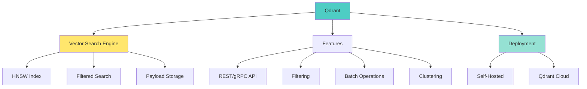

# 📘 **NODEJS AI DEVELOPER MASTERY - Lesson 13: Qdrant & pgvector Alternatives**

**Date**: 26-03-18
**Level**: 🟢 Beginner → 🔴 Senior Engineer
**Series**: AI Developer Fundamentals - Part 3
**Time**: 65 minutes
**Prerequisites**: Lesson 11-12 (Embeddings, Pinecone & MongoDB)

---

## 🎯 **LEARNING OBJECTIVES**

After completing this **comprehensive** lesson, you will:

1. ✅ **Understand Qdrant** - Architecture, features, use cases
2. ✅ **Master Qdrant Implementation** - Setup, indexing, filtering, queries
3. ✅ **Understand pgvector** - PostgreSQL vector extension
4. ✅ **Master pgvector Implementation** - Indexes, queries, optimization
5. ✅ **Compare All Vector DBs** - Decision framework
6. ✅ **Implement Multi-Backend** - Abstract vector operations
7. ✅ **Production Patterns** - Migrations, backups, monitoring

---

## 📦 **PART 1: QDRANT OVERVIEW**

### **What is Qdrant?**



**Qdrant Highlights**:
- ✅ **Open-source** vector similarity search engine
- ✅ **Written in Rust** - High performance, memory efficient
- ✅ **HNSW Index** - Fast approximate nearest neighbor search
- ✅ **Payload filtering** - Combine vector + metadata queries
- ✅ **Self-hosted or Cloud** - Flexible deployment
- ✅ **No vendor lock-in** - Full control over your data

---

### **Qdrant Setup & Configuration**

```typescript
// ─────────────────────────────────────────────
// ai/vector-db/qdrant.service.ts
// ─────────────────────────────────────────────
import { Injectable, Logger, OnModuleInit } from '@nestjs/common';
import { ConfigService } from '@nestjs/config';
import { QdrantClient } from '@qdrant/js-client-rest';
import { SdkHttpComponent } from '@qdrant/js-client-rest/build/types/http';
import { EmbeddingGeneratorService } from '../embeddings/embedding-generator.service';

export interface QdrantConfig {
  url: string;
  apiKey?: string;
  collectionName: string;
  vectorSize: number;
  distance?: 'Cosine' | 'Euclid' | 'Dot';
}

export interface QdrantDocument {
  id: string | number;
  vector: number[];
  payload?: Record<string, any>;
}

export interface QdrantSearchOptions {
  limit?: number;
  filter?: any;
  scoreThreshold?: number;
  withPayload?: boolean | string[];
  withVector?: boolean;
}

@Injectable()
export class QdrantService implements OnModuleInit {
  private readonly logger = new Logger(QdrantService.name);
  private client: QdrantClient;
  private config: QdrantConfig;

  constructor(
    private configService: ConfigService,
    private embeddingService: EmbeddingGeneratorService,
  ) {}

  async onModuleInit() {
    await this.initialize();
  }

  // ─────────────────────────────────────────────
  // Initialize Qdrant Client
  // ─────────────────────────────────────────────
  async initialize(): Promise<void> {
    const url = this.configService.get<string>('QDRANT_URL', 'http://localhost:6333');
    const apiKey = this.configService.get<string>('QDRANT_API_KEY');
    const collectionName = this.configService.get<string>('QDRANT_COLLECTION', 'documents');
    const vectorSize = this.configService.get<number>('QDRANT_VECTOR_SIZE', 1536);
    const distance = this.configService.get<'Cosine' | 'Euclid' | 'Dot'>('QDRANT_DISTANCE', 'Cosine');

    this.config = {
      url,
      apiKey,
      collectionName,
      vectorSize,
      distance,
    };

    this.client = new QdrantClient({
      url,
      apiKey,
    });

    this.logger.log(`Connected to Qdrant: ${url}`);

    // Ensure collection exists
    await this.ensureCollection();
  }

  // ─────────────────────────────────────────────
  // Ensure Collection Exists
  // ─────────────────────────────────────────────
  async ensureCollection(): Promise<void> {
    try {
      const collections = await this.client.getCollections();
      const exists = collections.collections.some(
        c => c.name === this.config.collectionName,
      );

      if (!exists) {
        await this.createCollection();
      } else {
        this.logger.log(`Collection ${this.config.collectionName} exists`);
      }
    } catch (error) {
      this.logger.error(`Failed to check collections: ${error.message}`);
      throw error;
    }
  }

  // ─────────────────────────────────────────────
  // Create Collection
  // ─────────────────────────────────────────────
  async createCollection(options?: {
    collectionName?: string;
    vectorSize?: number;
    distance?: string;
  }): Promise<void> {
    const {
      collectionName = this.config.collectionName,
      vectorSize = this.config.vectorSize,
      distance = this.config.distance,
    } = options || {};

    try {
      await this.client.createCollection(collectionName, {
        vectors: {
          size: vectorSize,
          distance,
        },
        hnsw_config: {
          m: 16,  // Number of connections
          ef_construct: 100,  // Size of dynamic candidate list
        },
      });

      this.logger.log(`Created collection: ${collectionName}`);
    } catch (error) {
      this.logger.error(`Failed to create collection: ${error.message}`);
      throw error;
    }
  }

  // ─────────────────────────────────────────────
  // Upsert Single Point
  // ─────────────────────────────────────────────
  async upsert(document: QdrantDocument): Promise<void> {
    try {
      await this.client.upsert(this.config.collectionName, {
        points: [
          {
            id: document.id,
            vector: document.vector,
            payload: document.payload,
          },
        ],
      });

      this.logger.log(`Upserted point: ${document.id}`);
    } catch (error) {
      this.logger.error(`Failed to upsert: ${error.message}`);
      throw error;
    }
  }

  // ─────────────────────────────────────────────
  // Upsert Batch Points
  // ─────────────────────────────────────────────
  async upsertBatch(
    documents: QdrantDocument[],
    options: {
      batchSize?: number;
    } = {},
  ): Promise<void> {
    const { batchSize = 256 } = options;

    try {
      // Qdrant supports up to 256 points per batch
      const batches = Math.ceil(documents.length / batchSize);

      for (let i = 0; i < batches; i++) {
        const batch = documents.slice(i * batchSize, (i + 1) * batchSize);

        await this.client.upsert(this.config.collectionName, {
          points: batch.map(doc => ({
            id: doc.id,
            vector: doc.vector,
            payload: doc.payload,
          })),
        });

        this.logger.log(`Upserted batch ${i + 1}/${batches}`);
      }

      this.logger.log(`Batch upsert complete: ${documents.length} points`);
    } catch (error) {
      this.logger.error(`Batch upsert failed: ${error.message}`);
      throw error;
    }
  }

  // ─────────────────────────────────────────────
  // Search by Vector
  // ─────────────────────────────────────────────
  async search(
    vector: number[],
    options: QdrantSearchOptions = {},
  ): Promise<Array<{
    id: string | number;
    score: number;
    payload?: Record<string, any>;
    vector?: number[];
  }>> {
    const {
      limit = 10,
      filter,
      scoreThreshold,
      withPayload = true,
      withVector = false,
    } = options;

    try {
      const results = await this.client.search(this.config.collectionName, {
        vector,
        limit,
        filter,
        score_threshold: scoreThreshold,
        with_payload: withPayload,
        with_vector: withVector,
      });

      return results.map(result => ({
        id: result.id,
        score: result.score,
        payload: result.payload as Record<string, any>,
        vector: result.vector,
      }));
    } catch (error) {
      this.logger.error(`Search failed: ${error.message}`);
      throw error;
    }
  }

  // ─────────────────────────────────────────────
  // Search by Text (Generate Embedding + Search)
  // ─────────────────────────────────────────────
  async searchByText(
    text: string,
    options: QdrantSearchOptions = {},
  ): Promise<Array<{
    id: string | number;
    score: number;
    payload?: Record<string, any>;
  }>> {
    const embedding = await this.embeddingService.embed(text);
    return this.search(embedding.embedding, options);
  }

  // ─────────────────────────────────────────────
  // Filter Builder Helper
  // ─────────────────────────────────────────────
  buildFilter(conditions: {
    must?: Array<{ key: string; value: any }>;
    should?: Array<{ key: string; value: any }>;
    must_not?: Array<{ key: string; value: any }>;
  }): any {
    const filter: any = {};

    if (conditions.must?.length) {
      filter.must = conditions.must.map(({ key, value }) => ({
        key,
        match: { value },
      }));
    }

    if (conditions.should?.length) {
      filter.should = conditions.should.map(({ key, value }) => ({
        key,
        match: { value },
      }));
    }

    if (conditions.must_not?.length) {
      filter.must_not = conditions.must_not.map(({ key, value }) => ({
        key,
        match: { value },
      }));
    }

    return filter;
  }

  // ─────────────────────────────────────────────
  // Get Point by ID
  // ─────────────────────────────────────────────
  async retrieve(ids: (string | number)[]): Promise<QdrantDocument[]> {
    try {
      const points = await this.client.retrieve(this.config.collectionName, {
        ids,
        with_payload: true,
        with_vector: true,
      });

      return points.map(point => ({
        id: point.id,
        vector: point.vector,
        payload: point.payload,
      }));
    } catch (error) {
      this.logger.error(`Retrieve failed: ${error.message}`);
      throw error;
    }
  }

  // ─────────────────────────────────────────────
  // Delete Points
  // ─────────────────────────────────────────────
  async delete(ids: (string | number)[]): Promise<void>;
  async delete(filter: any): Promise<void>;
  async delete(idsOrFilter: (string | number)[] | any): Promise<void> {
    try {
      if (Array.isArray(idsOrFilter)) {
        await this.client.delete(this.config.collectionName, {
          points: idsOrFilter,
        });
        this.logger.log(`Deleted ${idsOrFilter.length} points`);
      } else {
        await this.client.delete(this.config.collectionName, {
          filter: idsOrFilter,
        });
        this.logger.log(`Deleted points by filter`);
      }
    } catch (error) {
      this.logger.error(`Delete failed: ${error.message}`);
      throw error;
    }
  }

  // ─────────────────────────────────────────────
  // Get Collection Info
  // ─────────────────────────────────────────────
  async getCollectionInfo(): Promise<{
    status: string;
    vectorsCount: number;
    pointsCount: number;
    segmentsCount: number;
  }> {
    try {
      const info = await this.client.getCollection(this.config.collectionName);

      return {
        status: info.status,
        vectorsCount: info.vectors_count || 0,
        pointsCount: info.points_count || 0,
        segmentsCount: info.segments_count || 0,
      };
    } catch (error) {
      this.logger.error(`Get collection info failed: ${error.message}`);
      throw error;
    }
  }

  // ─────────────────────────────────────────────
  // Create Payload Index
  // ─────────────────────────────────────────────
  async createPayloadIndex(
    fieldName: string,
    schemaType: 'keyword' | 'integer' | 'float' | 'geo' | 'text' = 'keyword',
  ): Promise<void> {
    try {
      await this.client.createFieldIndex(
        this.config.collectionName,
        fieldName,
        {
          field_schema: schemaType,
        },
      );

      this.logger.log(`Created payload index for: ${fieldName}`);
    } catch (error) {
      this.logger.error(`Create index failed: ${error.message}`);
      throw error;
    }
  }
}
```

---

## 📦 **PART 2: PGVECTOR (POSTGRESQL VECTOR)**

### **pgvector Setup & Configuration**

```typescript
// ─────────────────────────────────────────────
// ai/vector-db/pgvector.service.ts
// ─────────────────────────────────────────────
import { Injectable, Logger, OnModuleInit } from '@nestjs/common';
import { ConfigService } from '@nestjs/config';
import { Pool, PoolClient } from 'pg';
import { EmbeddingGeneratorService } from '../embeddings/embedding-generator.service';

export interface PgVectorDocument {
  id?: number;
  content: string;
  embedding: number[];
  metadata?: Record<string, any>;
  created_at?: Date;
  updated_at?: Date;
}

export interface PgVectorSearchOptions {
  limit?: number;
  filter?: Record<string, any>;
  minScore?: number;
}

@Injectable()
export class PgVectorService implements OnModuleInit {
  private readonly logger = new Logger(PgVectorService.name);
  private pool: Pool;
  private tableName: string;
  private vectorDimensions: number;

  constructor(
    private configService: ConfigService,
    private embeddingService: EmbeddingGeneratorService,
  ) {}

  async onModuleInit() {
    await this.initialize();
  }

  // ─────────────────────────────────────────────
  // Initialize PostgreSQL Connection
  // ─────────────────────────────────────────────
  async initialize(): Promise<void> {
    const connectionString = this.configService.get<string>('DATABASE_URL');
    this.tableName = this.configService.get<string>('PGVECTOR_TABLE', 'documents');
    this.vectorDimensions = this.configService.get<number>('PGVECTOR_DIMENSIONS', 1536);

    if (!connectionString) {
      throw new Error('DATABASE_URL is required');
    }

    this.pool = new Pool({
      connectionString,
      max: 20,
      idleTimeoutMillis: 30000,
      connectionTimeoutMillis: 2000,
    });

    // Test connection
    const client = await this.pool.connect();
    try {
      await client.query('SELECT NOW()');
      this.logger.log('Connected to PostgreSQL');

      // Enable pgvector extension
      await this.enableVectorExtension(client);

      // Create table and indexes
      await this.createTable(client);
    } finally {
      client.release();
    }
  }

  // ─────────────────────────────────────────────
  // Enable pgvector Extension
  // ─────────────────────────────────────────────
  private async enableVectorExtension(client: PoolClient): Promise<void> {
    try {
      await client.query('CREATE EXTENSION IF NOT EXISTS vector');
      this.logger.log('pgvector extension enabled');
    } catch (error) {
      this.logger.error(`Failed to enable pgvector: ${error.message}`);
      this.logger.warn('Make sure pgvector is installed: CREATE EXTENSION vector;');
      throw error;
    }
  }

  // ─────────────────────────────────────────────
  // Create Table with Vector Column
  // ─────────────────────────────────────────────
  private async createTable(client: PoolClient): Promise<void> {
    const createTableSQL = `
      CREATE TABLE IF NOT EXISTS ${this.tableName} (
        id SERIAL PRIMARY KEY,
        content TEXT NOT NULL,
        embedding vector(${this.vectorDimensions}),
        metadata JSONB DEFAULT '{}',
        created_at TIMESTAMP WITH TIME ZONE DEFAULT NOW(),
        updated_at TIMESTAMP WITH TIME ZONE DEFAULT NOW()
      );
    `;

    await client.query(createTableSQL);
    this.logger.log(`Table ${this.tableName} created/verified`);

    // Create vector index (IVFFlat for large datasets)
    await this.createVectorIndex(client);

    // Create metadata indexes
    await this.createMetadataIndexes(client);
  }

  // ─────────────────────────────────────────────
  // Create Vector Index
  // ─────────────────────────────────────────────
  private async createVectorIndex(client: PoolClient): Promise<void> {
    const indexName = `${this.tableName}_embedding_idx`;

    // Check if index exists
    const exists = await client.query(`
      SELECT indexname FROM pg_indexes 
      WHERE indexname = $1
    `, [indexName]);

    if (exists.rows.length > 0) {
      this.logger.log(`Vector index ${indexName} already exists`);
      return;
    }

    // Choose index type based on data size
    // IVFFlat is better for >100k vectors
    const createIndexSQL = `
      CREATE INDEX IF NOT EXISTS ${indexName}
      ON ${this.tableName}
      USING ivfflat (embedding vector_cosine_ops)
      WITH (lists = 100);
    `;

    try {
      await client.query(createIndexSQL);
      this.logger.log(`Created IVFFlat index: ${indexName}`);
    } catch (error) {
      this.logger.warn(`Failed to create IVFFlat index: ${error.message}`);
      this.logger.warn('Using sequential scan instead');
    }
  }

  // ─────────────────────────────────────────────
  // Create Metadata Indexes
  // ─────────────────────────────────────────────
  private async createMetadataIndexes(client: PoolClient): Promise<void> {
    // GIN index for JSONB metadata
    await client.query(`
      CREATE INDEX IF NOT EXISTS ${this.tableName}_metadata_idx
      ON ${this.tableName}
      USING GIN (metadata);
    `);

    this.logger.log('Created metadata GIN index');
  }

  // ─────────────────────────────────────────────
  // Insert Document
  // ─────────────────────────────────────────────
  async insert(document: Omit<PgVectorDocument, 'id'>): Promise<number> {
    const client = await this.pool.connect();

    try {
      const result = await client.query(
        `
        INSERT INTO ${this.tableName} (content, embedding, metadata, created_at, updated_at)
        VALUES ($1, $2, $3, NOW(), NOW())
        RETURNING id
      `,
        [
          document.content,
          `[${document.embedding.join(',')}]`,
          JSON.stringify(document.metadata || {}),
        ],
      );

      return result.rows[0].id;
    } finally {
      client.release();
    }
  }

  // ─────────────────────────────────────────────
  // Bulk Insert
  // ─────────────────────────────────────────────
  async bulkInsert(
    documents: Array<Omit<PgVectorDocument, 'id'>>,
    options: {
      batchSize?: number;
    } = {},
  ): Promise<number> {
    const { batchSize = 100 } = options;
    let inserted = 0;

    for (let i = 0; i < documents.length; i += batchSize) {
      const batch = documents.slice(i, i + batchSize);

      const client = await this.pool.connect();

      try {
        await client.query('BEGIN');

        for (const doc of batch) {
          await client.query(
            `
            INSERT INTO ${this.tableName} (content, embedding, metadata, created_at, updated_at)
            VALUES ($1, $2, $3, NOW(), NOW())
          `,
            [
              doc.content,
              `[${doc.embedding.join(',')}]`,
              JSON.stringify(doc.metadata || {}),
            ],
          );
        }

        await client.query('COMMIT');
        inserted += batch.length;

        this.logger.log(`Inserted batch: ${batch.length} documents`);
      } catch (error) {
        await client.query('ROLLBACK');
        this.logger.error(`Batch insert failed: ${error.message}`);
        throw error;
      } finally {
        client.release();
      }
    }

    return inserted;
  }

  // ─────────────────────────────────────────────
  // Vector Similarity Search
  // ─────────────────────────────────────────────
  async search(
    query: string,
    options: PgVectorSearchOptions = {},
  ): Promise<Array<{
    id: number;
    content: string;
    metadata: Record<string, any>;
    similarity: number;
  }>> {
    const {
      limit = 10,
      filter = {},
      minScore = 0,
    } = options;

    // Generate query embedding
    const embedding = await this.embeddingService.embed(query);
    const queryVector = `[${embedding.embedding.join(',')}]`;

    // Build filter conditions
    const filterConditions = this.buildFilterConditions(filter);

    const client = await this.pool.connect();

    try {
      const result = await client.query(
        `
        SELECT 
          id,
          content,
          metadata,
          1 - (embedding <=> $1::vector) AS similarity
        FROM ${this.tableName}
        WHERE 1 - (embedding <=> $1::vector) > $2
        ${filterConditions.sql}
        ORDER BY embedding <=> $1::vector
        LIMIT $3
      `,
        [queryVector, minScore, limit, ...filterConditions.params],
      );

      return result.rows.map(row => ({
        id: row.id,
        content: row.content,
        metadata: row.metadata,
        similarity: parseFloat(row.similarity),
      }));
    } finally {
      client.release();
    }
  }

  // ─────────────────────────────────────────────
  // Build Filter Conditions
  // ─────────────────────────────────────────────
  private buildFilterConditions(filter: Record<string, any>): {
    sql: string;
    params: any[];
  } {
    const conditions: string[] = [];
    const params: any[] = [];
    let paramIndex = 1;

    for (const [key, value] of Object.entries(filter)) {
      conditions.push(`metadata->>$${paramIndex} = $${paramIndex + 1}`);
      params.push(key, String(value));
      paramIndex += 2;
    }

    return {
      sql: conditions.length > 0 ? `AND ${conditions.join(' AND ')}` : '',
      params,
    };
  }

  // ─────────────────────────────────────────────
  // Delete Document
  // ─────────────────────────────────────────────
  async delete(id: number): Promise<void> {
    const client = await this.pool.connect();

    try {
      await client.query(
        `DELETE FROM ${this.tableName} WHERE id = $1`,
        [id],
      );

      this.logger.log(`Deleted document ${id}`);
    } finally {
      client.release();
    }
  }

  // ─────────────────────────────────────────────
  // Update Document
  // ─────────────────────────────────────────────
  async update(
    id: number,
    content?: string,
    metadata?: Record<string, any>,
  ): Promise<void> {
    const client = await this.pool.connect();

    try {
      const updates: string[] = [];
      const params: any[] = [];
      let paramIndex = 1;

      if (content) {
        updates.push(`content = $${paramIndex}`);
        params.push(content);
        paramIndex++;

        // Regenerate embedding if content changed
        const embedding = await this.embeddingService.embed(content);
        updates.push(`embedding = $${paramIndex}::vector`);
        params.push(`[${embedding.embedding.join(',')}]`);
        paramIndex++;
      }

      if (metadata) {
        updates.push(`metadata = $${paramIndex}::jsonb`);
        params.push(JSON.stringify(metadata));
        paramIndex++;
      }

      updates.push(`updated_at = NOW()`);

      await client.query(
        `
        UPDATE ${this.tableName}
        SET ${updates.join(', ')}
        WHERE id = $${paramIndex}
      `,
        [...params, id],
      );

      this.logger.log(`Updated document ${id}`);
    } finally {
      client.release();
    }
  }

  // ─────────────────────────────────────────────
  // Get Statistics
  // ─────────────────────────────────────────────
  async getStatistics(): Promise<{
    totalDocuments: number;
    tableSize: string;
    indexSize: string;
  }> {
    const client = await this.pool.connect();

    try {
      // Total documents
      const countResult = await client.query(
        `SELECT COUNT(*) as count FROM ${this.tableName}`,
      );

      // Table and index size
      const sizeResult = await client.query(
        `
        SELECT 
          pg_size_pretty(pg_total_relation_size($1)) as total_size,
          pg_size_pretty(pg_indexes_size($1)) as index_size
      `,
        [this.tableName],
      );

      return {
        totalDocuments: parseInt(countResult.rows[0].count, 10),
        tableSize: sizeResult.rows[0].total_size,
        indexSize: sizeResult.rows[0].index_size,
      };
    } finally {
      client.release();
    }
  }

  // ─────────────────────────────────────────────
  // Close Pool
  // ─────────────────────────────────────────────
  async close(): Promise<void> {
    await this.pool.end();
    this.logger.log('PostgreSQL pool closed');
  }
}
```

---

## 📦 **PART 3: VECTOR DATABASE COMPARISON**

### **Complete Comparison Matrix**

```typescript
// ─────────────────────────────────────────────
// Vector Database Decision Framework
// ─────────────────────────────────────────────

/**
 * DECISION TREE:
 * 
 * 1. Need managed service?
 *    YES → Pinecone or Qdrant Cloud
 *    NO → Go to 2
 * 
 * 2. Already using a database?
 *    MongoDB → MongoDB Atlas Vector Search
 *    PostgreSQL → pgvector
 *    None → Go to 3
 * 
 * 3. Scale requirements?
 *    Billions → Pinecone
 *    Millions → Qdrant or MongoDB
 *    <1M → pgvector or any
 * 
 * 4. Budget?
 *    High → Pinecone (easiest)
 *    Medium → Qdrant Cloud or MongoDB Atlas
 *    Low → Self-hosted Qdrant or pgvector
 * 
 * 5. Features needed?
 *    Complex filtering → Qdrant
 *    Hybrid search → MongoDB
 *    SQL + vectors → pgvector
 *    Simplicity → Pinecone
 */

// ─────────────────────────────────────────────
// Feature Comparison
// ─────────────────────────────────────────────

const comparisonMatrix = {
  pinecone: {
    type: 'Managed SaaS',
    setup: '5 minutes',
    scalability: 'Billions',
    latency: '<50ms',
    filtering: 'Excellent',
    hybridSearch: 'Limited',
    selfHosted: false,
    cost: '$$$',
    bestFor: ['Production', 'Large scale', 'No ops team'],
  },
  qdrant: {
    type: 'Open Source / Cloud',
    setup: '15 minutes',
    scalability: 'Hundreds of millions',
    latency: '<50ms',
    filtering: 'Excellent',
    hybridSearch: 'Good',
    selfHosted: true,
    cost: '$$ (self-hosted free)',
    bestFor: ['Flexibility', 'Complex filtering', 'Cost control'],
  },
  mongodb: {
    type: 'Document + Vector',
    setup: '10 minutes',
    scalability: 'Millions',
    latency: '<100ms',
    filtering: 'Excellent',
    hybridSearch: 'Excellent',
    selfHosted: true,
    cost: '$$ (included in Atlas)',
    bestFor: ['Existing MongoDB', 'Unified queries', 'Hybrid search'],
  },
  pgvector: {
    type: 'PostgreSQL Extension',
    setup: '10 minutes',
    scalability: 'Millions',
    latency: '<100ms',
    filtering: 'Good',
    hybridSearch: 'Good',
    selfHosted: true,
    cost: '$ (free)',
    bestFor: ['PostgreSQL apps', 'SQL + vectors', 'Budget conscious'],
  },
};
```

---

## 📦 **PART 4: MULTI-BACKEND ABSTRACTION**

### **Vector Database Abstraction Layer**

```typescript
// ─────────────────────────────────────────────
// ai/vector-db/vector-db-abstract.service.ts
// ─────────────────────────────────────────────
import { Injectable } from '@nestjs/common';

export interface VectorSearchResult {
  id: string | number;
  score: number;
  metadata?: Record<string, any>;
  content?: string;
}

export interface VectorSearchOptions {
  limit?: number;
  filter?: Record<string, any>;
  threshold?: number;
}

export interface VectorDocument {
  id: string | number;
  vector: number[];
  metadata?: Record<string, any>;
  content?: string;
}

// Abstract base class
export abstract class VectorDatabaseAdapter {
  abstract upsert(document: VectorDocument): Promise<void>;
  abstract upsertBatch(documents: VectorDocument[]): Promise<void>;
  abstract search(
    vector: number[],
    options?: VectorSearchOptions,
  ): Promise<VectorSearchResult[]>;
  abstract searchByText(
    text: string,
    options?: VectorSearchOptions,
  ): Promise<VectorSearchResult[]>;
  abstract delete(ids: (string | number)[]): Promise<void>;
  abstract getStats(): Promise<any>;
}

// ─────────────────────────────────────────────
// Vector Database Factory
// ─────────────────────────────────────────────
@Injectable()
export class VectorDatabaseFactory {
  static createAdapter(
    type: 'pinecone' | 'qdrant' | 'mongodb' | 'pgvector',
    config: any,
  ): VectorDatabaseAdapter {
    switch (type) {
      case 'pinecone':
        // return new PineconeAdapter(config);
        throw new Error('Pinecone adapter not implemented');
      case 'qdrant':
        // return new QdrantAdapter(config);
        throw new Error('Qdrant adapter not implemented');
      case 'mongodb':
        // return new MongoDBAdapter(config);
        throw new Error('MongoDB adapter not implemented');
      case 'pgvector':
        // return new PgVectorAdapter(config);
        throw new Error('pgvector adapter not implemented');
      default:
        throw new Error(`Unknown vector database type: ${type}`);
    }
  }
}
```

---

## ✅ **VECTOR DATABASE CHECKLIST**

```
Qdrant
[ ] Server running (Docker or local)
[ ] Collection created
[ ] Points upserted
[ ] Search working
[ ] Filtering working
[ ] Payload indexes created

pgvector
[ ] PostgreSQL with pgvector installed
[ ] Extension enabled
[ ] Table created with vector column
[ ] IVFFlat index created
[ ] Search queries working
[ ] Metadata filtering working

Production
[ ] Connection pooling configured
[ ] Indexes optimized
[ ] Monitoring setup
[ ] Backup strategy implemented
[ ] Performance benchmarks run
```

---

## 🎯 **KNOWLEDGE CHECK**

### **Question 1: IVFFlat vs HNSW Indexes?**

<details>
<summary>💡 Click to reveal answer</summary>

**IVFFlat (Inverted File Index)**:
- ✅ Better for large datasets (>100k vectors)
- ✅ Faster indexing (build time)
- ⚠️ Slightly lower accuracy
- ✅ Used by pgvector

**HNSW (Hierarchical Navigable Small World)**:
- ✅ Better accuracy
- ✅ Faster queries
- ❌ Slower indexing
- ❌ More memory
- ✅ Used by Qdrant, MongoDB

**Choose**: HNSW for accuracy, IVFFlat for large scale!
</details>

---

### **Question 2: When to Self-Host vs Managed?**

<details>
<summary>💡 Click to reveal answer</summary>

**Managed (Pinecone, Qdrant Cloud)**:
- ✅ No DevOps overhead
- ✅ Automatic scaling
- ✅ Built-in monitoring
- ❌ Higher cost
- ❌ Less control

**Self-Hosted**:
- ✅ Full control
- ✅ Lower cost at scale
- ✅ Data sovereignty
- ❌ DevOps required
- ❌ You manage scaling

**Rule of thumb**: Start managed, self-host when cost/needs justify it!
</details>

---

## 📚 **ADDITIONAL RESOURCES**

- **Qdrant Docs**: [https://qdrant.tech/documentation](https://qdrant.tech/documentation)
- **pgvector GitHub**: [https://github.com/pgvector/pgvector](https://github.com/pgvector/pgvector)
- **Vector DB Benchmark**: [https://github.com/harsha-simhadri/vector-db-benchmark](https://github.com/harsha-simhadri/vector-db-benchmark)

---

## 🎓 **HOMEWORK**

1. ✅ Set up Qdrant locally (Docker)
2. ✅ Install pgvector extension
3. ✅ Implement Qdrant service
4. ✅ Implement pgvector service
5. ✅ Compare query performance
6. ✅ Build abstraction layer
7. ✅ Test filtering capabilities
8. ✅ Benchmark at scale

---

**Next Lesson**: RAG Implementation Patterns - Building Production RAG Systems
**Date**: 26-03-18
**Status**: ✅ Complete

---
*26-03-18*
