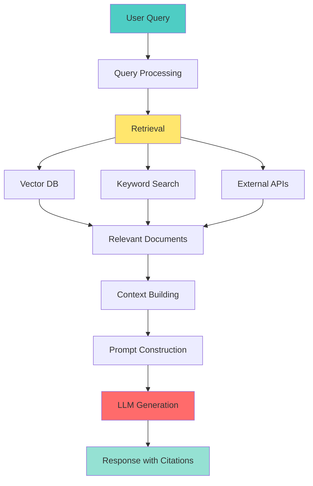

# 📘 **NODEJS AI DEVELOPER MASTERY - Lesson 14: RAG Implementation Patterns**

**Date**: 26-03-18
**Level**: 🟢 Beginner → 🔴 Senior Engineer
**Series**: AI Developer Fundamentals - Part 3
**Time**: 75 minutes
**Prerequisites**: Lesson 11-13 (Embeddings, Vector Databases)

---

## 🎯 **LEARNING OBJECTIVES**

After completing this **comprehensive** lesson, you will:

1. ✅ **Understand RAG Architecture** - Components, flow, benefits
2. ✅ **Master Document Processing** - Loading, chunking, embedding pipelines
3. ✅ **Implement Retrieval Strategies** - Dense, sparse, hybrid, re-ranking
4. ✅ **Build Response Generation** - Context building, prompt engineering, citations
5. ✅ **Handle Edge Cases** - Missing information, conflicting sources, low confidence
6. ✅ **Production Patterns** - Caching, monitoring, evaluation, optimization
7. ✅ **Advanced RAG** - Multi-hop, iterative, agentic RAG

---

## 📦 **PART 1: RAG ARCHITECTURE**

### **What is RAG?**



**RAG = Retrieval Augmented Generation**

**Why RAG?**
- ✅ **Up-to-date information** - Access current data
- ✅ **Domain-specific knowledge** - Your proprietary data
- ✅ **Reduced hallucinations** - Ground responses in facts
- ✅ **Citations/sources** - Traceable answers
- ✅ **Cost-effective** - No fine-tuning needed

---

### **RAG Components**

```typescript
// ─────────────────────────────────────────────
// RAG System Architecture
// ─────────────────────────────────────────────

/**
 * 1. DOCUMENT PROCESSING PIPELINE
 *    - Document Loaders (PDF, Text, Web, DB)
 *    - Text Splitting/Chunking
 *    - Embedding Generation
 *    - Vector Storage
 * 
 * 2. RETRIEVAL SYSTEM
 *    - Query Processing
 *    - Vector Search
 *    - Keyword Search (optional)
 *    - Re-ranking
 *    - Filtering
 * 
 * 3. RESPONSE GENERATION
 *    - Context Building
 *    - Prompt Construction
 *    - LLM Call
 *    - Citation Extraction
 * 
 * 4. POST-PROCESSING
 *    - Response Validation
 *    - Source Attribution
 *    - Caching
 *    - Analytics
 */
```

---

## 📦 **PART 2: DOCUMENT PROCESSING**

### **Document Loader Service**

```typescript
// ─────────────────────────────────────────────
// ai/rag/document-loader.service.ts
// ─────────────────────────────────────────────
import { Injectable, Logger } from '@nestjs/common';
import * as fs from 'fs/promises';
import * as path from 'path';

export interface LoadedDocument {
  id: string;
  content: string;
  metadata: {
    source: string;
    type: string;
    title?: string;
    author?: string;
    createdAt?: Date;
    updatedAt?: Date;
    [key: string]: any;
  };
}

@Injectable()
export class DocumentLoaderService {
  private readonly logger = new Logger(DocumentLoaderService.name);

  // ─────────────────────────────────────────────
  // Load Text File
  // ─────────────────────────────────────────────
  async loadTextFile(filePath: string): Promise<LoadedDocument> {
    try {
      const content = await fs.readFile(filePath, 'utf-8');
      const stats = await fs.stat(filePath);

      return {
        id: this.generateId(filePath),
        content,
        metadata: {
          source: filePath,
          type: 'text',
          title: path.basename(filePath, '.txt'),
          createdAt: stats.birthtime,
          updatedAt: stats.mtime,
        },
      };
    } catch (error) {
      this.logger.error(`Failed to load text file: ${error.message}`);
      throw error;
    }
  }

  // ─────────────────────────────────────────────
  // Load PDF File (requires pdf-parse)
  // ─────────────────────────────────────────────
  async loadPDFFile(filePath: string): Promise<LoadedDocument> {
    try {
      const pdfParse = await import('pdf-parse');
      const dataBuffer = await fs.readFile(filePath);
      const data = await pdfParse.default(dataBuffer);

      return {
        id: this.generateId(filePath),
        content: data.text,
        metadata: {
          source: filePath,
          type: 'pdf',
          title: path.basename(filePath, '.pdf'),
          pages: data.numpages,
          info: data.info,
        },
      };
    } catch (error) {
      this.logger.error(`Failed to load PDF: ${error.message}`);
      throw error;
    }
  }

  // ─────────────────────────────────────────────
  // Load from URL (Web Scraper)
  // ─────────────────────────────────────────────
  async loadFromURL(url: string): Promise<LoadedDocument> {
    try {
      const response = await fetch(url);
      const html = await response.text();

      // Simple HTML to text conversion
      const content = this.htmlToText(html);

      return {
        id: this.generateId(url),
        content,
        metadata: {
          source: url,
          type: 'web',
          title: this.extractTitle(html),
          crawledAt: new Date(),
        },
      };
    } catch (error) {
      this.logger.error(`Failed to load URL: ${error.message}`);
      throw error;
    }
  }

  // ─────────────────────────────────────────────
  // Load from Database
  // ─────────────────────────────────────────────
  async loadFromDatabase(
    query: string,
    params: any[],
    contentColumn: string,
    metadataColumns: string[],
  ): Promise<LoadedDocument[]> {
    // Implementation depends on your database
    // This is a generic example
    const documents: LoadedDocument[] = [];

    // Example with PostgreSQL
    // const result = await pool.query(query, params);
    // for (const row of result.rows) {
    //   documents.push({
    //     id: row.id.toString(),
    //     content: row[contentColumn],
    //     metadata: {
    //       source: 'database',
    //       type: 'database_record',
    //       ...metadataColumns.reduce((acc, col) => {
    //         acc[col] = row[col];
    //         return acc;
    //       }, {}),
    //     },
    //   });
    // }

    return documents;
  }

  // ─────────────────────────────────────────────
  // Load Multiple Files (Batch)
  // ─────────────────────────────────────────────
  async loadMultipleFiles(
    filePaths: string[],
    options: {
      concurrency?: number;
    } = {},
  ): Promise<LoadedDocument[]> {
    const { concurrency = 5 } = options;
    const documents: LoadedDocument[] = [];

    for (let i = 0; i < filePaths.length; i += concurrency) {
      const batch = filePaths.slice(i, i + concurrency);

      const batchResults = await Promise.allSettled(
        batch.map(path => this.loadFile(path)),
      );

      for (const result of batchResults) {
        if (result.status === 'fulfilled') {
          documents.push(result.value);
        } else {
          this.logger.error(`Failed to load file: ${result.reason.message}`);
        }
      }
    }

    return documents;
  }

  // ─────────────────────────────────────────────
  // Load File (Auto-detect type)
  // ─────────────────────────────────────────────
  async loadFile(filePath: string): Promise<LoadedDocument> {
    const ext = path.extname(filePath).toLowerCase();

    switch (ext) {
      case '.txt':
        return this.loadTextFile(filePath);
      case '.pdf':
        return this.loadPDFFile(filePath);
      case '.md':
        return this.loadTextFile(filePath);
      case '.json':
        return this.loadJSONFile(filePath);
      default:
        return this.loadTextFile(filePath);
    }
  }

  // ─────────────────────────────────────────────
  // Load JSON File
  // ─────────────────────────────────────────────
  async loadJSONFile(filePath: string): Promise<LoadedDocument> {
    const content = await fs.readFile(filePath, 'utf-8');
    const data = JSON.parse(content);

    return {
      id: this.generateId(filePath),
      content: JSON.stringify(data, null, 2),
      metadata: {
        source: filePath,
        type: 'json',
        title: path.basename(filePath, '.json'),
      },
    };
  }

  // ─────────────────────────────────────────────
  // Helper: HTML to Text
  // ─────────────────────────────────────────────
  private htmlToText(html: string): string {
    return html
      .replace(/<script[^>]*>[\s\S]*?<\/script>/gi, '')
      .replace(/<style[^>]*>[\s\S]*?<\/style>/gi, '')
      .replace(/<[^>]+>/g, ' ')
      .replace(/\s+/g, ' ')
      .trim();
  }

  // ─────────────────────────────────────────────
  // Helper: Extract Title from HTML
  // ─────────────────────────────────────────────
  private extractTitle(html: string): string {
    const match = html.match(/<title[^>]*>([^<]+)<\/title>/i);
    return match ? match[1].trim() : 'Untitled';
  }

  // ─────────────────────────────────────────────
  // Helper: Generate ID
  // ─────────────────────────────────────────────
  private generateId(source: string): string {
    const crypto = require('crypto');
    return crypto
      .createHash('md5')
      .update(source)
      .digest('hex');
  }
}
```

---

### **Text Chunking Service**

```typescript
// ─────────────────────────────────────────────
// ai/rag/text-chunker.service.ts
// ─────────────────────────────────────────────
import { Injectable, Logger } from '@nestjs/common';
import { LoadedDocument } from './document-loader.service';

export interface ChunkedDocument {
  originalId: string;
  chunkId: string;
  content: string;
  metadata: {
    chunkIndex: number;
    totalChunks: number;
    startOffset?: number;
    endOffset?: number;
    [key: string]: any;
  };
}

export interface ChunkingOptions {
  strategy?: 'recursive' | 'fixed' | 'semantic';
  chunkSize?: number;  // in characters
  chunkOverlap?: number;
  separators?: string[];
}

@Injectable()
export class TextChunkerService {
  private readonly logger = new Logger(TextChunkerService.name);

  // ─────────────────────────────────────────────
  // Chunk Documents
  // ─────────────────────────────────────────────
  chunkDocuments(
    documents: LoadedDocument[],
    options: ChunkingOptions = {},
  ): ChunkedDocument[] {
    const {
      strategy = 'recursive',
      chunkSize = 1000,
      chunkOverlap = 200,
      separators = ['\n\n', '\n', '. ', ' ', ''],
    } = options;

    const allChunks: ChunkedDocument[] = [];

    for (const doc of documents) {
      const chunks = this.chunkText(doc.content, {
        strategy,
        chunkSize,
        chunkOverlap,
        separators,
      });

      for (let i = 0; i < chunks.length; i++) {
        allChunks.push({
          originalId: doc.id,
          chunkId: `${doc.id}:chunk:${i}`,
          content: chunks[i].text,
          metadata: {
            ...doc.metadata,
            chunkIndex: i,
            totalChunks: chunks.length,
            startOffset: chunks[i].startOffset,
            endOffset: chunks[i].endOffset,
          },
        });
      }

      this.logger.log(
        `Chunked document ${doc.id}: ${chunks.length} chunks`,
      );
    }

    return allChunks;
  }

  // ─────────────────────────────────────────────
  // Chunk Text (Recursive Strategy)
  // ─────────────────────────────────────────────
  private chunkText(
    text: string,
    options: ChunkingOptions,
  ): Array<{ text: string; startOffset: number; endOffset: number }> {
    const {
      strategy = 'recursive',
      chunkSize = 1000,
      chunkOverlap = 200,
      separators = ['\n\n', '\n', '. ', ' ', ''],
    } = options;

    if (strategy === 'fixed') {
      return this.fixedSizeChunk(text, chunkSize, chunkOverlap);
    }

    if (strategy === 'semantic') {
      // TODO: Implement semantic chunking
      return this.fixedSizeChunk(text, chunkSize, chunkOverlap);
    }

    return this.recursiveChunk(text, chunkSize, chunkOverlap, separators);
  }

  // ─────────────────────────────────────────────
  // Recursive Chunking (Best for most cases)
  // ─────────────────────────────────────────────
  private recursiveChunk(
    text: string,
    chunkSize: number,
    chunkOverlap: number,
    separators: string[],
  ): Array<{ text: string; startOffset: number; endOffset: number }> {
    const chunks: Array<{ text: string; startOffset: number; endOffset: number }> = [];
    let remainingText = text;
    let currentOffset = 0;

    while (remainingText.length > 0) {
      // If remaining text fits in one chunk
      if (remainingText.length <= chunkSize) {
        chunks.push({
          text: remainingText,
          startOffset: currentOffset,
          endOffset: currentOffset + remainingText.length,
        });
        break;
      }

      // Try to split by separators
      let splitPoint = -1;
      let separator = '';

      for (const sep of separators) {
        // Find last occurrence of separator within chunk size
        const searchSpace = remainingText.substring(0, chunkSize);
        const lastOccurrence = searchSpace.lastIndexOf(sep);

        if (lastOccurrence > chunkSize * 0.5) {  // At least half of chunk size
          splitPoint = lastOccurrence;
          separator = sep;
          break;
        }
      }

      if (splitPoint === -1) {
        // No good split point found, force split
        splitPoint = chunkSize;
      }

      const chunkText = remainingText.substring(0, splitPoint);
      chunks.push({
        text: chunkText,
        startOffset: currentOffset,
        endOffset: currentOffset + splitPoint,
      });

      // Move forward with overlap
      const moveDistance = splitPoint - chunkOverlap;
      remainingText = remainingText.substring(moveDistance);
      currentOffset += moveDistance;
    }

    return chunks;
  }

  // ─────────────────────────────────────────────
  // Fixed Size Chunking
  // ─────────────────────────────────────────────
  private fixedSizeChunk(
    text: string,
    chunkSize: number,
    chunkOverlap: number,
  ): Array<{ text: string; startOffset: number; endOffset: number }> {
    const chunks: Array<{ text: string; startOffset: number; endOffset: number }> = [];
    let start = 0;

    while (start < text.length) {
      const end = Math.min(start + chunkSize, text.length);
      chunks.push({
        text: text.substring(start, end),
        startOffset: start,
        endOffset: end,
      });

      start += chunkSize - chunkOverlap;
    }

    return chunks;
  }
}
```

---

## 📦 **PART 3: RETRIEVAL STRATEGIES**

### **Advanced Retrieval Service**

```typescript
// ─────────────────────────────────────────────
// ai/rag/retrieval.service.ts
// ─────────────────────────────────────────────
import { Injectable, Logger } from '@nestjs/common';
import { EmbeddingGeneratorService } from '../embeddings/embedding-generator.service';
import { VectorMathService } from '../embeddings/vector-math.service';

export interface RetrievalResult {
  content: string;
  metadata: Record<string, any>;
  score: number;
  rank: number;
  source?: string;
}

export interface RetrievalOptions {
  topK?: number;
  threshold?: number;
  strategy?: 'dense' | 'sparse' | 'hybrid' | 'rerank';
  filters?: Record<string, any>;
}

@Injectable()
export class RetrievalService {
  private readonly logger = new Logger(RetrievalService.name);

  constructor(
    private embeddingService: EmbeddingGeneratorService,
    private vectorMath: VectorMathService,
    private vectorDatabase: any, // Your vector DB service
  ) {}

  // ─────────────────────────────────────────────
  // Dense Retrieval (Vector Search)
  // ─────────────────────────────────────────────
  async denseRetrieval(
    query: string,
    options: RetrievalOptions = {},
  ): Promise<RetrievalResult[]> {
    const { topK = 10, threshold = 0.5, filters = {} } = options;

    // Generate query embedding
    const queryEmbedding = await this.embeddingService.embed(query);

    // Search vector database
    const results = await this.vectorDatabase.search(queryEmbedding.embedding, {
      limit: topK,
      filter: filters,
      threshold,
    });

    return results.map((r, i) => ({
      content: r.metadata?.content || r.content,
      metadata: r.metadata,
      score: r.score,
      rank: i + 1,
      source: r.metadata?.source,
    }));
  }

  // ─────────────────────────────────────────────
  // Sparse Retrieval (Keyword/BM25)
  // ─────────────────────────────────────────────
  async sparseRetrieval(
    query: string,
    options: RetrievalOptions = {},
  ): Promise<RetrievalResult[]> {
    // Implementation depends on your search engine
    // Could use Elasticsearch, Meilisearch, or MongoDB text search

    const { topK = 10 } = options;

    // Example with MongoDB text search
    // const results = await this.collection.find(
    //   { $text: { $search: query } },
    //   { score: { $meta: 'textScore' } }
    // )
    // .sort({ score: { $meta: 'textScore' } })
    // .limit(topK)
    // .toArray();

    // Placeholder implementation
    return [];
  }

  // ─────────────────────────────────────────────
  // Hybrid Retrieval (Dense + Sparse)
  // ─────────────────────────────────────────────
  async hybridRetrieval(
    query: string,
    options: {
      topK?: number;
      vectorWeight?: number;
      keywordWeight?: number;
      filters?: Record<string, any>;
    } = {},
  ): Promise<RetrievalResult[]> {
    const {
      topK = 10,
      vectorWeight = 0.7,
      keywordWeight = 0.3,
      filters = {},
    } = options;

    // Get results from both methods
    const [denseResults, sparseResults] = await Promise.all([
      this.denseRetrieval(query, { topK: topK * 2, filters }),
      this.sparseRetrieval(query, { topK: topK * 2 }),
    ]);

    // Combine results with Reciprocal Rank Fusion (RRF)
    const combined = new Map<string, RetrievalResult & { rrfScore: number }>();

    // Add dense results
    for (const result of denseResults) {
      const key = this.getResultKey(result);
      combined.set(key, {
        ...result,
        rrfScore: vectorWeight / (result.rank + 60),  // RRF formula
      });
    }

    // Merge sparse results
    for (const result of sparseResults) {
      const key = this.getResultKey(result);
      const existing = combined.get(key);

      if (existing) {
        existing.rrfScore += keywordWeight / (result.rank + 60);
      } else {
        combined.set(key, {
          ...result,
          rrfScore: keywordWeight / (result.rank + 60),
        });
      }
    }

    // Sort by RRF score and return
    const results = Array.from(combined.values())
      .sort((a, b) => b.rrfScore - a.rrfScore)
      .slice(0, topK);

    results.forEach((r, i) => r.rank = i + 1);

    return results;
  }

  // ─────────────────────────────────────────────
  // Re-ranking (Cross-Encoder)
  // ─────────────────────────────────────────────
  async rerankResults(
    query: string,
    initialResults: RetrievalResult[],
    options: {
      topK?: number;
    } = {},
  ): Promise<RetrievalResult[]> {
    const { topK = 5 } = options;

    // In production, use a cross-encoder model
    // For now, use simple scoring based on text similarity

    const queryLower = query.toLowerCase();

    const reranked = initialResults.map(result => {
      const contentLower = result.content.toLowerCase();

      // Simple scoring: boost for query terms in content
      const queryTerms = queryLower.split(/\s+/).filter(w => w.length > 3);
      let score = result.score;

      for (const term of queryTerms) {
        if (contentLower.includes(term)) {
          score += 0.1;
        }
      }

      return {
        ...result,
        score,
      };
    });

    reranked.sort((a, b) => b.score - a.score);
    reranked.forEach((r, i) => r.rank = i + 1);

    return reranked.slice(0, topK);
  }

  // ─────────────────────────────────────────────
  // Multi-Hop Retrieval
  // ─────────────────────────────────────────────
  async multiHopRetrieval(
    query: string,
    options: {
      maxHops?: number;
      topKPerHop?: number;
    } = {},
  ): Promise<RetrievalResult[]> {
    const { maxHops = 2, topKPerHop = 5 } = options;

    let allResults: RetrievalResult[] = [];
    let currentQuery = query;

    for (let hop = 0; hop < maxHops; hop++) {
      this.logger.log(`Multi-hop retrieval: Hop ${hop + 1}/${maxHops}`);

      // Retrieve for current query
      const results = await this.denseRetrieval(currentQuery, {
        topK: topKPerHop,
      });

      // Add to all results (avoiding duplicates)
      for (const result of results) {
        const key = this.getResultKey(result);
        if (!allResults.some(r => this.getResultKey(r) === key)) {
          allResults.push(result);
        }
      }

      // Generate next query based on retrieved results
      if (hop < maxHops - 1) {
        currentQuery = await this.generateNextQuery(query, results);
      }
    }

    // Sort and limit
    allResults.sort((a, b) => b.score - a.score);
    allResults.forEach((r, i) => r.rank = i + 1);

    return allResults.slice(0, topKPerHop * maxHops);
  }

  // ─────────────────────────────────────────────
  // Generate Next Query (for Multi-Hop)
  // ─────────────────────────────────────────────
  private async generateNextQuery(
    originalQuery: string,
    results: RetrievalResult[],
  ): Promise<string> {
    // Use LLM to generate follow-up query
    // This is a simplified version

    const context = results.slice(0, 3).map(r => r.content).join('\n\n');

    // In production, call LLM with prompt like:
    // "Based on this information, what additional information do we need to answer: {originalQuery}?"

    return originalQuery;  // Placeholder
  }

  // ─────────────────────────────────────────────
  // Helper: Get Result Key
  // ─────────────────────────────────────────────
  private getResultKey(result: RetrievalResult): string {
    return `${result.source || 'unknown'}:${result.metadata?.chunkId || 'unknown'}`;
  }
}
```

---

## 📦 **PART 4: RESPONSE GENERATION**

### **RAG Response Generator**

```typescript
// ─────────────────────────────────────────────
// ai/rag/response-generator.service.ts
// ─────────────────────────────────────────────
import { Injectable, Logger } from '@nestjs/common';
import { ChatService } from '../chat/chat.service';
import { RetrievalResult } from './retrieval.service';

export interface RAGResponse {
  answer: string;
  sources: Array<{
    content: string;
    metadata: Record<string, any>;
    relevanceScore: number;
  }>;
  confidence: number;
  usedContext: string;
  followUpQuestions?: string[];
}

export interface RAGOptions {
  systemPrompt?: string;
  includeSources?: boolean;
  includeConfidence?: boolean;
  maxContextLength?: number;
  temperature?: number;
}

@Injectable()
export class ResponseGeneratorService {
  private readonly logger = new Logger(ResponseGeneratorService.name);

  constructor(
    private chatService: ChatService,
  ) {}

  // ─────────────────────────────────────────────
  // Generate RAG Response
  // ─────────────────────────────────────────────
  async generate(
    query: string,
    results: RetrievalResult[],
    options: RAGOptions = {},
  ): Promise<RAGResponse> {
    const {
      systemPrompt,
      includeSources = true,
      includeConfidence = true,
      maxContextLength = 4000,
      temperature = 0.3,
    } = options;

    // Build context from retrieved results
    const context = this.buildContext(results, maxContextLength);

    // Check if we have enough context
    if (!context || context.trim().length === 0) {
      return {
        answer: "I don't have enough information to answer that question based on the available documents.",
        sources: [],
        confidence: 0,
        usedContext: '',
        followUpQuestions: [
          'Can you rephrase your question?',
          'Is there a specific document you\'re asking about?',
        ],
      };
    }

    // Build prompt
    const prompt = this.buildPrompt(query, context, systemPrompt);

    // Generate response
    const answer = await this.chatService.complete(
      [
        { role: 'system', content: systemPrompt || this.getDefaultSystemPrompt() },
        { role: 'user', content: prompt },
      ],
      { temperature },
    );

    // Calculate confidence
    const confidence = includeConfidence
      ? this.calculateConfidence(results, answer)
      : 1;

    // Build response
    const response: RAGResponse = {
      answer,
      sources: includeSources
        ? results.map(r => ({
            content: r.content,
            metadata: r.metadata,
            relevanceScore: r.score,
          }))
        : [],
      confidence,
      usedContext: context,
    };

    // Generate follow-up questions
    response.followUpQuestions = await this.generateFollowUpQuestions(query, answer, context);

    return response;
  }

  // ─────────────────────────────────────────────
  // Build Context from Results
  // ─────────────────────────────────────────────
  private buildContext(
    results: RetrievalResult[],
    maxLength: number,
  ): string {
    const chunks: string[] = [];
    let currentLength = 0;

    for (const result of results) {
      const chunk = `[Source ${result.rank}, Relevance: ${result.score.toFixed(2)}]\n${result.content}`;

      if (currentLength + chunk.length > maxLength) {
        break;
      }

      chunks.push(chunk);
      currentLength += chunk.length;
    }

    return chunks.join('\n\n---\n\n');
  }

  // ─────────────────────────────────────────────
  // Build Prompt
  // ─────────────────────────────────────────────
  private buildPrompt(
    query: string,
    context: string,
    customSystemPrompt?: string,
  ): string {
    return `
Context Information:
${context}

Question: ${query}

Please answer the question based on the context provided above. If the context doesn't contain enough information to answer the question, please say so. Include citations to the sources when possible.
`;
  }

  // ─────────────────────────────────────────────
  // Default System Prompt
  // ─────────────────────────────────────────────
  private getDefaultSystemPrompt(): string {
    return `You are a helpful assistant that answers questions based on provided context.
- Use ONLY the information from the context to answer
- If the context doesn't contain enough information, say so clearly
- Cite your sources using [Source X] notation
- Be concise but thorough
- If information seems outdated or conflicting, mention it`;
  }

  // ─────────────────────────────────────────────
  // Calculate Confidence Score
  // ─────────────────────────────────────────────
  private calculateConfidence(
    results: RetrievalResult[],
    answer: string,
  ): number {
    // Base confidence on retrieval scores
    const avgRetrievalScore = results.reduce((sum, r) => sum + r.score, 0) / results.length;

    // Boost if multiple sources agree
    const sourceCountBoost = Math.min(results.length / 5, 1) * 0.2;

    // Check if answer indicates uncertainty
    const uncertaintyPhrases = [
      "i don't know",
      "not enough information",
      "cannot determine",
      "based on the available",
    ];

    const answerLower = answer.toLowerCase();
    const hasUncertainty = uncertaintyPhrases.some(phrase =>
      answerLower.includes(phrase),
    );

    const uncertaintyPenalty = hasUncertainty ? 0.3 : 0;

    return Math.max(0, Math.min(1, avgRetrievalScore + sourceCountBoost - uncertaintyPenalty));
  }

  // ─────────────────────────────────────────────
  // Generate Follow-up Questions
  // ─────────────────────────────────────────────
  private async generateFollowUpQuestions(
    query: string,
    answer: string,
    context: string,
  ): Promise<string[]> {
    // Use LLM to generate relevant follow-up questions
    const prompt = `
Based on this question and answer, suggest 3 relevant follow-up questions:

Question: ${query}
Answer: ${answer.substring(0, 200)}...

Generate 3 follow-up questions that would help the user learn more about this topic.
Return as a JSON array: ["Question 1?", "Question 2?", "Question 3?"]
`;

    try {
      const response = await this.chatService.complete(
        [
          { role: 'system', content: 'You are a helpful assistant. Respond ONLY with a JSON array of questions.' },
          { role: 'user', content: prompt },
        ],
        { response_format: { type: 'json_object' } },
      );

      const parsed = JSON.parse(response);
      return Array.isArray(parsed) ? parsed : [];
    } catch (error) {
      return [];
    }
  }
}
```

---

## ✅ **RAG CHECKLIST**

```
Document Processing
[ ] Document loaders working
[ ] Text chunking implemented
[ ] Embeddings generated
[ ] Vector storage populated

Retrieval
[ ] Dense retrieval working
[ ] Sparse retrieval (optional)
[ ] Hybrid retrieval implemented
[ ] Re-ranking working
[ ] Multi-hop retrieval

Response Generation
[ ] Context building
[ ] Prompt construction
[ ] Citation extraction
[ ] Confidence scoring
[ ] Follow-up questions

Production
[ ] Caching layer
[ ] Monitoring setup
[ ] Evaluation metrics
[ ] Performance optimization
```

---

## 🎯 **KNOWLEDGE CHECK**

### **Question 1: Why Chunk Documents for RAG?**

<details>
<summary>💡 Click to reveal answer</summary>

**Reasons**:
1. ✅ **Context Window Limits** - Fit more relevant info
2. ✅ **Precise Retrieval** - Get specific sections, not whole docs
3. ✅ **Better Similarity** - Focused chunks = better matching
4. ✅ **Cost Efficiency** - Only retrieve what's needed
5. ✅ **Multiple Topics** - One doc can have multiple chunks for different topics

**Sweet Spot**: 512-1024 tokens with 10-20% overlap!
</details>

---

### **Question 2: Dense vs Sparse vs Hybrid Retrieval?**

<details>
<summary>💡 Click to reveal answer</summary>

**Dense (Vector)**:
- ✅ Semantic understanding
- ✅ Handles paraphrasing
- ❌ Misses exact keywords

**Sparse (Keyword)**:
- ✅ Exact match precision
- ✅ Good for names, codes, IDs
- ❌ No semantic understanding

**Hybrid (Best of Both)**:
- ✅ Semantic + keyword
- ✅ More robust retrieval
- ✅ Industry standard

**Use Hybrid for production!**
</details>

---

## 📚 **ADDITIONAL RESOURCES**

- **RAG Paper**: [https://arxiv.org/abs/2005.11401](https://arxiv.org/abs/2005.11401)
- **LangChain RAG**: [https://docs.langchain.com/docs/components/retrievers](https://docs.langchain.com/docs/components/retrievers)
- **RAG Evaluation**: [https://docs.llamaindex.ai/en/stable/evaluation/evaluation.html](https://docs.llamaindex.ai/en/stable/evaluation/evaluation.html)

---

## 🎓 **HOMEWORK**

1. ✅ Build document loading pipeline
2. ✅ Implement text chunking
3. ✅ Create retrieval service
4. ✅ Build hybrid retrieval
5. ✅ Implement response generator
6. ✅ Add citation extraction
7. ✅ Create confidence scoring
8. ✅ Build end-to-end RAG pipeline

---

**Next Lesson**: Advanced RAG Optimization - Re-ranking, Query Expansion, Evaluation
**Date**: 26-03-18
**Status**: ✅ Complete

---
*26-03-18*
