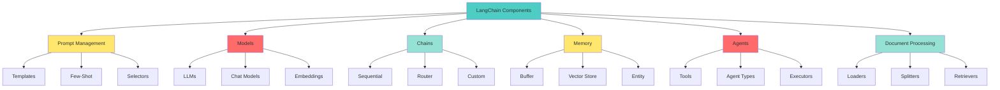

# 📘 **NODEJS AI DEVELOPER MASTERY - Lesson 16: LangChain.js Fundamentals**

**Date**: 26-03-18
**Level**: 🟢 Beginner → 🔴 Senior Engineer
**Series**: AI Developer Fundamentals - Part 4
**Time**: 70 minutes
**Prerequisites**: Lesson 1-15 (AI Foundations, Function Calling, RAG complete)

---

## 🎯 **LEARNING OBJECTIVES**

After completing this **comprehensive** lesson, you will:

1. ✅ **Understand LangChain Architecture** - Core concepts, components, flow
2. ✅ **Master Prompt Templates** - Dynamic prompts, few-shot, partial
3. ✅ **Implement Chains** - Sequential, transformation, router chains
4. ✅ **Work with Memory** - Conversation buffer, vector store, entity memory
5. ✅ **Use Document Loaders** - PDF, web, database, custom loaders
6. ✅ **Master Retrievers** - Vector store, multi-query, ensemble
7. ✅ **Build Agents** - Tool usage, custom agents, agent executors

---

## 📦 **PART 1: LANGCHAIN ARCHITECTURE**

### **What is LangChain?**



**LangChain Provides**:
- ✅ **Abstraction Layer** - Unified interface for LLMs
- ✅ **Pre-built Components** - Chains, agents, memory
- ✅ **Document Processing** - Load, split, embed, retrieve
- ✅ **Memory Management** - Conversation history
- ✅ **Tool Integration** - APIs, databases, functions
- ✅ **Orchestration** - Complex multi-step workflows

---

### **Installation & Setup**

```bash
# Install core LangChain packages
npm install @langchain/core @langchain/openai @langchain/community

# Install additional integrations
npm install @langchain/pinecone @langchain/mongodb
npm install @langchain/textsplitters

# Install for specific features
npm install cheerio  # Web scraping
npm install pdf-parse  # PDF parsing
npm install zod  # Schema validation
```

---

## 📦 **PART 2: PROMPT TEMPLATES**

### **Basic Prompt Templates**

```typescript
// ─────────────────────────────────────────────
// langchain/prompt-templates.service.ts
// ─────────────────────────────────────────────
import { Injectable } from '@nestjs/common';
import {
  PromptTemplate,
  FewShotPromptTemplate,
  ChatPromptTemplate,
  SystemMessagePromptTemplate,
  HumanMessagePromptTemplate,
} from '@langchain/core/prompts';
import { Example } from '@langchain/core/prompts';

@Injectable()
export class PromptTemplatesService {
  // ─────────────────────────────────────────────
  // Simple Prompt Template
  // ─────────────────────────────────────────────
  createSimpleTemplate(): PromptTemplate {
    return PromptTemplate.fromTemplate(`
You are a helpful assistant specialized in {topic}.

Answer the following question concisely and accurately:

Question: {question}

Answer:
`);
  }

  // ─────────────────────────────────────────────
  // Chat Prompt Template (Multi-Message)
  // ─────────────────────────────────────────────
  createChatTemplate(): ChatPromptTemplate {
    return ChatPromptTemplate.fromMessages([
      SystemMessagePromptTemplate.fromTemplate(
        'You are a helpful assistant specialized in {topic}. Be concise and accurate.',
      ),
      HumanMessagePromptTemplate.fromTemplate('{question}'),
    ]);
  }

  // ─────────────────────────────────────────────
  // Few-Shot Prompt Template (With Examples)
  // ─────────────────────────────────────────────
  createFewShotTemplate(): FewShotPromptTemplate {
    const examples: Example[] = [
      {
        question: 'What is the capital of France?',
        answer: 'Paris',
      },
      {
        question: 'Who wrote Romeo and Juliet?',
        answer: 'William Shakespeare',
      },
      {
        question: 'What is H2O?',
        answer: 'Water',
      },
    ];

    const examplePrompt = PromptTemplate.fromTemplate(
      'Question: {question}\nAnswer: {answer}',
    );

    return new FewShotPromptTemplate({
      examples,
      examplePrompt,
      prefix: 'You are a quiz assistant. Answer based on the examples:',
      suffix: 'Question: {question}\nAnswer:',
      inputVariables: ['question'],
    });
  }

  // ─────────────────────────────────────────────
  // Conditional Few-Shot (Dynamic Examples)
  // ─────────────────────────────────────────────
  createDynamicFewShotTemplate(
    examples: Example[],
    inputVariables: string[],
  ): FewShotPromptTemplate {
    const examplePrompt = PromptTemplate.fromTemplate(
      'Input: {input}\nOutput: {output}',
    );

    return new FewShotPromptTemplate({
      examples,
      examplePrompt,
      prefix: 'Follow the pattern from these examples:',
      suffix: 'Input: {input}\nOutput:',
      inputVariables,
    });
  }

  // ─────────────────────────────────────────────
  // Template with Partial Variables
  // ─────────────────────────────────────────────
  createPartialTemplate(): PromptTemplate {
    const template = PromptTemplate.fromTemplate(
      'You are a {role} working on {project}. Your task is: {task}',
    );

    // Set default values for some variables
    return template.partial({
      role: 'senior developer',
      project: 'AI assistant',
    });
    // Now only 'task' needs to be provided
  }

  // ─────────────────────────────────────────────
  // Pipeline Prompt (Multiple Templates)
  // ─────────────────────────────────────────────
  createPipelineTemplate(): {
    analyze: PromptTemplate;
    synthesize: PromptTemplate;
  } {
    return {
      analyze: PromptTemplate.fromTemplate(`
Analyze the following text for key themes and concepts:

Text: {text}

Key themes:
`),
      synthesize: PromptTemplate.fromTemplate(`
Based on this analysis, create a summary:

Analysis: {analysis}

Summary:
`),
    };
  }
}
```

---

## 📦 **PART 3: CHAINS**

### **Basic Chains**

```typescript
// ─────────────────────────────────────────────
// langchain/chains.service.ts
// ─────────────────────────────────────────────
import { Injectable, Logger } from '@nestjs/common';
import { ChatOpenAI } from '@langchain/openai';
import { ConfigService } from '@nestjs/config';
import {
  RunnableSequence,
  RunnablePassthrough,
} from '@langchain/core/runnables';
import { StringOutputParser } from '@langchain/core/output_parsers';
import { PromptTemplatesService } from './prompt-templates.service';

@Injectable()
export class ChainsService {
  private readonly logger = new Logger(ChainsService.name);
  private llm: ChatOpenAI;

  constructor(
    private configService: ConfigService,
    private promptService: PromptTemplatesService,
  ) {
    this.llm = new ChatOpenAI({
      apiKey: this.configService.get('OPENAI_API_KEY'),
      model: this.configService.get('OPENAI_CHAT_MODEL', 'gpt-4-turbo-preview'),
      temperature: 0.7,
    });
  }

  // ─────────────────────────────────────────────
  // Simple Chain (Prompt + LLM)
  // ─────────────────────────────────────────────
  async simpleChain(question: string): Promise<string> {
    const prompt = this.promptService.createSimpleTemplate();

    const chain = prompt.pipe(this.llm).pipe(new StringOutputParser());

    const result = await chain.invoke({
      topic: 'technology',
      question,
    });

    return result;
  }

  // ─────────────────────────────────────────────
  // Sequential Chain (Multiple Steps)
  // ─────────────────────────────────────────────
  async sequentialChain(text: string): Promise<{
    analysis: string;
    summary: string;
  }> {
    const templates = this.promptService.createPipelineTemplate();

    // Step 1: Analyze
    const analyzeChain = templates.analyze
      .pipe(this.llm)
      .pipe(new StringOutputParser());

    const analysis = await analyzeChain.invoke({ text });

    // Step 2: Synthesize
    const synthesizeChain = templates.synthesize
      .pipe(this.llm)
      .pipe(new StringOutputParser());

    const summary = await synthesizeChain.invoke({ analysis });

    return { analysis, summary };
  }

  // ─────────────────────────────────────────────
  // Chain with RunnableSequence (Advanced)
  // ─────────────────────────────────────────────
  async advancedChain(question: string): Promise<string> {
    const prompt = this.promptService.createChatTemplate();

    const chain = RunnableSequence.from([
      {
        topic: new RunnablePassthrough(),
        question: new RunnablePassthrough(),
      },
      prompt,
      this.llm,
      new StringOutputParser(),
    ]);

    const result = await chain.invoke({
      topic: 'science',
      question,
    });

    return result;
  }

  // ─────────────────────────────────────────────
  // Router Chain (Conditional Execution)
  // ─────────────────────────────────────────────
  async routerChain(
    input: string,
    category: 'technical' | 'creative' | 'analytical',
  ): Promise<string> {
    // Define prompts for different categories
    const prompts = {
      technical: PromptTemplate.fromTemplate(
        'Provide a technical explanation: {input}',
      ),
      creative: PromptTemplate.fromTemplate(
        'Provide a creative response: {input}',
      ),
      analytical: PromptTemplate.fromTemplate(
        'Provide an analytical breakdown: {input}',
      ),
    };

    // Select prompt based on category
    const selectedPrompt = prompts[category];

    const chain = selectedPrompt
      .pipe(this.llm)
      .pipe(new StringOutputParser());

    const result = await chain.invoke({ input });

    return result;
  }

  // ─────────────────────────────────────────────
  // Map-Reduce Chain (Parallel Processing)
  // ─────────────────────────────────────────────
  async mapReduceChain(documents: string[]): Promise<string> {
    // Map: Process each document
    const summarizePrompt = PromptTemplate.fromTemplate(
      'Summarize this text in 2-3 sentences:\n\n{text}',
    );

    const summarizeChain = summarizePrompt
      .pipe(this.llm)
      .pipe(new StringOutputParser());

    // Process in parallel
    const summaries = await Promise.all(
      documents.map(doc => summarizeChain.invoke({ text: doc })),
    );

    // Reduce: Combine summaries
    const reducePrompt = PromptTemplate.fromTemplate(
      'Combine these summaries into a coherent overview:\n\n{summaries}',
    );

    const reduceChain = reducePrompt
      .pipe(this.llm)
      .pipe(new StringOutputParser());

    const finalResult = await reduceChain.invoke({
      summaries: summaries.join('\n\n'),
    });

    return finalResult;
  }
}
```

---

## 📦 **PART 4: MEMORY**

### **Conversation Memory**

```typescript
// ─────────────────────────────────────────────
// langchain/memory.service.ts
// ─────────────────────────────────────────────
import { Injectable, Logger } from '@nestjs/common';
import { ChatOpenAI } from '@langchain/openai';
import { ConfigService } from '@nestjs/config';
import {
  BufferMemory,
  ConversationSummaryMemory,
  VectorStoreRetrieverMemory,
  EntityMemory,
} from 'langchain/memory';
import { ChatPromptTemplate } from '@langchain/core/prompts';
import { StringOutputParser } from '@langchain/core/output_parsers';

@Injectable()
export class MemoryService {
  private readonly logger = new Logger(MemoryService.name);
  private llm: ChatOpenAI;

  constructor(
    private configService: ConfigService,
  ) {
    this.llm = new ChatOpenAI({
      apiKey: this.configService.get('OPENAI_API_KEY'),
      model: this.configService.get('OPENAI_CHAT_MODEL', 'gpt-4-turbo-preview'),
    });
  }

  // ─────────────────────────────────────────────
  // Buffer Memory (Simple Conversation History)
  // ─────────────────────────────────────────────
  createBufferMemory(options: {
    returnMessages?: boolean;
    maxTokens?: number;
    memoryKey?: string;
  } = {}): BufferMemory {
    return new BufferMemory({
      returnMessages: options.returnMessages ?? true,
      memoryKey: options.memoryKey ?? 'chat_history',
    });
  }

  // ─────────────────────────────────────────────
  // Conversation Summary Memory
  // ─────────────────────────────────────────────
  createSummaryMemory(): ConversationSummaryMemory {
    return new ConversationSummaryMemory({
      llm: this.llm,
      memoryKey: 'chat_history',
    });
  }

  // ─────────────────────────────────────────────
  // Entity Memory (Track Specific Entities)
  // ─────────────────────────────────────────────
  createEntityMemory(): EntityMemory {
    return new EntityMemory({
      llm: this.llm,
      memoryKey: 'chat_history',
      entityKey: 'entities',
    });
  }

  // ─────────────────────────────────────────────
  // Chat with Memory
  // ─────────────────────────────────────────────
  async chatWithMemory(
    sessionId: string,
    message: string,
    memory: BufferMemory,
  ): Promise<{
    response: string;
    history: any;
  }> {
    // Load memory
    const history = await memory.loadMemoryVariables({});

    // Build prompt with history
    const prompt = ChatPromptTemplate.fromMessages([
      SystemMessagePromptTemplate.fromTemplate(
        'You are a helpful assistant. Use the conversation history to provide context-aware responses.',
      ),
      HumanMessagePromptTemplate.fromTemplate('{chat_history}'),
      HumanMessagePromptTemplate.fromTemplate('{message}'),
    ]);

    const chain = prompt
      .pipe(this.llm)
      .pipe(new StringOutputParser());

    const response = await chain.invoke({
      chat_history: history.chat_history || '',
      message,
    });

    // Save to memory
    await memory.saveContext(
      { input: message },
      { output: response },
    );

    return { response, history };
  }

  // ─────────────────────────────────────────────
  // Clear Memory for Session
  // ─────────────────────────────────────────────
  async clearMemory(memory: BufferMemory): Promise<void> {
    await memory.clear();
    this.logger.log('Memory cleared');
  }
}
```

---

## 📦 **PART 5: DOCUMENT LOADERS & RETRIEVERS**

### **Document Processing**

```typescript
// ─────────────────────────────────────────────
// langchain/document-loader.service.ts
// ─────────────────────────────────────────────
import { Injectable, Logger } from '@nestjs/common';
import { TextLoader } from 'langchain/document_loaders/fs/text';
import { PDFLoader } from '@langchain/community/document_loaders/fs/pdf';
import { CheerioWebBaseLoader } from '@langchain/community/document_loaders/web/cheerio';
import { RecursiveCharacterTextSplitter } from 'langchain/text_splitter';
import { Document } from '@langchain/core/documents';

@Injectable()
export class DocumentLoaderService {
  private readonly logger = new Logger(DocumentLoaderService.name);

  // ─────────────────────────────────────────────
  // Load Text File
  // ─────────────────────────────────────────────
  async loadTextFile(filePath: string): Promise<Document[]> {
    const loader = new TextLoader(filePath);
    const docs = await loader.load();

    this.logger.log(`Loaded ${docs.length} documents from ${filePath}`);

    return docs;
  }

  // ─────────────────────────────────────────────
  // Load PDF File
  // ─────────────────────────────────────────────
  async loadPDFFile(filePath: string): Promise<Document[]> {
    const loader = new PDFLoader(filePath);
    const docs = await loader.load();

    this.logger.log(`Loaded ${docs.length} pages from ${filePath}`);

    return docs;
  }

  // ─────────────────────────────────────────────
  // Load from URL
  // ─────────────────────────────────────────────
  async loadFromURL(url: string): Promise<Document[]> {
    const loader = new CheerioWebBaseLoader(url);
    const docs = await loader.load();

    this.logger.log(`Loaded ${docs.length} documents from ${url}`);

    return docs;
  }

  // ─────────────────────────────────────────────
  // Split Documents
  // ─────────────────────────────────────────────
  splitDocuments(
    documents: Document[],
    options: {
      chunkSize?: number;
      chunkOverlap?: number;
    } = {},
  ): Document[] {
    const {
      chunkSize = 1000,
      chunkOverlap = 200,
    } = options;

    const splitter = new RecursiveCharacterTextSplitter({
      chunkSize,
      chunkOverlap,
    });

    const splitDocs = splitter.splitDocuments(documents);

    this.logger.log(
      `Split ${documents.length} documents into ${splitDocs.length} chunks`,
    );

    return splitDocs;
  }

  // ─────────────────────────────────────────────
  // Load and Process Pipeline
  // ─────────────────────────────────────────────
  async loadAndSplit(
    source: { type: 'file' | 'url'; path: string },
    options: {
      chunkSize?: number;
      chunkOverlap?: number;
    } = {},
  ): Promise<Document[]> {
    let docs: Document[];

    if (source.type === 'file') {
      const ext = source.path.split('.').pop()?.toLowerCase();

      if (ext === 'pdf') {
        docs = await this.loadPDFFile(source.path);
      } else {
        docs = await this.loadTextFile(source.path);
      }
    } else {
      docs = await this.loadFromURL(source.path);
    }

    return this.splitDocuments(docs, options);
  }
}
```

---

### **Retrievers**

```typescript
// ─────────────────────────────────────────────
// langchain/retriever.service.ts
// ─────────────────────────────────────────────
import { Injectable } from '@nestjs/common';
import { VectorStore } from '@langchain/core/vectorstores';
import { Embeddings } from '@langchain/core/embeddings';
import { Document } from '@langchain/core/documents';
import { ParentDocumentRetriever } from 'langchain/retrievers/parent_document';
import { MultiQueryRetriever } from 'langchain/retrievers/multi_query';
import { ChatOpenAI } from '@langchain/openai';

@Injectable()
export class LangChainRetrieverService {
  constructor(
    private vectorStore: VectorStore,
    private embeddings: Embeddings,
  ) {}

  // ─────────────────────────────────────────────
  // Basic Vector Store Retriever
  // ─────────────────────────────────────────────
  getBasicRetriever(options: {
    k?: number;
    filter?: any;
  } = {}) {
    return this.vectorStore.asRetriever({
      k: options.k ?? 4,
      filter: options.filter,
    });
  }

  // ─────────────────────────────────────────────
  // Multi-Query Retriever
  // ─────────────────────────────────────────────
  getMultiQueryRetriever(options: {
    llm?: ChatOpenAI;
  } = {}) {
    return MultiQueryRetriever.fromLLM({
      llm: options.llm || new ChatOpenAI(),
      retriever: this.getBasicRetriever(),
    });
  }

  // ─────────────────────────────────────────────
  // Parent Document Retriever
  // ─────────────────────────────────────────────
  getParentDocumentRetriever(
    parentDocs: Document[],
    childVectorStore: VectorStore,
  ) {
    return new ParentDocumentRetriever({
      vectorstore: childVectorStore,
      parentStore: this.vectorStore,
      parentDocuments: parentDocs,
      childK: 4,
      parentK: 1,
    });
  }
}
```

---

## ✅ **LANGCHAIN CHECKLIST**

```
Prompt Templates
[ ] Simple templates working
[ ] Few-shot examples configured
[ ] Chat prompts with messages
[ ] Partial variables set

Chains
[ ] Simple chain (prompt + LLM)
[ ] Sequential chains
[ ] Router chains
[ ] Map-reduce pattern

Memory
[ ] Buffer memory
[ ] Summary memory
[ ] Entity memory
[ ] Session management

Documents
[ ] File loaders (TXT, PDF)
[ ] Web loader
[ ] Text splitting
[ ] Document processing

Retrievers
[ ] Vector store retriever
[ ] Multi-query retriever
[ ] Parent-document retriever
```

---

## 🎯 **KNOWLEDGE CHECK**

### **Question 1: Why Use LangChain?**

<details>
<summary>💡 Click to reveal answer</summary>

**Benefits**:
- ✅ **Unified Interface** - Same API for different LLMs
- ✅ **Pre-built Components** - Don't reinvent the wheel
- ✅ **Memory Management** - Built-in conversation history
- ✅ **Document Processing** - Load, split, embed out of box
- ✅ **Agent Framework** - Tool usage, reasoning
- ✅ **Active Community** - Lots of integrations, examples

**When NOT to use**: Simple use cases, performance-critical apps (overhead)
</details>

---

### **Question 2: Buffer vs Summary Memory?**

<details>
<summary>💡 Click to reveal answer</summary>

**Buffer Memory**:
- ✅ Stores full conversation history
- ✅ Good for short conversations
- ❌ Context window limits

**Summary Memory**:
- ✅ Summarizes old conversations
- ✅ Good for long conversations
- ❌ Loses some details

**Best Practice**: Start with buffer, switch to summary for long chats!
</details>

---

## 📚 **ADDITIONAL RESOURCES**

- **LangChain.js Docs**: [https://js.langchain.com](https://js.langchain.com)
- **LangChain Examples**: [https://github.com/langchain-ai/langchainjs](https://github.com/langchain-ai/langchainjs)
- **Prompt Templates**: [https://js.langchain.com/docs/modules/model_io/prompts](https://js.langchain.com/docs/modules/model_io/prompts)

---

## 🎓 **HOMEWORK**

1. ✅ Install LangChain packages
2. ✅ Create prompt templates
3. ✅ Build simple chain
4. ✅ Implement conversation memory
5. ✅ Load and split documents
6. ✅ Create vector store retriever
7. ✅ Build multi-query retriever
8. ✅ Create custom chain

---

**Next Lesson**: Vercel AI SDK - Streaming UI Integration
**Date**: 26-03-18
**Status**: ✅ Complete

---
*26-03-18*
