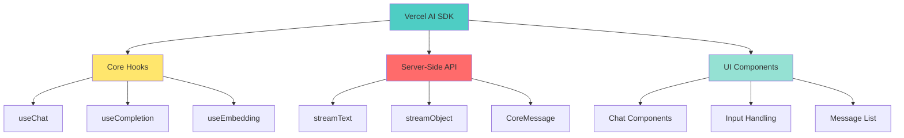

# 📘 **NODEJS AI DEVELOPER MASTERY - Lesson 17: Vercel AI SDK**

**Date**: 26-03-18
**Level**: 🟢 Beginner → 🔴 Senior Engineer
**Series**: AI Developer Fundamentals - Part 4
**Time**: 60 minutes
**Prerequisites**: Lesson 16 (LangChain.js Fundamentals)

---

## 🎯 **LEARNING OBJECTIVES**

After completing this **comprehensive** lesson, you will:

1. ✅ **Understand Vercel AI SDK** - Architecture, benefits, use cases
2. ✅ **Implement Streaming API** - Server-side streaming, SSE
3. ✅ **Build React UI Components** - useChat, useCompletion hooks
4. ✅ **Handle Multiple Providers** - OpenAI, Anthropic, custom
5. ✅ **Implement Tool Calling** - Function execution in UI
6. ✅ **Build Chat Interface** - Full-featured chat application
7. ✅ **Production Patterns** - Error handling, loading states, abort

---

## 📦 **PART 1: VERCEL AI SDK OVERVIEW**

### **What is Vercel AI SDK?**



**Vercel AI SDK Provides**:
- ✅ **React Hooks** - `useChat`, `useCompletion` for streaming UI
- ✅ **Server-Side Streaming** - `streamText`, `streamObject`
- ✅ **Multi-Provider** - OpenAI, Anthropic, Cohere, custom
- ✅ **Type-Safe** - Full TypeScript support
- ✅ **Edge Compatible** - Works on Vercel Edge Functions
- ✅ **Tool Integration** - Function calling support

---

### **Installation & Setup**

```bash
# Install core packages
npm install ai @ai-sdk/openai @ai-sdk/anthropic

# Install React integration (if using React)
npm install react

# Install for NestJS backend
npm install @nestjs/serve-static
```

---

## 📦 **PART 2: SERVER-SIDE STREAMING**

### **Streaming API Service**

```typescript
// ─────────────────────────────────────────────
// ai/vercel/streaming.service.ts
// ─────────────────────────────────────────────
import { Injectable, Logger } from '@nestjs/common';
import { ConfigService } from '@nestjs/config';
import { streamText, streamObject, StreamTextResult, StreamObjectResult } from 'ai';
import { createOpenAI } from '@ai-sdk/openai';

export interface StreamOptions {
  model?: string;
  temperature?: number;
  maxTokens?: number;
  system?: string;
  tools?: any[];
}

@Injectable()
export class VercelStreamingService {
  private readonly logger = new Logger(VercelStreamingService.name);
  private openai: ReturnType<typeof createOpenAI>;

  constructor(
    private configService: ConfigService,
  ) {
    this.openai = createOpenAI({
      apiKey: this.configService.get('OPENAI_API_KEY'),
    });
  }

  // ─────────────────────────────────────────────
  // Stream Text (Basic)
  // ─────────────────────────────────────────────
  async streamText(
    prompt: string,
    options: StreamOptions = {},
  ): Promise<StreamTextResult> {
    const {
      model = 'gpt-4-turbo-preview',
      temperature = 0.7,
      maxTokens = 4096,
      system,
    } = options;

    const messages: any[] = [];

    if (system) {
      messages.push({ role: 'system', content: system });
    }

    messages.push({ role: 'user', content: prompt });

    const result = streamText({
      model: this.openai(model),
      messages,
      temperature,
      maxTokens,
    });

    return result;
  }

  // ─────────────────────────────────────────────
  // Stream Text with Conversation
  // ─────────────────────────────────────────────
  async streamConversation(
    messages: Array<{ role: string; content: string }>,
    options: StreamOptions = {},
  ): Promise<StreamTextResult> {
    const {
      model = 'gpt-4-turbo-preview',
      temperature = 0.7,
      maxTokens = 4096,
      system,
    } = options;

    const formattedMessages: any[] = [];

    if (system) {
      formattedMessages.push({ role: 'system', content: system });
    }

    formattedMessages.push(...messages);

    const result = streamText({
      model: this.openai(model),
      messages: formattedMessages,
      temperature,
      maxTokens,
      onFinish: ({ text, usage }) => {
        this.logger.log(
          `Conversation completed: ${text.length} chars, ${usage.totalTokens} tokens`,
        );
      },
    });

    return result;
  }

  // ─────────────────────────────────────────────
  // Stream Object (Structured Output)
  // ─────────────────────────────────────────────
  async streamObject<T>(
    prompt: string,
    schema: any,
    options: StreamOptions = {},
  ): Promise<StreamObjectResult<T, any>> {
    const {
      model = 'gpt-4-turbo-preview',
      temperature = 0,
      maxTokens = 4096,
      system = 'You are a helpful assistant that responds in structured JSON format.',
    } = options;

    const result = streamObject({
      model: this.openai(model),
      system,
      prompt,
      schema,
      temperature,
      maxTokens,
      onFinish: ({ object }) => {
        this.logger.log(`Object stream completed: ${JSON.stringify(object).length} chars`);
      },
    });

    return result;
  }

  // ─────────────────────────────────────────────
  // Stream with Tools (Function Calling)
  // ─────────────────────────────────────────────
  async streamWithTools(
    messages: Array<{ role: string; content: string }>,
    tools: any[],
    options: StreamOptions = {},
  ): Promise<StreamTextResult> {
    const {
      model = 'gpt-4-turbo-preview',
      temperature = 0.7,
      maxTokens = 4096,
      system,
    } = options;

    const formattedMessages: any[] = [];

    if (system) {
      formattedMessages.push({ role: 'system', content: system });
    }

    formattedMessages.push(...messages);

    const result = streamText({
      model: this.openai(model),
      messages: formattedMessages,
      tools,
      temperature,
      maxTokens,
      maxSteps: 5,  // Allow multi-step tool execution
      onFinish: ({ text, toolCalls, toolResults }) => {
        this.logger.log(
          `Tool execution completed: ${toolCalls?.length || 0} calls, ${toolResults?.length || 0} results`,
        );
      },
    });

    return result;
  }

  // ─────────────────────────────────────────────
  // Convert to ReadableStream (for HTTP Response)
  // ─────────────────────────────────────────────
  toReadableStream(result: StreamTextResult): ReadableStream {
    return result.toAIStream();
  }

  // ─────────────────────────────────────────────
  // Get Text as Promise
  // ─────────────────────────────────────────────
  async getText(result: StreamTextResult): Promise<string> {
    return result.text;
  }

  // ─────────────────────────────────────────────
  // Get Object as Promise
  // ─────────────────────────────────────────────
  async getObject<T>(result: StreamObjectResult<T, any>): Promise<T> {
    return result.object;
  }
}
```

---

## 📦 **PART 3: NESTJS CONTROLLER**

### **Streaming Controller**

```typescript
// ─────────────────────────────────────────────
// ai/vercel/vercel.controller.ts
// ─────────────────────────────────────────────
import {
  Controller,
  Post,
  Body,
  Res,
  UseGuards,
  Headers,
} from '@nestjs/common';
import { Response } from 'express';
import { ApiTags, ApiOperation } from '@nestjs/swagger';
import { VercelStreamingService } from './streaming.service';
import { AuthGuard } from '../../auth/auth.guard';

@ApiTags('AI Streaming (Vercel)')
@Controller('api/v1/ai/stream')
export class VercelController {
  constructor(
    private streamingService: VercelStreamingService,
  ) {}

  // ─────────────────────────────────────────────
  // POST: Stream Chat Response
  // ─────────────────────────────────────────────
  @Post('chat')
  @ApiOperation({ summary: 'Stream chat response (SSE)' })
  async streamChat(
    @Body() body: {
      messages: Array<{ role: string; content: string }>;
      system?: string;
      temperature?: number;
      maxTokens?: number;
    },
    @Res() res: Response,
  ) {
    const {
      messages,
      system = 'You are a helpful assistant.',
      temperature = 0.7,
      maxTokens = 4096,
    } = body;

    // Create stream
    const result = await this.streamingService.streamConversation(messages, {
      system,
      temperature,
      maxTokens,
    });

    // Set headers for SSE
    res.setHeader('Content-Type', 'text/event-stream');
    res.setHeader('Cache-Control', 'no-cache');
    res.setHeader('Connection', 'keep-alive');
    res.setHeader('X-Accel-Buffering', 'no');  // Disable nginx buffering

    // Stream to response
    const stream = result.toAIStream();
    stream.pipeTo(
      new WritableStream({
        write(chunk) {
          res.write(chunk);
        },
        close() {
          res.end();
        },
      }),
    );
  }

  // ─────────────────────────────────────────────
  // POST: Stream with Tools
  // ─────────────────────────────────────────────
  @Post('chat/tools')
  @UseGuards(AuthGuard)
  @ApiOperation({ summary: 'Stream chat with tool execution' })
  async streamWithTools(
    @Body() body: {
      messages: Array<{ role: string; content: string }>;
      tools?: any[];
    },
    @Res() res: Response,
  ) {
    const { messages, tools = [] } = body;

    const result = await this.streamingService.streamWithTools(messages, tools);

    res.setHeader('Content-Type', 'text/event-stream');
    res.setHeader('Cache-Control', 'no-cache');
    res.setHeader('Connection', 'keep-alive');

    const stream = result.toAIStream();
    stream.pipeTo(
      new WritableStream({
        write(chunk) {
          res.write(chunk);
        },
        close() {
          res.end();
        },
      }),
    );
  }

  // ─────────────────────────────────────────────
  // POST: Stream Structured Object
  // ─────────────────────────────────────────────
  @Post('object')
  @ApiOperation({ summary: 'Stream structured JSON object' })
  async streamObject(
    @Body() body: {
      prompt: string;
      schema: any;
    },
    @Res() res: Response,
  ) {
    const { prompt, schema } = body;

    const result = await this.streamingService.streamObject(prompt, schema);

    res.setHeader('Content-Type', 'text/event-stream');
    res.setHeader('Cache-Control', 'no-cache');
    res.setHeader('Connection', 'keep-alive');

    const stream = result.toAIStream();
    stream.pipeTo(
      new WritableStream({
        write(chunk) {
          res.write(chunk);
        },
        close() {
          res.end();
        },
      }),
    );
  }
}
```

---

## 📦 **PART 4: REACT FRONTEND**

### **React Chat Component (useChat Hook)**

```typescript
// ─────────────────────────────────────────────
// frontend/chat/chat.component.tsx
// ─────────────────────────────────────────────
import React from 'react';
import { useChat } from 'ai/react';

export function ChatComponent() {
  const {
    messages,
    input,
    handleInputChange,
    handleSubmit,
    isLoading,
    error,
    stop,
    reload,
    append,
  } = useChat({
    api: '/api/v1/ai/stream/chat',
    initialMessages: [],
    initialInput: '',
    sendExtraMessageFields: true,
    onError: (error) => {
      console.error('Chat error:', error);
    },
    onFinish: (message) => {
      console.log('Message completed:', message);
    },
  });

  return (
    <div className="chat-container">
      {/* Message List */}
      <div className="message-list">
        {messages.map((message) => (
          <div
            key={message.id}
            className={`message ${message.role}`}
          >
            <div className="message-role">
              {message.role === 'user' ? '👤 You' : '🤖 Assistant'}
            </div>
            <div className="message-content">
              {message.content}
            </div>
          </div>
        ))}

        {/* Loading Indicator */}
        {isLoading && (
          <div className="message assistant loading">
            <div className="message-role">🤖 Assistant</div>
            <div className="message-content">
              <span className="typing-indicator">Thinking...</span>
            </div>
          </div>
        )}

        {/* Error Display */}
        {error && (
          <div className="message error">
            <div className="error-content">
              Error: {error.message}
              <button onClick={() => reload()}>Retry</button>
            </div>
          </div>
        )}
      </div>

      {/* Input Form */}
      <form onSubmit={handleSubmit} className="chat-input">
        <input
          value={input}
          onChange={handleInputChange}
          placeholder="Type your message..."
          disabled={isLoading}
          className="input-field"
        />
        <button
          type="submit"
          disabled={isLoading || !input.trim()}
          className="send-button"
        >
          {isLoading ? 'Stop' : 'Send'}
        </button>
        {isLoading && (
          <button type="button" onClick={stop} className="stop-button">
            Stop
          </button>
        )}
      </form>

      {/* Quick Actions */}
      <div className="quick-actions">
        <button onClick={() => append({ role: 'user', content: 'Explain this simply' })}>
          Simplify
        </button>
        <button onClick={() => append({ role: 'user', content: 'Give me an example' })}>
          Example
        </button>
        <button onClick={() => append({ role: 'user', content: 'Why is this important?' })}>
          Why?
        </button>
      </div>
    </div>
  );
}
```

---

### **Advanced Chat with Tools**

```typescript
// ─────────────────────────────────────────────
// frontend/chat/chat-with-tools.component.tsx
// ─────────────────────────────────────────────
import React, { useState } from 'react';
import { useChat } from 'ai/react';

export function ChatWithToolsComponent() {
  const [toolResults, setToolResults] = useState<any[]>([]);

  const {
    messages,
    input,
    handleInputChange,
    handleSubmit,
    isLoading,
    append,
  } = useChat({
    api: '/api/v1/ai/stream/chat/tools',
    body: {
      tools: [
        {
          name: 'getWeather',
          description: 'Get weather for a city',
          parameters: {
            type: 'object',
            properties: {
              city: { type: 'string' },
            },
            required: ['city'],
          },
        },
        {
          name: 'searchWeb',
          description: 'Search the web for information',
          parameters: {
            type: 'object',
            properties: {
              query: { type: 'string' },
            },
            required: ['query'],
          },
        },
      ],
    },
    onToolCall: async (toolCall) => {
      console.log('Tool called:', toolCall);

      // Execute tool (in real app, call your API)
      let result: any;

      if (toolCall.name === 'getWeather') {
        result = { temperature: 22, condition: 'Sunny' };
      } else if (toolCall.name === 'searchWeb') {
        result = { results: ['Result 1', 'Result 2'] };
      }

      setToolResults(prev => [...prev, { tool: toolCall.name, result }]);

      return result;
    },
  });

  return (
    <div className="chat-with-tools">
      {/* Tool Results Display */}
      {toolResults.length > 0 && (
        <div className="tool-results">
          <h4>Tool Results:</h4>
          {toolResults.map((tr, i) => (
            <div key={i} className="tool-result">
              <strong>{tr.tool}:</strong> {JSON.stringify(tr.result)}
            </div>
          ))}
        </div>
      )}

      {/* Chat Messages */}
      <div className="message-list">
        {messages.map((message) => (
          <div key={message.id} className={`message ${message.role}`}>
            <div className="message-role">
              {message.role === 'user' ? '👤' : '🤖'}
            </div>
            <div className="message-content">
              {message.content}
              {message.toolInvocations?.map((tool, i) => (
                <div key={i} className="tool-invocation">
                  🔧 {tool.name}({JSON.stringify(tool.args)})
                </div>
              ))}
            </div>
          </div>
        ))}
      </div>

      {/* Input */}
      <form onSubmit={handleSubmit}>
        <input
          value={input}
          onChange={handleInputChange}
          placeholder="Ask about weather or search the web..."
        />
        <button type="submit" disabled={isLoading}>
          {isLoading ? '...' : 'Send'}
        </button>
      </form>
    </div>
  );
}
```

---

### **useCompletion Hook (Single Prompt)**

```typescript
// ─────────────────────────────────────────────
// frontend/completion/completion.component.tsx
// ─────────────────────────────────────────────
import React from 'react';
import { useCompletion } from 'ai/react';

export function CompletionComponent() {
  const {
    completion,
    input,
    isLoading,
    error,
    handleInputChange,
    handleSubmit,
    stop,
  } = useCompletion({
    api: '/api/v1/ai/stream/object',
    body: {
      schema: {
        type: 'object',
        properties: {
          summary: { type: 'string' },
          keyPoints: { type: 'array', items: { type: 'string' } },
        },
      },
    },
  });

  return (
    <div className="completion-container">
      <form onSubmit={handleSubmit}>
        <input
          value={input}
          onChange={handleInputChange}
          placeholder="Enter text to analyze..."
        />
        <button type="submit" disabled={isLoading}>
          {isLoading ? 'Processing...' : 'Analyze'}
        </button>
        {isLoading && <button type="button" onClick={stop}>Stop</button>}
      </form>

      {error && <div className="error">Error: {error.message}</div>}

      {completion && (
        <div className="completion-result">
          <h3>Result:</h3>
          <pre>{completion}</pre>
        </div>
      )}
    </div>
  );
}
```

---

## ✅ **VERCEL AI SDK CHECKLIST**

```
Server-Side
[ ] Streaming service configured
[ ] Multi-provider support
[ ] Tool calling implemented
[ ] Object streaming working

Frontend (React)
[ ] useChat hook integrated
[ ] useCompletion hook integrated
[ ] Loading states handled
[ ] Error handling
[ ] Stop functionality

Production
[ ] Abort controller
[ ] Retry logic
[ ] Rate limiting
[ ] Monitoring
```

---

## 🎯 **KNOWLEDGE CHECK**

### **Question 1: useChat vs useCompletion?**

<details>
<summary>💡 Click to reveal answer</summary>

**useChat**:
- ✅ Multi-turn conversations
- ✅ Maintains message history
- ✅ Chat interface focused

**useCompletion**:
- ✅ Single prompt completion
- ✅ No history management
- ✅ Text generation focused

**Choose**: useChat for chat apps, useCompletion for completions!
</details>

---

## 📚 **ADDITIONAL RESOURCES**

- **Vercel AI SDK**: [https://sdk.vercel.ai/docs](https://sdk.vercel.ai/docs)
- **AI SDK Examples**: [https://github.com/vercel/ai/tree/main/examples](https://github.com/vercel/ai/tree/main/examples)

---

## 🎓 **HOMEWORK**

1. ✅ Install Vercel AI SDK
2. ✅ Create streaming endpoint
3. ✅ Build React chat component
4. ✅ Implement tool calling
5. ✅ Add error handling
6. ✅ Create completion UI
7. ✅ Add stop functionality
8. ✅ Deploy to Vercel

---

**Next Lesson**: AI Middleware & Interceptors - Request/Response Transformation
**Date**: 26-03-18
**Status**: ✅ Complete

---
*26-03-18*
