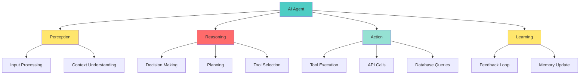

# 📘 **NODEJS AI DEVELOPER MASTERY - Lesson 18: AI Agents & LangGraph**

**Date**: 26-03-18
**Level**: 🟢 Beginner → 🔴 Senior Engineer
**Series**: AI Developer Fundamentals - Part 4
**Time**: 75 minutes
**Prerequisites**: Lesson 16-17 (LangChain.js, Vercel AI SDK)

---

## 🎯 **LEARNING OBJECTIVES**

After completing this **comprehensive** lesson, you will:

1. ✅ **Understand AI Agents** - What they are, types, use cases
2. ✅ **Master Agent Tools** - Tool creation, registration, execution
3. ✅ **Implement Agent Executors** - ReAct, Plan & Execute, OpenAI Functions
4. ✅ **Build LangGraph Workflows** - State machines, cyclic graphs, conditional edges
5. ✅ **Create Multi-Agent Systems** - Agent collaboration, handoffs, supervision
6. ✅ **Handle Agent Memory** - Long-term memory, reflection, learning
7. ✅ **Production Patterns** - Monitoring, debugging, safety

---

## 📦 **PART 1: AI AGENTS FUNDAMENTALS**

### **What are AI Agents?**



**AI Agents Can**:
- ✅ **Autonomous Decision Making** - Choose actions based on goals
- ✅ **Tool Usage** - Call APIs, databases, functions
- ✅ **Multi-Step Reasoning** - Break down complex tasks
- ✅ **Memory & Learning** - Remember past interactions
- ✅ **Collaboration** - Work with other agents

---

### **Agent Types**

```typescript
// ─────────────────────────────────────────────
// Agent Types Overview
// ─────────────────────────────────────────────

/**
 * 1. ZERO-SHOT AGENT
 *    - Makes decisions without examples
 *    - Good for simple, well-defined tasks
 * 
 * 2. REACT AGENT (Reason + Act)
 *    - Alternates between reasoning and action
 *    - Thought → Action → Observation → Repeat
 * 
 * 3. PLAN & EXECUTE AGENT
 *    - Creates full plan first
 *    - Then executes step by step
 * 
 * 4. OPENAI FUNCTIONS AGENT
 *    - Uses function calling API
 *    - Best for structured tool usage
 * 
 * 5. MULTI-AGENT SYSTEM
 *    - Multiple specialized agents
 *    - Collaborate to solve tasks
 */
```

---

## 📦 **PART 2: AGENT TOOLS**

### **Tool Creation Service**

```typescript
// ─────────────────────────────────────────────
// ai/agents/tools.service.ts
// ─────────────────────────────────────────────
import { Injectable, Logger } from '@nestjs/common';
import { tool, Tool } from '@langchain/core/tools';
import { ChatOpenAI } from '@langchain/openai';
import { ConfigService } from '@nestjs/config';
import { z } from 'zod';

@Injectable()
export class AgentToolsService {
  private readonly logger = new Logger(AgentToolsService.name);
  private llm: ChatOpenAI;

  constructor(
    private configService: ConfigService,
  ) {
    this.llm = new ChatOpenAI({
      apiKey: this.configService.get('OPENAI_API_KEY'),
      model: this.configService.get('OPENAI_CHAT_MODEL', 'gpt-4-turbo-preview'),
    });
  }

  // ─────────────────────────────────────────────
  // Calculator Tool
  // ─────────────────────────────────────────────
  createCalculatorTool(): Tool {
    return tool(
      async (input: { expression: string }) => {
        try {
          // Safe evaluation of mathematical expressions
          const result = this.safeEvaluate(input.expression);
          return `Result: ${result}`;
        } catch (error) {
          return `Error evaluating expression: ${error.message}`;
        }
      },
      {
        name: 'calculator',
        description: 'Useful for mathematical calculations. Input should be a mathematical expression.',
        schema: z.object({
          expression: z.string().describe('Mathematical expression to evaluate'),
        }),
      },
    );
  }

  // ─────────────────────────────────────────────
  // Web Search Tool
  // ─────────────────────────────────────────────
  createWebSearchTool(): Tool {
    return tool(
      async (input: { query: string }) => {
        // In production, use actual search API (Google, Bing, Serper)
        this.logger.log(`Searching web for: ${input.query}`);

        // Mock search results
        const results = [
          `Result 1 for "${input.query}"`,
          `Result 2 for "${input.query}"`,
          `Result 3 for "${input.query}"`,
        ];

        return results.join('\n');
      },
      {
        name: 'web_search',
        description: 'Search the web for current information. Input should be a search query.',
        schema: z.object({
          query: z.string().describe('Search query'),
        }),
      },
    );
  }

  // ─────────────────────────────────────────────
  // Database Query Tool
  // ─────────────────────────────────────────────
  createDatabaseTool(): Tool {
    return tool(
      async (input: { query: string; type: 'users' | 'products' | 'orders' }) => {
        this.logger.log(`Database query: ${input.query} on ${input.type}`);

        // In production, execute actual database query
        // IMPORTANT: Validate and sanitize all queries!

        const mockData = {
          users: [
            { id: 1, name: 'John Doe', email: 'john@example.com' },
            { id: 2, name: 'Jane Smith', email: 'jane@example.com' },
          ],
          products: [
            { id: 101, name: 'Laptop', price: 999 },
            { id: 102, name: 'Mouse', price: 29 },
          ],
          orders: [
            { id: 1001, userId: 1, total: 1028 },
            { id: 1002, userId: 2, total: 999 },
          ],
        };

        return JSON.stringify(mockData[input.type] || []);
      },
      {
        name: 'database_query',
        description: 'Query the database for information. Specify the table type and query.',
        schema: z.object({
          query: z.string().describe('Query description'),
          type: z.enum(['users', 'products', 'orders']).describe('Table to query'),
        }),
      },
    );
  }

  // ─────────────────────────────────────────────
  // Email Sender Tool
  // ─────────────────────────────────────────────
  createEmailTool(): Tool {
    return tool(
      async (input: { to: string; subject: string; body: string }) => {
        this.logger.log(`Sending email to: ${input.to}`);

        // In production, use actual email service
        // Validate recipient, sanitize content

        return `Email sent to ${input.to} with subject: "${input.subject}"`;
      },
      {
        name: 'send_email',
        description: 'Send an email to a recipient. Requires to, subject, and body.',
        schema: z.object({
          to: z.string().email().describe('Recipient email address'),
          subject: z.string().describe('Email subject'),
          body: z.string().describe('Email body content'),
        }),
      },
    );
  }

  // ─────────────────────────────────────────────
  // Calendar/Reminder Tool
  // ─────────────────────────────────────────────
  createCalendarTool(): Tool {
    return tool(
      async (input: { action: 'add' | 'list'; event?: string; date?: string }) => {
        this.logger.log(`Calendar action: ${input.action}`);

        if (input.action === 'add' && input.event) {
          return `Event added: "${input.event}" on ${input.date || 'unspecified date'}`;
        } else if (input.action === 'list') {
          return 'Upcoming events:\n- Meeting on Monday\n- Deadline on Friday';
        }

        return 'Invalid calendar action';
      },
      {
        name: 'calendar',
        description: 'Manage calendar events. Can add events or list upcoming events.',
        schema: z.object({
          action: z.enum(['add', 'list']).describe('Action to perform'),
          event: z.string().optional().describe('Event description (for add action)'),
          date: z.string().optional().describe('Event date (for add action)'),
        }),
      },
    );
  }

  // ─────────────────────────────────────────────
  // Create All Tools Array
  // ─────────────────────────────────────────────
  createAllTools(): Tool[] {
    return [
      this.createCalculatorTool(),
      this.createWebSearchTool(),
      this.createDatabaseTool(),
      this.createEmailTool(),
      this.createCalendarTool(),
    ];
  }

  // ─────────────────────────────────────────────
  // Helper: Safe Expression Evaluation
  // ─────────────────────────────────────────────
  private safeEvaluate(expression: string): number {
    // Only allow safe mathematical operations
    const sanitized = expression.replace(/[^0-9+\-*/().\s]/g, '');

    // Use Function constructor with strict validation
    // Note: In production, use a proper math parser library
    try {
      // eslint-disable-next-line no-new-func
      const result = Function(`"use strict"; return (${sanitized})`)();

      if (typeof result !== 'number' || !isFinite(result)) {
        throw new Error('Invalid result');
      }

      return result;
    } catch {
      throw new Error('Invalid mathematical expression');
    }
  }
}
```

---

## 📦 **PART 3: AGENT EXECUTORS**

### **ReAct Agent Implementation**

```typescript
// ─────────────────────────────────────────────
// ai/agents/react-agent.service.ts
// ─────────────────────────────────────────────
import { Injectable, Logger } from '@nestjs/common';
import { ChatOpenAI } from '@langchain/openai';
import { ConfigService } from '@nestjs/config';
import { AgentExecutor, createReactAgent } from 'langchain/agents';
import { pull } from 'langchain/hub';
import { AgentToolsService } from './tools.service';
import { BufferMemory, ConversationSummaryMemory } from 'langchain/memory';

@Injectable()
export class ReActAgentService {
  private readonly logger = new Logger(ReActAgentService.name);
  private llm: ChatOpenAI;
  private executor: AgentExecutor;

  constructor(
    private configService: ConfigService,
    private toolsService: AgentToolsService,
  ) {
    this.llm = new ChatOpenAI({
      apiKey: this.configService.get('OPENAI_API_KEY'),
      model: this.configService.get('OPENAI_CHAT_MODEL', 'gpt-4-turbo-preview'),
      temperature: 0,
    });

    this.initializeAgent();
  }

  // ─────────────────────────────────────────────
  // Initialize ReAct Agent
  // ─────────────────────────────────────────────
  private async initializeAgent(): Promise<void> {
    try {
      // Get ReAct prompt from hub
      const prompt = await pull('hwchase17/react');

      // Get tools
      const tools = this.toolsService.createAllTools();

      // Create ReAct agent
      const agent = await createReactAgent({
        llm: this.llm,
        tools,
        prompt,
      });

      // Create executor with memory
      this.executor = new AgentExecutor({
        agent,
        tools,
        memory: new ConversationSummaryMemory({
          llm: this.llm,
          memoryKey: 'chat_history',
          inputKey: 'input',
        }),
        verbose: true,
        maxIterations: 10,
        earlyStoppingMethod: 'force',
      });

      this.logger.log('ReAct agent initialized');
    } catch (error) {
      this.logger.error(`Failed to initialize agent: ${error.message}`);
      throw error;
    }
  }

  // ─────────────────────────────────────────────
  // Run Agent
  // ─────────────────────────────────────────────
  async run(input: string): Promise<{
    output: string;
    intermediateSteps: any[];
  }> {
    try {
      const result = await this.executor.invoke({
        input,
      });

      this.logger.log(`Agent completed: ${result.output.substring(0, 100)}...`);

      return {
        output: result.output,
        intermediateSteps: result.intermediateSteps || [],
      };
    } catch (error) {
      this.logger.error(`Agent execution failed: ${error.message}`);
      throw error;
    }
  }

  // ─────────────────────────────────────────────
  // Run with Custom Memory
  // ─────────────────────────────────────────────
  async runWithMemory(
    input: string,
    sessionId: string,
  ): Promise<{
    output: string;
    history: any;
  }> {
    const executorWithMemory = new AgentExecutor({
      agent: this.executor.agent,
      tools: this.executor.tools,
      memory: new BufferMemory({
        memoryKey: 'chat_history',
        inputKey: 'input',
        returnMessages: true,
      }),
      verbose: true,
    });

    const result = await executorWithMemory.invoke({
      input,
      sessionId,
    });

    const history = await executorWithMemory.memory.loadMemoryVariables({});

    return {
      output: result.output,
      history,
    };
  }
}
```

---

### **OpenAI Functions Agent**

```typescript
// ─────────────────────────────────────────────
// ai/agents/openai-functions-agent.service.ts
// ─────────────────────────────────────────────
import { Injectable, Logger } from '@nestjs/common';
import { ChatOpenAI } from '@langchain/openai';
import { ConfigService } from '@nestjs/config';
import { AgentExecutor, createOpenAIFunctionsAgent } from 'langchain/agents';
import { ChatPromptTemplate, MessagesPlaceholder } from '@langchain/core/prompts';
import { AgentToolsService } from './tools.service';
import { BufferMemory } from 'langchain/memory';

@Injectable()
export class OpenAIFunctionsAgentService {
  private readonly logger = new Logger(OpenAIFunctionsAgentService.name);
  private llm: ChatOpenAI;
  private executor: AgentExecutor;

  constructor(
    private configService: ConfigService,
    private toolsService: AgentToolsService,
  ) {
    this.llm = new ChatOpenAI({
      apiKey: this.configService.get('OPENAI_API_KEY'),
      model: this.configService.get('OPENAI_CHAT_MODEL', 'gpt-4-turbo-preview'),
      temperature: 0,
    });

    this.initializeAgent();
  }

  // ─────────────────────────────────────────────
  // Initialize OpenAI Functions Agent
  // ─────────────────────────────────────────────
  private async initializeAgent(): Promise<void> {
    try {
      const tools = this.toolsService.createAllTools();

      // Create prompt with memory placeholder
      const prompt = ChatPromptTemplate.fromMessages([
        ['system', 'You are a helpful assistant with access to tools.'],
        new MessagesPlaceholder('chat_history'),
        ['human', '{input}'],
        new MessagesPlaceholder('agent_scratchpad'),
      ]);

      // Create OpenAI functions agent
      const agent = await createOpenAIFunctionsAgent({
        llm: this.llm,
        tools,
        prompt,
      });

      // Create executor
      this.executor = new AgentExecutor({
        agent,
        tools,
        memory: new BufferMemory({
          memoryKey: 'chat_history',
          inputKey: 'input',
          returnMessages: true,
        }),
        verbose: true,
        maxIterations: 10,
      });

      this.logger.log('OpenAI Functions agent initialized');
    } catch (error) {
      this.logger.error(`Failed to initialize agent: ${error.message}`);
      throw error;
    }
  }

  // ─────────────────────────────────────────────
  // Run Agent
  // ─────────────────────────────────────────────
  async run(input: string): Promise<{
    output: string;
    intermediateSteps: any[];
  }> {
    const result = await this.executor.invoke({ input });

    return {
      output: result.output,
      intermediateSteps: result.intermediateSteps || [],
    };
  }
}
```

---

## 📦 **PART 4: LANGRAPH WORKFLOWS**

### **State Machine with LangGraph**

```typescript
// ─────────────────────────────────────────────
// ai/agents/langgraph-workflow.service.ts
// ─────────────────────────────────────────────
import { Injectable, Logger } from '@nestjs/common';
import { ChatOpenAI } from '@langchain/openai';
import { ConfigService } from '@nestjs/config';
import { StateGraph, END } from '@langchain/langgraph';
import { BaseMessage, HumanMessage, AIMessage } from '@langchain/core/messages';

export interface AgentState {
  messages: BaseMessage[];
  currentStep: string;
  context: Record<string, any>;
  output?: string;
}

@Injectable()
export class LangGraphWorkflowService {
  private readonly logger = new Logger(LangGraphWorkflowService.name);
  private llm: ChatOpenAI;

  constructor(
    private configService: ConfigService,
  ) {
    this.llm = new ChatOpenAI({
      apiKey: this.configService.get('OPENAI_API_KEY'),
      model: this.configService.get('OPENAI_CHAT_MODEL', 'gpt-4-turbo-preview'),
    });
  }

  // ─────────────────────────────────────────────
  // Create Simple Workflow
  // ─────────────────────────────────────────────
  async createSimpleWorkflow(): Promise<StateGraph<AgentState>> {
    const workflow = new StateGraph<AgentState>({
      channels: {
        messages: {
          reducer: (currentState, update) => [...currentState, ...update],
          default: () => [],
        },
        currentStep: {
          reducer: (_, update) => update,
          default: () => 'start',
        },
        context: {
          reducer: (currentState, update) => ({ ...currentState, ...update }),
          default: () => ({}),
        },
        output: {
          reducer: (_, update) => update,
          default: () => '',
        },
      },
    });

    // Define nodes
    workflow.addNode('analyze', this.analyzeNode.bind(this));
    workflow.addNode('process', this.processNode.bind(this));
    workflow.addNode('respond', this.respondNode.bind(this));

    // Set entry point
    workflow.setEntryPoint('analyze');

    // Add conditional edges
    workflow.addConditionalEdges(
      'analyze',
      this.routeAfterAnalysis.bind(this),
      {
        'needs-more-info': 'process',
        'ready': 'respond',
      },
    );

    workflow.addEdge('process', 'analyze');
    workflow.addEdge('respond', END);

    return workflow;
  }

  // ─────────────────────────────────────────────
  // Analyze Node
  // ─────────────────────────────────────────────
  private async analyzeNode(state: AgentState): Promise<Partial<AgentState>> {
    this.logger.log('Analyzing input...');

    const lastMessage = state.messages[state.messages.length - 1];

    // Use LLM to analyze
    const response = await this.llm.invoke([
      new SystemMessage('Analyze the user input and determine if you need more information.'),
      lastMessage,
    ]);

    const needsMoreInfo = response.content.toString().includes('unclear');

    return {
      currentStep: needsMoreInfo ? 'needs-more-info' : 'ready',
      context: {
        ...state.context,
        analysis: response.content,
      },
    };
  }

  // ─────────────────────────────────────────────
  // Process Node
  // ─────────────────────────────────────────────
  private async processNode(state: AgentState): Promise<Partial<AgentState>> {
    this.logger.log('Processing...');

    // Additional processing logic
    const context = state.context;

    return {
      currentStep: 'processing',
      context: {
        ...context,
        processed: true,
      },
    };
  }

  // ─────────────────────────────────────────────
  // Respond Node
  // ─────────────────────────────────────────────
  private async respondNode(state: AgentState): Promise<Partial<AgentState>> {
    this.logger.log('Generating response...');

    const response = await this.llm.invoke([
      new SystemMessage('Generate a helpful response based on the analysis.'),
      ...state.messages,
    ]);

    return {
      output: response.content.toString(),
      messages: [new AIMessage(response.content.toString())],
    };
  }

  // ─────────────────────────────────────────────
  // Routing Function
  // ─────────────────────────────────────────────
  private routeAfterAnalysis(state: AgentState): string {
    return state.currentStep === 'needs-more-info'
      ? 'needs-more-info'
      : 'ready';
  }

  // ─────────────────────────────────────────────
  // Run Workflow
  // ─────────────────────────────────────────────
  async runWorkflow(input: string): Promise<{
    output: string;
    trace: string[];
  }> {
    const workflow = await this.createSimpleWorkflow();
    const app = workflow.compile();

    const initialState: AgentState = {
      messages: [new HumanMessage(input)],
      currentStep: 'start',
      context: {},
    };

    const result = await app.invoke(initialState);

    return {
      output: result.output || '',
      trace: result.messages.map(m => m.constructor.name),
    };
  }
}
```

---

### **Multi-Agent System**

```typescript
// ─────────────────────────────────────────────
// ai/agents/multi-agent.service.ts
// ─────────────────────────────────────────────
import { Injectable, Logger } from '@nestjs/common';
import { ChatOpenAI } from '@langchain/openai';
import { StateGraph, END } from '@langchain/langgraph';
import { HumanMessage, AIMessage } from '@langchain/core/messages';
import { AgentToolsService } from './tools.service';

export interface MultiAgentState {
  messages: any[];
  currentAgent: string;
  context: Record<string, any>;
  output?: string;
}

@Injectable()
export class MultiAgentService {
  private readonly logger = new Logger(MultiAgentService.name);
  private llm: ChatOpenAI;

  constructor(
    private configService: ConfigService,
    private toolsService: AgentToolsService,
  ) {
    this.llm = new ChatOpenAI({
      apiKey: this.configService.get('OPENAI_API_KEY'),
      model: this.configService.get('OPENAI_CHAT_MODEL', 'gpt-4-turbo-preview'),
    });
  }

  // ─────────────────────────────────────────────
  // Create Multi-Agent Graph
  // ─────────────────────────────────────────────
  async createMultiAgentGraph(): Promise<StateGraph<MultiAgentState>> {
    const workflow = new StateGraph<MultiAgentState>({
      channels: {
        messages: {
          reducer: (currentState, update) => [...currentState, ...update],
          default: () => [],
        },
        currentAgent: {
          reducer: (_, update) => update,
          default: () => 'supervisor',
        },
        context: {
          reducer: (currentState, update) => ({ ...currentState, ...update }),
          default: () => ({}),
        },
        output: {
          reducer: (_, update) => update,
          default: () => '',
        },
      },
    });

    // Add specialized agents
    workflow.addNode('supervisor', this.supervisorAgent.bind(this));
    workflow.addNode('researcher', this.researcherAgent.bind(this));
    workflow.addNode('coder', this.coderAgent.bind(this));
    workflow.addNode('writer', this.writerAgent.bind(this));

    // Set entry point
    workflow.setEntryPoint('supervisor');

    // Supervisor routes to specialized agents
    workflow.addConditionalEdges(
      'supervisor',
      this.routeFromSupervisor.bind(this),
      {
        'researcher': 'researcher',
        'coder': 'coder',
        'writer': 'writer',
        'FINISH': END,
      },
    );

    // Specialized agents return to supervisor
    workflow.addEdge('researcher', 'supervisor');
    workflow.addEdge('coder', 'supervisor');
    workflow.addEdge('writer', 'supervisor');

    return workflow;
  }

  // ─────────────────────────────────────────────
  // Supervisor Agent
  // ─────────────────────────────────────────────
  private async supervisorAgent(state: MultiAgentState): Promise<Partial<MultiAgentState>> {
    this.logger.log('Supervisor deciding...');

    const response = await this.llm.invoke([
      new SystemMessage(`You are a supervisor coordinating a team of specialists.
Choose which agent should handle the request:
- researcher: For web searches and information gathering
- coder: For programming tasks
- writer: For content creation

Respond with ONLY the agent name or FINISH if complete.`),
      ...state.messages,
    ]);

    const content = response.content.toString().toLowerCase();
    let nextAgent = 'supervisor';

    if (content.includes('researcher')) nextAgent = 'researcher';
    else if (content.includes('coder')) nextAgent = 'coder';
    else if (content.includes('writer')) nextAgent = 'writer';
    else if (content.includes('finish')) nextAgent = 'FINISH';

    return {
      currentAgent: nextAgent,
    };
  }

  // ─────────────────────────────────────────────
  // Researcher Agent
  // ─────────────────────────────────────────────
  private async researcherAgent(state: MultiAgentState): Promise<Partial<MultiAgentState>> {
    this.logger.log('Researcher working...');

    const tools = [this.toolsService.createWebSearchTool()];

    const response = await this.llm.invoke([
      new SystemMessage('You are a researcher. Use tools to gather information.'),
      ...state.messages,
    ]);

    return {
      messages: [new AIMessage(`Researcher: ${response.content}`)],
      context: {
        ...state.context,
        research: response.content,
      },
    };
  }

  // ─────────────────────────────────────────────
  // Coder Agent
  // ─────────────────────────────────────────────
  private async coderAgent(state: MultiAgentState): Promise<Partial<MultiAgentState>> {
    this.logger.log('Coder working...');

    const response = await this.llm.invoke([
      new SystemMessage('You are a coding expert. Write clean, well-documented code.'),
      ...state.messages,
    ]);

    return {
      messages: [new AIMessage(`Coder: ${response.content}`)],
      context: {
        ...state.context,
        code: response.content,
      },
    };
  }

  // ─────────────────────────────────────────────
  // Writer Agent
  // ─────────────────────────────────────────────
  private async writerAgent(state: MultiAgentState): Promise<Partial<MultiAgentState>> {
    this.logger.log('Writer working...');

    const response = await this.llm.invoke([
      new SystemMessage('You are a professional writer. Create clear, engaging content.'),
      ...state.messages,
    ]);

    return {
      messages: [new AIMessage(`Writer: ${response.content}`)],
      output: response.content.toString(),
    };
  }

  // ─────────────────────────────────────────────
  // Routing from Supervisor
  // ─────────────────────────────────────────────
  private routeFromSupervisor(state: MultiAgentState): string {
    return state.currentAgent;
  }

  // ─────────────────────────────────────────────
  // Run Multi-Agent System
  // ─────────────────────────────────────────────
  async runMultiAgent(input: string): Promise<{
    output: string;
    agentTrace: string[];
  }> {
    const workflow = await this.createMultiAgentGraph();
    const app = workflow.compile();

    const initialState: MultiAgentState = {
      messages: [new HumanMessage(input)],
      currentAgent: 'supervisor',
      context: {},
    };

    const result = await app.invoke(initialState);

    return {
      output: result.output || '',
      agentTrace: result.messages.map(m => `${m.constructor.name}: ${m.content}`),
    };
  }
}
```

---

## ✅ **AGENTS & LANGGRAPH CHECKLIST**

```
Agent Tools
[ ] Calculator tool
[ ] Web search tool
[ ] Database tool
[ ] Email tool
[ ] Custom tools created

Agent Executors
[ ] ReAct agent working
[ ] OpenAI functions agent
[ ] Memory integration
[ ] Max iterations set

LangGraph
[ ] State graph defined
[ ] Nodes implemented
[ ] Conditional edges
[ ] Workflow compiling

Multi-Agent
[ ] Supervisor agent
[ ] Specialized agents
[ ] Agent handoffs
[ ] Collaboration working

Production
[ ] Monitoring setup
[ ] Error handling
[ ] Safety checks
[ ] Logging enabled
```

---

## 🎯 **KNOWLEDGE CHECK**

### **Question 1: ReAct vs OpenAI Functions Agent?**

<details>
<summary>💡 Click to reveal answer</summary>

**ReAct Agent**:
- ✅ Works with any LLM
- ✅ Explicit reasoning steps
- ❌ More verbose

**OpenAI Functions Agent**:
- ✅ Requires OpenAI API
- ✅ Cleaner, more efficient
- ✅ Better for structured tools

**Choose**: OpenAI Functions if using OpenAI, ReAct for other models!
</details>

---

## 📚 **ADDITIONAL RESOURCES**

- **LangChain Agents**: [https://js.langchain.com/docs/modules/agents](https://js.langchain.com/docs/modules/agents)
- **LangGraph**: [https://langchain-ai.github.io/langgraph](https://langchain-ai.github.io/langgraph)

---

## 🎓 **HOMEWORK**

1. ✅ Create 5 custom tools
2. ✅ Build ReAct agent
3. ✅ Implement OpenAI functions agent
4. ✅ Create LangGraph workflow
5. ✅ Build multi-agent system
6. ✅ Add agent memory
7. ✅ Implement safety checks
8. ✅ Monitor agent execution

---

**Next Lesson**: AI Middleware & Interceptors - Request/Response Transformation
**Date**: 26-03-18
**Status**: ✅ Complete

---
*26-03-18*
