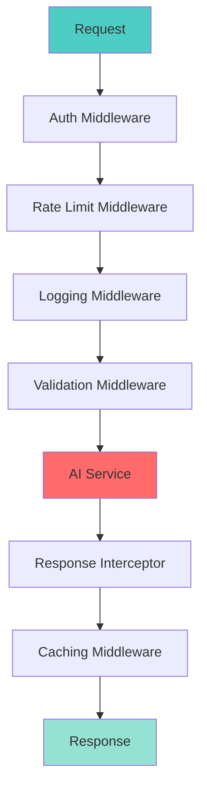

# 📘 **NODEJS AI DEVELOPER MASTERY - Lesson 19: AI Middleware & Interceptors**

**Date**: 26-03-18
**Level**: 🟢 Beginner → 🔴 Senior Engineer
**Series**: AI Developer Fundamentals - Part 4
**Time**: 60 minutes
**Prerequisites**: Lesson 16-18 (LangChain.js, Vercel AI SDK, AI Agents)

---

## 🎯 **LEARNING OBJECTIVES**

After completing this **comprehensive** lesson, you will:

1. ✅ **Understand AI Middleware** - Purpose, architecture, use cases
2. ✅ **Implement Request Interceptors** - Logging, validation, transformation
3. ✅ **Build Response Interceptors** - Formatting, caching, streaming
4. ✅ **Create Custom Middleware** - Authentication, rate limiting, cost tracking
5. ✅ **Implement Error Middleware** - Error handling, fallbacks, retry logic
6. ✅ **Build Monitoring Middleware** - Metrics, tracing, analytics
7. ✅ **Production Patterns** - Composition, ordering, performance

---

## 📦 **PART 1: AI MIDDLEWARE ARCHITECTURE**

### **Middleware Pipeline**



**AI Middleware Handles**:
- ✅ **Request/Response Transformation** - Modify data before/after AI
- ✅ **Logging & Tracing** - Track all AI interactions
- ✅ **Caching** - Reduce API calls, improve latency
- ✅ **Rate Limiting** - Control API usage
- ✅ **Cost Tracking** - Monitor token usage, expenses
- ✅ **Error Handling** - Graceful failures, retries
- ✅ **Security** - Input sanitization, output filtering

---

## 📦 **PART 2: REQUEST INTERCEPTORS**

### **Logging Interceptor**

```typescript
// ─────────────────────────────────────────────
// ai/middleware/logging.interceptor.ts
// ─────────────────────────────────────────────
import {
  Injectable,
  NestInterceptor,
  ExecutionContext,
  CallHandler,
  Logger,
} from '@nestjs/common';
import { Observable, tap } from 'rxjs';
import { Request, Response } from 'express';

@Injectable()
export class LoggingInterceptor implements NestInterceptor {
  private readonly logger = new Logger(LoggingInterceptor.name);

  intercept(
    context: ExecutionContext,
    next: CallHandler,
  ): Observable<any> {
    const request = context.switchToHttp().getRequest<Request>();
    const response = context.switchToHttp().getResponse<Response>();

    const { method, url, body, headers } = request;
    const userAgent = headers['user-agent'] || 'unknown';
    const requestId = headers['x-request-id'] || crypto.randomUUID();

    const startTime = Date.now();

    this.logger.log(
      `\n${'='.repeat(60)}\n` +
      `📥 Incoming AI Request\n` +
      `${'='.repeat(60)}\n` +
      `Method: ${method}\n` +
      `URL: ${url}\n` +
      `Request ID: ${requestId}\n` +
      `User Agent: ${userAgent}\n` +
      `Body: ${JSON.stringify(body, null, 2).substring(0, 500)}\n` +
      `${'='.repeat(60)}`,
    );

    return next.handle().pipe(
      tap((data) => {
        const duration = Date.now() - startTime;
        const statusCode = response.statusCode;

        this.logger.log(
          `\n${'='.repeat(60)}\n` +
          `📤 Outgoing AI Response\n` +
          `${'='.repeat(60)}\n` +
          `Status: ${statusCode}\n` +
          `Duration: ${duration}ms\n` +
          `Request ID: ${requestId}\n` +
          `Response: ${JSON.stringify(data, null, 2).substring(0, 500)}\n` +
          `${'='.repeat(60)}\n`,
        );

        // Log slow requests
        if (duration > 5000) {
          this.logger.warn(
            `⚠️ Slow AI request detected: ${method} ${url} (${duration}ms)`,
          );
        }
      }),
    );
  }
}
```

---

### **Validation Interceptor**

```typescript
// ─────────────────────────────────────────────
// ai/middleware/validation.interceptor.ts
// ─────────────────────────────────────────────
import {
  Injectable,
  NestInterceptor,
  ExecutionContext,
  CallHandler,
  BadRequestException,
} from '@nestjs/common';
import { Observable } from 'rxjs';
import { z } from 'zod';

// Validation schemas
export const ChatRequestSchema = z.object({
  messages: z.array(
    z.object({
      role: z.enum(['system', 'user', 'assistant']),
      content: z.string().min(1),
    })
  ).min(1),
  model: z.string().optional(),
  temperature: z.number().min(0).max(2).optional(),
  maxTokens: z.number().min(1).max(128000).optional(),
});

export const CompletionRequestSchema = z.object({
  prompt: z.string().min(1),
  model: z.string().optional(),
  temperature: z.number().min(0).max(2).optional(),
  maxTokens: z.number().min(1).max(4096).optional(),
});

@Injectable()
export class ValidationInterceptor implements NestInterceptor {
  intercept(
    context: ExecutionContext,
    next: CallHandler,
  ): Observable<any> {
    const request = context.switchToHttp().getRequest();
    const body = request.body;

    // Validate based on endpoint
    const endpoint = request.route?.path || '';

    try {
      if (endpoint.includes('/chat')) {
        ChatRequestSchema.parse(body);
      } else if (endpoint.includes('/completion')) {
        CompletionRequestSchema.parse(body);
      }

      // Sanitize input
      request.body = this.sanitizeInput(body);

    } catch (error) {
      if (error instanceof z.ZodError) {
        throw new BadRequestException({
          code: 'VALIDATION_ERROR',
          message: 'Invalid request body',
          details: error.errors.map(err => ({
            field: err.path.join('.'),
            message: err.message,
          })),
        });
      }
      throw error;
    }

    return next.handle();
  }

  // ─────────────────────────────────────────────
  // Sanitize Input
  // ─────────────────────────────────────────────
  private sanitizeInput(input: any): any {
    if (typeof input === 'string') {
      // Remove potential injection patterns
      return input
        .replace(/<script[^>]*>[\s\S]*?<\/script>/gi, '')
        .replace(/javascript:/gi, '')
        .substring(0, 100000);  // Max length
    }

    if (Array.isArray(input)) {
      return input.map(item => this.sanitizeInput(item));
    }

    if (typeof input === 'object' && input !== null) {
      const sanitized: any = {};
      for (const [key, value] of Object.entries(input)) {
        sanitized[key] = this.sanitizeInput(value);
      }
      return sanitized;
    }

    return input;
  }
}
```

---

### **Rate Limit Interceptor**

```typescript
// ─────────────────────────────────────────────
// ai/middleware/rate-limit.interceptor.ts
// ─────────────────────────────────────────────
import {
  Injectable,
  NestInterceptor,
  ExecutionContext,
  CallHandler,
  TooManyRequestsException,
} from '@nestjs/common';
import { Observable } from 'rxjs';
import { Cache } from 'cache-manager';
import { Inject } from '@nestjs/common';

export interface RateLimitConfig {
  limit: number;
  windowMs: number;
  keyGenerator?: (request: any) => string;
}

@Injectable()
export class RateLimitInterceptor implements NestInterceptor {
  constructor(
    @Inject('CACHE_MANAGER') private cacheManager: Cache,
  ) {}

  async intercept(
    context: ExecutionContext,
    next: CallHandler,
  ): Promise<Observable<any>> {
    const request = context.switchToHttp().getRequest();
    const response = context.switchToHttp().getResponse();

    // Get rate limit config from metadata or use default
    const config = this.getRateLimitConfig(request);

    // Generate key
    const key = this.generateKey(request, config);

    // Check rate limit
    const allowed = await this.checkLimit(key, config);

    if (!allowed.allowed) {
      // Set rate limit headers
      this.setRateLimitHeaders(response, allowed);

      throw new TooManyRequestsException({
        code: 'RATE_LIMIT_EXCEEDED',
        message: 'Too many AI requests. Please slow down.',
        retryAfter: allowed.retryAfter,
        limit: config.limit,
      });
    }

    // Set rate limit headers
    this.setRateLimitHeaders(response, allowed);

    return next.handle();
  }

  // ─────────────────────────────────────────────
  // Check Rate Limit
  // ─────────────────────────────────────────────
  private async checkLimit(
    key: string,
    config: RateLimitConfig,
  ): Promise<{
    allowed: boolean;
    remaining: number;
    resetAt: number;
    retryAfter?: number;
  }> {
    const now = Date.now();
    const windowStart = now - config.windowMs;

    // Get existing requests
    const requests = await this.cacheManager.get<number[]>(key) || [];

    // Remove old requests
    const validRequests = requests.filter(time => time > windowStart);

    if (validRequests.length < config.limit) {
      // Add current request
      validRequests.push(now);
      await this.cacheManager.set(key, validRequests, config.windowMs);

      return {
        allowed: true,
        remaining: config.limit - validRequests.length,
        resetAt: now + config.windowMs,
      };
    }

    // Rate limited
    const oldestRequest = Math.min(...validRequests);
    const resetAt = oldestRequest + config.windowMs;
    const retryAfter = Math.ceil((resetAt - now) / 1000);

    return {
      allowed: false,
      remaining: 0,
      resetAt,
      retryAfter,
    };
  }

  // ─────────────────────────────────────────────
  // Generate Rate Limit Key
  // ─────────────────────────────────────────────
  private generateKey(
    request: any,
    config: RateLimitConfig,
  ): string {
    if (config.keyGenerator) {
      return `ratelimit:${config.keyGenerator(request)}`;
    }

    // Default: use user ID or IP
    const userId = request.user?.id || request.headers['x-user-id'];
    const ip = request.ip || request.connection?.remoteAddress;

    return `ratelimit:${userId || `ip:${ip}`}`;
  }

  // ─────────────────────────────────────────────
  // Set Rate Limit Headers
  // ─────────────────────────────────────────────
  private setRateLimitHeaders(
    response: any,
    limitInfo: any,
  ): void {
    response.setHeader('X-RateLimit-Limit', limitInfo.limit || 100);
    response.setHeader('X-RateLimit-Remaining', limitInfo.remaining);
    response.setHeader('X-RateLimit-Reset', new Date(limitInfo.resetAt).toISOString());

    if (limitInfo.retryAfter) {
      response.setHeader('Retry-After', limitInfo.retryAfter.toString());
    }
  }

  // ─────────────────────────────────────────────
  // Get Rate Limit Config
  // ─────────────────────────────────────────────
  private getRateLimitConfig(request: any): RateLimitConfig {
    // Different limits for different endpoints
    const endpoint = request.route?.path || '';

    if (endpoint.includes('/chat')) {
      return {
        limit: 60,  // 60 requests per minute
        windowMs: 60000,
      };
    }

    if (endpoint.includes('/embedding')) {
      return {
        limit: 100,
        windowMs: 60000,
      };
    }

    // Default limit
    return {
      limit: 100,
      windowMs: 60000,
    };
  }
}
```

---

## 📦 **PART 3: RESPONSE INTERCEPTORS**

### **Caching Interceptor**

```typescript
// ─────────────────────────────────────────────
// ai/middleware/cache.interceptor.ts
// ─────────────────────────────────────────────
import {
  Injectable,
  NestInterceptor,
  ExecutionContext,
  CallHandler,
} from '@nestjs/common';
import { Observable, of } from 'rxjs';
import { tap } from 'rxjs/operators';
import { Cache } from 'cache-manager';
import { Inject } from '@nestjs/common';

@Injectable()
export class CacheInterceptor implements NestInterceptor {
  constructor(
    @Inject('CACHE_MANAGER') private cacheManager: Cache,
  ) {}

  async intercept(
    context: ExecutionContext,
    next: CallHandler,
  ): Promise<Observable<any>> {
    const request = context.switchToHttp().getRequest();
    const response = context.switchToHttp().getResponse();

    // Only cache GET requests
    if (request.method !== 'GET') {
      return next.handle();
    }

    // Generate cache key
    const cacheKey = this.generateCacheKey(request);

    // Check cache
    const cached = await this.cacheManager.get(cacheKey);

    if (cached) {
      response.setHeader('X-Cache', 'HIT');
      response.setHeader('X-Cache-Age', this.getCacheAge(cacheKey));
      return of(cached);
    }

    response.setHeader('X-Cache', 'MISS');

    // Execute handler and cache result
    return next.handle().pipe(
      tap(data => {
        // Cache for 5 minutes by default
        const ttl = this.getCacheTTL(request, data);
        this.cacheManager.set(cacheKey, data, ttl);
      }),
    );
  }

  // ─────────────────────────────────────────────
  // Generate Cache Key
  // ─────────────────────────────────────────────
  private generateCacheKey(request: any): string {
    const { method, url, query } = request;
    const queryString = JSON.stringify(query || {});

    const crypto = require('crypto');
    const hash = crypto
      .createHash('md5')
      .update(`${method}:${url}:${queryString}`)
      .digest('hex');

    return `cache:${hash}`;
  }

  // ─────────────────────────────────────────────
  // Get Cache TTL
  // ─────────────────────────────────────────────
  private getCacheTTL(request: any, data: any): number {
    // Different TTL for different endpoints
    const endpoint = request.route?.path || '';

    if (endpoint.includes('/embedding')) {
      return 3600000;  // 1 hour
    }

    if (endpoint.includes('/chat')) {
      return 300000;  // 5 minutes
    }

    // Default: 5 minutes
    return 300000;
  }

  // ─────────────────────────────────────────────
  // Get Cache Age
  // ─────────────────────────────────────────────
  private getCacheAge(cacheKey: string): string {
    // Implementation would track when cache was set
    return '0';
  }
}
```

---

### **Token Tracking Interceptor**

```typescript
// ─────────────────────────────────────────────
// ai/middleware/token-tracking.interceptor.ts
// ─────────────────────────────────────────────
import {
  Injectable,
  NestInterceptor,
  ExecutionContext,
  CallHandler,
  Logger,
} from '@nestjs/common';
import { Observable } from 'rxjs';
import { tap } from 'rxjs/operators';

export interface TokenUsage {
  promptTokens: number;
  completionTokens: number;
  totalTokens: number;
  estimatedCost: number;
}

@Injectable()
export class TokenTrackingInterceptor implements NestInterceptor {
  private readonly logger = new Logger(TokenTrackingInterceptor.name);

  intercept(
    context: ExecutionContext,
    next: CallHandler,
  ): Observable<any> {
    const request = context.switchToHttp().getRequest();
    const userId = request.user?.id || 'anonymous';

    return next.handle().pipe(
      tap((data) => {
        // Extract token usage from response
        const usage = this.extractTokenUsage(data);

        if (usage) {
          this.logger.log(
            `Token Usage - User: ${userId} | ` +
            `Prompt: ${usage.promptTokens} | ` +
            `Completion: ${usage.completionTokens} | ` +
            `Total: ${usage.totalTokens} | ` +
            `Cost: $${usage.estimatedCost.toFixed(6)}`,
          );

          // Track in database/analytics
          this.trackUsage(userId, usage);
        }
      }),
    );
  }

  // ─────────────────────────────────────────────
  // Extract Token Usage from Response
  // ─────────────────────────────────────────────
  private extractTokenUsage(data: any): TokenUsage | null {
    // Check for usage in response
    if (data?.usage) {
      return {
        promptTokens: data.usage.prompt_tokens || 0,
        completionTokens: data.usage.completion_tokens || 0,
        totalTokens: data.usage.total_tokens || 0,
        estimatedCost: this.calculateCost(data.usage),
      };
    }

    // Check nested usage
    if (data?.data?.usage) {
      return {
        promptTokens: data.data.usage.prompt_tokens || 0,
        completionTokens: data.data.usage.completion_tokens || 0,
        totalTokens: data.data.usage.total_tokens || 0,
        estimatedCost: this.calculateCost(data.data.usage),
      };
    }

    return null;
  }

  // ─────────────────────────────────────────────
  // Calculate Estimated Cost
  // ─────────────────────────────────────────────
  private calculateCost(usage: any): number {
    const promptTokens = usage.prompt_tokens || 0;
    const completionTokens = usage.completion_tokens || 0;

    // GPT-4-Turbo pricing (example)
    const promptCost = (promptTokens / 1000) * 0.01;
    const completionCost = (completionTokens / 1000) * 0.03;

    return promptCost + completionCost;
  }

  // ─────────────────────────────────────────────
  // Track Usage (Save to Database)
  // ─────────────────────────────────────────────
  private async trackUsage(userId: string, usage: TokenUsage): Promise<void> {
    // In production, save to database for billing/analytics
    // await this.usageRepository.save({
    //   userId,
    //   ...usage,
    //   timestamp: new Date(),
    // });
  }
}
```

---

### **Response Formatting Interceptor**

```typescript
// ─────────────────────────────────────────────
// ai/middleware/response-format.interceptor.ts
// ─────────────────────────────────────────────
import {
  Injectable,
  NestInterceptor,
  ExecutionContext,
  CallHandler,
} from '@nestjs/common';
import { Observable } from 'rxjs';
import { map } from 'rxjs/operators';

export interface ApiResponse<T> {
  success: boolean;
  data: T;
  message?: string;
  meta?: {
    timestamp: string;
    path: string;
    method: string;
    requestId?: string;
    [key: string]: any;
  };
}

@Injectable()
export class ResponseFormatInterceptor implements NestInterceptor {
  intercept(
    context: ExecutionContext,
    next: CallHandler,
  ): Observable<ApiResponse<any>> {
    const request = context.switchToHttp().getRequest();
    const response = context.switchToHttp().getResponse();

    return next.handle().pipe(
      map((data) => this.formatResponse(data, request, response)),
    );
  }

  // ─────────────────────────────────────────────
  // Format Response
  // ─────────────────────────────────────────────
  private formatResponse(
    data: any,
    request: any,
    response: any,
  ): ApiResponse<any> {
    // Don't wrap if already wrapped
    if (data?.success !== undefined) {
      return data;
    }

    return {
      success: true,
      data,
      message: this.getMessageByStatus(response.statusCode),
      meta: {
        timestamp: new Date().toISOString(),
        path: request.url,
        method: request.method,
        requestId: request.headers['x-request-id'],
      },
    };
  }

  // ─────────────────────────────────────────────
  // Get Message by Status Code
  // ─────────────────────────────────────────────
  private getMessageByStatus(statusCode: number): string {
    const messages: Record<number, string> = {
      200: 'Request successful',
      201: 'Resource created successfully',
      204: 'Resource deleted successfully',
    };

    return messages[statusCode] || 'OK';
  }
}
```

---

## 📦 **PART 4: ERROR MIDDLEWARE**

### **AI Exception Filter**

```typescript
// ─────────────────────────────────────────────
// ai/middleware/ai-exception.filter.ts
// ─────────────────────────────────────────────
import {
  ExceptionFilter,
  Catch,
  ArgumentsHost,
  Logger,
  HttpStatus,
} from '@nestjs/common';
import { Response, Request } from 'express';
import {
  APIConnectionError,
  APIConnectionTimeoutError,
  AuthenticationError,
  BadRequestError,
  RateLimitError,
} from 'openai/errors';

@Catch()
export class AIExceptionFilter implements ExceptionFilter {
  private readonly logger = new Logger(AIExceptionFilter.name);

  catch(exception: any, host: ArgumentsHost) {
    const ctx = host.switchToHttp();
    const response = ctx.getResponse<Response>();
    const request = ctx.getRequest<Request>();

    const status = this.getStatusCode(exception);
    const errorResponse = this.formatError(exception, request);

    this.logger.error(
      `AI Error: ${exception.message} | ` +
      `Status: ${status} | ` +
      `Path: ${request.url} | ` +
      `User: ${(request as any).user?.id || 'anonymous'}`,
      exception.stack,
    );

    response.status(status).json(errorResponse);
  }

  // ─────────────────────────────────────────────
  // Get Status Code
  // ─────────────────────────────────────────────
  private getStatusCode(exception: any): number {
    if (exception instanceof RateLimitError) return 429;
    if (exception instanceof AuthenticationError) return 401;
    if (exception instanceof BadRequestError) return 400;
    if (exception instanceof APIConnectionTimeoutError) return 504;
    if (exception instanceof APIConnectionError) return 503;

    return exception.status || HttpStatus.INTERNAL_SERVER_ERROR;
  }

  // ─────────────────────────────────────────────
  // Format Error Response
  // ─────────────────────────────────────────────
  private formatError(exception: any, request: Request): any {
    return {
      success: false,
      error: {
        code: this.getErrorCode(exception),
        message: this.getUserMessage(exception),
        details: exception.message,
      },
      meta: {
        timestamp: new Date().toISOString(),
        path: request.url,
        method: request.method,
        requestId: request.headers['x-request-id'],
      },
    };
  }

  // ─────────────────────────────────────────────
  // Get Error Code
  // ─────────────────────────────────────────────
  private getErrorCode(exception: any): string {
    if (exception instanceof RateLimitError) return 'RATE_LIMIT_EXCEEDED';
    if (exception instanceof AuthenticationError) return 'AUTHENTICATION_FAILED';
    if (exception instanceof BadRequestError) return 'INVALID_REQUEST';
    if (exception instanceof APIConnectionTimeoutError) return 'TIMEOUT';
    if (exception instanceof APIConnectionError) return 'CONNECTION_ERROR';

    return 'INTERNAL_ERROR';
  }

  // ─────────────────────────────────────────────
  // Get User-Friendly Message
  // ─────────────────────────────────────────────
  private getUserMessage(exception: any): string {
    if (exception instanceof RateLimitError) {
      return 'Too many requests. Please wait a moment and try again.';
    }
    if (exception instanceof AuthenticationError) {
      return 'Authentication failed. Please check your API key.';
    }
    if (exception instanceof APIConnectionTimeoutError) {
      return 'Request timed out. Please try again.';
    }
    if (exception instanceof BadRequestError) {
      return 'Invalid request. Please check your input.';
    }

    return 'An error occurred. Please try again later.';
  }
}
```

---

## ✅ **MIDDLEWARE CHECKLIST**

```
Request Interceptors
[ ] Logging implemented
[ ] Validation working
[ ] Rate limiting active
[ ] Input sanitization

Response Interceptors
[ ] Caching working
[ ] Token tracking
[ ] Response formatting
[ ] Cache headers set

Error Handling
[ ] Exception filter
[ ] Error formatting
[ ] Status codes correct
[ ] User-friendly messages

Production
[ ] Middleware composition
[ ] Performance monitoring
[ ] Error tracking
[ ] Cost tracking
```

---

## 🎯 **KNOWLEDGE CHECK**

### **Question 1: Middleware Execution Order?**

<details>
<summary>💡 Click to reveal answer</summary>

**Request Order**:
1. ✅ Auth Middleware
2. ✅ Rate Limit Middleware
3. ✅ Logging Middleware
4. ✅ Validation Middleware
5. ✅ Route Handler

**Response Order** (reverse):
1. ✅ Route Handler
2. ✅ Validation
3. ✅ Logging
4. ✅ Rate Limit (headers)
5. ✅ Response to client

**Important**: Order matters for security and performance!
</details>

---

## 📚 **ADDITIONAL RESOURCES**

- **NestJS Interceptors**: [https://docs.nestjs.com/interceptors](https://docs.nestjs.com/interceptors)
- **NestJS Exception Filters**: [https://docs.nestjs.com/exception-filters](https://docs.nestjs.com/exception-filters)

---

## 🎓 **HOMEWORK**

1. ✅ Create logging interceptor
2. ✅ Implement validation interceptor
3. ✅ Build rate limiting
4. ✅ Add caching interceptor
5. ✅ Create token tracking
6. ✅ Implement exception filter
7. ✅ Add response formatting
8. ✅ Test middleware composition

---

**Next Lesson**: AI Caching Strategies - Redis, Semantic Caching, Optimization
**Date**: 26-03-18
**Status**: ✅ Complete

---
*26-03-18*
