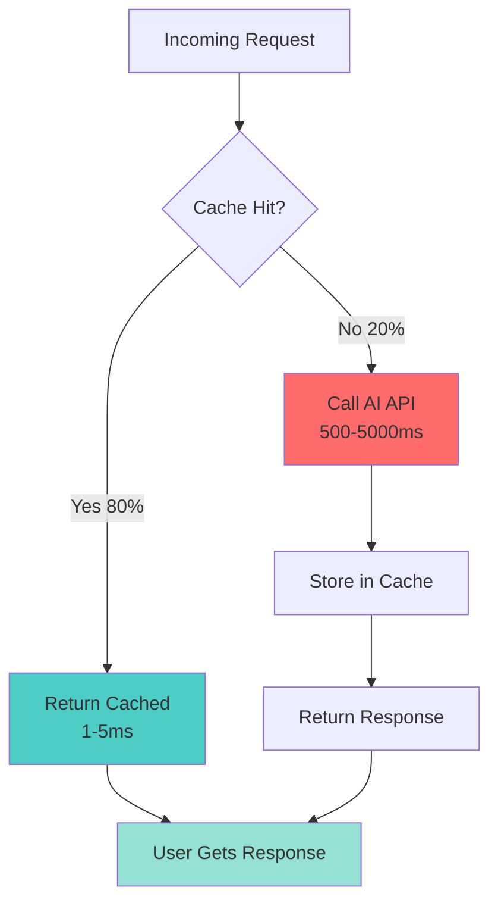

# 📘 **NODEJS AI DEVELOPER MASTERY - Lesson 20: AI Caching Strategies**

**Date**: 26-03-18
**Level**: 🟢 Beginner → 🔴 Senior Engineer
**Series**: AI Developer Fundamentals - Part 5
**Time**: 65 minutes
**Prerequisites**: Lesson 1-19 (All previous parts complete)

---

## 🎯 **LEARNING OBJECTIVES**

After completing this **comprehensive** lesson, you will:

1. ✅ **Understand AI Caching** - Why cache, what to cache, cache levels
2. ✅ **Master Redis Caching** - Setup, patterns, best practices
3. ✅ **Implement Semantic Caching** - Vector-based cache, similarity matching
4. ✅ **Build Multi-Level Cache** - L1 (memory) + L2 (Redis) + L3 (database)
5. ✅ **Handle Cache Invalidation** - TTL, tag-based, event-based invalidation
6. ✅ **Optimize Cache Performance** - Hit rates, latency, cost reduction
7. ✅ **Production Patterns** - Monitoring, warming, distributed caching

---

## 📦 **PART 1: AI CACHING FUNDAMENTALS**

### **Why Cache AI Responses?**



**Caching Benefits**:
- ✅ **90%+ Cost Reduction** - Fewer API calls
- ✅ **100x Faster** - 1-5ms vs 500-5000ms
- ✅ **Better UX** - Instant responses
- ✅ **Rate Limit Protection** - Stay under API limits
- ✅ **Offline Capability** - Serve cached responses during outages

---

### **Cache Levels**

```typescript
// ─────────────────────────────────────────────
// AI Caching Strategy Overview
// ─────────────────────────────────────────────

/**
 * LEVEL 1: EXACT MATCH CACHE
 * - Cache key: hash(prompt + parameters)
 * - Use: Identical requests
 * - Hit rate: 30-50%
 * - Latency: 1-2ms
 * 
 * LEVEL 2: SEMANTIC CACHE
 * - Cache key: vector similarity
 * - Use: Similar requests
 * - Hit rate: 60-80%
 * - Latency: 5-20ms
 * 
 * LEVEL 3: PARTIAL CACHE
 * - Cache components: embeddings, contexts
 * - Use: Reuse intermediate results
 * - Hit rate: 80-95%
 * - Latency: 10-50ms
 */
```

---

## 📦 **PART 2: REDIS CACHE IMPLEMENTATION**

### **Redis Cache Service**

```typescript
// ─────────────────────────────────────────────
// ai/cache/redis-cache.service.ts
// ─────────────────────────────────────────────
import { Injectable, Logger, Inject } from '@nestjs/common';
import { Cache, CACHE_MANAGER } from '@nestjs/cache-manager';

export interface CacheEntry<T> {
  data: T;
  createdAt: number;
  hits: number;
  tags?: string[];
}

export interface CacheStats {
  hits: number;
  misses: number;
  hitRate: number;
  size: number;
  avgLatency: number;
}

@Injectable()
export class RedisCacheService {
  private readonly logger = new Logger(RedisCacheService.name);
  private readonly stats = {
    hits: 0,
    misses: 0,
    totalLatency: 0,
    requests: 0,
  };

  constructor(
    @Inject(CACHE_MANAGER) private cacheManager: Cache,
  ) {}

  // ─────────────────────────────────────────────
  // Get from Cache
  // ─────────────────────────────────────────────
  async get<T>(key: string): Promise<T | null> {
    const startTime = Date.now();

    try {
      const value = await this.cacheManager.get<T>(key);

      if (value) {
        this.stats.hits++;
        this.logger.debug(`Cache HIT: ${key}`);
      } else {
        this.stats.misses++;
        this.logger.debug(`Cache MISS: ${key}`);
      }

      this.stats.requests++;
      this.stats.totalLatency += Date.now() - startTime;

      return value || null;
    } catch (error) {
      this.logger.error(`Cache get error: ${error.message}`);
      return null;
    }
  }

  // ─────────────────────────────────────────────
  // Set Cache with TTL
  // ─────────────────────────────────────────────
  async set<T>(
    key: string,
    value: T,
    options: {
      ttl?: number;
      tags?: string[];
    } = {},
  ): Promise<void> {
    const { ttl = 3600000, tags = [] } = options;  // Default: 1 hour

    try {
      const entry: CacheEntry<T> = {
        data: value,
        createdAt: Date.now(),
        hits: 0,
        tags,
      };

      await this.cacheManager.set(key, entry, ttl);

      // Store tags for invalidation
      if (tags.length > 0) {
        await this.storeTags(key, tags);
      }

      this.logger.debug(`Cache SET: ${key} (TTL: ${ttl}ms)`);
    } catch (error) {
      this.logger.error(`Cache set error: ${error.message}`);
    }
  }

  // ─────────────────────────────────────────────
  // Delete from Cache
  // ─────────────────────────────────────────────
  async delete(key: string): Promise<void> {
    try {
      await this.cacheManager.del(key);
      this.logger.debug(`Cache DELETE: ${key}`);
    } catch (error) {
      this.logger.error(`Cache delete error: ${error.message}`);
    }
  }

  // ─────────────────────────────────────────────
  // Invalidate by Tags
  // ─────────────────────────────────────────────
  async invalidateByTag(tag: string): Promise<number> {
    try {
      const keys = await this.getKeysByTag(tag);
      let deleted = 0;

      for (const key of keys) {
        await this.cacheManager.del(key);
        deleted++;
      }

      this.logger.log(`Invalidated ${deleted} cache entries for tag: ${tag}`);

      return deleted;
    } catch (error) {
      this.logger.error(`Cache invalidation error: ${error.message}`);
      return 0;
    }
  }

  // ─────────────────────────────────────────────
  // Cache Wrap (Get or Set)
  // ─────────────────────────────────────────────
  async wrap<T>(
    key: string,
    fetcher: () => Promise<T>,
    options: {
      ttl?: number;
      tags?: string[];
      refreshThreshold?: number;  // Refresh before expiry
    } = {},
  ): Promise<T> {
    const { ttl, tags, refreshThreshold } = options;

    // Try to get from cache
    const cached = await this.get<CacheEntry<T>>(key);

    if (cached) {
      // Update hit count
      cached.hits++;

      // Check if needs background refresh
      const age = Date.now() - cached.createdAt;
      const shouldRefresh = refreshThreshold &&
        age > (ttl - refreshThreshold);

      if (shouldRefresh) {
        // Background refresh
        this.backgroundRefresh(key, fetcher, { ttl, tags });
      }

      return cached.data;
    }

    // Cache miss - fetch and store
    const data = await fetcher();
    await this.set(key, data, { ttl, tags });

    return data;
  }

  // ─────────────────────────────────────────────
  // Background Refresh
  // ─────────────────────────────────────────────
  private async backgroundRefresh<T>(
    key: string,
    fetcher: () => Promise<T>,
    options: { ttl?: number; tags?: string[] },
  ): Promise<void> {
    // Don't await - refresh in background
    fetcher()
      .then(async (data) => {
        await this.set(key, data, options);
        this.logger.debug(`Background refresh: ${key}`);
      })
      .catch((error) => {
        this.logger.error(`Background refresh failed: ${error.message}`);
      });
  }

  // ─────────────────────────────────────────────
  // Get Cache Stats
  // ─────────────────────────────────────────────
  getStats(): CacheStats {
    const hitRate = this.stats.requests > 0
      ? (this.stats.hits / this.stats.requests) * 100
      : 0;

    const avgLatency = this.stats.requests > 0
      ? this.stats.totalLatency / this.stats.requests
      : 0;

    return {
      hits: this.stats.hits,
      misses: this.stats.misses,
      hitRate,
      size: 0,  // Would need to query Redis for actual size
      avgLatency,
    };
  }

  // ─────────────────────────────────────────────
  // Reset Stats
  // ─────────────────────────────────────────────
  resetStats(): void {
    this.stats.hits = 0;
    this.stats.misses = 0;
    this.stats.totalLatency = 0;
    this.stats.requests = 0;
  }

  // ─────────────────────────────────────────────
  // Helper: Store Tags
  // ─────────────────────────────────────────────
  private async storeTags(key: string, tags: string[]): Promise<void> {
    for (const tag of tags) {
      const tagKey = `tag:${tag}`;
      const members = await this.cacheManager.get<string[]>(tagKey) || [];

      if (!members.includes(key)) {
        members.push(key);
        await this.cacheManager.set(tagKey, members, 86400000);  // 24 hours
      }
    }
  }

  // ─────────────────────────────────────────────
  // Helper: Get Keys by Tag
  // ─────────────────────────────────────────────
  private async getKeysByTag(tag: string): Promise<string[]> {
    const tagKey = `tag:${tag}`;
    return await this.cacheManager.get<string[]>(tagKey) || [];
  }
}
```

---

## 📦 **PART 3: SEMANTIC CACHE**

### **Semantic Cache Service**

```typescript
// ─────────────────────────────────────────────
// ai/cache/semantic-cache.service.ts
// ─────────────────────────────────────────────
import { Injectable, Logger } from '@nestjs/common';
import { RedisCacheService } from './redis-cache.service';
import { EmbeddingGeneratorService } from '../embeddings/embedding-generator.service';
import { VectorMathService } from '../embeddings/vector-math.service';

export interface SemanticCacheEntry<T> {
  embedding: number[];
  data: T;
  prompt: string;
  createdAt: number;
}

export interface SemanticCacheOptions {
  similarityThreshold?: number;
  ttl?: number;
  topK?: number;
}

@Injectable()
export class SemanticCacheService {
  private readonly logger = new Logger(SemanticCacheService.name);
  private readonly DEFAULT_THRESHOLD = 0.95;

  constructor(
    private redisCache: RedisCacheService,
    private embeddingService: EmbeddingGeneratorService,
    private vectorMath: VectorMathService,
  ) {}

  // ─────────────────────────────────────────────
  // Get from Semantic Cache
  // ─────────────────────────────────────────────
  async get<T>(
    prompt: string,
    options: SemanticCacheOptions = {},
  ): Promise<T | null> {
    const {
      similarityThreshold = this.DEFAULT_THRESHOLD,
      topK = 10,
    } = options;

    try {
      // Generate embedding for query
      const queryEmbedding = await this.embeddingService.embed(prompt);

      // Get candidate cache entries
      const candidates = await this.getCacheCandidates(topK);

      if (candidates.length === 0) {
        this.logger.debug('Semantic cache: no candidates');
        return null;
      }

      // Find most similar
      const results = this.vectorMath.findNearestNeighbors(
        queryEmbedding.embedding,
        candidates.map(c => ({ vector: c.embedding, metadata: c })),
        { topK: 1, threshold: similarityThreshold },
      );

      if (results.length > 0) {
        const match = results[0];
        this.logger.log(
          `Semantic cache HIT: similarity=${match.similarity.toFixed(3)}`,
        );

        return match.metadata.data as T;
      }

      this.logger.debug('Semantic cache MISS: no match above threshold');
      return null;

    } catch (error) {
      this.logger.error(`Semantic cache error: ${error.message}`);
      return null;
    }
  }

  // ─────────────────────────────────────────────
  // Set Semantic Cache
  // ─────────────────────────────────────────────
  async set<T>(
    prompt: string,
    data: T,
    options: {
      ttl?: number;
      tags?: string[];
    } = {},
  ): Promise<void> {
    const { ttl = 3600000, tags = [] } = options;

    try {
      // Generate embedding
      const embedding = await this.embeddingService.embed(prompt);

      // Create cache key
      const cacheKey = `semantic:${this.generateKey(prompt)}`;

      // Store entry
      const entry: SemanticCacheEntry<T> = {
        embedding: embedding.embedding,
        data,
        prompt,
        createdAt: Date.now(),
      };

      await this.redisCache.set(cacheKey, entry, { ttl, tags });

      // Add to index for fast lookup
      await this.addToIndex(cacheKey, embedding.embedding);

      this.logger.debug(`Semantic cache SET: ${cacheKey}`);
    } catch (error) {
      this.logger.error(`Semantic cache set error: ${error.message}`);
    }
  }

  // ─────────────────────────────────────────────
  // Get Cache Candidates
  // ─────────────────────────────────────────────
  private async getCacheCandidates(
    topK: number,
  ): Promise<Array<{
    embedding: number[];
    data: any;
    prompt: string;
  }>> {
    // In production, use vector database (Pinecone, Qdrant, etc.)
    // For now, return recent cache entries

    // This is a simplified implementation
    // In production, you'd query a vector index
    return [];
  }

  // ─────────────────────────────────────────────
  // Add to Vector Index
  // ─────────────────────────────────────────────
  private async addToIndex(
    cacheKey: string,
    embedding: number[],
  ): Promise<void> {
    // In production, upsert to vector database
    // await this.vectorDatabase.upsert({
    //   id: cacheKey,
    //   vector: embedding,
    //   metadata: { cacheKey },
    // });
  }

  // ─────────────────────────────────────────────
  // Generate Cache Key
  // ─────────────────────────────────────────────
  private generateKey(prompt: string): string {
    const crypto = require('crypto');
    return crypto
      .createHash('md5')
      .update(prompt.toLowerCase().trim())
      .digest('hex');
  }

  // ─────────────────────────────────────────────
  // Clear Semantic Cache
  // ─────────────────────────────────────────────
  async clear(): Promise<void> {
    // Clear semantic cache index
    // await this.vectorDatabase.deleteAll();

    this.logger.log('Semantic cache cleared');
  }
}
```

---

## 📦 **PART 4: MULTI-LEVEL CACHE**

### **Multi-Level Cache Service**

```typescript
// ─────────────────────────────────────────────
// ai/cache/multi-level-cache.service.ts
// ─────────────────────────────────────────────
import { Injectable, Logger } from '@nestjs/common';
import { RedisCacheService } from './redis-cache.service';

export interface MultiLevelCacheOptions {
  l1MaxSize?: number;
  l1TTL?: number;
  l2TTL?: number;
}

@Injectable()
export class MultiLevelCacheService {
  private readonly logger = new Logger(MultiLevelCacheService.name);
  private readonly l1Cache = new Map<string, { data: any; expiry: number }>();
  private readonly l1MaxSize: number;
  private readonly l1TTL: number;
  private readonly l2TTL: number;

  constructor(
    private redisCache: RedisCacheService,
    options: MultiLevelCacheOptions = {},
  ) {
    this.l1MaxSize = options.l1MaxSize || 1000;
    this.l1TTL = options.l1TTL || 60000;  // 1 minute
    this.l2TTL = options.l2TTL || 3600000;  // 1 hour
  }

  // ─────────────────────────────────────────────
  // Get from Multi-Level Cache
  // ─────────────────────────────────────────────
  async get<T>(key: string): Promise<T | null> {
    // Level 1: In-Memory Cache (Fastest)
    const l1Result = this.getL1(key);
    if (l1Result !== null) {
      this.logger.debug(`L1 Cache HIT: ${key}`);
      return l1Result;
    }

    // Level 2: Redis Cache (Fast)
    const l2Result = await this.redisCache.get<T>(key);
    if (l2Result !== null) {
      this.logger.debug(`L2 Cache HIT: ${key}`);
      // Populate L1
      this.setL1(key, l2Result);
      return l2Result;
    }

    // Cache Miss
    this.logger.debug(`Cache MISS: ${key}`);
    return null;
  }

  // ─────────────────────────────────────────────
  // Set Multi-Level Cache
  // ─────────────────────────────────────────────
  async set<T>(
    key: string,
    value: T,
    options: {
      tags?: string[];
    } = {},
  ): Promise<void> {
    // Set L1
    this.setL1(key, value);

    // Set L2
    await this.redisCache.set(key, value, {
      ttl: this.l2TTL,
      tags: options.tags,
    });

    this.logger.debug(`Cache SET: ${key} (L1 + L2)`);
  }

  // ─────────────────────────────────────────────
  // Cache Wrap with Multi-Level
  // ─────────────────────────────────────────────
  async wrap<T>(
    key: string,
    fetcher: () => Promise<T>,
    options: {
      tags?: string[];
    } = {},
  ): Promise<T> {
    // Try cache first
    const cached = await this.get<T>(key);

    if (cached !== null) {
      return cached;
    }

    // Cache miss - fetch from source
    const data = await fetcher();

    // Store in cache
    await this.set(key, data, options);

    return data;
  }

  // ─────────────────────────────────────────────
  // Delete from All Levels
  // ─────────────────────────────────────────────
  async delete(key: string): Promise<void> {
    // Delete from L1
    this.l1Cache.delete(key);

    // Delete from L2
    await this.redisCache.delete(key);

    this.logger.debug(`Cache DELETE: ${key}`);
  }

  // ─────────────────────────────────────────────
  // Get L1 Cache
  // ─────────────────────────────────────────────
  private getL1<T>(key: string): T | null {
    const item = this.l1Cache.get(key);

    if (!item) {
      return null;
    }

    // Check expiry
    if (Date.now() > item.expiry) {
      this.l1Cache.delete(key);
      return null;
    }

    return item.data as T;
  }

  // ─────────────────────────────────────────────
  // Set L1 Cache
  // ─────────────────────────────────────────────
  private setL1(key: string, data: any): void {
    // Enforce max size (LRU eviction)
    if (this.l1Cache.size >= this.l1MaxSize) {
      // Remove oldest entry
      const firstKey = this.l1Cache.keys().next().value;
      this.l1Cache.delete(firstKey);
    }

    this.l1Cache.set(key, {
      data,
      expiry: Date.now() + this.l1TTL,
    });
  }

  // ─────────────────────────────────────────────
  // Get Cache Stats
  // ─────────────────────────────────────────────
  getStats(): {
    l1Size: number;
    l2Stats: any;
  } {
    return {
      l1Size: this.l1Cache.size,
      l2Stats: this.redisCache.getStats(),
    };
  }

  // ─────────────────────────────────────────────
  // Clear All Levels
  // ─────────────────────────────────────────────
  async clear(): Promise<void> {
    this.l1Cache.clear();
    await this.redisCache.clear();

    this.logger.log('Multi-level cache cleared');
  }
}
```

---

## 📦 **PART 5: CACHE PATTERNS**

### **AI Response Cache Pattern**

```typescript
// ─────────────────────────────────────────────
// ai/cache/ai-response-cache.service.ts
// ─────────────────────────────────────────────
import { Injectable, Logger } from '@nestjs/common';
import { MultiLevelCacheService } from './multi-level-cache.service';

@Injectable()
export class AIResponseCacheService {
  private readonly logger = new Logger(AIResponseCacheService.name);

  constructor(
    private cache: MultiLevelCacheService,
  ) {}

  // ─────────────────────────────────────────────
  // Cache AI Chat Response
  // ─────────────────────────────────────────────
  async cacheChatResponse(
    messages: Array<{ role: string; content: string }>,
    response: any,
    options: {
      model?: string;
      temperature?: number;
    } = {},
  ): Promise<void> {
    const key = this.generateChatCacheKey(messages, options);

    await this.cache.set(key, response, {
      tags: ['chat', `model:${options.model || 'default'}`],
    });

    this.logger.debug(`Cached chat response: ${key}`);
  }

  // ─────────────────────────────────────────────
  // Get Cached Chat Response
  // ─────────────────────────────────────────────
  async getCachedChatResponse(
    messages: Array<{ role: string; content: string }>,
    options: {
      model?: string;
      temperature?: number;
    } = {},
  ): Promise<any | null> {
    const key = this.generateChatCacheKey(messages, options);
    return await this.cache.get(key);
  }

  // ─────────────────────────────────────────────
  // Cache Embedding
  // ─────────────────────────────────────────────
  async cacheEmbedding(
    text: string,
    embedding: number[],
    model: string = 'default',
  ): Promise<void> {
    const key = `embedding:${model}:${this.hashText(text)}`;

    await this.cache.set(key, embedding, {
      tags: ['embedding', `model:${model}`],
    });
  }

  // ─────────────────────────────────────────────
  // Get Cached Embedding
  // ─────────────────────────────────────────────
  async getCachedEmbedding(
    text: string,
    model: string = 'default',
  ): Promise<number[] | null> {
    const key = `embedding:${model}:${this.hashText(text)}`;
    return await this.cache.get(key);
  }

  // ─────────────────────────────────────────────
  // Invalidate Model Cache
  // ─────────────────────────────────────────────
  async invalidateModelCache(model: string): Promise<void> {
    await this.cache.redisCache.invalidateByTag(`model:${model}`);
    this.logger.log(`Invalidated cache for model: ${model}`);
  }

  // ─────────────────────────────────────────────
  // Generate Chat Cache Key
  // ─────────────────────────────────────────────
  private generateChatCacheKey(
    messages: Array<{ role: string; content: string }>,
    options: any,
  ): string {
    const crypto = require('crypto');

    const keyData = {
      messages: messages.map(m => `${m.role}:${m.content}`),
      model: options.model,
      temperature: options.temperature,
    };

    const hash = crypto
      .createHash('md5')
      .update(JSON.stringify(keyData))
      .digest('hex');

    return `chat:${hash}`;
  }

  // ─────────────────────────────────────────────
  // Hash Text
  // ─────────────────────────────────────────────
  private hashText(text: string): string {
    const crypto = require('crypto');
    return crypto
      .createHash('md5')
      .update(text.toLowerCase().trim())
      .digest('hex');
  }
}
```

---

## ✅ **CACHING CHECKLIST**

```
Redis Cache
[ ] Redis connection configured
[ ] Get/set operations working
[ ] TTL management
[ ] Tag-based invalidation

Semantic Cache
[ ] Embedding generation
[ ] Similarity matching
[ ] Threshold configuration
[ ] Vector index setup

Multi-Level Cache
[ ] L1 (memory) working
[ ] L2 (Redis) working
[ ] LRU eviction
[ ] Stats tracking

Production
[ ] Cache hit monitoring
[ ] Performance metrics
[ ] Cost savings tracking
[ ] Cache warming
```

---

## 🎯 **KNOWLEDGE CHECK**

### **Question 1: Exact Match vs Semantic Cache?**

<details>
<summary>💡 Click to reveal answer</summary>

**Exact Match**:
- ✅ Fast (1-2ms)
- ✅ Simple implementation
- ❌ Only identical queries

**Semantic Cache**:
- ✅ Matches similar queries
- ✅ Higher hit rate (60-80%)
- ❌ Slower (5-20ms)
- ❌ More complex

**Best Practice**: Use both! Exact match first, then semantic!
</details>

---

### **Question 2: Cache Invalidation Strategies?**

<details>
<summary>💡 Click to reveal answer</summary>

**TTL-Based**:
- ✅ Simple, automatic
- ❌ May serve stale data

**Tag-Based**:
- ✅ Invalidate related entries
- ✅ Manual control

**Event-Based**:
- ✅ Invalidate on data changes
- ✅ Most accurate

**Production**: Use TTL + tag-based together!
</details>

---

## 📚 **ADDITIONAL RESOURCES**

- **Redis Caching**: [https://redis.io/docs/manual/client-side-caching](https://redis.io/docs/manual/client-side-caching)
- **Cache Patterns**: [https://aws.amazon.com/caching/](https://aws.amazon.com/caching/)

---

## 🎓 **HOMEWORK**

1. ✅ Set up Redis cache
2. ✅ Implement exact match cache
3. ✅ Build semantic cache
4. ✅ Create multi-level cache
5. ✅ Add cache invalidation
6. ✅ Implement cache warming
7. ✅ Track cache stats
8. ✅ Monitor hit rates

---

**Next Lesson**: AI Queue Processing (BullMQ) - Background Job Processing
**Date**: 26-03-18
**Status**: ✅ Complete

---
*26-03-18*
