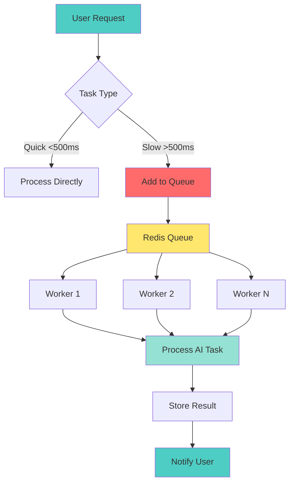

# 📘 **NODEJS AI DEVELOPER MASTERY - Lesson 21: AI Queue Processing (BullMQ)**

**Date**: 26-03-18
**Level**: 🟢 Beginner → 🔴 Senior Engineer
**Series**: AI Developer Fundamentals - Part 5
**Time**: 70 minutes
**Prerequisites**: Lesson 20 (AI Caching Strategies)

---

## 🎯 **LEARNING OBJECTIVES**

After completing this **comprehensive** lesson, you will:

1. ✅ **Understand AI Queue Patterns** - Why queue, when to queue, queue architecture
2. ✅ **Master BullMQ Setup** - Installation, configuration, connection pooling
3. ✅ **Implement AI Job Types** - Chat, embedding, image generation, batch processing
4. ✅ **Handle Job Failures** - Retries, backoff, dead letter queues
5. ✅ **Build Job Prioritization** - Priority queues, rate limiting
6. ✅ **Implement Job Monitoring** - Progress tracking, logging, metrics
7. ✅ **Production Patterns** - Scaling workers, job scheduling, flow production

---

## 📦 **PART 1: AI QUEUE ARCHITECTURE**

### **Why Queue AI Jobs?**



**Queue AI Jobs When**:
- ✅ **Long-running tasks** - >500ms processing time
- ✅ **Batch operations** - Process multiple items
- ✅ **Rate limit protection** - Control API call rate
- ✅ **Resource management** - Limit concurrent AI calls
- ✅ **Reliability** - Retry failed jobs
- ✅ **Scalability** - Add workers during peak load

---

### **Queue Architecture**

```typescript
// ─────────────────────────────────────────────
// AI Queue Types
// ─────────────────────────────────────────────

/**
 * QUEUE 1: CHAT_COMPLETION
 * - Priority: High
 * - Concurrency: 10
 * - Timeout: 30s
 * - Retries: 3
 * 
 * QUEUE 2: EMBEDDING
 * - Priority: Medium
 * - Concurrency: 20
 * - Timeout: 60s
 * - Retries: 3
 * 
 * QUEUE 3: IMAGE_GENERATION
 * - Priority: Low
 * - Concurrency: 2
 * - Timeout: 120s
 * - Retries: 2
 * 
 * QUEUE 4: BATCH_PROCESSING
 * - Priority: Low
 * - Concurrency: 1
 * - Timeout: 600s
 * - Retries: 1
 */
```

---

## 📦 **PART 2: BULLMQ SETUP**

### **Queue Module Configuration**

```typescript
// ─────────────────────────────────────────────
// ai/queue/queue.module.ts
// ─────────────────────────────────────────────
import { Module, DynamicModule } from '@nestjs/common';
import { BullModule } from '@nestjs/bullmq';
import { ConfigModule, ConfigService } from '@nestjs/config';

import { QueueService } from './queue.service';
import { ChatProcessor } from './processors/chat.processor';
import { EmbeddingProcessor } from './processors/embedding.processor';
import { ImageProcessor } from './processors/image.processor';
import { BatchProcessor } from './processors/batch.processor';

export enum QueueNames {
  CHAT = 'chat',
  EMBEDDING = 'embedding',
  IMAGE = 'image',
  BATCH = 'batch',
}

@Global()
@Module({
  providers: [],
  exports: [],
})
export class QueueModule {
  static forRoot(): DynamicModule {
    return {
      module: QueueModule,
      imports: [
        BullModule.forRootAsync({
          imports: [ConfigModule],
          useFactory: async (configService: ConfigService) => ({
            connection: {
              host: configService.get('REDIS_HOST', 'localhost'),
              port: configService.get('REDIS_PORT', 6379),
              password: configService.get('REDIS_PASSWORD'),
              db: configService.get('REDIS_DB', 0),

              // BullMQ specific settings
              maxRetriesPerRequest: null,
              retryStrategy: (times: number) => {
                if (times > 3) {
                  console.error('Redis connection failed after 3 retries');
                  return null;
                }
                return Math.min(times * 50, 2000);
              },
            },

            // Default job options
            defaultJobOptions: {
              attempts: 3,
              backoff: {
                type: 'exponential',
                delay: 2000,
              },
              removeOnComplete: {
                count: 100,
              },
              removeOnFail: {
                count: 500,
              },
            },
          }),
          inject: [ConfigService],
        }),

        // Register all queues
        BullModule.registerQueue(
          {
            name: QueueNames.CHAT,
            defaultJobOptions: {
              attempts: 3,
              backoff: { type: 'exponential', delay: 2000 },
              timeout: 30000,
              removeOnComplete: { count: 200 },
              removeOnFail: { count: 1000 },
            },
          },
          {
            name: QueueNames.EMBEDDING,
            defaultJobOptions: {
              attempts: 3,
              backoff: { type: 'exponential', delay: 1000 },
              timeout: 60000,
              removeOnComplete: { count: 500 },
              removeOnFail: { count: 2000 },
            },
          },
          {
            name: QueueNames.IMAGE,
            defaultJobOptions: {
              attempts: 2,
              backoff: { type: 'exponential', delay: 5000 },
              timeout: 120000,
              removeOnComplete: { count: 50 },
              removeOnFail: { count: 200 },
            },
          },
          {
            name: QueueNames.BATCH,
            defaultJobOptions: {
              attempts: 1,
              backoff: { type: 'fixed', delay: 10000 },
              timeout: 600000,
              removeOnComplete: { count: 20 },
              removeOnFail: { count: 50 },
            },
          },
        ),
      ],
      providers: [
        QueueService,
        ChatProcessor,
        EmbeddingProcessor,
        ImageProcessor,
        BatchProcessor,
      ],
      exports: [
        BullModule,
        QueueService,
      ],
    };
  }
}
```

---

### **Queue Service**

```typescript
// ─────────────────────────────────────────────
// ai/queue/queue.service.ts
// ─────────────────────────────────────────────
import { Injectable, Inject, Logger } from '@nestjs/common';
import { Queue } from 'bullmq';
import { InjectQueue } from '@nestjs/bullmq';
import { QueueNames } from './queue.module';

export interface ChatJobData {
  userId: string;
  messages: Array<{ role: string; content: string }>;
  options?: {
    model?: string;
    temperature?: number;
    maxTokens?: number;
  };
  webhookUrl?: string;
}

export interface EmbeddingJobData {
  userId: string;
  texts: string[];
  model?: string;
}

export interface ImageJobData {
  userId: string;
  prompt: string;
  options?: {
    size?: string;
    quality?: string;
    count?: number;
  };
}

export interface BatchJobData {
  userId: string;
  type: 'chat' | 'embedding' | 'image';
  items: any[];
  notifyOnComplete?: boolean;
}

@Injectable()
export class QueueService {
  private readonly logger = new Logger(QueueService.name);

  constructor(
    @InjectQueue(QueueNames.CHAT) private chatQueue: Queue,
    @InjectQueue(QueueNames.EMBEDDING) private embeddingQueue: Queue,
    @InjectQueue(QueueNames.IMAGE) private imageQueue: Queue,
    @InjectQueue(QueueNames.BATCH) private batchQueue: Queue,
  ) {}

  // ─────────────────────────────────────────────
  // Add Chat Job
  // ─────────────────────────────────────────────
  async addChatJob(data: ChatJobData): Promise<string> {
    const job = await this.chatQueue.add('process-chat', data, {
      jobId: `chat:${data.userId}:${Date.now()}`,
      priority: this.getPriority(data.userId),
    });

    this.logger.log(`Chat job added: ${job.id}`);
    return job.id;
  }

  // ─────────────────────────────────────────────
  // Add Embedding Job
  // ─────────────────────────────────────────────
  async addEmbeddingJob(data: EmbeddingJobData): Promise<string> {
    const job = await this.embeddingQueue.add('process-embedding', data, {
      jobId: `emb:${data.userId}:${Date.now()}`,
      priority: 5,
    });

    this.logger.log(`Embedding job added: ${job.id}`);
    return job.id;
  }

  // ─────────────────────────────────────────────
  // Add Image Job
  // ─────────────────────────────────────────────
  async addImageJob(data: ImageJobData): Promise<string> {
    const job = await this.imageQueue.add('process-image', data, {
      jobId: `img:${data.userId}:${Date.now()}`,
      priority: 10,
    });

    this.logger.log(`Image job added: ${job.id}`);
    return job.id;
  }

  // ─────────────────────────────────────────────
  // Add Batch Job
  // ─────────────────────────────────────────────
  async addBatchJob(data: BatchJobData): Promise<string> {
    const job = await this.batchQueue.add('process-batch', data, {
      jobId: `batch:${data.userId}:${Date.now()}`,
      priority: 10,
    });

    this.logger.log(`Batch job added: ${job.id} (${data.items.length} items)`);
    return job.id;
  }

  // ─────────────────────────────────────────────
  // Get Job Status
  // ─────────────────────────────────────────────
  async getJobStatus(jobId: string): Promise<{
    status: string;
    progress?: number;
    data?: any;
    failedReason?: string;
  }> {
    const queues = [
      this.chatQueue,
      this.embeddingQueue,
      this.imageQueue,
      this.batchQueue,
    ];

    for (const queue of queues) {
      const job = await queue.getJob(jobId);
      if (job) {
        const state = await job.getState();
        return {
          status: state,
          progress: job.progress,
          data: job.data,
          failedReason: job.failedReason,
        };
      }
    }

    throw new Error(`Job ${jobId} not found`);
  }

  // ─────────────────────────────────────────────
  // Cancel Job
  // ─────────────────────────────────────────────
  async cancelJob(jobId: string): Promise<void> {
    const queues = [
      this.chatQueue,
      this.embeddingQueue,
      this.imageQueue,
      this.batchQueue,
    ];

    for (const queue of queues) {
      const job = await queue.getJob(jobId);
      if (job) {
        await job.remove();
        this.logger.log(`Job cancelled: ${jobId}`);
        return;
      }
    }

    throw new Error(`Job ${jobId} not found`);
  }

  // ─────────────────────────────────────────────
  // Get Queue Stats
  // ─────────────────────────────────────────────
  async getQueueStats(): Promise<{
    [queueName: string]: {
      waiting: number;
      active: number;
      completed: number;
      failed: number;
      delayed: number;
    };
  }> {
    const stats = {};

    for (const queue of [
      this.chatQueue,
      this.embeddingQueue,
      this.imageQueue,
      this.batchQueue,
    ]) {
      const name = queue.name;
      stats[name] = {
        waiting: await queue.getWaitingCount(),
        active: await queue.getActiveCount(),
        completed: await queue.getCompletedCount(),
        failed: await queue.getFailedCount(),
        delayed: await queue.getDelayedCount(),
      };
    }

    return stats;
  }

  // ─────────────────────────────────────────────
  // Helper: Get Priority by User
  // ─────────────────────────────────────────────
  private getPriority(userId: string): number {
    // Premium users get higher priority
    // In production, fetch from database
    const premiumUsers = ['user1', 'user2'];
    return premiumUsers.includes(userId) ? 1 : 5;
  }

  // ─────────────────────────────────────────────
  // Clean Old Jobs
  // ─────────────────────────────────────────────
  async cleanOldJobs(days: number = 7): Promise<void> {
    const cutoff = Date.now() - (days * 24 * 60 * 60 * 1000);

    for (const queue of [
      this.chatQueue,
      this.embeddingQueue,
      this.imageQueue,
      this.batchQueue,
    ]) {
      await queue.clean(cutoff, 1000, 'completed');
      await queue.clean(cutoff, 1000, 'failed');
    }

    this.logger.log(`Cleaned jobs older than ${days} days`);
  }
}
```

---

## 📦 **PART 3: JOB PROCESSORS**

### **Chat Processor**

```typescript
// ─────────────────────────────────────────────
// ai/queue/processors/chat.processor.ts
// ─────────────────────────────────────────────
import { Process, Processor } from '@nestjs/bullmq';
import { Job } from 'bullmq';
import { Logger } from '@nestjs/common';
import { QueueNames } from '../queue.module';
import { ChatJobData } from '../queue.service';
import { ChatService } from '../../chat/chat.service';

@Processor(QueueNames.CHAT)
export class ChatProcessor {
  private readonly logger = new Logger(ChatProcessor.name);

  constructor(
    private chatService: ChatService,
  ) {}

  @Process('process-chat')
  async processChatJob(job: Job<ChatJobData>): Promise<any> {
    const { userId, messages, options, webhookUrl } = job.data;

    this.logger.log(
      `Processing chat job ${job.id} for user ${userId}`,
    );

    try {
      // Update progress
      await job.updateProgress(10);

      // Validate input
      if (!messages || messages.length === 0) {
        throw new Error('No messages provided');
      }

      await job.updateProgress(30);

      // Call AI service
      const response = await this.chatService.complete(messages, {
        model: options?.model,
        temperature: options?.temperature,
        maxTokens: options?.maxTokens,
        user: userId,
      });

      await job.updateProgress(80);

      // Store result (in production, save to database)
      const result = {
        response,
        timestamp: new Date().toISOString(),
        userId,
      };

      await job.updateProgress(100);

      this.logger.log(`Chat job ${job.id} completed successfully`);

      // Send webhook if provided
      if (webhookUrl) {
        await this.sendWebhook(webhookUrl, result);
      }

      return result;

    } catch (error) {
      this.logger.error(
        `Chat job ${job.id} failed: ${error.message}`,
        error.stack,
      );

      // Update job with error info
      await job.updateProgress(-1);

      throw error;  // BullMQ will retry based on configuration
    }
  }

  // ─────────────────────────────────────────────
  // Send Webhook
  // ─────────────────────────────────────────────
  private async sendWebhook(url: string, data: any): Promise<void> {
    try {
      await fetch(url, {
        method: 'POST',
        headers: { 'Content-Type': 'application/json' },
        body: JSON.stringify(data),
      });
      this.logger.log(`Webhook sent to ${url}`);
    } catch (error) {
      this.logger.error(`Webhook failed: ${error.message}`);
    }
  }
}
```

---

### **Embedding Processor (Batch)**

```typescript
// ─────────────────────────────────────────────
// ai/queue/processors/embedding.processor.ts
// ─────────────────────────────────────────────
import { Process, Processor } from '@nestjs/bullmq';
import { Job } from 'bullmq';
import { Logger } from '@nestjs/common';
import { QueueNames } from '../queue.module';
import { EmbeddingJobData } from '../queue.service';
import { EmbeddingGeneratorService } from '../../embeddings/embedding-generator.service';

@Processor(QueueNames.EMBEDDING)
export class EmbeddingProcessor {
  private readonly logger = new Logger(EmbeddingProcessor.name);

  constructor(
    private embeddingService: EmbeddingGeneratorService,
  ) {}

  @Process('process-embedding')
  async processEmbeddingJob(job: Job<EmbeddingJobData>): Promise<any> {
    const { userId, texts, model } = job.data;

    this.logger.log(
      `Processing embedding job ${job.id} for user ${userId} (${texts.length} texts)`,
    );

    try {
      // Process in batches
      const batchSize = 100;
      const embeddings: number[][] = [];
      let processed = 0;

      for (let i = 0; i < texts.length; i += batchSize) {
        const batch = texts.slice(i, i + batchSize);

        await job.updateProgress((processed / texts.length) * 100);

        const batchEmbeddings = await this.embeddingService.embedBatch(batch);

        embeddings.push(...batchEmbeddings.map(e => e.embedding));

        processed += batch.length;

        this.logger.log(
          `Processed batch ${Math.ceil((i + 1) / batchSize)} of ${Math.ceil(texts.length / batchSize)}`,
        );
      }

      await job.updateProgress(100);

      this.logger.log(
        `Embedding job ${job.id} completed: ${embeddings.length} embeddings`,
      );

      return {
        embeddings,
        count: embeddings.length,
        timestamp: new Date().toISOString(),
      };

    } catch (error) {
      this.logger.error(
        `Embedding job ${job.id} failed: ${error.message}`,
        error.stack,
      );
      throw error;
    }
  }
}
```

---

### **Image Processor**

```typescript
// ─────────────────────────────────────────────
// ai/queue/processors/image.processor.ts
// ─────────────────────────────────────────────
import { Process, Processor } from '@nestjs/bullmq';
import { Job } from 'bullmq';
import { Logger } from '@nestjs/common';
import { QueueNames } from '../queue.module';
import { ImageJobData } from '../queue.service';
import { ImageService } from '../../image/image.service';

@Processor(QueueNames.IMAGE)
export class ImageProcessor {
  private readonly logger = new Logger(ImageProcessor.name);

  constructor(
    private imageService: ImageService,
  ) {}

  @Process('process-image')
  async processImageJob(job: Job<ImageJobData>): Promise<any> {
    const { userId, prompt, options } = job.data;

    this.logger.log(
      `Processing image job ${job.id} for user ${userId}`,
    );

    try {
      await job.updateProgress(20);

      // Generate image(s)
      const count = options?.count || 1;
      const images = [];

      for (let i = 0; i < count; i++) {
        await job.updateProgress(20 + ((i / count) * 70));

        const image = await this.imageService.generate(prompt, {
          size: options?.size as any,
          quality: options?.quality as any,
        });

        images.push(image);
      }

      await job.updateProgress(100);

      this.logger.log(`Image job ${job.id} completed: ${images.length} images`);

      return {
        images,
        count: images.length,
        timestamp: new Date().toISOString(),
      };

    } catch (error) {
      this.logger.error(
        `Image job ${job.id} failed: ${error.message}`,
        error.stack,
      );
      throw error;
    }
  }
}
```

---

## 📦 **PART 4: ADVANCED QUEUE PATTERNS**

### **Flow Producer (Multi-Step Jobs)**

```typescript
// ─────────────────────────────────────────────
// ai/queue/flow-producer.service.ts
// ─────────────────────────────────────────────
import { Injectable, Logger } from '@nestjs/common';
import { FlowProducer, Queue } from 'bullmq';
import { InjectQueue } from '@nestjs/bullmq';
import { QueueNames } from './queue.module';

@Injectable()
export class FlowProducerService {
  private readonly logger = new Logger(FlowProducerService.name);
  private flowProducer: FlowProducer;

  constructor(
    @InjectQueue(QueueNames.CHAT) private chatQueue: Queue,
    @InjectQueue(QueueNames.EMBEDDING) private embeddingQueue: Queue,
  ) {
    this.flowProducer = new FlowProducer({
      connection: {
        host: process.env.REDIS_HOST || 'localhost',
        port: parseInt(process.env.REDIS_PORT || '6379'),
      },
    });
  }

  // ─────────────────────────────────────────────
  // Create RAG Flow (Multi-Step)
  // ─────────────────────────────────────────────
  async createRAGFlow(data: {
    userId: string;
    query: string;
    documents: string[];
  }): Promise<any> {
    const flow = await this.flowProducer.add({
      name: 'rag-flow',
      queueName: QueueNames.EMBEDDING,
      data: { userId: data.userId },

      children: [
        {
          name: 'embed-documents',
          queueName: QueueNames.EMBEDDING,
          data: {
            userId: data.userId,
            texts: data.documents,
          },
          children: [
            {
              name: 'validate-documents',
              queueName: QueueNames.EMBEDDING,
              data: { documents: data.documents },
            },
          ],
        },
        {
          name: 'embed-query',
          queueName: QueueNames.EMBEDDING,
          data: {
            userId: data.userId,
            texts: [data.query],
          },
        },
      ],
    });

    this.logger.log(`RAG flow created: ${flow.job.id}`);

    return flow;
  }

  // ─────────────────────────────────────────────
  // Close Flow Producer
  // ─────────────────────────────────────────────
  async close(): Promise<void> {
    await this.flowProducer.close();
  }
}
```

---

### **Event Listener**

```typescript
// ─────────────────────────────────────────────
// ai/queue/queue-events.service.ts
// ─────────────────────────────────────────────
import { Injectable, Logger, OnModuleInit } from '@nestjs/common';
import { QueueEvents, QueueEventsListener } from 'bullmq';
import { InjectQueue } from '@nestjs/bullmq';
import { QueueNames } from './queue.module';

@Injectable()
export class QueueEventsService implements OnModuleInit {
  private readonly logger = new Logger(QueueEventsService.name);
  private queueEvents: Map<string, QueueEvents>;

  constructor(
    @InjectQueue(QueueNames.CHAT) private chatQueue: Queue,
    @InjectQueue(QueueNames.EMBEDDING) private embeddingQueue: Queue,
    @InjectQueue(QueueNames.IMAGE) private imageQueue: Queue,
    @InjectQueue(QueueNames.BATCH) private batchQueue: Queue,
  ) {
    this.queueEvents = new Map();
  }

  async onModuleInit() {
    this.setupQueueEvents();
  }

  private setupQueueEvents() {
    const queues = [
      { name: QueueNames.CHAT, queue: this.chatQueue },
      { name: QueueNames.EMBEDDING, queue: this.embeddingQueue },
      { name: QueueNames.IMAGE, queue: this.imageQueue },
      { name: QueueNames.BATCH, queue: this.batchQueue },
    ];

    for (const { name, queue } of queues) {
      const events = new QueueEvents(name, {
        connection: queue.opts.connection,
      });

      events.on('completed', ({ jobId, returnvalue }) => {
        this.logger.log(
          `Job completed: ${jobId} in queue ${name}`,
        );
      });

      events.on('failed', ({ jobId, failedReason }) => {
        this.logger.error(
          `Job failed: ${jobId} in queue ${name}: ${failedReason}`,
        );
      });

      events.on('stalled', ({ jobId }) => {
        this.logger.warn(
          `Job stalled: ${jobId} in queue ${name}`,
        );
      });

      this.queueEvents.set(name, events);
    }
  }

  async onModuleDestroy() {
    for (const events of this.queueEvents.values()) {
      await events.close();
    }
  }
}
```

---

## ✅ **QUEUE CHECKLIST**

```
Queue Setup
[ ] BullMQ installed
[ ] Redis connection configured
[ ] Queues registered
[ ] Processors created

Job Processing
[ ] Chat processor working
[ ] Embedding processor
[ ] Image processor
[ ] Batch processor

Error Handling
[ ] Retry logic configured
[ ] Backoff strategies
[ ] Dead letter queue
[ ] Error logging

Monitoring
[ ] Queue stats tracking
[ ] Job progress
[ ] Event listeners
[ ] Alerts configured

Production
[ ] Worker scaling
[ ] Rate limiting
[ ] Job prioritization
[ ] Cleanup jobs
```

---

## 🎯 **KNOWLEDGE CHECK**

### **Question 1: Why Queue AI Jobs?**

<details>
<summary>💡 Click to reveal answer</summary>

**Reasons**:
1. ✅ **Long-running tasks** - Don't block HTTP requests
2. ✅ **Rate limiting** - Control API call rate
3. ✅ **Reliability** - Automatic retries
4. ✅ **Scalability** - Add workers during peak
5. ✅ **Resource management** - Limit concurrent calls
6. ✅ **User experience** - Return immediately, notify later
</details>

---

### **Question 2: Retry Backoff Strategies?**

<details>
<summary>💡 Click to reveal answer</summary>

**Exponential Backoff**:
- Delay: 2s, 4s, 8s, 16s...
- ✅ Good for transient errors
- ✅ Reduces load on failing services

**Fixed Backoff**:
- Delay: 5s, 5s, 5s...
- ✅ Predictable timing
- ❌ May overwhelm recovering services

**Production**: Use exponential with jitter!
</details>

---

## 📚 **ADDITIONAL RESOURCES**

- **BullMQ Docs**: [https://docs.bullmq.io](https://docs.bullmq.io)
- **Queue Patterns**: [https://docs.bullmq.io/guide/jobs/flow-jobs](https://docs.bullmq.io/guide/jobs/flow-jobs)

---

## 🎓 **HOMEWORK**

1. ✅ Set up BullMQ queues
2. ✅ Create chat processor
3. ✅ Create embedding processor
4. ✅ Implement retry logic
5. ✅ Add job progress tracking
6. ✅ Set up queue events
7. ✅ Create flow producer
8. ✅ Monitor queue stats

---

**Next Lesson**: AI Rate Limiting & Quotas - Multi-Tenant Usage Management
**Date**: 26-03-18
**Status**: ✅ Complete

---
*26-03-18*
