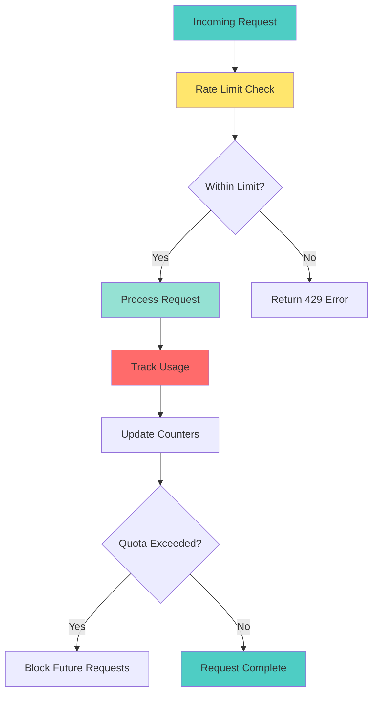

# 📘 **NODEJS AI DEVELOPER MASTERY - Lesson 22: AI Rate Limiting & Quotas**

**Date**: 26-03-18
**Level**: 🟢 Beginner → 🔴 Senior Engineer
**Series**: AI Developer Fundamentals - Part 5
**Time**: 60 minutes
**Prerequisites**: Lesson 21 (AI Queue Processing)

---

## 🎯 **LEARNING OBJECTIVES**

After completing this **comprehensive** lesson, you will:

1. ✅ **Understand Rate Limiting** - Why limit, strategies, algorithms
2. ✅ **Implement Multi-Level Limits** - Per-user, per-endpoint, global limits
3. ✅ **Build Quota Management** - Daily, monthly, custom quotas
4. ✅ **Track Usage in Real-Time** - Token tracking, cost calculation
5. ✅ **Implement Tiered Limits** - Free, pro, enterprise tiers
6. ✅ **Build Usage Analytics** - Dashboards, alerts, reporting
7. ✅ **Production Patterns** - Billing integration, overage handling

---

## 📦 **PART 1: RATE LIMITING STRATEGIES**

### **Rate Limiting Architecture**



**Rate Limiting Levels**:
- ✅ **Global Limit** - Protect entire system
- ✅ **Per-User Limit** - Fair usage per user
- ✅ **Per-Endpoint Limit** - Different limits per operation
- ✅ **Per-Model Limit** - Control expensive model usage
- ✅ **Time-Window Limit** - Per minute, hour, day, month

---

## 📦 **PART 2: RATE LIMIT SERVICE**

### **Multi-Level Rate Limiter**

```typescript
// ─────────────────────────────────────────────
// ai/rate-limit/rate-limit.service.ts
// ─────────────────────────────────────────────
import { Injectable, Logger, Inject } from '@nestjs/common';
import { Cache, CACHE_MANAGER } from '@nestjs/cache-manager';

export interface RateLimitResult {
  allowed: boolean;
  remaining: number;
  limit: number;
  resetAt: number;
  retryAfter?: number;
}

export interface RateLimitConfig {
  key: string;
  limits: Array<{
    maxRequests: number;
    windowMs: number;
  }>;
}

@Injectable()
export class RateLimitService {
  private readonly logger = new Logger(RateLimitService.name);

  constructor(
    @Inject(CACHE_MANAGER) private cacheManager: Cache,
  ) {}

  // ─────────────────────────────────────────────
  // Check Rate Limit (Multi-Window)
  // ─────────────────────────────────────────────
  async checkLimit(
    key: string,
    limits: Array<{
      maxRequests: number;
      windowMs: number;
    }>,
  ): Promise<RateLimitResult> {
    const now = Date.now();

    // Check all limits (e.g., per-minute AND per-hour)
    for (const limit of limits) {
      const result = await this.checkSingleLimit(key, limit.maxRequests, limit.windowMs, now);

      if (!result.allowed) {
        return {
          allowed: false,
          remaining: 0,
          limit: limit.maxRequests,
          resetAt: result.resetAt,
          retryAfter: Math.ceil((result.resetAt - now) / 1000),
        };
      }
    }

    // All limits passed - increment counters
    for (const limit of limits) {
      await this.incrementCounter(key, limit.maxRequests, limit.windowMs, now);
    }

    // Return most restrictive remaining
    const mostRestrictive = await this.getMostRestrictiveRemaining(key, limits, now);

    return {
      allowed: true,
      remaining: mostRestrictive.remaining,
      limit: mostRestrictive.limit,
      resetAt: mostRestrictive.resetAt,
    };
  }

  // ─────────────────────────────────────────────
  // Check Single Limit
  // ─────────────────────────────────────────────
  private async checkSingleLimit(
    key: string,
    maxRequests: number,
    windowMs: number,
    now: number,
  ): Promise<{
    allowed: boolean;
    resetAt: number;
  }> {
    const windowKey = `${key}:window:${Math.floor(now / windowMs)}`;
    const count = await this.cacheManager.get<number>(windowKey) || 0;

    const resetAt = (Math.floor(now / windowMs) + 1) * windowMs;

    return {
      allowed: count < maxRequests,
      resetAt,
    };
  }

  // ─────────────────────────────────────────────
  // Increment Counter
  // ─────────────────────────────────────────────
  private async incrementCounter(
    key: string,
    maxRequests: number,
    windowMs: number,
    now: number,
  ): Promise<void> {
    const windowKey = `${key}:window:${Math.floor(now / windowMs)}`;
    const ttl = windowMs + 1000;  // Add 1 second buffer

    const current = await this.cacheManager.get<number>(windowKey) || 0;
    await this.cacheManager.set(windowKey, current + 1, ttl);
  }

  // ─────────────────────────────────────────────
  // Get Most Restrictive Remaining
  // ─────────────────────────────────────────────
  private async getMostRestrictiveRemaining(
    key: string,
    limits: Array<{ maxRequests: number; windowMs: number }>,
    now: number,
  ): Promise<{
    remaining: number;
    limit: number;
    resetAt: number;
  }> {
    let mostRestrictive = {
      remaining: Infinity,
      limit: 0,
      resetAt: 0,
    };

    for (const limit of limits) {
      const windowKey = `${key}:window:${Math.floor(now / limit.windowMs)}`;
      const count = await this.cacheManager.get<number>(windowKey) || 0;
      const remaining = limit.maxRequests - count;
      const resetAt = (Math.floor(now / limit.windowMs) + 1) * limit.windowMs;

      if (remaining < mostRestrictive.remaining) {
        mostRestrictive = { remaining, limit: limit.maxRequests, resetAt };
      }
    }

    return mostRestrictive;
  }

  // ─────────────────────────────────────────────
  // Get Default Limits by Tier
  // ─────────────────────────────────────────────
  getLimitsByTier(tier: 'free' | 'pro' | 'enterprise'): {
    perMinute: number;
    perHour: number;
    perDay: number;
    perMonth: number;
  } {
    const tiers = {
      free: {
        perMinute: 10,
        perHour: 100,
        perDay: 1000,
        perMonth: 10000,
      },
      pro: {
        perMinute: 60,
        perHour: 1000,
        perDay: 10000,
        perMonth: 200000,
      },
      enterprise: {
        perMinute: 300,
        perHour: 5000,
        perDay: 50000,
        perMonth: 1000000,
      },
    };

    return tiers[tier];
  }

  // ─────────────────────────────────────────────
  // Get Limits by Endpoint
  // ─────────────────────────────────────────────
  getEndpointLimits(endpoint: string): {
    perMinute: number;
    perHour: number;
  } {
    const endpoints: Record<string, { perMinute: number; perHour: number }> = {
      '/chat': { perMinute: 60, perHour: 1000 },
      '/embedding': { perMinute: 100, perHour: 2000 },
      '/image': { perMinute: 10, perHour: 100 },
      '/batch': { perMinute: 5, perHour: 50 },
    };

    return endpoints[endpoint] || { perMinute: 60, perHour: 1000 };
  }
}
```

---

### **Rate Limit Guard**

```typescript
// ─────────────────────────────────────────────
// ai/rate-limit/rate-limit.guard.ts
// ─────────────────────────────────────────────
import {
  Injectable,
  CanActivate,
  ExecutionContext,
  TooManyRequestsException,
  Logger,
} from '@nestjs/common';
import { Reflector } from '@nestjs/core';
import { RateLimitService } from './rate-limit.service';

export const RATE_LIMIT_KEY = 'rate_limit';

export function RateLimit(limits: {
  perMinute?: number;
  perHour?: number;
  perDay?: number;
}) {
  return SetMetadata(RATE_LIMIT_KEY, limits);
}

@Injectable()
export class RateLimitGuard implements CanActivate {
  private readonly logger = new Logger(RateLimitGuard.name);

  constructor(
    private reflector: Reflector,
    private rateLimitService: RateLimitService,
  ) {}

  async canActivate(context: ExecutionContext): Promise<boolean> {
    const request = context.switchToHttp().getRequest();
    const response = context.switchToHttp().getResponse();
    const handler = context.getHandler();

    // Get rate limit from decorator or use default
    const limits = this.reflector.get(RATE_LIMIT_KEY, handler) ||
      this.rateLimitService.getEndpointLimits(request.route?.path || '');

    // Generate key
    const key = this.generateKey(request);

    // Build limits array
    const limitsArray: Array<{ maxRequests: number; windowMs: number }> = [];

    if (limits.perMinute) {
      limitsArray.push({ maxRequests: limits.perMinute, windowMs: 60000 });
    }
    if (limits.perHour) {
      limitsArray.push({ maxRequests: limits.perHour, windowMs: 3600000 });
    }
    if (limits.perDay) {
      limitsArray.push({ maxRequests: limits.perDay, windowMs: 86400000 });
    }

    // Check rate limit
    const result = await this.rateLimitService.checkLimit(key, limitsArray);

    // Set rate limit headers
    this.setRateLimitHeaders(response, result);

    if (!result.allowed) {
      this.logger.warn(
        `Rate limit exceeded for ${key}: ${result.remaining}/${result.limit}`,
      );

      throw new TooManyRequestsException({
        code: 'RATE_LIMIT_EXCEEDED',
        message: 'Too many AI requests. Please slow down.',
        retryAfter: result.retryAfter,
        limit: result.limit,
        remaining: result.remaining,
        resetAt: new Date(result.resetAt).toISOString(),
      });
    }

    return true;
  }

  // ─────────────────────────────────────────────
  // Generate Rate Limit Key
  // ─────────────────────────────────────────────
  private generateKey(request: any): string {
    const userId = request.user?.id || request.headers['x-user-id'];
    const ip = request.ip || request.connection?.remoteAddress;
    const endpoint = request.route?.path || 'unknown';

    if (userId) {
      return `ratelimit:user:${userId}:${endpoint}`;
    }

    return `ratelimit:ip:${ip}:${endpoint}`;
  }

  // ─────────────────────────────────────────────
  // Set Rate Limit Headers
  // ─────────────────────────────────────────────
  private setRateLimitHeaders(response: any, result: any): void {
    response.setHeader('X-RateLimit-Limit', result.limit);
    response.setHeader('X-RateLimit-Remaining', result.remaining);
    response.setHeader('X-RateLimit-Reset', new Date(result.resetAt).toISOString());

    if (result.retryAfter) {
      response.setHeader('Retry-After', result.retryAfter.toString());
    }
  }
}
```

---

## 📦 **PART 3: QUOTA MANAGEMENT**

### **Quota Service**

```typescript
// ─────────────────────────────────────────────
// ai/quota/quota.service.ts
// ─────────────────────────────────────────────
import { Injectable, Logger } from '@nestjs/common';

export interface UserQuota {
  userId: string;
  tier: 'free' | 'pro' | 'enterprise';
  usage: {
    tokens: number;
    requests: number;
    cost: number;
  };
  limits: {
    monthlyTokens: number;
    monthlyRequests: number;
    monthlyBudget: number;
  };
  period: {
    start: Date;
    end: Date;
  };
}

export interface UsageRecord {
  userId: string;
  timestamp: Date;
  tokens: number;
  requests: number;
  cost: number;
  endpoint: string;
  model: string;
}

@Injectable()
export class QuotaService {
  private readonly logger = new Logger(QuotaService.name);
  private readonly usageCache = new Map<string, UsageRecord[]>();
  private readonly quotas = new Map<string, UserQuota>();

  // ─────────────────────────────────────────────
  // Check Quota
  // ─────────────────────────────────────────────
  async checkQuota(
    userId: string,
    estimatedTokens: number,
    estimatedCost: number,
  ): Promise<{
    allowed: boolean;
    remaining: {
      tokens: number;
      requests: number;
      budget: number;
    };
    reason?: string;
  }> {
    const quota = await this.getUserQuota(userId);

    if (!quota) {
      return {
        allowed: true,
        remaining: { tokens: Infinity, requests: Infinity, budget: Infinity },
      };
    }

    const remaining = {
      tokens: quota.limits.monthlyTokens - quota.usage.tokens,
      requests: quota.limits.monthlyRequests - quota.usage.requests,
      budget: quota.limits.monthlyBudget - quota.usage.cost,
    };

    // Check token quota
    if (remaining.tokens < estimatedTokens) {
      return {
        allowed: false,
        remaining,
        reason: `Token quota exceeded. Used: ${quota.usage.tokens}/${quota.limits.monthlyTokens}`,
      };
    }

    // Check request quota
    if (remaining.requests < 1) {
      return {
        allowed: false,
        remaining,
        reason: `Request quota exceeded. Used: ${quota.usage.requests}/${quota.limits.monthlyRequests}`,
      };
    }

    // Check budget
    if (remaining.budget < estimatedCost) {
      return {
        allowed: false,
        remaining,
        reason: `Budget exceeded. Used: $${quota.usage.cost.toFixed(2)}/$${quota.limits.monthlyBudget.toFixed(2)}`,
      };
    }

    return {
      allowed: true,
      remaining,
    };
  }

  // ─────────────────────────────────────────────
  // Track Usage
  // ─────────────────────────────────────────────
  async trackUsage(record: UsageRecord): Promise<void> {
    // Store in cache
    const key = `usage:${record.userId}:${new Date().toISOString().split('T')[0]}`;
    const todayUsage = this.usageCache.get(key) || [];
    todayUsage.push(record);
    this.usageCache.set(key, todayUsage);

    // Update quota
    const quota = await this.getUserQuota(record.userId);
    if (quota) {
      quota.usage.tokens += record.tokens;
      quota.usage.requests += record.requests;
      quota.usage.cost += record.cost;

      this.quotas.set(record.userId, quota);

      // Check if approaching limit
      const usagePercent = (quota.usage.tokens / quota.limits.monthlyTokens) * 100;

      if (usagePercent >= 80 && usagePercent < 90) {
        this.logger.warn(
          `User ${record.userId} at ${usagePercent.toFixed(1)}% of quota`,
        );
        // Send warning notification
      }

      if (usagePercent >= 90) {
        this.logger.error(
          `User ${record.userId} at ${usagePercent.toFixed(1)}% of quota - critical!`,
        );
        // Send critical notification
      }
    }
  }

  // ─────────────────────────────────────────────
  // Get User Quota
  // ─────────────────────────────────────────────
  async getUserQuota(userId: string): Promise<UserQuota | null> {
    // Check cache first
    if (this.quotas.has(userId)) {
      return this.quotas.get(userId);
    }

    // In production, fetch from database
    // For now, return default quota
    const defaultQuota: UserQuota = {
      userId,
      tier: 'free',
      usage: { tokens: 0, requests: 0, cost: 0 },
      limits: {
        monthlyTokens: 100000,
        monthlyRequests: 1000,
        monthlyBudget: 10,
      },
      period: {
        start: new Date(new Date().getFullYear(), new Date().getMonth(), 1),
        end: new Date(new Date().getFullYear(), new Date().getMonth() + 1, 0),
      },
    };

    this.quotas.set(userId, defaultQuota);

    return defaultQuota;
  }

  // ─────────────────────────────────────────────
  // Get Usage Report
  // ─────────────────────────────────────────────
  async getUsageReport(
    userId: string,
    period: { start: Date; end: Date },
  ): Promise<{
    totalTokens: number;
    totalRequests: number;
    totalCost: number;
    dailyBreakdown: Array<{
      date: string;
      tokens: number;
      requests: number;
      cost: number;
    }>;
  }> {
    const dailyBreakdown: Array<{
      date: string;
      tokens: number;
      requests: number;
      cost: number;
    }> = [];

    let totalTokens = 0;
    let totalRequests = 0;
    let totalCost = 0;

    // Aggregate from cache (in production, query database)
    for (const [key, records] of this.usageCache.entries()) {
      if (key.startsWith(`usage:${userId}:`)) {
        const date = key.split(':')[2];
        const dayTokens = records.reduce((sum, r) => sum + r.tokens, 0);
        const dayRequests = records.reduce((sum, r) => sum + r.requests, 0);
        const dayCost = records.reduce((sum, r) => sum + r.cost, 0);

        dailyBreakdown.push({
          date,
          tokens: dayTokens,
          requests: dayRequests,
          cost: dayCost,
        });

        totalTokens += dayTokens;
        totalRequests += dayRequests;
        totalCost += dayCost;
      }
    }

    dailyBreakdown.sort((a, b) => a.date.localeCompare(b.date));

    return {
      totalTokens,
      totalRequests,
      totalCost,
      dailyBreakdown,
    };
  }

  // ─────────────────────────────────────────────
  // Reset Quota (for testing or manual override)
  // ─────────────────────────────────────────────
  async resetQuota(userId: string): Promise<void> {
    const quota = await this.getUserQuota(userId);

    if (quota) {
      quota.usage = { tokens: 0, requests: 0, cost: 0 };
      this.quotas.set(userId, quota);

      this.logger.log(`Quota reset for user ${userId}`);
    }
  }

  // ─────────────────────────────────────────────
  // Update User Tier
  // ─────────────────────────────────────────────
  async updateTier(userId: string, tier: 'free' | 'pro' | 'enterprise'): Promise<void> {
    const quota = await this.getUserQuota(userId);

    if (quota) {
      quota.tier = tier;

      // Update limits based on tier
      const limits = {
        free: { monthlyTokens: 100000, monthlyRequests: 1000, monthlyBudget: 10 },
        pro: { monthlyTokens: 2000000, monthlyRequests: 20000, monthlyBudget: 100 },
        enterprise: { monthlyTokens: 100000000, monthlyRequests: 1000000, monthlyBudget: 5000 },
      };

      quota.limits = limits[tier];

      this.quotas.set(userId, quota);

      this.logger.log(`User ${userId} tier updated to ${tier}`);
    }
  }
}
```

---

## 📦 **PART 4: USAGE TRACKING**

### **Token Usage Interceptor**

```typescript
// ─────────────────────────────────────────────
// ai/quota/token-usage.interceptor.ts
// ─────────────────────────────────────────────
import {
  Injectable,
  NestInterceptor,
  ExecutionContext,
  CallHandler,
} from '@nestjs/common';
import { Observable, tap } from 'rxjs';
import { QuotaService } from './quota.service';

@Injectable()
export class TokenUsageInterceptor implements NestInterceptor {
  constructor(
    private quotaService: QuotaService,
  ) {}

  intercept(
    context: ExecutionContext,
    next: CallHandler,
  ): Observable<any> {
    const request = context.switchToHttp().getRequest();
    const userId = request.user?.id || 'anonymous';
    const endpoint = request.route?.path || 'unknown';
    const model = request.body?.model || 'unknown';

    return next.handle().pipe(
      tap((response) => {
        // Extract token usage from response
        const usage = this.extractUsage(response);

        if (usage) {
          // Track usage
          this.quotaService.trackUsage({
            userId,
            timestamp: new Date(),
            tokens: usage.tokens,
            requests: 1,
            cost: usage.cost,
            endpoint,
            model,
          });
        }
      }),
    );
  }

  // ─────────────────────────────────────────────
  // Extract Usage from Response
  // ─────────────────────────────────────────────
  private extractUsage(response: any): { tokens: number; cost: number } | null {
    // Check for usage in response
    if (response?.usage?.total_tokens) {
      return {
        tokens: response.usage.total_tokens,
        cost: this.calculateCost(response.usage, response.model),
      };
    }

    // Check nested usage
    if (response?.data?.usage?.total_tokens) {
      return {
        tokens: response.data.usage.total_tokens,
        cost: this.calculateCost(response.data.usage, response.data.model),
      };
    }

    return null;
  }

  // ─────────────────────────────────────────────
  // Calculate Cost
  // ─────────────────────────────────────────────
  private calculateCost(usage: any, model: string): number {
    const promptTokens = usage.prompt_tokens || 0;
    const completionTokens = usage.completion_tokens || 0;

    const pricing: Record<string, { prompt: number; completion: number }> = {
      'gpt-4-turbo': { prompt: 0.01, completion: 0.03 },
      'gpt-4': { prompt: 0.03, completion: 0.06 },
      'gpt-3.5-turbo': { prompt: 0.0005, completion: 0.0015 },
    };

    const modelPricing = pricing[model] || pricing['gpt-3.5-turbo'];

    return (
      (promptTokens / 1000) * modelPricing.prompt +
      (completionTokens / 1000) * modelPricing.completion
    );
  }
}
```

---

## ✅ **RATE LIMITING & QUOTA CHECKLIST**

```
Rate Limiting
[ ] Multi-window limits
[ ] Per-user limits
[ ] Per-endpoint limits
[ ] Tier-based limits

Quota Management
[ ] Monthly quotas
[ ] Token tracking
[ ] Cost tracking
[ ] Warning notifications

Usage Tracking
[ ] Real-time tracking
[ ] Daily breakdown
[ ] Cost calculation
[ ] Usage reports

Production
[ ] Database integration
[ ] Billing integration
[ ] Overage handling
[ ] Analytics dashboard
```

---

## 🎯 **KNOWLEDGE CHECK**

### **Question 1: Rate Limit vs Quota?**

<details>
<summary>💡 Click to reveal answer</summary>

**Rate Limit**:
- ✅ Short-term (per minute/hour)
- ✅ Prevents abuse
- ✅ Protects system stability

**Quota**:
- ✅ Long-term (per month)
- ✅ Billing/cost control
- ✅ Business model enforcement

**Use Both**: Rate limit for protection, quota for billing!
</details>

---

### **Question 2: Overage Handling Strategies?**

<details>
<summary>💡 Click to reveal answer</summary>

**Strategies**:
1. ✅ **Hard Limit** - Block when exceeded
2. ✅ **Soft Limit** - Warn but allow
3. ✅ **Overage Charges** - Charge extra
4. ✅ **Throttling** - Slow down, don't block
5. ✅ **Grace Period** - Allow temporary overage

**Best Practice**: Soft limit + overage charges for paid tiers!
</details>

---

## 📚 **ADDITIONAL RESOURCES**

- **Rate Limiting**: [https://docs.nestjs.com/security/rate-limiting](https://docs.nestjs.com/security/rate-limiting)
- **API Quotas**: [https://stripe.com/docs/rate-limiting](https://stripe.com/docs/rate-limiting)

---

## 🎓 **HOMEWORK**

1. ✅ Implement rate limit guard
2. ✅ Create quota service
3. ✅ Add usage tracking
4. ✅ Build tier system
5. ✅ Create usage reports
6. ✅ Add warning notifications
7. ✅ Implement billing integration
8. ✅ Build analytics dashboard

---

**Next Lesson**: AI Observability & Monitoring - Tracing, Metrics, Alerting
**Date**: 26-03-18
**Status**: ✅ Complete

---
*26-03-18*
