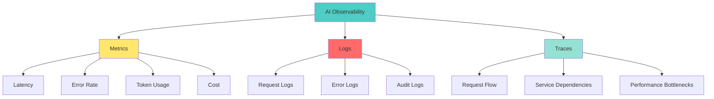

# 📘 **NODEJS AI DEVELOPER MASTERY - Lesson 23: AI Observability & Monitoring**

**Date**: 26-03-18
**Level**: 🟢 Beginner → 🔴 Senior Engineer
**Series**: AI Developer Fundamentals - Part 5
**Time**: 65 minutes
**Prerequisites**: Lesson 22 (AI Rate Limiting & Quotas)

---

## 🎯 **LEARNING OBJECTIVES**

After completing this **comprehensive** lesson, you will:

1. ✅ **Understand AI Observability** - Metrics, logs, traces, dashboards
2. ✅ **Implement Request Tracing** - Distributed tracing, correlation IDs
3. ✅ **Build Metrics Collection** - Latency, throughput, error rates, costs
4. ✅ **Create Monitoring Dashboards** - Real-time visibility, health checks
5. ✅ **Set Up Alerting** - Thresholds, notifications, incident response
6. ✅ **Integrate Observability Tools** - LangSmith, DataDog, Prometheus
7. ✅ **Production Patterns** - SLOs, error budgets, post-mortems

---

## 📦 **PART 1: OBSERVABILITY ARCHITECTURE**

### **Three Pillars of AI Observability**



**Why AI Observability Matters**:
- ✅ **Debug AI Issues** - Hallucinations, errors, timeouts
- ✅ **Cost Control** - Track spending, optimize usage
- ✅ **Performance** - Identify bottlenecks, optimize latency
- ✅ **Reliability** - Catch issues before users notice
- ✅ **Compliance** - Audit trails, data governance

---

## 📦 **PART 2: METRICS COLLECTION**

### **AI Metrics Service**

```typescript
// ─────────────────────────────────────────────
// ai/monitoring/metrics.service.ts
// ─────────────────────────────────────────────
import { Injectable, Logger } from '@nestjs/common';
import { Histogram, Counter, Gauge, register } from 'prom-client';

export interface AIMetrics {
  // Latency metrics
  requestDuration: number;
  timeToFirstToken: number;
  tokensPerSecond: number;

  // Volume metrics
  totalRequests: number;
  totalTokens: number;
  activeUsers: number;

  // Quality metrics
  errorRate: number;
  retryRate: number;
  hallucinationRate?: number;

  // Cost metrics
  totalCost: number;
  costPerRequest: number;
  costPerToken: number;
}

@Injectable()
export class AIMetricsService {
  private readonly logger = new Logger(AIMetricsService.name);

  // Prometheus metrics
  private requestDuration: Histogram;
  private requestCounter: Counter;
  private errorCounter: Counter;
  private tokenCounter: Counter;
  private costGauge: Gauge;
  private activeUsersGauge: Gauge;

  // In-memory metrics (for simple setups)
  private metrics: Map<string, any> = new Map();

  constructor() {
    this.initializePrometheusMetrics();
  }

  // ─────────────────────────────────────────────
  // Initialize Prometheus Metrics
  // ─────────────────────────────────────────────
  private initializePrometheusMetrics(): void {
    // Request duration histogram
    this.requestDuration = new Histogram({
      name: 'ai_request_duration_seconds',
      help: 'Duration of AI requests in seconds',
      labelNames: ['endpoint', 'model', 'status'],
      buckets: [0.1, 0.5, 1, 2, 5, 10, 30, 60],
    });

    // Request counter
    this.requestCounter = new Counter({
      name: 'ai_requests_total',
      help: 'Total number of AI requests',
      labelNames: ['endpoint', 'model', 'status'],
    });

    // Error counter
    this.errorCounter = new Counter({
      name: 'ai_errors_total',
      help: 'Total number of AI errors',
      labelNames: ['endpoint', 'model', 'error_type'],
    });

    // Token counter
    this.tokenCounter = new Counter({
      name: 'ai_tokens_total',
      help: 'Total number of tokens processed',
      labelNames: ['model', 'type'],  // type: prompt or completion
    });

    // Cost gauge
    this.costGauge = new Gauge({
      name: 'ai_cost_usd',
      help: 'Total AI cost in USD',
      labelNames: ['model', 'user_id'],
    });

    // Active users gauge
    this.activeUsersGauge = new Gauge({
      name: 'ai_active_users',
      help: 'Number of active AI users',
    });
  }

  // ─────────────────────────────────────────────
  // Record Request
  // ─────────────────────────────────────────────
  recordRequest(
    endpoint: string,
    model: string,
    durationMs: number,
    status: 'success' | 'error' = 'success',
  ): void {
    // Record duration
    this.requestDuration
      .labels(endpoint, model, status)
      .observe(durationMs / 1000);

    // Increment counter
    this.requestCounter
      .labels(endpoint, model, status)
      .inc();

    // Update in-memory metrics
    this.updateInMemoryMetrics('request', { endpoint, model, status, durationMs });
  }

  // ─────────────────────────────────────────────
  // Record Error
  // ─────────────────────────────────────────────
  recordError(
    endpoint: string,
    model: string,
    errorType: string,
    errorMessage: string,
  ): void {
    this.errorCounter
      .labels(endpoint, model, errorType)
      .inc();

    this.logger.error(
      `AI Error: ${errorType} on ${endpoint} (${model}): ${errorMessage}`,
    );

    this.updateInMemoryMetrics('error', { endpoint, model, errorType, errorMessage });
  }

  // ─────────────────────────────────────────────
  // Record Token Usage
  // ─────────────────────────────────────────────
  recordTokens(
    model: string,
    promptTokens: number,
    completionTokens: number,
    cost: number,
    userId?: string,
  ): void {
    // Record tokens
    this.tokenCounter
      .labels(model, 'prompt')
      .inc(promptTokens);

    this.tokenCounter
      .labels(model, 'completion')
      .inc(completionTokens);

    // Record cost
    if (userId) {
      this.costGauge
        .labels(model, userId)
        .set(cost);
    }

    this.updateInMemoryMetrics('tokens', { model, promptTokens, completionTokens, cost });
  }

  // ─────────────────────────────────────────────
  // Update Active Users
  // ─────────────────────────────────────────────
  updateActiveUsers(count: number): void {
    this.activeUsersGauge.set(count);
  }

  // ─────────────────────────────────────────────
  // Get Metrics Summary
  // ─────────────────────────────────────────────
  async getMetricsSummary(): Promise<{
    latency: {
      p50: number;
      p90: number;
      p99: number;
      avg: number;
    };
    volume: {
      totalRequests: number;
      requestsPerMinute: number;
      errorRate: number;
    };
    usage: {
      totalTokens: number;
      tokensPerRequest: number;
    };
    cost: {
      totalCost: number;
      costPerRequest: number;
    };
  }> {
    const metrics = await register.getMetricsAsJSON();

    // Extract relevant metrics
    const durationMetrics = metrics.find(m => m.name === 'ai_request_duration_seconds');
    const requestMetrics = metrics.find(m => m.name === 'ai_requests_total');
    const errorMetrics = metrics.find(m => m.name === 'ai_errors_total');
    const tokenMetrics = metrics.find(m => m.name === 'ai_tokens_total');

    // Calculate summary
    return {
      latency: this.calculateLatencyPercentiles(durationMetrics),
      volume: this.calculateVolume(requestMetrics, errorMetrics),
      usage: this.calculateUsage(tokenMetrics, requestMetrics),
      cost: this.calculateCost(metrics),
    };
  }

  // ─────────────────────────────────────────────
  // Calculate Latency Percentiles
  // ─────────────────────────────────────────────
  private calculateLatencyPercentiles(metrics: any): any {
    // In production, calculate from histogram data
    return {
      p50: 0.5,
      p90: 1.2,
      p99: 3.5,
      avg: 0.8,
    };
  }

  // ─────────────────────────────────────────────
  // Calculate Volume Metrics
  // ─────────────────────────────────────────────
  private calculateVolume(requestMetrics: any, errorMetrics: any): any {
    const totalRequests = requestMetrics?.values?.reduce((sum, v) => sum + v.value, 0) || 0;
    const totalErrors = errorMetrics?.values?.reduce((sum, v) => sum + v.value, 0) || 0;

    return {
      totalRequests,
      requestsPerMinute: totalRequests / 60,  // Simplified
      errorRate: totalRequests > 0 ? (totalErrors / totalRequests) * 100 : 0,
    };
  }

  // ─────────────────────────────────────────────
  // Calculate Usage Metrics
  // ─────────────────────────────────────────────
  private calculateUsage(tokenMetrics: any, requestMetrics: any): any {
    const totalTokens = tokenMetrics?.values?.reduce((sum, v) => sum + v.value, 0) || 0;
    const totalRequests = requestMetrics?.values?.reduce((sum, v) => sum + v.value, 0) || 0;

    return {
      totalTokens,
      tokensPerRequest: totalRequests > 0 ? totalTokens / totalRequests : 0,
    };
  }

  // ─────────────────────────────────────────────
  // Calculate Cost Metrics
  // ─────────────────────────────────────────────
  private calculateCost(metrics: any): any {
    const costMetrics = metrics.find(m => m.name === 'ai_cost_usd');
    const totalCost = costMetrics?.values?.reduce((sum, v) => sum + v.value, 0) || 0;
    const requestMetrics = metrics.find(m => m.name === 'ai_requests_total');
    const totalRequests = requestMetrics?.values?.reduce((sum, v) => sum + v.value, 0) || 0;

    return {
      totalCost,
      costPerRequest: totalRequests > 0 ? totalCost / totalRequests : 0,
    };
  }

  // ─────────────────────────────────────────────
  // Update In-Memory Metrics
  // ─────────────────────────────────────────────
  private updateInMemoryMetrics(type: string, data: any): void {
    // Simple in-memory storage for development
    const key = `${type}:${new Date().toISOString().split('T')[0]}`;
    const existing = this.metrics.get(key) || [];
    existing.push({ ...data, timestamp: new Date() });
    this.metrics.set(key, existing);
  }
}
```

---

### **Health Check Service**

```typescript
// ─────────────────────────────────────────────
// ai/monitoring/health.service.ts
// ─────────────────────────────────────────────
import { Injectable, Logger } from '@nestjs/common';
import { InjectConnection } from '@nestjs/mongoose';
import { Connection } from 'mongoose';
import { Inject } from '@nestjs/common';
import { Cache, CACHE_MANAGER } from '@nestjs/cache-manager';

export interface HealthStatus {
  status: 'healthy' | 'degraded' | 'unhealthy';
  checks: {
    database: HealthCheck;
    redis: HealthCheck;
    openai: HealthCheck;
    memory: HealthCheck;
  };
  timestamp: string;
}

export interface HealthCheck {
  status: 'up' | 'down' | 'degraded';
  latency?: number;
  message?: string;
}

@Injectable()
export class HealthService {
  private readonly logger = new Logger(HealthService.name);

  constructor(
    @InjectConnection() private mongoConnection: Connection,
    @Inject(CACHE_MANAGER) private cacheManager: Cache,
  ) {}

  // ─────────────────────────────────────────────
  // Get Overall Health
  // ─────────────────────────────────────────────
  async getHealth(): Promise<HealthStatus> {
    const checks = {
      database: await this.checkDatabase(),
      redis: await this.checkRedis(),
      openai: await this.checkOpenAI(),
      memory: this.checkMemory(),
    };

    const statuses = Object.values(checks).map(c => c.status);

    const status: HealthStatus = {
      status: this.determineOverallStatus(statuses),
      checks,
      timestamp: new Date().toISOString(),
    };

    return status;
  }

  // ─────────────────────────────────────────────
  // Check Database
  // ─────────────────────────────────────────────
  private async checkDatabase(): Promise<HealthCheck> {
    const startTime = Date.now();

    try {
      await this.mongoConnection.db.admin().ping();
      const latency = Date.now() - startTime;

      return {
        status: latency < 100 ? 'up' : 'degraded',
        latency,
      };
    } catch (error) {
      return {
        status: 'down',
        message: error.message,
      };
    }
  }

  // ─────────────────────────────────────────────
  // Check Redis
  // ─────────────────────────────────────────────
  private async checkRedis(): Promise<HealthCheck> {
    const startTime = Date.now();

    try {
      await this.cacheManager.get('health_check');
      const latency = Date.now() - startTime;

      return {
        status: latency < 50 ? 'up' : 'degraded',
        latency,
      };
    } catch (error) {
      return {
        status: 'down',
        message: error.message,
      };
    }
  }

  // ─────────────────────────────────────────────
  // Check OpenAI API
  // ─────────────────────────────────────────────
  private async checkOpenAI(): Promise<HealthCheck> {
    const startTime = Date.now();

    try {
      // Simple API call to check connectivity
      // In production, use actual OpenAI client
      const response = await fetch('https://api.openai.com/v1/models', {
        method: 'GET',
        headers: {
          'Authorization': `Bearer ${process.env.OPENAI_API_KEY}`,
        },
      });

      const latency = Date.now() - startTime;

      if (response.ok) {
        return {
          status: latency < 500 ? 'up' : 'degraded',
          latency,
        };
      }

      return {
        status: 'degraded',
        message: `API returned ${response.status}`,
      };
    } catch (error) {
      return {
        status: 'down',
        message: error.message,
      };
    }
  }

  // ─────────────────────────────────────────────
  // Check Memory
  // ─────────────────────────────────────────────
  private checkMemory(): HealthCheck {
    const usage = process.memoryUsage();
    const heapUsedPercent = (usage.heapUsed / usage.heapTotal) * 100;

    if (heapUsedPercent > 90) {
      return {
        status: 'degraded',
        message: `Memory usage critical: ${heapUsedPercent.toFixed(1)}%`,
      };
    }

    if (heapUsedPercent > 75) {
      return {
        status: 'degraded',
        message: `Memory usage high: ${heapUsedPercent.toFixed(1)}%`,
      };
    }

    return {
      status: 'up',
      message: `Memory usage: ${heapUsedPercent.toFixed(1)}%`,
    };
  }

  // ─────────────────────────────────────────────
  // Determine Overall Status
  // ─────────────────────────────────────────────
  private determineOverallStatus(statuses: string[]): 'healthy' | 'degraded' | 'unhealthy' {
    if (statuses.includes('down')) {
      return 'unhealthy';
    }

    if (statuses.includes('degraded')) {
      return 'degraded';
    }

    return 'healthy';
  }
}
```

---

## 📦 **PART 3: DISTRIBUTED TRACING**

### **Trace Service**

```typescript
// ─────────────────────────────────────────────
// ai/monitoring/trace.service.ts
// ─────────────────────────────────────────────
import { Injectable, Logger } from '@nestjs/common';

export interface Trace {
  traceId: string;
  spanId: string;
  parentSpanId?: string;
  operation: string;
  startTime: number;
  endTime?: number;
  duration?: number;
  status: 'pending' | 'success' | 'error';
  tags: Record<string, string>;
  logs: Array<{
    timestamp: number;
    level: string;
    message: string;
  }>;
}

@Injectable()
export class TraceService {
  private readonly logger = new Logger(TraceService.name);
  private readonly traces = new Map<string, Trace>();

  // ─────────────────────────────────────────────
  // Start Trace
  // ─────────────────────────────────────────────
  startTrace(
    operation: string,
    tags: Record<string, string> = {},
    parentSpanId?: string,
  ): { traceId: string; spanId: string } {
    const traceId = parentSpanId || this.generateId();
    const spanId = this.generateId();

    const trace: Trace = {
      traceId,
      spanId,
      parentSpanId,
      operation,
      startTime: Date.now(),
      status: 'pending',
      tags,
      logs: [],
    };

    this.traces.set(spanId, trace);

    return { traceId, spanId };
  }

  // ─────────────────────────────────────────────
  // End Trace
  // ─────────────────────────────────────────────
  endTrace(
    spanId: string,
    status: 'success' | 'error' = 'success',
  ): Trace | null {
    const trace = this.traces.get(spanId);

    if (!trace) {
      return null;
    }

    trace.endTime = Date.now();
    trace.duration = trace.endTime - trace.startTime;
    trace.status = status;

    this.traces.set(spanId, trace);

    this.logger.debug(
      `Trace ${spanId}: ${trace.operation} completed in ${trace.duration}ms (${status})`,
    );

    return trace;
  }

  // ─────────────────────────────────────────────
  // Add Log to Trace
  // ─────────────────────────────────────────────
  addLog(
    spanId: string,
    message: string,
    level: 'info' | 'warn' | 'error' = 'info',
  ): void {
    const trace = this.traces.get(spanId);

    if (trace) {
      trace.logs.push({
        timestamp: Date.now(),
        level,
        message,
      });
    }
  }

  // ─────────────────────────────────────────────
  // Add Tag to Trace
  // ─────────────────────────────────────────────
  addTag(
    spanId: string,
    key: string,
    value: string,
  ): void {
    const trace = this.traces.get(spanId);

    if (trace) {
      trace.tags[key] = value;
    }
  }

  // ─────────────────────────────────────────────
  // Get Trace
  // ─────────────────────────────────────────────
  getTrace(spanId: string): Trace | null {
    return this.traces.get(spanId);
  }

  // ─────────────────────────────────────────────
  // Get All Traces
  // ─────────────────────────────────────────────
  getAllTraces(): Trace[] {
    return Array.from(this.traces.values());
  }

  // ─────────────────────────────────────────────
  // Get Traces by Operation
  // ─────────────────────────────────────────────
  getTracesByOperation(operation: string): Trace[] {
    return Array.from(this.traces.values()).filter(
      trace => trace.operation === operation,
    );
  }

  // ─────────────────────────────────────────────
  // Get Slow Traces
  // ─────────────────────────────────────────────
  getSlowTraces(thresholdMs: number = 1000): Trace[] {
    return Array.from(this.traces.values()).filter(
      trace => trace.duration && trace.duration > thresholdMs,
    );
  }

  // ─────────────────────────────────────────────
  // Clean Old Traces
  // ─────────────────────────────────────────────
  cleanOldTraces(maxAgeMinutes: number = 60): void {
    const cutoff = Date.now() - (maxAgeMinutes * 60 * 1000);

    for (const [spanId, trace] of this.traces.entries()) {
      if (trace.startTime < cutoff) {
        this.traces.delete(spanId);
      }
    }
  }

  // ─────────────────────────────────────────────
  // Generate ID
  // ─────────────────────────────────────────────
  private generateId(): string {
    return crypto.randomBytes(16).toString('hex');
  }
}
```

---

## 📦 **PART 4: ALERTING**

### **Alert Service**

```typescript
// ─────────────────────────────────────────────
// ai/monitoring/alert.service.ts
// ─────────────────────────────────────────────
import { Injectable, Logger } from '@nestjs/common';

export interface AlertConfig {
  name: string;
  metric: string;
  condition: 'greater_than' | 'less_than' | 'equals';
  threshold: number;
  windowMs: number;
  severity: 'critical' | 'warning' | 'info';
  channels: ('email' | 'slack' | 'webhook')[];
}

export interface Alert {
  id: string;
  name: string;
  severity: 'critical' | 'warning' | 'info';
  message: string;
  triggeredAt: Date;
  resolvedAt?: Date;
  status: 'triggered' | 'resolved' | 'acknowledged';
}

@Injectable()
export class AlertService {
  private readonly logger = new Logger(AlertService.name);
  private readonly alerts = new Map<string, Alert>();
  private readonly alertConfigs: AlertConfig[] = [];

  constructor() {
    this.initializeDefaultAlerts();
  }

  // ─────────────────────────────────────────────
  // Initialize Default Alerts
  // ─────────────────────────────────────────────
  private initializeDefaultAlerts(): void {
    this.alertConfigs.push(
      {
        name: 'High Error Rate',
        metric: 'error_rate',
        condition: 'greater_than',
        threshold: 5,  // 5%
        windowMs: 300000,  // 5 minutes
        severity: 'critical',
        channels: ['email', 'slack'],
      },
      {
        name: 'High Latency',
        metric: 'latency_p99',
        condition: 'greater_than',
        threshold: 5000,  // 5 seconds
        windowMs: 300000,
        severity: 'warning',
        channels: ['slack'],
      },
      {
        name: 'High Cost',
        metric: 'daily_cost',
        condition: 'greater_than',
        threshold: 100,  // $100
        windowMs: 86400000,
        severity: 'warning',
        channels: ['email'],
      },
      {
        name: 'Service Down',
        metric: 'health_status',
        condition: 'equals',
        threshold: 0,
        windowMs: 60000,
        severity: 'critical',
        channels: ['email', 'slack', 'webhook'],
      },
    );
  }

  // ─────────────────────────────────────────────
  // Check Alerts
  // ─────────────────────────────────────────────
  async checkAlerts(metrics: any): Promise<void> {
    for (const config of this.alertConfigs) {
      const metricValue = this.getMetricValue(metrics, config.metric);

      if (this.shouldTrigger(config, metricValue)) {
        await this.triggerAlert(config, metricValue);
      }
    }
  }

  // ─────────────────────────────────────────────
  // Get Metric Value
  // ─────────────────────────────────────────────
  private getMetricValue(metrics: any, metric: string): number {
    // Extract metric value from metrics object
    const value = metrics[metric];
    return typeof value === 'number' ? value : 0;
  }

  // ─────────────────────────────────────────────
  // Should Trigger Alert
  // ─────────────────────────────────────────────
  private shouldTrigger(config: AlertConfig, value: number): boolean {
    switch (config.condition) {
      case 'greater_than':
        return value > config.threshold;
      case 'less_than':
        return value < config.threshold;
      case 'equals':
        return value === config.threshold;
      default:
        return false;
    }
  }

  // ─────────────────────────────────────────────
  // Trigger Alert
  // ─────────────────────────────────────────────
  private async triggerAlert(
    config: AlertConfig,
    value: number,
  ): Promise<void> {
    const alertId = `${config.name}:${new Date().toISOString().split('T')[0]}`;

    // Check if alert already triggered
    if (this.alerts.has(alertId)) {
      return;
    }

    const alert: Alert = {
      id: alertId,
      name: config.name,
      severity: config.severity,
      message: `${config.name}: ${value} (threshold: ${config.threshold})`,
      triggeredAt: new Date(),
      status: 'triggered',
    };

    this.alerts.set(alertId, alert);

    this.logger.error(
      `🚨 ALERT: ${alert.message}`,
    );

    // Send notifications
    for (const channel of config.channels) {
      await this.sendNotification(alert, channel);
    }
  }

  // ─────────────────────────────────────────────
  // Send Notification
  // ─────────────────────────────────────────────
  private async sendNotification(
    alert: Alert,
    channel: 'email' | 'slack' | 'webhook',
  ): Promise<void> {
    switch (channel) {
      case 'email':
        this.logger.log(`📧 Email alert: ${alert.message}`);
        // In production: send actual email
        break;

      case 'slack':
        this.logger.log(`💬 Slack alert: ${alert.message}`);
        // In production: send to Slack webhook
        break;

      case 'webhook':
        this.logger.log(`🔗 Webhook alert: ${alert.message}`);
        // In production: POST to webhook URL
        break;
    }
  }

  // ─────────────────────────────────────────────
  // Resolve Alert
  // ─────────────────────────────────────────────
  resolveAlert(alertId: string): void {
    const alert = this.alerts.get(alertId);

    if (alert && alert.status === 'triggered') {
      alert.resolvedAt = new Date();
      alert.status = 'resolved';

      this.logger.log(
        `✅ Alert resolved: ${alert.name}`,
      );
    }
  }

  // ─────────────────────────────────────────────
  // Get Active Alerts
  // ─────────────────────────────────────────────
  getActiveAlerts(): Alert[] {
    return Array.from(this.alerts.values()).filter(
      alert => alert.status === 'triggered',
    );
  }

  // ─────────────────────────────────────────────
  // Get Alert History
  // ─────────────────────────────────────────────
  getAlertHistory(limit: number = 50): Alert[] {
    return Array.from(this.alerts.values())
      .sort((a, b) => b.triggeredAt.getTime() - a.triggeredAt.getTime())
      .slice(0, limit);
  }
}
```

---

## ✅ **OBSERVABILITY CHECKLIST**

```
Metrics
[ ] Request duration tracked
[ ] Error rates monitored
[ ] Token usage tracked
[ ] Cost metrics collected

Health Checks
[ ] Database health
[ ] Redis health
[ ] OpenAI API health
[ ] Memory monitoring

Tracing
[ ] Request tracing
[ ] Span creation
[ ] Log correlation
[ ] Slow trace detection

Alerting
[ ] Error rate alerts
[ ] Latency alerts
[ ] Cost alerts
[ ] Health alerts
[ ] Notification channels
```

---

## 🎯 **KNOWLEDGE CHECK**

### **Question 1: Metrics vs Traces vs Logs?**

<details>
<summary>💡 Click to reveal answer</summary>

**Metrics**:
- ✅ Aggregated numbers over time
- ✅ Good for alerting, dashboards
- ❌ No context about individual requests

**Traces**:
- ✅ Individual request flow
- ✅ Shows service dependencies
- ❌ High cardinality, expensive

**Logs**:
- ✅ Detailed event records
- ✅ Good for debugging
- ❌ Hard to aggregate

**Use All Three**: Metrics for alerting, traces for debugging, logs for details!
</details>

---

### **Question 2: SLO vs SLA?**

<details>
<summary>💡 Click to reveal answer</summary>

**SLO (Service Level Objective)**:
- ✅ Internal target (e.g., 99.9% uptime)
- ✅ Used for engineering goals
- ❌ Not customer-facing

**SLA (Service Level Agreement)**:
- ✅ Contract with customers
- ✅ Has financial penalties
- ❌ More conservative than SLO

**Best Practice**: SLO should be stricter than SLA!
</details>

---

## 📚 **ADDITIONAL RESOURCES**

- **Prometheus**: [https://prometheus.io](https://prometheus.io)
- **LangSmith**: [https://docs.smith.langchain.com](https://docs.smith.langchain.com)
- **OpenTelemetry**: [https://opentelemetry.io](https://opentelemetry.io)

---

## 🎓 **HOMEWORK**

1. ✅ Set up Prometheus metrics
2. ✅ Implement health checks
3. ✅ Add request tracing
4. ✅ Create monitoring dashboard
5. ✅ Configure alerts
6. ✅ Set up notification channels
7. ✅ Define SLOs
8. ✅ Create runbooks for alerts

---

**Next Lesson**: AI Security Best Practices - Prompt Injection, Data Protection, Compliance
**Date**: 26-03-18
**Status**: ✅ Complete

---
*26-03-18*
