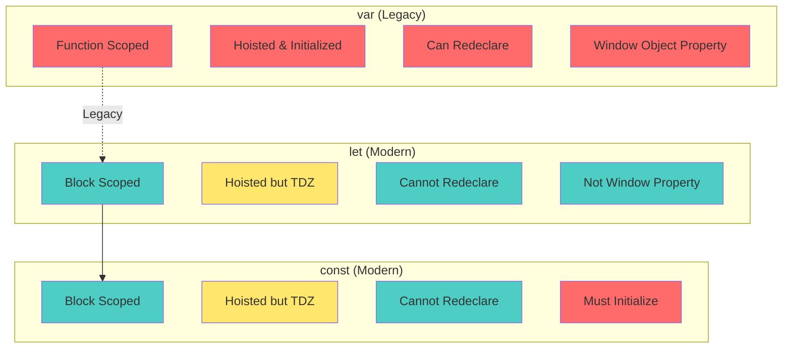
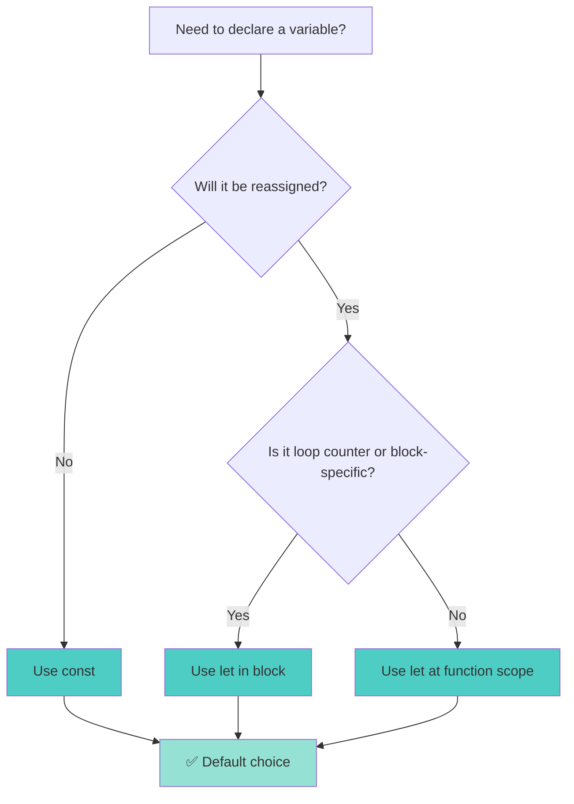
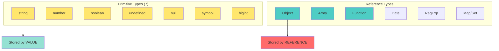
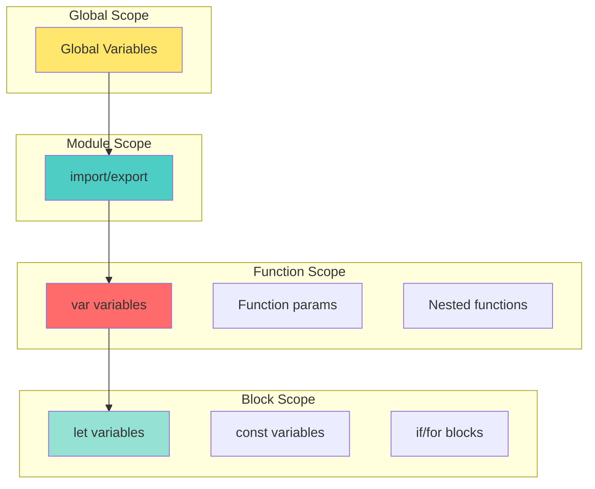
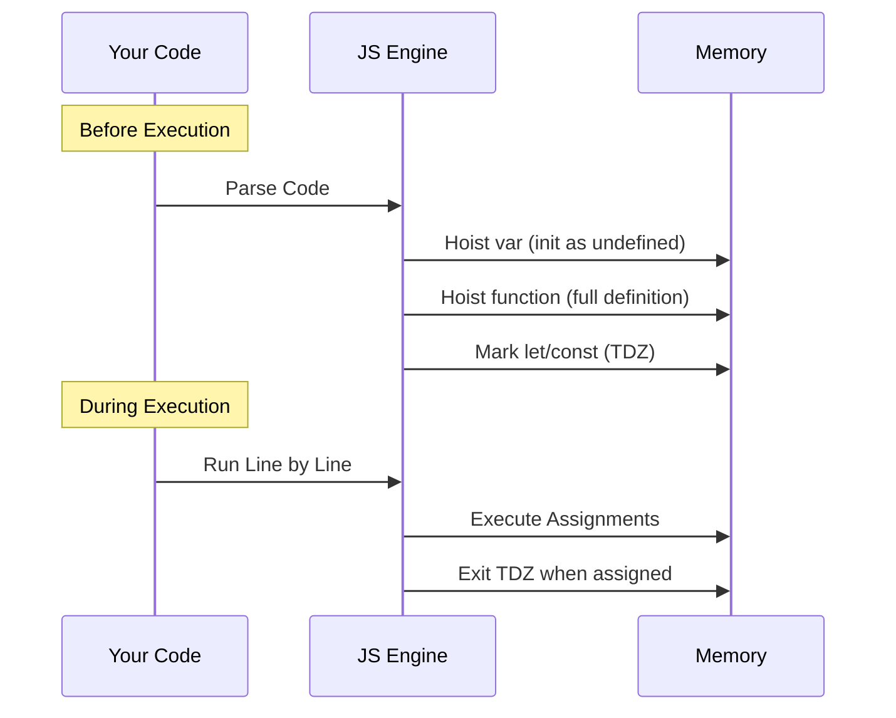
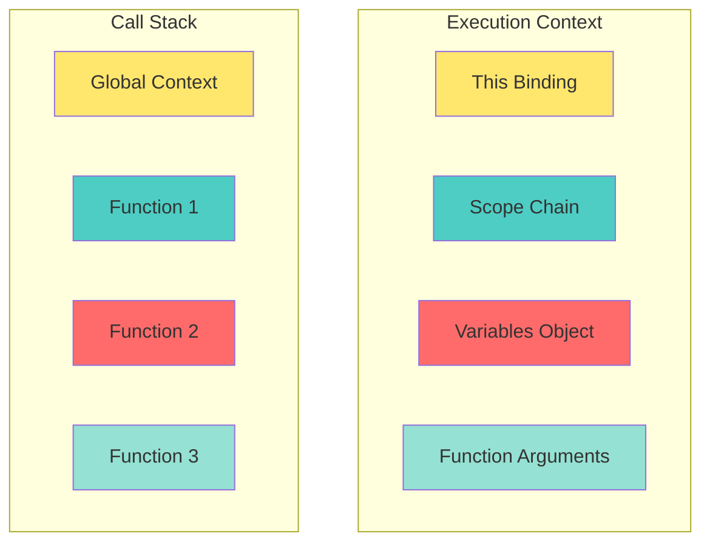

# 📘 **JAVASCRIPT MASTERY - Lesson 1: Foundations Deep Dive**

**Date**: 23-03-26
**Level**: 🟢 Beginner → 🔴 Senior Engineer
**Series**: JavaScript Fundamentals
**Time**: 45 minutes

---

## --

- [LastRead](#lastRead)

## 🎯 **LEARNING OBJECTIVES**

After completing this **comprehensive** lesson, you will:

1. ✅ **Master Variable Declarations** - var vs let vs const at the engine level
2. ✅ **Understand JavaScript Types** - Primitive vs Reference, type coercion, typeof quirks
3. ✅ **Master Scope & Closures** - Lexical scope, scope chain, closure patterns
4. ✅ **Understand Hoisting Completely** - Variable hoisting, function hoisting, TDZ
5. ✅ **Know Execution Context** - Call stack, scope chain, this binding
6. ✅ **Apply Best Practices** - Modern patterns, common pitfalls, production-ready code

---

## 📦 **PART 1: VARIABLE DECLARATIONS DEEP DIVE**

### **The Three Ways to Declare Variables**



---

### **var: The Legacy Declaration**

```javascript
// ─────────────────────────────────────────────
// ❌ PROBLEM 1: Function Scoped (Not Block Scoped)
// ─────────────────────────────────────────────
function exampleVar() {
  if (true) {
    var x = 10;
  }
  console.log(x); // ✅ 10 (x is accessible outside the block!)
}

// Why? var is function-scoped, not block-scoped
// The if block {} doesn't create a new scope for var

// ─────────────────────────────────────────────
// ❌ PROBLEM 2: Can Redeclare Same Variable
// ─────────────────────────────────────────────
var name = "John";
var name = "Jane"; // ✅ No error (silent overwrite!)
console.log(name); // "Jane"

// ─────────────────────────────────────────────
// ❌ PROBLEM 3: Hoisted and Initialized with undefined
// ─────────────────────────────────────────────
console.log(age); // ✅ undefined (no error!)
var age = 25;

// What actually happens (hoisting):
var age; // ← Hoisted to top, initialized as undefined
console.log(age); // ← undefined
age = 25; // ← Assignment stays here

// ─────────────────────────────────────────────
// ❌ PROBLEM 4: Becomes Window Property
// ─────────────────────────────────────────────
var globalVar = "I'm global";
console.log(window.globalVar); // ✅ "I'm global" (in browser)

// ─────────────────────────────────────────────
// ✅ WHEN TO USE var (Rare Cases)
// ─────────────────────────────────────────────
// 1. Legacy code maintenance
// 2. Intentional function-level scoping
// 3. IIFEs (Immediately Invoked Function Expressions)

(function () {
  var private = "I'm private";
  // This pattern is mostly obsolete with let/const + block scope
})();
```

---

### **let: The Modern Block-Scoped Variable**

```javascript
// ─────────────────────────────────────────────
// ✅ BENEFIT 1: Block Scoped
// ─────────────────────────────────────────────
function exampleLet() {
  if (true) {
    let x = 10;
    console.log(x); // ✅ 10
  }
  console.log(x); // ❌ ReferenceError: x is not defined
}

// Block scope applies to:
// - if/else blocks
// - for/while loops
// - switch statements
// - any {} block

// ─────────────────────────────────────────────
// ✅ BENEFIT 2: Cannot Redeclare
// ─────────────────────────────────────────────
let name = "John";
// let name = "Jane";  // ❌ SyntaxError: Identifier 'name' has already been declared

// ─────────────────────────────────────────────
// ⚠️ BENEFIT 3: Hoisted but in Temporal Dead Zone (TDZ)
// ─────────────────────────────────────────────
// console.log(age2);  // ❌ ReferenceError: Cannot access 'age2' before initialization
let age2 = 25;

// What actually happens:
// let age2;  // ← Hoisted but NOT initialized (TDZ begins)
// ← TDZ zone - accessing throws ReferenceError
// age2 = 25; // ← TDZ ends, variable is now accessible

// ─────────────────────────────────────────────
// ✅ BENEFIT 4: Not a Window Property
// ─────────────────────────────────────────────
let globalLet = "I'm global";
console.log(window.globalLet); // ❌ undefined

// ─────────────────────────────────────────────
// 🎯 PRACTICAL EXAMPLE: Loop with let
// ─────────────────────────────────────────────
// Using var (WRONG)
var funcs1 = [];
for (var i = 0; i < 3; i++) {
  funcs1.push(function () {
    console.log(i); // ❌ All print 3 (same shared variable!)
  });
}
funcs1[0](); // 3
funcs1[1](); // 3
funcs1[2](); // 3

// Using let (CORRECT)
var funcs2 = [];
for (let i = 0; i < 3; i++) {
  funcs2.push(function () {
    console.log(i); // ✅ Each has its own 'i'
  });
}
funcs2[0](); // 0
funcs2[1](); // 1
funcs2[2](); // 2

// Why? let creates a new binding for each loop iteration
```

---

### **const: The Immutable Declaration**

```javascript
// ─────────────────────────────────────────────
// ✅ BENEFIT 1: Block Scoped + Cannot Redeclare
// ─────────────────────────────────────────────
const MAX_USERS = 100;
// const MAX_USERS = 200;  // ❌ SyntaxError

// ─────────────────────────────────────────────
// ✅ BENEFIT 2: Must Initialize at Declaration
// ─────────────────────────────────────────────
// const PI;  // ❌ SyntaxError: Missing initializer in const declaration
const PI = 3.14159;

// ─────────────────────────────────────────────
// ⚠️ CRITICAL: const doesn't make values immutable!
// ─────────────────────────────────────────────
const user = { name: "John", age: 25 };

// ✅ This works (modifying object property)
user.age = 26;
user.email = "john@example.com";
console.log(user); // { name: "John", age: 26, email: "john@example.com" }

// ❌ This doesn't work (reassigning the variable)
// user = { name: "Jane" };  // ❌ TypeError: Assignment to constant variable

// ─────────────────────────────────────────────
// Array with const
// ─────────────────────────────────────────────
const numbers = [1, 2, 3];

// ✅ This works
numbers.push(4);
numbers[0] = 10;
console.log(numbers); // [10, 2, 3, 4]

// ❌ This doesn't work
// numbers = [5, 6, 7];  // ❌ TypeError

// ─────────────────────────────────────────────
// 🎯 TRUE IMMUTABILITY
// ─────────────────────────────────────────────
// Use Object.freeze() for true immutability
const CONFIG = Object.freeze({
  API_URL: "https://api.example.com",
  VERSION: "1.0.0",
});

// CONFIG.API_URL = 'https://hacker.com';  // ❌ Silent fail (or TypeError in strict mode)

// For deep freeze, use a utility function
function deepFreeze(obj) {
  Object.freeze(obj);
  Object.keys(obj).forEach((key) => {
    if (typeof obj[key] === "object" && obj[key] !== null) {
      deepFreeze(obj[key]);
    }
  });
  return obj;
}

const DEEP_CONFIG = deepFreeze({
  api: {
    url: "https://api.example.com",
    timeout: 5000,
  },
});

// DEEP_CONFIG.api.url = 'https://hacker.com';  // ❌ TypeError
```

---

### **Variable Declaration Decision Tree**



**Rule of Thumb**:

1. **Default to `const`** (80-90% of cases)
2. **Use `let`** when reassignment is necessary (loop counters, accumulators)
3. **Avoid `var`** unless maintaining legacy code

---

## 📦 **PART 2: JAVASCRIPT TYPES DEEP DIVE**

### **JavaScript Type System**



---

### **Primitive Types: Stored by Value**

```javascript
// ─────────────────────────────────────────────
// 1. STRING
// ─────────────────────────────────────────────
const name = "John";
const name2 = name; // ← Copies the VALUE

name2 = "Jane"; // ✅ Doesn't affect 'name'
console.log(name); // "John"

// String methods (strings are immutable)
const text = "Hello World";
console.log(text.toUpperCase()); // "HELLO WORLD"
console.log(text); // "Hello World" (original unchanged)

// ─────────────────────────────────────────────
// 2. NUMBER
// ─────────────────────────────────────────────
const age = 25;
const age2 = age; // ← Copies the VALUE

// Number quirks
console.log(0.1 + 0.2); // 0.30000000000000004 (floating point precision)
console.log(Number.isNaN(NaN)); // true
console.log(Number.isFinite(Infinity)); // false

// Fix floating point
console.log((0.1 + 0.2).toFixed(2)); // "0.30"
console.log(parseFloat((0.1 + 0.2).toFixed(2))); // 0.3

// ─────────────────────────────────────────────
// 3. BOOLEAN
// ─────────────────────────────────────────────
const isActive = true;
const isAdmin = Boolean("truthy"); // ✅ true

// Falsy values (6 total)
const falsyValues = [
  false,
  0,
  -0,
  0n, // BigInt zero
  "",
  null,
  undefined,
  NaN,
];

// ─────────────────────────────────────────────
// 4. UNDEFINED
// ─────────────────────────────────────────────
let notInitialized;
console.log(notInitialized); // undefined

function noReturn() {}
console.log(noReturn()); // undefined

const obj = {};
console.log(obj.nonExistent); // undefined

// ─────────────────────────────────────────────
// 5. NULL
// ─────────────────────────────────────────────
// Intentional absence of value
const user = null; // ← Explicitly no value

// null vs undefined
console.log(typeof undefined); // "undefined"
console.log(typeof null); // "object" (historical bug!)

// ─────────────────────────────────────────────
// 6. SYMBOL
// ─────────────────────────────────────────────
const id1 = Symbol("id");
const id2 = Symbol("id");
console.log(id1 === id2); // false (always unique)

// Use case: Hidden object properties
const userObj = {
  [Symbol("id")]: 123,
  name: "John",
};
console.log(userObj.name); // "John"
console.log(Object.keys(userObj)); // ["name"] (symbol not included)

// ─────────────────────────────────────────────
// 7. BIGINT
// ─────────────────────────────────────────────
const hugeNumber = 9007199254740991n; // Beyond Number.MAX_SAFE_INTEGER
const bigger = BigInt(9007199254740991);

console.log(hugeNumber + 1n); // 9007199254740992n
// console.log(hugeNumber + 1);  // ❌ TypeError (can't mix with number)
```

---

### **Reference Types: Stored by Reference**

```javascript
// ─────────────────────────────────────────────
// OBJECT (Reference Type)
// ─────────────────────────────────────────────
const user1 = { name: "John", age: 25 };
const user2 = user1; // ← Copies the REFERENCE (not the value!)

user2.age = 26;
console.log(user1.age); // 26 (BOTH changed!)

// To copy an object:
const user3 = { ...user1 }; // Shallow copy
const user4 = JSON.parse(JSON.stringify(user1)); // Deep copy (limited)
const user5 = structuredClone(user1); // Deep copy (modern, best)

// ─────────────────────────────────────────────
// ARRAY (Reference Type)
// ─────────────────────────────────────────────
const arr1 = [1, 2, 3];
const arr2 = arr1; // ← Copies the REFERENCE

arr2.push(4);
console.log(arr1); // [1, 2, 3, 4] (BOTH changed!)

// To copy an array:
const arr3 = [...arr1]; // Shallow copy
const arr4 = arr1.slice(); // Shallow copy
const arr5 = Array.from(arr1); // Shallow copy
const arr6 = structuredClone(arr1); // Deep copy

// ─────────────────────────────────────────────
// FUNCTION (Reference Type)
// ─────────────────────────────────────────────
function greet(name) {
  return `Hello, ${name}!`;
}

const greet2 = greet; // ← Copies the REFERENCE
console.log(greet2("John")); // "Hello, John!"

// ─────────────────────────────────────────────
// COMPARISON: Primitive vs Reference
// ─────────────────────────────────────────────
// Primitives compare by VALUE
const a = 5;
const b = 5;
console.log(a === b); // ✅ true (same value)

// References compare by MEMORY ADDRESS
const obj1 = { value: 5 };
const obj2 = { value: 5 };
console.log(obj1 === obj2); // ❌ false (different references)

const obj3 = obj1;
console.log(obj1 === obj3); // ✅ true (same reference)
```

---

### **Type Coercion: The Good, Bad, and Ugly**

```javascript
// ─────────────────────────────────────────────
// ✅ EXPLICIT COERCION (Good)
// ─────────────────────────────────────────────
const numStr = "123";
const num = Number(numStr); // 123 (clear intent)

const strNum = String(123); // "123"

const boolVal = Boolean("truthy"); // true

// ─────────────────────────────────────────────
// ⚠️ IMPLICIT COERCION (Bad - Avoid)
// ─────────────────────────────────────────────
console.log("5" - 1); // 4 (string to number)
console.log("5" + 1); // "51" (number to string)
console.log("5" == 5); // true (type coercion!)
console.log("5" === 5); // false (no coercion - use this!)

// ─────────────────────────────────────────────
// 🤯 WEIRD COERCION CASES
// ─────────────────────────────────────────────
console.log([] + []); // "" (empty string)
console.log([] + {}); // "[object Object]"
console.log({} + []); // 0 (or NaN in some contexts)
console.log([1] + [2]); // "12"
console.log("1" - -"1"); // 2 (unary minus)
console.log(true + true); // 2 (boolean to number)
console.log(true + false); // 1

// ─────────────────────────────────────────────
// 🎯 TRUTHY/FALSY COERCION
// ─────────────────────────────────────────────
const value = "";
if (value) {
  // Implicit: Boolean(value)
  console.log("Truthy");
} else {
  console.log("Falsy"); // This prints
}

// Falsy values to memorize:
// false, 0, -0, 0n, "", null, undefined, NaN

// ─────────────────────────────────────────────
// 🎯 SHORT-CIRCUIT EVALUATION
// ─────────────────────────────────────────────
// AND (&&) - Returns first falsy or last truthy
console.log(null && "anything"); // null
console.log("Hello" && "World"); // "World"

// OR (||) - Returns first truthy or last falsy
console.log(null || "default"); // "default"
console.log("Hello" || "World"); // "Hello"

// Nullish Coalescing (??) - Only null/undefined
console.log(null ?? "default"); // "default"
console.log(0 ?? "default"); // 0 (0 is not nullish)
console.log("" ?? "default"); // "" (empty string is not nullish)
```

---

## LastRead

## 📦 **PART 3: SCOPE & CLOSURES**

### **Understanding Scope**



---

### **Types of Scope**

```javascript
// ─────────────────────────────────────────────
// 1. GLOBAL SCOPE
// ─────────────────────────────────────────────
const globalVar = "I'm global";

function accessGlobal() {
  console.log(globalVar); // ✅ Can access global
}

// ─────────────────────────────────────────────
// 2. FUNCTION SCOPE (var)
// ─────────────────────────────────────────────
function functionScope() {
  var functionVar = "I'm function-scoped";

  if (true) {
    var functionVar2 = "I'm also function-scoped";
  }

  console.log(functionVar); // ✅ "I'm function-scoped"
  console.log(functionVar2); // ✅ "I'm also function-scoped"
}

// console.log(functionVar);  // ❌ ReferenceError

// ─────────────────────────────────────────────
// 3. BLOCK SCOPE (let/const)
// ─────────────────────────────────────────────
function blockScope() {
  if (true) {
    let blockVar = "I'm block-scoped";
    const blockConst = "Me too";
  }

  // console.log(blockVar);    // ❌ ReferenceError
  // console.log(blockConst);  // ❌ ReferenceError
}

// ─────────────────────────────────────────────
// 4. LEXICAL SCOPE (Nested Functions)
// ─────────────────────────────────────────────
function outer() {
  const outerVar = "I'm in outer";

  function inner() {
    const innerVar = "I'm in inner";
    console.log(outerVar); // ✅ Can access outer scope
  }

  inner();
  // console.log(innerVar);  // ❌ Cannot access inner scope
}

outer();
```

---

### **Closures: The Complete Guide**

```javascript
// ─────────────────────────────────────────────
// WHAT IS A CLOSURE?
// ─────────────────────────────────────────────
// A closure is a function that remembers its lexical scope
// even when executed outside that scope

function outerFunction() {
  const outerVar = "I'm from outer";

  function innerFunction() {
    console.log(outerVar); // ← This is a closure
  }

  return innerFunction;
}

const closure = outerFunction();
closure(); // "I'm from outer" (remembers outerVar!)

// ─────────────────────────────────────────────
// CLOSURE IN LOOPS (Classic Interview Question)
// ─────────────────────────────────────────────
// ❌ WRONG: Using var
for (var i = 0; i < 3; i++) {
  setTimeout(function () {
    console.log(i); // 3, 3, 3 (all see final value of i)
  }, 100);
}

// ✅ CORRECT: Using let (block scope)
for (let i = 0; i < 3; i++) {
  setTimeout(function () {
    console.log(i); // 0, 1, 2 (each iteration has its own 'i')
  }, 100);
}

// ✅ CORRECT: Using IIFE with var
for (var i = 0; i < 3; i++) {
  (function (capturedI) {
    setTimeout(function () {
      console.log(capturedI); // 0, 1, 2
    }, 100);
  })(i);
}

// ─────────────────────────────────────────────
// CLOSURE FOR DATA PRIVACY
// ─────────────────────────────────────────────
function createCounter() {
  let count = 0; // ← Private variable (closure)

  return {
    increment() {
      count++;
      return count;
    },
    decrement() {
      count--;
      return count;
    },
    getCount() {
      return count;
    },
  };
}

const counter = createCounter();
console.log(counter.increment()); // 1
console.log(counter.increment()); // 2
console.log(counter.getCount()); // 2
// console.log(counter.count);      // undefined (truly private!)

// ─────────────────────────────────────────────
// CLOSURE WITH FACTORY FUNCTIONS
// ─────────────────────────────────────────────
function createMultiplier(multiplier) {
  return function (number) {
    return number * multiplier;
  };
}

const double = createMultiplier(2);
const triple = createMultiplier(3);

console.log(double(5)); // 10
console.log(triple(5)); // 15

// ─────────────────────────────────────────────
// CLOSURE FOR MEMOIZATION (CACHING)
// ─────────────────────────────────────────────
function createMemoizedFunction(fn) {
  const cache = {}; // ← Private cache (closure)

  return function (...args) {
    const key = JSON.stringify(args);

    if (cache[key]) {
      console.log("Returning from cache");
      return cache[key];
    }

    const result = fn(...args);
    cache[key] = result;
    return result;
  };
}

const memoizedAdd = createMemoizedFunction((a, b) => {
  console.log("Computing...");
  return a + b;
});

console.log(memoizedAdd(2, 3)); // Computing... 5
console.log(memoizedAdd(2, 3)); // Returning from cache 5
```

---

### **Scope Chain in Action**

```javascript
// ─────────────────────────────────────────────
// SCOPE CHAIN VISUALIZATION
// ─────────────────────────────────────────────
const global = "I'm global";

function level1() {
  const level1Var = "I'm level 1";

  function level2() {
    const level2Var = "I'm level 2";

    function level3() {
      const level3Var = "I'm level 3";

      console.log(level3Var); // Own scope
      console.log(level2Var); // Parent scope
      console.log(level1Var); // Grandparent scope
      console.log(global); // Global scope
    }

    level3();
  }

  level2();
}

level1();

// ─────────────────────────────────────────────
// SHADOWING VARIABLES
// ─────────────────────────────────────────────
const name = "Global John";

function printName() {
  const name = "Function John"; // Shadows global

  console.log(name); // "Function John"

  if (true) {
    const name = "Block John"; // Shadows function
    console.log(name); // "Block John"
  }

  console.log(name); // "Function John" (back to function scope)
}

printName();
console.log(name); // "Global John" (global scope)
```

---

## 📦 **PART 4: HOISTING**

### **Hoisting Explained**



---

### **Hoisting Examples**

```javascript
// ─────────────────────────────────────────────
// VARIABLE HOISTING (var)
// ─────────────────────────────────────────────
console.log(age);  // ✅ undefined (not ReferenceError!)
var age = 25;

// What the engine sees:
var age;           // ← Hoisted and initialized as undefined
console.log(age);  // ← undefined
age = 25;          // ← Assignment

// ─────────────────────────────────────────────
// FUNCTION HOISTING
// ─────────────────────────────────────────────
greet("John");  // ✅ "Hello, John!" (works!)

function greet(name) {
  return `Hello, ${name}!`;
}

// What the engine sees:
function greet(name) {  // ← Fully hoisted
  return `Hello, ${name}!`;
}
greet("John");

// ─────────────────────────────────────────────
// FUNCTION EXPRESSIONS (NOT hoisted)
// ─────────────────────────────────────────────
// greet2("John");  // ❌ TypeError: greet2 is not a function

const greet2 = function(name) {
  return `Hello, ${name}!`;
};

// What the engine sees:
const greet2;  // ← Hoisted but undefined (TDZ for const!)
// Assignment happens here
greet2 = function(name) { ... };

// ─────────────────────────────────────────────
// let/const HOISTING (TDZ)
// ─────────────────────────────────────────────
// console.log(name2);  // ❌ ReferenceError: Cannot access 'name2' before initialization
let name2 = "John";

// What the engine sees:
// ← name2 exists but in Temporal Dead Zone
let name2;  // ← Hoisted but NOT initialized
// ← TDZ ends here
name2 = "John";  // ← Assignment

// ─────────────────────────────────────────────
// HOISTING PRIORITY: Functions > Variables
// ─────────────────────────────────────────────
var example = "I'm a variable";

function example() {
  return "I'm a function";
}

console.log(example);  // [Function: example] (function wins!)

// What the engine sees:
function example() {  // ← Function hoisted first
  return "I'm a function";
}
var example;  // ← Variable hoisted (but function already there)
example = "I'm a variable";  // ← Assignment

// ─────────────────────────────────────────────
// CLASS HOISTING
// ─────────────────────────────────────────────
// const person = new Person("John");  // ❌ ReferenceError

class Person {
  constructor(name) {
    this.name = name;
  }
}

// Classes are hoisted but remain in TDZ (like const)
```

---

## 📦 **PART 5: EXECUTION CONTEXT**

### **Execution Context Anatomy**



---

### **Call Stack Visualization**

```javascript
// ─────────────────────────────────────────────
// CALL STACK DEMONSTRATION
// ─────────────────────────────────────────────
function first() {
  console.log("First function start");
  second();
  console.log("First function end");
}

function second() {
  console.log("Second function start");
  third();
  console.log("Second function end");
}

function third() {
  console.log("Third function");
}

first();

// Call Stack Evolution:
// 1. [Global Context]
// 2. [Global, first]
// 3. [Global, first, second]
// 4. [Global, first, second, third]
// 5. [Global, first, second]
// 6. [Global, first]
// 7. [Global]
// 8. [] (empty)

// Output:
// First function start
// Second function start
// Third function
// Second function end
// First function end
```

---

## ✅ **FOUNDATIONS CHECKLIST**

```
Variable Declarations
[ ] Understand var vs let vs const differences
[ ] Know when to use each declaration type
[ ] Avoid var in modern code
[ ] Default to const, use let for reassignment

Types & Coercion
[ ] Know all 7 primitive types
[ ] Understand reference vs primitive comparison
[ ] Use === instead of ==
[ ] Know explicit vs implicit coercion
[ ] Memorize falsy values (8 total)

Scope & Closures
[ ] Understand global, function, block, lexical scope
[ ] Create closures for data privacy
[ ] Solve loop closure problems
[ ] Use closures for memoization

Hoisting
[ ] Know var is hoisted and initialized
[ ] Know let/const are hoisted but in TDZ
[ ] Know functions are fully hoisted
[ ] Know function expressions are not hoisted

Execution Context
[ ] Understand call stack
[ ] Know scope chain
[ ] Understand this binding (covered in next lesson)
```

---

## 🎯 **KNOWLEDGE CHECK**

### **Question 1: Variable Output**

What will this code output?

```javascript
console.log(a);
console.log(b);
console.log(c);

var a = 1;
let b = 2;
const c = 3;
```

<details>
<summary>💡 Click to reveal answer</summary>

```javascript
console.log(a); // undefined (var hoisted and initialized)
console.log(b); // ReferenceError (let in TDZ)
console.log(c); // ReferenceError (const in TDZ)

var a = 1;
let b = 2;
const c = 3;
```

**Explanation**: `var` is hoisted and initialized with `undefined`. `let` and `const` are hoisted but remain in TDZ until assignment.

</details>

---

### **Question 2: Closure in Loop**

Fix this code to output 0, 1, 2:

```javascript
for (var i = 0; i < 3; i++) {
  setTimeout(() => console.log(i), 100);
}
```

<details>
<summary>💡 Click to reveal answer</summary>

**Solution 1** (Best): Use `let` instead of `var`

```javascript
for (let i = 0; i < 3; i++) {
  setTimeout(() => console.log(i), 100);
}
```

**Solution 2**: Use IIFE

```javascript
for (var i = 0; i < 3; i++) {
  (function (capturedI) {
    setTimeout(() => console.log(capturedI), 100);
  })(i);
}
```

</details>

---

### **Question 3: Reference vs Value**

What will this output?

```javascript
const obj1 = { a: 1 };
const obj2 = obj1;
obj2.a = 2;

console.log(obj1.a);
console.log(obj1 === obj2);
```

<details>
<summary>💡 Click to reveal answer</summary>

```javascript
console.log(obj1.a); // 2 (obj1 and obj2 reference same object)
console.log(obj1 === obj2); // true (same reference)
```

**Explanation**: Objects are reference types. Assigning `obj2 = obj1` copies the reference, not the value.

</details>

---

## 📚 **ADDITIONAL RESOURCES**

- **MDN JavaScript Guide**: [Lexical Grammar](https://developer.mozilla.org/en-US/docs/Web/JavaScript/Guide/Grammar_and_types)
- **You Don't Know JS**: [Scope & Closures](https://github.com/getify/You-Dont-Know-JS/tree/2nd-ed/scope-closures)
- **JavaScript Info**: [Data Types](https://javascript.info/types)

---

## 🎓 **HOMEWORK**

1. ✅ Create a counter module using closures (private state)
2. ✅ Demonstrate the difference between var, let, and const with 5 examples each
3. ✅ Create a memoized Fibonacci function using closures
4. ✅ Draw the scope chain for a 3-level nested function
5. ✅ Explain hoisting to a beginner (write it in simple terms)

---

**Next Lesson**: Functions Deep Dive - Closures, IIFE, Higher-Order Functions, Currying
**Date**: 23-03-26
**Status**: ✅ Complete

---

-23-03-26
