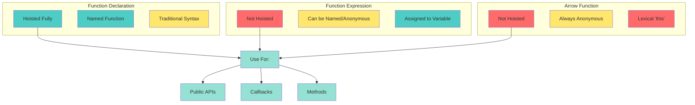
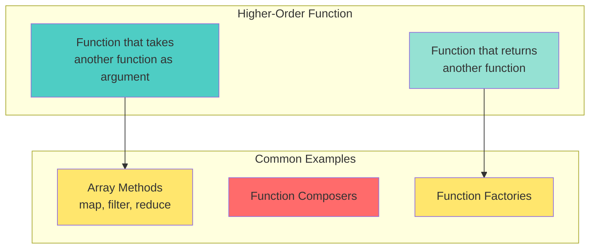
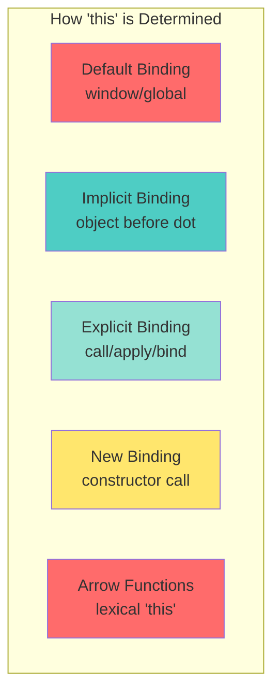

# 📘 **JAVASCRIPT MASTERY - Lesson 2: Functions Deep Dive**

**Date**: 23-03-26
**Level**: 🟢 Beginner → 🔴 Senior Engineer
**Series**: JavaScript Fundamentals
**Time**: 50 minutes
**Prerequisites**: Lesson 1 (Variables, Types, Scope, Hoisting)

---

- [LastRead](#lastRead)

## 🎯 **LEARNING OBJECTIVES**

After completing this **comprehensive** lesson, you will:

1. ✅ **Master Function Declarations** - Declaration vs Expression vs Arrow
2. ✅ **Understand IIFE Patterns** - Module pattern, isolation, legacy code
3. ✅ **Master Higher-Order Functions** - Functions as arguments and return values
4. ✅ **Implement Currying & Partial Application** - Function transformation patterns
5. ✅ **Master Closures in Functions** - Private state, memoization, function factories
6. ✅ **Understand `this` Keyword** - Binding rules, call/apply/bind, arrow functions

---

## 📦 **PART 1: FUNCTION DECLARATIONS DEEP DIVE**

### **Three Ways to Define Functions**



---

### **Function Declaration (Named, Hoisted)**

```javascript
// ─────────────────────────────────────────────
// SYNTAX & CHARACTERISTICS
// ─────────────────────────────────────────────
function greet(name) {
  return `Hello, ${name}!`;
}

// ✅ Hoisted (can call before definition)
greet("John"); // "Hello, John!"

function greet(name) {
  return `Hello, ${name}!`;
}

// ✅ Has a name (visible in stack traces)
console.log(greet.name); // "greet"

// ─────────────────────────────────────────────
// BEST FOR: Public APIs, Utility Functions
// ─────────────────────────────────────────────
// Clear, readable, hoisted - perfect for module exports

function calculateTotal(price, tax, discount = 0) {
  const subtotal = price * (1 + tax);
  return subtotal - discount;
}

function applyDiscount(total, discountCode) {
  if (discountCode === "SAVE10") {
    return total * 0.9;
  }
  return total;
}

// ─────────────────────────────────────────────
// RECURSIVE FUNCTIONS (Need Names)
// ─────────────────────────────────────────────
function factorial(n) {
  if (n <= 1) return 1;
  return n * factorial(n - 1); // ← Needs function name
}

console.log(factorial(5)); // 120

// ─────────────────────────────────────────────
// NAMED FUNCTION EXPRESSION (Best of Both Worlds)
// ─────────────────────────────────────────────
const factorial2 = function factorial(n) {
  if (n <= 1) return 1;
  return n * factorial(n - 1); // ← Name works inside function
};

console.log(factorial2.name); // "factorial"
console.log(factorial2(5)); // 120

// Outside the function, use the variable name
// factorial(5);  // ❌ ReferenceError (name only works internally)
```

---

### **Function Expression (Anonymous, Not Hoisted)**

```javascript
// ─────────────────────────────────────────────
// SYNTAX & CHARACTERISTICS
// ─────────────────────────────────────────────
// ❌ Cannot call before definition (not hoisted)
// const result = multiply(2, 3);  // ❌ TypeError

const multiply = function (a, b) {
  return a * b;
};

console.log(multiply(2, 3)); // 6

// ─────────────────────────────────────────────
// ANONYMOUS FUNCTIONS (No Name)
// ─────────────────────────────────────────────
const anonymous = function (a, b) {
  return a + b;
};

console.log(anonymous.name); // "anonymous" (inferred from variable)

// ─────────────────────────────────────────────
// BEST FOR: Callbacks, Event Handlers
// ─────────────────────────────────────────────
const numbers = [1, 2, 3, 4, 5];

const doubled = numbers.map(function (num) {
  return num * 2;
});

console.log(doubled); // [2, 4, 6, 8, 10]

// ─────────────────────────────────────────────
// IIFE (Immediately Invoked Function Expression)
// ─────────────────────────────────────────────
(function () {
  const private = "I'm private";
  console.log(private); // "I'm private"
})();

// console.log(private);  // ❌ ReferenceError (scoped to IIFE)

// With parameters
(function (message) {
  console.log(message); // "Hello from IIFE"
})("Hello from IIFE");

// ─────────────────────────────────────────────
// MODULE PATTERN (Pre-ES6 Modules)
// ─────────────────────────────────────────────
const Counter = (function () {
  let count = 0; // ← Private variable

  return {
    increment() {
      count++;
      return count;
    },
    decrement() {
      count--;
      return count;
    },
    getCount() {
      return count;
    },
    reset() {
      count = 0;
      return count;
    },
  };
})();

console.log(Counter.increment()); // 1
console.log(Counter.increment()); // 2
console.log(Counter.getCount()); // 2
// console.log(Counter.count);      // undefined (private!)
```

---

### **Arrow Functions (ES6+, Lexical `this`)**

```javascript
// ─────────────────────────────────────────────
// SYNTAX VARIATIONS
// ─────────────────────────────────────────────
// Basic arrow function
const add = (a, b) => {
  return a + b;
};

// Implicit return (single expression)
const add2 = (a, b) => a + b;

// Single parameter (no parentheses needed)
const double = (n) => n * 2;

// No parameters (empty parentheses)
const sayHi = () => console.log("Hi!");

// Returning object literal (wrap in parentheses)
const createUser = (name, age) => ({
  name,
  age,
  greet() {
    console.log(`Hi, I'm ${this.name}`);
  },
});

// ─────────────────────────────────────────────
// ⚠️ CRITICAL: Arrow Functions Don't Have Their Own 'this'
// ─────────────────────────────────────────────
const person = {
  name: "John",

  // Regular function - has its own 'this'
  greetRegular() {
    console.log(this.name); // "John"
  },

  // Arrow function - uses lexical 'this' from parent scope
  greetArrow: () => {
    console.log(this.name); // undefined (this is window/global)
  },
};

person.greetRegular(); // "John"
person.greetArrow(); // undefined (or error in strict mode)

// ─────────────────────────────────────────────
// ✅ ARROW FUNCTIONS IN CALLBACKS (Preserve 'this')
// ─────────────────────────────────────────────
function Timer() {
  this.seconds = 0;

  // Regular function - 'this' changes
  this.startRegular = function () {
    setInterval(function () {
      this.seconds++; // ❌ 'this' is not Timer instance!
      console.log(this.seconds);
    }, 1000);
  };

  // Arrow function - 'this' preserved
  this.startArrow = function () {
    setInterval(() => {
      this.seconds++; // ✅ 'this' is Timer instance
      console.log(this.seconds);
    }, 1000);
  };
}

const timer = new Timer();
// timer.startRegular();  // ❌ Doesn't work
timer.startArrow(); // ✅ Works correctly

// ─────────────────────────────────────────────
// ⚠️ ARROW FUNCTIONS CANNOT BE CONSTRUCTORS
// ─────────────────────────────────────────────
const Person = (name) => {
  this.name = name;
};

// const john = new Person("John");  // ❌ TypeError: Person is not a constructor

// ─────────────────────────────────────────────
// ⚠️ ARROW FUNCTIONS DON'T HAVE 'arguments'
// ─────────────────────────────────────────────
const sumArrow = () => {
  // console.log(arguments);  // ❌ ReferenceError
};

const sumRegular = function () {
  console.log(arguments); // ✅ Arguments object available
  return Array.from(arguments).reduce((sum, num) => sum + num, 0);
};

console.log(sumRegular(1, 2, 3)); // 6

// Solution: Use rest parameters
const sumModern = (...args) => {
  return args.reduce((sum, num) => sum + num, 0);
};

console.log(sumModern(1, 2, 3)); // 6
```

---

### **Function Comparison Table**

| Feature                  | Declaration    | Expression      | Arrow                    |
| ------------------------ | -------------- | --------------- | ------------------------ |
| **Hoisted**              | ✅ Yes (fully) | ❌ No           | ❌ No                    |
| **Named**                | ✅ Yes         | ⚠️ Optional     | ❌ No                    |
| **`this` Binding**       | Dynamic        | Dynamic         | Lexical                  |
| **`arguments`**          | ✅ Yes         | ✅ Yes          | ❌ No                    |
| **Can be Constructor**   | ✅ Yes         | ✅ Yes          | ❌ No                    |
| **`super`/`new.target`** | ✅ Yes         | ✅ Yes          | ❌ No                    |
| **Best Use**             | Public APIs    | Callbacks, IIFE | Short callbacks, methods |

---

## 📦 **PART 2: HIGHER-ORDER FUNCTIONS**

### **What are Higher-Order Functions?**



---

### **Functions as Arguments**

```javascript
// ─────────────────────────────────────────────
// ARRAY METHODS (Classic Higher-Order Functions)
// ─────────────────────────────────────────────
const numbers = [1, 2, 3, 4, 5, 6, 7, 8, 9, 10];

// MAP: Transform each element
const squares = numbers.map((n) => n * n);
console.log(squares); // [1, 4, 9, 16, 25, 36, 49, 64, 81, 100]

// FILTER: Keep elements that pass test
const evens = numbers.filter((n) => n % 2 === 0);
console.log(evens); // [2, 4, 6, 8, 10]

// REDUCE: Accumulate to single value
const sum = numbers.reduce((acc, n) => acc + n, 0);
console.log(sum); // 55

// CHAINING: Combine multiple operations
const result = numbers
  .filter((n) => n % 2 === 0) // [2, 4, 6, 8, 10]
  .map((n) => n * n) // [4, 16, 36, 64, 100]
  .reduce((acc, n) => acc + n, 0); // 220

console.log(result); // 220

// ─────────────────────────────────────────────
// CUSTOM HIGHER-ORDER FUNCTION
// ─────────────────────────────────────────────
function forEach(array, callback) {
  for (let i = 0; i < array.length; i++) {
    callback(array[i], i, array);
  }
}

forEach([1, 2, 3], (num, index, arr) => {
  console.log(`${index}: ${num}`); // 0: 1, 1: 2, 2: 3
});

// ─────────────────────────────────────────────
// FUNCTION THAT VALIDATES WITH CUSTOM RULES
// ─────────────────────────────────────────────
function validate(value, rules) {
  const errors = [];

  rules.forEach((rule) => {
    const error = rule(value);
    if (error) {
      errors.push(error);
    }
  });

  return errors.length === 0 ? null : errors;
}

// Validation rules (functions!)
const isRequired = (value) => (!value ? "Field is required" : null);

const minLength = (min) => (value) =>
  value && value.length < min ? `Minimum length is ${min}` : null;

const isEmail = (value) =>
  value && !/^\S+@\S+\.\S+$/.test(value) ? "Invalid email" : null;

// Use validation
const errors = validate("not-an-email", [isRequired, minLength(3), isEmail]);

console.log(errors); // ["Invalid email"]
```

---

### **Functions Returning Functions**

```javascript
// ─────────────────────────────────────────────
// FUNCTION FACTORY
// ─────────────────────────────────────────────
function createMultiplier(multiplier) {
  return function (number) {
    return number * multiplier;
  };
}

const double = createMultiplier(2);
const triple = createMultiplier(3);

console.log(double(5)); // 10
console.log(triple(5)); // 15

// ─────────────────────────────────────────────
// FUNCTION THAT CREATES VALIDATORS
// ─────────────────────────────────────────────
function createValidator(type) {
  return function (value) {
    switch (type) {
      case "number":
        return typeof value === "number";
      case "string":
        return typeof value === "string";
      case "boolean":
        return typeof value === "boolean";
      case "array":
        return Array.isArray(value);
      default:
        return false;
    }
  };
}

const isNumber = createValidator("number");
const isString = createValidator("string");

console.log(isNumber(42)); // true
console.log(isNumber("42")); // false
console.log(isString("hello")); // true

// ─────────────────────────────────────────────
// FUNCTION THAT CREATES EVENT HANDLERS
// ─────────────────────────────────────────────
function createEventHandler(action) {
  return function (event) {
    event.preventDefault();
    console.log(`Handling ${action} event`);

    // Perform action-specific logic
    switch (action) {
      case "submit":
        console.log("Form submitted");
        break;
      case "click":
        console.log("Element clicked");
        break;
      case "change":
        console.log("Value changed");
        break;
    }
  };
}

const handleSubmit = createEventHandler("submit");
const handleClick = createEventHandler("click");

// handleSubmit(event);
// handleClick(event);
```

---

## 📦 **PART 3: CURRYING & PARTIAL APPLICATION**

### **Currying: Transform Functions**

```mermaid
graph LR
    A[Original Function<br/>add(a, b, c)] --> B[Curried Function<br/>add(a)(b)(c)]

    A --> C[Takes all args at once]
    B --> D[Takes one arg at a time]

    style A fill:#ffe66d
    style B fill:#4ecdc4
    style C fill:#ff6b6b
    style D fill:#95e1d3
```

---

### **Currying Fundamentals**

```javascript
// ─────────────────────────────────────────────
// WHAT IS CURRYING?
// ─────────────────────────────────────────────
// Transform: add(a, b, c) → add(a)(b)(c)

// Normal function
function add(a, b, c) {
  return a + b + c;
}

console.log(add(1, 2, 3)); // 6

// Curried version
function curriedAdd(a) {
  return function (b) {
    return function (c) {
      return a + b + c;
    };
  };
}

console.log(curriedAdd(1)(2)(3)); // 6

// Can also call step by step
const addOne = curriedAdd(1);
const addOneAndTwo = addOne(2);
const result = addOneAndTwo(3);
console.log(result); // 6

// ─────────────────────────────────────────────
// GENERIC CURRY FUNCTION
// ─────────────────────────────────────────────
function curry(fn) {
  return function curried(...args) {
    // If we have enough arguments, call the function
    if (args.length >= fn.length) {
      return fn.apply(this, args);
    }

    // Otherwise, return a function that collects more arguments
    return function (...moreArgs) {
      return curried.apply(this, args.concat(moreArgs));
    };
  };
}

// Use the curry function
function multiply(a, b, c) {
  return a * b * c;
}

const curriedMultiply = curry(multiply);

console.log(curriedMultiply(2)(3)(4)); // 24
console.log(curriedMultiply(2, 3)(4)); // 24
console.log(curriedMultiply(2)(3, 4)); // 24
console.log(curriedMultiply(2, 3, 4)); // 24

// ─────────────────────────────────────────────
// PARTIAL APPLICATION (Fix Some Arguments)
// ─────────────────────────────────────────────
function partial(fn, ...fixedArgs) {
  return function (...remainingArgs) {
    return fn.apply(this, fixedArgs.concat(remainingArgs));
  };
}

// Example: Create specialized functions
function greet(greeting, name, punctuation) {
  return `${greeting}, ${name}${punctuation}`;
}

const sayHello = partial(greet, "Hello");
const sayHi = partial(greet, "Hi");

console.log(sayHello("John", "!")); // "Hello, John!"
console.log(sayHi("Jane", "!")); // "Hi, Jane!"

// More specific
const sayHelloJohn = partial(greet, "Hello", "John");
console.log(sayHelloJohn("!")); // "Hello, John!"

// ─────────────────────────────────────────────
// PRACTICAL: CURRYING FOR CONFIGURATION
// ─────────────────────────────────────────────
function apiCall(method, url, options, data) {
  return {
    method,
    url,
    options,
    data,
    execute() {
      console.log(`Executing ${method} ${url}`);
      // Actual API call would go here
    },
  };
}

// Curry the API call function
const curriedApi = curry(apiCall);

// Create specialized API functions
const get = curriedApi("GET");
const post = curriedApi("POST");
const put = curriedApi("PUT");

// Even more specific
const getUsers = get("/api/users");
const getUserById = get("/api/users/:id");
const createPost = post("/api/posts");

// Use them
const request = getUsers({ headers: { Accept: "application/json" } });
request.execute(); // "Executing GET /api/users"

// ─────────────────────────────────────────────
// PRACTICAL: FUNCTION COMPOSITION
// ─────────────────────────────────────────────
function compose(...functions) {
  return function (initialValue) {
    return functions.reduceRight((acc, fn) => fn(acc), initialValue);
  };
}

function pipe(...functions) {
  return function (initialValue) {
    return functions.reduce((acc, fn) => fn(acc), initialValue);
  };
}

// Utility functions
const trim = (str) => str.trim();
const toLowerCase = (str) => str.toLowerCase();
const split = (separator) => (str) => str.split(separator);
const first = (arr) => arr[0];

// Compose (right to left)
const getFirstWord = compose(first, split(" "), toLowerCase, trim);

// Pipe (left to right - more readable)
const getFirstWordPipe = pipe(trim, toLowerCase, split(" "), first);

console.log(getFirstWord("  Hello World  ")); // "hello"
console.log(getFirstWordPipe("  Hello World  ")); // "hello"
```

---

## 📦 **PART 4: THE `this` KEYWORD**

### **Understanding `this` Binding**



---

### **`this` Binding Rules**

```javascript
// ─────────────────────────────────────────────
// RULE 1: Default Binding (Standalone Function)
// ─────────────────────────────────────────────
function showThis() {
  console.log(this);
}

showThis(); // window (browser) or global (Node) or undefined (strict mode)

// ─────────────────────────────────────────────
// RULE 2: Implicit Binding (Method Call)
// ─────────────────────────────────────────────
const obj = {
  name: "John",
  greet() {
    console.log(`Hello, ${this.name}!`);
  },
};

obj.greet(); // "Hello, John!" (this = obj)

const greetFunc = obj.greet;
greetFunc(); // "Hello, undefined!" (this = window/global)

// ─────────────────────────────────────────────
// RULE 3: Explicit Binding (call/apply/bind)
// ─────────────────────────────────────────────
function greet(greeting, punctuation) {
  console.log(`${greeting}, ${this.name}${punctuation}`);
}

const person = { name: "John" };

// call: Invoke immediately, arguments listed
greet.call(person, "Hello", "!"); // "Hello, John!"

// apply: Invoke immediately, arguments in array
greet.apply(person, ["Hi", "!"]); // "Hi, John!"

// bind: Return new function with bound 'this'
const greetJohn = greet.bind(person);
greetJohn("Hey", "!"); // "Hey, John!"

// ─────────────────────────────────────────────
// RULE 4: New Binding (Constructor Call)
// ─────────────────────────────────────────────
function Person(name) {
  this.name = name;
  this.greet = function () {
    console.log(`Hello, ${this.name}!`);
  };
}

const john = new Person("John");
john.greet(); // "Hello, John!"

// ─────────────────────────────────────────────
// RULE 5: Arrow Functions (Lexical 'this')
// ─────────────────────────────────────────────
const obj2 = {
  name: "John",
  regularGreet() {
    console.log(this.name); // "John"
  },
  arrowGreet: () => {
    console.log(this.name); // undefined (this = window/global)
  },
};

obj2.regularGreet(); // "John"
obj2.arrowGreet(); // undefined

// ─────────────────────────────────────────────
// PRACTICAL: FIXING 'this' IN CALLBACKS
// ─────────────────────────────────────────────
const team = {
  name: "Developers",
  members: ["Alice", "Bob", "Charlie"],

  // ❌ WRONG: 'this' lost in callback
  printMembersWrong() {
    this.members.forEach(function (member) {
      console.log(`${member} - ${this.name}`); // this is undefined!
    });
  },

  // ✅ CORRECT: Use arrow function
  printMembersArrow() {
    this.members.forEach((member) => {
      console.log(`${member} - ${this.name}`); // this preserved
    });
  },

  // ✅ CORRECT: Use bind
  printMembersBind() {
    this.members.forEach(
      function (member) {
        console.log(`${member} - ${this.name}`);
      }.bind(this),
    );
  },

  // ✅ CORRECT: Save reference
  printMembersSave() {
    const self = this;
    this.members.forEach(function (member) {
      console.log(`${member} - ${self.name}`);
    });
  },
};

team.printMembersArrow();
// Alice - Developers
// Bob - Developers
// Charlie - Developers
```

---

## lastRead

### **call, apply, bind Deep Dive**

```javascript
// ─────────────────────────────────────────────
// call vs apply vs bind COMPARISON
// ─────────────────────────────────────────────
const person = { name: "John" };

function greet(greeting, punctuation) {
  return `${greeting}, ${this.name}${punctuation}`;
}

// call: thisArg, arg1, arg2, ...
console.log(greet.call(person, "Hello", "!")); // "Hello, John!"

// apply: thisArg, [argsArray]
console.log(greet.apply(person, ["Hi", "!"])); // "Hi, John!"

// bind: thisArg → returns new function
const greetJohn = greet.bind(person);
console.log(greetJohn("Hey", "!")); // "Hey, John!"

// ─────────────────────────────────────────────
// PRACTICAL: BORROWING METHODS
// ─────────────────────────────────────────────
const arrayLike = {
  0: "a",
  1: "b",
  2: "c",
  length: 3,
};

// Borrow Array.prototype.slice
const realArray = Array.prototype.slice.call(arrayLike);
console.log(realArray); // ["a", "b", "c"]

// Modern equivalent
const realArray2 = Array.from(arrayLike);
console.log(realArray2); // ["a", "b", "c"]

// ─────────────────────────────────────────────
// PRACTICAL: CURRYING WITH bind
// ─────────────────────────────────────────────
function multiply(a, b, c) {
  return a * b * c;
}

// Partial application with bind
const double = multiply.bind(null, 2);
console.log(double(3, 4)); // 24

const doubleAndTriple = multiply.bind(null, 2, 3);
console.log(doubleAndTriple(4)); // 24

// ─────────────────────────────────────────────
// PRACTICAL: METHOD BORROWING FOR DOM
// ─────────────────────────────────────────────
// Convert NodeList to Array
const nodeList = document.querySelectorAll("div");

// Old way (using call)
const divArray1 = Array.prototype.slice.call(nodeList);

// Modern way
const divArray2 = Array.from(nodeList);
const divArray3 = [...nodeList];
```

---

## ✅ **FUNCTIONS CHECKLIST**

```
Function Types
[ ] Understand declaration vs expression vs arrow
[ ] Know when to use each type
[ ] Understand hoisting differences
[ ] Know arrow function limitations

Higher-Order Functions
[ ] Use functions as arguments
[ ] Use functions as return values
[ ] Master array methods (map, filter, reduce)
[ ] Create custom higher-order functions

Currying & Partial Application
[ ] Understand currying concept
[ ] Implement generic curry function
[ ] Apply partial application
[ ] Use for function composition

this Binding
[ ] Know all 5 binding rules
[ ] Use call/apply/bind correctly
[ ] Fix 'this' in callbacks
[ ] Understand arrow function 'this'
```

---

## 🎯 **KNOWLEDGE CHECK**

### **Question 1: Function Output**

What will this code output?

```javascript
const obj = {
  name: "John",
  greet: function () {
    console.log(`Hello, ${this.name}!`);
  },
  greetArrow: () => {
    console.log(`Hello, ${this.name}!`);
  },
};

obj.greet();
obj.greetArrow();

const greetFunc = obj.greet;
greetFunc();
```

<details>
<summary>💡 Click to reveal answer</summary>

```javascript
obj.greet(); // "Hello, John!" (implicit binding)
obj.greetArrow(); // "Hello, undefined!" (arrow uses lexical this)
greetFunc(); // "Hello, undefined!" (default binding)
```

**Explanation**: Arrow functions don't have their own `this`, they use the `this` from the enclosing scope (which is global/window). Regular functions get `this` from how they're called.

</details>

---

### **Question 2: Currying**

Implement a curried version of this function:

```javascript
function add(a, b, c, d) {
  return a + b + c + d;
}
```

<details>
<summary>💡 Click to reveal answer</summary>

```javascript
// Manual currying
function curriedAdd(a) {
  return function (b) {
    return function (c) {
      return function (d) {
        return a + b + c + d;
      };
    };
  };
}

console.log(curriedAdd(1)(2)(3)(4)); // 10

// Using generic curry function
function curry(fn) {
  return function curried(...args) {
    if (args.length >= fn.length) {
      return fn.apply(this, args);
    }
    return function (...moreArgs) {
      return curried.apply(this, args.concat(moreArgs));
    };
  };
}

const curriedAdd2 = curry(add);
console.log(curriedAdd2(1)(2)(3)(4)); // 10
console.log(curriedAdd2(1, 2)(3, 4)); // 10
console.log(curriedAdd2(1)(2, 3, 4)); // 10
```

</details>

---

### **Question 3: Fix the 'this'**

Fix this code so it logs each member with the team name:

```javascript
const team = {
  name: "Developers",
  members: ["Alice", "Bob", "Charlie"],
  printMembers() {
    this.members.forEach(function (member) {
      console.log(`${member} - ${this.name}`);
    });
  },
};
```

<details>
<summary>💡 Click to reveal answer</summary>

**Solution 1**: Arrow function

```javascript
printMembers() {
  this.members.forEach((member) => {
    console.log(`${member} - ${this.name}`);
  });
}
```

**Solution 2**: bind

```javascript
printMembers() {
  this.members.forEach(function(member) {
    console.log(`${member} - ${this.name}`);
  }.bind(this));
}
```

**Solution 3**: Save reference

```javascript
printMembers() {
  const self = this;
  this.members.forEach(function(member) {
    console.log(`${member} - ${self.name}`);
  });
}
```

</details>

---

## 📚 **ADDITIONAL RESOURCES**

- **MDN**: [Functions](https://developer.mozilla.org/en-US/docs/Web/JavaScript/Guide/Functions)
- **You Don't Know JS**: [this & Object Prototypes](https://github.com/getify/You-Dont-Know-JS/tree/2nd-ed/this-object-proto)
- **JavaScript Info**: [Arrow Functions](https://javascript.info/arrow-functions)

---

## 🎓 **HOMEWORK**

1. ✅ Create a function composition utility with pipe and compose
2. ✅ Implement debounce and throttle using closures
3. ✅ Create a curried API client with partial application
4. ✅ Build a validation library using higher-order functions
5. ✅ Explain `this` binding rules with examples for each

---

**Next Lesson**: Objects, Prototypes, Classes & Inheritance
**Date**: 23-03-26
**Status**: ✅ Complete

---

-23-03-26
