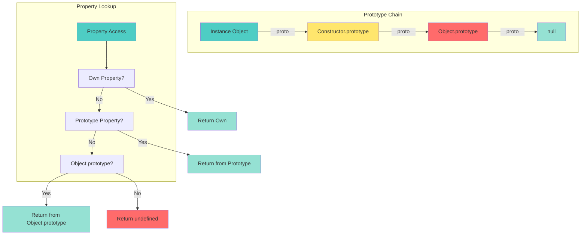
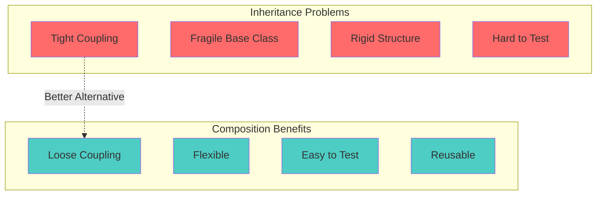

# 📘 **JAVASCRIPT MASTERY - Lesson 3: Objects, Prototypes & Classes**

**Date**: 23-03-26
**Level**: 🟢 Beginner → 🔴 Senior Engineer
**Series**: JavaScript Fundamentals
**Time**: 55 minutes
**Prerequisites**: Lesson 1 (Variables, Types, Scope), Lesson 2 (Functions)

---

- [LastRead](#lastRead)

## 🎯 **LEARNING OBJECTIVES**

After completing this **comprehensive** lesson, you will:

1. ✅ **Master Object Creation** - Object literals, constructors, Object.create, classes
2. ✅ **Understand Prototypes Deeply** - Prototype chain, inheritance, prototypal nature
3. ✅ **Master ES6 Classes** - Syntax, inheritance, static methods, getters/setters
4. ✅ **Implement Inheritance Patterns** - Classical, prototypal, composition
5. ✅ **Know When to Use What** - Classes vs factories vs object literals
6. ✅ **Advanced Object Patterns** - Mixins, composition over inheritance

---

## 📦 **PART 1: OBJECT CREATION PATTERNS**

### **Four Ways to Create Objects**

```mermaid
graph TB
    subgraph "Object Creation Methods"
        A1[Object Literal<br/>{ }]
        A2[Object.create<br/>Prototype-based]
        A3[Constructor Function<br/>new Keyword]
        A4[ES6 Class<br/>class Keyword]
    end

    subgraph "Use Cases"
        B1[Simple Data]
        B2[Prototype Chain]
        B3[Multiple Instances]
        B4[Modern OOP]
    end

    A1 --> B1
    A2 --> B2
    A3 --> B3
    A4 --> B4

    style A1 fill:#4ecdc4
    style A2 fill:#ffe66d
    style A3 fill:#ff6b6b
    style A4 fill:#95e1d3
```

---

### **Object Literal (Simplest)**

```javascript
// ─────────────────────────────────────────────
// BASIC OBJECT LITERAL
// ─────────────────────────────────────────────
const user = {
  name: "John",
  age: 25,
  email: "john@example.com",

  // Method
  greet() {
    console.log(`Hello, I'm ${this.name}`);
  },

  // Getter
  get info() {
    return `${this.name}, ${this.age} years old`;
  },

  // Setter
  set updateAge(newAge) {
    if (newAge > 0 && newAge < 150) {
      this.age = newAge;
    }
  },
};

console.log(user.name); // "John" (dot notation)
console.log(user["age"]); // 25 (bracket notation)
console.log(user.info); // "John, 25 years old" (getter)
user.updateAge = 26; // setter
user.greet(); // "Hello, I'm John"

// ─────────────────────────────────────────────
// DYNAMIC PROPERTY NAMES
// ─────────────────────────────────────────────
const key = "dynamicKey";
const obj = {
  [key]: "value",
  [`method_${Date.now()}`]() {
    console.log("Dynamic method");
  },
};

// ─────────────────────────────────────────────
// PROPERTY SHORTHAND (ES6)
// ─────────────────────────────────────────────
const name = "John";
const age = 25;

const user2 = {
  name, // Same as name: name
  age, // Same as age: age
};

// ─────────────────────────────────────────────
// METHOD SHORTHAND (ES6)
// ─────────────────────────────────────────────
const user3 = {
  name: "John",
  greet() {
    // Same as greet: function() {}
    console.log(`Hello, ${this.name}`);
  },
};
```

---

### **Object.create (Prototype-based)**

```javascript
// ─────────────────────────────────────────────
// CREATING OBJECTS WITH SPECIFIC PROTOTYPE
// ─────────────────────────────────────────────
const animalPrototype = {
  eats: true,
  walk() {
    console.log("Animal walking");
  },
};

const rabbit = Object.create(animalPrototype);
rabbit.jumps = true;

console.log(rabbit.eats); // true (from prototype)
rabbit.walk(); // "Animal walking" (from prototype)
console.log(rabbit.jumps); // true (own property)

// ─────────────────────────────────────────────
// Object.create WITH PROPERTY DESCRIPTORS
// ─────────────────────────────────────────────
const user4 = Object.create(Object.prototype, {
  name: {
    value: "John",
    writable: true,
    enumerable: true,
    configurable: true,
  },
  age: {
    value: 25,
    writable: false, // Read-only!
    enumerable: true,
    configurable: false,
  },
});

// user4.age = 26;  // ❌ TypeError (or silent fail in non-strict)

// ─────────────────────────────────────────────
// CREATING PURE DICTIONARIES (No Prototype)
// ─────────────────────────────────────────────
const dict = Object.create(null);
dict.key1 = "value1";
dict.key2 = "value2";

console.log(dict.toString); // undefined (no prototype pollution!)

// ─────────────────────────────────────────────
// INHERITANCE WITH Object.create
// ─────────────────────────────────────────────
const personPrototype = {
  greet() {
    return `Hi, I'm ${this.name}`;
  },
};

const employeePrototype = Object.create(personPrototype, {
  work: {
    value() {
      return `${this.name} is working`;
    },
  },
});

const emp = Object.create(employeePrototype);
emp.name = "Jane";

console.log(emp.greet()); // "Hi, I'm Jane" (from personPrototype)
console.log(emp.work()); // "Jane is working" (from employeePrototype)
```

---

### **Constructor Functions (Pre-ES6)**

```javascript
// ─────────────────────────────────────────────
// BASIC CONSTRUCTOR FUNCTION
// ─────────────────────────────────────────────
function Person(name, age) {
  this.name = name;
  this.age = age;

  this.greet = function () {
    return `Hello, I'm ${this.name}`;
  };
}

const john = new Person("John", 25);
const jane = new Person("Jane", 30);

console.log(john.greet()); // "Hello, I'm John"
console.log(jane.greet()); // "Hello, I'm Jane"

// ─────────────────────────────────────────────
// ⚠️ PROBLEM: Methods Created Per Instance
// ─────────────────────────────────────────────
console.log(john.greet === jane.greet); // false (different function instances!)

// ─────────────────────────────────────────────
// ✅ SOLUTION: Add Methods to Prototype
// ─────────────────────────────────────────────
function Person2(name, age) {
  this.name = name;
  this.age = age;
}

// Add method to prototype (shared by all instances)
Person2.prototype.greet = function () {
  return `Hello, I'm ${this.name}`;
};

const john2 = new Person2("John", 25);
const jane2 = new Person2("Jane", 30);

console.log(john2.greet === jane2.greet); // true (same function!)

// ─────────────────────────────────────────────
// INHERITANCE WITH CONSTRUCTOR FUNCTIONS
// ─────────────────────────────────────────────
function Employee(name, age, position) {
  Person2.call(this, name, age); // Call parent constructor
  this.position = position;
}

// Set up prototype chain
Employee.prototype = Object.create(Person2.prototype);
Employee.prototype.constructor = Employee;

// Add employee-specific methods
Employee.prototype.work = function () {
  return `${this.name} is working as ${this.position}`;
};

const emp2 = new Employee("Bob", 35, "Developer");
console.log(emp2.greet()); // "Hello, I'm Bob" (from Person2)
console.log(emp2.work()); // "Bob is working as Developer" (from Employee)
```

---

### **ES6 Classes (Modern Syntax)**

```javascript
// ─────────────────────────────────────────────
// BASIC CLASS SYNTAX
// ─────────────────────────────────────────────
class Person3 {
  // Constructor
  constructor(name, age) {
    this.name = name;
    this.age = age;
  }

  // Instance method (automatically on prototype)
  greet() {
    return `Hello, I'm ${this.name}`;
  }

  // Getter
  get info() {
    return `${this.name}, ${this.age} years old`;
  }

  // Setter
  set updateAge(newAge) {
    if (newAge > 0 && newAge < 150) {
      this.age = newAge;
    }
  }

  // Static method (on class, not instances)
  static createAnonymous() {
    return new Person3("Anonymous", 0);
  }

  // Static property (ES2022+)
  static species = "Homo sapiens";
}

const person = new Person3("John", 25);
console.log(person.greet()); // "Hello, I'm John"
console.log(person.info); // "John, 25 years old"
person.updateAge = 26;

console.log(Person3.species); // "Homo sapiens"
const anon = Person3.createAnonymous(); // Static method

// ─────────────────────────────────────────────
// CLASS INHERITANCE (extends)
// ─────────────────────────────────────────────
class Employee2 extends Person3 {
  constructor(name, age, position) {
    super(name, age); // Call parent constructor
    this.position = position;
  }

  // Override parent method
  greet() {
    return `Hi, I'm ${this.name}, the ${this.position}`;
  }

  // New method
  work() {
    return `${this.name} is working as ${this.position}`;
  }

  // Call parent method with super
  greetFormal() {
    return super.greet(); // Call Person3's greet
  }
}

const emp3 = new Employee2("Alice", 28, "Manager");
console.log(emp3.greet()); // "Hi, I'm Alice, the Manager"
console.log(emp3.greetFormal()); // "Hello, I'm Alice" (from parent)
console.log(emp3.work()); // "Alice is working as Manager"

// ─────────────────────────────────────────────
// PRIVATE CLASS FIELDS (ES2022+)
// ─────────────────────────────────────────────
class BankAccount {
  // Private field (truly private)
  #balance = 0;
  #pin;

  constructor(initialBalance, pin) {
    this.#balance = initialBalance;
    this.#pin = pin;
  }

  // Private method
  #validatePin(pin) {
    return pin === this.#pin;
  }

  deposit(amount) {
    if (amount > 0) {
      this.#balance += amount;
      return this.#balance;
    }
    throw new Error("Invalid amount");
  }

  withdraw(amount, pin) {
    if (!this.#validatePin(pin)) {
      throw new Error("Invalid PIN");
    }

    if (amount > this.#balance) {
      throw new Error("Insufficient funds");
    }

    this.#balance -= amount;
    return this.#balance;
  }

  get balance() {
    return this.#balance;
  }
}

const account = new BankAccount(1000, 1234);
console.log(account.balance); // 1000
account.deposit(500);
console.log(account.balance); // 1500

// console.log(account.#balance);  // ❌ SyntaxError (truly private!)
account.withdraw(200, 1234); // ✅ Works
// account.withdraw(200, 0000);  // ❌ Error
```

---

## 📦 **PART 2: PROTOTYPES DEEP DIVE**

### **Understanding the Prototype Chain**

## lastRead



---

### **Prototype Chain in Action**

```javascript
// ─────────────────────────────────────────────
// VISUALIZING PROTOTYPE CHAIN
// ─────────────────────────────────────────────
function Animal(name) {
  this.name = name;
}

Animal.prototype.eat = function () {
  return `${this.name} is eating`;
};

function Dog(name, breed) {
  Animal.call(this, name);
  this.breed = breed;
}

// Set up prototype chain
Dog.prototype = Object.create(Animal.prototype);
Dog.prototype.constructor = Dog;

Dog.prototype.bark = function () {
  return `${this.name} is barking`;
};

const myDog = new Dog("Buddy", "Golden Retriever");

// ─────────────────────────────────────────────
// PROPERTY LOOKUP
// ─────────────────────────────────────────────
console.log(myDog.name); // "Buddy" (own property)
console.log(myDog.breed); // "Golden Retriever" (own property)
console.log(myDog.bark()); // "Buddy is barking" (Dog.prototype)
console.log(myDog.eat()); // "Buddy is eating" (Animal.prototype)

// ─────────────────────────────────────────────
// PROTOTYPE CHAIN INSPECTION
// ─────────────────────────────────────────────
console.log(myDog.__proto__ === Dog.prototype); // true
console.log(Dog.prototype.__proto__ === Animal.prototype); // true
console.log(Animal.prototype.__proto__ === Object.prototype); // true
console.log(Object.prototype.__proto__ === null); // true

// Modern way (preferred)
console.log(Object.getPrototypeOf(myDog) === Dog.prototype); // true

// ─────────────────────────────────────────────
// HAS OWN PROPERTY VS PROTOTYPE
// ─────────────────────────────────────────────
console.log(myDog.hasOwnProperty("name")); // true (own property)
console.log(myDog.hasOwnProperty("breed")); // true (own property)
console.log(myDog.hasOwnProperty("bark")); // false (on prototype)
console.log(myDog.hasOwnProperty("eat")); // false (on prototype chain)

// Check including prototype chain
console.log("name" in myDog); // true
console.log("bark" in myDog); // true
console.log("toString" in myDog); // true (from Object.prototype)

// ─────────────────────────────────────────────
// ENUMERATING PROPERTIES
// ─────────────────────────────────────────────
// for...in includes prototype chain
for (let key in myDog) {
  console.log(key); // name, breed, bark, eat
}

// Object.keys only own enumerable properties
console.log(Object.keys(myDog)); // ["name", "breed"]

// Object.getOwnPropertyNames (including non-enumerable)
console.log(Object.getOwnPropertyNames(myDog)); // ["name", "breed"]

// ─────────────────────────────────────────────
// MODIFYING PROTOTYPES
// ─────────────────────────────────────────────
// Add method to existing prototype
Animal.prototype.sleep = function () {
  return `${this.name} is sleeping`;
};

console.log(myDog.sleep()); // "Buddy is sleeping" (works on existing instances!)

// Override method in child prototype
Dog.prototype.eat = function () {
  return `${this.name} the ${this.breed} is eating`;
};

console.log(myDog.eat()); // "Buddy the Golden Retriever is eating"
```

---

### **Prototypal Inheritance Pattern**

```javascript
// ─────────────────────────────────────────────
// PURE PROTOTYPAL INHERITANCE
// ─────────────────────────────────────────────
const animal = {
  init(name) {
    this.name = name;
    return this;
  },
  eat() {
    return `${this.name} is eating`;
  },
};

const dog = Object.create(animal, {
  breed: {
    value: null,
    writable: true,
    configurable: true,
    enumerable: true,
  },
  bark: {
    value() {
      return `${this.name} is barking`;
    },
  },
});

dog.init("Buddy");
dog.breed = "Golden Retriever";

console.log(dog.eat()); // "Buddy is eating" (from animal)
console.log(dog.bark()); // "Buddy is barking" (own method)

// ─────────────────────────────────────────────
// OBJECT SET PROTOTYPE (ES6)
// ─────────────────────────────────────────────
const flyable = {
  fly() {
    return `${this.name} is flying`;
  },
};

const bird = {
  name: "Eagle",
  wingSpan: 200,
};

// Set prototype after creation
Object.setPrototypeOf(bird, flyable);

console.log(bird.fly()); // "Eagle is flying"
```

---

## 📦 **PART 3: COMPOSITION OVER INHERITANCE**

### **Why Composition > Inheritance**



---

### **Mixins Pattern**

```javascript
// ─────────────────────────────────────────────
// MIXIN: Reusable Behavior
// ─────────────────────────────────────────────
const canEat = {
  eat() {
    return `${this.name} is eating`;
  },
};

const canWalk = {
  walk() {
    return `${this.name} is walking`;
  },
};

const canSwim = {
  swim() {
    return `${this.name} is swimming`;
  },
};

// ─────────────────────────────────────────────
// MIXIN WITH Object.assign
// ─────────────────────────────────────────────
function createAnimal(name, capabilities = []) {
  const animal = { name };

  capabilities.forEach((capability) => {
    Object.assign(animal, capability);
  });

  return animal;
}

const fish = createAnimal("Nemo", [canEat, canSwim]);
const dog2 = createAnimal("Buddy", [canEat, canWalk]);

console.log(fish.eat()); // "Nemo is eating"
console.log(fish.swim()); // "Nemo is swimming"
// console.log(fish.walk());  // ❌ undefined

console.log(dog2.eat()); // "Buddy is eating"
console.log(dog2.walk()); // "Buddy is walking"

// ─────────────────────────────────────────────
// ADVANCED MIXIN WITH METHOD CHAINING
// ─────────────────────────────────────────────
const EventEmitterMixin = {
  on(event, callback) {
    if (!this._events) this._events = {};
    if (!this._events[event]) this._events[event] = [];
    this._events[event].push(callback);
    return this;
  },

  emit(event, data) {
    if (!this._events || !this._events[event]) return this;
    this._events[event].forEach((callback) => callback(data));
    return this;
  },

  off(event, callback) {
    if (!this._events || !this._events[event]) return this;
    this._events[event] = this._events[event].filter((cb) => cb !== callback);
    return this;
  },
};

const LoggerMixin = {
  log(message) {
    console.log(`[${this.name}] ${message}`);
    return this;
  },

  error(message) {
    console.error(`[${this.name}] ERROR: ${message}`);
    return this;
  },
};

// Create class with mixins
class User {
  constructor(name) {
    this.name = name;
  }
}

// Apply mixins to prototype
Object.assign(User.prototype, EventEmitterMixin, LoggerMixin);

const user = new User("John");
user.on("greet", (data) => console.log(`Hello, ${data}!`));
user.emit("greet", "World"); // "Hello, World!"
user.log("User created"); // "[John] User created"
```

---

### **Function Composition Pattern**

```javascript
// ─────────────────────────────────────────────
// COMPOSE MULTIPLE BEHAVIORS
// ─────────────────────────────────────────────
function withLogging(obj) {
  return new Proxy(obj, {
    get(target, prop) {
      const value = target[prop];
      if (typeof value === "function") {
        return function (...args) {
          console.log(`Calling ${prop} with`, args);
          return value.apply(this, args);
        };
      }
      return value;
    },
  });
}

function withValidation(obj) {
  return new Proxy(obj, {
    set(target, prop, value) {
      if (prop === "age" && (value < 0 || value > 150)) {
        throw new Error("Invalid age");
      }
      target[prop] = value;
      return true;
    },
  });
}

function withCache(obj) {
  const cache = {};
  return new Proxy(obj, {
    get(target, prop) {
      if (typeof target[prop] === "function") {
        return function (...args) {
          const key = `${prop}_${JSON.stringify(args)}`;
          if (cache[key]) {
            console.log(`Cache hit for ${key}`);
            return cache[key];
          }
          const result = target[prop].apply(this, args);
          cache[key] = result;
          return result;
        };
      }
      return target[prop];
    },
  });
}

// Base object
const calculator = {
  add(a, b) {
    console.log("Computing add...");
    return a + b;
  },
  multiply(a, b) {
    console.log("Computing multiply...");
    return a * b;
  },
};

// Compose all behaviors
const enhancedCalculator = withCache(withValidation(withLogging(calculator)));

console.log(enhancedCalculator.add(2, 3)); // Logs, computes
console.log(enhancedCalculator.add(2, 3)); // Cache hit!
```

---

## ✅ **OBJECTS & PROTOTYPES CHECKLIST**

```
Object Creation
[ ] Object literal for simple data
[ ] Object.create for prototype control
[ ] Constructor functions (legacy)
[ ] ES6 classes (modern)

Prototypes
[ ] Understand prototype chain
[ ] Property lookup mechanism
[ ] hasOwnProperty vs 'in' operator
[ ] Modifying prototypes dynamically

Classes
[ ] Class syntax and features
[ ] Inheritance with extends
[ ] Static methods and properties
[ ] Private fields and methods

Composition
[ ] Mixins for reusable behavior
[ ] Function composition
[ ] Object.assign for combining
[ ] Prefer composition over inheritance
```

---

## 🎯 **KNOWLEDGE CHECK**

### **Question 1: Prototype Chain**

What will this code output?

```javascript
function Animal(name) {
  this.name = name;
}
Animal.prototype.eat = function () {
  return `${this.name} is eating`;
};

function Dog(name, breed) {
  Animal.call(this, name);
  this.breed = breed;
}
Dog.prototype = Object.create(Animal.prototype);
Dog.prototype.bark = function () {
  return `${this.name} is barking`;
};

const myDog = new Dog("Buddy", "Golden");

console.log(myDog.name);
console.log(myDog.breed);
console.log(myDog.eat());
console.log(myDog.bark());
console.log(myDog.toString());
```

<details>
<summary>💡 Click to reveal answer</summary>

```javascript
console.log(myDog.name); // "Buddy" (own property)
console.log(myDog.breed); // "Golden" (own property)
console.log(myDog.eat()); // "Buddy is eating" (from Animal.prototype)
console.log(myDog.bark()); // "Buddy is barking" (from Dog.prototype)
console.log(myDog.toString()); // "[object Object]" (from Object.prototype)
```

**Explanation**: Property lookup goes: own properties → Dog.prototype → Animal.prototype → Object.prototype

</details>

---

### **Question 2: Class Inheritance**

Create a class hierarchy: `Vehicle` → `Car` → `ElectricCar`

<details>
<summary>💡 Click to reveal answer</summary>

```javascript
class Vehicle {
  constructor(brand, speed) {
    this.brand = brand;
    this.speed = speed;
  }

  move() {
    return `${this.brand} is moving at ${this.speed} km/h`;
  }
}

class Car extends Vehicle {
  constructor(brand, speed, fuelType) {
    super(brand, speed);
    this.fuelType = fuelType;
  }

  refuel() {
    return `Refueling with ${this.fuelType}`;
  }
}

class ElectricCar extends Car {
  constructor(brand, speed, batteryCapacity) {
    super(brand, speed, "Electric");
    this.batteryCapacity = batteryCapacity;
  }

  charge() {
    return `Charging ${this.batteryCapacity}kWh battery`;
  }

  // Override parent method
  refuel() {
    return this.charge();
  }
}

const tesla = new ElectricCar("Tesla", 250, 100);
console.log(tesla.move()); // "Tesla is moving at 250 km/h"
console.log(tesla.refuel()); // "Charging 100kWh battery"
console.log(tesla.charge()); // "Charging 100kWh battery"
```

</details>

---

## 📚 **ADDITIONAL RESOURCES**

- **MDN**: [Inheritance and the prototype chain](https://developer.mozilla.org/en-US/docs/Web/JavaScript/Inheritance_and_the_prototype_chain)
- **You Don't Know JS**: [this & Object Prototypes](https://github.com/getify/You-Dont-Know-JS)
- **JavaScript Info**: [Prototypes, inheritance](https://javascript.info/prototypes)

---

## 🎓 **HOMEWORK**

1. ✅ Create a class hierarchy for a banking system
2. ✅ Implement mixins for a game character system
3. ✅ Build a composition-based plugin architecture
4. ✅ Create objects with all 4 creation methods and compare
5. ✅ Implement a prototype chain visualization tool

---

**Next Lesson**: Async Programming - Callbacks, Promises, Async/Await, Event Loop
**Date**: 23-03-26
**Status**: ✅ Complete

---

-23-03-26
