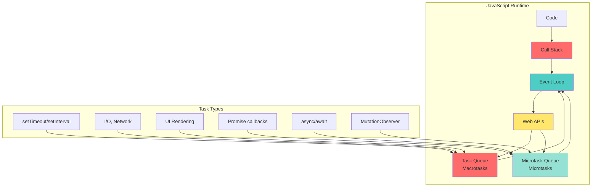
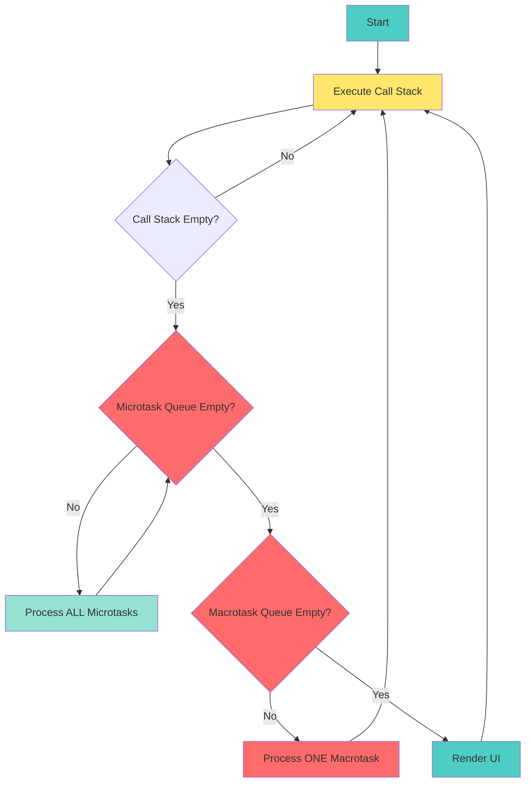
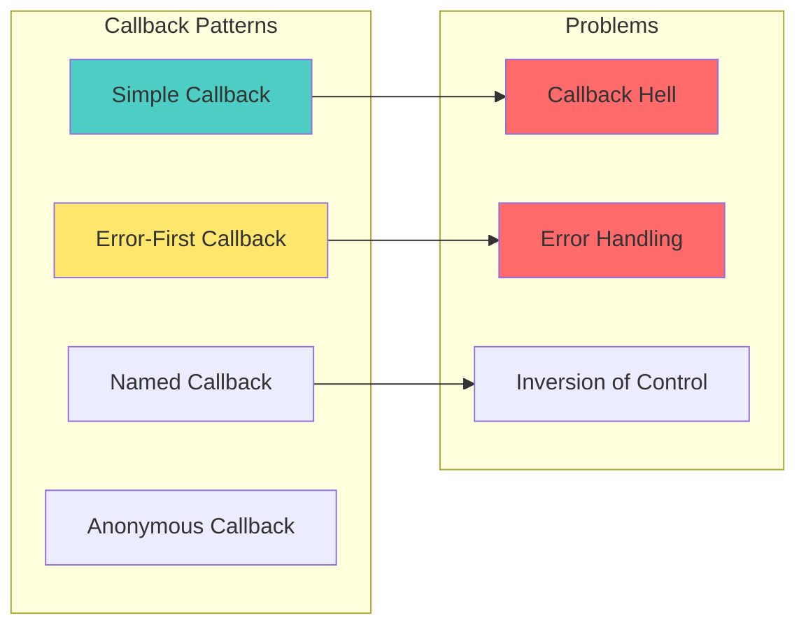
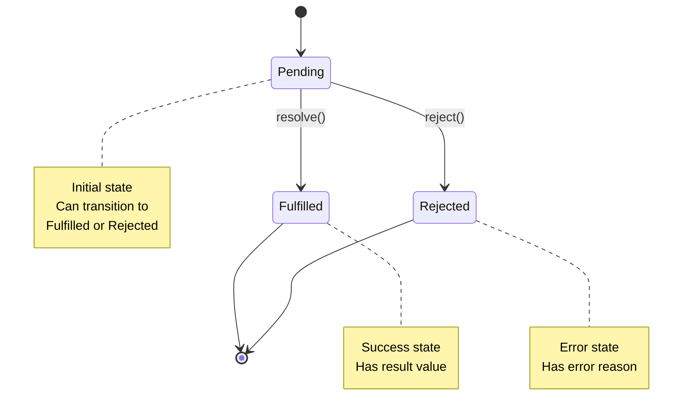
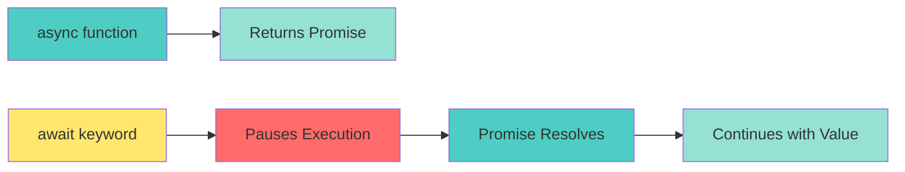

# 📘 **JAVASCRIPT MASTERY - Lesson 4: Async Programming**

**Date**: 23-03-26
**Level**: 🟢 Beginner → 🔴 Senior Engineer
**Series**: JavaScript Fundamentals
**Time**: 60 minutes
**Prerequisites**: Lesson 1-3 (Foundations, Functions, Objects/Prototypes)

---

## 🎯 **LEARNING OBJECTIVES**

After completing this **comprehensive** lesson, you will:

1. ✅ **Understand the Event Loop** - Call stack, task queue, microtask queue, rendering
2. ✅ **Master Callbacks** - Callback patterns, error-first callbacks, callback hell
3. ✅ **Master Promises** - Promise states, chaining, error handling, Promise API
4. ✅ **Master Async/Await** - Syntactic sugar, error handling, parallel execution
5. ✅ **Handle Async Patterns** - Race conditions, timeouts, retries, cancellation
6. ✅ **Debug Async Code** - Common pitfalls, best practices, production patterns

---

## 📦 **PART 1: THE EVENT LOOP DEEP DIVE**

### **JavaScript Runtime Architecture**



---

### **Event Loop Execution Flow**



---

### **Event Loop in Action**

```javascript
// ─────────────────────────────────────────────
// DEMONSTRATION: Event Loop Order
// ─────────────────────────────────────────────
console.log("1. Script start");

setTimeout(() => {
  console.log("2. setTimeout (macrotask)");
}, 0);

Promise.resolve().then(() => {
  console.log("3. Promise.then (microtask)");
});

console.log("4. Script end");

// Output Order:
// 1. Script start
// 4. Script end
// 3. Promise.then (microtask)  ← Microtasks run BEFORE macrotasks
// 2. setTimeout (macrotask)

// ─────────────────────────────────────────────
// DEMONSTRATION: Microtask Priority
// ─────────────────────────────────────────────
console.log("A. Start");

setTimeout(() => {
  console.log("B. setTimeout 1");
  
  Promise.resolve().then(() => {
    console.log("C. Promise inside setTimeout");
  });
}, 0);

Promise.resolve().then(() => {
  console.log("D. Promise 1");
  
  setTimeout(() => {
    console.log("E. setTimeout inside Promise");
  }, 0);
});

console.log("F. End");

// Output Order:
// A. Start
// F. End
// D. Promise 1                    ← Microtask from main script
// E. setTimeout inside Promise    ← Macrotask scheduled by Promise
// B. setTimeout 1                 ← Original macrotask
// C. Promise inside setTimeout    ← Microtask scheduled by setTimeout

// ─────────────────────────────────────────────
// DEMONSTRATION: Multiple Microtasks
// ─────────────────────────────────────────────
Promise.resolve().then(() => {
  console.log("1. First microtask");
  Promise.resolve().then(() => {
    console.log("2. Nested microtask");
  });
});

Promise.resolve().then(() => {
  console.log("3. Second microtask");
});

setTimeout(() => {
  console.log("4. Macrotask");
}, 0);

console.log("5. Synchronous");

// Output Order:
// 5. Synchronous
// 1. First microtask
// 2. Nested microtask         ← ALL microtasks processed before macrotask
// 3. Second microtask
// 4. Macrotask

// ─────────────────────────────────────────────
// KEY INSIGHT: Microtasks vs Macrotasks
// ─────────────────────────────────────────────
// Microtasks (processed FIRST, all at once):
// - Promise.then/catch/finally
// - async/await (under the hood)
// - MutationObserver
// - queueMicrotask()

// Macrotasks (processed ONE at a time):
// - setTimeout/setInterval
// - setInterval
// - I/O operations
// - UI rendering
// - setImmediate (Node.js)
```

---

## 📦 **PART 2: CALLBACKS**

### **Callback Fundamentals**



---

### **Callback Patterns**

```javascript
// ─────────────────────────────────────────────
// SIMPLE CALLBACK
// ─────────────────────────────────────────────
function fetchData(callback) {
  setTimeout(() => {
    const data = { id: 1, name: "John" };
    callback(data);
  }, 1000);
}

fetchData((data) => {
  console.log("Received:", data);
});

// ─────────────────────────────────────────────
// ERROR-FIRST CALLBACK (Node.js Pattern)
// ─────────────────────────────────────────────
function readFile(path, callback) {
  setTimeout(() => {
    const error = null;  // or new Error("File not found")
    const content = "File content";
    
    callback(error, content);  // Error first, data second
  }, 1000);
}

readFile("/path/to/file", (err, data) => {
  if (err) {
    console.error("Error:", err);
    return;
  }
  console.log("Content:", data);
});

// ─────────────────────────────────────────────
// ❌ CALLBACK HELL (Pyramid of Doom)
// ─────────────────────────────────────────────
getUser(userId, (err, user) => {
  if (err) return handleError(err);
  
  getPosts(user.id, (err, posts) => {
    if (err) return handleError(err);
    
    getComments(posts[0].id, (err, comments) => {
      if (err) return handleError(err);
      
      getLikes(comments[0].id, (err, likes) => {
        if (err) return handleError(err);
        
        // Finally have all data...
        console.log({ user, posts, comments, likes });
      });
    });
  });
});

// ─────────────────────────────────────────────
// ✅ SOLUTION: Named Functions
// ─────────────────────────────────────────────
function getUserData(userId, callback) {
  getUser(userId, handleUser);
}

function handleUser(err, user) {
  if (err) return handleError(err);
  getPosts(user.id, handlePosts);
}

function handlePosts(err, posts) {
  if (err) return handleError(err);
  getComments(posts[0].id, handleComments);
}

function handleComments(err, comments) {
  if (err) return handleError(err);
  getLikes(comments[0].id, handleLikes);
}

function handleLikes(err, likes) {
  if (err) return handleError(err);
  // Process all data
}
```

---

## 📦 **PART 3: PROMISES**

### **Promise States & Lifecycle**



---

### **Promise Fundamentals**

```javascript
// ─────────────────────────────────────────────
// CREATING PROMISES
// ─────────────────────────────────────────────
const promise = new Promise((resolve, reject) => {
  // Async operation
  setTimeout(() => {
    const success = true;
    const data = { id: 1, name: "John" };
    
    if (success) {
      resolve(data);  // Promise fulfilled
    } else {
      reject(new Error("Operation failed"));  // Promise rejected
    }
  }, 1000);
});

// ─────────────────────────────────────────────
// CONSUMING PROMISES
// ─────────────────────────────────────────────
promise
  .then((data) => {
    console.log("Success:", data);
    return data.id;  // Can return value for next .then()
  })
  .then((id) => {
    console.log("ID:", id);
  })
  .catch((error) => {
    console.error("Error:", error);
  })
  .finally(() => {
    console.log("Always runs (cleanup)");
  });

// ─────────────────────────────────────────────
// PROMISE STATES
// ─────────────────────────────────────────────
// Pending: Initial state (neither fulfilled nor rejected)
// Fulfilled: Operation completed successfully
// Rejected: Operation failed

const pending = new Promise(() => {});  // Stays pending forever
const fulfilled = Promise.resolve("Success!");  // Already fulfilled
const rejected = Promise.reject(new Error("Failed!"));  // Already rejected

// ─────────────────────────────────────────────
// PROMISE CHAINING
// ─────────────────────────────────────────────
fetchUser(1)
  .then((user) => {
    console.log("User:", user);
    return fetchPosts(user.id);  // Return new promise
  })
  .then((posts) => {
    console.log("Posts:", posts);
    return fetchComments(posts[0].id);  // Chain continues
  })
  .then((comments) => {
    console.log("Comments:", comments);
  })
  .catch((error) => {
    // Catches errors from ANY step in the chain
    console.error("Error:", error);
  });

// ─────────────────────────────────────────────
// ERROR PROPAGATION IN CHAINS
// ─────────────────────────────────────────────
Promise.resolve()
  .then(() => {
    throw new Error("Error 1");  // Throws in .then
  })
  .catch((err) => {
    console.error("Caught:", err.message);
    return "Recovery value";  // Can recover and continue
  })
  .then((value) => {
    console.log("Recovered with:", value);
  });

// ─────────────────────────────────────────────
// PROMISE API METHODS
// ─────────────────────────────────────────────
// Promise.all: Wait for ALL promises (fail fast)
const promise1 = Promise.resolve(1);
const promise2 = Promise.resolve(2);
const promise3 = Promise.resolve(3);

Promise.all([promise1, promise2, promise3])
  .then((values) => {
    console.log("All values:", values);  // [1, 2, 3]
  })
  .catch((error) => {
    // Rejects if ANY promise rejects
    console.error("One failed:", error);
  });

// Promise.allSettled: Wait for ALL to settle (no fail fast)
Promise.allSettled([
  Promise.resolve(1),
  Promise.reject(new Error("Failed")),
  Promise.resolve(3),
]).then((results) => {
  console.log(results);
  // [
  //   { status: "fulfilled", value: 1 },
  //   { status: "rejected", reason: Error: Failed },
  //   { status: "fulfilled", value: 3 }
  // ]
});

// Promise.race: First to settle wins
Promise.race([
  new Promise(resolve => setTimeout(() => resolve("Slow"), 1000)),
  new Promise(resolve => setTimeout(() => resolve("Fast"), 100)),
]).then((winner) => {
  console.log("Winner:", winner);  // "Fast"
});

// Promise.any: First FULFILLED wins (ignores rejections)
Promise.any([
  Promise.reject(new Error("Failed 1")),
  Promise.resolve("Success!"),
  Promise.reject(new Error("Failed 2")),
]).then((winner) => {
  console.log("Winner:", winner);  // "Success!"
});
```

---

### **Promise Patterns**

```javascript
// ─────────────────────────────────────────────
// PROMISIFYING CALLBACKS
// ─────────────────────────────────────────────
function readFile(path) {
  return new Promise((resolve, reject) => {
    fs.readFile(path, 'utf8', (err, data) => {
      if (err) reject(err);
      else resolve(data);
    });
  });
}

// Node.js util.promisify
const { promisify } = require('util');
const readFile2 = promisify(fs.readFile);

// ─────────────────────────────────────────────
// PROMISE WITH TIMEOUT
// ─────────────────────────────────────────────
function withTimeout(promise, ms) {
  const timeout = new Promise((_, reject) => {
    setTimeout(() => reject(new Error(`Timeout after ${ms}ms`)), ms);
  });
  
  return Promise.race([promise, timeout]);
}

// Usage
withTimeout(fetchData(), 5000)
  .then((data) => console.log("Data:", data))
  .catch((err) => console.error("Error:", err.message));

// ─────────────────────────────────────────────
// RETRY PATTERN
// ─────────────────────────────────────────────
function retry(fn, retries = 3, delay = 1000) {
  return new Promise((resolve, reject) => {
    function attempt(n) {
      fn()
        .then(resolve)
        .catch((err) => {
          if (n >= retries) {
            reject(err);
          } else {
            setTimeout(() => attempt(n + 1), delay);
          }
        });
    }
    attempt(1);
  });
}

// Usage
retry(() => fetchWithRandomFailure(), 3, 1000)
  .then((data) => console.log("Success:", data))
  .catch((err) => console.error("Failed after retries:", err));

// ─────────────────────────────────────────────
// SEQUENTIAL PROMISE EXECUTION
// ─────────────────────────────────────────────
const tasks = [
  () => fetchUser(1),
  () => fetchPosts(1),
  () => fetchComments(1),
];

// Run sequentially (each waits for previous)
tasks.reduce(
  (promiseChain, currentTask) => promiseChain.then(currentTask),
  Promise.resolve()
).then((result) => {
  console.log("All tasks completed:", result);
});

// ─────────────────────────────────────────────
// PARALLEL EXECUTION WITH CONCURRENCY LIMIT
// ─────────────────────────────────────────────
async function batchProcess(items, processor, concurrency = 5) {
  const results = [];
  const executing = [];
  
  for (const item of items) {
    const promise = processor(item).then((result) => {
      executing.splice(executing.indexOf(promise), 1);
      return result;
    });
    
    results.push(promise);
    executing.push(promise);
    
    if (executing.length >= concurrency) {
      await Promise.race(executing);
    }
  }
  
  return Promise.all(results);
}
```

---

## 📦 **PART 4: ASYNC/AWAIT**

### **Async/Await Fundamentals**



---

### **Async/Await Syntax**

```javascript
// ─────────────────────────────────────────────
// BASIC ASYNC/AWAIT
// ─────────────────────────────────────────────
async function getUserData() {
  // await pauses execution until promise resolves
  const user = await fetchUser(1);
  const posts = await fetchPosts(user.id);
  const comments = await fetchComments(posts[0].id);
  
  return { user, posts, comments };
}

// Equivalent to Promise chain
function getUserDataChain() {
  return fetchUser(1)
    .then(user => fetchPosts(user.id))
    .then(posts => fetchComments(posts[0].id))
    .then(comments => ({ user, posts, comments }));
}

// ─────────────────────────────────────────────
// ERROR HANDLING WITH TRY/CATCH
// ─────────────────────────────────────────────
async function getUserDataSafe() {
  try {
    const user = await fetchUser(1);
    const posts = await fetchPosts(user.id);
    const comments = await fetchComments(posts[0].id);
    
    return { user, posts, comments };
  } catch (error) {
    console.error("Error fetching data:", error);
    throw error;  // Re-throw or return default value
  }
}

// ─────────────────────────────────────────────
// MULTIPLE ERROR HANDLING
// ─────────────────────────────────────────────
async function fetchAllData() {
  try {
    const user = await fetchUser(1);
    
    try {
      const posts = await fetchPosts(user.id);
    } catch (postError) {
      console.error("Failed to fetch posts:", postError);
      // Continue with other data
    }
    
    try {
      const comments = await fetchComments(1);
    } catch (commentError) {
      console.error("Failed to fetch comments:", commentError);
    }
    
  } catch (userError) {
    console.error("Failed to fetch user:", userError);
    throw userError;  // Critical error, stop everything
  }
}

// ─────────────────────────────────────────────
// PARALLEL EXECUTION WITH ASYNC/AWAIT
// ─────────────────────────────────────────────
// ❌ SLOW: Sequential (one after another)
async function fetchSequential() {
  const user = await fetchUser(1);      // Wait 1s
  const posts = await fetchPosts(1);    // Wait 1s
  const comments = await fetchComments(1); // Wait 1s
  // Total: 3 seconds
  
  return { user, posts, comments };
}

// ✅ FAST: Parallel (all at once)
async function fetchParallel() {
  const [user, posts, comments] = await Promise.all([
    fetchUser(1),
    fetchPosts(1),
    fetchComments(1),
  ]);
  // Total: ~1 second
  
  return { user, posts, comments };
}

// ✅ FAST: Parallel with Object Destructuring
async function fetchParallelNamed() {
  const [user, posts, comments] = await Promise.all([
    fetchUser(1),
    fetchPosts(1),
    fetchComments(1),
  ]);
  
  return { user, posts, comments };
}

// ─────────────────────────────────────────────
// ASYNC/AWAIT IN LOOPS
// ─────────────────────────────────────────────
// ❌ SLOW: Sequential with for...of
async function fetchUsersSequential(ids) {
  const users = [];
  for (const id of ids) {
    const user = await fetchUser(id);  // Wait for each
    users.push(user);
  }
  return users;
}

// ✅ FAST: Parallel with Promise.all
async function fetchUsersParallel(ids) {
  const promises = ids.map(id => fetchUser(id));
  return Promise.all(promises);
}

// ✅ CONTROLLED: With concurrency limit
async function fetchUsersBatched(ids, batchSize = 5) {
  const users = [];
  
  for (let i = 0; i < ids.length; i += batchSize) {
    const batch = ids.slice(i, i + batchSize);
    const batchUsers = await Promise.all(batch.map(id => fetchUser(id)));
    users.push(...batchUsers);
  }
  
  return users;
}

// ─────────────────────────────────────────────
// ASYNC IIFE (Immediately Invoked Function Expression)
// ─────────────────────────────────────────────
// Can't use await at top level (unless in ES modules)
(async () => {
  const user = await fetchUser(1);
  console.log("User:", user);
})();

// Modern: Top-level await (ES modules only)
// const user = await fetchUser(1);  // Works in .mjs or type: "module"
```

---

## 📦 **PART 5: ADVANCED ASYNC PATTERNS**

### **Race Conditions & Solutions**

```javascript
// ─────────────────────────────────────────────
// RACE CONDITION PROBLEM
// ─────────────────────────────────────────────
let userData = null;

async function fetchUserData(userId) {
  const data = await fetchUser(userId);
  userData = data;  // Might be overwritten by older request!
}

// User clicks: User 1 → User 2 → User 3
// Responses arrive: User 3 → User 1 → User 2
// Final userData: User 2 (wrong!)

// ─────────────────────────────────────────────
// SOLUTION 1: AbortController
// ─────────────────────────────────────────────
let controller = null;

async function fetchUserWithAbort(userId) {
  // Cancel previous request
  if (controller) {
    controller.abort();
  }
  
  controller = new AbortController();
  
  try {
    const response = await fetch(`/api/users/${userId}`, {
      signal: controller.signal,
    });
    return response.json();
  } catch (error) {
    if (error.name === 'AbortError') {
      console.log("Request aborted");
      return null;
    }
    throw error;
  }
}

// ─────────────────────────────────────────────
// SOLUTION 2: Request ID Tracking
// ─────────────────────────────────────────────
let latestRequestId = 0;

async function fetchUserWithTracking(userId) {
  const requestId = ++latestRequestId;
  
  const data = await fetchUser(userId);
  
  // Only update if this is still the latest request
  if (requestId === latestRequestId) {
    userData = data;
    return data;
  }
  
  return null;  // Stale request, ignore
}
```

---

### **Async Generator Functions**

```javascript
// ─────────────────────────────────────────────
// ASYNC GENERATORS
// ─────────────────────────────────────────────
async function* fetchPages(baseUrl, totalPages) {
  for (let page = 1; page <= totalPages; page++) {
    const response = await fetch(`${baseUrl}?page=${page}`);
    const data = await response.json();
    yield data;  // Yield each page as it arrives
  }
}

// Consume async generator
(async () => {
  for await (const page of fetchPages('/api/items', 10)) {
    console.log("Page:", page);
  }
})();

// ─────────────────────────────────────────────
// ASYNC ITERABLE
// ─────────────────────────────────────────────
const asyncIterable = {
  async *[Symbol.asyncIterator]() {
    let i = 0;
    while (i < 5) {
      await new Promise(resolve => setTimeout(resolve, 1000));
      yield ++i;
    }
  },
};

(async () => {
  for await (const num of asyncIterable) {
    console.log(num);  // 1, 2, 3, 4, 5 (one per second)
  }
})();
```

---

## ✅ **ASYNC PROGRAMMING CHECKLIST**

```
Event Loop
[ ] Understand call stack, task queue, microtask queue
[ ] Know microtask vs macrotask priority
[ ] Predict execution order of async code

Callbacks
[ ] Error-first callback pattern
[ ] Recognize callback hell
[ ] Refactor callbacks to promises

Promises
[ ] Create and consume promises
[ ] Chain promises correctly
[ ] Handle errors with .catch()
[ ] Use Promise.all, allSettled, race, any

Async/Await
[ ] Write async functions
[ ] Handle errors with try/catch
[ ] Execute in parallel with Promise.all
[ ] Avoid sequential await in loops

Advanced Patterns
[ ] Handle race conditions
[ ] Implement retry logic
[ ] Use AbortController for cancellation
[ ] Create async generators
```

---

## 🎯 **KNOWLEDGE CHECK**

### **Question 1: Event Loop Order**

What is the output order?

```javascript
console.log("1");

setTimeout(() => console.log("2"), 0);

Promise.resolve().then(() => console.log("3"));

console.log("4");
```

<details>
<summary>💡 Click to reveal answer</summary>

**Output**: 1, 4, 3, 2

**Explanation**:
1. `console.log("1")` - Synchronous, runs immediately
2. `console.log("4")` - Synchronous, runs immediately
3. `Promise.then` - Microtask, runs after sync code
4. `setTimeout` - Macrotask, runs after all microtasks
</details>

---

### **Question 2: Fix the Race Condition**

Fix this code to handle rapid user clicks:

```javascript
let results = null;

async function search(query) {
  const response = await fetch(`/api/search?q=${query}`);
  results = await response.json();
  display(results);
}
```

<details>
<summary>💡 Click to reveal answer</summary>

**Solution 1**: AbortController
```javascript
let controller = null;

async function search(query) {
  if (controller) controller.abort();
  
  controller = new AbortController();
  
  try {
    const response = await fetch(`/api/search?q=${query}`, {
      signal: controller.signal,
    });
    const results = await response.json();
    display(results);
  } catch (error) {
    if (error.name !== 'AbortError') {
      console.error(error);
    }
  }
}
```

**Solution 2**: Request ID
```javascript
let requestId = 0;

async function search(query) {
  const currentId = ++requestId;
  
  const response = await fetch(`/api/search?q=${query}`);
  const results = await response.json();
  
  if (currentId === requestId) {
    display(results);
  }
}
```
</details>

---

### **Question 3: Parallel vs Sequential**

Rewrite to fetch in parallel:

```javascript
async function fetchData() {
  const user = await fetchUser(1);
  const posts = await fetchPosts(user.id);
  const comments = await fetchComments(posts[0].id);
  return { user, posts, comments };
}
```

<details>
<summary>💡 Click to reveal answer</summary>

```javascript
async function fetchData() {
  const [user, posts, comments] = await Promise.all([
    fetchUser(1),
    fetchPosts(1),
    fetchComments(1),
  ]);
  return { user, posts, comments };
}
```

**Note**: Only works if fetchPosts and fetchComments don't depend on previous results. If they do, keep sequential or use partial parallelization.
</details>

---

## 📚 **ADDITIONAL RESOURCES**

- **MDN**: [Using Promises](https://developer.mozilla.org/en-US/docs/Web/JavaScript/Guide/Using_promises)
- **JavaScript Info**: [Async/await](https://javascript.info/async-await)
- **You Don't Know JS**: [Async & Performance](https://github.com/getify/You-Dont-Know-JS/tree/2nd-ed/async-performance)

---

## 🎓 **HOMEWORK**

1. ✅ Create a promise-based file reader with timeout
2. ✅ Implement retry logic with exponential backoff
3. ✅ Build a request debouncer with AbortController
4. ✅ Create an async generator for paginated API responses
5. ✅ Visualize the event loop with a demo application

---

**Next Lesson**: ES6+ Modern JavaScript Features
**Date**: 23-03-26
**Status**: ✅ Complete

---
-23-03-26
