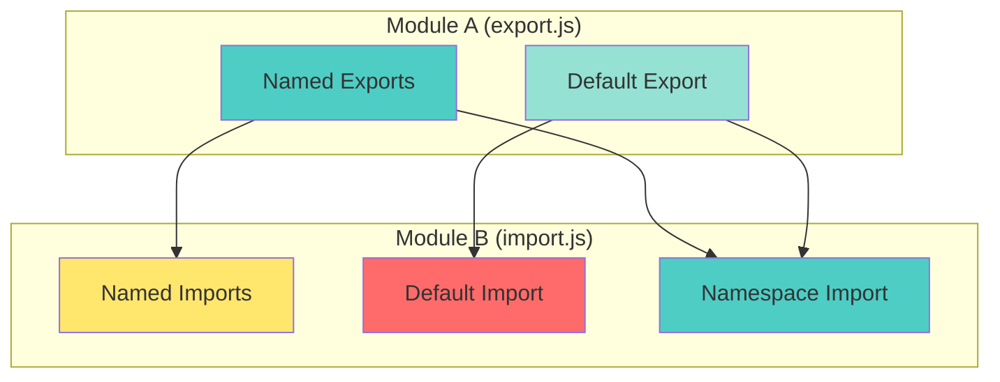

# 📘 **JAVASCRIPT MASTERY - Lesson 5: ES6+ Modern JavaScript**

**Date**: 23-03-26
**Level**: 🟢 Beginner → 🔴 Senior Engineer
**Series**: JavaScript Fundamentals
**Time**: 50 minutes
**Prerequisites**: Lesson 1-4 (Foundations through Async Programming)

---

- [LastRead](#lastRead)

## 🎯 **LEARNING OBJECTIVES**

After completing this **comprehensive** lesson, you will:

1. ✅ **Master Destructuring** - Array, object, nested, default values
2. ✅ **Master Spread/Rest** - Array literals, function calls, parameters
3. ✅ **Master Template Literals** - Interpolation, tagged templates, multiline
4. ✅ **Master Modules** - ES6 modules, imports/exports, dynamic imports
5. ✅ **Master Modern Features** - Optional chaining, nullish coalescing, logical assignment
6. ✅ **Write Idiomatic Modern Code** - Best practices, patterns, conventions

---

## 📦 **PART 1: DESTRUCTURING**

### **Array Destructuring**

```javascript
// ─────────────────────────────────────────────
// BASIC ARRAY DESTRUCTURING
// ─────────────────────────────────────────────
const colors = ["red", "green", "blue"];

const [first, second, third] = colors;

console.log(first); // 'red'
console.log(second); // 'green'
console.log(third); // 'blue'

// ─────────────────────────────────────────────
// SKIP ELEMENTS
// ─────────────────────────────────────────────
const [first2, , third2] = colors;
console.log(first2); // 'red'
console.log(third2); // 'blue'

// ─────────────────────────────────────────────
// REST ELEMENTS
// ─────────────────────────────────────────────
const [head, ...tail] = [1, 2, 3, 4, 5];
console.log(head); // 1
console.log(tail); // [2, 3, 4, 5]

// ─────────────────────────────────────────────
// DEFAULT VALUES
// ─────────────────────────────────────────────
const [a = 1, b = 2, c = 3] = [10];
console.log(a); // 10 (from array)
console.log(b); // 2 (default)
console.log(c); // 3 (default)

// ─────────────────────────────────────────────
// SWAPPING VARIABLES
// ─────────────────────────────────────────────
let x = 1,
  y = 2;
[x, y] = [y, x];
console.log(x, y); // 2, 1

// ─────────────────────────────────────────────
// NESTED DESTRUCTURING
// ─────────────────────────────────────────────
const nested = [1, [2, [3, 4]], 5];
const [one, [two, [three, four]], five] = nested;
console.log(one, two, three, four, five); // 1, 2, 3, 4, 5

// ─────────────────────────────────────────────
// FUNCTION PARAMETERS
// ─────────────────────────────────────────────
function printUser([name, age, city]) {
  console.log(`${name}, ${age}, from ${city}`);
}

printUser(["John", 25, "NYC"]);

// ─────────────────────────────────────────────
// ITERABLE DESTRUCTURING
// ─────────────────────────────────────────────
const str = "hello";
const [char1, char2] = str;
console.log(char1, char2); // h e

// Works with Map, Set, etc.
const map = new Map([
  ["a", 1],
  ["b", 2],
]);
for (const [key, value] of map) {
  console.log(key, value);
}
```

---

### **Object Destructuring**

```javascript
// ─────────────────────────────────────────────
// BASIC OBJECT DESTRUCTURING
// ─────────────────────────────────────────────
const user = { name: "John", age: 25, city: "NYC" };

const { name, age, city } = user;
console.log(name); // 'John'
console.log(age); // 25
console.log(city); // 'NYC'

// ─────────────────────────────────────────────
// RENAMING VARIABLES
// ─────────────────────────────────────────────
const { name: userName, age: userAge } = user;
console.log(userName); // 'John'
console.log(userAge); // 25

// ─────────────────────────────────────────────
// DEFAULT VALUES
// ─────────────────────────────────────────────
const { name: n = "Anonymous", role = "user" } = user;
console.log(n); // 'John' (from object)
console.log(role); // 'user' (default)

// ─────────────────────────────────────────────
// NESTED OBJECT DESTRUCTURING
// ─────────────────────────────────────────────
const person = {
  name: "John",
  address: {
    city: "NYC",
    zip: "10001",
    country: {
      name: "USA",
      code: "US",
    },
  },
};

const {
  address: {
    city,
    country: { name: countryName },
  },
} = person;

console.log(city); // 'NYC'
console.log(countryName); // 'USA'

// ─────────────────────────────────────────────
// COMPUTED PROPERTY NAMES
// ─────────────────────────────────────────────
const key = "name";
const { [key]: nameValue } = user;
console.log(nameValue); // 'John'

// ─────────────────────────────────────────────
// FUNCTION PARAMETERS WITH OBJECTS
// ─────────────────────────────────────────────
function greet({ name, age = 18 }) {
  console.log(`Hello ${name}, age ${age}`);
}

greet(user); // Hello John, age 25

// ─────────────────────────────────────────────
// DYNAMIC PROPERTY NAMES
// ─────────────────────────────────────────────
function getUserProperty(prop) {
  const { [prop]: value } = user;
  return value;
}

console.log(getUserProperty("name")); // 'John'
console.log(getUserProperty("age")); // 25
```

---

## 📦 **PART 2: SPREAD & REST OPERATORS**

### **Spread Operator (...)**

```javascript
// ─────────────────────────────────────────────
// ARRAY SPREAD
// ─────────────────────────────────────────────
const arr1 = [1, 2, 3];
const arr2 = [...arr1, 4, 5, 6];
console.log(arr2); // [1, 2, 3, 4, 5, 6]

// ─────────────────────────────────────────────
// MERGING ARRAYS
// ─────────────────────────────────────────────
const left = [1, 2];
const right = [5, 6];
const merged = [...left, 3, 4, ...right];
console.log(merged); // [1, 2, 3, 4, 5, 6]

// ─────────────────────────────────────────────
// COPYING ARRAYS
// ─────────────────────────────────────────────
const original = [1, 2, 3];
const copy = [...original];
console.log(copy === original); // false (shallow copy)

// ─────────────────────────────────────────────
// STRING TO ARRAY
// ─────────────────────────────────────────────
const str2 = "hello";
const chars = [...str2];
console.log(chars); // ['h', 'e', 'l', 'l', 'o']

// ─────────────────────────────────────────────
// FUNCTION CALLS
// ─────────────────────────────────────────────
const numbers = [1, 2, 3, 4, 5];
console.log(Math.max(...numbers)); // 5

function sum(a, b, c) {
  return a + b + c;
}
console.log(sum(...[1, 2, 3])); // 6

// ─────────────────────────────────────────────
// OBJECT SPREAD
// ─────────────────────────────────────────────
const defaults = { theme: "dark", lang: "en" };
const userPrefs = { theme: "light" };
const config = { ...defaults, ...userPrefs };
console.log(config); // { theme: 'light', lang: 'en' }

// ─────────────────────────────────────────────
// CLONING OBJECTS
// ─────────────────────────────────────────────
const obj = { a: 1, b: 2 };
const clone = { ...obj };
console.log(clone); // { a: 1, b: 2 }
console.log(clone === obj); // false (shallow copy)

// ─────────────────────────────────────────────
// ⚠️ SHALLOW COPY WARNING
// ─────────────────────────────────────────────
const nested = { a: 1, b: { c: 2 } };
const shallow = { ...nested };
shallow.b.c = 999;
console.log(nested.b.c); // 999 (original modified!)

// Use structuredClone for deep copy
const deep = structuredClone(nested);
```

---

### **Rest Parameters**

```javascript
// ─────────────────────────────────────────────
// FUNCTION REST PARAMETERS
// ─────────────────────────────────────────────
function sumAll(...numbers) {
  return numbers.reduce((sum, n) => sum + n, 0);
}

console.log(sumAll(1, 2, 3, 4, 5)); // 15

// ─────────────────────────────────────────────
// REST MUST BE LAST
// ─────────────────────────────────────────────
function greet(greeting, ...names) {
  return `${greeting}, ${names.join(", ")}!`;
}

console.log(greet("Hello", "John", "Jane", "Bob"));
// "Hello, John, Jane, Bob!"

// ─────────────────────────────────────────────
// REST IN DESTRUCTURING
// ─────────────────────────────────────────────
const [first3, ...rest3] = [1, 2, 3, 4, 5];
console.log(first3); // 1
console.log(rest3); // [2, 3, 4, 5]

const { name: n2, ...rest2 } = user;
console.log(n2); // 'John'
console.log(rest2); // { age: 25, city: 'NYC' }

// ─────────────────────────────────────────────
// FILTERING WITH REST
// ─────────────────────────────────────────────
function filterOut(skip, ...items) {
  return items.filter((item) => item !== skip);
}

console.log(filterOut("bad", "good", "bad", "great", "bad"));
// ['good', 'great']
```

---

## 📦 **PART 3: TEMPLATE LITERALS**

### **String Interpolation**

```javascript
// ─────────────────────────────────────────────
// BASIC INTERPOLATION
// ─────────────────────────────────────────────
const name = "John";
const age = 25;

const greeting = `Hello, my name is ${name} and I'm ${age} years old`;
console.log(greeting);

// ─────────────────────────────────────────────
// EXPRESSIONS IN TEMPLATES
// ─────────────────────────────────────────────
const price = 100;
const tax = 0.1;

const total = `Total: $${price * (1 + tax)}`;
console.log(total); // "Total: $110"

// ─────────────────────────────────────────────
// MULTILINE STRINGS
// ─────────────────────────────────────────────
const html = `
  <div class="user">
    <h1>${name}</h1>
    <p>Age: ${age}</p>
  </div>
`;

// ─────────────────────────────────────────────
// NESTED TEMPLATES
// ─────────────────────────────────────────────
const users = [
  { name: "John", age: 25 },
  { name: "Jane", age: 30 },
];

const list = `
  <ul>
    ${users
      .map(
        (user) => `
      <li>
        <strong>${user.name}</strong> - ${user.age}
      </li>
    `,
      )
      .join("")}
  </ul>
`;
```

---

### **Tagged Templates**

```javascript
// ─────────────────────────────────────────────
// CUSTOM TAG FUNCTION
// ─────────────────────────────────────────────
function uppercase(strings, ...values) {
  return strings.reduce((acc, str, i) => {
    return acc + str + (values[i] || "").toUpperCase();
  }, "");
}

const result = uppercase`Hello ${name}, you are ${age} years old`;
console.log(result);
// "Hello JOHN, you are 25 YEARS OLD"

// ─────────────────────────────────────────────
// HTML ESCAPING TAG
// ─────────────────────────────────────────────
function htmlEscape(strings, ...values) {
  const escape = (str) =>
    str
      .replace(/&/g, "&amp;")
      .replace(/</g, "&lt;")
      .replace(/>/g, "&gt;")
      .replace(/"/g, "&quot;");

  return strings.reduce((acc, str, i) => {
    return acc + str + (values[i] ? escape(String(values[i])) : "");
  }, "");
}

const userInput = '<script>alert("XSS")</script>';
const safe = htmlEscape`<div>${userInput}</div>`;
console.log(safe);
// "<div>&lt;script&gt;alert(&quot;XSS&quot;)&lt;/script&gt;</div>"

// ─────────────────────────────────────────────
// SQL QUERY TAG (Prevent Injection)
// ─────────────────────────────────────────────
function sql(strings, ...values) {
  return strings.reduce((acc, str, i) => {
    const value = values[i];
    const escaped =
      typeof value === "string" ? `'${value.replace(/'/g, "''")}'` : value;
    return acc + str + (escaped ?? "");
  }, "");
}

const userId = 1;
const query = sql`SELECT * FROM users WHERE id = ${userId}`;
console.log(query); // SELECT * FROM users WHERE id = 1
```

---

## 📦 **PART 4: MODULES**

### **ES6 Module System**



---

### **Export/Import Syntax**

```javascript
// ─────────────────────────────────────────────
// MODULE: math.js
// ─────────────────────────────────────────────
// Named exports
export const PI = 3.14159;
export function add(a, b) {
  return a + b;
}
export function multiply(a, b) {
  return a * b;
}

// Default export
export default function calculate(a, b, operation) {
  return operation(a, b);
}

// ─────────────────────────────────────────────
// MODULE: utils.js
// ─────────────────────────────────────────────
// Export list (cleaner)
const formatDate = (date) => {
  /* ... */
};
const parseDate = (str) => {
  /* ... */
};
const isValidDate = (date) => {
  /* ... */
};

export { formatDate, parseDate, isValidDate };

// ─────────────────────────────────────────────
// MODULE: user.js
// ─────────────────────────────────────────────
// Rename exports
const userName = "John";
const userAge = 25;

export { userName as name, userAge as age };

// ─────────────────────────────────────────────
// IMPORTING: main.js
// ─────────────────────────────────────────────
// Import default
import calculate from "./math.js";

// Import named
import { PI, add, multiply } from "./math.js";

// Import all as namespace
import * as Math from "./math.js";
console.log(Math.PI);
console.log(Math.add(1, 2));

// Import with renaming
import { add as sum, multiply as product } from "./math.js";

// Import default and named
import calculate, { PI, add } from "./math.js";

// Import for side effects (runs module code)
import "./polyfills.js";

// ─────────────────────────────────────────────
// DYNAMIC IMPORTS (Lazy Loading)
// ─────────────────────────────────────────────
async function loadModule() {
  const math = await import("./math.js");
  console.log(math.add(1, 2));
}

// Conditional loading
async function loadChartLibrary(type) {
  if (type === "bar") {
    const { BarChart } = await import("./charts/bar.js");
    return BarChart;
  } else if (type === "line") {
    const { LineChart } = await import("./charts/line.js");
    return LineChart;
  }
}

// ─────────────────────────────────────────────
// RE-EXPORTING
// ─────────────────────────────────────────────
// Re-export everything
export * from "./math.js";

// Re-export with renaming
export { add as sum, multiply as product } from "./math.js";

// Re-export default with name
export { default as calculate } from "./math.js";
```

---

## 📦 **PART 5: MODERN FEATURES (ES2020+)**

### **Optional Chaining (?.)**

```javascript
// ─────────────────────────────────────────────
// SAFE PROPERTY ACCESS
// ─────────────────────────────────────────────
const user2 = {
  name: "John",
  address: {
    city: "NYC",
    zip: "10001",
  },
};

// Old way (error-prone)
const city1 = user2.address && user2.address.city;

// New way (safe)
const city2 = user2.address?.city; // 'NYC'
const country = user2.address?.country?.name; // undefined (no error!)

// ─────────────────────────────────────────────
// OPTIONAL CHAINING WITH ARRAYS
// ─────────────────────────────────────────────
const colors2 = ["red", "green", "blue"];
console.log(colors2?.[0]); // 'red'
console.log(colors2?.[10]); // undefined (no error!)

// ─────────────────────────────────────────────
// OPTIONAL CHAINING WITH FUNCTIONS
// ─────────────────────────────────────────────
const api = {
  getUser: (id) => ({ name: "John" }),
};

api.getUser?.(1); // { name: 'John' }
api.deleteUser?.(1); // undefined (function doesn't exist, no error!)

// ─────────────────────────────────────────────
// NULLISH COALESCING (??)
// ─────────────────────────────────────────────
const config2 = {
  timeout: 0, // 0 is falsy but valid!
  retries: null,
};

// || checks for falsy (wrong for 0, false, '')
const timeout1 = config2.timeout || 5000; // 5000 (wrong! 0 is valid)

// ?? checks for null/undefined only
const timeout2 = config2.timeout ?? 5000; // 0 (correct!)
const retries = config2.retries ?? 3; // 3 (null, so use default)

// ─────────────────────────────────────────────
// LOGICAL ASSIGNMENT (ES2021)
// ─────────────────────────────────────────────
// ||= (OR assignment)
let x = 0;
x ||= 10; // x = x || 10 → x stays 0 (falsy but assigned)

// &&= (AND assignment)
let y = 10;
y &&= 5; // y = y && 5 → y becomes 5

// ??= (Nullish assignment)
let z = null;
z ??= 10; // z = z ?? 10 → z becomes 10 (only if null/undefined)

// ─────────────────────────────────────────────
// PRACTICAL EXAMPLES
// ─────────────────────────────────────────────
// API Response handling
async function fetchUserData(userId) {
  const response = await fetch(`/api/users/${userId}`);
  const data = await response.json();

  // Safe nested access
  const city = data?.user?.address?.city;
  const email = data?.user?.contact?.email ?? "not provided";

  return { city, email };
}

// Configuration with defaults
function createServer(options = {}) {
  const config = {
    port: options.port ?? 3000,
    host: options.host ?? "localhost",
    timeout: options.timeout ?? 5000,
    debug: options.debug ?? false,
  };

  return config;
}
```

---

## ✅ **ES6+ CHECKLIST**

```
Destructuring
[ ] Array destructuring with rest/spread
[ ] Object destructuring with renaming
[ ] Nested destructuring
[ ] Default values in destructuring

Spread/Rest
[ ] Spread for arrays and objects
[ ] Rest parameters in functions
[ ] Understand shallow copy limitation

Template Literals
[ ] String interpolation
[ ] Multiline strings
[ ] Tagged templates

Modules
[ ] Named vs default exports
[ ] Import syntax variations
[ ] Dynamic imports
[ ] Re-exporting

Modern Features
[ ] Optional chaining (?.)
[ ] Nullish coalescing (??)
[ ] Logical assignment (||=, &&=, ??=)
```

---

## 🎯 **KNOWLEDGE CHECK**

### **Question 1: Destructuring Output**

What will this output?

```javascript
const obj = { a: 1, b: 2, c: 3 };
const { a, ...rest } = obj;
console.log(a, rest);

const [x, , z] = [10, 20, 30];
console.log(x, z);
```

<details>
<summary>💡 Click to reveal answer</summary>

```javascript
console.log(a, rest); // 1, { b: 2, c: 3 }
console.log(x, z); // 10, 30
```

</details>

---

### **Question 2: Fix with Optional Chaining**

Refactor this code:

```javascript
function getCity(user) {
  if (user && user.address && user.address.city) {
    return user.address.city;
  }
  return "Unknown";
}
```

<details>
<summary>💡 Click to reveal answer</summary>

```javascript
function getCity(user) {
  return user?.address?.city ?? "Unknown";
}
```

</details>

---

## 📚 **ADDITIONAL RESOURCES**

- **MDN**: [ES6 Guide](https://developer.mozilla.org/en-US/docs/Web/JavaScript/Guide)
- **Exploring ES6**: [Free Online Book](https://exploringjs.com/es6/)
- **Babel**: [ES6 Features](https://babeljs.io/docs/en/learn)

---

## 🎓 **HOMEWORK**

1. ✅ Create a utility library using ES6 modules
2. ✅ Build a template tag for CSS-in-JS
3. ✅ Refactor callback code to use modern features
4. ✅ Create a configuration parser with optional chaining
5. ✅ Build a data transformer with destructuring and spread

---

**Next Lesson**: Error Handling & Debugging
**Date**: 23-03-26
**Status**: ✅ Complete

---

-23-03-26
