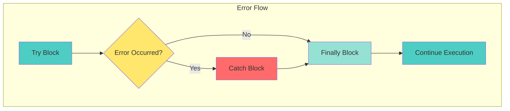

# 📘 **JAVASCRIPT MASTERY - Lesson 6: Error Handling & Debugging**

**Date**: 23-03-26
**Level**: 🟢 Beginner → 🔴 Senior Engineer
**Series**: JavaScript Fundamentals
**Time**: 45 minutes
**Prerequisites**: Lesson 1-5 (Foundations through ES6+)

---

- [LastRead](#lastRead)

## 🎯 **LEARNING OBJECTIVES**

After completing this **comprehensive** lesson, you will:

1. ✅ **Master Try/Catch/Finally** - Error handling patterns, nested try/catch
2. ✅ **Understand Error Types** - Built-in errors, custom errors, error codes
3. ✅ **Implement Custom Errors** - Error subclasses, error hierarchies
4. ✅ **Master Debugging** - Console methods, breakpoints, debugging tools
5. ✅ **Handle Async Errors** - Promise rejection, async/await error handling
6. ✅ **Production Error Handling** - Error boundaries, logging, monitoring

---

## 📦 **PART 1: TRY/CATCH/FINALLY**

### **Error Handling Fundamentals**



---

### **Try/Catch/Finally Syntax**

```javascript
// ─────────────────────────────────────────────
// BASIC TRY/CATCH
// ─────────────────────────────────────────────
try {
  // Code that might throw an error
  const result = riskyOperation();
  console.log("Success:", result);
} catch (error) {
  // Handle the error
  console.error("Error occurred:", error.message);
}

// ─────────────────────────────────────────────
// TRY/CATCH/FINALLY
// ─────────────────────────────────────────────
try {
  console.log("Step 1: Starting operation");
  const data = fetchData();
  console.log("Step 2: Processing data");
  processData(data);
} catch (error) {
  console.error("Error:", error.message);
} finally {
  // Always executes (cleanup)
  console.log("Step 3: Cleanup complete");
  closeConnection();
}

// ─────────────────────────────────────────────
// FINALLY ALWAYS RUNS
// ─────────────────────────────────────────────
try {
  console.log("Try block");
  throw new Error("Test error");
} catch (error) {
  console.log("Catch block");
  throw new Error("Re-thrown"); // Re-throw
} finally {
  console.log("Finally block"); // Still runs!
}

// Output:
// Try block
// Catch block
// Finally block
// (Then error propagates up)

// ─────────────────────────────────────────────
// NESTED TRY/CATCH
// ─────────────────────────────────────────────
try {
  console.log("Outer try");

  try {
    console.log("Inner try");
    throw new Error("Inner error");
  } catch (innerError) {
    console.log("Inner catch:", innerError.message);
    throw new Error("Outer error"); // Re-throw
  }
} catch (outerError) {
  console.log("Outer catch:", outerError.message);
}

// Output:
// Outer try
// Inner try
// Inner catch: Inner error
// Outer catch: Outer error

// ─────────────────────────────────────────────
// CATCH SPECIFIC ERROR TYPES
// ─────────────────────────────────────────────
try {
  const data = JSON.parse(invalidJSON);
} catch (error) {
  if (error instanceof SyntaxError) {
    console.error("Invalid JSON syntax");
  } else if (error instanceof TypeError) {
    console.error("Type error occurred");
  } else {
    console.error("Unknown error:", error.message);
  }
}

// ─────────────────────────────────────────────
// CATCH WITHOUT BLOCK PARAMETER (ES2019+)
// ─────────────────────────────────────────────
try {
  riskyOperation();
} catch {
  // Error object not needed
  console.log("An error occurred");
}

// ─────────────────────────────────────────────
// THROW STATEMENTS
// ─────────────────────────────────────────────
// Throw built-in errors
throw new Error("Something went wrong");
throw new TypeError("Invalid type");
throw new RangeError("Value out of range");

// Throw custom values (not recommended)
throw "String error"; // ❌ Avoid
throw { code: 500, message: "Server error" }; // ❌ Avoid

// Throw custom error class (recommended)
throw new CustomError("Business logic failed", "BUSINESS_ERROR", 400);
```

---

## 📦 **PART 2: ERROR TYPES**

### **Built-in Error Types**

```javascript
// ─────────────────────────────────────────────
// ERROR HIERARCHY
// ─────────────────────────────────────────────
// Error (Base class)
// ├── EvalError
// ├── RangeError
// ├── ReferenceError
// ├── SyntaxError
// ├── TypeError
// └── URIError

// ─────────────────────────────────────────────
// 1. SYNTAX ERROR
// ─────────────────────────────────────────────
// Invalid JavaScript syntax (caught at parse time)
// eval("if (");  // SyntaxError: Unexpected end of input

// JSON.parse also throws SyntaxError
try {
  JSON.parse('{"invalid": }');
} catch (error) {
  console.log(error instanceof SyntaxError); // true
}

// ─────────────────────────────────────────────
// 2. REFERENCE ERROR
// ─────────────────────────────────────────────
// Accessing undefined variables
try {
  console.log(undefinedVariable);
} catch (error) {
  console.log(error instanceof ReferenceError); // true
  console.log(error.name); // "ReferenceError"
}

// ─────────────────────────────────────────────
// 3. TYPE ERROR
// ─────────────────────────────────────────────
// Wrong type for operation
try {
  null.someMethod();
} catch (error) {
  console.log(error instanceof TypeError); // true
  console.log(error.message); // "Cannot read property..."
}

// Calling non-function
try {
  const notAFunction = 123;
  notAFunction();
} catch (error) {
  console.log(error.name); // "TypeError"
}

// ─────────────────────────────────────────────
// 4. RANGE ERROR
// ─────────────────────────────────────────────
// Value out of valid range
try {
  new Array(-1);
} catch (error) {
  console.log(error instanceof RangeError); // true
}

// Number precision issues
try {
  (10).toPrecision(0); // Must be 1-100
} catch (error) {
  console.log(error.name); // "RangeError"
}

// ─────────────────────────────────────────────
// 5. URI ERROR
// ─────────────────────────────────────────────
// Invalid URI/URL
try {
  decodeURIComponent("%");
} catch (error) {
  console.log(error instanceof URIError); // true
}

// ─────────────────────────────────────────────
// 6. EVAL ERROR
// ─────────────────────────────────────────────
// Invalid eval() usage (rarely used)
try {
  eval = 123; // Can't reassign eval
} catch (error) {
  console.log(error.name); // Might be TypeError depending on engine
}
```

---

### **Custom Error Classes**

```javascript
// ─────────────────────────────────────────────
// BASIC CUSTOM ERROR
// ─────────────────────────────────────────────
class CustomError extends Error {
  constructor(message) {
    super(message);
    this.name = "CustomError";
    this.timestamp = new Date();

    // Capture stack trace (V8 engines)
    if (Error.captureStackTrace) {
      Error.captureStackTrace(this, CustomError);
    }
  }
}

try {
  throw new CustomError("Something custom happened");
} catch (error) {
  console.log(error.name); // "CustomError"
  console.log(error.message); // "Something custom happened"
  console.log(error.timestamp); // Date object
}

// ─────────────────────────────────────────────
// ERROR WITH ERROR CODE
// ─────────────────────────────────────────────
class AppError extends Error {
  constructor(message, code, statusCode = 500) {
    super(message);
    this.name = "AppError";
    this.code = code; // Application error code
    this.statusCode = statusCode; // HTTP status code
    this.isOperational = true; // Distinguish from programming errors

    Error.captureStackTrace(this, this.constructor);  //🎯🎯
  }
}

// Usage
throw new AppError("User not found", "USER_NOT_FOUND", 404);

// ─────────────────────────────────────────────
// ERROR HIERARCHY
// ─────────────────────────────────────────────
// Base application error
class BaseAppError extends Error {
  constructor(message, code, statusCode) {
    super(message);
    this.name = this.constructor.name;
    this.code = code;
    this.statusCode = statusCode;
    Error.captureStackTrace(this, this.constructor);
  }
}

// Validation errors (400)
class ValidationError extends BaseAppError {
  constructor(message, field) {
    super(message, "VALIDATION_ERROR", 400);
    this.field = field;
  }
}

// Authentication errors (401)
class AuthenticationError extends BaseAppError {
  constructor(message = "Authentication required") {
    super(message, "AUTHENTICATION_ERROR", 401);
  }
}

// Authorization errors (403)
class AuthorizationError extends BaseAppError {
  constructor(message = "Access denied") {
    super(message, "AUTHORIZATION_ERROR", 403);
  }
}

// Not found errors (404)
class NotFoundError extends BaseAppError {
  constructor(resource = "Resource") {
    super(`${resource} not found`, "NOT_FOUND", 404);
  }
}

// Database errors (500)
class DatabaseError extends BaseAppError {
  constructor(message, originalError) {
    super(message, "DATABASE_ERROR", 500);
    this.originalError = originalError;
  }
}

// ─────────────────────────────────────────────
// USING ERROR HIERARCHY
// ─────────────────────────────────────────────
function getUser(userId) {
  if (!userId) {
    throw new ValidationError("User ID is required", "userId");
  } 

  const user = database.find(userId);

  if (!user) {
    throw new NotFoundError("User");
  }

  return user;
}

async function deleteUser(userId, currentUser) {
  const user = getUser(userId);

  if (currentUser.role !== "admin") {
    throw new AuthorizationError("Only admins can delete users");
  }

  try {
    await database.delete(userId);
  } catch (dbError) {
    throw new DatabaseError("Failed to delete user", dbError);
  }
}

// ─────────────────────────────────────────────
// ERROR HANDLING WITH HIERARCHY
// ─────────────────────────────────────────────
async function handleRequest(req, res) {
  try {
    await processRequest(req);
  } catch (error) {
    if (error instanceof ValidationError) {
      return res.status(400).json({
        error: error.code,
        message: error.message,
        field: error.field,
      });
    }

    if (error instanceof AuthenticationError) {
      return res.status(401).json({
        error: error.code,
        message: error.message,
      });
    }

    if (error instanceof AuthorizationError) {
      return res.status(403).json({
        error: error.code,
        message: error.message,
      });
    }

    if (error instanceof NotFoundError) {
      return res.status(404).json({
        error: error.code,
        message: error.message,
      });
    }

    // Unknown error - log and return 500
    console.error("Unhandled error:", error);
    return res.status(500).json({
      error: "INTERNAL_ERROR",
      message: "An unexpected error occurred",
    });
  }
}
```

---

## 📦 **PART 3: ASYNC ERROR HANDLING**

### **Promise Error Handling**

```javascript
// ─────────────────────────────────────────────
// CATCHING PROMISE REJECTIONS
// ─────────────────────────────────────────────
// Method 1: .catch()
fetchData()
  .then((data) => processData(data))
  .catch((error) => {
    console.error("Error:", error);
  });

// Method 2: .catch() at each step
fetchData()
  .then((data) => {
    return processData(data);
  })
  .catch((error) => {
    console.error("Fetch or process error:", error);
  });

// Method 3: Multiple catches
fetchData()
  .then((data) => {
    if (!data) throw new Error("No data");
    return processData(data);
  })
  .catch((error) => {
    if (error.message === "No data") {
      return defaultValue;
    }
    throw error; // Re-throw
  })
  .catch((error) => {
    console.error("Final error handler:", error);
  });

// ─────────────────────────────────────────────
// FINALLY WITH PROMISES
// ─────────────────────────────────────────────
fetchData()
  .then((data) => console.log("Success:", data))
  .catch((error) => console.error("Error:", error))
  .finally(() => {
    console.log("Request completed (cleanup)");
    hideLoadingSpinner();
  });

// ─────────────────────────────────────────────
// UNHANDLED PROMISE REJECTIONS
// ─────────────────────────────────────────────
// Global handler for unhandled rejections (Node.js)
process.on("unhandledRejection", (reason, promise) => {
  console.error("Unhandled Rejection at:", promise, "reason:", reason);
});

// Browser equivalent
window.addEventListener("unhandledrejection", (event) => {
  console.error("Unhandled rejection:", event.reason);
  event.preventDefault(); // Suppress console error
});

// ─────────────────────────────────────────────
// PROMISE.ALL ERROR HANDLING
// ─────────────────────────────────────────────
// Promise.all fails fast (first rejection)
Promise.all([promise1, promise2, promise3]).catch((error) => {
  // Catches first error from any promise
  console.error("One promise failed:", error);
});

// Promise.allSettled waits for all (no fail fast)
Promise.allSettled([promise1, promise2, promise3]).then((results) => {
  results.forEach((result) => {
    if (result.status === "fulfilled") {
      console.log("Success:", result.value);
    } else {
      console.error("Failed:", result.reason);
    }
  });
});

// Promise.any - first success (ignores rejections)
Promise.any([promise1, promise2, promise3])
  .then((value) => {
    console.log("First success:", value);
  })
  .catch((error) => {
    // Only if ALL promises reject
    console.error("All promises failed:", error);
  });
```

---

### **Async/Await Error Handling**

```javascript
// ─────────────────────────────────────────────
// TRY/CATCH WITH ASYNC/AWAIT
// ─────────────────────────────────────────────
async function fetchData() {
  try {
    const response = await fetch("/api/data");
    const data = await response.json();
    return data;
  } catch (error) {
    console.error("Fetch error:", error);
    throw error; // Re-throw or return default
  }
}

// ─────────────────────────────────────────────
// MULTIPLE ASYNC OPERATIONS
// ─────────────────────────────────────────────
async function processUserData(userId) {
  try {
    const user = await fetchUser(userId);
    const posts = await fetchPosts(user.id);
    const comments = await fetchComments(posts[0].id);

    return { user, posts, comments };
  } catch (error) {
    console.error("Error in chain:", error);
    throw error;
  }
}

// ─────────────────────────────────────────────
// INDIVIDUAL ERROR HANDLING
// ─────────────────────────────────────────────
async function fetchAllData(userId) {
  let user = null;
  let posts = null;
  let comments = null;

  try {
    user = await fetchUser(userId);
  } catch (error) {
    console.error("Failed to fetch user:", error);
  }

  if (user) {
    try {
      posts = await fetchPosts(user.id);
    } catch (error) {
      console.error("Failed to fetch posts:", error);
    }
  }

  if (posts && posts.length > 0) {
    try {
      comments = await fetchComments(posts[0].id);
    } catch (error) {
      console.error("Failed to fetch comments:", error);
    }
  }

  return { user, posts, comments };
}

// ─────────────────────────────────────────────
// PARALLEL WITH ERROR HANDLING
// ─────────────────────────────────────────────
async function fetchAllParallel(ids) {
  const results = await Promise.allSettled(ids.map((id) => fetchUser(id)));

  const successes = results
    .filter((r) => r.status === "fulfilled")
    .map((r) => r.value);

  const failures = results
    .filter((r) => r.status === "rejected")
    .map((r) => r.reason);

  console.log("Successes:", successes);
  console.log("Failures:", failures);

  return { successes, failures };
}
```

---

## 📦 **PART 4: DEBUGGING TECHNIQUES**

### **Console Methods**

```javascript
// ─────────────────────────────────────────────
// BASIC CONSOLE METHODS
// ─────────────────────────────────────────────
console.log("Regular message");
console.info("Information message");
console.warn("Warning message");
console.error("Error message");
console.debug("Debug message (hidden by default)");

// ─────────────────────────────────────────────
// FORMATTED OUTPUT
// ─────────────────────────────────────────────
const user = { name: "John", age: 25 };
console.log("User:", user);
console.log(`User: ${user.name}, Age: ${user.age}`);

// String substitution
console.log("Name: %s, Age: %d", user.name, user.age);
// %s - string, %d - number, %o - object, %O - object expanded

// ─────────────────────────────────────────────
// TABLE OUTPUT
// ─────────────────────────────────────────────
const users = [
  { name: "John", age: 25, city: "NYC" },
  { name: "Jane", age: 30, city: "LA" },
  { name: "Bob", age: 35, city: "Chicago" },
];

console.table(users);
// Displays as formatted table

console.table(users, ["name", "age"]); // Select columns

// ─────────────────────────────────────────────
// GROUPING
// ─────────────────────────────────────────────
console.group("User Operations");
console.log("Creating user...");
console.log("Saving to database...");
console.group("Nested Group");
console.log("Nested log");
console.groupEnd();
console.groupEnd();

// Collapsed by default
console.groupCollapsed("Details");
console.log("Hidden by default");
console.groupEnd();

// ─────────────────────────────────────────────
// TIMING
// ─────────────────────────────────────────────
console.time("Operation");
// ... some code ...
console.timeEnd("Operation"); // "Operation: 12.345ms"

// Multiple timers
console.time("Fetch");
console.time("Process");
// ... code ...
console.timeEnd("Fetch");
console.timeEnd("Process");

// ─────────────────────────────────────────────
// TRACE
// ─────────────────────────────────────────────
function level3() {
  console.trace("Trace called");
}
function level2() {
  level3();
}
function level1() {
  level2();
}
level1();

// Output:
// Trace called
//   at level3 (file.js:2)
//   at level2 (file.js:5)
//   at level1 (file.js:8)

// ─────────────────────────────────────────────
// ASSERT
// ─────────────────────────────────────────────
const age = -5;
console.assert(age >= 0, "Age must be positive");
// Only logs if condition is false

// ─────────────────────────────────────────────
// COUNTING
// ─────────────────────────────────────────────
function handleClick() {
  console.count("Click count");
}
// "Click count: 1", "Click count: 2", etc.

console.countReset("Click count"); // Reset counter
```

---

### **Debugging Tools & Techniques**

```javascript
// ─────────────────────────────────────────────
// DEBUGGER STATEMENT
// ─────────────────────────────────────────────
function processOrder(order) {
  debugger; // Execution pauses here (if dev tools open)

  const total = calculateTotal(order);
  const tax = calculateTax(total);

  return total + tax;
}

// ─────────────────────────────────────────────
// CONDITIONAL BREAKPOINTS (in DevTools)
// ─────────────────────────────────────────────
for (let i = 0; i < 1000; i++) {
  // Set breakpoint with condition: i === 500
  processItem(i);
}

// ─────────────────────────────────────────────
// SOURCE MAPS (for production)
// ─────────────────────────────────────────────
// In webpack.config.js
module.exports = {
  devtool: "source-map", // Generate source maps
};

// ─────────────────────────────────────────────
// ERROR STACK PARSING
// ─────────────────────────────────────────────
function parseErrorStack(error) {
  const stack = error.stack.split("\n");

  return stack
    .map((line) => {
      const match = line.match(/at\s+(.+?)\s+\((.+):(\d+):(\d+)\)/);
      if (match) {
        return {
          function: match[1],
          file: match[2],
          line: match[3],
          column: match[4],
        };
      }
      return null;
    })
    .filter(Boolean);
}

// ─────────────────────────────────────────────
// PERFORMANCE MONITORING
// ─────────────────────────────────────────────
function measurePerformance(fn, ...args) {
  const start = performance.now();
  const result = fn(...args);
  const end = performance.now();

  console.log(`${fn.name} took ${(end - start).toFixed(2)}ms`);

  return result;
}

// Usage
measurePerformance(expensiveOperation, data);
```

---

## ✅ **ERROR HANDLING CHECKLIST**

```
Try/Catch/Finally
[ ] Basic try/catch usage
[ ] Finally for cleanup
[ ] Nested try/catch blocks
[ ] Re-throwing errors

Error Types
[ ] Identify built-in error types
[ ] Create custom error classes
[ ] Build error hierarchies
[ ] Use error codes and status codes

Async Errors
[ ] Catch promise rejections
[ ] Handle async/await errors
[ ] Use Promise.allSettled
[ ] Handle unhandled rejections

Debugging
[ ] Use console methods effectively
[ ] Set breakpoints and watch expressions
[ ] Read stack traces
[ ] Use performance monitoring
```

---

## 🎯 **KNOWLEDGE CHECK**

### **Question 1: Error Output**

What will this output?

```javascript
try {
  throw new Error("First");
} catch (error) {
  console.log("Catch:", error.message);
  throw new Error("Second");
} finally {
  console.log("Finally");
}
```

<details>
<summary>💡 Click to reveal answer</summary>

```
Catch: First
Finally
(Uncaught Error: Second)
```

**Explanation**: Finally always runs, even when re-throwing.

</details>

---

### **Question 2: Create Custom Error**

Create a `TimeoutError` class with a `timeout` property.

<details>
<summary>💡 Click to reveal answer</summary>

```javascript
class TimeoutError extends Error {
  constructor(message, timeout) {
    super(message);
    this.name = "TimeoutError";
    this.timeout = timeout;
    Error.captureStackTrace(this, TimeoutError);
  }
}

// Usage
throw new TimeoutError("Request timed out", 5000);
```

</details>

---

## 📚 **ADDITIONAL RESOURCES**

- **MDN**: [Error Handling](https://developer.mozilla.org/en-US/docs/Web/JavaScript/Guide/Control_flow_and_error_handling)
- **Node.js**: [Error Handling Best Practices](https://nodejs.org/en/docs/guides/error-handling)
- **Debugging**: [Chrome DevTools](https://developer.chrome.com/docs/devtools/)

---

## 🎓 **HOMEWORK**

1. ✅ Create a complete error hierarchy for an e-commerce app
2. ✅ Build a global error handler with logging
3. ✅ Implement retry logic with proper error handling
4. ✅ Create a debugging utility wrapper
5. ✅ Build an error boundary component (for React/Vue)

---

**Next Lesson**: DOM Manipulation & Events
**Date**: 23-03-26
**Status**: ✅ Complete

---

-23-03-26
