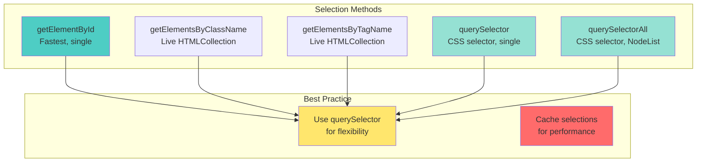
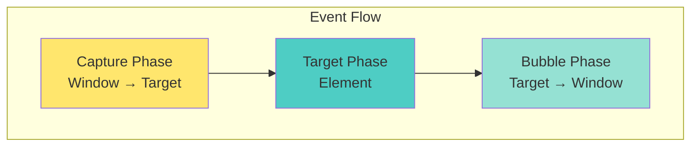

# 📘 **JAVASCRIPT MASTERY - Lesson 7: DOM Manipulation & Events**

**Date**: 23-03-26
**Level**: 🟢 Beginner → 🔴 Senior Engineer
**Series**: JavaScript Fundamentals
**Time**: 50 minutes
**Prerequisites**: Lesson 1-6 (Foundations through Error Handling)

---

- [LastRead](#lastRead)

## 🎯 **LEARNING OBJECTIVES**

After completing this **comprehensive** lesson, you will:

1. ✅ **Master DOM Selection** - Query selectors, traversal methods, performance
2. ✅ **Manipulate DOM Efficiently** - Create, update, delete elements
3. ✅ **Master Event Handling** - Event listeners, event object, propagation
4. ✅ **Understand Event Delegation** - Bubbling, capturing, delegation pattern
5. ✅ **Handle Common Events** - Form, keyboard, mouse, input events
6. ✅ **Build Interactive Components** - Modal, tabs, dropdowns, infinite scroll

---

## 📦 **PART 1: DOM SELECTION & TRAVERSAL**

### **Selecting Elements**



---

### **DOM Selection Methods**

```javascript
// ─────────────────────────────────────────────
// getElementById (Fastest for ID)
// ─────────────────────────────────────────────
const header = document.getElementById("header");
console.log(header); // Single element or null

// ─────────────────────────────────────────────
// getElementsByClassName (Live Collection)
// ─────────────────────────────────────────────
const items = document.getElementsByClassName("item");
console.log(items.length); // Number of elements

// Live collection - updates when DOM changes
const container = document.getElementById("container");
const items2 = container.getElementsByClassName("item");
console.log(items2.length); // 0

const newDiv = document.createElement("div");
newDiv.className = "item";
container.appendChild(newDiv);
console.log(items2.length); // 1 (automatically updated!)

// ─────────────────────────────────────────────
// getElementsByTagName (Live Collection)
// ─────────────────────────────────────────────
const paragraphs = document.getElementsByTagName("p");
const allDivs = document.getElementsByTagName("div");

// ─────────────────────────────────────────────
// querySelector (CSS Selectors, Single)
// ─────────────────────────────────────────────
const first = document.querySelector(".item"); // First .item
const byId = document.querySelector("#header"); // Same as getElementById
const direct = document.querySelector("ul > li"); // Direct child
const attr = document.querySelector("[data-active]"); // Attribute

// ─────────────────────────────────────────────
// querySelectorAll (CSS Selectors, Multiple)
// ─────────────────────────────────────────────
const all = document.querySelectorAll(".item"); // All .item elements
const nodeList = document.querySelectorAll("ul li:nth-child(odd)");

// NodeList (not live, has forEach)
const items3 = document.querySelectorAll(".item");
items3.forEach((item) => {
  console.log(item);
});

// ─────────────────────────────────────────────
// PERFORMANCE COMPARISON
// ─────────────────────────────────────────────
// Fastest to Slowest:
// 1. getElementById          ~100,000 ops/sec
// 2. getElementsByTagName    ~50,000 ops/sec
// 3. getElementsByClassName  ~40,000 ops/sec
// 4. querySelector           ~20,000 ops/sec
// 5. querySelectorAll        ~15,000 ops/sec

// BEST PRACTICE: Cache selections
// ❌ Bad: Query every time
for (let i = 0; i < 100; i++) {
  document.getElementById("myId").textContent = i;
}

// ✅ Good: Cache reference
const element = document.getElementById("myId");
for (let i = 0; i < 100; i++) {
  element.textContent = i;
}
```

---

### **DOM Traversal**

```javascript
// ─────────────────────────────────────────────
// PARENT TRAVERSAL
// ─────────────────────────────────────────────
const child = document.querySelector(".child");

child.parentNode; // Direct parent (works on any node)
child.parentElement; // Direct parent (element only)
child.closest(".container"); // Closest ancestor matching selector

// ─────────────────────────────────────────────
// CHILD TRAVERSAL
// ─────────────────────────────────────────────
const parent = document.querySelector(".parent");

parent.children; // HTMLCollection of element children
parent.firstElementChild; // First element child
parent.lastElementChild; // Last element child
parent.childNodes; // NodeList of ALL nodes (including text)
parent.firstChild; // First node (could be text)

// ─────────────────────────────────────────────
// SIBLING TRAVERSAL
// ─────────────────────────────────────────────
const element = document.querySelector(".item");

element.previousElementSibling; // Previous element
element.nextElementSibling; // Next element
element.previousSibling; // Previous node (could be text)
element.nextSibling; // Next node (could be text)

// ─────────────────────────────────────────────
// TRAVERSAL CHAINING
// ─────────────────────────────────────────────
const target = document
  .querySelector(".container")
  .querySelector(".item")
  .nextElementSibling.querySelector(".child");

// ─────────────────────────────────────────────
// PRACTICAL: Find All Ancestors
// ─────────────────────────────────────────────
function getAncestors(element) {
  const ancestors = [];
  let current = element.parentElement;

  while (current) {
    ancestors.push(current);
    current = current.parentElement;
  }

  return ancestors;
}

// ─────────────────────────────────────────────
// PRACTICAL: Find All Descendants
// ─────────────────────────────────────────────
function getDescendants(element) {
  return element.querySelectorAll("*");
}

// Or without querySelectorAll
function getDescendantsRecursive(element) {
  const descendants = [];

  for (const child of element.children) {
    descendants.push(child);
    descendants.push(...getDescendantsRecursive(child));
  }

  return descendants;
}
```

---

## 📦 **PART 2: DOM MANIPULATION**

### **Creating & Inserting Elements**

```javascript
// ─────────────────────────────────────────────
// CREATE ELEMENTS
// ─────────────────────────────────────────────
const div = document.createElement("div");
div.className = "my-class";
div.id = "myId";
div.textContent = "Hello World";
div.innerHTML = "<span>Nested</span>"; // Use carefully (XSS risk)

// Set attributes
div.setAttribute("data-value", "123");
div.setAttribute("role", "button");
div.style.color = "red";
div.style.padding = "10px";

// ─────────────────────────────────────────────
// INSERT ELEMENTS
// ─────────────────────────────────────────────
const parent = document.querySelector(".parent");
const child = document.querySelector(".child");

// Append (add as last child)
parent.appendChild(div);

// Insert before
parent.insertBefore(div, child);

// Insert after (no native method)
function insertAfter(newNode, referenceNode) {
  referenceNode.parentNode.insertBefore(newNode, referenceNode.nextSibling);
}

// ─────────────────────────────────────────────
// MODERN INSERTION METHODS
// ─────────────────────────────────────────────
// element.insertAdjacentHTML(position, html)
// Positions: 'beforebegin', 'afterbegin', 'beforeend', 'afterend'

const container = document.querySelector(".container");

container.insertAdjacentHTML("beforebegin", "<div>Before</div>");
container.insertAdjacentHTML("afterbegin", "<div>Start</div>");
container.insertAdjacentHTML("beforeend", "<div>End</div>");
container.insertAdjacentHTML("afterend", "<div>After</div>");

// ─────────────────────────────────────────────
// REPLACE & REMOVE
// ─────────────────────────────────────────────
const oldElement = document.querySelector(".old");
const newElement = document.createElement("div");

parent.replaceChild(newElement, oldElement); // Old way
oldElement.replaceWith(newElement); // Modern

// Remove
oldElement.remove(); // Modern (recommended)
parent.removeChild(oldElement); // Old way

// ─────────────────────────────────────────────
// CLONE ELEMENTS
// ─────────────────────────────────────────────
const original = document.querySelector(".item");
const shallow = original.cloneNode(false); // Clone without children
const deep = original.cloneNode(true); // Clone with children

// ─────────────────────────────────────────────
// DOCUMENT FRAGMENT (Performance)
// ─────────────────────────────────────────────
// ❌ Bad: Multiple reflows
const list = document.querySelector("#list");
for (let i = 0; i < 100; i++) {
  const li = document.createElement("li");
  li.textContent = `Item ${i}`;
  list.appendChild(li); // Triggers reflow each time
}

// ✅ Good: Single reflow with DocumentFragment
const fragment = document.createDocumentFragment();
for (let i = 0; i < 100; i++) {
  const li = document.createElement("li");
  li.textContent = `Item ${i}`;
  fragment.appendChild(li); // No reflow
}
list.appendChild(fragment); // Single reflow
```

---

### **Modifying Elements**

```javascript
// ─────────────────────────────────────────────
// TEXT CONTENT
// ─────────────────────────────────────────────
element.textContent = "Plain text"; // Safe (escapes HTML)
element.innerText = "Plain text"; // Respects CSS (slower)
element.innerHTML = "<strong>HTML</strong>"; // ⚠️ XSS risk

// ─────────────────────────────────────────────
// ATTRIBUTES
// ─────────────────────────────────────────────
element.getAttribute("href");
element.setAttribute("href", "https://example.com");
element.removeAttribute("href");
element.hasAttribute("href");

// Boolean attributes
element.checked = true; // Checkbox
element.disabled = true; // Disable button
element.selected = true; // Option

// ─────────────────────────────────────────────
// DATA ATTRIBUTES
// ─────────────────────────────────────────────
element.dataset.userId = "123";
element.dataset.action = "delete";

console.log(element.dataset.userId); // '123'
console.log(element.dataset.action); // 'delete'

// ─────────────────────────────────────────────
// STYLES
// ─────────────────────────────────────────────
element.style.color = "red";
element.style.backgroundColor = "blue";
element.style.fontSize = "16px";

// Get computed style
const computed = window.getComputedStyle(element);
console.log(computed.color);
console.log(computed.marginTop);

// ─────────────────────────────────────────────
// CLASSES
// ─────────────────────────────────────────────
element.classList.add("active", "highlight");
element.classList.remove("inactive");
element.classList.toggle("visible");
element.classList.contains("active"); // true/false
element.classList.replace("old", "new");

// ─────────────────────────────────────────────
// BULK UPDATES (Performance)
// ─────────────────────────────────────────────
// ❌ Bad: Multiple reflows
element.style.color = "red";
element.style.padding = "10px";
element.style.margin = "5px";
element.style.border = "1px solid black";

// ✅ Good: Single reflow with cssText
element.style.cssText = `
  color: red;
  padding: 10px;
  margin: 5px;
  border: 1px solid black;
`;

// ✅ Better: Use classes
element.className = "active highlighted padded";
```

---

## 📦 **PART 3: EVENT HANDLING**

### **Event Listeners**



---

### **Adding Event Listeners**

```javascript
// ─────────────────────────────────────────────
// ADD EVENT LISTENER (Recommended)
// ─────────────────────────────────────────────
const button = document.querySelector("#myButton");

button.addEventListener("click", function (event) {
  console.log("Button clicked!", event);
});

// Arrow function (careful with 'this')
button.addEventListener("click", (event) => {
  console.log("Clicked:", event.target);
});

// Named function (can be removed)
function handleClick(event) {
  console.log("Clicked");
}

button.addEventListener("click", handleClick);
button.removeEventListener("click", handleClick);

// ─────────────────────────────────────────────
// EVENT OPTIONS
// ─────────────────────────────────────────────
// once: Auto-remove after first trigger
button.addEventListener("click", handler, { once: true });

// capture: Listen during capture phase
button.addEventListener("click", handler, { capture: true });

// passive: Improve scroll performance
window.addEventListener("scroll", handler, { passive: true });

// Multiple options
button.addEventListener("click", handler, {
  once: true,
  capture: false,
  passive: false,
});

// ─────────────────────────────────────────────
// MULTIPLE EVENTS
// ─────────────────────────────────────────────
const events = ["click", "dblclick", "contextmenu"];

events.forEach((eventType) => {
  button.addEventListener(eventType, (e) => {
    console.log(`${eventType} occurred`);
  });
});

// ─────────────────────────────────────────────
// EVENT OBJECT PROPERTIES
// ─────────────────────────────────────────────
element.addEventListener("click", (event) => {
  event.target; // Element that triggered event
  event.currentTarget; // Element with listener
  event.type; // Event type ('click')
  event.timeStamp; // Timestamp
  event.preventDefault; // Function to prevent default
  event.stopPropagation; // Function to stop bubbling

  // Mouse events
  event.clientX; // X coordinate
  event.clientY; // Y coordinate
  event.button; // Mouse button (0=left, 1=middle, 2=right)
  event.altKey; // Alt key pressed
  event.ctrlKey; // Ctrl key pressed
  event.shiftKey; // Shift key pressed

  // Keyboard events
  event.key; // Key value ('Enter', 'a', etc.)
  event.code; // Physical key ('KeyA', 'Enter')
  event.keyCode; // Deprecated, use .key
});
```

---

### **Event Propagation**

```javascript
// ─────────────────────────────────────────────
// EVENT BUBBLING (Default)
// ─────────────────────────────────────────────
// Events bubble up from target to window

document.querySelector(".child").addEventListener("click", () => {
  console.log("Child clicked");
});

document.querySelector(".parent").addEventListener("click", () => {
  console.log("Parent clicked");
});

document.querySelector(".grandparent").addEventListener("click", () => {
  console.log("Grandparent clicked");
});

// Click on child logs:
// 1. Child clicked
// 2. Parent clicked
// 3. Grandparent clicked

// ─────────────────────────────────────────────
// STOP PROPAGATION
// ─────────────────────────────────────────────
document.querySelector(".child").addEventListener("click", (event) => {
  event.stopPropagation(); // Stop bubbling
  console.log("Child clicked (only)");
});

// ─────────────────────────────────────────────
// EVENT CAPTURING
// ─────────────────────────────────────────────
// Capture phase goes from window down to target

document.querySelector(".grandparent").addEventListener(
  "click",
  () => {
    console.log("Grandparent (capture)");
  },
  { capture: true },
);

document.querySelector(".parent").addEventListener(
  "click",
  () => {
    console.log("Parent (capture)");
  },
  { capture: true },
);

document.querySelector(".child").addEventListener(
  "click",
  () => {
    console.log("Child (capture)");
  },
  { capture: true },
);

// Click on child logs (capture phase first):
// 1. Grandparent (capture)
// 2. Parent (capture)
// 3. Child (capture)
// 4. Child (bubble)
// 5. Parent (bubble)
// 6. Grandparent (bubble)

// ─────────────────────────────────────────────
// STOP IMMEDIATE PROPAGATION
// ─────────────────────────────────────────────
element.addEventListener(
  "click",
  (event) => {
    event.stopImmediatePropagation(); // Stop all remaining listeners
  },
  { capture: true },
);

element.addEventListener("click", () => {
  // This won't run
  console.log("This never logs");
});
```

---

### **Event Delegation**

```javascript
// ─────────────────────────────────────────────
// EVENT DELEGATION PATTERN
// ─────────────────────────────────────────────
// ❌ Bad: Listener on each child
const items = document.querySelectorAll(".item");
items.forEach((item) => {
  item.addEventListener("click", () => {
    console.log("Item clicked");
  });
});

// ✅ Good: Single listener on parent
document.querySelector(".list").addEventListener("click", (event) => {
  const item = event.target.closest(".item");
  if (item && list.contains(item)) {
    console.log("Item clicked:", item);
  }
});

// ─────────────────────────────────────────────
// DYNAMIC CONTENT
// ─────────────────────────────────────────────
const list = document.querySelector("#todo-list");

list.addEventListener("click", (event) => {
  // Delete button
  if (event.target.classList.contains("delete-btn")) {
    const todoItem = event.target.closest(".todo-item");
    todoItem.remove();
  }

  // Edit button
  if (event.target.classList.contains("edit-btn")) {
    const todoItem = event.target.closest(".todo-item");
    editTodo(todoItem);
  }

  // Checkbox
  if (event.target.classList.contains("checkbox")) {
    const todoItem = event.target.closest(".todo-item");
    toggleTodo(todoItem);
  }
});

// Works for dynamically added items too!

// ─────────────────────────────────────────────
// EVENT DELEGATION WITH DATA
// ─────────────────────────────────────────────
document.querySelector("#user-table").addEventListener("click", (event) => {
  const row = event.target.closest("tr");
  if (!row) return;

  const userId = row.dataset.userId;

  if (event.target.classList.contains("view-btn")) {
    viewUser(userId);
  }

  if (event.target.classList.contains("delete-btn")) {
    deleteUser(userId);
  }
});
```

---

## 📦 **PART 4: COMMON EVENT TYPES**

### **Form Events**

```javascript
// ─────────────────────────────────────────────
// FORM SUBMIT
// ─────────────────────────────────────────────
const form = document.querySelector("#myForm");

form.addEventListener("submit", async (event) => {
  event.preventDefault(); // Prevent page reload

  const formData = new FormData(form);
  const data = Object.fromEntries(formData);

  try {
    await submitData(data);
    form.reset();
  } catch (error) {
    console.error("Submit failed:", error);
  }
});

// ─────────────────────────────────────────────
// INPUT EVENTS
// ─────────────────────────────────────────────
const input = document.querySelector("#search");

// Fires on every keystroke
input.addEventListener("input", (event) => {
  console.log("Input:", event.target.value);
});

// Fires when input loses focus
input.addEventListener("change", (event) => {
  console.log("Changed to:", event.target.value);
});

// Debounced search
let timeoutId;
input.addEventListener("input", (event) => {
  clearTimeout(timeoutId);
  timeoutId = setTimeout(() => {
    search(event.target.value);
  }, 300);
});

// ─────────────────────────────────────────────
// FOCUS EVENTS
// ─────────────────────────────────────────────
input.addEventListener("focus", () => {
  console.log("Focused");
});

input.addEventListener("blur", () => {
  console.log("Lost focus (validate)");
});
```

---

### **Keyboard Events**

```javascript
// ─────────────────────────────────────────────
// KEYBOARD EVENTS
// ─────────────────────────────────────────────
document.addEventListener("keydown", (event) => {
  console.log("Key down:", event.key);

  // Common shortcuts
  if (event.ctrlKey && event.key === "s") {
    event.preventDefault();
    save();
  }

  if (event.key === "Escape") {
    closeModal();
  }

  if (event.key === "Enter") {
    submitForm();
  }
});

document.addEventListener("keyup", (event) => {
  console.log("Key up:", event.key);
});

// ─────────────────────────────────────────────
// INPUT VALIDATION
// ─────────────────────────────────────────────
input.addEventListener("keypress", (event) => {
  // Only allow numbers
  if (!/[0-9]/.test(event.key)) {
    event.preventDefault();
  }
});
```

---

### **Mouse Events**

```javascript
// ─────────────────────────────────────────────
// MOUSE EVENTS
// ─────────────────────────────────────────────
element.addEventListener("mousedown", (e) => {
  console.log("Mouse down");
});

element.addEventListener("mouseup", (e) => {
  console.log("Mouse up");
});

element.addEventListener("click", (e) => {
  console.log("Click");
});

element.addEventListener("dblclick", (e) => {
  console.log("Double click");
});

element.addEventListener("mouseenter", (e) => {
  console.log("Mouse entered");
});

element.addEventListener("mouseleave", (e) => {
  console.log("Mouse left");
});

element.addEventListener("mousemove", (e) => {
  console.log(`Mouse at: ${e.clientX}, ${e.clientY}`);
});

// ─────────────────────────────────────────────
// CONTEXT MENU (Right-click)
// ─────────────────────────────────────────────
element.addEventListener("contextmenu", (event) => {
  event.preventDefault();
  showCustomMenu(event.clientX, event.clientY);
});
```

---

## ✅ **DOM & EVENTS CHECKLIST**

```
DOM Selection
[ ] Use querySelector/querySelectorAll
[ ] Cache DOM references
[ ] Understand live vs static collections

DOM Manipulation
[ ] Create and insert elements efficiently
[ ] Use DocumentFragment for bulk operations
[ ] Modify attributes, styles, classes
[ ] Remove elements safely

Event Handling
[ ] Add/remove event listeners
[ ] Use event object properties
[ ] Prevent default and stop propagation
[ ] Understand capture vs bubble phase

Event Delegation
[ ] Implement delegation pattern
[ ] Handle dynamic content
[ ] Use event.target and closest()

Common Events
[ ] Handle form submit and input
[ ] Handle keyboard events
[ ] Handle mouse events
```

---

## 🎯 **KNOWLEDGE CHECK**

### **Question 1: Event Order**

What order will these log?

```javascript
parent.addEventListener("click", () => console.log("Parent"), {
  capture: true,
});
child.addEventListener("click", () => console.log("Child"));
parent.addEventListener("click", () => console.log("Parent Bubble"));

// User clicks on child
```

<details>
<summary>💡 Click to reveal answer</summary>

**Order**:

1. Parent (capture phase)
2. Child (target phase)
3. Parent Bubble (bubble phase)
</details>

---

### **Question 2: Event Delegation**

Implement event delegation for a todo list with delete and edit buttons.

<details>
<summary>💡 Click to reveal answer</summary>

```javascript
document.querySelector("#todo-list").addEventListener("click", (event) => {
  const todoItem = event.target.closest(".todo-item");
  if (!todoItem) return;

  if (event.target.classList.contains("delete-btn")) {
    todoItem.remove();
  }

  if (event.target.classList.contains("edit-btn")) {
    editTodo(todoItem);
  }
});
```

</details>

---

## 📚 **ADDITIONAL RESOURCES**

- **MDN**: [DOM Manipulation](https://developer.mozilla.org/en-US/docs/Learn/JavaScript/Client-side_web_APIs/Manipulating_documents)
- **MDN**: [Events](https://developer.mozilla.org/en-US/docs/Learn/JavaScript/Building_blocks/Events)
- **JavaScript Info**: [Events](https://javascript.info/events)

---

## 🎓 **HOMEWORK**

1. ✅ Build a modal component with open/close functionality
2. ✅ Create a tabbed interface with keyboard navigation
3. ✅ Implement infinite scroll with intersection observer
4. ✅ Build a custom dropdown with event delegation
5. ✅ Create a form with real-time validation

---

**Next Lesson**: Array Methods & Functional Programming
**Date**: 23-03-26
**Status**: ✅ Complete

---

-23-03-26
