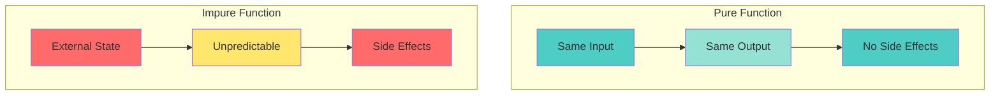

# 📘 **JAVASCRIPT MASTERY - Lesson 8: Array Methods & Functional Programming**

**Date**: 23-03-26
**Level**: 🟢 Beginner → 🔴 Senior Engineer
**Series**: JavaScript Fundamentals
**Time**: 55 minutes
**Prerequisites**: Lesson 1-7 (Foundations through DOM/Events)

---

## 🎯 **LEARNING OBJECTIVES**

After completing this **comprehensive** lesson, you will:

1. ✅ **Master Array Iteration** - forEach, map, filter, reduce, some, every
2. ✅ **Master Array Transformation** - flat, flatMap, slice, splice, concat
3. ✅ **Master Array Searching** - find, findIndex, includes, indexOf
4. ✅ **Understand Functional Programming** - Pure functions, immutability, composition
5. ✅ **Apply FP Patterns** - Currying, partial application, function composition
6. ✅ **Write Declarative Code** - Transform complex operations into readable chains

---

## 📦 **PART 1: ARRAY ITERATION METHODS**

### **forEach - Basic Iteration**

```javascript
// ─────────────────────────────────────────────
// BASIC forEach
// ─────────────────────────────────────────────
const numbers = [1, 2, 3, 4, 5];

numbers.forEach((num, index, array) => {
  console.log(`${index}: ${num}`);
});

// ─────────────────────────────────────────────
// ⚠️ forEach LIMITATIONS
// ─────────────────────────────────────────────
// Cannot break early
numbers.forEach(num => {
  if (num === 3) break;  // ❌ SyntaxError
});

// Cannot return value
const doubled = numbers.forEach(num => num * 2);
console.log(doubled);  // undefined

// Use for...of instead when you need break
for (const num of numbers) {
  if (num === 3) break;  // ✅ Works
  console.log(num);
}
```

---

### **map - Transform Elements**

```javascript
// ─────────────────────────────────────────────
// BASIC map
// ─────────────────────────────────────────────
const numbers = [1, 2, 3, 4, 5];

const doubled = numbers.map(num => num * 2);
console.log(doubled);  // [2, 4, 6, 8, 10]
console.log(numbers);  // [1, 2, 3, 4, 5] (original unchanged)

// ─────────────────────────────────────────────
// TRANSFORM OBJECTS
// ─────────────────────────────────────────────
const users = [
  { id: 1, name: 'John', age: 25 },
  { id: 2, name: 'Jane', age: 30 },
  { id: 3, name: 'Bob', age: 35 },
];

const userNames = users.map(user => user.name);
console.log(userNames);  // ['John', 'Jane', 'Bob']

const userSummaries = users.map(user => ({
  id: user.id,
  displayName: `${user.name} (${user.age})`,
}));

// ─────────────────────────────────────────────
// CHAINING map
// ─────────────────────────────────────────────
const result = [1, 2, 3]
  .map(n => n * 2)      // [2, 4, 6]
  .map(n => n + 1)      // [3, 5, 7]
  .map(n => n * n);     // [9, 25, 49]

console.log(result);  // [9, 25, 49]

// ─────────────────────────────────────────────
// MAP WITH INDEX
// ─────────────────────────────────────────────
const letters = ['a', 'b', 'c'];
const indexed = letters.map((letter, index) => `${index}: ${letter}`);
console.log(indexed);  // ['0: a', '1: b', '2: c']
```

---

### **filter - Select Elements**

```javascript
// ─────────────────────────────────────────────
// BASIC filter
// ─────────────────────────────────────────────
const numbers = [1, 2, 3, 4, 5, 6, 7, 8, 9, 10];

const evens = numbers.filter(n => n % 2 === 0);
console.log(evens);  // [2, 4, 6, 8, 10]

// ─────────────────────────────────────────────
// FILTER OBJECTS
// ─────────────────────────────────────────────
const users = [
  { id: 1, name: 'John', age: 25, active: true },
  { id: 2, name: 'Jane', age: 30, active: false },
  { id: 3, name: 'Bob', age: 35, active: true },
];

const activeUsers = users.filter(user => user.active);
const adultUsers = users.filter(user => user.age >= 30);

// ─────────────────────────────────────────────
// COMPLEX FILTERS
// ─────────────────────────────────────────────
const products = [
  { name: 'Laptop', price: 1000, stock: 5 },
  { name: 'Phone', price: 500, stock: 0 },
  { name: 'Tablet', price: 300, stock: 10 },
];

const availableProducts = products.filter(
  product => product.stock > 0 && product.price < 800
);

// ─────────────────────────────────────────────
// REMOVE DUPLICATES
// ─────────────────────────────────────────────
const numbers2 = [1, 2, 2, 3, 4, 4, 5];
const unique = numbers2.filter((num, index, arr) => {
  return arr.indexOf(num) === index;
});
console.log(unique);  // [1, 2, 3, 4, 5]

// Or with Set (cleaner)
const unique2 = [...new Set(numbers2)];
```

---

### **reduce - Accumulate Values**

```javascript
// ─────────────────────────────────────────────
// BASIC reduce
// ─────────────────────────────────────────────
const numbers = [1, 2, 3, 4, 5];

const sum = numbers.reduce((acc, num) => acc + num, 0);
console.log(sum);  // 15

// Step by step:
// acc=0, num=1 → 1
// acc=1, num=2 → 3
// acc=3, num=3 → 6
// acc=6, num=4 → 10
// acc=10, num=5 → 15

// ─────────────────────────────────────────────
// WITHOUT INITIAL VALUE
// ─────────────────────────────────────────────
const max = numbers.reduce((acc, num) => Math.max(acc, num));
console.log(max);  // 5
// First iteration: acc=1 (first element), num=2

// ─────────────────────────────────────────────
// TRANSFORM TO OBJECT
// ─────────────────────────────────────────────
const users = [
  { id: 1, name: 'John', role: 'admin' },
  { id: 2, name: 'Jane', role: 'user' },
  { id: 3, name: 'Bob', role: 'admin' },
];

const groupedByRole = users.reduce((acc, user) => {
  const role = user.role;
  if (!acc[role]) acc[role] = [];
  acc[role].push(user);
  return acc;
}, {});

console.log(groupedByRole);
// {
//   admin: [{ id: 1, name: 'John', role: 'admin' }, ...],
//   user: [{ id: 2, name: 'Jane', role: 'user' }]
// }

// ─────────────────────────────────────────────
// FLATTEN ARRAY
// ─────────────────────────────────────────────
const nested = [[1, 2], [3, 4], [5, 6]];
const flat = nested.reduce((acc, arr) => acc.concat(arr), []);
console.log(flat);  // [1, 2, 3, 4, 5, 6]

// ─────────────────────────────────────────────
// PIPELINE WITH reduce
// ─────────────────────────────────────────────
const pipeline = [
  arr => arr.filter(n => n > 2),
  arr => arr.map(n => n * 2),
  arr => arr.reduce((sum, n) => sum + n, 0),
];

const result = pipeline.reduce(
  (acc, fn) => fn(acc),
  [1, 2, 3, 4, 5]
);
console.log(result);  // 24 (3*2 + 4*2 + 5*2)
```

---

### **some & every - Test Conditions**

```javascript
// ─────────────────────────────────────────────
// some - At least One
// ─────────────────────────────────────────────
const numbers = [1, 2, 3, 4, 5];

const hasEven = numbers.some(n => n % 2 === 0);
console.log(hasEven);  // true

const hasNegative = numbers.some(n => n < 0);
console.log(hasNegative);  // false

// Form validation
const formFields = [
  { name: 'email', valid: true },
  { name: 'password', valid: false },
  { name: 'confirm', valid: true },
];

const hasErrors = formFields.some(field => !field.valid);
console.log(hasErrors);  // true

// ─────────────────────────────────────────────
// every - All Elements
// ─────────────────────────────────────────────
const allPositive = numbers.every(n => n > 0);
console.log(allPositive);  // true

const allEven = numbers.every(n => n % 2 === 0);
console.log(allEven);  // false

// Check if all fields valid
const allValid = formFields.every(field => field.valid);
console.log(allValid);  // false
```

---

## 📦 **PART 2: ARRAY SEARCHING & FINDING**

### **find & findIndex**

```javascript
// ─────────────────────────────────────────────
// find - First Match
// ─────────────────────────────────────────────
const users = [
  { id: 1, name: 'John', age: 25 },
  { id: 2, name: 'Jane', age: 30 },
  { id: 3, name: 'Bob', age: 35 },
];

const user = users.find(u => u.id === 2);
console.log(user);  // { id: 2, name: 'Jane', age: 30 }

const adult = users.find(u => u.age >= 30);
console.log(adult);  // { id: 2, name: 'Jane', age: 30 }

const notFound = users.find(u => u.id === 999);
console.log(notFound);  // undefined

// ─────────────────────────────────────────────
// findIndex - Index of First Match
// ─────────────────────────────────────────────
const index = users.findIndex(u => u.id === 2);
console.log(index);  // 1

const notFoundIndex = users.findIndex(u => u.id === 999);
console.log(notFoundIndex);  // -1

// Remove by index
const removeIndex = users.findIndex(u => u.id === 2);
if (removeIndex !== -1) {
  users.splice(removeIndex, 1);
}
```

---

### **indexOf, includes, lastIndexOf**

```javascript
// ─────────────────────────────────────────────
// indexOf - Find Index
// ─────────────────────────────────────────────
const fruits = ['apple', 'banana', 'orange', 'banana'];

console.log(fruits.indexOf('banana'));        // 1 (first occurrence)
console.log(fruits.indexOf('grape'));         // -1 (not found)
console.log(fruits.indexOf('banana', 2));     // 3 (start from index 2)

// ─────────────────────────────────────────────
// includes - Check Existence
// ─────────────────────────────────────────────
console.log(fruits.includes('banana'));       // true
console.log(fruits.includes('grape'));        // false
console.log(fruits.includes('banana', 2));    // true (start from index 2)

// Check for NaN
const arr = [1, 2, NaN, 4];
console.log(arr.includes(NaN));  // true
console.log(arr.indexOf(NaN));   // -1 (doesn't work with NaN)

// ─────────────────────────────────────────────
// lastIndexOf - Last Occurrence
// ─────────────────────────────────────────────
console.log(fruits.lastIndexOf('banana'));    // 3
```

---

## 📦 **PART 3: ARRAY TRANSFORMATION**

### **slice & splice**

```javascript
// ─────────────────────────────────────────────
// slice - Extract Portion (Non-mutating)
// ─────────────────────────────────────────────
const arr = [1, 2, 3, 4, 5];

console.log(arr.slice(2));      // [3, 4, 5] (from index 2)
console.log(arr.slice(1, 4));   // [2, 3, 4] (from 1 to 4)
console.log(arr.slice(-2));     // [4, 5] (last 2)
console.log(arr.slice(0, -1));  // [1, 2, 3, 4] (all except last)
console.log(arr);               // [1, 2, 3, 4, 5] (unchanged)

// Copy array
const copy = arr.slice();

// ─────────────────────────────────────────────
// splice - Add/Remove (Mutating!)
// ─────────────────────────────────────────────
const arr2 = [1, 2, 3, 4, 5];

// Remove 2 elements starting at index 2
const removed = arr2.splice(2, 2);
console.log(removed);  // [3, 4]
console.log(arr2);     // [1, 2, 5]

// Insert at index 2
arr2.splice(2, 0, 'a', 'b');
console.log(arr2);  // [1, 2, 'a', 'b', 5]

// Replace at index 2
arr2.splice(2, 1, 'x');
console.log(arr2);  // [1, 2, 'x', 'b', 5]
```

---

### **concat, flat, flatMap**

```javascript
// ─────────────────────────────────────────────
// concat - Merge Arrays
// ─────────────────────────────────────────────
const arr1 = [1, 2, 3];
const arr2 = [4, 5, 6];

const merged = arr1.concat(arr2);
console.log(merged);  // [1, 2, 3, 4, 5, 6]

const merged2 = [...arr1, ...arr2];  // Modern way
console.log(merged2);  // [1, 2, 3, 4, 5, 6]

// ─────────────────────────────────────────────
// flat - Flatten Nested Arrays
// ─────────────────────────────────────────────
const nested = [1, [2, 3], [4, [5, 6]]];

console.log(nested.flat());        // [1, 2, 3, 4, [5, 6]] (1 level)
console.log(nested.flat(2));       // [1, 2, 3, 4, 5, 6] (2 levels)
console.log(nested.flat(Infinity)); // [1, 2, 3, 4, 5, 6] (all levels)

// ─────────────────────────────────────────────
// flatMap - Map + Flat
// ─────────────────────────────────────────────
const sentences = ['Hello World', 'JavaScript is Great'];

const words = sentences.flatMap(s => s.split(' '));
console.log(words);  // ['Hello', 'World', 'JavaScript', 'is', 'Great']

// Without flatMap
const words2 = sentences.map(s => s.split(' ')).flat();
```

---

## 📦 **PART 4: FUNCTIONAL PROGRAMMING**

### **Pure Functions & Immutability**



---

### **Pure Functions**

```javascript
// ─────────────────────────────────────────────
// PURE FUNCTION EXAMPLES
// ─────────────────────────────────────────────
// ✅ Pure: Same input → same output, no side effects
function add(a, b) {
  return a + b;
}

function double(arr) {
  return arr.map(n => n * 2);
}

function filterEven(arr) {
  return arr.filter(n => n % 2 === 0);
}

// ─────────────────────────────────────────────
// IMPURE FUNCTION EXAMPLES
// ─────────────────────────────────────────────
// ❌ Impure: Depends on external state
let multiplier = 2;
function multiply(x) {
  return x * multiplier;  // Depends on external variable
}

// ❌ Impure: Has side effect
function logAndDouble(arr) {
  console.log('Processing...');  // Side effect
  return arr.map(n => n * 2);
}

// ❌ Impure: Mutates input
function addElement(arr, el) {
  arr.push(el);  // Mutates original array
  return arr;
}

// ✅ Pure version
function addElementPure(arr, el) {
  return [...arr, el];  // Returns new array
}

// ─────────────────────────────────────────────
// IMMUTABLE OPERATIONS
// ─────────────────────────────────────────────
const original = [1, 2, 3];

// ❌ Mutating
original.push(4);
original[0] = 10;

// ✅ Non-mutating
const newArr1 = [...original, 4];
const newArr2 = [10, ...original.slice(1)];
const newArr3 = original.map(n => n === 1 ? 10 : n);
```

---

### **Function Composition**

```javascript
// ─────────────────────────────────────────────
// COMPOSE (Right to Left)
// ─────────────────────────────────────────────
function compose(...fns) {
  return function(x) {
    return fns.reduceRight((acc, fn) => fn(acc), x);
  };
}

const add1 = x => x + 1;
const double = x => x * 2;
const square = x => x * x;

const transform = compose(square, double, add1);
console.log(transform(3));  // ((3 + 1) * 2)² = 64

// ─────────────────────────────────────────────
// PIPE (Left to Right - More Readable)
// ─────────────────────────────────────────────
function pipe(...fns) {
  return function(x) {
    return fns.reduce((acc, fn) => fn(acc), x);
  };
}

const transform2 = pipe(add1, double, square);
console.log(transform2(3));  // ((3 + 1) * 2)² = 64

// ─────────────────────────────────────────────
// PRACTICAL: DATA PROCESSING PIPELINE
// ─────────────────────────────────────────────
const users = [
  { id: 1, name: 'John', age: 25, active: true },
  { id: 2, name: 'Jane', age: 30, active: false },
  { id: 3, name: 'Bob', age: 35, active: true },
  { id: 4, name: 'Alice', age: 28, active: true },
];

const pipeline = pipe(
  users => users.filter(u => u.active),
  users => users.map(u => ({ ...u, name: u.name.toUpperCase() })),
  users => users.sort((a, b) => a.age - b.age),
  users => users.slice(0, 2),
);

const result = pipeline(users);
console.log(result);
// [
//   { id: 1, name: 'JOHN', age: 25, active: true },
//   { id: 4, name: 'ALICE', age: 28, active: true }
// ]
```

---

### **Currying & Partial Application**

```javascript
// ─────────────────────────────────────────────
// CURRYING
// ─────────────────────────────────────────────
function add(a) {
  return function(b) {
    return function(c) {
      return a + b + c;
    };
  };
}

console.log(add(1)(2)(3));  // 6

// Generic curry function
function curry(fn) {
  return function curried(...args) {
    if (args.length >= fn.length) {
      return fn.apply(this, args);
    }
    return function(...moreArgs) {
      return curried.apply(this, args.concat(moreArgs));
    };
  };
}

function multiply(a, b, c) {
  return a * b * c;
}

const curriedMultiply = curry(multiply);
console.log(curriedMultiply(2)(3)(4));    // 24
console.log(curriedMultiply(2, 3)(4));    // 24
console.log(curriedMultiply(2)(3, 4));    // 24

// ─────────────────────────────────────────────
// PARTIAL APPLICATION
// ─────────────────────────────────────────────
function partial(fn, ...fixedArgs) {
  return function(...remainingArgs) {
    return fn.apply(this, fixedArgs.concat(remainingArgs));
  };
}

function greet(greeting, punctuation, name) {
  return `${greeting}, ${name}${punctuation}`;
}

const sayHello = partial(greet, 'Hello', '!');
console.log(sayHello('John'));  // "Hello, John!"

const sayHiJohn = partial(greet, 'Hi', '!', 'John');
console.log(sayHiJohn());  // "Hi, John!"
```

---

## ✅ **ARRAY METHODS CHECKLIST**

```
Iteration Methods
[ ] forEach for simple iteration
[ ] map for transformation
[ ] filter for selection
[ ] reduce for accumulation
[ ] some/every for testing

Searching Methods
[ ] find/findOne for first match
[ ] findIndex for index
[ ] includes for existence check
[ ] indexOf/lastIndexOf for position

Transformation Methods
[ ] slice for non-mutating extract
[ ] splice for mutating add/remove
[ ] concat/flat/flatMap for merging

Functional Programming
[ ] Write pure functions
[ ] Avoid mutations (immutability)
[ ] Use function composition
[ ] Apply currying/partial application
```

---

## 🎯 **KNOWLEDGE CHECK**

### **Question 1: Array Method Output**

What will this output?

```javascript
const nums = [1, 2, 3, 4, 5];

const result = nums
  .filter(n => n % 2 === 0)
  .map(n => n * 2)
  .reduce((sum, n) => sum + n, 0);

console.log(result);
```

<details>
<summary>💡 Click to reveal answer</summary>

```javascript
// Step 1: filter → [2, 4]
// Step 2: map → [4, 8]
// Step 3: reduce → 12

console.log(result);  // 12
```
</details>

---

### **Question 2: Refactor to Functional Style**

Refactor this imperative code:

```javascript
const users = [{ name: 'John', age: 25 }, { name: 'Jane', age: 30 }];
const result = [];
for (let user of users) {
  if (user.age > 25) {
    result.push(user.name.toUpperCase());
  }
}
```

<details>
<summary>💡 Click to reveal answer</summary>

```javascript
const result = users
  .filter(user => user.age > 25)
  .map(user => user.name.toUpperCase());
```
</details>

---

## 📚 **ADDITIONAL RESOURCES**

- **MDN**: [Array Methods](https://developer.mozilla.org/en-US/docs/Web/JavaScript/Reference/Global_Objects/Array)
- **Functional Programming**: [Professor Frisby](https://github.com/MostlyAdequate/mostly-adequate-guide)
- **JavaScript Info**: [Array Methods](https://javascript.info/array-methods)

---

## 🎓 **HOMEWORK**

1. ✅ Implement your own versions of map, filter, reduce
2. ✅ Create a data processing pipeline for e-commerce orders
3. ✅ Build a functional utility library (lodash-style)
4. ✅ Refactor imperative code to functional style
5. ✅ Create a compose/pipe function with error handling

---

**Next Lesson**: Design Patterns in JavaScript
**Date**: 23-03-26
**Status**: ✅ Complete

---
-23-03-26
