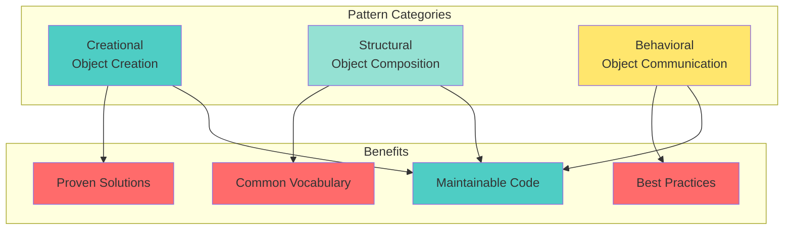
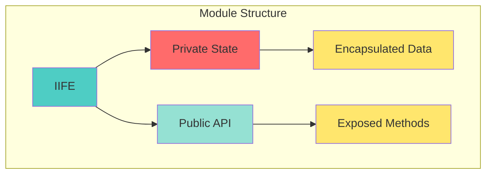

# 📘 **JAVASCRIPT MASTERY - Lesson 9: Design Patterns**

**Date**: 23-03-26
**Level**: 🟢 Beginner → 🔴 Senior Engineer
**Series**: JavaScript Fundamentals
**Time**: 55 minutes
**Prerequisites**: Lesson 1-8 (Foundations through Array Methods/FP)

---

## 🎯 **LEARNING OBJECTIVES**

After completing this **comprehensive** lesson, you will:

1. ✅ **Understand Design Patterns** - What, why, when to use patterns
2. ✅ **Master Creational Patterns** - Module, Singleton, Factory, Builder
3. ✅ **Master Structural Patterns** - Adapter, Decorator, Facade, Proxy
4. ✅ **Master Behavioral Patterns** - Observer, Pub/Sub, Command, Strategy
5. ✅ **Apply Patterns in JavaScript** - ES6+ implementations, real-world examples
6. ✅ **Recognize Anti-Patterns** - Common mistakes, when NOT to use patterns

---

## 📦 **PART 1: DESIGN PATTERNS FUNDAMENTALS**

### **What are Design Patterns?**



---

### **Why Use Patterns?**

```javascript
// ─────────────────────────────────────────────
// WITHOUT PATTERN (Spaghetti Code)
// ─────────────────────────────────────────────
function createUser(name, email, role, permissions) {
  const user = {};
  user.name = name;
  user.email = email;
  user.role = role || 'user';
  user.permissions = permissions || [];
  user.createdAt = new Date();
  user.isActive = true;
  user.settings = { theme: 'light', lang: 'en' };
  user.notifications = { email: true, sms: false };
  // ... 50 more lines of setup
  return user;
}

// ─────────────────────────────────────────────
// WITH PATTERN (Clean, Maintainable)
// ─────────────────────────────────────────────
const user = UserBuilder.create()
  .withName(name)
  .withEmail(email)
  .withRole(role)
  .withDefaultPermissions()
  .withDefaultSettings()
  .build();
```

---

## 📦 **PART 2: CREATIONAL PATTERNS**

### **Module Pattern**



```javascript
// ─────────────────────────────────────────────
// BASIC MODULE PATTERN
// ─────────────────────────────────────────────
const Counter = (function() {
  // Private state
  let count = 0;
  
  // Private methods
  function validate(value) {
    return typeof value === 'number';
  }
  
  // Public API
  return {
    increment() {
      count++;
      return count;
    },
    
    decrement() {
      count--;
      return count;
    },
    
    getCount() {
      return count;
    },
    
    reset() {
      count = 0;
      return count;
    },
  };
})();

// Usage
console.log(Counter.increment());  // 1
console.log(Counter.increment());  // 2
console.log(Counter.getCount());   // 2
// console.log(Counter.count);      // undefined (private!)

// ─────────────────────────────────────────────
// MODULE WITH REVEALING PATTERN
// ─────────────────────────────────────────────
const UserService = (function() {
  let users = [];
  let nextId = 1;
  
  function createUser(name, email) {
    const user = { id: nextId++, name, email };
    users.push(user);
    return user;
  }
  
  function getUserById(id) {
    return users.find(u => u.id === id);
  }
  
  function getAllUsers() {
    return [...users];  // Return copy
  }
  
  function deleteUser(id) {
    users = users.filter(u => u.id !== id);
  }
  
  // Reveal public methods
  return {
    create: createUser,
    getById: getUserById,
    getAll: getAllUsers,
    delete: deleteUser,
  };
})();

// ─────────────────────────────────────────────
// MODULAR MODULE (ES6)
// ─────────────────────────────────────────────
// counter.js
let count = 0;

export function increment() {
  count++;
  return count;
}

export function decrement() {
  count--;
  return count;
}

export function getCount() {
  return count;
}

// main.js
import * as Counter from './counter.js';
```

---

### **Singleton Pattern**

```javascript
// ─────────────────────────────────────────────
// BASIC SINGLETON
// ─────────────────────────────────────────────
const Singleton = (function() {
  let instance;
  
  function createInstance() {
    return {
      message: 'I am the singleton instance',
      getTime() {
        return new Date().toISOString();
      },
    };
  }
  
  return {
    getInstance() {
      if (!instance) {
        instance = createInstance();
      }
      return instance;
    },
  };
})();

// Usage
const s1 = Singleton.getInstance();
const s2 = Singleton.getInstance();
console.log(s1 === s2);  // true (same instance!)

// ─────────────────────────────────────────────
// SINGLETON WITH CLASS
// ─────────────────────────────────────────────
class Database {
  constructor() {
    if (Database.instance) {
      return Database.instance;
    }
    
    this.connection = null;
    this.isConnected = false;
    Database.instance = this;
  }
  
  async connect(connectionString) {
    if (this.isConnected) {
      console.log('Already connected');
      return;
    }
    
    console.log('Connecting to database...');
    this.connection = connectionString;
    this.isConnected = true;
  }
  
  async disconnect() {
    console.log('Disconnecting...');
    this.isConnected = false;
    this.connection = null;
  }
  
  query(sql) {
    if (!this.isConnected) {
      throw new Error('Not connected');
    }
    console.log('Executing:', sql);
  }
}

// Usage
const db1 = new Database();
const db2 = new Database();
console.log(db1 === db2);  // true

// ─────────────────────────────────────────────
// SINGLETON: Logger Service
// ─────────────────────────────────────────────
class Logger {
  constructor() {
    if (Logger.instance) {
      return Logger.instance;
    }
    
    this.logs = [];
    this.levels = {
      DEBUG: 0,
      INFO: 1,
      WARN: 2,
      ERROR: 3,
    };
    this.minLevel = this.levels.INFO;
    
    Logger.instance = this;
  }
  
  log(level, message) {
    if (level < this.minLevel) return;
    
    const entry = {
      timestamp: new Date().toISOString(),
      level: Object.keys(this.levels).find(k => this.levels[k] === level),
      message,
    };
    
    this.logs.push(entry);
    console.log(`[${entry.level}] ${entry.message}`);
  }
  
  debug(msg) { this.log(this.levels.DEBUG, msg); }
  info(msg) { this.log(this.levels.INFO, msg); }
  warn(msg) { this.log(this.levels.WARN, msg); }
  error(msg) { this.log(this.levels.ERROR, msg); }
  
  getLogs() {
    return [...this.logs];
  }
}

// ─────────────────────────────────────────────
// WHEN TO USE SINGLETON
// ─────────────────────────────────────────────
// ✅ Good for:
// - Database connections
// - Logger services
// - Configuration managers
// - Cache systems

// ❌ Avoid when:
// - You need multiple instances
// - Testing is important (hard to mock)
// - Global state causes issues
```

---

### **Factory Pattern**

```javascript
// ─────────────────────────────────────────────
// SIMPLE FACTORY
// ─────────────────────────────────────────────
class Car {
  constructor(type) {
    this.type = type;
    this.wheels = 4;
  }
  
  drive() {
    console.log(`Driving ${this.type}`);
  }
}

class Truck {
  constructor(type) {
    this.type = type;
    this.wheels = 18;
  }
  
  drive() {
    console.log(`Driving ${this.type} with cargo`);
  }
}

// Factory function
function createVehicle(type) {
  switch (type.toLowerCase()) {
    case 'car':
      return new Car('Sedan');
    case 'truck':
      return new Truck('Semi');
    default:
      throw new Error(`Unknown vehicle type: ${type}`);
  }
}

// Usage
const car = createVehicle('car');
const truck = createVehicle('truck');
car.drive();   // Driving Sedan
truck.drive(); // Driving Semi with cargo

// ─────────────────────────────────────────────
// FACTORY WITH CONFIGURATION
// ─────────────────────────────────────────────
class User {
  constructor({ name, email, role = 'user' }) {
    this.id = Date.now();
    this.name = name;
    this.email = email;
    this.role = role;
    this.createdAt = new Date();
  }
}

class AdminUser extends User {
  constructor(config) {
    super({ ...config, role: 'admin' });
    this.permissions = ['read', 'write', 'delete'];
  }
}

class GuestUser extends User {
  constructor(config) {
    super({ ...config, role: 'guest' });
    this.expiresAt = new Date(Date.now() + 24 * 60 * 60 * 1000);
  }
}

// Factory
class UserFactory {
  static create(type, config) {
    switch (type) {
      case 'admin':
        return new AdminUser(config);
      case 'guest':
        return new GuestUser(config);
      default:
        return new User(config);
    }
  }
}

// Usage
const admin = UserFactory.create('admin', {
  name: 'John',
  email: 'john@example.com',
});

const guest = UserFactory.create('guest', {
  name: 'Anonymous',
});

// ─────────────────────────────────────────────
// ABSTRACT FACTORY
// ─────────────────────────────────────────────
// UI Component Factory
class Button {
  render() {}
  onClick() {}
}

class Input {
  render() {}
  setValue() {}
}

// Concrete factories
class MaterialButton extends Button {
  render() { console.log('Rendering Material Button'); }
  onClick() { console.log('Material button clicked'); }
}

class MaterialInput extends Input {
  render() { console.log('Rendering Material Input'); }
  setValue(val) { console.log('Setting Material Input:', val); }
}

class BootstrapButton extends Button {
  render() { console.log('Rendering Bootstrap Button'); }
  onClick() { console.log('Bootstrap button clicked'); }
}

class BootstrapInput extends Input {
  render() { console.log('Rendering Bootstrap Input'); }
  setValue(val) { console.log('Setting Bootstrap Input:', val); }
}

// Abstract Factory
class UIFactory {
  createButton() {}
  createInput() {}
}

class MaterialFactory extends UIFactory {
  createButton() { return new MaterialButton(); }
  createInput() { return new MaterialInput(); }
}

class BootstrapFactory extends UIFactory {
  createButton() { return new BootstrapButton(); }
  createInput() { return new BootstrapInput(); }
}

// Usage
const factory = new MaterialFactory();  // or BootstrapFactory
const button = factory.createButton();
const input = factory.createInput();
button.render();
input.render();
```

---

### **Builder Pattern**

```javascript
// ─────────────────────────────────────────────
// BUILDER PATTERN
// ─────────────────────────────────────────────
class Pizza {
  constructor() {
    this.dough = '';
    this.sauce = '';
    this.toppings = [];
    this.cheese = '';
  }
  
  describe() {
    return `Pizza with ${this.dough}, ${this.sauce}, ${this.cheese}, and ${this.toppings.join(', ')}`;
  }
}

class PizzaBuilder {
  constructor() {
    this.pizza = new Pizza();
  }
  
  setDough(dough) {
    this.pizza.dough = dough;
    return this;
  }
  
  setSauce(sauce) {
    this.pizza.sauce = sauce;
    return this;
  }
  
  addTopping(topping) {
    this.pizza.toppings.push(topping);
    return this;
  }
  
  setCheese(cheese) {
    this.pizza.cheese = cheese;
    return this;
  }
  
  build() {
    return this.pizza;
  }
}

// Usage
const pizza = new PizzaBuilder()
  .setDough('thin crust')
  .setSauce('tomato')
  .setCheese('mozzarella')
  .addTopping('pepperoni')
  .addTopping('mushrooms')
  .build();

console.log(pizza.describe());
// Pizza with thin crust, tomato, mozzarella, and pepperoni, mushrooms

// ─────────────────────────────────────────────
// DIRECTOR (Optional)
// ─────────────────────────────────────────────
class PizzaDirector {
  constructor(builder) {
    this.builder = builder;
  }
  
  makeMargherita() {
    return this.builder
      .setDough('thin crust')
      .setSauce('tomato')
      .setCheese('mozzarella')
      .addTopping('basil')
      .build();
  }
  
  makePepperoni() {
    return this.builder
      .setDough('hand-tossed')
      .setSauce('tomato')
      .setCheese('mozzarella')
      .addTopping('pepperoni')
      .build();
  }
}

// Usage
const builder = new PizzaBuilder();
const director = new PizzaDirector(builder);

const margherita = director.makeMargherita();
const pepperoni = director.makePepperoni();
```

---

## 📦 **PART 3: STRUCTURAL PATTERNS**

### **Adapter Pattern**

```javascript
// ─────────────────────────────────────────────
// ADAPTER: Legacy API to New Interface
// ─────────────────────────────────────────────
// Legacy payment processor
class LegacyPaymentProcessor {
  processPayment(amount, cardNumber, expiry, cvv) {
    console.log(`Processing $${amount} with card ${cardNumber}`);
    return { success: true, transactionId: Date.now() };
  }
}

// New payment interface expected by app
class PaymentAdapter {
  constructor(legacyProcessor) {
    this.legacyProcessor = legacyProcessor;
  }
  
  pay(paymentRequest) {
    return this.legacyProcessor.processPayment(
      paymentRequest.amount,
      paymentRequest.card.number,
      paymentRequest.card.expiry,
      paymentRequest.card.cvv
    );
  }
}

// Usage
const legacy = new LegacyPaymentProcessor();
const adapter = new PaymentAdapter(legacy);

adapter.pay({
  amount: 100,
  card: {
    number: '1234-5678-9012-3456',
    expiry: '12/25',
    cvv: '123',
  },
});
```

---

### **Decorator Pattern**

```javascript
// ─────────────────────────────────────────────
// DECORATOR: Add Behavior Dynamically
// ─────────────────────────────────────────────
class Coffee {
  cost() { return 5; }
  description() { return 'Coffee'; }
}

class MilkDecorator {
  constructor(coffee) {
    this.coffee = coffee;
  }
  
  cost() {
    return this.coffee.cost() + 2;
  }
  
  description() {
    return this.coffee.description() + ', Milk';
  }
}

class SugarDecorator {
  constructor(coffee) {
    this.coffee = coffee;
  }
  
  cost() {
    return this.coffee.cost() + 1;
  }
  
  description() {
    return this.coffee.description() + ', Sugar';
  }
}

// Usage
let coffee = new Coffee();
coffee = new MilkDecorator(coffee);
coffee = new SugarDecorator(coffee);

console.log(coffee.description());  // Coffee, Milk, Sugar
console.log(coffee.cost());         // 8

// ─────────────────────────────────────────────
// FUNCTION DECORATOR
// ─────────────────────────────────────────────
function logExecution(fn) {
  return function(...args) {
    console.log(`Starting ${fn.name}`);
    const start = Date.now();
    const result = fn.apply(this, args);
    const end = Date.now();
    console.log(`Finished ${fn.name} in ${end - start}ms`);
    return result;
  };
}

function validateInput(fn) {
  return function(...args) {
    if (args.some(arg => arg === null || arg === undefined)) {
      throw new Error('Invalid arguments');
    }
    return fn.apply(this, args);
  };
}

// Usage
const processOrder = logExecution(
  validateInput(function(items, userId) {
    console.log('Processing order for user', userId);
    return { success: true };
  })
);

processOrder(['item1', 'item2'], 123);
```

---

### **Proxy Pattern**

```javascript
// ─────────────────────────────────────────────
// PROXY: Control Access to Object
// ─────────────────────────────────────────────
const user = {
  name: 'John',
  age: 25,
  password: 'secret123',
};

const userProxy = new Proxy(user, {
  get(target, prop) {
    if (prop === 'password') {
      console.log('Access denied to password');
      return undefined;
    }
    console.log(`Getting ${prop}`);
    return target[prop];
  },
  
  set(target, prop, value) {
    if (prop === 'age' && (value < 0 || value > 150)) {
      console.log('Invalid age');
      return false;
    }
    console.log(`Setting ${prop} to ${value}`);
    target[prop] = value;
    return true;
  },
});

// Usage
console.log(userProxy.name);     // Getting name, then "John"
console.log(userProxy.password); // Access denied, then undefined
userProxy.age = 30;              // Setting age to 30
userProxy.age = -5;              // Invalid age
```

---

## 📦 **PART 4: BEHAVIORAL PATTERNS**

### **Observer Pattern**

```javascript
// ─────────────────────────────────────────────
// OBSERVER PATTERN
// ─────────────────────────────────────────────
class Subject {
  constructor() {
    this.observers = [];
  }
  
  subscribe(observer) {
    this.observers.push(observer);
  }
  
  unsubscribe(observer) {
    this.observers = this.observers.filter(o => o !== observer);
  }
  
  notify(data) {
    this.observers.forEach(observer => {
      observer.update(data);
    });
  }
}

class Observer {
  constructor(name) {
    this.name = name;
  }
  
  update(data) {
    console.log(`${this.name} received:`, data);
  }
}

// Usage
const subject = new Subject();

const observer1 = new Observer('Observer 1');
const observer2 = new Observer('Observer 2');

subject.subscribe(observer1);
subject.subscribe(observer2);

subject.notify('Hello Observers!');
// Observer 1 received: Hello Observers!
// Observer 2 received: Hello Observers!

subject.unsubscribe(observer1);
subject.notify('Only Observer 2 gets this');
```

---

### **Pub/Sub Pattern**

```javascript
// ─────────────────────────────────────────────
// PUBLISH/SUBSCRIBE (Event Bus)
// ─────────────────────────────────────────────
class EventBus {
  constructor() {
    this.events = {};
  }
  
  on(event, callback) {
    if (!this.events[event]) {
      this.events[event] = [];
    }
    this.events[event].push(callback);
  }
  
  off(event, callback) {
    if (!this.events[event]) return;
    this.events[event] = this.events[event].filter(cb => cb !== callback);
  }
  
  emit(event, data) {
    if (!this.events[event]) return;
    this.events[event].forEach(callback => callback(data));
  }
  
  once(event, callback) {
    const wrapper = (data) => {
      callback(data);
      this.off(event, wrapper);
    };
    this.on(event, wrapper);
  }
}

// Usage
const bus = new EventBus();

// Subscribe
bus.on('user:login', (user) => {
  console.log('User logged in:', user.name);
});

bus.on('user:logout', (user) => {
  console.log('User logged out:', user.name);
});

// Emit events
bus.emit('user:login', { name: 'John', id: 1 });
bus.emit('user:logout', { name: 'John', id: 1 });

// One-time subscription
bus.once('notification', (msg) => {
  console.log('Received notification:', msg);
});

bus.emit('notification', 'Hello!');  // Logs
bus.emit('notification', 'Again!');  // Doesn't log
```

---

### **Command Pattern**

```javascript
// ─────────────────────────────────────────────
// COMMAND PATTERN
// ─────────────────────────────────────────────
class Light {
  turnOn() { console.log('Light ON'); }
  turnOff() { console.log('Light OFF'); }
}

class Command {
  execute() {}
  undo() {}
}

class LightOnCommand extends Command {
  constructor(light) {
    super();
    this.light = light;
  }
  
  execute() {
    this.light.turnOn();
  }
  
  undo() {
    this.light.turnOff();
  }
}

class LightOffCommand extends Command {
  constructor(light) {
    super();
    this.light = light;
  }
  
  execute() {
    this.light.turnOff();
  }
  
  undo() {
    this.light.turnOn();
  }
}

class RemoteControl {
  constructor() {
    this.commands = [];
    this.history = [];
  }
  
  setCommand(command) {
    this.commands.push(command);
  }
  
  pressButton(index) {
    const command = this.commands[index];
    if (command) {
      command.execute();
      this.history.push(command);
    }
  }
  
  undoLast() {
    const command = this.history.pop();
    if (command) {
      command.undo();
    }
  }
}

// Usage
const light = new Light();
const remote = new RemoteControl();

remote.setCommand(new LightOnCommand(light));
remote.setCommand(new LightOffCommand(light));

remote.pressButton(0);  // Light ON
remote.pressButton(1);  // Light OFF
remote.undoLast();      // Light ON
```

---

### **Strategy Pattern**

```javascript
// ─────────────────────────────────────────────
// STRATEGY PATTERN
// ─────────────────────────────────────────────
class PaymentStrategy {
  pay(amount) {}
}

class CreditCardPayment extends PaymentStrategy {
  constructor(cardNumber) {
    super();
    this.cardNumber = cardNumber;
  }
  
  pay(amount) {
    console.log(`Paid $${amount} with Credit Card ${this.cardNumber}`);
  }
}

class PayPalPayment extends PaymentStrategy {
  constructor(email) {
    super();
    this.email = email;
  }
  
  pay(amount) {
    console.log(`Paid $${amount} with PayPal ${this.email}`);
  }
}

class CryptoPayment extends PaymentStrategy {
  constructor(walletAddress) {
    super();
    this.walletAddress = walletAddress;
  }
  
  pay(amount) {
    console.log(`Paid $${amount} with Crypto ${this.walletAddress}`);
  }
}

class ShoppingCart {
  constructor() {
    this.items = [];
    this.paymentStrategy = null;
  }
  
  addItem(item) {
    this.items.push(item);
  }
  
  setPaymentStrategy(strategy) {
    this.paymentStrategy = strategy;
  }
  
  checkout() {
    const total = this.items.reduce((sum, item) => sum + item.price, 0);
    console.log('Total:', total);
    
    if (this.paymentStrategy) {
      this.paymentStrategy.pay(total);
    } else {
      console.log('No payment method selected');
    }
  }
}

// Usage
const cart = new ShoppingCart();
cart.addItem({ name: 'Item 1', price: 50 });
cart.addItem({ name: 'Item 2', price: 50 });

cart.setPaymentStrategy(new CreditCardPayment('1234-5678'));
cart.checkout();  // Paid $100 with Credit Card 1234-5678

cart.setPaymentStrategy(new PayPalPayment('user@example.com'));
cart.checkout();  // Paid $100 with PayPal user@example.com
```

---

## ✅ **DESIGN PATTERNS CHECKLIST**

```
Creational Patterns
[ ] Module pattern for encapsulation
[ ] Singleton for single instances
[ ] Factory for object creation
[ ] Builder for complex objects

Structural Patterns
[ ] Adapter for incompatible interfaces
[ ] Decorator for adding behavior
[ ] Proxy for controlled access

Behavioral Patterns
[ ] Observer for reactive systems
[ ] Pub/Sub for event-driven architecture
[ ] Command for undo/redo
[ ] Strategy for interchangeable algorithms
```

---

## 🎯 **KNOWLEDGE CHECK**

### **Question 1: Identify the Pattern**

What pattern is this?

```javascript
class Logger {
  constructor() {
    if (Logger.instance) return Logger.instance;
    this.logs = [];
    Logger.instance = this;
  }
  log(msg) { this.logs.push(msg); }
}
```

<details>
<summary>💡 Click to reveal answer</summary>

**Singleton Pattern** - Ensures only one instance of Logger exists.
</details>

---

### **Question 2: Implement Observer**

Implement a simple Observer pattern for a weather station.

<details>
<summary>💡 Click to reveal answer</summary>

```javascript
class WeatherStation {
  constructor() {
    this.observers = [];
    this.temperature = 0;
  }
  
  subscribe(observer) {
    this.observers.push(observer);
  }
  
  setTemperature(temp) {
    this.temperature = temp;
    this.notify();
  }
  
  notify() {
    this.observers.forEach(obs => obs.update(this.temperature));
  }
}

class Display {
  update(temp) {
    console.log(`Temperature: ${temp}°C`);
  }
}

const station = new WeatherStation();
const display = new Display();
station.subscribe(display);
station.setTemperature(25);  // Temperature: 25°C
```
</details>

---

## 📚 **ADDITIONAL RESOURCES**

- **Book**: "Learning JavaScript Design Patterns" by Addy Osmani
- **Refactoring Guru**: [Design Patterns](https://refactoring.guru/design-patterns)
- **MDN**: [Proxy](https://developer.mozilla.org/en-US/docs/Web/JavaScript/Reference/Global_Objects/Proxy)

---

## 🎓 **HOMEWORK**

1. ✅ Build a state management system using Observer pattern
2. ✅ Create a plugin architecture using Strategy pattern
3. ✅ Implement undo/redo using Command pattern
4. ✅ Build an API client using Adapter pattern
5. ✅ Create a caching system using Proxy pattern

---

**Next Lesson**: Performance & Optimization
**Date**: 23-03-26
**Status**: ✅ Complete

---
-23-03-26
