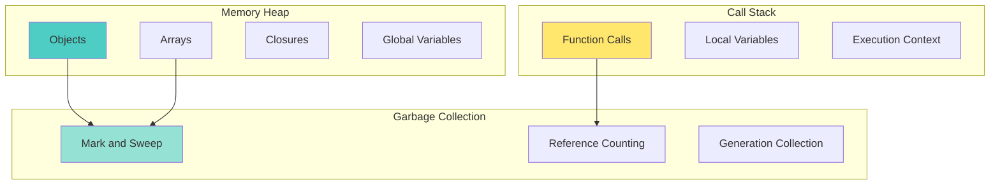
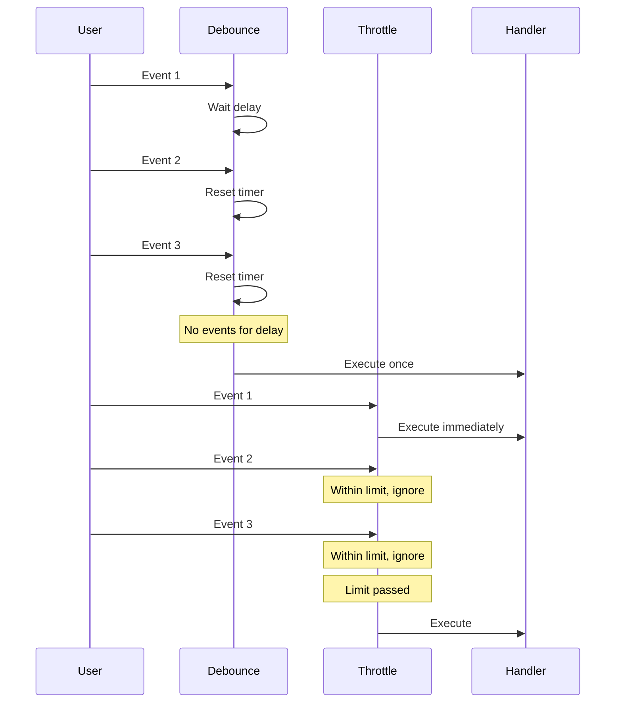
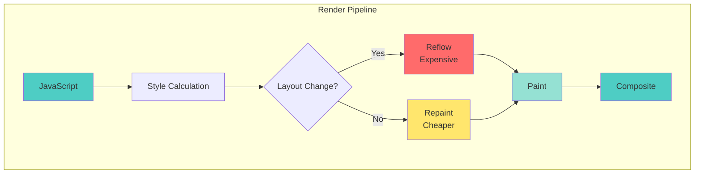

# 📘 **JAVASCRIPT MASTERY - Lesson 10: Performance & Optimization**

**Date**: 23-03-26
**Level**: 🟢 Beginner → 🔴 Senior Engineer
**Series**: JavaScript Fundamentals
**Time**: 60 minutes
**Prerequisites**: Lesson 1-9 (All previous lessons)

---

- [LastRead](#lastRead)

## 🎯 **LEARNING OBJECTIVES**

After completing this **comprehensive** lesson, you will:

1. ✅ **Understand Memory Management** - Heap, stack, garbage collection, memory leaks
2. ✅ **Master Performance Optimization** - Debouncing, throttling, lazy loading, caching
3. ✅ **Optimize DOM Operations** - Reflow, repaint, batching, virtual DOM concepts
4. ✅ **Master Async Performance** - Web Workers, Service Workers, parallel execution
5. ✅ **Profile & Debug Performance** - Chrome DevTools, performance metrics, Lighthouse
6. ✅ **Apply Best Practices** - Code splitting, tree shaking, bundling, delivery optimization

---

## 📦 **PART 1: MEMORY MANAGEMENT**

### **JavaScript Memory Model**



---

### **Memory Leaks & Prevention**

```javascript
// ─────────────────────────────────────────────
// MEMORY LEAK: Forgotten Timers
// ─────────────────────────────────────────────
// ❌ Bad: Timer never cleared
function startLeak() {
  const data = new Array(1000000).fill("data");
  setInterval(() => {
    console.log(data.length);
  }, 1000);
  // Timer keeps running even after function exits
}

// ✅ Good: Clear timer when done
function startNoLeak() {
  const data = new Array(1000000).fill("data");
  const intervalId = setInterval(() => {
    console.log(data.length);
  }, 1000);

  // Clear when no longer needed
  setTimeout(() => {
    clearInterval(intervalId);
  }, 60000); // Stop after 1 minute
}

// ─────────────────────────────────────────────
// MEMORY LEAK: Event Listeners
// ─────────────────────────────────────────────
// ❌ Bad: Listener never removed
function attachLeak() {
  const element = document.getElementById("myElement");
  const handler = () => console.log("Clicked");
  element.addEventListener("click", handler);
  // Listener persists even after element removed
}

// ✅ Good: Remove listener on cleanup
function attachNoLeak() {
  const element = document.getElementById("myElement");
  const handler = () => console.log("Clicked");
  element.addEventListener("click", handler);

  // Cleanup function
  return () => {
    element.removeEventListener("click", handler);
  };
}

// ─────────────────────────────────────────────
// MEMORY LEAK: Closures
// ─────────────────────────────────────────────
// ❌ Bad: Large data kept in closure
function createLeak() {
  const largeData = new Array(1000000).fill("data");

  return function () {
    console.log("Small operation");
    // largeData is kept in memory even though not used
  };
}

// ✅ Good: Only capture what's needed
function createNoLeak() {
  const largeData = new Array(1000000).fill("data");
  const summary = { length: largeData.length }; // Only keep summary

  return function () {
    console.log("Summary:", summary);
    // largeData can be garbage collected
  };
}

// ─────────────────────────────────────────────
// MEMORY LEAK: Detached DOM Nodes
// ─────────────────────────────────────────────
// ❌ Bad: Reference to removed element
let cachedElement = null;

function leakDOM() {
  const element = document.getElementById("myElement");
  cachedElement = element; // Keep reference

  element.remove(); // Remove from DOM
  // Element still in memory due to cachedElement reference
}

// ✅ Good: Clear references
function noLeakDOM() {
  const element = document.getElementById("myElement");

  element.remove();
  cachedElement = null; // Clear reference
}

// ─────────────────────────────────────────────
// MEMORY LEAK: Global Variables
// ─────────────────────────────────────────────
// ❌ Bad: Implicit globals
function leakGlobal() {
  leakedVar = "I am global"; // Forgot 'let/const/var'
  window.anotherGlobal = "Also global";
}

// ✅ Good: Use local scope
function noLeakGlobal() {
  const localVar = "I am local";
  // Automatically cleaned up after function exits
}

// ─────────────────────────────────────────────
// DETECTING MEMORY LEAKS
// ─────────────────────────────────────────────
// Chrome DevTools: Memory tab
// 1. Take heap snapshot
// 2. Perform action
// 3. Take another snapshot
// 4. Compare snapshots for retained objects

// Performance Monitor
if (performance.memory) {
  console.log("Used JS Heap:", performance.memory.usedJSHeapSize);
  console.log("Total JS Heap:", performance.memory.totalJSHeapSize);
}
```

---

## 📦 **PART 2: PERFORMANCE OPTIMIZATION TECHNIQUES**

### **Debouncing & Throttling**



---

```javascript
// ─────────────────────────────────────────────
// DEBOUNCING (Wait for Pause)
// ─────────────────────────────────────────────
// Execute function after specified delay since last call
function debounce(fn, delay) {
  let timeoutId;

  return function (...args) {
    clearTimeout(timeoutId);
    timeoutId = setTimeout(() => {
      fn.apply(this, args);
    }, delay);
  };
}

// Usage: Search input
const searchInput = document.getElementById("search");
const handleSearch = debounce((query) => {
  console.log("Searching:", query);
  // API call here
}, 300);

searchInput.addEventListener("input", (e) => {
  handleSearch(e.target.value);
});

// ─────────────────────────────────────────────
// DEBOUNCE WITH IMMEDIATE OPTION
// ─────────────────────────────────────────────
function debounceImmediate(fn, delay, immediate = false) {
  let timeoutId;

  return function (...args) {
    const callNow = immediate && !timeoutId;

    clearTimeout(timeoutId);
    timeoutId = setTimeout(() => {
      timeoutId = null;
      if (!immediate) fn.apply(this, args);
    }, delay);

    if (callNow) fn.apply(this, args);
  };
}

// ─────────────────────────────────────────────
// THROTTLING (Limit Rate)
// ─────────────────────────────────────────────
// Execute function at most once per specified interval
function throttle(fn, limit) {
  let lastCall = 0;

  return function (...args) {
    const now = Date.now();

    if (now - lastCall >= limit) {
      lastCall = now;
      fn.apply(this, args);
    }
  };
}

// Usage: Scroll event
window.addEventListener(
  "scroll",
  throttle(() => {
    console.log("Scroll position:", window.scrollY);
    // Update UI, load more content, etc.
  }, 100),
); // Max once per 100ms

// ─────────────────────────────────────────────
// THROTTLE WITH TRAILING EDGE
// ─────────────────────────────────────────────
function throttleTrailing(fn, limit) {
  let timeoutId = null;
  let lastCall = 0;

  return function (...args) {
    const now = Date.now();
    const remaining = limit - (now - lastCall);

    if (remaining <= 0) {
      clearTimeout(timeoutId);
      timeoutId = null;
      lastCall = now;
      fn.apply(this, args);
    } else if (!timeoutId) {
      timeoutId = setTimeout(() => {
        lastCall = Date.now();
        timeoutId = null;
        fn.apply(this, args);
      }, remaining);
    }
  };
}

// ─────────────────────────────────────────────
// WHEN TO USE EACH
// ─────────────────────────────────────────────
// Debounce: Search inputs, form validation, window resize
// Throttle: Scroll handlers, button clicks, API rate limiting
```

---

### **Lazy Loading**

```javascript
// ─────────────────────────────────────────────
// LAZY LOADING IMAGES
// ─────────────────────────────────────────────
// Using Intersection Observer (Modern)
const images = document.querySelectorAll('img[data-src]');

const imageObserver = new IntersectionObserver((entries, observer) => {
  entries.forEach(entry => {
    if (entry.isIntersecting) {
      const img = entry.target;
      img.src = img.dataset.src;
      img.removeAttribute('data-src');
      observer.unobserve(img);
    }
  });
}, {
  rootMargin: '50px 0px',  // Start loading 50px before visible
});

images.forEach(img => imageObserver.observe(img));

// HTML: 

// ─────────────────────────────────────────────
// LAZY LOADING COMPONENTS
// ─────────────────────────────────────────────
// Dynamic import for code splitting
async function loadComponent(name) {
  const module = await import(`./components/${name}.js`);
  return module.default;
}

// Usage
loadComponent('UserCard').then(Component => {
  // Render component
});

// ─────────────────────────────────────────────
// LAZY LOADING DATA (Infinite Scroll)
// ─────────────────────────────────────────────
class InfiniteScroll {
  constructor(options) {
    this.page = 1;
    this.loading = false;
    this.hasMore = true;
    this.container = options.container;
    this.onLoad = options.onLoad;

    this.setupObserver();
  }

  setupObserver() {
    this.observer = new IntersectionObserver(
      entries => {
        if (entries[0].isIntersecting && !this.loading && this.hasMore) {
          this.loadMore();
        }
      },
      { rootMargin: '100px' }
    );

    this sentinel = document.createElement('div');
    this.container.appendChild(this.sentinel);
    this.observer.observe(this.sentinel);
  }

  async loadMore() {
    this.loading = true;

    try {
      const data = await this.onLoad(this.page);
      this.render(data);
      this.page++;
      this.hasMore = data.length > 0;
    } finally {
      this.loading = false;
    }
  }

  render(data) {
    data.forEach(item => {
      const el = document.createElement('div');
      el.textContent = item.name;
      this.container.appendChild(el);
    });
  }
}

// Usage
new InfiniteScroll({
  container: document.getElementById('list'),
  onLoad: async (page) => {
    const res = await fetch(`/api/items?page=${page}`);
    return res.json();
  },
});
```

---

### **Caching & Memoization**

```javascript
// ─────────────────────────────────────────────
// SIMPLE CACHE
// ─────────────────────────────────────────────
function createCache(ttl = 5000) {
  const cache = new Map();

  return {
    get(key) {
      const item = cache.get(key);
      if (!item) return null;

      if (Date.now() > item.expiry) {
        cache.delete(key);
        return null;
      }

      return item.value;
    },

    set(key, value) {
      cache.set(key, {
        value,
        expiry: Date.now() + ttl,
      });
    },

    clear() {
      cache.clear();
    },
  };
}

// Usage
const cache = createCache(60000); // 1 minute TTL
cache.set("user:1", { name: "John" });
console.log(cache.get("user:1")); // { name: 'John' }

// ─────────────────────────────────────────────
// MEMOIZATION
// ─────────────────────────────────────────────
function memoize(fn) {
  const cache = new Map();

  return function (...args) {
    const key = JSON.stringify(args);

    if (cache.has(key)) {
      console.log("Cache hit");
      return cache.get(key);
    }

    const result = fn.apply(this, args);
    cache.set(key, result);
    console.log("Cache miss");
    return result;
  };
}

// Usage: Expensive computation
const expensiveCalculation = memoize((n) => {
  console.log("Computing...");
  let result = 0;
  for (let i = 0; i < n * 1000000; i++) {
    result += i;
  }
  return result;
});

console.log(expensiveCalculation(10)); // Computes
console.log(expensiveCalculation(10)); // From cache
console.log(expensiveCalculation(20)); // Computes

// ─────────────────────────────────────────────
// LRU CACHE (Least Recently Used)
// ─────────────────────────────────────────────
class LRUCache {
  constructor(capacity) {
    this.capacity = capacity;
    this.cache = new Map();
  }

  get(key) {
    if (!this.cache.has(key)) return null;

    // Move to end (most recently used)
    const value = this.cache.get(key);
    this.cache.delete(key);
    this.cache.set(key, value);

    return value;
  }

  put(key, value) {
    if (this.cache.has(key)) {
      this.cache.delete(key);
    } else if (this.cache.size >= this.capacity) {
      // Remove least recently used (first item)
      const firstKey = this.cache.keys().next().value;
      this.cache.delete(firstKey);
    }

    this.cache.set(key, value);
  }
}

// Usage
const lru = new LRUCache(2);
lru.put("a", 1);
lru.put("b", 2);
console.log(lru.get("a")); // 1 (now most recently used)
lru.put("c", 3); // Removes 'b' (least recently used)
```

---

## 📦 **PART 3: DOM PERFORMANCE**

### **Reflow & Repaint**



---

```javascript
// ─────────────────────────────────────────────
// TRIGGERING REFLOW (Avoid These)
// ─────────────────────────────────────────────
// Reading layout properties forces reflow:
element.offsetTop;
element.offsetLeft;
element.offsetWidth;
element.offsetHeight;
element.clientTop;
element.clientLeft;
element.clientWidth;
element.clientHeight;
element.getBoundingClientRect();
window.getComputedStyle(element);

// ─────────────────────────────────────────────
// ❌ BAD: Multiple Reflows
// ─────────────────────────────────────────────
function badReflow() {
  const element = document.getElementById("myElement");

  element.style.width = "100px"; // Reflow
  element.style.height = "200px"; // Reflow
  element.style.padding = "10px"; // Reflow
  element.style.margin = "5px"; // Reflow
}

// ─────────────────────────────────────────────
// ✅ GOOD: Batch DOM Changes
// ─────────────────────────────────────────────
function goodReflow() {
  const element = document.getElementById("myElement");

  // Apply all changes at once
  element.style.cssText = `
    width: 100px;
    height: 200px;
    padding: 10px;
    margin: 5px;
  `; // Single reflow
}

// ─────────────────────────────────────────────
// ✅ GOOD: Use Classes
// ─────────────────────────────────────────────
function bestReflow() {
  const element = document.getElementById("myElement");
  element.classList.add("styled"); // Single reflow
}

// CSS: .styled { width: 100px; height: 200px; ... }

// ─────────────────────────────────────────────
// ✅ GOOD: Detach Before Bulk Changes
// ─────────────────────────────────────────────
function updateList() {
  const list = document.getElementById("myList");

  // Remove from DOM
  list.style.display = "none";

  // Make changes (no reflow while hidden)
  for (let i = 0; i < 100; i++) {
    const li = document.createElement("li");
    li.textContent = `Item ${i}`;
    list.appendChild(li);
  }

  // Re-add to DOM (single reflow)
  list.style.display = "block";
}

// ─────────────────────────────────────────────
// ✅ GOOD: Use DocumentFragment
// ─────────────────────────────────────────────
function updateListFragment() {
  const list = document.getElementById("myList");
  const fragment = document.createDocumentFragment();

  for (let i = 0; i < 100; i++) {
    const li = document.createElement("li");
    li.textContent = `Item ${i}`;
    fragment.appendChild(li);
  }

  list.appendChild(fragment); // Single reflow
}

// ─────────────────────────────────────────────
// VIRTUAL SCROLLING (Large Lists)
// ─────────────────────────────────────────────
class VirtualList {
  constructor(container, items, itemHeight) {
    this.container = container;
    this.items = items;
    this.itemHeight = itemHeight;
    this.visibleCount = Math.ceil(container.clientHeight / itemHeight);

    this.container.style.overflow = "auto";
    this.container.innerHTML =
      '<div class="spacer"></div><div class="content"></div>';

    this.spacer = this.container.querySelector(".spacer");
    this.content = this.container.querySelector(".content");

    this.updateSpacer();
    this.container.addEventListener("scroll", () => this.render());
    this.render();
  }

  updateSpacer() {
    this.spacer.style.height = `${this.items.length * this.itemHeight}px`;
  }

  render() {
    const scrollTop = this.container.scrollTop;
    const startIndex = Math.floor(scrollTop / this.itemHeight);
    const endIndex = Math.min(
      startIndex + this.visibleCount,
      this.items.length,
    );

    this.content.style.transform = `translateY(${startIndex * this.itemHeight}px)`;
    this.content.innerHTML = "";

    for (let i = startIndex; i < endIndex; i++) {
      const div = document.createElement("div");
      div.style.height = `${this.itemHeight}px`;
      div.textContent = this.items[i];
      this.content.appendChild(div);
    }
  }
}

// Usage: Render 10,000 items efficiently
const virtualList = new VirtualList(
  document.getElementById("list"),
  Array.from({ length: 10000 }, (_, i) => `Item ${i}`),
  50, // Item height in pixels
);
```

---

## 📦 **PART 4: WEB WORKERS & PARALLEL EXECUTION**

### **Web Workers**

```javascript
// ─────────────────────────────────────────────
// WEB WORKER (Main Thread)
// ─────────────────────────────────────────────
// main.js
const worker = new Worker("worker.js");

// Send data to worker
worker.postMessage({ type: "COMPUTE", data: largeArray });

// Receive result
worker.onmessage = (event) => {
  console.log("Result from worker:", event.data);
};

// Handle errors
worker.onerror = (error) => {
  console.error("Worker error:", error);
};

// Terminate worker when done
// worker.terminate();

// ─────────────────────────────────────────────
// WEB WORKER (Worker Thread)
// ─────────────────────────────────────────────
// worker.js
self.onmessage = (event) => {
  const { type, data } = event.data;

  if (type === "COMPUTE") {
    const result = heavyComputation(data);
    self.postMessage(result);
  }
};

function heavyComputation(array) {
  // CPU-intensive work
  return array.reduce((sum, n) => sum + n, 0);
}

// ─────────────────────────────────────────────
// SHARED WORKER (Multiple Tabs)
// ─────────────────────────────────────────────
// main.js
const sharedWorker = new SharedWorker("shared-worker.js");
sharedWorker.port.start();
sharedWorker.port.postMessage("Hello");
sharedWorker.port.onmessage = (e) => console.log(e.data);

// shared-worker.js
const ports = [];

self.onconnect = (e) => {
  const port = e.ports[0];
  ports.push(port);
  port.start();

  port.onmessage = (e) => {
    // Broadcast to all ports
    ports.forEach((p) => p.postMessage(e.data));
  };
};

// ─────────────────────────────────────────────
// PROMISE-BASED WORKER WRAPPER
// ─────────────────────────────────────────────
function runWorker(workerUrl, data) {
  return new Promise((resolve, reject) => {
    const worker = new Worker(workerUrl);

    worker.onmessage = (e) => {
      resolve(e.data);
      worker.terminate();
    };

    worker.onerror = (e) => {
      reject(e);
      worker.terminate();
    };

    worker.postMessage(data);
  });
}

// Usage
const result = await runWorker("worker.js", largeArray);
```

---

## 📦 **PART 5: PERFORMANCE PROFILING**

### **Chrome DevTools Performance**

```javascript
// ─────────────────────────────────────────────
// CONSOLE.TIME (Simple Profiling)
// ─────────────────────────────────────────────
console.time("Operation");
// ... code to measure ...
console.timeEnd("Operation"); // "Operation: 12.345ms"

// ─────────────────────────────────────────────
// PERFORMANCE MARK (Precise Timing)
// ─────────────────────────────────────────────
performance.mark("start");
// ... code ...
performance.mark("end");
performance.measure("my-measure", "start", "end");

const measure = performance.getEntriesByName("my-measure")[0];
console.log(`Duration: ${measure.duration}ms`);

// ─────────────────────────────────────────────
// REQUEST IDLE CALLBACK
// ─────────────────────────────────────────────
// Execute during browser idle time
requestIdleCallback(
  (deadline) => {
    console.log(`Time remaining: ${deadline.timeRemaining()}ms`);
    console.log(`Did timeout: ${deadline.didTimeout}`);

    // Do non-critical work
    while (deadline.timeRemaining() > 0) {
      // Process items
    }
  },
  { timeout: 1000 },
); // Run within 1 second if not idle

// ─────────────────────────────────────────────
// REQUEST ANIMATION FRAME
// ─────────────────────────────────────────────
// Smooth animations (60fps)
function animate() {
  // Animation logic
  element.style.transform = `translateX(${position}px)`;

  requestAnimationFrame(animate);
}

requestAnimationFrame(animate);

// ─────────────────────────────────────────────
// PERFORMANCE OBSERVER
// ─────────────────────────────────────────────
const observer = new PerformanceObserver((list) => {
  list.getEntries().forEach((entry) => {
    console.log(`${entry.name}: ${entry.duration}ms`);
  });
});

observer.observe({ entryTypes: ["measure", "resource", "paint"] });
```

---

## ✅ **PERFORMANCE CHECKLIST**

```
Memory Management
[ ] Avoid global variables
[ ] Clear timers and listeners
[ ] Watch for closure leaks
[ ] Use WeakMap/WeakSet for caches

Optimization Techniques
[ ] Debounce input handlers
[ ] Throttle scroll/resize events
[ ] Lazy load images and components
[ ] Implement caching/memoization

DOM Performance
[ ] Batch DOM operations
[ ] Use classes instead of inline styles
[ ] Use DocumentFragment for bulk inserts
[ ] Avoid forced synchronous layouts

Async Performance
[ ] Use Web Workers for CPU-intensive tasks
[ ] Implement virtual scrolling for large lists
[ ] Use requestAnimationFrame for animations
[ ] Use requestIdleCallback for non-critical work

Profiling
[ ] Use Chrome DevTools Performance tab
[ ] Monitor memory with Heap Snapshots
[ ] Check Lighthouse scores
[ ] Measure Core Web Vitals
```

---

## 🎯 **KNOWLEDGE CHECK**

### **Question 1: Debounce vs Throttle**

When would you use debounce vs throttle?

<details>
<summary>💡 Click to reveal answer</summary>

**Debounce**: Search inputs (wait for user to stop typing)
**Throttle**: Scroll handlers (limit to once per 100ms)

</details>

---

### **Question 2: Fix the Memory Leak**

Fix this code:

```javascript
function setup() {
  const data = new Array(1000000).fill("data");
  const element = document.getElementById("myElement");

  element.addEventListener("click", () => {
    console.log(data.length);
  });
}
```

<details>
<summary>💡 Click to reveal answer</summary>

```javascript
function setup() {
  const data = new Array(1000000).fill("data");
  const element = document.getElementById("myElement");
  const dataLength = data.length; // Extract needed value

  const handler = () => {
    console.log(dataLength); // Use extracted value
  };

  element.addEventListener("click", handler);

  // Return cleanup function
  return () => {
    element.removeEventListener("click", handler);
  };
}
```

</details>

---

## 📚 **ADDITIONAL RESOURCES**

- **Chrome DevTools**: [Performance](https://developer.chrome.com/docs/devtools/performance/)
- **Web.dev**: [Performance](https://web.dev/performance/)
- **MDN**: [Web Workers](https://developer.mozilla.org/en-US/docs/Web/API/Web_Workers_API)
- **Google**: [Core Web Vitals](https://web.dev/vitals/)

---

## 🎓 **HOMEWORK**

1. ✅ Build a debounced search with caching
2. ✅ Implement infinite scroll with virtual rendering
3. ✅ Create a memoized API client
4. ✅ Profile and optimize a slow page
5. ✅ Implement a Web Worker for image processing

---

**🎉 CONGRATULATIONS!** You've completed the JavaScript Mastery series!

**Next Steps**:

- Practice with real projects
- Contribute to open source
- Learn a framework (React, Vue, Angular)
- Study Node.js for backend JavaScript
- Explore TypeScript for type safety

---

-23-03-26
