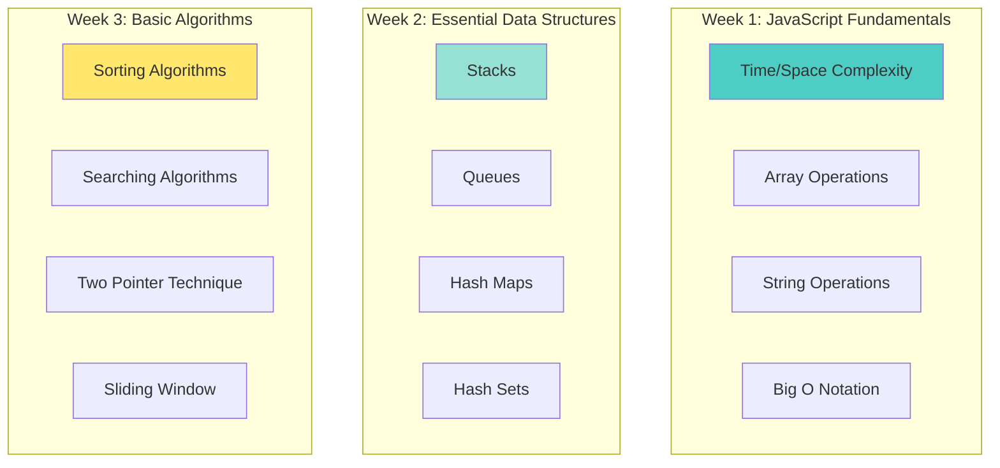
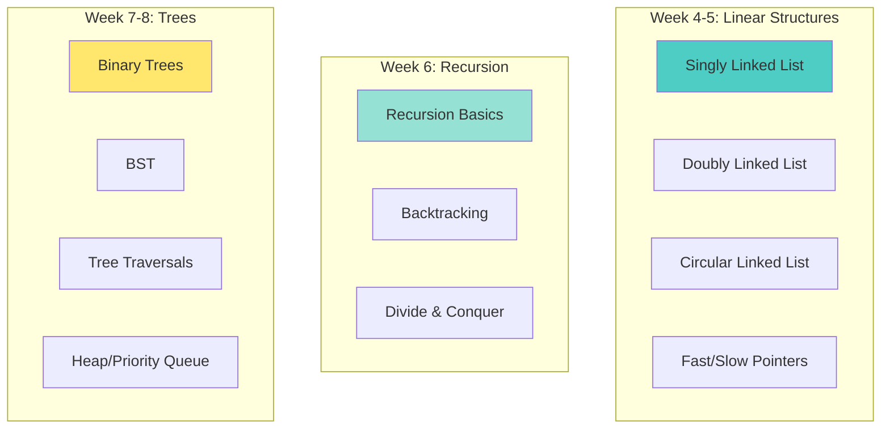
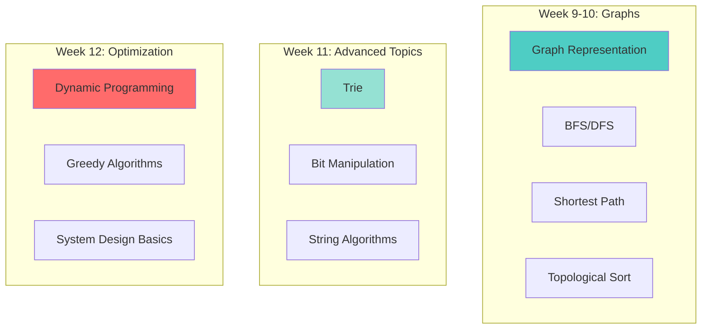

# 🎯 **COMPLETE DSA MASTERY FOR NODE.JS DEVELOPERS**

**Target Level**: Junior to Mid-Level (1-5 years experience)  
**Focus**: Practical DSA + Real-World Node.js Applications  
**Time**: 12-16 Weeks (Complete Roadmap)  

---

## 📋 **WHY DSA MATTERS FOR NODE.JS DEVELOPERS**

```
┌─────────────────────────────────────────────────────────────────┐
│                    DSA IN REAL NODE.JS WORK                      │
├─────────────────────────────────────────────────────────────────┤
│                                                                  │
│  📦 Array Methods (map, filter, reduce) → Data Transformation   │
│  🗂️  HashMaps (Map, Object) → Caching, Lookups, Sessions        │
│  📊 Sorting → Search Results, Leaderboards, Reports             │
│  🌲 Trees → JSON Parsing, DOM, File Systems, Database Indexes   │
│  🕸️  Graphs → Social Networks, Recommendations, Dependencies    │
│  ⚡ Heaps → Task Queues, Priority Scheduling, Rate Limiting     │
│  🔄 Recursion → Nested Data, Tree Traversal, File Operations    │
│  💾 DP → Optimization, Caching Strategies, Cost Calculations    │
│                                                                  │
└─────────────────────────────────────────────────────────────────┘
```

---

## 📚 **COMPLETE CURRICULUM OVERVIEW**

### **Phase 1: Foundations (Weeks 1-3)**



### **Phase 2: Intermediate (Weeks 4-8)**



### **Phase 3: Advanced (Weeks 9-12)**



---

## 📖 **DETAILED TOPIC BREAKDOWN**

### **MODULE 1: COMPLEXITY ANALYSIS**

```javascript
// ─────────────────────────────────────────────
// WHY COMPLEXITY MATTERS IN NODE.JS
// ─────────────────────────────────────────────
// Real-world scenario: Processing 10,000 user records

// ❌ BAD: O(n²) - Will be slow with large data
function findDuplicates(users) {
  const duplicates = [];
  for (let i = 0; i < users.length; i++) {
    for (let j = i + 1; j < users.length; j++) {
      if (users[i].email === users[j].email) {
        duplicates.push(users[i]);
      }
    }
  }
  return duplicates;
}
// 10,000 users = 100,000,000 operations = ~10 seconds

// ✅ GOOD: O(n) - Fast even with large data
function findDuplicatesOptimized(users) {
  const seen = new Map();
  const duplicates = [];
  for (const user of users) {
    if (seen.has(user.email)) {
      duplicates.push(user);
    } else {
      seen.set(user.email, true);
    }
  }
  return duplicates;
}
// 10,000 users = 10,000 operations = ~10 milliseconds

// ─────────────────────────────────────────────
// COMPLEXITY COMPARISON TABLE
// ─────────────────────────────────────────────
/*
Operations       | n=10 | n=100 | n=1000 | n=10000
-----------------|------|-------|--------|--------
O(1) Constant    |   1  |   1   |   1    |   1
O(log n) Log     |   1  |   2   |   3    |   4
O(n) Linear      |  10  | 100   | 1000   | 10000
O(n log n)       |  10  | 200   | 3000   | 40000
O(n²) Quadratic  | 100  | 10000 | 1M     | 100M
O(2ⁿ) Exponential| 1024 | Too  | Too    | Too
                 |      | Large| Large  | Large

RULE: For 10,000+ items, avoid O(n²) or worse
*/
```

---

### **MODULE 2: SORTING ALGORITHMS (COMPLETE)**

```javascript
// ─────────────────────────────────────────────
// 1. BUBBLE SORT (Educational Only)
// ─────────────────────────────────────────────
// Time: O(n²), Space: O(1)
// Use: Learning only, NEVER in production

function bubbleSort(arr) {
  const n = arr.length;
  let swapped;
  
  do {
    swapped = false;
    for (let i = 0; i < n - 1; i++) {
      if (arr[i] > arr[i + 1]) {
        // Swap
        [arr[i], arr[i + 1]] = [arr[i + 1], arr[i]];
        swapped = true;
      }
    }
  } while (swapped);
  
  return arr;
}

// Visualization:
// [5, 1, 4, 2, 8]
// Pass 1: [1, 4, 2, 5, 8]  (5 bubbles to end)
// Pass 2: [1, 2, 4, 5, 8]  (sorted, but algorithm doesn't know)
// Pass 3: [1, 2, 4, 5, 8]  (no swaps, done)

// ─────────────────────────────────────────────
// 2. SELECTION SORT (Educational Only)
// ─────────────────────────────────────────────
// Time: O(n²), Space: O(1)
// Use: Learning only, when memory is very limited

function selectionSort(arr) {
  const n = arr.length;
  
  for (let i = 0; i < n - 1; i++) {
    let minIdx = i;
    
    // Find minimum in remaining array
    for (let j = i + 1; j < n; j++) {
      if (arr[j] < arr[minIdx]) {
        minIdx = j;
      }
    }
    
    // Swap with current position
    if (minIdx !== i) {
      [arr[i], arr[minIdx]] = [arr[minIdx], arr[i]];
    }
  }
  
  return arr;
}

// Visualization:
// [64, 25, 12, 22, 11]
// [11, 25, 12, 22, 64]  (11 is min, swap with 64)
// [11, 12, 25, 22, 64]  (12 is min, swap with 25)
// [11, 12, 22, 25, 64]  (22 is min, swap with 25)
// Sorted!

// ─────────────────────────────────────────────
// 3. INSERTION SORT (Good for Small/Nearly Sorted)
// ─────────────────────────────────────────────
// Time: O(n²), Space: O(1)
// Best Case: O(n) when nearly sorted
// Use: Small arrays (< 50 items), nearly sorted data

function insertionSort(arr) {
  const n = arr.length;
  
  for (let i = 1; i < n; i++) {
    const key = arr[i];
    let j = i - 1;
    
    // Shift elements greater than key to right
    while (j >= 0 && arr[j] > key) {
      arr[j + 1] = arr[j];
      j--;
    }
    
    arr[j + 1] = key;
  }
  
  return arr;
}

// Visualization:
// [12, 11, 13, 5, 6]
// i=1: [11, 12, 13, 5, 6]  (insert 11 before 12)
// i=2: [11, 12, 13, 5, 6]  (13 stays)
// i=3: [5, 11, 12, 13, 6]  (insert 5 at start)
// i=4: [5, 6, 11, 12, 13]  (insert 6 after 5)

// Node.js Use Case: Sorting small config arrays

// ─────────────────────────────────────────────
// 4. MERGE SORT (Production Ready)
// ─────────────────────────────────────────────
// Time: O(n log n) always
// Space: O(n)
// Use: When stable sort needed, linked lists, external sorting

function mergeSort(arr) {
  if (arr.length <= 1) return arr;
  
  const mid = Math.floor(arr.length / 2);
  const left = mergeSort(arr.slice(0, mid));
  const right = mergeSort(arr.slice(mid));
  
  return merge(left, right);
}

function merge(left, right) {
  const result = [];
  let i = 0, j = 0;
  
  while (i < left.length && j < right.length) {
    if (left[i] <= right[j]) {
      result.push(left[i]);
      i++;
    } else {
      result.push(right[j]);
      j++;
    }
  }
  
  return [...result, ...left.slice(i), ...right.slice(j)];
}

// Visualization (Divide & Conquer):
// [38, 27, 43, 3, 9, 82, 10]
// Divide: [38, 27, 43, 3] [9, 82, 10]
// Divide: [38, 27] [43, 3] [9, 82] [10]
// Divide: [38] [27] [43] [3] [9] [82] [10]
// Merge: [27, 38] [3, 43] [9, 82] [10]
// Merge: [3, 27, 38, 43] [9, 10, 82]
// Merge: [3, 9, 10, 27, 38, 43, 82]

// Node.js Use Case: Sorting large datasets, stable sort required

// ─────────────────────────────────────────────
// 5. QUICK SORT (Production Ready, Most Common)
// ─────────────────────────────────────────────
// Time: O(n log n) average, O(n²) worst
// Space: O(log n) for recursion
// Use: General purpose, in-place sorting

function quickSort(arr, low = 0, high = arr.length - 1) {
  if (low < high) {
    const pi = partition(arr, low, high);
    quickSort(arr, low, pi - 1);
    quickSort(arr, pi + 1, high);
  }
  return arr;
}

function partition(arr, low, high) {
  const pivot = arr[high];
  let i = low - 1;
  
  for (let j = low; j < high; j++) {
    if (arr[j] <= pivot) {
      i++;
      [arr[i], arr[j]] = [arr[j], arr[i]];
    }
  }
  
  [arr[i + 1], arr[high]] = [arr[high], arr[i + 1]];
  return i + 1;
}

// Visualization:
// [10, 80, 30, 90, 40, 50, 70]
// Pivot: 70
// Partition: [10, 30, 40, 50] [70] [80, 90]
// Recursively sort left and right

// Node.js Use Case: Built-in Array.sort() uses quicksort variants

// ─────────────────────────────────────────────
// 6. HEAP SORT (Production for Priority Queues)
// ─────────────────────────────────────────────
// Time: O(n log n) always
// Space: O(1)
// Use: When O(1) space required, priority queues

function heapSort(arr) {
  const n = arr.length;
  
  // Build max heap
  for (let i = Math.floor(n / 2) - 1; i >= 0; i--) {
    heapify(arr, n, i);
  }
  
  // Extract elements from heap
  for (let i = n - 1; i > 0; i--) {
    [arr[0], arr[i]] = [arr[i], arr[0]];
    heapify(arr, i, 0);
  }
  
  return arr;
}

function heapify(arr, n, i) {
  let largest = i;
  const left = 2 * i + 1;
  const right = 2 * i + 2;
  
  if (left < n && arr[left] > arr[largest]) {
    largest = left;
  }
  
  if (right < n && arr[right] > arr[largest]) {
    largest = right;
  }
  
  if (largest !== i) {
    [arr[i], arr[largest]] = [arr[largest], arr[i]];
    heapify(arr, n, largest);
  }
}

// ─────────────────────────────────────────────
// SORTING ALGORITHM COMPARISON
// ─────────────────────────────────────────────
/*
Algorithm      | Best    | Average   | Worst     | Space | Stable
---------------|---------|-----------|-----------|-------|--------
Bubble Sort    | O(n)    | O(n²)     | O(n²)     | O(1)  | Yes
Selection Sort | O(n²)   | O(n²)     | O(n²)     | O(1)  | No
Insertion Sort | O(n)    | O(n²)     | O(n²)     | O(1)  | Yes
Merge Sort     | O(n log n)| O(n log n)| O(n log n)| O(n)  | Yes
Quick Sort     | O(n log n)| O(n log n)| O(n²)     | O(log n)| No
Heap Sort      | O(n log n)| O(n log n)| O(n log n)| O(1)  | No

RECOMMENDATION FOR NODE.JS:
- Use built-in: arr.sort((a, b) => a - b)
- For interviews: Know Merge Sort & Quick Sort
- For small arrays: Insertion Sort
- For linked lists: Merge Sort
*/
```

---

### **MODULE 3: SEARCHING ALGORITHMS (COMPLETE)**

```javascript
// ─────────────────────────────────────────────
// 1. LINEAR SEARCH (Simple but Slow)
// ─────────────────────────────────────────────
// Time: O(n), Space: O(1)
// Use: Small arrays, unsorted data, one-time search

function linearSearch(arr, target) {
  for (let i = 0; i < arr.length; i++) {
    if (arr[i] === target) {
      return i;  // Return index
    }
  }
  return -1;  // Not found
}

// Node.js Use Case: Finding item in small config array

// ─────────────────────────────────────────────
// 2. BINARY SEARCH (Fast for Sorted Data)
// ─────────────────────────────────────────────
// Time: O(log n), Space: O(1)
// Use: Sorted arrays, large datasets

// Iterative Version
function binarySearch(arr, target) {
  let left = 0;
  let right = arr.length - 1;
  
  while (left <= right) {
    const mid = Math.floor((left + right) / 2);
    
    if (arr[mid] === target) {
      return mid;
    } else if (arr[mid] < target) {
      left = mid + 1;
    } else {
      right = mid - 1;
    }
  }
  
  return -1;
}

// Recursive Version
function binarySearchRecursive(arr, target, left = 0, right = arr.length - 1) {
  if (left > right) return -1;
  
  const mid = Math.floor((left + right) / 2);
  
  if (arr[mid] === target) {
    return mid;
  } else if (arr[mid] < target) {
    return binarySearchRecursive(arr, target, mid + 1, right);
  } else {
    return binarySearchRecursive(arr, target, left, mid - 1);
  }
}

// Visualization:
// Sorted: [1, 3, 5, 7, 9, 11, 13, 15, 17, 19]
// Search: 13
// Step 1: mid=4, arr[4]=9, 9<13, search right half
// Step 2: mid=7, arr[7]=15, 15>13, search left half
// Step 3: mid=6, arr[6]=13, Found!

// Node.js Use Case: Finding user in sorted user list, database index lookups

// ─────────────────────────────────────────────
// 3. BINARY SEARCH VARIANTS
// ─────────────────────────────────────────────

// Find First Occurrence
function findFirstOccurrence(arr, target) {
  let left = 0, right = arr.length - 1;
  let result = -1;
  
  while (left <= right) {
    const mid = Math.floor((left + right) / 2);
    
    if (arr[mid] === target) {
      result = mid;
      right = mid - 1;  // Continue searching left
    } else if (arr[mid] < target) {
      left = mid + 1;
    } else {
      right = mid - 1;
    }
  }
  
  return result;
}

// Find Last Occurrence
function findLastOccurrence(arr, target) {
  let left = 0, right = arr.length - 1;
  let result = -1;
  
  while (left <= right) {
    const mid = Math.floor((left + right) / 2);
    
    if (arr[mid] === target) {
      result = mid;
      left = mid + 1;  // Continue searching right
    } else if (arr[mid] < target) {
      left = mid + 1;
    } else {
      right = mid - 1;
    }
  }
  
  return result;
}

// Find First Element >= Target (Lower Bound)
function lowerBound(arr, target) {
  let left = 0, right = arr.length;
  
  while (left < right) {
    const mid = Math.floor((left + right) / 2);
    
    if (arr[mid] < target) {
      left = mid + 1;
    } else {
      right = mid;
    }
  }
  
  return left;
}

// ─────────────────────────────────────────────
// SEARCHING ALGORITHM COMPARISON
// ─────────────────────────────────────────────
/*
Algorithm      | Time      | Space | Data Requirement
---------------|-----------|-------|------------------
Linear Search  | O(n)      | O(1)  | None (works on any)
Binary Search  | O(log n)  | O(1)  | Must be sorted
Hash Map       | O(1)      | O(n)  | None (but needs preprocessing)

RECOMMENDATION:
- Unsorted + one-time search → Linear Search
- Sorted data → Binary Search
- Multiple searches → Use Map/Set (O(1) lookup)
*/
```

---

### **MODULE 4: STRING ALGORITHMS**

```javascript
// ─────────────────────────────────────────────
// 1. STRING REVERSAL
// ─────────────────────────────────────────────
function reverseString(str) {
  return str.split('').reverse().join('');
}

// Two-pointer approach (more efficient for very long strings)
function reverseStringTwoPointer(str) {
  const chars = str.split('');
  let left = 0, right = chars.length - 1;
  
  while (left < right) {
    [chars[left], chars[right]] = [chars[right], chars[left]];
    left++;
    right--;
  }
  
  return chars.join('');
}

// ─────────────────────────────────────────────
// 2. PALINDROME CHECK
// ─────────────────────────────────────────────
function isPalindrome(str) {
  // Remove non-alphanumeric and convert to lowercase
  const clean = str.replace(/[^a-zA-Z0-9]/g, '').toLowerCase();
  
  let left = 0, right = clean.length - 1;
  
  while (left < right) {
    if (clean[left] !== clean[right]) {
      return false;
    }
    left++;
    right--;
  }
  
  return true;
}

// ─────────────────────────────────────────────
// 3. ANAGRAM CHECK
// ─────────────────────────────────────────────
function isAnagram(str1, str2) {
  if (str1.length !== str2.length) return false;
  
  const charCount = new Map();
  
  for (const char of str1) {
    charCount.set(char, (charCount.get(char) || 0) + 1);
  }
  
  for (const char of str2) {
    if (!charCount.has(char)) return false;
    charCount.set(char, charCount.get(char) - 1);
    if (charCount.get(char) < 0) return false;
  }
  
  return true;
}

// ─────────────────────────────────────────────
// 4. LONGEST SUBSTRING WITHOUT REPEATING
// ─────────────────────────────────────────────
// LeetCode 3 - Common interview question
function lengthOfLongestSubstring(s) {
  const seen = new Map();
  let left = 0;
  let maxLength = 0;
  
  for (let right = 0; right < s.length; right++) {
    if (seen.has(s[right]) && seen.get(s[right]) >= left) {
      left = seen.get(s[right]) + 1;
    }
    
    seen.set(s[right], right);
    maxLength = Math.max(maxLength, right - left + 1);
  }
  
  return maxLength;
}

// ─────────────────────────────────────────────
// 5. STRING COMPRESSION (Run-Length Encoding)
// ─────────────────────────────────────────────
function compressString(str) {
  if (str.length === 0) return '';
  
  let result = '';
  let count = 1;
  
  for (let i = 1; i <= str.length; i++) {
    if (str[i] === str[i - 1]) {
      count++;
    } else {
      result += str[i - 1] + count;
      count = 1;
    }
  }
  
  // Return original if compression doesn't help
  return result.length < str.length ? result : str;
}

// Example: "aaabbbcccc" → "a3b3c4"
// Example: "abc" → "abc" (not compressed)
```

---

## 📋 **REMAINING MODULES TO BE COVERED**

I'll continue with more detailed modules. Should I create:

1. **Complete enhanced Module 1-10** with this level of detail?
2. **Node.js specific DSA applications** (Express middleware, database queries, caching)?
3. **System Design fundamentals** for Node.js developers?
4. **Practice problem sets** categorized by company and difficulty?

Let me know which direction you'd like me to focus on, and I'll create comprehensive, well-described content specifically for your level!
