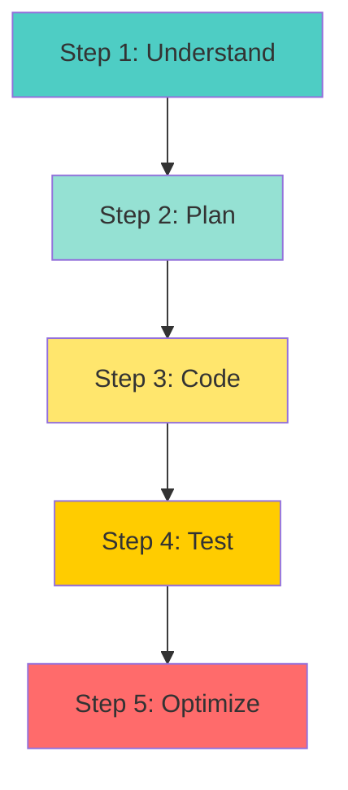
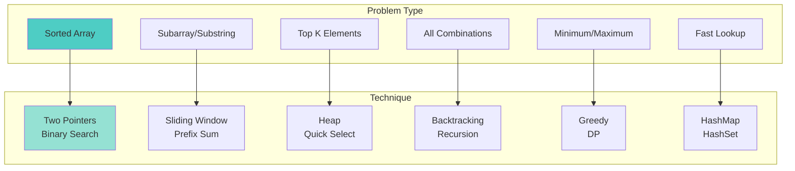
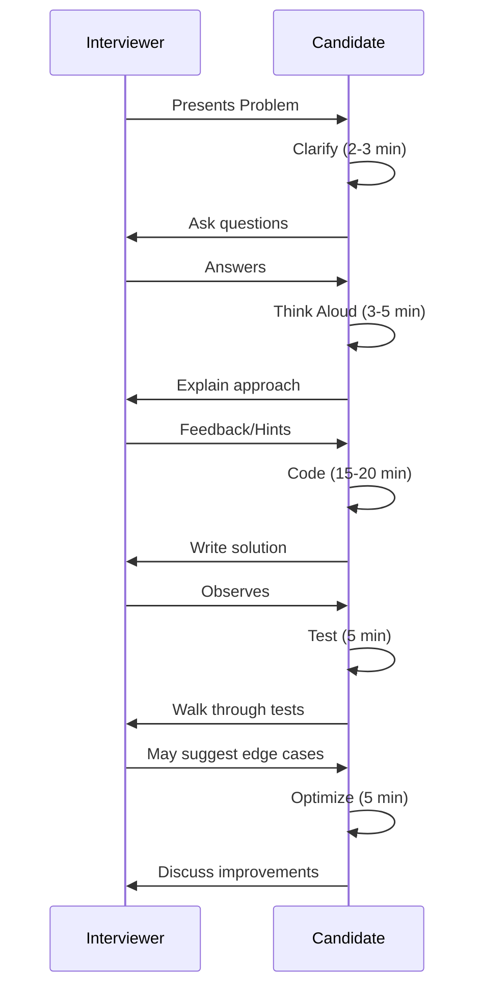

# 📘 **PROBLEM SOLVING MASTERY - Lesson 1: Fundamentals & Approach**

**Date**: 23-03-26
**Level**: 🟢 Beginner → 🔴 FAANG Ready
**Series**: DSA & Interview Preparation
**Time**: 60 minutes

---

## 🎯 **LEARNING OBJECTIVES**

After completing this **comprehensive** lesson, you will:

1. ✅ **Master Time & Space Complexity** - Big O notation, amortized analysis, space-time tradeoffs
2. ✅ **Learn Problem-Solving Framework** - Step-by-step approach for any problem
3. ✅ **Recognize Problem Patterns** - Identify which technique to apply
4. ✅ **Master Input/Output Analysis** - Constraints, edge cases, test cases
5. ✅ **Develop Debugging Skills** - Trace execution, find bugs quickly
6. ✅ **Build Interview Mindset** - Communication, thinking aloud, handling hints

---

## 📦 **PART 1: TIME & SPACE COMPLEXITY**

### **Big O Notation Deep Dive**

```mermaid
graph TB
    subgraph "Complexity Hierarchy (Best to Worst)"
        A[O(1)<br/>Constant]
        B[O(log n)<br/>Logarithmic]
        C[O(n)<br/>Linear]
        D[O(n log n)<br/>Linearithmic]
        E[O(n²)<br/>Quadratic]
        F[O(2ⁿ)<br/>Exponential]
        G[O(n!)<br/>Factorial]
    end

    style A fill:#4ecdc4
    style B fill:#95e1d3
    style C fill:#ffe66d
    style D fill:#ffcc00
    style E fill:#ff6b6b
    style F fill:#ff4444
    style G fill:#ff0000
```

---

### **Common Complexities Explained**

```javascript
// ─────────────────────────────────────────────
// O(1) - CONSTANT TIME
// ─────────────────────────────────────────────
// Execution time doesn't change with input size
function getFirst(arr) {
  return arr[0];  // Single operation
}

function sum(n) {
  return (n * (n + 1)) / 2;  // Formula, no loop
}

// Hash Map operations (average case)
const map = new Map();
map.set('key', 'value');  // O(1)
map.get('key');           // O(1)
map.has('key');           // O(1)

// ─────────────────────────────────────────────
// O(log n) - LOGARITHMIC TIME
// ─────────────────────────────────────────────
// Problem size reduces by half each iteration
function binarySearch(arr, target) {
  let left = 0, right = arr.length - 1;
  
  while (left <= right) {
    const mid = Math.floor((left + right) / 2);
    
    if (arr[mid] === target) return mid;
    if (arr[mid] < target) left = mid + 1;
    else right = mid - 1;
  }
  
  return -1;
}
// n=1000 → ~10 iterations (log₂1000 ≈ 10)

// ─────────────────────────────────────────────
// O(n) - LINEAR TIME
// ─────────────────────────────────────────────
// Execution time grows linearly with input
function findMax(arr) {
  let max = arr[0];
  for (let i = 1; i < arr.length; i++) {
    if (arr[i] > max) max = arr[i];
  }
  return max;
}

function twoSum(arr, target) {
  for (let i = 0; i < arr.length; i++) {
    for (let j = i + 1; j < arr.length; j++) {
      // This is actually O(n²)!
    }
  }
}

// ─────────────────────────────────────────────
// O(n log n) - LINEARITHMIC TIME
// ─────────────────────────────────────────────
// Divide and conquer algorithms
function mergeSort(arr) {
  if (arr.length <= 1) return arr;
  
  const mid = Math.floor(arr.length / 2);
  const left = mergeSort(arr.slice(0, mid));      // T(n/2)
  const right = mergeSort(arr.slice(mid));        // T(n/2)
  
  return merge(left, right);  // O(n)
}
// Total: O(n log n)

// Built-in sort (most implementations)
arr.sort((a, b) => a - b);  // O(n log n)

// ─────────────────────────────────────────────
// O(n²) - QUADRATIC TIME
// ─────────────────────────────────────────────
// Nested loops over same input
function bubbleSort(arr) {
  for (let i = 0; i < arr.length; i++) {
    for (let j = 0; j < arr.length - 1; j++) {
      if (arr[j] > arr[j + 1]) {
        [arr[j], arr[j + 1]] = [arr[j + 1], arr[j]];
      }
    }
  }
  return arr;
}

function findAllPairs(arr) {
  const pairs = [];
  for (let i = 0; i < arr.length; i++) {      // O(n)
    for (let j = i + 1; j < arr.length; j++) { // O(n)
      pairs.push([arr[i], arr[j]]);            // O(n²) total
    }
  }
  return pairs;
}

// ─────────────────────────────────────────────
// O(2ⁿ) - EXPONENTIAL TIME
// ─────────────────────────────────────────────
// Recursive algorithms with multiple calls
function fibonacci(n) {
  if (n <= 1) return n;
  return fibonacci(n - 1) + fibonacci(n - 2);
  // Each call branches into 2 more calls
  // n=10 → ~1024 calls, n=20 → ~1M calls
}

function subsets(arr) {
  // Generate all subsets (2ⁿ subsets)
  const result = [[]];
  for (const num of arr) {
    const newSubsets = result.map(subset => [...subset, num]);
    result.push(...newSubsets);
  }
  return result;
}

// ─────────────────────────────────────────────
// O(n!) - FACTORIAL TIME
// ─────────────────────────────────────────────
// Permutations, traveling salesman
function permutations(arr) {
  const result = [];
  
  function backtrack(start) {
    if (start === arr.length) {
      result.push([...arr]);
      return;
    }
    
    for (let i = start; i < arr.length; i++) {
      [arr[start], arr[i]] = [arr[i], arr[start]];
      backtrack(start + 1);
      [arr[start], arr[i]] = [arr[i], arr[start]];
    }
  }
  
  backtrack(0);
  return result;  // n! permutations
}
```

---

### **Complexity Analysis Rules**

```javascript
// ─────────────────────────────────────────────
// RULE 1: DROP CONSTANTS
// ─────────────────────────────────────────────
// O(2n) → O(n)
function printTwice(arr) {
  arr.forEach(x => console.log(x));  // O(n)
  arr.forEach(x => console.log(x));  // O(n)
}  // Total: O(2n) = O(n)

// ─────────────────────────────────────────────
// RULE 2: DROP NON-DOMINANT TERMS
// ─────────────────────────────────────────────
// O(n² + n) → O(n²)
function process(arr) {
  // Nested loop
  for (let i = 0; i < arr.length; i++) {      // O(n²)
    for (let j = 0; j < arr.length; j++) {
      console.log(arr[i], arr[j]);
    }
  }
  
  // Single loop (dominated by nested)
  for (let i = 0; i < arr.length; i++) {      // O(n)
    console.log(arr[i]);
  }
}  // Total: O(n² + n) = O(n²)

// ─────────────────────────────────────────────
// RULE 3: ADD FOR SEQUENTIAL, MULTIPLY FOR NESTED
// ─────────────────────────────────────────────
// Sequential: O(A) + O(B) = O(A + B)
function sequential(arr1, arr2) {
  arr1.forEach(x => console.log(x));  // O(A)
  arr2.forEach(x => console.log(x));  // O(B)
}  // Total: O(A + B)

// Nested: O(A) × O(B) = O(A × B)
function nested(arr1, arr2) {
  arr1.forEach(a => {                    // O(A)
    arr2.forEach(b => {                  // O(B)
      console.log(a, b);                 // O(A × B)
    });
  });
}

// ─────────────────────────────────────────────
// RULE 4: AMORTIZED ANALYSIS
// ─────────────────────────────────────────────
// Dynamic array push (JavaScript array)
const arr = [];
arr.push(1);  // O(1) most of the time
arr.push(2);  // O(1)
arr.push(3);  // O(1)
// Occasionally O(n) when resizing, but average is O(1)

// ─────────────────────────────────────────────
// SPACE COMPLEXITY
// ─────────────────────────────────────────────
// O(1) space - no extra space
function sum(arr) {
  let total = 0;  // Single variable
  for (const num of arr) {
    total += num;
  }
  return total;
}

// O(n) space - creating new array
function double(arr) {
  return arr.map(x => x * 2);  // New array of size n
}

// O(n) space - recursion stack
function factorial(n) {
  if (n <= 1) return 1;
  return n * factorial(n - 1);  // n stack frames
}
```

---

## 📦 **PART 2: PROBLEM-SOLVING FRAMEWORK**

### **The 5-Step Approach**



---

### **Step 1: Understand the Problem**

```javascript
// ─────────────────────────────────────────────
// QUESTIONS TO ASK
// ─────────────────────────────────────────────
// 1. What is the input?
//    - Type (array, string, number, tree, graph)
//    - Size constraints
//    - Value range
//    - Sorted? Unique? Can contain negatives?

// 2. What is the output?
//    - Return type
//    - Format requirements

// 3. What are the constraints?
//    - Time limit (usually 1-2 seconds)
//    - Space limit
//    - Can we modify input?
//    - In-place or extra space allowed?

// 4. Edge cases?
//    - Empty input
//    - Single element
//    - All same elements
//    - Already sorted
//    - Max/min values

// ─────────────────────────────────────────────
// EXAMPLE: Two Sum Problem
// ─────────────────────────────────────────────
/*
PROBLEM: Given an array of integers nums and an integer target,
return indices of the two numbers such that they add up to target.

INPUT CLARIFICATIONS:
- nums: number[], can contain negatives? Yes
- nums length: 2 ≤ n ≤ 10⁴
- nums values: -10⁹ ≤ nums[i] ≤ 10⁹
- target: number, -10⁹ to 10⁹
- Exactly one solution? Yes
- Can't use same element twice? Correct

OUTPUT:
- Return: [number, number] (indices)
- Order doesn't matter

EDGE CASES:
- Array with exactly 2 elements
- Negative numbers
- Large numbers (overflow?)
*/
```

---

### **Step 2: Plan Your Approach**

```javascript
// ─────────────────────────────────────────────
// PATTERN RECOGNITION
// ─────────────────────────────────────────────
// Ask yourself:

// 1. Is it about finding optimal solution?
//    → Greedy, Dynamic Programming

// 2. Is it about exploring all possibilities?
//    → Backtracking, Recursion

// 3. Is the input sorted or can be sorted?
//    → Binary Search, Two Pointers

// 4. Is it about subarrays/substrings?
//    → Sliding Window, Prefix Sum

// 5. Is it about fast lookups?
//    → HashMap, HashSet

// 6. Is it about order/sequence?
//    → Stack, Queue, Monotonic Stack

// 7. Is it about hierarchical data?
//    → Tree, Graph, DFS, BFS

// 8. Is it about top K elements?
//    → Heap, Quick Select

// ─────────────────────────────────────────────
// BRUTE FORCE FIRST
// ─────────────────────────────────────────────
// Always start with brute force, then optimize

// Two Sum - Brute Force
function twoSumBrute(nums, target) {
  for (let i = 0; i < nums.length; i++) {
    for (let j = i + 1; j < nums.length; j++) {
      if (nums[i] + nums[j] === target) {
        return [i, j];
      }
    }
  }
}
// Time: O(n²), Space: O(1)

// Then optimize...
```

---

### **Step 3: Code**

```javascript
// ─────────────────────────────────────────────
// CODING BEST PRACTICES
// ─────────────────────────────────────────────
// 1. Use meaningful variable names
const left = 0;           // Better than i
const right = arr.length - 1;  // Better than j

// 2. Write modular code
function twoSum(nums, target) {
  const seen = new Map();
  
  for (let i = 0; i < nums.length; i++) {
    const complement = target - nums[i];
    
    if (seen.has(complement)) {
      return [seen.get(complement), i];
    }
    
    seen.set(nums[i], i);
  }
  
  return [];
}

// 3. Add comments for complex logic
// Use two pointers: one at start, one at end
// Move pointer based on sum comparison

// 4. Handle edge cases explicitly
if (!nums || nums.length < 2) {
  return [];
}
```

---

### **Step 4: Test**

```javascript
// ─────────────────────────────────────────────
// TEST CASES TO COVER
// ─────────────────────────────────────────────
// 1. Normal case
twoSum([2, 7, 11, 15], 9);  // [0, 1]

// 2. Edge cases
twoSum([1, 2], 3);          // [0, 1] - minimum size
twoSum([-1, -2, -3], -5);   // [1, 2] - negatives

// 3. Boundary values
twoSum([1000000000, -1000000000], 0);  // [0, 1]

// 4. Duplicates
twoSum([3, 3], 6);          // [0, 1]

// ─────────────────────────────────────────────
// DRY RUN TECHNIQUE
// ─────────────────────────────────────────────
// Trace through your code with sample input

// nums = [2, 7, 11, 15], target = 9
// seen = {}

// i=0: num=2, complement=7
//   seen doesn't have 7
//   seen = {2: 0}

// i=1: num=7, complement=2
//   seen HAS 2! → return [0, 1] ✓
```

---

### **Step 5: Optimize**

```javascript
// ─────────────────────────────────────────────
// OPTIMIZATION CHECKLIST
// ─────────────────────────────────────────────
// 1. Can we reduce time complexity?
//    - O(n²) → O(n) with HashMap
//    - O(n) → O(log n) with Binary Search

// 2. Can we reduce space complexity?
//    - O(n) → O(1) by modifying input
//    - O(n) recursion → O(1) iteration

// 3. Can we avoid redundant work?
//    - Memoization
//    - Early termination

// 4. Can we use a better data structure?
//    - Array → HashMap for O(1) lookup
//    - Array → Heap for top K

// ─────────────────────────────────────────────
// TWO SUM OPTIMIZED
// ─────────────────────────────────────────────
// Brute Force: O(n²) time, O(1) space
// Optimized: O(n) time, O(n) space

function twoSumOptimal(nums, target) {
  const seen = new Map();  // Store value → index
  
  for (let i = 0; i < nums.length; i++) {
    const complement = target - nums[i];
    
    if (seen.has(complement)) {
      return [seen.get(complement), i];
    }
    
    seen.set(nums[i], i);
  }
  
  return [];
}
// Time: O(n), Space: O(n)
```

---

## 📦 **PART 3: PROBLEM PATTERNS**

### **Pattern Recognition Guide**



---

### **When to Use Each Pattern**

```javascript
// ─────────────────────────────────────────────
// TWO POINTERS
// ─────────────────────────────────────────────
// Use when:
// - Array is sorted
// - Finding pairs with sum/target
// - Palindrome checks
// - Removing duplicates

// Examples:
// - Two Sum II (sorted array)
// - 3Sum
// - Container With Most Water
// - Valid Palindrome II

// ─────────────────────────────────────────────
// SLIDING WINDOW
// ─────────────────────────────────────────────
// Use when:
// - Subarray/substring problems
// - Fixed or variable window size
// - Maximum/minimum subarray
// - Contains all characters

// Examples:
// - Maximum Sum Subarray of Size K
// - Longest Substring Without Repeating
// - Minimum Window Substring
// - Permutation in String

// ─────────────────────────────────────────────
// FAST & SLOW POINTERS
// ─────────────────────────────────────────────
// Use when:
// - Linked List cycles
// - Finding middle element
// - Happy Number problem

// Examples:
// - Linked List Cycle
// - Middle of Linked List
// - Happy Number

// ─────────────────────────────────────────────
// MERGE INTERVALS
// ─────────────────────────────────────────────
// Use when:
// - Overlapping intervals
// - Schedule conflicts
// - Insert/merge intervals

// Examples:
// - Merge Intervals
// - Insert Interval
// - Interval List Intersections

// ─────────────────────────────────────────────
// CYCLIC SORT
// ─────────────────────────────────────────────
// Use when:
// - Array contains 1 to N
// - Find missing/duplicate numbers
// - In-place sorting

// Examples:
// - Find the Missing Number
// - Find All Duplicates
// - First Missing Positive

// ─────────────────────────────────────────────
// BFS/DFS
// ─────────────────────────────────────────────
// Use when:
// - Tree/Graph traversal
// - Level order traversal
// - Path finding
// - Connected components

// Examples:
// - Binary Tree Level Order Traversal
// - Number of Islands
// - Clone Graph
// - Course Schedule
```

---

## 📦 **PART 4: INTERVIEW STRATEGY**

### **Communication Framework**



---

### **What Interviewers Evaluate**

```javascript
// ─────────────────────────────────────────────
// EVALUATION CRITERIA
// ─────────────────────────────────────────────
// 1. Problem Solving (40%)
//    - Can you break down the problem?
//    - Do you recognize patterns?
//    - Can you optimize?

// 2. Coding (30%)
//    - Clean, readable code
//    - Correct syntax
//    - Proper variable names

// 3. Communication (20%)
//    - Think aloud
//    - Ask clarifying questions
//    - Respond to hints

// 4. Testing (10%)
//    - Consider edge cases
//    - Dry run your code
//    - Fix bugs

// ─────────────────────────────────────────────
// RED FLAGS TO AVOID
// ─────────────────────────────────────────────
// ❌ Silent coding (not thinking aloud)
// ❌ Jumping to code without planning
// ❌ Not asking clarifying questions
// ❌ Ignoring hints
// ❌ Not testing your solution
// ❌ Giving up too easily
// ❌ Arguing with interviewer

// ─────────────────────────────────────────────
// GREEN FLAGS TO SHOW
// ─────────────────────────────────────────────
// ✅ Think aloud consistently
// ✅ Start with brute force, then optimize
// ✅ Ask 2-3 clarifying questions
// ✅ Acknowledge and use hints
// ✅ Test with multiple cases
// ✅ Stay positive and persistent
// ✅ Discuss time/space complexity
```

---

## ✅ **PROBLEM SOLVING CHECKLIST**

```
Before Coding
[ ] Understand input/output format
[ ] Clarify constraints and edge cases
[ ] Identify the problem pattern
[ ] Start with brute force approach
[ ] Plan optimization strategy

While Coding
[ ] Use meaningful variable names
[ ] Write modular, readable code
[ ] Add comments for complex logic
[ ] Think aloud throughout

After Coding
[ ] Test with normal cases
[ ] Test with edge cases
[ ] Dry run to verify
[ ] Analyze time/space complexity
[ ] Discuss possible optimizations

Interview Mindset
[ ] Stay calm and confident
[ ] Ask for hints when stuck
[ ] Don't give up easily
[ ] Be open to feedback
```

---

## 🎯 **KNOWLEDGE CHECK**

### **Question 1: Complexity Analysis**

What is the time complexity?

```javascript
function mystery(arr) {
  let sum = 0;
  for (let i = 0; i < arr.length; i++) {      // O(n)
    for (let j = i; j < arr.length; j++) {    // O(n-i)
      sum += arr[i] * arr[j];
    }
  }
  return sum;
}
```

<details>
<summary>💡 Click to reveal answer</summary>

**O(n²)**

The inner loop runs (n) + (n-1) + (n-2) + ... + 1 = n(n+1)/2 times

This is still O(n²) - we drop constants and non-dominant terms.
</details>

---

### **Question 2: Pattern Recognition**

What pattern would you use for: "Find the longest substring without repeating characters"?

<details>
<summary>💡 Click to reveal answer</summary>

**Sliding Window**

- We need to find a substring (contiguous)
- We need to track characters seen (use Set or Map)
- Window expands when no repeat, shrinks when repeat found

```javascript
function lengthOfLongestSubstring(s) {
  const seen = new Set();
  let left = 0, maxLen = 0;
  
  for (let right = 0; right < s.length; right++) {
    while (seen.has(s[right])) {
      seen.delete(s[left]);
      left++;
    }
    seen.add(s[right]);
    maxLen = Math.max(maxLen, right - left + 1);
  }
  
  return maxLen;
}
```
</details>

---

## 📚 **ADDITIONAL RESOURCES**

- **LeetCode**: [Top Interview Questions](https://leetcode.com/explore/interview/card/top-interview-questions-easy/)
- **Book**: "Cracking the Coding Interview" by Gayle Laakmann McDowell
- **Book**: "Elements of Programming Interviews"
- **Website**: [NeetCode.io](https://neetcode.io/) - Pattern-based practice
- **Website**: [Blind 75](https://www.teamblind.com/post/New-Year-Gift---Curated-List-of-Top-75-LeetCode-Questions-to-Save-Your-Time-OaM1orEU)

---

## 🎓 **HOMEWORK**

1. ✅ Solve 5 problems using Two Pointers pattern
2. ✅ Solve 5 problems using Sliding Window pattern
3. ✅ Analyze time/space complexity of 10 solutions
4. ✅ Practice explaining your thought process aloud
5. ✅ Do a mock interview (record yourself)

---

**Next Lesson**: Arrays & Strings - Two Pointers, Sliding Window, Prefix Sum
**Date**: 23-03-26
**Status**: ✅ Complete

---
-23-03-26
