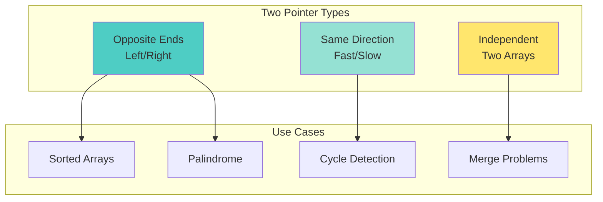
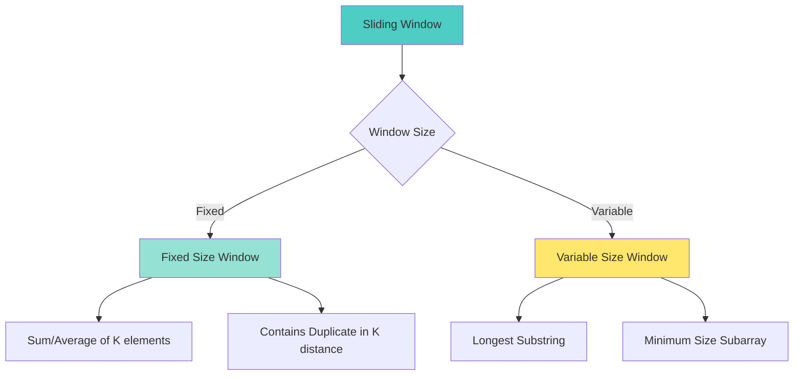
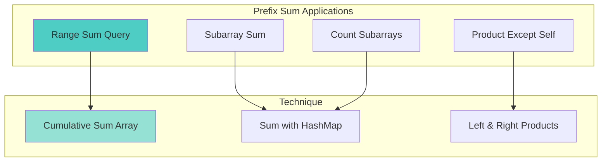

# 📘 **PROBLEM SOLVING MASTERY - Lesson 2: Arrays & Strings**

**Date**: 23-03-26
**Level**: 🟢 Beginner → 🔴 FAANG Ready
**Series**: DSA & Interview Preparation
**Time**: 60 minutes
**Prerequisites**: Lesson 1 (Fundamentals)
- [LastRead](#lastRead)
---

## 🎯 **LEARNING OBJECTIVES**

After completing this **comprehensive** lesson, you will:

1. ✅ **Master Two Pointers** - Opposite ends, same direction, fast/slow
2. ✅ **Master Sliding Window** - Fixed size, variable size, longest/shortest
3. ✅ **Master Prefix Sum** - Range sum, subarray sum, cumulative sum
4. ✅ **Recognize Patterns** - When to apply each technique
5. ✅ **Solve FAANG Problems** - Real interview questions with solutions

---

## 📦 **PART 1: TWO POINTERS**

### **Pattern Overview**



---

### **Type 1: Opposite Ends (Left/Right)**

```javascript
// ─────────────────────────────────────────────
// TEMPLATE: Two Sum II (Sorted Array)
// ─────────────────────────────────────────────
function twoSumSorted(numbers, target) {
  let left = 0;
  let right = numbers.length - 1;
  
  while (left < right) {
    const sum = numbers[left] + numbers[right];
    
    if (sum === target) {
      return [left + 1, right + 1];  // 1-indexed
    } else if (sum < target) {
      left++;   // Need larger sum
    } else {
      right--;  // Need smaller sum
    }
  }
  
  return [-1, -1];
}
// Time: O(n), Space: O(1)

// ─────────────────────────────────────────────
// PROBLEM: Valid Palindrome
// ─────────────────────────────────────────────
// LeetCode 125
function isPalindrome(s) {
  let left = 0;
  let right = s.length - 1;
  
  while (left < right) {
    // Skip non-alphanumeric from left
    while (left < right && !isAlphaNum(s[left])) left++;
    // Skip non-alphanumeric from right
    while (left < right && !isAlphaNum(s[right])) right--;
    
    if (s[left].toLowerCase() !== s[right].toLowerCase()) {
      return false;
    }
    
    left++;
    right--;
  }
  
  return true;
}

function isAlphaNum(c) {
  const code = c.charCodeAt(0);
  return (code >= 48 && code <= 57) ||  // 0-9
         (code >= 65 && code <= 90) ||  // A-Z
         (code >= 97 && code <= 122);   // a-z
}

// ─────────────────────────────────────────────
// PROBLEM: Container With Most Water
// ─────────────────────────────────────────────
// LeetCode 11
function maxArea(height) {
  let left = 0;
  let right = height.length - 1;
  let maxWater = 0;
  
  while (left < right) {
    // Calculate area
    const width = right - left;
    const h = Math.min(height[left], height[right]);
    const area = width * h;
    
    maxWater = Math.max(maxWater, area);
    
    // Move the shorter line
    if (height[left] < height[right]) {
      left++;
    } else {
      right--;
    }
  }
  
  return maxWater;
}
// Why move shorter? Because moving taller can't improve area

// ─────────────────────────────────────────────
// PROBLEM: 3Sum
// ─────────────────────────────────────────────
// LeetCode 15
function threeSum(nums) {
  const result = [];
  nums.sort((a, b) => a - b);  // Sort first
  
  for (let i = 0; i < nums.length - 2; i++) {
    // Skip duplicates
    if (i > 0 && nums[i] === nums[i - 1]) continue;
    
    // Skip if current number is positive (can't sum to 0)
    if (nums[i] > 0) break;
    
    let left = i + 1;
    let right = nums.length - 1;
    
    while (left < right) {
      const sum = nums[i] + nums[left] + nums[right];
      
      if (sum === 0) {
        result.push([nums[i], nums[left], nums[right]]);
        
        // Skip duplicates
        while (left < right && nums[left] === nums[left + 1]) left++;
        while (left < right && nums[right] === nums[right - 1]) right--;
        
        left++;
        right--;
      } else if (sum < 0) {
        left++;
      } else {
        right--;
      }
    }
  }
  
  return result;
}
// Time: O(n²), Space: O(1)
```

---

### **Type 2: Fast & Slow Pointers**

```javascript
// ─────────────────────────────────────────────
// TEMPLATE: Linked List Cycle Detection
// ─────────────────────────────────────────────
// LeetCode 141
function hasCycle(head) {
  if (!head || !head.next) return false;
  
  let slow = head;
  let fast = head;
  
  while (fast && fast.next) {
    slow = slow.next;          // Move 1 step
    fast = fast.next.next;     // Move 2 steps
    
    if (slow === fast) return true;  // Cycle detected
  }
  
  return false;
}
// Time: O(n), Space: O(1)

// ─────────────────────────────────────────────
// PROBLEM: Find Cycle Start
// ─────────────────────────────────────────────
// LeetCode 142
function detectCycleStart(head) {
  if (!head || !head.next) return null;
  
  let slow = head;
  let fast = head;
  
  // Find meeting point
  while (fast && fast.next) {
    slow = slow.next;
    fast = fast.next.next;
    if (slow === fast) break;
  }
  
  if (!fast || !fast.next) return null;  // No cycle
  
  // Find cycle start
  slow = head;
  while (slow !== fast) {
    slow = slow.next;
    fast = fast.next;
  }
  
  return slow;  // Cycle start
}

// ─────────────────────────────────────────────
// PROBLEM: Middle of Linked List
// ─────────────────────────────────────────────
// LeetCode 876
function middleNode(head) {
  let slow = head;
  let fast = head;
  
  while (fast && fast.next) {
    slow = slow.next;        // 1 step
    fast = fast.next.next;   // 2 steps
  }
  
  return slow;  // Middle node
}
// When fast reaches end, slow is at middle

// ─────────────────────────────────────────────
// PROBLEM: Happy Number
// ─────────────────────────────────────────────
// LeetCode 202
function isHappy(n) {
  let slow = n;
  let fast = n;
  
  do {
    slow = sumOfSquares(slow);
    fast = sumOfSquares(sumOfSquares(fast));
  } while (slow !== fast && fast !== 1);
  
  return fast === 1;
}

function sumOfSquares(n) {
  let sum = 0;
  while (n > 0) {
    const digit = n % 10;
    sum += digit * digit;
    n = Math.floor(n / 10);
  }
  return sum;
}
```

---

## 📦 **PART 2: SLIDING WINDOW**

### **Pattern Overview**



---

### **Type 1: Fixed Size Window**

```javascript
// ─────────────────────────────────────────────
// TEMPLATE: Fixed Size Window
// ─────────────────────────────────────────────
function fixedSlidingWindow(arr, k) {
  let windowSum = 0;
  let maxSum = 0;
  
  // Initialize first window
  for (let i = 0; i < k; i++) {
    windowSum += arr[i];
  }
  
  maxSum = windowSum;
  
  // Slide window
  for (let i = k; i < arr.length; i++) {
    windowSum = windowSum - arr[i - k] + arr[i];  // Remove left, add right
    maxSum = Math.max(maxSum, windowSum);
  }
  
  return maxSum;
}

// ─────────────────────────────────────────────
// PROBLEM: Maximum Sum Subarray of Size K
// ─────────────────────────────────────────────
// LeetCode variant
function maxSumSubarray(arr, k) {
  if (arr.length < k) return -1;
  
  let windowSum = 0;
  let maxSum = -Infinity;
  
  for (let i = 0; i < arr.length; i++) {
    windowSum += arr[i];
    
    // When window reaches size k
    if (i >= k - 1) {
      maxSum = Math.max(maxSum, windowSum);
      windowSum -= arr[i - k + 1];  // Remove leftmost
    }
  }
  
  return maxSum;
}
// Time: O(n), Space: O(1)

// ─────────────────────────────────────────────
// PROBLEM: Contains Duplicate II
// ─────────────────────────────────────────────
// LeetCode 219
function containsNearbyDuplicate(nums, k) {
  const window = new Set();
  
  for (let i = 0; i < nums.length; i++) {
    // Window size exceeded, remove leftmost
    if (i > k) {
      window.delete(nums[i - k - 1]);
    }
    
    if (window.has(nums[i])) return true;
    window.add(nums[i]);
  }
  
  return false;
}
// Time: O(n), Space: O(k)

// ─────────────────────────────────────────────
// PROBLEM: Longest Substring with K Distinct Characters
// ─────────────────────────────────────────────
function longestSubstringKDistinct(s, k) {
  let left = 0;
  let maxLength = 0;
  const charCount = new Map();
  
  for (let right = 0; right < s.length; right++) {
    const rightChar = s[right];
    charCount.set(rightChar, (charCount.get(rightChar) || 0) + 1);
    
    // Shrink window if more than k distinct
    while (charCount.size > k) {
      const leftChar = s[left];
      charCount.set(leftChar, charCount.get(leftChar) - 1);
      
      if (charCount.get(leftChar) === 0) {
        charCount.delete(leftChar);
      }
      
      left++;
    }
    
    maxLength = Math.max(maxLength, right - left + 1);
  }
  
  return maxLength;
}
```

---

### **Type 2: Variable Size Window**

```javascript
// ─────────────────────────────────────────────
// TEMPLATE: Variable Size Window
// ─────────────────────────────────────────────
function variableSlidingWindow(s) {
  let left = 0;
  let result = 0;
  const windowSet = new Set();
  
  for (let right = 0; right < s.length; right++) {
    // Add right element
    while (windowSet.has(s[right])) {
      // Remove left element until valid
      windowSet.delete(s[left]);
      left++;
    }
    
    windowSet.add(s[right]);
    result = Math.max(result, right - left + 1);
  }
  
  return result;
}

// ─────────────────────────────────────────────
// PROBLEM: Longest Substring Without Repeating
// ─────────────────────────────────────────────
// LeetCode 3
function lengthOfLongestSubstring(s) {
  const seen = new Set();
  let left = 0;
  let maxLength = 0;
  
  for (let right = 0; right < s.length; right++) {
    // Shrink window while duplicate exists
    while (seen.has(s[right])) {
      seen.delete(s[left]);
      left++;
    }
    
    seen.add(s[right]);
    maxLength = Math.max(maxLength, right - left + 1);
  }
  
  return maxLength;
}
// Time: O(n), Space: O(min(m,n)) where m is charset size

// ─────────────────────────────────────────────
// PROBLEM: Minimum Size Subarray Sum
// ─────────────────────────────────────────────
// LeetCode 209
function minSubArrayLen(target, nums) {
  let left = 0;
  let sum = 0;
  let minLength = Infinity;
  
  for (let right = 0; right < nums.length; right++) {
    sum += nums[right];  // Expand window
    
    // Shrink while sum >= target
    while (sum >= target) {
      minLength = Math.min(minLength, right - left + 1);
      sum -= nums[left];
      left++;
    }
  }
  
  return minLength === Infinity ? 0 : minLength;
}
// Time: O(n), Space: O(1)

// ─────────────────────────────────────────────
// PROBLEM: Minimum Window Substring
// ─────────────────────────────────────────────
// LeetCode 76 (Hard)
function minWindow(s, t) {
  if (!s || !t) return "";
  
  const need = new Map();
  for (const char of t) {
    need.set(char, (need.get(char) || 0) + 1);
  }
  
  let required = need.size;
  let formed = 0;
  const windowCounts = new Map();
  
  let left = 0, right = 0;
  let result = [Infinity, 0, 0];  // [length, left, right]
  
  while (right < s.length) {
    const char = s[right];
    windowCounts.set(char, (windowCounts.get(char) || 0) + 1);
    
    if (need.has(char) && windowCounts.get(char) === need.get(char)) {
      formed++;
    }
    
    // Try to contract window
    while (left <= right && formed === required) {
      const currentLength = right - left + 1;
      if (currentLength < result[0]) {
        result = [currentLength, left, right];
      }
      
      const leftChar = s[left];
      windowCounts.set(leftChar, windowCounts.get(leftChar) - 1);
      
      if (need.has(leftChar) && windowCounts.get(leftChar) < need.get(leftChar)) {
        formed--;
      }
      
      left++;
    }
    
    right++;
  }
  
  return result[0] === Infinity ? "" : s.substring(result[1], result[2] + 1);
}
// Time: O(n), Space: O(m) where m is charset size
```

---

## 📦 **PART 3: PREFIX SUM**

### **Pattern Overview**



---

### **Basic Prefix Sum**

```javascript
// ─────────────────────────────────────────────
// TEMPLATE: Prefix Sum Array
// ─────────────────────────────────────────────
class PrefixSum {
  constructor(nums) {
    this.prefix = [0];
    for (let i = 0; i < nums.length; i++) {
      this.prefix[i + 1] = this.prefix[i] + nums[i];
    }
  }
  
  // Sum from index i to j (inclusive)
  sumRange(i, j) {
    return this.prefix[j + 1] - this.prefix[i];
  }
}

// Usage
const nums = [1, 2, 3, 4, 5];
const ps = new PrefixSum(nums);
console.log(ps.sumRange(1, 3));  // 2 + 3 + 4 = 9

// ─────────────────────────────────────────────
// PROBLEM: Range Sum Query - Immutable
// ─────────────────────────────────────────────
// LeetCode 303
class NumArray {
  constructor(nums) {
    this.prefix = [0];
    for (const num of nums) {
      this.prefix.push(this.prefix[this.prefix.length - 1] + num);
    }
  }
  
  sumRange(left, right) {
    return this.prefix[right + 1] - this.prefix[left];
  }
}

// ─────────────────────────────────────────────
// PROBLEM: Subarray Sum Equals K
// ─────────────────────────────────────────────
// LeetCode 560
function subarraySum(nums, k) {
  let count = 0;
  let sum = 0;
  const sumMap = new Map();
  sumMap.set(0, 1);  // Base case: sum 0 appears once
  
  for (const num of nums) {
    sum += num;
    
    // If (sum - k) exists, we found subarrays
    if (sumMap.has(sum - k)) {
      count += sumMap.get(sum - k);
    }
    
    // Record current sum
    sumMap.set(sum, (sumMap.get(sum) || 0) + 1);
  }
  
  return count;
}
// Time: O(n), Space: O(n)

// Why this works:
// If sum[j] - sum[i] = k, then subarray from i+1 to j sums to k

// ─────────────────────────────────────────────
// PROBLEM: Continuous Subarray Sum
// ─────────────────────────────────────────────
// LeetCode 523
function checkSubarraySum(nums, k) {
  const remainderMap = new Map();
  remainderMap.set(0, -1);  // Base case
  let sum = 0;
  
  for (let i = 0; i < nums.length; i++) {
    sum += nums[i];
    const remainder = k !== 0 ? sum % k : sum;
    
    if (remainderMap.has(remainder)) {
      // Check if subarray length >= 2
      if (i - remainderMap.get(remainder) >= 2) {
        return true;
      }
    } else {
      remainderMap.set(remainder, i);
    }
  }
  
  return false;
}
// Key insight: if sum[i] % k == sum[j] % k, subarray between is divisible by k
```

---

### **Advanced Prefix Sum**

```javascript
// ─────────────────────────────────────────────
// PROBLEM: Product of Array Except Self
// ─────────────────────────────────────────────
// LeetCode 238
function productExceptSelf(nums) {
  const n = nums.length;
  const result = new Array(n).fill(1);
  
  // Left products
  let leftProduct = 1;
  for (let i = 0; i < n; i++) {
    result[i] = leftProduct;
    leftProduct *= nums[i];
  }
  
  // Right products and multiply
  let rightProduct = 1;
  for (let i = n - 1; i >= 0; i--) {
    result[i] *= rightProduct;
    rightProduct *= nums[i];
  }
  
  return result;
}
// Time: O(n), Space: O(1) excluding output

// ─────────────────────────────────────────────
// PROBLEM: Maximum Size Subarray Sum Equals K
// ─────────────────────────────────────────────
function maxSubArrayLen(nums, k) {
  let sum = 0;
  let maxLength = 0;
  const sumIndex = new Map();
  sumIndex.set(0, -1);
  
  for (let i = 0; i < nums.length; i++) {
    sum += nums[i];
    
    if (sumIndex.has(sum - k)) {
      maxLength = Math.max(maxLength, i - sumIndex.get(sum - k));
    }
    
    if (!sumIndex.has(sum)) {
      sumIndex.set(sum, i);
    }
  }
  
  return maxLength;
}
```

---

## ✅ **ARRAYS & STRINGS CHECKLIST**

```
Two Pointers
[ ] Opposite ends pattern (sorted arrays)
[ ] Fast/slow pattern (cycle detection)
[ ] Independent pointers (merge problems)

Sliding Window
[ ] Fixed size window (sum, average)
[ ] Variable size window (longest, shortest)
[ ] Track elements with Map/Set

Prefix Sum
[ ] Range sum queries
[ ] Subarray sum with HashMap
[ ] Product except self pattern

Problem Recognition
[ ] Sorted array + pair finding → Two Pointers
[ ] Subarray/substring → Sliding Window
[ ] Range sum → Prefix Sum
[ ] Contains duplicate → Sliding Window with Set
```

---

## 🎯 **KNOWLEDGE CHECK**

### **Question 1: Pattern Selection**

Which pattern for: "Find maximum average subarray of size k"?

<details>
<summary>💡 Click to reveal answer</summary>

**Fixed Size Sliding Window**

```javascript
function findMaxAverage(nums, k) {
  let windowSum = 0;
  
  // First window
  for (let i = 0; i < k; i++) {
    windowSum += nums[i];
  }
  
  let maxSum = windowSum;
  
  // Slide window
  for (let i = k; i < nums.length; i++) {
    windowSum = windowSum - nums[i - k] + nums[i];
    maxSum = Math.max(maxSum, windowSum);
  }
  
  return maxSum / k;
}
```
</details>

---

### **Question 2: Solve This**

Given an array of positive integers, find the minimum length subarray with sum >= target.

<details>
<summary>💡 Click to reveal answer</summary>

**Variable Size Sliding Window**

```javascript
function minSubArrayLen(target, nums) {
  let left = 0, sum = 0, minLen = Infinity;
  
  for (let right = 0; right < nums.length; right++) {
    sum += nums[right];
    
    while (sum >= target) {
      minLen = Math.min(minLen, right - left + 1);
      sum -= nums[left];
      left++;
    }
  }
  
  return minLen === Infinity ? 0 : minLen;
}
// Time: O(n), Space: O(1)
```
</details>

---

## 📚 **PRACTICE PROBLEMS**

### **Easy**
- Two Sum (LeetCode 1)
- Valid Palindrome (LeetCode 125)
- Maximum Subarray (LeetCode 53)

### **Medium**
- 3Sum (LeetCode 15)
- Container With Most Water (LeetCode 11)
- Longest Substring Without Repeating (LeetCode 3)
- Minimum Size Subarray Sum (LeetCode 209)
- Subarray Sum Equals K (LeetCode 560)

### **Hard**
- Minimum Window Substring (LeetCode 76)
- Trapping Rain Water (LeetCode 42)
- First Missing Positive (LeetCode 41)

---

## 🎓 **HOMEWORK**

1. ✅ Solve 10 Two Pointers problems
2. ✅ Solve 10 Sliding Window problems
3. ✅ Solve 5 Prefix Sum problems
4. ✅ Create a cheat sheet with all patterns
5. ✅ Time yourself: 3 problems in 60 minutes

---

**Next Lesson**: Hashing - HashMaps, Sets, Frequency Counting
**Date**: 23-03-26
**Status**: ✅ Complete

---
-23-03-26
