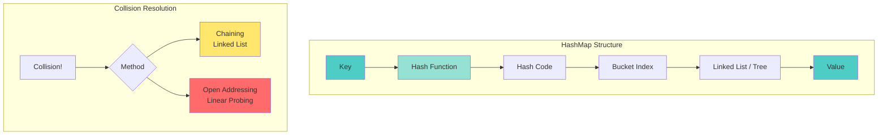

# 📘 **PROBLEM SOLVING MASTERY - Lesson 3: Hashing & HashMaps**

**Date**: 23-03-26
**Level**: 🟢 Beginner → 🔴 FAANG Ready
**Series**: DSA & Interview Preparation
**Time**: 90 minutes
**Prerequisites**: Lesson 1-2 (Fundamentals, Arrays & Strings)

---

## 🎯 **LEARNING OBJECTIVES**

After completing this **comprehensive** lesson, you will:

1. ✅ **Master HashMap Internals** - How hash tables work, collisions, load factor
2. ✅ **Recognize HashMap Patterns** - When to use HashMap vs HashSet vs Array
3. ✅ **Master Frequency Counting** - Character counts, element frequencies
4. ✅ **Solve Two Sum Variants** - All variations of the classic pattern
5. ✅ **Master Grouping Problems** - Anagrams, custom grouping keys
6. ✅ **Handle Advanced Patterns** - Subarray sums, prefix with HashMap, coordinate compression

---

## 📦 **PART 1: HASHMAP INTERNALS**

### **How HashMaps Work Under the Hood**



---

### **HashMap Complexity Analysis**

```javascript
// ─────────────────────────────────────────────
// TIME COMPLEXITY
// ─────────────────────────────────────────────
// Operation    | Average  | Worst Case
// -------------|----------|------------
// Get          | O(1)     | O(n) - all keys collide
// Put          | O(1)     | O(n) - rehashing + collisions
// Remove       | O(1)     | O(n) - all keys collide
// Contains     | O(1)     | O(n) - all keys collide
// Iteration    | O(n)     | O(n)

// ─────────────────────────────────────────────
// SPACE COMPLEXITY
// ─────────────────────────────────────────────
// O(n) where n = number of entries
// Plus capacity for buckets (load factor dependent)

// ─────────────────────────────────────────────
// LOAD FACTOR & REHASHING
// ─────────────────────────────────────────────
// Load Factor = (number of entries) / (number of buckets)
// Default: 0.75 (75% full before rehashing)

// When load factor exceeded:
// 1. Create new bucket array (2x size)
// 2. Rehash all entries to new buckets
// 3. O(n) operation but amortized O(1)

// ─────────────────────────────────────────────
// COLLISION HANDLING IN JS
// ─────────────────────────────────────────────
// JavaScript Map uses chaining with linked lists
// For many collisions: converts to balanced tree (like Java 8+)

// Good hash function distributes keys evenly
// Bad hash function causes clustering
```

---

### **When to Use HashMap vs Alternatives**

```javascript
// ─────────────────────────────────────────────
// USE HASHMAP WHEN:
// ─────────────────────────────────────────────
// ✅ Need O(1) average lookup
// ✅ Key-value associations
// ✅ Frequency counting
// ✅ Two-sum type problems
// ✅ Need to track seen elements

// ─────────────────────────────────────────────
// USE HASHSET WHEN:
// ─────────────────────────────────────────────
// ✅ Only need to track existence
// ✅ Deduplication
// ✅ Membership testing
// ✅ Don't need values, just keys

// ─────────────────────────────────────────────
// USE ARRAY INSTEAD WHEN:
// ─────────────────────────────────────────────
// ✅ Keys are small integers (0-1000)
// ✅ Need ordered iteration
// ✅ Memory is critical
// ✅ Fixed range of values

// Example: Count characters (a-z)
const charCount = new Array(26).fill(0);  // Better than Map
charCount['z'.charCodeAt(0) - 'a'.charCodeAt(0)]++;

// ─────────────────────────────────────────────
// USE OBJECT LITERAL WHEN:
// ─────────────────────────────────────────────
// ✅ String keys only
// ✅ Don't need Map methods
// ✅ JSON serialization needed
// ✅ Simpler syntax preferred

const obj = { key: 'value' };
const map = new Map([['key', 'value']]);  // More features
```

---

## 📦 **PART 2: TWO SUM FAMILY**

### **The Complete Two Sum Guide**

```mermaid
graph TB
    subgraph "Two Sum Variants"
        A[Classic Two Sum<br/>Return indices]
        B[Two Sum II<br/>Sorted array]
        C[3Sum<br/>Triplets]
        D[4Sum<br/>Quadruplets]
        E[Count Pairs<br/>Number of pairs]
        F[Two Sum Less Than K<br/>Maximize sum < K]
    end

    A --> G[HashMap O(n)]
    B --> H[Two Pointers O(n)]
    C --> I[Sort + Two Pointers O(n²)]
    D --> J[Sort + Two Pointers O(n³)]
    E --> K[HashMap O(n)]
    F --> L[Two Pointers O(n log n)]

    style A fill:#4ecdc4
    style G fill:#95e1d3
```

---

### **Classic Two Sum (HashMap)**

```javascript
// ─────────────────────────────────────────────
// TWO SUM I - Return Indices
// ─────────────────────────────────────────────
// LeetCode 1
function twoSum(nums, target) {
  const seen = new Map();  // value → index
  
  for (let i = 0; i < nums.length; i++) {
    const complement = target - nums[i];
    
    if (seen.has(complement)) {
      return [seen.get(complement), i];
    }
    
    seen.set(nums[i], i);
  }
  
  return [];  // No solution
}
// Time: O(n), Space: O(n)

// ─────────────────────────────────────────────
// TWO SUM II - Sorted Array (Two Pointers)
// ─────────────────────────────────────────────
// LeetCode 167
function twoSumSorted(numbers, target) {
  let left = 0;
  let right = numbers.length - 1;
  
  while (left < right) {
    const sum = numbers[left] + numbers[right];
    
    if (sum === target) {
      return [left + 1, right + 1];  // 1-indexed
    } else if (sum < target) {
      left++;  // Need larger sum
    } else {
      right--;  // Need smaller sum
    }
  }
  
  return [-1, -1];
}
// Time: O(n), Space: O(1)
// Why two pointers works: Array is sorted!

// ─────────────────────────────────────────────
// TWO SUM III - Data Structure Design
// ─────────────────────────────────────────────
// LeetCode 170
class TwoSum {
  constructor() {
    this.map = new Map();  // number → count
  }
  
  add(number) {
    this.map.set(number, (this.map.get(number) || 0) + 1);
  }
  
  find(value) {
    for (const [num, count] of this.map) {
      const complement = value - num;
      
      if (this.map.has(complement)) {
        // Special case: num + num = value
        if (complement === num && count < 2) {
          continue;
        }
        return true;
      }
    }
    
    return false;
  }
}

// ─────────────────────────────────────────────
// TWO SUM IV - BST
// ─────────────────────────────────────────────
// LeetCode 653
function findTarget(root, k) {
  const seen = new Set();
  
  function dfs(node) {
    if (!node) return false;
    
    if (seen.has(k - node.val)) return true;
    seen.add(node.val);
    
    return dfs(node.left) || dfs(node.right);
  }
  
  return dfs(root);
}
// Time: O(n), Space: O(n)

// ─────────────────────────────────────────────
// COUNT PAIRS WITH GIVEN SUM
// ─────────────────────────────────────────────
function countPairs(nums, target) {
  const freq = new Map();
  let count = 0;
  
  for (const num of nums) {
    const complement = target - num;
    count += freq.get(complement) || 0;
    freq.set(num, (freq.get(num) || 0) + 1);
  }
  
  return count;
}
// Example: nums = [1, 5, 7, -1, 5], target = 6
// Pairs: (1,5), (7,-1), (-1,7), (5,1) → But we count each once
// Answer: 3 pairs: (1,5), (7,-1), (5,1) where indices differ

// ─────────────────────────────────────────────
// TWO SUM LESS THAN K
// ─────────────────────────────────────────────
function twoSumLessThanK(nums, k) {
  nums.sort((a, b) => a - b);
  
  let left = 0;
  let right = nums.length - 1;
  let maxSum = -1;
  
  while (left < right) {
    const sum = nums[left] + nums[right];
    
    if (sum < k) {
      maxSum = Math.max(maxSum, sum);
      left++;  // Try to get closer to k
    } else {
      right--;  // Sum too large
    }
  }
  
  return maxSum;
}
// Time: O(n log n) for sorting
```

---

### **3Sum and 4Sum**

```javascript
// ─────────────────────────────────────────────
// 3SUM - Find All Triplets
// ─────────────────────────────────────────────
// LeetCode 15
function threeSum(nums) {
  const result = [];
  nums.sort((a, b) => a - b);  // Sort is crucial!
  
  for (let i = 0; i < nums.length - 2; i++) {
    // Skip duplicates for first number
    if (i > 0 && nums[i] === nums[i - 1]) continue;
    
    // Optimization: if current number > 0, sum can't be 0
    if (nums[i] > 0) break;
    
    let left = i + 1;
    let right = nums.length - 1;
    
    while (left < right) {
      const sum = nums[i] + nums[left] + nums[right];
      
      if (sum === 0) {
        result.push([nums[i], nums[left], nums[right]]);
        
        // Skip duplicates for second number
        while (left < right && nums[left] === nums[left + 1]) left++;
        // Skip duplicates for third number
        while (left < right && nums[right] === nums[right - 1]) right--;
        
        left++;
        right--;
      } else if (sum < 0) {
        left++;  // Need larger sum
      } else {
        right--;  // Need smaller sum
      }
    }
  }
  
  return result;
}
// Time: O(n²), Space: O(1) excluding output

// ─────────────────────────────────────────────
// 3SUM CLOSEST
// ─────────────────────────────────────────────
// LeetCode 16
function threeSumClosest(nums, target) {
  nums.sort((a, b) => a - b);
  
  let closestSum = nums[0] + nums[1] + nums[2];
  
  for (let i = 0; i < nums.length - 2; i++) {
    let left = i + 1;
    let right = nums.length - 1;
    
    while (left < right) {
      const sum = nums[i] + nums[left] + nums[right];
      
      if (Math.abs(sum - target) < Math.abs(closestSum - target)) {
        closestSum = sum;
      }
      
      if (sum < target) {
        left++;
      } else if (sum > target) {
        right--;
      } else {
        return sum;  // Exact match
      }
    }
  }
  
  return closestSum;
}

// ─────────────────────────────────────────────
// 4SUM - Find All Quadruplets
// ─────────────────────────────────────────────
// LeetCode 18
function fourSum(nums, target) {
  const result = [];
  nums.sort((a, b) => a - b);
  const n = nums.length;
  
  for (let i = 0; i < n - 3; i++) {
    if (i > 0 && nums[i] === nums[i - 1]) continue;
    
    for (let j = i + 1; j < n - 2; j++) {
      if (j > i + 1 && nums[j] === nums[j - 1]) continue;
      
      let left = j + 1;
      let right = n - 1;
      
      while (left < right) {
        const sum = nums[i] + nums[j] + nums[left] + nums[right];
        
        if (sum === target) {
          result.push([nums[i], nums[j], nums[left], nums[right]]);
          
          while (left < right && nums[left] === nums[left + 1]) left++;
          while (left < right && nums[right] === nums[right - 1]) right--;
          
          left++;
          right--;
        } else if (sum < target) {
          left++;
        } else {
          right--;
        }
      }
    }
  }
  
  return result;
}
// Time: O(n³), Space: O(1)
```

---

## 📦 **PART 3: FREQUENCY COUNTING**

### **Character Frequency Patterns**

```javascript
// ─────────────────────────────────────────────
// VALID ANAGRAM
// ─────────────────────────────────────────────
// LeetCode 242
function isAnagram(s, t) {
  if (s.length !== t.length) return false;
  
  const freq = new Map();
  
  // Count characters in s
  for (const c of s) {
    freq.set(c, (freq.get(c) || 0) + 1);
  }
  
  // Decrement for t
  for (const c of t) {
    if (!freq.has(c)) return false;
    freq.set(c, freq.get(c) - 1);
    if (freq.get(c) < 0) return false;
  }
  
  return true;
}

// Optimized: Use array for lowercase letters
function isAnagramOptimized(s, t) {
  if (s.length !== t.length) return false;
  
  const count = new Array(26).fill(0);
  
  for (let i = 0; i < s.length; i++) {
    count[s.charCodeAt(i) - 'a'.charCodeAt(0)]++;
    count[t.charCodeAt(i) - 'a'.charCodeAt(0)]--;
  }
  
  return count.every(c => c === 0);
}

// ─────────────────────────────────────────────
// FIRST UNIQUE CHARACTER
// ─────────────────────────────────────────────
// LeetCode 389
function firstUniqChar(s) {
  const freq = new Map();
  
  // First pass: count frequencies
  for (const c of s) {
    freq.set(c, (freq.get(c) || 0) + 1);
  }
  
  // Second pass: find first with count = 1
  for (let i = 0; i < s.length; i++) {
    if (freq.get(s[i]) === 1) return i;
  }
  
  return -1;
}

// ─────────────────────────────────────────────
// REARRANGE STRING K DISTANCE APART
// ─────────────────────────────────────────────
// LeetCode 358
function rearrangeString(s, k) {
  if (k === 0) return s;
  
  const freq = new Map();
  for (const c of s) {
    freq.set(c, (freq.get(c) || 0) + 1);
  }
  
  // Max heap by frequency
  const maxHeap = Array.from(freq.entries())
    .sort((a, b) => b[1] - a[1]);
  
  let result = '';
  const waitQueue = [];
  
  while (maxHeap.length > 0) {
    const [char, count] = maxHeap.shift();
    result += char;
    
    if (count > 1) {
      waitQueue.push([char, count - 1]);
    }
    
    // Release from wait queue after k distance
    if (waitQueue.length >= k) {
      const released = waitQueue.shift();
      maxHeap.push(released);
      maxHeap.sort((a, b) => b[1] - a[1]);
    }
  }
  
  return result.length === s.length ? result : '';
}
```

---

### **Element Frequency Patterns**

```javascript
// ─────────────────────────────────────────────
// TOP K FREQUENT ELEMENTS
// ─────────────────────────────────────────────
// LeetCode 347
function topKFrequent(nums, k) {
  // Step 1: Count frequencies
  const freq = new Map();
  for (const num of nums) {
    freq.set(num, (freq.get(num) || 0) + 1);
  }
  
  // Step 2: Bucket sort by frequency
  const buckets = Array.from({ length: nums.length + 1 }, () => []);
  for (const [num, count] of freq) {
    buckets[count].push(num);
  }
  
  // Step 3: Collect top k
  const result = [];
  for (let i = buckets.length - 1; i >= 0 && result.length < k; i--) {
    result.push(...buckets[i]);
  }
  
  return result.slice(0, k);
}
// Time: O(n), Space: O(n)
// Bucket sort is O(n) because frequencies are bounded by n

// ─────────────────────────────────────────────
// TOP K FREQUENT WORDS
// ─────────────────────────────────────────────
// LeetCode 692
function topKFrequentWords(words, k) {
  const freq = new Map();
  for (const word of words) {
    freq.set(word, (freq.get(word) || 0) + 1);
  }
  
  // Sort by frequency (desc), then alphabetically (asc)
  return Array.from(freq.entries())
    .sort((a, b) => {
      if (b[1] !== a[1]) return b[1] - a[1];  // Frequency desc
      return a[0].localeCompare(b[0]);        // Alphabetical asc
    })
    .slice(0, k)
    .map(([word]) => word);
}

// ─────────────────────────────────────────────
// MAJORITY ELEMENT
// ─────────────────────────────────────────────
// LeetCode 169
function majorityElement(nums) {
  const freq = new Map();
  const threshold = Math.floor(nums.length / 2);
  
  for (const num of nums) {
    freq.set(num, (freq.get(num) || 0) + 1);
    if (freq.get(num) > threshold) return num;
  }
  
  return nums[0];
}

// Optimized: Boyer-Moore Voting Algorithm - O(1) space
function majorityElementOptimized(nums) {
  let candidate = null;
  let count = 0;
  
  for (const num of nums) {
    if (count === 0) {
      candidate = num;
      count = 1;
    } else if (num === candidate) {
      count++;
    } else {
      count--;
    }
  }
  
  return candidate;
}

// ─────────────────────────────────────────────
// MAJORITY ELEMENT II (appears > n/3 times)
// ─────────────────────────────────────────────
// LeetCode 229
function majorityElementII(nums) {
  // At most 2 elements can appear > n/3 times
  let candidate1 = null, count1 = 0;
  let candidate2 = null, count2 = 0;
  
  for (const num of nums) {
    if (num === candidate1) {
      count1++;
    } else if (num === candidate2) {
      count2++;
    } else if (count1 === 0) {
      candidate1 = num;
      count1 = 1;
    } else if (count2 === 0) {
      candidate2 = num;
      count2 = 1;
    } else {
      count1--;
      count2--;
    }
  }
  
  // Verify candidates
  const result = [];
  const threshold = Math.floor(nums.length / 3);
  
  if (nums.filter(n => n === candidate1).filter((n, i) => n === candidate1).length > threshold) {
    result.push(candidate1);
  }
  if (candidate2 !== null && nums.filter(n => n === candidate2).length > threshold) {
    result.push(candidate2);
  }
  
  return result;
}
```

---

## 📦 **PART 4: GROUPING PATTERNS**

### **Anagram Grouping**

```javascript
// ─────────────────────────────────────────────
// GROUP ANAGRAMS
// ─────────────────────────────────────────────
// LeetCode 49
function groupAnagrams(strs) {
  const groups = new Map();
  
  for (const str of strs) {
    // Key: sorted characters
    const key = str.split('').sort().join('');
    
    if (!groups.has(key)) {
      groups.set(key, []);
    }
    groups.get(key).push(str);
  }
  
  return Array.from(groups.values());
}
// Time: O(n * m log m) where n = strings, m = max string length
// Space: O(n * m)

// Optimized: Use character count as key
function groupAnagramsOptimized(strs) {
  const groups = new Map();
  
  for (const str of strs) {
    const count = new Array(26).fill(0);
    for (const c of str) {
      count[c.charCodeAt(0) - 'a'.charCodeAt(0)]++;
    }
    const key = count.join('#');  // "1#0#2#..." for a=1, c=2
    
    if (!groups.has(key)) {
      groups.set(key, []);
    }
    groups.get(key).push(str);
  }
  
  return Array.from(groups.values());
}
// Time: O(n * m), Space: O(n * m)

// ─────────────────────────────────────────────
// FIND ANAGRAM MAPPINGS
// ─────────────────────────────────────────────
function anagramMappings(nums1, nums2) {
  const indexMap = new Map();
  
  for (let i = 0; i < nums2.length; i++) {
    indexMap.set(nums2[i], i);
  }
  
  return nums1.map(num => indexMap.get(num));
}
```

---

### **Custom Grouping Keys**

```javascript
// ─────────────────────────────────────────────
// GROUP BY DIGIT SUM
// ─────────────────────────────────────────────
function groupByDigitSum(nums) {
  const groups = new Map();
  
  for (const num of nums) {
    const digitSum = String(num).split('').reduce((sum, d) => sum + +d, 0);
    if (!groups.has(digitSum)) groups.set(digitSum, []);
    groups.get(digitSum).push(num);
  }
  
  return groups;
}

// ─────────────────────────────────────────────
// GROUP BY REMAINDER
// ─────────────────────────────────────────────
function groupByRemainder(nums, k) {
  const groups = new Map();
  
  for (const num of nums) {
    const remainder = ((num % k) + k) % k;  // Handle negatives
    if (!groups.has(remainder)) groups.set(remainder, []);
    groups.get(remainder).push(num);
  }
  
  return groups;
}

// ─────────────────────────────────────────────
// GROUP CONSECUTIVE NUMBERS
// ─────────────────────────────────────────────
function groupConsecutive(nums) {
  const groups = new Map();
  const seen = new Set(nums);
  
  for (const num of nums) {
    if (!seen.has(num)) continue;
    
    // Find start of sequence
    let start = num;
    while (seen.has(start - 1)) {
      start--;
    }
    
    // Build sequence
    const sequence = [];
    let current = start;
    while (seen.has(current)) {
      seen.delete(current);
      sequence.push(current);
      current++;
    }
    
    groups.set(start, sequence);
  }
  
  return groups;
}
```

---

## 📦 **PART 5: ADVANCED HASHMAP PATTERNS**

### **Subarray Sum with HashMap**

```javascript
// ─────────────────────────────────────────────
// SUBARRAY SUM EQUALS K
// ─────────────────────────────────────────────
// LeetCode 560
function subarraySum(nums, k) {
  let count = 0;
  let sum = 0;
  const sumMap = new Map();
  sumMap.set(0, 1);  // Base case: prefix sum 0 appears once
  
  for (const num of nums) {
    sum += num;
    
    // If (sum - k) exists, subarrays ending here sum to k
    if (sumMap.has(sum - k)) {
      count += sumMap.get(sum - k);
    }
    
    // Record current prefix sum
    sumMap.set(sum, (sumMap.get(sum) || 0) + 1);
  }
  
  return count;
}

// Why this works:
// prefixSum[j] - prefixSum[i] = k means subarray[i+1...j] sums to k
// We look for prefixSum[i] = prefixSum[j] - k

// Example walkthrough:
// nums = [1, 1, 1], k = 2
// i=0: sum=1, look for (1-2)=-1, not found, map={0:1, 1:1}
// i=1: sum=2, look for (2-2)=0, found 1, count=1, map={0:1, 1:1, 2:1}
// i=2: sum=3, look for (3-2)=1, found 1, count=2, map={0:1, 1:1, 2:1, 3:1}
// Answer: 2 subarrays

// ─────────────────────────────────────────────
// CONTINUOUS SUBARRAY SUM (Divisible by K)
// ─────────────────────────────────────────────
// LeetCode 523
function checkSubarraySum(nums, k) {
  const remainderMap = new Map();
  remainderMap.set(0, -1);  // Base case: remainder 0 at index -1
  let sum = 0;
  
  for (let i = 0; i < nums.length; i++) {
    sum += nums[i];
    const remainder = k !== 0 ? sum % k : sum;
    
    // Handle negative remainder
    const normalizedRemainder = ((remainder % k) + k) % k;
    
    if (remainderMap.has(normalizedRemainder)) {
      // Check if subarray length >= 2
      if (i - remainderMap.get(normalizedRemainder) >= 2) {
        return true;
      }
    } else {
      remainderMap.set(normalizedRemainder, i);
    }
  }
  
  return false;
}

// Key insight:
// If prefixSum[i] % k == prefixSum[j] % k, then subarray[i+1...j] is divisible by k

// ─────────────────────────────────────────────
// MAXIMUM SIZE SUBARRAY SUM EQUALS K
// ─────────────────────────────────────────────
function maxSubArrayLen(nums, k) {
  let sum = 0;
  let maxLength = 0;
  const sumIndex = new Map();
  sumIndex.set(0, -1);
  
  for (let i = 0; i < nums.length; i++) {
    sum += nums[i];
    
    if (sumIndex.has(sum - k)) {
      maxLength = Math.max(maxLength, i - sumIndex.get(sum - k));
    }
    
    // Only store first occurrence (for maximum length)
    if (!sumIndex.has(sum)) {
      sumIndex.set(sum, i);
    }
  }
  
  return maxLength;
}
```

---

### **Coordinate Compression**

```javascript
// ─────────────────────────────────────────────
// WHEN TO USE COORDINATE COMPRESSION
// ─────────────────────────────────────────────
// Use when:
// - Values are very large (10^9) but count is small (10^5)
// - Need to use values as array indices
// - Only relative order matters

// ─────────────────────────────────────────────
// COORDINATE COMPRESSION TEMPLATE
// ─────────────────────────────────────────────
function compressCoordinates(arr) {
  // Get unique values and sort
  const sorted = [...new Set(arr)].sort((a, b) => a - b);
  
  // Create mapping
  const compress = new Map();
  sorted.forEach((val, idx) => {
    compress.set(val, idx);
  });
  
  // Transform array
  return arr.map(val => compress.get(val));
}

// Example: [1000000000, 5, 1000000000, 1]
// Compressed: [2, 1, 2, 0]
// Now can use as array indices!

// ─────────────────────────────────────────────
// APPLICATION: Range Sum with Large Values
// ─────────────────────────────────────────────
function rangeSumCompressed(positions, values, queries) {
  // Compress positions
  const allPositions = [...new Set(positions)];
  allPositions.sort((a, b) => a - b);
  
  const posToIdx = new Map();
  allPositions.forEach((pos, idx) => {
    posToIdx.set(pos, idx);
  });
  
  // Build prefix sum on compressed coordinates
  const prefixSum = new Array(allPositions.length + 1).fill(0);
  positions.forEach((pos, i) => {
    const idx = posToIdx.get(pos);
    prefixSum[idx + 1] = prefixSum[idx] + values[i];
  });
  
  // Answer queries
  return queries.map(([left, right]) => {
    // Binary search for compressed indices
    const leftIdx = binarySearchLeft(allPositions, left);
    const rightIdx = binarySearchRight(allPositions, right);
    
    return prefixSum[rightIdx] - prefixSum[leftIdx];
  });
}
```

---

## ✅ **HASHING CHECKLIST**

```
HashMap Fundamentals
[ ] Understand O(1) average lookup
[ ] Know collision handling
[ ] When to use Map vs Object vs Array

Two Sum Family
[ ] Classic Two Sum (HashMap)
[ ] Two Sum II (Two Pointers)
[ ] 3Sum (Sort + Two Pointers)
[ ] 4Sum (Nested loops + Two Pointers)
[ ] Count pairs variant

Frequency Counting
[ ] Character frequency
[ ] Element frequency
[ ] Majority element (Boyer-Moore)
[ ] Top K frequent (Bucket sort)

Grouping Patterns
[ ] Group anagrams
[ ] Custom grouping keys
[ ] Group consecutive numbers

Advanced Patterns
[ ] Subarray sum with HashMap
[ ] Prefix sum with remainder
[ ] Coordinate compression
```

---

## 🎯 **KNOWLEDGE CHECK**

### **Question 1: Pattern Recognition**

Which pattern for: "Find all pairs with difference k"?

<details>
<summary>💡 Click to reveal answer</summary>

**HashMap Lookup**

```javascript
function findPairs(nums, k) {
  const seen = new Set();
  const pairs = new Set();
  
  for (const num of nums) {
    if (seen.has(num - k)) {
      pairs.add(`${num - k},${num}`);
    }
    if (seen.has(num + k)) {
      pairs.add(`${num},${num + k}`);
    }
    seen.add(num);
  }
  
  return Array.from(pairs).map(s => s.split(',').map(Number));
}
```
</details>

---

### **Question 2: Solve This**

Given an array, find the longest contiguous subarray where sum equals k.

<details>
<summary>💡 Click to reveal answer</summary>

**Prefix Sum with HashMap**

```javascript
function maxSubArrayLen(nums, k) {
  let sum = 0, maxLen = 0;
  const sumIndex = new Map();
  sumIndex.set(0, -1);
  
  for (let i = 0; i < nums.length; i++) {
    sum += nums[i];
    
    if (sumIndex.has(sum - k)) {
      maxLen = Math.max(maxLen, i - sumIndex.get(sum - k));
    }
    
    if (!sumIndex.has(sum)) {
      sumIndex.set(sum, i);
    }
  }
  
  return maxLen;
}
```
</details>

---

## 📚 **PRACTICE PROBLEMS**

### **Easy**
- Two Sum (LeetCode 1)
- Valid Anagram (LeetCode 242)
- Contains Duplicate (LeetCode 217)
- First Unique Character (LeetCode 389)

### **Medium**
- Group Anagrams (LeetCode 49)
- Top K Frequent Elements (LeetCode 347)
- Subarray Sum Equals K (LeetCode 560)
- Longest Consecutive Sequence (LeetCode 128)
- 3Sum (LeetCode 15)

### **Hard**
- First Missing Positive (LeetCode 41)
- Minimum Window Substring (LeetCode 76)
- Longest Substring with At Most K Distinct (LeetCode 340)

---

## 🎓 **HOMEWORK**

1. ✅ Solve 10 Two Sum variants
2. ✅ Solve 10 frequency counting problems
3. ✅ Solve 5 grouping problems
4. ✅ Solve 5 subarray sum problems
5. ✅ Implement HashMap from scratch (with chaining)
6. ✅ Time yourself: 5 problems in 90 minutes

---

**Next Lesson**: Recursion & Backtracking
**Date**: 23-03-26
**Status**: ✅ Complete

---
-23-03-26
