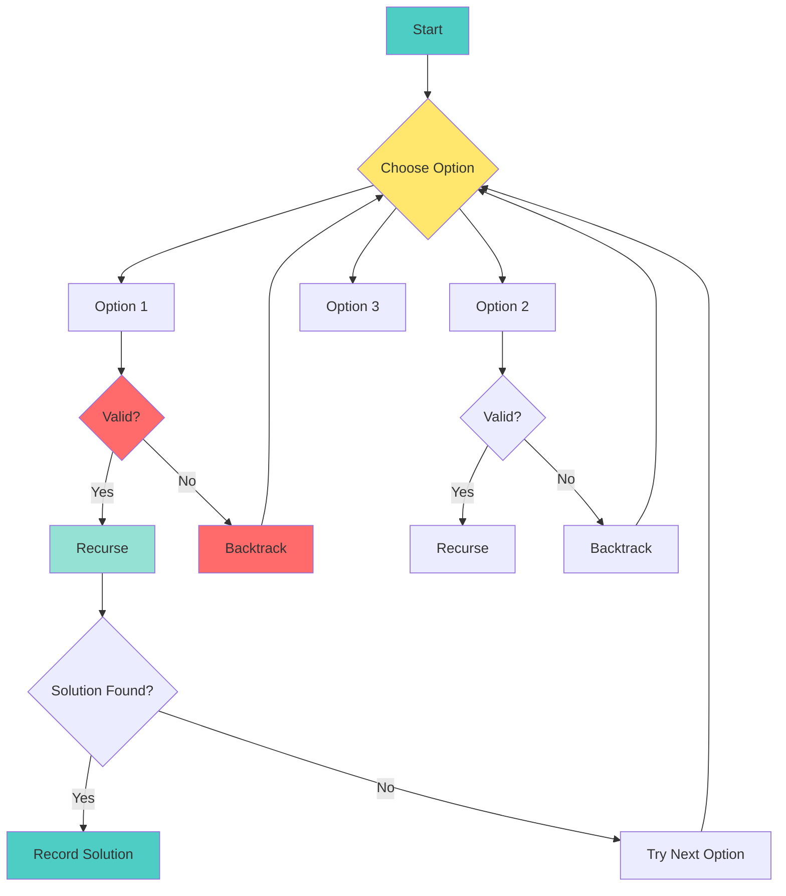

# 📘 **PROBLEM SOLVING MASTERY - Lesson 4: Recursion & Backtracking**

**Date**: 23-03-26
**Level**: 🟢 Beginner → 🔴 FAANG Ready
**Series**: DSA & Interview Preparation
**Time**: 120 minutes
**Prerequisites**: Lesson 1-3 (Fundamentals, Arrays, Hashing)

---

## 🎯 **LEARNING OBJECTIVES**

After completing this **comprehensive** lesson, you will:

1. ✅ **Master Recursion Thinking** - Base case, recursive case, recursion tree
2. ✅ **Understand Call Stack** - How recursion works internally, stack frames
3. ✅ **Master Backtracking Template** - Choose → Explore → Unchoose pattern
4. ✅ **Solve Permutation Problems** - All arrangements, with/without duplicates
5. ✅ **Solve Combination Problems** - Subsets, combinations, partition
6. ✅ **Handle Advanced Patterns** - N-Queens, Sudoku, Word Search, Maze solving

---

## 📦 **PART 1: RECURSION FUNDAMENTALS**

### **How Recursion Works Internally**

```mermaid
sequenceDiagram
    participant Main
    participant Stack as Call Stack
    participant factorial(3)
    participant factorial(2)
    participant factorial(1)
    participant factorial(0)

    Main->>Stack: Call factorial(3)
    Stack->>factorial(3): Push frame
    factorial(3)->>Stack: Call factorial(2)
    Stack->>factorial(2): Push frame
    factorial(2)->>Stack: Call factorial(1)
    Stack->>factorial(1): Push frame
    factorial(1)->>Stack: Call factorial(0)
    Stack->>factorial(0): Push frame
    
    factorial(0)-->>factorial(1): Return 1
    Stack->>factorial(0): Pop frame
    factorial(1)-->>factorial(2): Return 1×1=1
    Stack->>factorial(1): Pop frame
    factorial(2)-->>factorial(3): Return 2×1=2
    Stack->>factorial(2): Pop frame
    factorial(3)-->>Main: Return 3×2=6
    Stack->>factorial(3): Pop frame

    style Main fill:#4ecdc4
    style Stack fill:#ffe66d
    style factorial(0) fill:#ff6b6b
```

---

### **Recursion Tree Visualization**

```mermaid
graph TB
    subgraph "factorial(4) Recursion Tree"
        A[factorial(4)<br/>4 × factorial(3)]
        B[factorial(3)<br/>3 × factorial(2)]
        C[factorial(2)<br/>2 × factorial(1)]
        D[factorial(1)<br/>1 × factorial(0)]
        E[factorial(0)<br/>1]
        
        A --> B
        B --> C
        C --> D
        D --> E
        
        style E fill:#4ecdc4
        style A fill:#ffe66d
    end

    subgraph "Fibonacci(4) Recursion Tree"
        F[fib(4)]
        G[fib(3)]
        H[fib(2)]
        I[fib(2)]
        J[fib(1)]
        K[fib(1)]
        L[fib(0)]
        M[fib(1)]
        N[fib(0)]
        
        F --> G
        F --> H
        G --> I
        G --> J
        H --> K
        H --> L
        I --> M
        I --> N
        
        style F fill:#ffe66d
        style J fill:#4ecdc4
        style K fill:#4ecdc4
        style M fill:#4ecdc4
        style L fill:#4ecdc4
        style N fill:#4ecdc4
    end
```

---

### **Recursion Template**

```javascript
// ─────────────────────────────────────────────
// RECURSION TEMPLATE
// ─────────────────────────────────────────────
function recurse(input) {
  // 1. BASE CASE (stopping condition)
  if (/* simplest case */) {
    return /* base value */;
  }
  
  // 2. RECURSIVE CASE
  // Break problem into smaller subproblem
  const smallerResult = recurse(smallerInput);
  
  // 3. COMBINE results
  return /* combine current + smallerResult */;
}

// ─────────────────────────────────────────────
// EXAMPLE: Factorial
// ─────────────────────────────────────────────
function factorial(n) {
  // Base case: factorial of 0 is 1
  if (n === 0) {
    return 1;
  }
  
  // Recursive case: n! = n × (n-1)!
  return n * factorial(n - 1);
}

// Trace: factorial(4)
// factorial(4) = 4 × factorial(3)
// factorial(3) = 3 × factorial(2)
// factorial(2) = 2 × factorial(1)
// factorial(1) = 1 × factorial(0)
// factorial(0) = 1  ← Base case!
// Return: 1 → 1 → 2 → 6 → 24

// ─────────────────────────────────────────────
// EXAMPLE: Fibonacci
// ─────────────────────────────────────────────
function fibonacci(n) {
  // Base cases
  if (n <= 1) return n;
  if (n === 2) return 1;
  
  // Recursive case: fib(n) = fib(n-1) + fib(n-2)
  return fibonacci(n - 1) + fibonacci(n - 2);
}

// ⚠️ WARNING: This is O(2^n) - very slow!
// fibonacci(40) takes seconds
// fibonacci(50) takes hours

// ─────────────────────────────────────────────
// OPTIMIZED: Fibonacci with Memoization
// ─────────────────────────────────────────────
function fibonacciMemo(n, memo = {}) {
  // Check memo first
  if (n in memo) return memo[n];
  
  // Base cases
  if (n <= 1) return n;
  
  // Recursive case with memoization
  memo[n] = fibonacciMemo(n - 1, memo) + fibonacciMemo(n - 2, memo);
  
  return memo[n];
}
// Time: O(n), Space: O(n)

// ─────────────────────────────────────────────
// EXAMPLE: Sum of Array
// ─────────────────────────────────────────────
function sumArray(arr, index = 0) {
  // Base case: reached end of array
  if (index === arr.length) {
    return 0;
  }
  
  // Recursive case: current + sum of rest
  return arr[index] + sumArray(arr, index + 1);
}

// ─────────────────────────────────────────────
// EXAMPLE: Reverse String
// ─────────────────────────────────────────────
function reverseString(str) {
  // Base case: empty or single character
  if (str.length <= 1) {
    return str;
  }
  
  // Recursive case: last char + reverse of rest
  return str[str.length - 1] + reverseString(str.slice(0, -1));
}

// Trace: reverseString("abc")
// "abc" = "c" + reverseString("ab")
// "ab" = "b" + reverseString("a")
// "a" = "a"  ← Base case
// Return: "a" → "ba" → "cba"
```

---

### **Recursion Patterns**

```javascript
// ─────────────────────────────────────────────
// PATTERN 1: HEAD RECURSION
// ─────────────────────────────────────────────
// Recursive call comes FIRST, then processing
function headRecursion(n) {
  if (n === 0) return;
  
  headRecursion(n - 1);  // Recursive call first
  console.log(n);         // Then process
}

headRecursion(3);
// Output: 1, 2, 3 (ascending order)
// Why? Processing happens during UNWINDING

// ─────────────────────────────────────────────
// PATTERN 2: TAIL RECURSION
// ─────────────────────────────────────────────
// Recursive call comes LAST, nothing after it
function tailRecursion(n, acc = 1) {
  if (n === 0) return acc;
  
  return tailRecursion(n - 1, acc * n);  // Tail call
}

// Some languages optimize this to O(1) space
// JavaScript engines typically don't optimize

// ─────────────────────────────────────────────
// PATTERN 3: TREE RECURSION
// ─────────────────────────────────────────────
// Multiple recursive calls (branches)
function treeRecursion(n) {
  if (n <= 0) return 1;
  
  return treeRecursion(n - 1) + treeRecursion(n - 2);
}
// This creates a tree of calls
// Time: O(2^n), Space: O(n) stack

// ─────────────────────────────────────────────
// PATTERN 4: INDIRECT RECURSION
// ─────────────────────────────────────────────
// Function A calls B, B calls A
function isEven(n) {
  if (n === 0) return true;
  return isOdd(n - 1);
}

function isOdd(n) {
  if (n === 0) return false;
  return isEven(n - 1);
}
```

---

## 📦 **PART 2: BACKTRACKING FUNDAMENTALS**

### **What is Backtracking?**



---

### **Backtracking Template**

```javascript
// ─────────────────────────────────────────────
// UNIVERSAL BACKTRACKING TEMPLATE
// ─────────────────────────────────────────────
function backtrack(input) {
  const result = [];
  
  function dfs(path, options) {
    // 1. BASE CASE: Found a solution
    if (isSolution(path)) {
      result.push([...path]);  // Copy path
      return;
    }
    
    // 2. PRUNING: Skip invalid paths early
    if (shouldPrune(path)) {
      return;
    }
    
    // 3. EXPLORE: Try all options
    for (const option of options) {
      // CHOOSE: Make a choice
      path.push(option);
      
      // EXPLORE: Recurse with updated state
      dfs(path, getNewOptions(option, options));
      
      // UNCHOOSE: Backtrack (undo choice)
      path.pop();
    }
  }
  
  dfs([], input);
  return result;
}

// ─────────────────────────────────────────────
// TEMPLATE VARIATION: WITH USED TRACKING
// ─────────────────────────────────────────────
function backtrackWithUsed(input) {
  const result = [];
  const used = new Array(input.length).fill(false);
  
  function dfs(path) {
    // Base case
    if (path.length === input.length) {
      result.push([...path]);
      return;
    }
    
    // Try each element
    for (let i = 0; i < input.length; i++) {
      // Skip if already used
      if (used[i]) continue;
      
      // Skip duplicates (if sorted)
      if (i > 0 && input[i] === input[i-1] && !used[i-1]) continue;
      
      // Choose
      path.push(input[i]);
      used[i] = true;
      
      // Explore
      dfs(path);
      
      // Unchoose
      path.pop();
      used[i] = false;
    }
  }
  
  dfs([]);
  return result;
}
```

---

## 📦 **PART 3: PERMUTATION PROBLEMS**

### **Permutations Without Duplicates**

```javascript
// ─────────────────────────────────────────────
// PERMUTATIONS - LeetCode 46
// ─────────────────────────────────────────────
function permute(nums) {
  const result = [];
  const used = new Array(nums.length).fill(false);
  
  function backtrack(path) {
    // Base case: permutation complete
    if (path.length === nums.length) {
      result.push([...path]);
      return;
    }
    
    // Try each number
    for (let i = 0; i < nums.length; i++) {
      // Skip if already used
      if (used[i]) continue;
      
      // Choose
      path.push(nums[i]);
      used[i] = true;
      
      // Explore
      backtrack(path);
      
      // Unchoose
      path.pop();
      used[i] = false;
    }
  }
  
  backtrack([]);
  return result;
}

// Example: permute([1, 2, 3])
// Backtracking tree:
// []
// ├── [1]
// │   ├── [1,2]
// │   │   └── [1,2,3] ✓
// │   └── [1,3]
// │       └── [1,3,2] ✓
// ├── [2]
// │   ├── [2,1]
// │   │   └── [2,1,3] ✓
// │   └── [2,3]
// │       └── [2,3,1] ✓
// └── [3]
//     ├── [3,1]
//     │   └── [3,1,2] ✓
//     └── [3,2]
//         └── [3,2,1] ✓

// Time: O(n! × n), Space: O(n)

// ─────────────────────────────────────────────
// PERMUTATIONS - SWAP APPROACH
// ─────────────────────────────────────────────
function permuteSwap(nums) {
  const result = [];
  
  function backtrack(start) {
    // Base case: reached end
    if (start === nums.length) {
      result.push([...nums]);
      return;
    }
    
    // Try swapping each element to current position
    for (let i = start; i < nums.length; i++) {
      // Swap
      [nums[start], nums[i]] = [nums[i], nums[start]];
      
      // Recurse
      backtrack(start + 1);
      
      // Backtrack (swap back)
      [nums[start], nums[i]] = [nums[i], nums[start]];
    }
  }
  
  backtrack(0);
  return result;
}
// Time: O(n! × n), Space: O(n)
// Note: Modifies original array, be careful!
```

---

### **Permutations With Duplicates**

```javascript
// ─────────────────────────────────────────────
// PERMUTATIONS II - With Duplicates
// ─────────────────────────────────────────────
// LeetCode 47
function permuteUnique(nums) {
  const result = [];
  const used = new Array(nums.length).fill(false);
  
  // Sort to group duplicates together
  nums.sort((a, b) => a - b);
  
  function backtrack(path) {
    // Base case
    if (path.length === nums.length) {
      result.push([...path]);
      return;
    }
    
    for (let i = 0; i < nums.length; i++) {
      // Skip used elements
      if (used[i]) continue;
      
      // Skip duplicates: only use first unused occurrence
      if (i > 0 && nums[i] === nums[i - 1] && !used[i - 1]) {
        continue;
      }
      
      // Choose
      path.push(nums[i]);
      used[i] = true;
      
      // Explore
      backtrack(path);
      
      // Unchoose
      path.pop();
      used[i] = false;
    }
  }
  
  backtrack([]);
  return result;
}

// Key insight for duplicate handling:
// When we have [1, 1, 2], after sorting:
// - First 1: use it, explore, backtrack
// - Second 1: skip (because first 1 is not used)
// This prevents generating duplicate permutations

// Time: O(n! × n), Space: O(n)
```

---

## 📦 **PART 4: COMBINATION PROBLEMS**

### **Subsets (Power Set)**

```javascript
// ─────────────────────────────────────────────
// SUBSETS - LeetCode 78
// ─────────────────────────────────────────────
function subsets(nums) {
  const result = [];
  
  function backtrack(start, path) {
    // Add current subset (every node in tree is valid)
    result.push([...path]);
    
    // Explore remaining elements
    for (let i = start; i < nums.length; i++) {
      // Choose
      path.push(nums[i]);
      
      // Explore (note: i+1, not start+1)
      backtrack(i + 1, path);
      
      // Unchoose
      path.pop();
    }
  }
  
  backtrack(0, []);
  return result;
}

// Backtracking tree for [1,2,3]:
// []
// ├── [1]
// │   ├── [1,2]
// │   │   └── [1,2,3]
// │   └── [1,3]
// └── [2]
//     └── [2,3]
// Plus: [3]

// Time: O(2^n × n), Space: O(n)

// ─────────────────────────────────────────────
// SUBSETS II - With Duplicates
// ─────────────────────────────────────────────
// LeetCode 90
function subsetsWithDup(nums) {
  const result = [];
  nums.sort((a, b) => a - b);  // Sort for duplicate handling
  
  function backtrack(start, path) {
    result.push([...path]);
    
    for (let i = start; i < nums.length; i++) {
      // Skip duplicates at same level
      if (i > start && nums[i] === nums[i - 1]) continue;
      
      path.push(nums[i]);
      backtrack(i + 1, path);
      path.pop();
    }
  }
  
  backtrack(0, []);
  return result;
}

// Key difference from permutations:
// - Permutations: skip if !used[i-1] (previous not used)
// - Subsets: skip if i > start (same level duplicate)
```

---

### **Combinations**

```javascript
// ─────────────────────────────────────────────
// COMBINATIONS - LeetCode 77
// ─────────────────────────────────────────────
function combine(n, k) {
  const result = [];
  
  function backtrack(start, path) {
    // Base case: k elements selected
    if (path.length === k) {
      result.push([...path]);
      return;
    }
    
    // Pruning: not enough elements left
    // Need k - path.length more, so i can go up to n - (k - path.length) + 1
    for (let i = start; i <= n - (k - path.length) + 1; i++) {
      path.push(i);
      backtrack(i + 1, path);
      path.pop();
    }
  }
  
  backtrack(1, []);
  return result;
}

// Example: combine(4, 2)
// Output: [[1,2], [1,3], [1,4], [2,3], [2,4], [3,4]]
// Time: O(C(n,k) × k) where C(n,k) is binomial coefficient

// ─────────────────────────────────────────────
// COMBINATION SUM - LeetCode 39
// ─────────────────────────────────────────────
function combinationSum(candidates, target) {
  const result = [];
  
  function backtrack(start, path, sum) {
    // Base case: found valid combination
    if (sum === target) {
      result.push([...path]);
      return;
    }
    
    // Pruning: sum exceeded target
    if (sum > target) return;
    
    for (let i = start; i < candidates.length; i++) {
      path.push(candidates[i]);
      
      // Note: i (not i+1) because we can reuse same element
      backtrack(i, path, sum + candidates[i]);
      
      path.pop();
    }
  }
  
  backtrack(0, [], 0);
  return result;
}

// ─────────────────────────────────────────────
// COMBINATION SUM II - Each element once
// ─────────────────────────────────────────────
// LeetCode 40
function combinationSum2(candidates, target) {
  const result = [];
  candidates.sort((a, b) => a - b);  // Sort for duplicate handling
  
  function backtrack(start, path, sum) {
    if (sum === target) {
      result.push([...path]);
      return;
    }
    
    if (sum > target) return;
    
    for (let i = start; i < candidates.length; i++) {
      // Skip duplicates at same level
      if (i > start && candidates[i] === candidates[i - 1]) continue;
      
      path.push(candidates[i]);
      backtrack(i + 1, path, sum + candidates[i]);  // i+1 (can't reuse)
      path.pop();
    }
  }
  
  backtrack(0, [], 0);
  return result;
}

// ─────────────────────────────────────────────
// COMBINATION SUM III - K numbers sum to N
// ─────────────────────────────────────────────
// LeetCode 216
function combinationSum3(k, n) {
  const result = [];
  
  function backtrack(start, path, sum) {
    if (path.length === k && sum === n) {
      result.push([...path]);
      return;
    }
    
    if (path.length >= k || sum >= n) return;
    
    for (let i = start; i <= 9; i++) {
      path.push(i);
      backtrack(i + 1, path, sum + i);
      path.pop();
    }
  }
  
  backtrack(1, [], 0);
  return result;
}

// Example: combinationSum3(3, 7)
// Output: [[1,2,4]]
```

---

## 📦 **PART 5: ADVANCED BACKTRACKING**

### **N-Queens Problem**

```javascript
// ─────────────────────────────────────────────
// N-QUEENS - LeetCode 51
// ─────────────────────────────────────────────
function solveNQueens(n) {
  const result = [];
  const board = Array.from({ length: n }, () => Array(n).fill('.'));
  
  // Track attacked positions
  const cols = new Set();
  const diag1 = new Set();  // row - col (main diagonal)
  const diag2 = new Set();  // row + col (anti-diagonal)
  
  function backtrack(row) {
    // Base case: all queens placed
    if (row === n) {
      result.push(board.map(r => r.join('')));
      return;
    }
    
    for (let col = 0; col < n; col++) {
      // Skip if under attack
      if (cols.has(col) || diag1.has(row - col) || diag2.has(row + col)) {
        continue;
      }
      
      // Place queen
      board[row][col] = 'Q';
      cols.add(col);
      diag1.add(row - col);
      diag2.add(row + col);
      
      // Recurse to next row
      backtrack(row + 1);
      
      // Backtrack (remove queen)
      board[row][col] = '.';
      cols.delete(col);
      diag1.delete(row - col);
      diag2.delete(row + col);
    }
  }
  
  backtrack(0);
  return result;
}

// Diagonal explanation:
// Main diagonal (↘): row - col is constant
// Anti-diagonal (↙): row + col is constant

// Time: O(n!), Space: O(n)
```

---

### **Sudoku Solver**

```javascript
// ─────────────────────────────────────────────
// SUDOKU SOLVER - LeetCode 37
// ─────────────────────────────────────────────
function solveSudoku(board) {
  const rows = Array.from({ length: 9 }, () => new Set());
  const cols = Array.from({ length: 9 }, () => new Set());
  const boxes = Array.from({ length: 9 }, () => new Set());
  
  // Initialize trackers
  for (let r = 0; r < 9; r++) {
    for (let c = 0; c < 9; c++) {
      const val = board[r][c];
      if (val !== '.') {
        rows[r].add(val);
        cols[c].add(val);
        boxes[Math.floor(r / 3) * 3 + Math.floor(c / 3)].add(val);
      }
    }
  }
  
  function backtrack(row, col) {
    // Base case: solved
    if (row === 9) return true;
    
    // Move to next cell
    const nextRow = col === 8 ? row + 1 : row;
    const nextCol = col === 8 ? 0 : col + 1;
    
    // Skip filled cells
    if (board[row][col] !== '.') {
      return backtrack(nextRow, nextCol);
    }
    
    // Try digits 1-9
    const boxIdx = Math.floor(row / 3) * 3 + Math.floor(col / 3);
    
    for (let num = 1; num <= 9; num++) {
      const numStr = num.toString();
      
      // Check if valid
      if (rows[row].has(numStr) || cols[col].has(numStr) || boxes[boxIdx].has(numStr)) {
        continue;
      }
      
      // Place digit
      board[row][col] = numStr;
      rows[row].add(numStr);
      cols[col].add(numStr);
      boxes[boxIdx].add(numStr);
      
      // Recurse
      if (backtrack(nextRow, nextCol)) return true;
      
      // Backtrack
      board[row][col] = '.';
      rows[row].delete(numStr);
      cols[col].delete(numStr);
      boxes[boxIdx].delete(numStr);
    }
    
    return false;
  }
  
  backtrack(0, 0);
}

// Time: O(9^(n×n)), Space: O(n×n)
```

---

### **Word Search**

```javascript
// ─────────────────────────────────────────────
// WORD SEARCH - LeetCode 79
// ─────────────────────────────────────────────
function exist(board, word) {
  const rows = board.length;
  const cols = board[0].length;
  const visited = Array.from({ length: rows }, () => Array(cols).fill(false));
  
  function backtrack(row, col, index) {
    // Base case: found entire word
    if (index === word.length) return true;
    
    // Out of bounds or mismatch
    if (row < 0 || row >= rows || col < 0 || col >= cols) return false;
    if (visited[row][col]) return false;
    if (board[row][col] !== word[index]) return false;
    
    // Mark visited
    visited[row][col] = true;
    
    // Explore 4 directions
    const found = backtrack(row + 1, col, index + 1) ||
                  backtrack(row - 1, col, index + 1) ||
                  backtrack(row, col + 1, index + 1) ||
                  backtrack(row, col - 1, index + 1);
    
    // Backtrack (unmark)
    visited[row][col] = false;
    
    return found;
  }
  
  // Try starting from each cell
  for (let r = 0; r < rows; r++) {
    for (let c = 0; c < cols; c++) {
      if (backtrack(r, c, 0)) return true;
    }
  }
  
  return false;
}

// Time: O(m × n × 4^L) where L = word length
// Space: O(L) for recursion stack
```

---

### **Palindrome Partitioning**

```javascript
// ─────────────────────────────────────────────
// PALINDROME PARTITIONING - LeetCode 131
// ─────────────────────────────────────────────
function partition(s) {
  const result = [];
  
  function isPalindrome(str, start, end) {
    while (start < end) {
      if (str[start] !== str[end]) return false;
      start++;
      end--;
    }
    return true;
  }
  
  function backtrack(start, path) {
    // Base case: reached end of string
    if (start === s.length) {
      result.push([...path]);
      return;
    }
    
    // Try all possible substrings
    for (let end = start; end < s.length; end++) {
      // Only recurse if palindrome
      if (isPalindrome(s, start, end)) {
        path.push(s.substring(start, end + 1));
        backtrack(end + 1, path);
        path.pop();
      }
    }
  }
  
  backtrack(0, []);
  return result;
}

// Example: partition("aab")
// Output: [["a","a","b"], ["aa","b"]]

// Time: O(n × 2^n), Space: O(n)
```

---

## 📦 **PART 6: OPTIMIZATION TECHNIQUES**

### **Memoization for Recursion**

```javascript
// ─────────────────────────────────────────────
// MEMOIZATION PATTERN
// ─────────────────────────────────────────────
function recurseWithMemo(n, memo = {}) {
  // Check memo first
  if (n in memo) return memo[n];
  
  // Base case
  if (n <= 1) return n;
  
  // Recursive case with memoization
  memo[n] = recurseWithMemo(n - 1, memo) + recurseWithMemo(n - 2, memo);
  
  return memo[n];
}

// ─────────────────────────────────────────────
// CLIMBING STAIRS - LeetCode 70
// ─────────────────────────────────────────────
// Without memo: O(2^n)
// With memo: O(n)
function climbStairs(n, memo = {}) {
  if (n in memo) return memo[n];
  if (n <= 2) return n;
  
  memo[n] = climbStairs(n - 1, memo) + climbStairs(n - 2, memo);
  return memo[n];
}

// ─────────────────────────────────────────────
// HOUSE ROBBER - LeetCode 198
// ─────────────────────────────────────────────
function rob(nums, index = 0, memo = {}) {
  if (index >= nums.length) return 0;
  if (index in memo) return memo[index];
  
  // Choice: rob current + skip next, OR skip current
  const robCurrent = nums[index] + rob(nums, index + 2, memo);
  const skipCurrent = rob(nums, index + 1, memo);
  
  memo[index] = Math.max(robCurrent, skipCurrent);
  return memo[index];
}
```

---

### **Pruning Techniques**

```javascript
// ─────────────────────────────────────────────
// PRUNING: Early Termination
// ─────────────────────────────────────────────
function combinationSum(candidates, target) {
  const result = [];
  candidates.sort((a, b) => b - a);  // Sort descending for better pruning
  
  function backtrack(start, path, sum) {
    // Pruning: sum exceeded target
    if (sum > target) return;
    
    // Pruning: even if we add all remaining, can't reach target
    const maxPossible = sum + (target - path.length) * candidates[start];
    if (maxPossible < target) return;
    
    if (sum === target) {
      result.push([...path]);
      return;
    }
    
    for (let i = start; i < candidates.length; i++) {
      path.push(candidates[i]);
      backtrack(i, path, sum + candidates[i]);
      path.pop();
    }
  }
  
  backtrack(0, [], 0);
  return result;
}

// ─────────────────────────────────────────────
// PRUNING: Skip Impossible Branches
// ─────────────────────────────────────────────
function subsetsWithTargetSum(nums, target) {
  const result = [];
  nums.sort((a, b) => a - b);
  
  function backtrack(start, path, sum) {
    if (sum === target) {
      result.push([...path]);
      return;
    }
    
    for (let i = start; i < nums.length; i++) {
      // Pruning: adding this would exceed target
      if (sum + nums[i] > target) break;  // Not continue! (sorted)
      
      // Pruning: skip duplicates
      if (i > start && nums[i] === nums[i - 1]) continue;
      
      path.push(nums[i]);
      backtrack(i + 1, path, sum + nums[i]);
      path.pop();
    }
  }
  
  backtrack(0, [], 0);
  return result;
}
```

---

## ✅ **RECURSION & BACKTRACKING CHECKLIST**

```
Recursion Fundamentals
[ ] Understand base case and recursive case
[ ] Trace recursion trees
[ ] Identify head vs tail recursion
[ ] Apply memoization

Backtracking Template
[ ] Choose → Explore → Unchoose pattern
[ ] Handle duplicates correctly
[ ] Apply pruning for optimization

Permutation Problems
[ ] Permutations without duplicates
[ ] Permutations with duplicates
[ ] Understand used[] array pattern

Combination Problems
[ ] Subsets (power set)
[ ] Combinations (k elements)
[ ] Combination Sum variants

Advanced Problems
[ ] N-Queens
[ ] Sudoku Solver
[ ] Word Search
[ ] Palindrome Partitioning
```

---

## 🎯 **KNOWLEDGE CHECK**

### **Question 1: Recursion Tree**

Draw the recursion tree for `fibonacci(4)` and count total calls.

<details>
<summary>💡 Click to reveal answer</summary>

```
                    fib(4)
                   /      \
              fib(3)      fib(2)
             /     \      /     \
         fib(2)  fib(1) fib(1) fib(0)
        /     \
    fib(1)  fib(0)
```

**Total calls**: 9 calls (including the initial call)
**Time complexity**: O(2^n)
</details>

---

### **Question 2: Backtracking Pattern**

What's the key difference between permutation and combination backtracking?

<details>
<summary>💡 Click to reveal answer</summary>

**Permutations**: Order matters, use `used[]` array, recurse with `backtrack(path)`

**Combinations**: Order doesn't matter, use `start` index, recurse with `backtrack(i + 1, path)`

```javascript
// Permutation
for (let i = 0; i < nums.length; i++) {
  if (used[i]) continue;
  path.push(nums[i]);
  used[i] = true;
  backtrack(path);  // Start from beginning
  path.pop();
  used[i] = false;
}

// Combination
for (let i = start; i < nums.length; i++) {
  path.push(nums[i]);
  backtrack(i + 1, path);  // Start from next
  path.pop();
}
```
</details>

---

## 📚 **PRACTICE PROBLEMS**

### **Easy**
- Fibonacci Number (LeetCode 509)
- Climbing Stairs (LeetCode 70)
- Pascal's Triangle (LeetCode 118)

### **Medium**
- Permutations (LeetCode 46)
- Subsets (LeetCode 78)
- Combination Sum (LeetCode 39)
- Word Search (LeetCode 79)
- Generate Parentheses (LeetCode 22)

### **Hard**
- N-Queens (LeetCode 51)
- Sudoku Solver (LeetCode 37)
- Permutations II (LeetCode 47)
- Palindrome Partitioning II (LeetCode 132)

---

## 🎓 **HOMEWORK**

1. ✅ Solve 10 permutation/combination problems
2. ✅ Implement all backtracking templates from memory
3. ✅ Draw recursion trees for 5 problems
4. ✅ Solve N-Queens and Sudoku without looking
5. ✅ Time yourself: 3 medium problems in 60 minutes

---

**Next Lesson**: Linked Lists - Fast/Slow Pointers, Reversal, Cycle Detection
**Date**: 23-03-26
**Status**: ✅ Complete

---
-23-03-26
